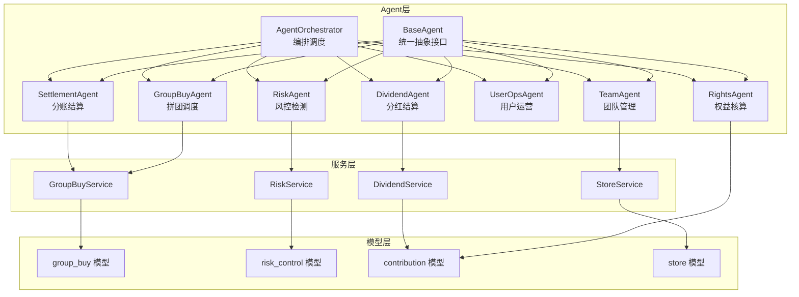
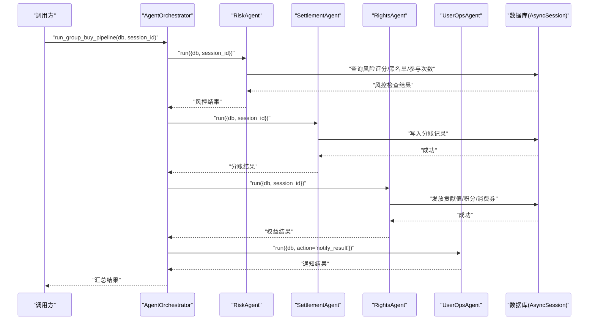
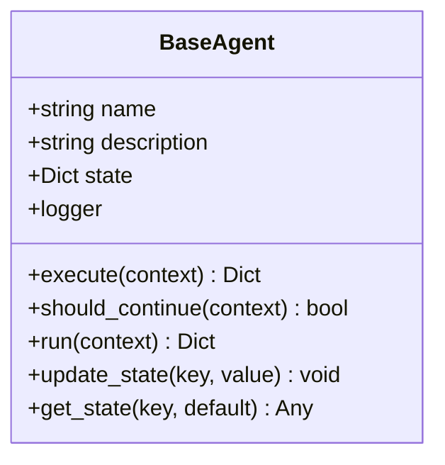
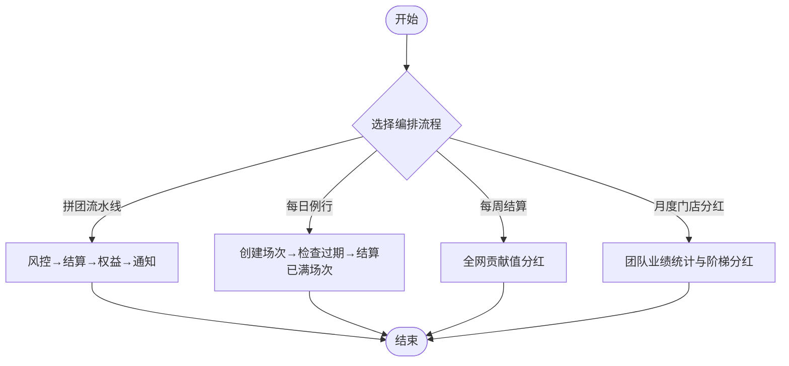
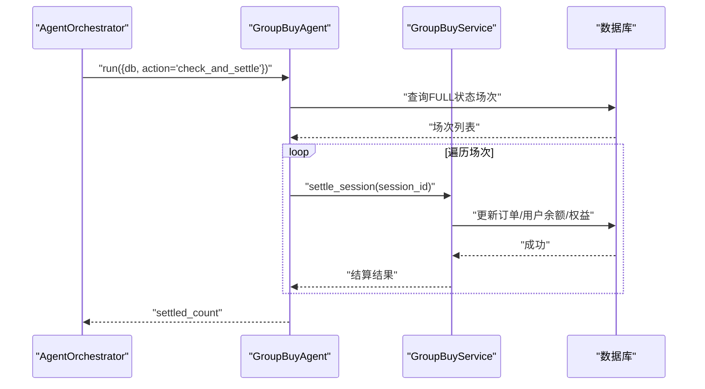
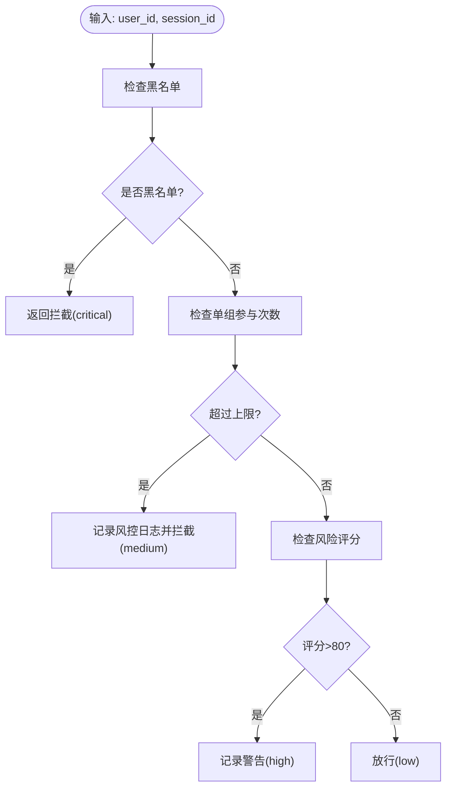
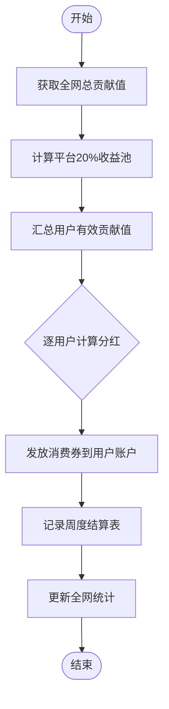
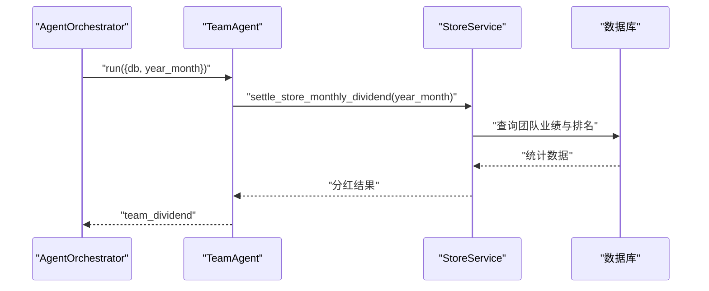
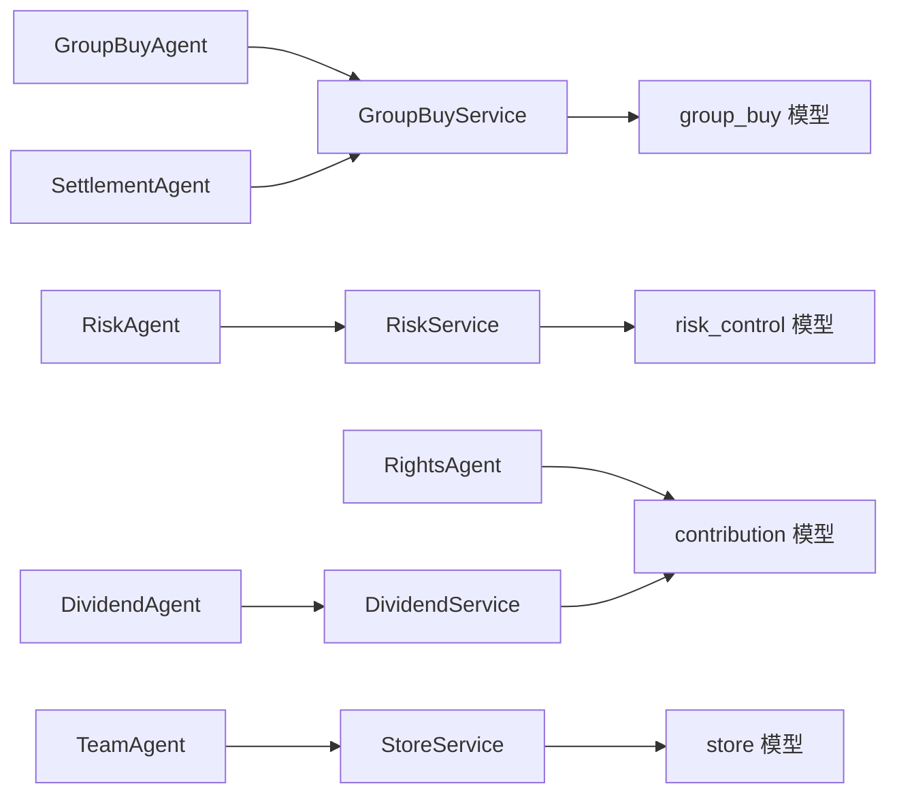

# AI Agent智能系统

<cite>
**本文引用的文件**
- [backend/app/agents/base_agent.py](file://backend/app/agents/base_agent.py)
- [backend/app/agents/agent_orchestrator.py](file://backend/app/agents/agent_orchestrator.py)
- [backend/app/agents/group_buy_agent.py](file://backend/app/agents/group_buy_agent.py)
- [backend/app/agents/all_agents.py](file://backend/app/agents/all_agents.py)
- [backend/app/services/risk_service.py](file://backend/app/services/risk_service.py)
- [backend/app/services/dividend_service.py](file://backend/app/services/dividend_service.py)
- [backend/app/services/store_service.py](file://backend/app/services/store_service.py)
- [backend/app/services/group_buy_service.py](file://backend/app/services/group_buy_service.py)
- [backend/app/models/risk_control.py](file://backend/app/models/risk_control.py)
- [backend/app/models/contribution.py](file://backend/app/models/contribution.py)
- [backend/app/models/store.py](file://backend/app/models/store.py)
- [backend/app/models/group_buy.py](file://backend/app/models/group_buy.py)
</cite>

## 目录
1. [简介](#简介)
2. [项目结构](#项目结构)
3. [核心组件](#核心组件)
4. [架构总览](#架构总览)
5. [详细组件分析](#详细组件分析)
6. [依赖关系分析](#依赖关系分析)
7. [性能与可扩展性](#性能与可扩展性)
8. [故障排查指南](#故障排查指南)
9. [结论](#结论)
10. [附录：新Agent开发指南](#附录新agent开发指南)

## 简介
本技术文档面向AIxingmu的AI Agent智能系统，聚焦基于LangGraph思想的Agent状态机与编排器设计。系统通过统一的BaseAgent抽象接口、AgentOrchestrator编排器调度逻辑，将7大专业Agent（拼团分析、风控检测、分红计算、门店管理、商品推荐、用户画像、数据分析）进行解耦与协作。文档深入解析各Agent的职责边界、数据传递机制、状态管理与错误处理策略，并提供新Agent开发全流程指南以及调试、监控与日志最佳实践。

## 项目结构
后端采用分层组织：
- agents：定义Agent基类与各专业Agent实现，以及编排器
- services：封装领域服务（风控、分红、门店、拼团等）
- models：数据库模型（风控、贡献值、门店、拼团等）
- api：对外API层（不在本次重点范围内）
- tasks：异步任务（Celery相关，不在本次重点范围内）

图表来源
- [backend/app/agents/base_agent.py:12-47](file://backend/app/agents/base_agent.py#L12-L47)
- [backend/app/agents/agent_orchestrator.py:18-94](file://backend/app/agents/agent_orchestrator.py#L18-L94)
- [backend/app/agents/group_buy_agent.py:15-67](file://backend/app/agents/group_buy_agent.py#L15-L67)
- [backend/app/agents/all_agents.py:7-114](file://backend/app/agents/all_agents.py#L7-L114)
- [backend/app/services/group_buy_service.py:17-348](file://backend/app/services/group_buy_service.py#L17-L348)
- [backend/app/services/risk_service.py:14-135](file://backend/app/services/risk_service.py#L14-L135)
- [backend/app/services/dividend_service.py:16-136](file://backend/app/services/dividend_service.py#L16-L136)
- [backend/app/services/store_service.py:15-161](file://backend/app/services/store_service.py#L15-L161)
- [backend/app/models/group_buy.py:42-158](file://backend/app/models/group_buy.py#L42-L158)
- [backend/app/models/risk_control.py:40-85](file://backend/app/models/risk_control.py#L40-L85)
- [backend/app/models/contribution.py:32-115](file://backend/app/models/contribution.py#L32-L115)
- [backend/app/models/store.py:22-104](file://backend/app/models/store.py#L22-L104)

章节来源
- [backend/app/agents/base_agent.py:12-47](file://backend/app/agents/base_agent.py#L12-L47)
- [backend/app/agents/agent_orchestrator.py:18-94](file://backend/app/agents/agent_orchestrator.py#L18-L94)

## 核心组件
- BaseAgent：提供统一的Agent生命周期与状态管理，包括execute、should_continue、run、update_state/get_state等能力，并内置结构化日志记录与异常捕获。
- AgentOrchestrator：集中注册与管理7大Agent，提供流水线与定时任务编排方法，如拼团流水线、每日例行、每周结算、月度门店分红等。
- 专业Agent：
  - GroupBuyAgent：负责场次创建、过期处理、满员结算触发等调度动作。
  - SettlementAgent：订单完成后按固定比例计算各方收益并写入结算记录。
  - RightsAgent：根据拼团结果发放贡献值、积分、消费券等权益。
  - DividendAgent：每周一执行全网贡献值分红。
  - UserOpsAgent：推送开团信息、规则解答、用户激活等运营动作。
  - TeamAgent：统计四级团队业绩、排名与阶梯分红。
  - RiskAgent：实时校验限购、异常操作、违规开团并自动拦截。

章节来源
- [backend/app/agents/base_agent.py:12-47](file://backend/app/agents/base_agent.py#L12-L47)
- [backend/app/agents/agent_orchestrator.py:18-94](file://backend/app/agents/agent_orchestrator.py#L18-L94)
- [backend/app/agents/group_buy_agent.py:15-67](file://backend/app/agents/group_buy_agent.py#L15-L67)
- [backend/app/agents/all_agents.py:7-114](file://backend/app/agents/all_agents.py#L7-L114)

## 架构总览
整体采用“Agent + Service + Model”的分层架构。Agent作为业务入口，调用Service完成领域逻辑，Service读写Model持久化数据。编排器负责跨Agent的流程编排与上下文传递。

图表来源
- [backend/app/agents/agent_orchestrator.py:32-52](file://backend/app/agents/agent_orchestrator.py#L32-L52)
- [backend/app/agents/all_agents.py:101-114](file://backend/app/agents/all_agents.py#L101-L114)
- [backend/app/agents/all_agents.py:7-22](file://backend/app/agents/all_agents.py#L7-L22)
- [backend/app/agents/all_agents.py:29-46](file://backend/app/agents/all_agents.py#L29-L46)
- [backend/app/agents/all_agents.py:66-77](file://backend/app/agents/all_agents.py#L66-L77)
- [backend/app/services/risk_service.py:18-74](file://backend/app/services/risk_service.py#L18-L74)

## 详细组件分析

### BaseAgent抽象接口
- 职责：定义Agent的统一行为契约，提供运行外壳、状态容器与日志。
- 关键方法：
  - execute(context)：子类必须实现的核心逻辑。
  - should_continue(context)：决定是否继续执行（当前多数Agent返回False）。
  - run(context)：包装execute的执行流程，统一记录开始/结束日志与异常。
  - update_state/get_state：维护Agent内部状态字典。
- 错误处理：在run中捕获异常并返回标准化错误响应。

图表来源
- [backend/app/agents/base_agent.py:12-47](file://backend/app/agents/base_agent.py#L12-L47)

章节来源
- [backend/app/agents/base_agent.py:12-47](file://backend/app/agents/base_agent.py#L12-L47)

### AgentOrchestrator编排器
- 职责：集中注册Agent实例，提供多场景流水线与定时任务编排。
- 主要编排方法：
  - run_group_buy_pipeline：风控→结算→权益→通知。
  - run_daily_routine：创建场次、检查过期、结算已满场次。
  - run_weekly_settlement：每周一分红结算。
  - run_monthly_store_dividend：月度门店阶梯分红。
- 状态与可观测性：get_agent_status用于获取所有Agent描述信息。

图表来源
- [backend/app/agents/agent_orchestrator.py:32-85](file://backend/app/agents/agent_orchestrator.py#L32-L85)

章节来源
- [backend/app/agents/agent_orchestrator.py:18-94](file://backend/app/agents/agent_orchestrator.py#L18-L94)

### GroupBuyAgent（拼团调度）
- 职责：定时触发开团、检查人数、匹配板块、核验订单、判定结果、触发分账。
- 关键动作：
  - create_sessions：创建每日固定场次（每小时3个级别）。
  - check_and_settle：查找已满场次并结算。
  - check_expired：处理过期场次。
- 数据流：读取GroupBuySession与Order状态，调用GroupBuyService进行结算。

图表来源
- [backend/app/agents/group_buy_agent.py:31-46](file://backend/app/agents/group_buy_agent.py#L31-L46)
- [backend/app/services/group_buy_service.py:184-321](file://backend/app/services/group_buy_service.py#L184-L321)

章节来源
- [backend/app/agents/group_buy_agent.py:15-67](file://backend/app/agents/group_buy_agent.py#L15-L67)
- [backend/app/services/group_buy_service.py:17-348](file://backend/app/services/group_buy_service.py#L17-L348)
- [backend/app/models/group_buy.py:42-158](file://backend/app/models/group_buy.py#L42-L158)

### RiskAgent（风控检测）
- 职责：实时监控限购、异常操作、违规开团，自动拦截或警告。
- 核心规则：
  - 黑名单检查。
  - 单组参与次数上限。
  - 用户风险评分阈值。
- 输出：允许/拦截/警告及风险等级。

图表来源
- [backend/app/services/risk_service.py:18-74](file://backend/app/services/risk_service.py#L18-L74)
- [backend/app/models/risk_control.py:40-85](file://backend/app/models/risk_control.py#L40-L85)

章节来源
- [backend/app/agents/all_agents.py:101-114](file://backend/app/agents/all_agents.py#L101-L114)
- [backend/app/services/risk_service.py:14-135](file://backend/app/services/risk_service.py#L14-L135)
- [backend/app/models/risk_control.py:1-85](file://backend/app/models/risk_control.py#L1-L85)

### DividendAgent（分红计算）
- 职责：每周一执行全网贡献值分红，按个人贡献值占比分配平台20%收益池。
- 关键步骤：
  - 获取全网总贡献值与平台收益池。
  - 汇总用户有效贡献值。
  - 计算并发放消费券，记录周度结算与全局统计。

图表来源
- [backend/app/services/dividend_service.py:20-123](file://backend/app/services/dividend_service.py#L20-L123)
- [backend/app/models/contribution.py:72-115](file://backend/app/models/contribution.py#L72-L115)

章节来源
- [backend/app/agents/all_agents.py:52-63](file://backend/app/agents/all_agents.py#L52-L63)
- [backend/app/services/dividend_service.py:16-136](file://backend/app/services/dividend_service.py#L16-L136)
- [backend/app/models/contribution.py:32-115](file://backend/app/models/contribution.py#L32-L115)

### TeamAgent（门店管理）
- 职责：统计四级团队业绩、排名、核算阶梯分红。
- 关键能力：
  - 更新门店月度业绩。
  - 获取团队成员与门店排名。
  - 调用结算服务进行月度分红。

图表来源
- [backend/app/agents/all_agents.py:83-94](file://backend/app/agents/all_agents.py#L83-L94)
- [backend/app/services/store_service.py:55-99](file://backend/app/services/store_service.py#L55-L99)
- [backend/app/models/store.py:83-104](file://backend/app/models/store.py#L83-L104)

章节来源
- [backend/app/agents/all_agents.py:79-94](file://backend/app/agents/all_agents.py#L79-L94)
- [backend/app/services/store_service.py:15-161](file://backend/app/services/store_service.py#L15-L161)
- [backend/app/models/store.py:22-104](file://backend/app/models/store.py#L22-L104)

### SettlementAgent（分账结算）
- 职责：订单完成后按固定比例计算各方收益并写入结算记录。
- 输入：session_id、amount、winner_id、store_id等。
- 输出：已生成结算记录数量。

章节来源
- [backend/app/agents/all_agents.py:7-22](file://backend/app/agents/all_agents.py#L7-L22)

### RightsAgent（权益核算）
- 职责：根据拼团结果计算贡献值/积分/消费券并发放到用户账户。
- 输入：amount、consumer_id、source、session_id等。
- 输出：生成的权益记录数量。

章节来源
- [backend/app/agents/all_agents.py:29-46](file://backend/app/agents/all_agents.py#L29-L46)
- [backend/app/models/contribution.py:32-70](file://backend/app/models/contribution.py#L32-L70)

### UserOpsAgent（用户运营）
- 职责：推送开团信息、规则解答、用户激活等运营动作。
- 特点：预留LLM集成点，支持对话与推送逻辑扩展。

章节来源
- [backend/app/agents/all_agents.py:66-77](file://backend/app/agents/all_agents.py#L66-L77)

## 依赖关系分析
- Agent对Service的依赖：
  - GroupBuyAgent → GroupBuyService
  - RiskAgent → RiskService
  - DividendAgent → DividendService
  - TeamAgent → StoreService
  - SettlementAgent/RightsAgent → 对应结算与权益服务
- Service对Model的依赖：
  - GroupBuyService → group_buy模型
  - RiskService → risk_control模型
  - DividendService → contribution模型
  - StoreService → store模型

图表来源
- [backend/app/agents/group_buy_agent.py:15-67](file://backend/app/agents/group_buy_agent.py#L15-L67)
- [backend/app/agents/all_agents.py:7-114](file://backend/app/agents/all_agents.py#L7-L114)
- [backend/app/services/group_buy_service.py:17-348](file://backend/app/services/group_buy_service.py#L17-L348)
- [backend/app/services/risk_service.py:14-135](file://backend/app/services/risk_service.py#L14-L135)
- [backend/app/services/dividend_service.py:16-136](file://backend/app/services/dividend_service.py#L16-L136)
- [backend/app/services/store_service.py:15-161](file://backend/app/services/store_service.py#L15-L161)
- [backend/app/models/group_buy.py:42-158](file://backend/app/models/group_buy.py#L42-L158)
- [backend/app/models/risk_control.py:40-85](file://backend/app/models/risk_control.py#L40-L85)
- [backend/app/models/contribution.py:32-115](file://backend/app/models/contribution.py#L32-L115)
- [backend/app/models/store.py:22-104](file://backend/app/models/store.py#L22-L104)

章节来源
- [backend/app/agents/agent_orchestrator.py:18-94](file://backend/app/agents/agent_orchestrator.py#L18-L94)

## 性能与可扩展性
- 批处理与分页：
  - 风控日志与门店列表等方法使用offset/limit分页，避免一次性加载大量数据。
- 事务与一致性：
  - 结算流程涉及多表更新，建议在Service层使用事务包裹，确保原子性与回滚。
- 并发与锁：
  - 场次满员判定与订单锁定需考虑并发竞争，建议引入行级锁或乐观锁策略。
- 指标与监控：
  - 为关键路径添加耗时统计与成功率指标，结合分布式追踪定位瓶颈。
- 可扩展性：
  - 新增Agent仅需继承BaseAgent并在编排器注册，保持低耦合与高内聚。

[本节为通用指导，不直接分析具体文件]

## 故障排查指南
- 日志定位：
  - BaseAgent.run统一记录开始/结束与异常信息，优先从agent.{name}日志入手。
- 常见错误：
  - 场次状态异常：检查SessionStatus流转是否符合预期。
  - 风控拦截：查看RiskControlLog与UserRiskScore，确认规则阈值与事件类型。
  - 分红计算异常：核对GlobalContribStats与ContribWeeklySettlement数据一致性。
- 诊断步骤：
  - 复现问题并收集上下文参数（user_id、session_id、year_month等）。
  - 检查相关表的索引与约束，确认查询性能与数据完整性。
  - 针对高风险路径增加断点与中间结果落库，便于回溯。

章节来源
- [backend/app/agents/base_agent.py:31-41](file://backend/app/agents/base_agent.py#L31-L41)
- [backend/app/services/risk_service.py:110-135](file://backend/app/services/risk_service.py#L110-L135)
- [backend/app/models/risk_control.py:40-85](file://backend/app/models/risk_control.py#L40-L85)

## 结论
AI Agent智能系统以BaseAgent抽象与AgentOrchestrator编排为核心，实现了7大专业Agent的解耦协作。通过清晰的数据流与状态管理，系统在拼团、风控、分红、门店管理等关键业务场景中具备高可用与可扩展性。后续可在用户画像与数据分析Agent上进一步融合LLM能力，提升智能化水平。

[本节为总结性内容，不直接分析具体文件]

## 附录：新Agent开发指南
- 步骤一：继承BaseAgent
  - 新建类继承BaseAgent，实现execute与should_continue方法。
  - 在__init__中设置name与description，便于编排器注册与状态查询。
- 步骤二：实现execute方法
  - 从context中提取必要参数（如db、业务ID等）。
  - 调用相应Service完成领域逻辑，返回标准化结果字典。
  - 注意异常处理与日志记录，必要时抛出异常由BaseAgent.run统一捕获。
- 步骤三：注册到编排器
  - 在AgentOrchestrator.__init__中添加新Agent实例。
  - 如需纳入流水线，在对应编排方法中调用new_agent.run并收集结果。
- 步骤四：编写测试用例
  - 覆盖正常路径与异常分支，验证状态流转与数据一致性。
- 调试工具与最佳实践：
  - 使用结构化日志（包含agent名称、上下文摘要、耗时）。
  - 为关键路径添加指标埋点（QPS、延迟、错误率）。
  - 利用编排器的get_agent_status进行健康检查。
  - 对长耗时任务考虑异步化或队列化，避免阻塞主流程。

章节来源
- [backend/app/agents/base_agent.py:12-47](file://backend/app/agents/base_agent.py#L12-L47)
- [backend/app/agents/agent_orchestrator.py:18-94](file://backend/app/agents/agent_orchestrator.py#L18-L94)