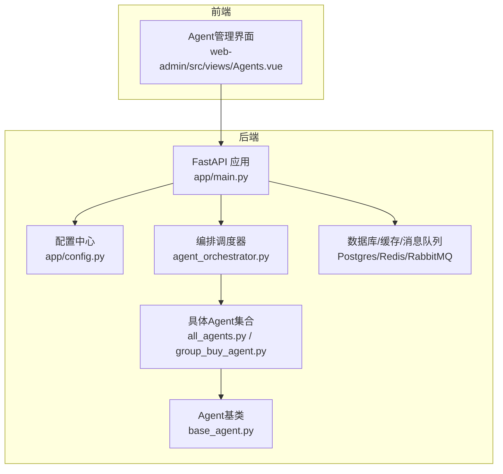
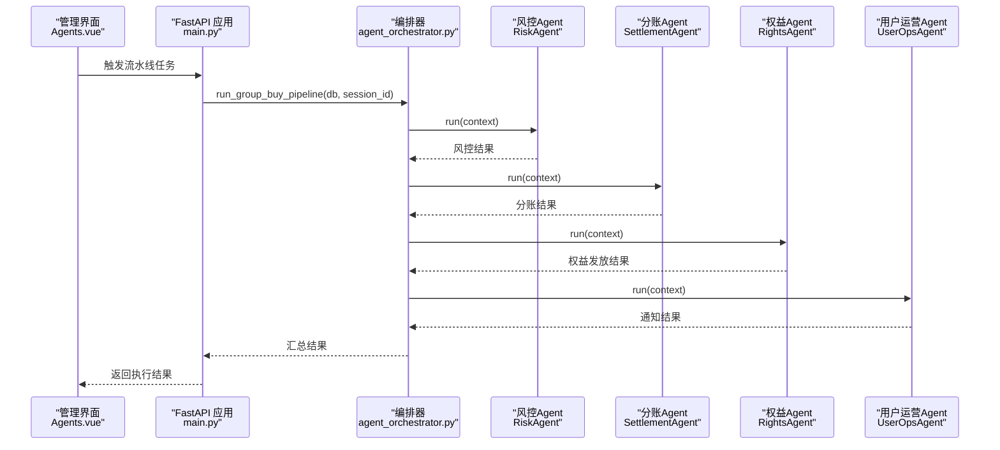
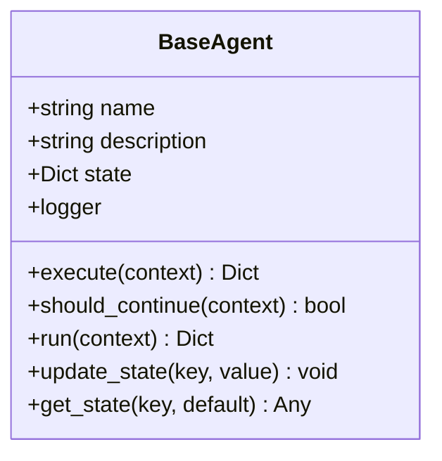
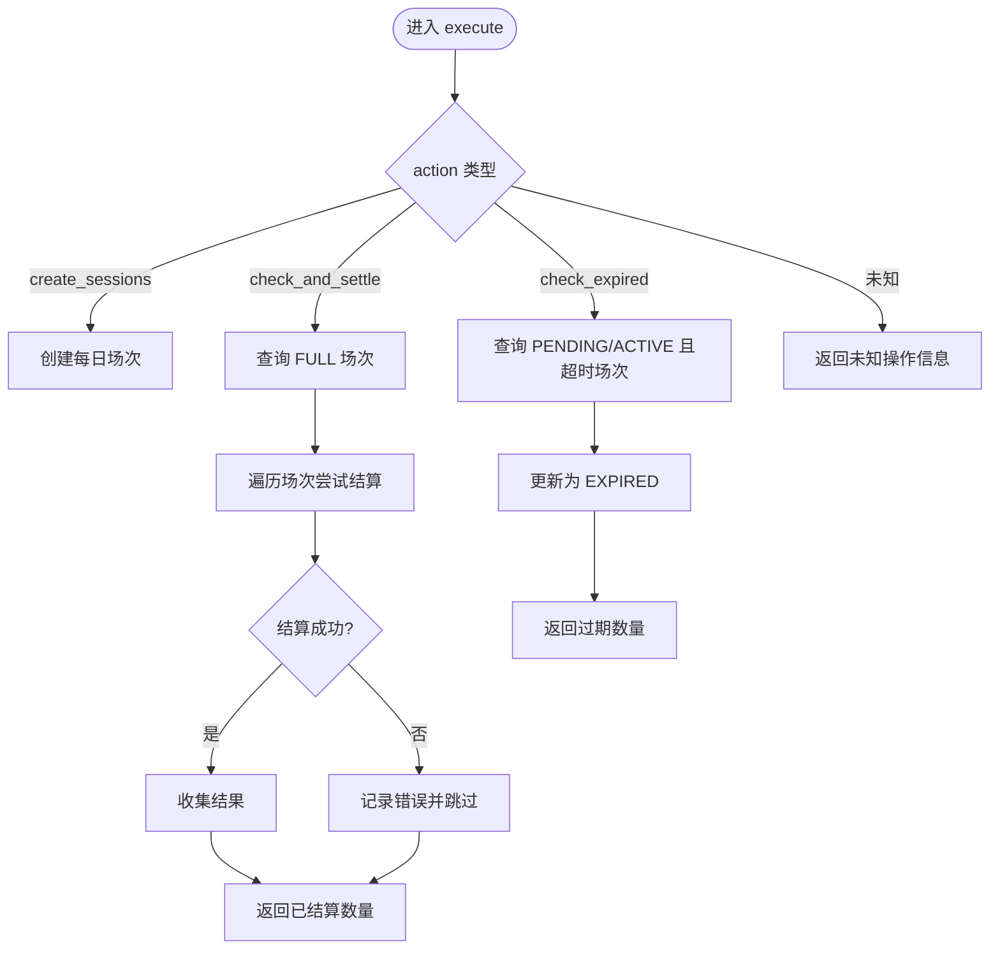
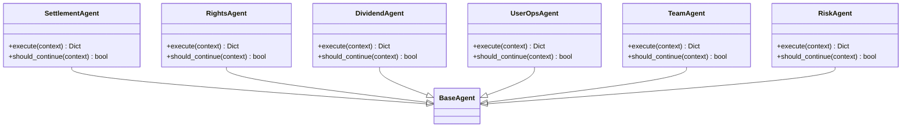
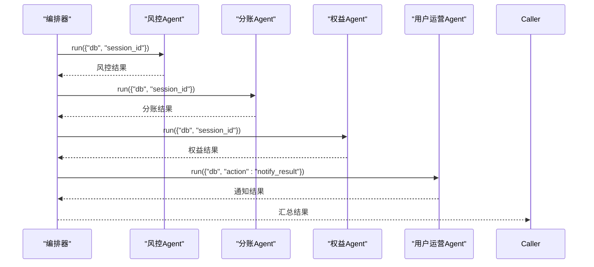
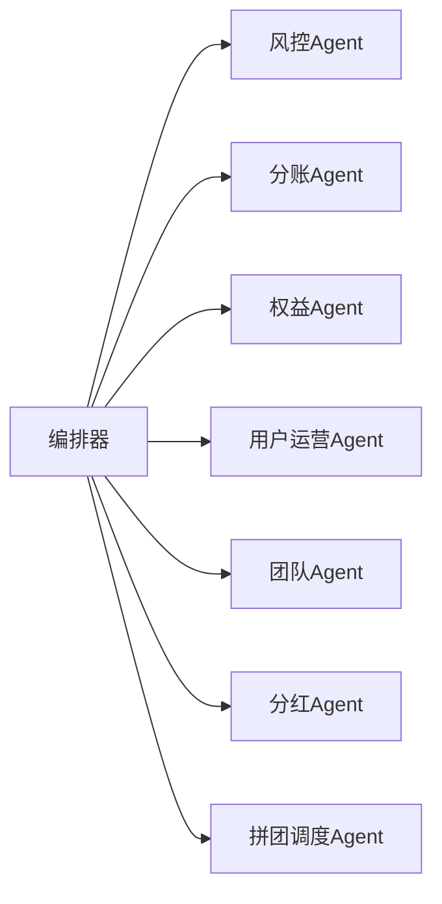

# Agent开发指南

<cite>
**本文引用的文件列表**
- [backend/app/agents/base_agent.py](file://backend/app/agents/base_agent.py)
- [backend/app/agents/agent_orchestrator.py](file://backend/app/agents/agent_orchestrator.py)
- [backend/app/agents/all_agents.py](file://backend/app/agents/all_agents.py)
- [backend/app/agents/group_buy_agent.py](file://backend/app/agents/group_buy_agent.py)
- [backend/app/config.py](file://backend/app/config.py)
- [backend/app/main.py](file://backend/app/main.py)
- [backend/Dockerfile](file://backend/Dockerfile)
- [docker-compose.yml](file://docker-compose.yml)
- [frontend/web-admin/src/views/Agents.vue](file://frontend/web-admin/src/views/Agents.vue)
</cite>

## 目录
1. [简介](#简介)
2. [项目结构](#项目结构)
3. [核心组件](#核心组件)
4. [架构总览](#架构总览)
5. [详细组件分析](#详细组件分析)
6. [依赖关系分析](#依赖关系分析)
7. [性能与可扩展性](#性能与可扩展性)
8. [Agent间通信与数据共享协议](#agent间通信与数据共享协议)
9. [配置管理与环境变量](#配置管理与环境变量)
10. [调试与测试框架](#调试与测试框架)
11. [版本管理与向后兼容](#版本管理与向后兼容)
12. [生产部署与监控](#生产部署与监控)
13. [最佳实践清单](#最佳实践清单)
14. [故障排查指南](#故障排查指南)
15. [结论](#结论)

## 简介
本指南面向AI Agent开发者，提供从继承基类、实现核心方法、定义元数据、注册到编排器，到错误处理、日志规范、性能优化、单元测试、通信协议、配置管理、调试与测试、版本兼容以及生产部署与监控的完整流程。文档基于仓库中现有Agent体系进行系统化总结，帮助快速构建高质量、可维护、可观测的Agent。

## 项目结构
后端采用模块化分层组织，Agent相关代码集中在app/agents目录，包含基类、具体Agent实现与编排调度器；应用入口在app/main.py，配置集中管理于app/config.py；容器化与编排通过Dockerfile与docker-compose.yml完成；前端管理页面提供Agent状态与日志查看能力。

图表来源
- [backend/app/main.py:1-75](file://backend/app/main.py#L1-L75)
- [backend/app/config.py:1-136](file://backend/app/config.py#L1-L136)
- [backend/app/agents/base_agent.py:1-47](file://backend/app/agents/base_agent.py#L1-L47)
- [backend/app/agents/all_agents.py:1-114](file://backend/app/agents/all_agents.py#L1-L114)
- [backend/app/agents/group_buy_agent.py:1-67](file://backend/app/agents/group_buy_agent.py#L1-L67)
- [backend/app/agents/agent_orchestrator.py:1-94](file://backend/app/agents/agent_orchestrator.py#L1-L94)
- [frontend/web-admin/src/views/Agents.vue:1-157](file://frontend/web-admin/src/views/Agents.vue#L1-L157)

章节来源
- [backend/app/main.py:1-75](file://backend/app/main.py#L1-L75)
- [backend/app/config.py:1-136](file://backend/app/config.py#L1-L136)
- [backend/app/agents/base_agent.py:1-47](file://backend/app/agents/base_agent.py#L1-L47)
- [backend/app/agents/agent_orchestrator.py:1-94](file://backend/app/agents/agent_orchestrator.py#L1-L94)
- [backend/app/agents/all_agents.py:1-114](file://backend/app/agents/all_agents.py#L1-L114)
- [backend/app/agents/group_buy_agent.py:1-67](file://backend/app/agents/group_buy_agent.py#L1-L67)
- [frontend/web-admin/src/views/Agents.vue:1-157](file://frontend/web-admin/src/views/Agents.vue#L1-L157)

## 核心组件
- BaseAgent：抽象基类，定义execute与should_continue两个必须实现的方法，并提供run统一执行包装、状态存取与日志记录。
- GroupBuyAgent：拼团调度Agent，负责场次创建、过期处理、满员结算等动作。
- all_agents.py：包含分账、权益、分红、用户运营、团队、风控等多个具体Agent，均继承BaseAgent并实现业务逻辑。
- AgentOrchestrator：编排调度器，集中注册各Agent实例，按业务流水线顺序调用，聚合结果。

章节来源
- [backend/app/agents/base_agent.py:1-47](file://backend/app/agents/base_agent.py#L1-L47)
- [backend/app/agents/group_buy_agent.py:1-67](file://backend/app/agents/group_buy_agent.py#L1-L67)
- [backend/app/agents/all_agents.py:1-114](file://backend/app/agents/all_agents.py#L1-L114)
- [backend/app/agents/agent_orchestrator.py:1-94](file://backend/app/agents/agent_orchestrator.py#L1-L94)

## 架构总览
下图展示Agent体系的整体交互：编排器作为中枢，协调多个Agent依次或并行执行；每个Agent内部通过服务层访问数据库与外部系统；前端管理页面提供运行状态与日志查询能力。

图表来源
- [backend/app/agents/agent_orchestrator.py:32-52](file://backend/app/agents/agent_orchestrator.py#L32-L52)
- [backend/app/agents/all_agents.py:101-114](file://backend/app/agents/all_agents.py#L101-L114)
- [backend/app/agents/all_agents.py:7-22](file://backend/app/agents/all_agents.py#L7-L22)
- [backend/app/agents/all_agents.py:29-46](file://backend/app/agents/all_agents.py#L29-L46)
- [backend/app/agents/all_agents.py:66-77](file://backend/app/agents/all_agents.py#L66-L77)
- [frontend/web-admin/src/views/Agents.vue:137-157](file://frontend/web-admin/src/views/Agents.vue#L137-L157)

## 详细组件分析

### 基类与生命周期（BaseAgent）
- 职责：统一Agent生命周期管理、异常捕获、结构化返回、状态存储与日志输出。
- 关键方法：
  - execute：由子类实现核心业务逻辑，输入上下文字典，返回结果字典。
  - should_continue：控制是否继续执行（当前多数Agent返回False表示单次执行）。
  - run：封装execute调用，统一成功/失败返回格式，记录开始/结束/错误日志。
  - update_state/get_state：用于Agent内部状态存取。

图表来源
- [backend/app/agents/base_agent.py:12-47](file://backend/app/agents/base_agent.py#L12-L47)

章节来源
- [backend/app/agents/base_agent.py:12-47](file://backend/app/agents/base_agent.py#L12-L47)

### 拼团调度Agent（GroupBuyAgent）
- 职责：定时触发开团、检查人数、匹配板块、核验订单、判定结果、触发分账。
- 支持动作：
  - create_sessions：创建每日场次。
  - check_and_settle：检查已满场次并结算。
  - check_expired：处理过期场次。
- 错误处理：对单个场次结算异常进行捕获并记录，不影响其他场次。

图表来源
- [backend/app/agents/group_buy_agent.py:21-63](file://backend/app/agents/group_buy_agent.py#L21-L63)

章节来源
- [backend/app/agents/group_buy_agent.py:15-67](file://backend/app/agents/group_buy_agent.py#L15-L67)

### 其他Agent（分账、权益、分红、用户运营、团队、风控）
- 分账Agent：根据订单结果计算各方收益并写入结算记录。
- 权益Agent：根据拼团结果生成贡献值/积分/消费券并发放。
- 分红Agent：每周一自动执行全网分红与递减兑换。
- 用户运营Agent：推送开团信息、规则解答、激活用户。
- 团队Agent：统计四级团队业绩、排名与阶梯分红。
- 风控Agent：实时校验限购、异常操作、违规开团并拦截。

图表来源
- [backend/app/agents/all_agents.py:7-22](file://backend/app/agents/all_agents.py#L7-L22)
- [backend/app/agents/all_agents.py:29-46](file://backend/app/agents/all_agents.py#L29-L46)
- [backend/app/agents/all_agents.py:52-63](file://backend/app/agents/all_agents.py#L52-L63)
- [backend/app/agents/all_agents.py:66-77](file://backend/app/agents/all_agents.py#L66-L77)
- [backend/app/agents/all_agents.py:83-95](file://backend/app/agents/all_agents.py#L83-L95)
- [backend/app/agents/all_agents.py:101-114](file://backend/app/agents/all_agents.py#L101-L114)
- [backend/app/agents/base_agent.py:12-47](file://backend/app/agents/base_agent.py#L12-L47)

章节来源
- [backend/app/agents/all_agents.py:1-114](file://backend/app/agents/all_agents.py#L1-114)

### 编排调度器（AgentOrchestrator）
- 职责：集中注册Agent实例，按业务流水线顺序调用，聚合结果，提供状态查询。
- 典型流水线：
  - run_group_buy_pipeline：风控→结算→权益→通知。
  - run_daily_routine：创建场次→检查过期→结算已满场次。
  - run_weekly_settlement：每周分红。
  - run_monthly_store_dividend：月度门店阶梯分红。

图表来源
- [backend/app/agents/agent_orchestrator.py:32-52](file://backend/app/agents/agent_orchestrator.py#L32-L52)

章节来源
- [backend/app/agents/agent_orchestrator.py:18-94](file://backend/app/agents/agent_orchestrator.py#L18-L94)

## 依赖关系分析
- 模块耦合：
  - 编排器依赖所有具体Agent，形成“高内聚、低耦合”的编排层。
  - 具体Agent依赖各自的服务层（如SettlementService、ContributionService、DividendService、RiskService），避免直接跨模块调用。
- 外部依赖：
  - 数据库：异步SQLAlchemy会话通过context传入。
  - 缓存/消息队列：通过配置注入，供服务层使用。
- 潜在风险：
  - 编排器集中注册可能导致新增Agent时修改点较多，建议后续引入注册表机制。
  - 强依赖服务层接口变更时需保持向后兼容。

图表来源
- [backend/app/agents/agent_orchestrator.py:21-30](file://backend/app/agents/agent_orchestrator.py#L21-L30)

章节来源
- [backend/app/agents/agent_orchestrator.py:18-94](file://backend/app/agents/agent_orchestrator.py#L18-L94)

## 性能与可扩展性
- 异步执行：Agent的execute与run均为异步，适合高并发场景。
- 批量处理：在GroupBuyAgent中对满员场次进行批量遍历与结算，注意异常隔离以避免单点失败影响整体。
- 扩展建议：
  - 将编排器中的硬编码注册改为动态发现与注册表，降低耦合。
  - 对长耗时任务拆分至Celery Worker，结合Beat定时调度。
  - 引入缓存与幂等键，减少重复计算与副作用。

[本节为通用指导，不直接分析具体文件]

## Agent间通信与数据共享协议
- 上下文传递：
  - 统一以字典形式作为上下文（context），包含数据库会话、会话ID、业务参数等。
  - 编排器在各Agent之间传递必要的上下文字段，确保数据一致性。
- 返回值约定：
  - 成功：包含agent名称、status为success、result为业务结果字典。
  - 失败：包含agent名称、status为error、error为异常信息字符串。
- 状态共享：
  - 通过BaseAgent的state进行Agent内部状态存取，便于复杂流程的状态持久化。

章节来源
- [backend/app/agents/base_agent.py:31-47](file://backend/app/agents/base_agent.py#L31-L47)
- [backend/app/agents/agent_orchestrator.py:32-52](file://backend/app/agents/agent_orchestrator.py#L32-L52)

## 配置管理与环境变量
- 配置模型：
  - 使用pydantic_settings的BaseSettings集中管理应用配置，包括数据库、Redis、Celery、CORS、MinIO、业务常量与AI Agent相关配置。
- 环境变量：
  - 支持.env文件加载，生产环境可通过容器环境变量覆盖默认值。
- AI Agent配置项：
  - LLM_API_KEY、LLM_API_BASE、LLM_MODEL等用于接入大模型服务。

章节来源
- [backend/app/config.py:8-136](file://backend/app/config.py#L8-L136)

## 调试与测试框架
- 日志记录：
  - 应用启动时配置全局日志格式与级别，Agent通过命名空间日志器输出结构化日志。
  - 管理界面提供Agent执行日志查看与筛选功能。
- 健康检查：
  - 提供/health端点用于服务可用性探测。
- 测试建议：
  - 针对BaseAgent.run的异常路径编写用例，验证错误返回格式。
  - 针对GroupBuyAgent的各action分支编写用例，模拟数据库查询与结算流程。
  - 使用异步测试框架（如pytest-asyncio）配合内存数据库与Mock服务层。

章节来源
- [backend/app/main.py:16-21](file://backend/app/main.py#L16-L21)
- [backend/app/main.py:72-75](file://backend/app/main.py#L72-L75)
- [frontend/web-admin/src/views/Agents.vue:127-157](file://frontend/web-admin/src/views/Agents.vue#L127-L157)

## 版本管理与向后兼容
- 版本号：
  - FastAPI应用声明version为1.0.0，便于API版本管理。
- 兼容性策略：
  - 新增Agent时尽量保持execute与should_continue签名不变，避免破坏既有调用方。
  - 上下文字段采用可选键（context.get），对新字段提供默认值，保证旧客户端兼容。
  - 编排器新增流水线时，保留原有方法签名，逐步迁移调用方。

章节来源
- [backend/app/main.py:35-42](file://backend/app/main.py#L35-L42)
- [backend/app/agents/base_agent.py:21-29](file://backend/app/agents/base_agent.py#L21-L29)
- [backend/app/agents/agent_orchestrator.py:32-94](file://backend/app/agents/agent_orchestrator.py#L32-L94)

## 生产部署与监控
- 容器化：
  - Dockerfile基于python:3.11-slim，安装依赖后启动uvicorn服务。
- 编排：
  - docker-compose.yml定义PostgreSQL、Redis、RabbitMQ、MinIO、后端API、Celery Worker与Beat、Nginx反向代理等服务。
- 环境变量注入：
  - 通过compose文件为后端与Worker注入数据库、缓存、消息队列连接信息。
- 监控与健康检查：
  - PostgreSQL服务提供healthcheck；应用提供/health端点。
  - 管理界面展示Agent执行次数、成功率与最后执行时间，辅助运维监控。

章节来源
- [backend/Dockerfile:1-13](file://backend/Dockerfile#L1-L13)
- [docker-compose.yml:1-111](file://docker-compose.yml#L1-L111)
- [backend/app/main.py:72-75](file://backend/app/main.py#L72-L75)
- [frontend/web-admin/src/views/Agents.vue:18-31](file://frontend/web-admin/src/views/Agents.vue#L18-L31)

## 最佳实践清单
- 继承BaseAgent并实现execute与should_continue，遵循统一返回格式。
- 使用结构化日志，区分info与error级别，记录关键上下文。
- 对异常进行细粒度捕获与记录，避免单点失败影响整体流水线。
- 通过context传递必要参数，保持函数签名稳定。
- 使用配置中心管理敏感信息与业务常量，避免硬编码。
- 对长耗时任务使用Celery异步执行，结合Beat定时调度。
- 编写异步单元测试，覆盖成功、失败与边界条件。
- 在编排器中集中注册Agent，便于统一管理与状态查询。
- 对外暴露健康检查与日志查询接口，提升可观测性。
- 保持向后兼容，新增字段采用可选键并提供默认值。

[本节为通用指导，不直接分析具体文件]

## 故障排查指南
- 常见问题定位：
  - 数据库连接失败：检查DATABASE_URL与环境变量是否正确注入。
  - Redis/RabbitMQ不可用：确认对应服务端口与网络连通性。
  - Agent执行异常：查看命名空间日志器输出，定位具体Agent与错误堆栈。
  - 流水线阻塞：检查编排器调用链路与各Agent返回状态。
- 工具与接口：
  - 使用/health端点进行服务健康检查。
  - 通过管理界面的日志筛选功能，按Agent名称过滤执行记录。

章节来源
- [backend/app/main.py:16-21](file://backend/app/main.py#L16-L21)
- [backend/app/main.py:72-75](file://backend/app/main.py#L72-L75)
- [frontend/web-admin/src/views/Agents.vue:127-157](file://frontend/web-admin/src/views/Agents.vue#L127-L157)

## 结论
本指南基于现有Agent体系，提供了从开发、集成、测试到部署与监控的全链路说明。遵循统一的基类契约、编排器模式与配置管理策略，可有效提升Agent的可维护性与可观测性。建议在后续迭代中引入动态注册表、更完善的指标采集与告警机制，进一步提升系统的稳定性与扩展性。