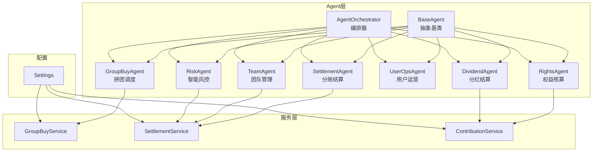
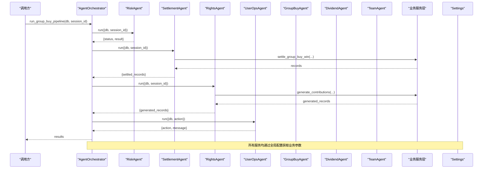
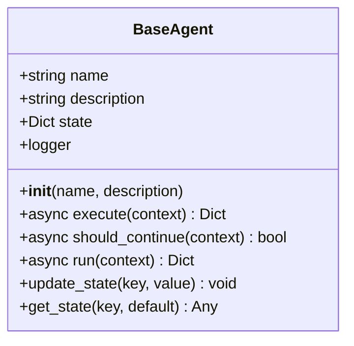
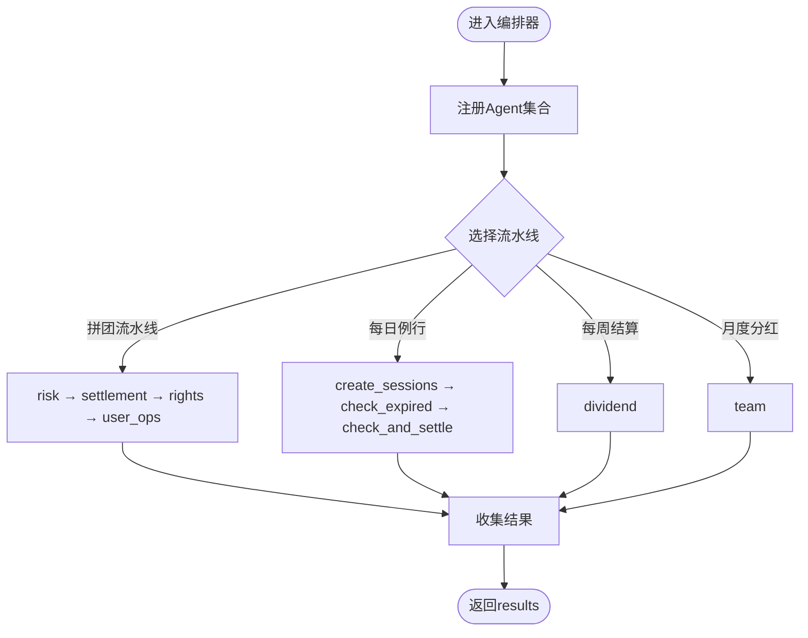
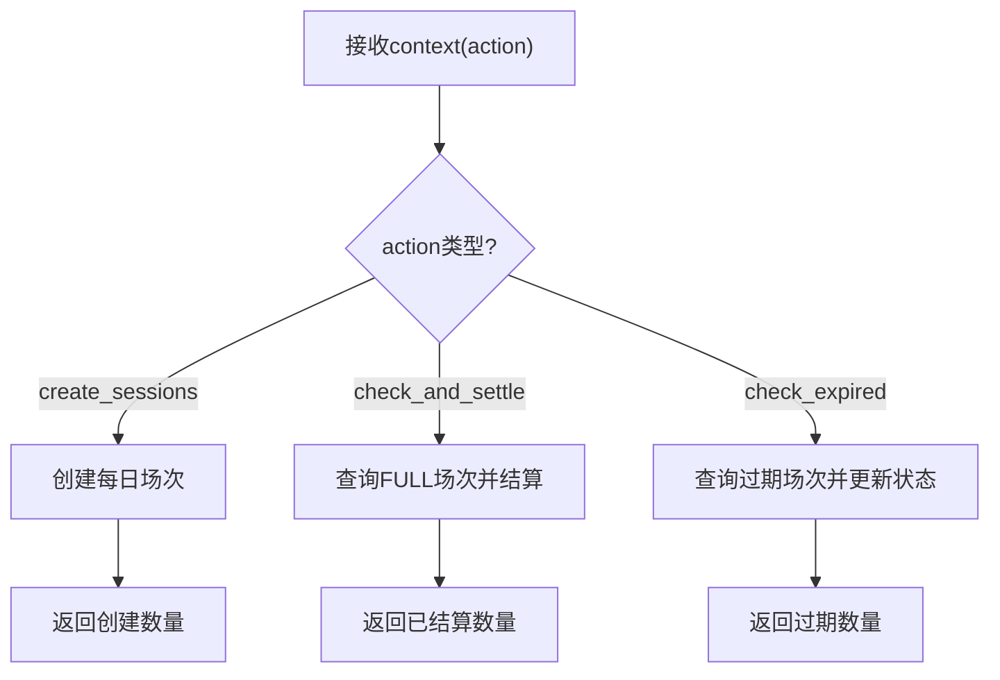
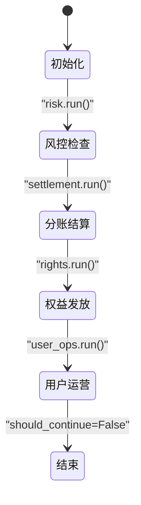
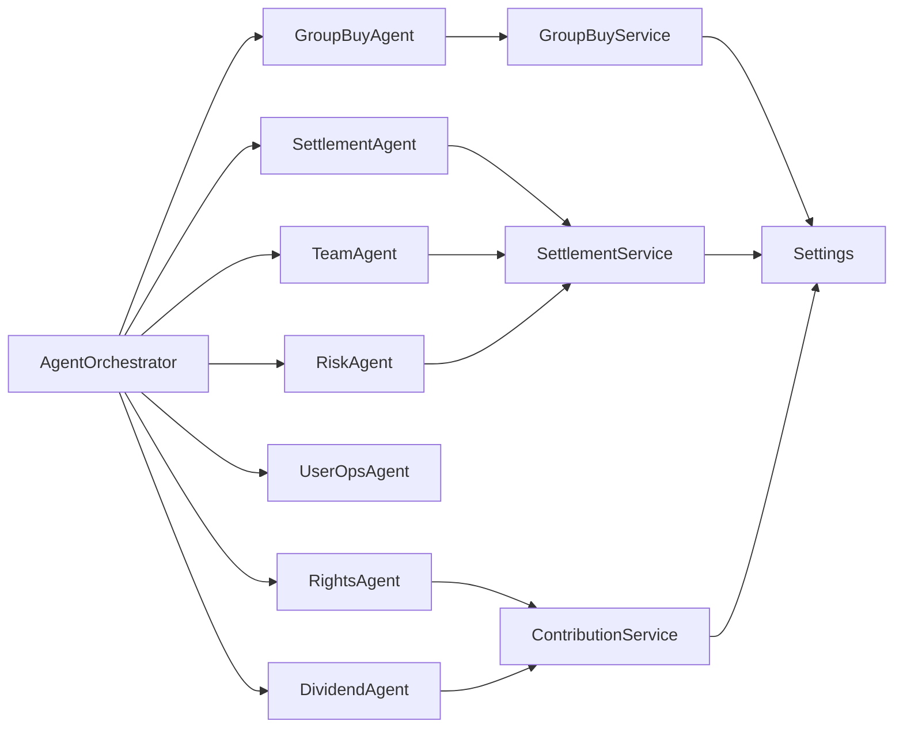

# Agent架构设计

<cite>
**本文引用的文件列表**
- [base_agent.py](file://backend/app/agents/base_agent.py)
- [agent_orchestrator.py](file://backend/app/agents/agent_orchestrator.py)
- [all_agents.py](file://backend/app/agents/all_agents.py)
- [group_buy_agent.py](file://backend/app/agents/group_buy_agent.py)
- [group_buy_service.py](file://backend/app/services/group_buy_service.py)
- [settlement_service.py](file://backend/app/services/settlement_service.py)
- [contribution_service.py](file://backend/app/services/contribution_service.py)
- [config.py](file://backend/app/config.py)
</cite>

## 目录
1. [引言](#引言)
2. [项目结构](#项目结构)
3. [核心组件](#核心组件)
4. [架构总览](#架构总览)
5. [详细组件分析](#详细组件分析)
6. [依赖关系分析](#依赖关系分析)
7. [性能与内存优化](#性能与内存优化)
8. [故障排查指南](#故障排查指南)
9. [结论](#结论)
10. [附录](#附录)

## 引言
本技术文档围绕AIxingmu的Agent架构进行系统化解析，重点覆盖以下方面：
- BaseAgent抽象基类的设计模式、execute与should_continue抽象方法定义、状态管理与日志记录机制
- AgentOrchestrator编排器的核心能力：Agent注册、执行顺序控制、上下文传递、错误处理与重试策略
- 基于LangGraph理念的状态机实现原理（节点、边、条件分支）在本工程中的落地方式
- 架构图与数据流图，展示各组件交互关系
- Agent生命周期管理、内存优化与性能监控的实现细节与建议

## 项目结构
后端采用分层组织：
- agents：Agent抽象与具体实现、编排器
- services：业务服务层，封装数据库操作与领域逻辑
- models：数据模型与枚举
- config：全局配置
- api：对外接口（不在本次分析范围）

图表来源
- [base_agent.py:12-47](file://backend/app/agents/base_agent.py#L12-L47)
- [agent_orchestrator.py:18-94](file://backend/app/agents/agent_orchestrator.py#L18-L94)
- [all_agents.py:7-114](file://backend/app/agents/all_agents.py#L7-L114)
- [group_buy_agent.py:15-67](file://backend/app/agents/group_buy_agent.py#L15-L67)
- [group_buy_service.py:17-348](file://backend/app/services/group_buy_service.py#L17-L348)
- [settlement_service.py:17-166](file://backend/app/services/settlement_service.py#L17-L166)
- [contribution_service.py:16-200](file://backend/app/services/contribution_service.py#L16-L200)
- [config.py:8-136](file://backend/app/config.py#L8-L136)

章节来源
- [base_agent.py:12-47](file://backend/app/agents/base_agent.py#L12-L47)
- [agent_orchestrator.py:18-94](file://backend/app/agents/agent_orchestrator.py#L18-L94)
- [all_agents.py:7-114](file://backend/app/agents/all_agents.py#L7-L114)
- [group_buy_agent.py:15-67](file://backend/app/agents/group_buy_agent.py#L15-L67)
- [group_buy_service.py:17-348](file://backend/app/services/group_buy_service.py#L17-L348)
- [settlement_service.py:17-166](file://backend/app/services/settlement_service.py#L17-L166)
- [contribution_service.py:16-200](file://backend/app/services/contribution_service.py#L16-L200)
- [config.py:8-136](file://backend/app/config.py#L8-L136)

## 核心组件
- BaseAgent：定义Agent通用能力，包括异步执行入口run、抽象方法execute与should_continue、状态字典state、结构化日志。
- AgentOrchestrator：集中注册与管理多个Agent实例，提供流水线编排方法，按固定顺序调用并收集结果。
- 具体Agent：GroupBuyAgent、SettlementAgent、RightsAgent、DividendAgent、UserOpsAgent、TeamAgent、RiskAgent，分别实现各自业务逻辑。
- 服务层：GroupBuyService、SettlementService、ContributionService等，承载数据库访问与复杂计算。
- 配置：Settings集中管理业务常量与比例参数。

章节来源
- [base_agent.py:12-47](file://backend/app/agents/base_agent.py#L12-L47)
- [agent_orchestrator.py:18-94](file://backend/app/agents/agent_orchestrator.py#L18-L94)
- [all_agents.py:7-114](file://backend/app/agents/all_agents.py#L7-L114)
- [group_buy_agent.py:15-67](file://backend/app/agents/group_buy_agent.py#L15-L67)
- [group_buy_service.py:17-348](file://backend/app/services/group_buy_service.py#L17-L348)
- [settlement_service.py:17-166](file://backend/app/services/settlement_service.py#L17-L166)
- [contribution_service.py:16-200](file://backend/app/services/contribution_service.py#L16-L200)
- [config.py:8-136](file://backend/app/config.py#L8-L136)

## 架构总览
下图展示了从编排器到具体Agent再到服务层的调用路径，以及配置参数的注入点。

图表来源
- [agent_orchestrator.py:32-52](file://backend/app/agents/agent_orchestrator.py#L32-L52)
- [all_agents.py:7-114](file://backend/app/agents/all_agents.py#L7-L114)
- [group_buy_service.py:17-348](file://backend/app/services/group_buy_service.py#L17-L348)
- [settlement_service.py:17-166](file://backend/app/services/settlement_service.py#L17-L166)
- [contribution_service.py:16-200](file://backend/app/services/contribution_service.py#L16-L200)
- [config.py:8-136](file://backend/app/config.py#L8-L136)

## 详细组件分析

### BaseAgent抽象基类
- 职责
  - 统一Agent生命周期：run负责异常捕获与标准化返回；execute与should_continue由子类实现
  - 状态管理：内部维护state字典，支持update_state/get_state
  - 日志系统：为每个Agent实例创建独立logger，记录开始、完成与异常
- 关键方法
  - execute(context): 异步执行核心逻辑，返回业务结果
  - should_continue(context): 决定是否继续后续流程（当前实现多为False）
  - run(context): 包装execute，统一成功/失败响应格式
  - update_state/get_state: 状态存取

图表来源
- [base_agent.py:12-47](file://backend/app/agents/base_agent.py#L12-L47)

章节来源
- [base_agent.py:12-47](file://backend/app/agents/base_agent.py#L12-L47)

### AgentOrchestrator编排器
- 职责
  - 集中注册7个Agent实例，提供多套流水线方法：拼团流水线、每日例行、每周结算、月度门店分红
  - 顺序控制：严格按风险→结算→权益→通知的顺序执行
  - 上下文传递：将db、session_id、action等上下文透传给各Agent
  - 结果聚合：收集每个Agent的执行结果并返回
- 扩展点
  - 新增Agent：在构造中注册，并在相应流水线中添加步骤
  - 重试与容错：可在流水线方法中加入try/except与重试逻辑

图表来源
- [agent_orchestrator.py:18-94](file://backend/app/agents/agent_orchestrator.py#L18-L94)

章节来源
- [agent_orchestrator.py:18-94](file://backend/app/agents/agent_orchestrator.py#L18-L94)

### 具体Agent实现

#### GroupBuyAgent（拼团调度）
- 职责
  - 定时触发开团、检查人数、匹配板块、核验订单、判定结果、触发分账
- 主要动作
  - create_sessions：批量创建当日场次
  - check_and_settle：查询已满员场次并逐个结算
  - check_expired：将过期场次标记为过期
- 状态流转
  - 场次状态：PENDING → ACTIVE → FULL → COMPLETED/CANCELLED/EXPIRED

图表来源
- [group_buy_agent.py:15-67](file://backend/app/agents/group_buy_agent.py#L15-L67)
- [group_buy_service.py:17-348](file://backend/app/services/group_buy_service.py#L17-348)

章节来源
- [group_buy_agent.py:15-67](file://backend/app/agents/group_buy_agent.py#L15-L67)
- [group_buy_service.py:17-348](file://backend/app/services/group_buy_service.py#L17-348)

#### SettlementAgent（分账结算）
- 职责
  - 根据拼团结果按固定比例计算各方收益，写入结算记录
- 依赖服务
  - SettlementService.settle_group_buy_win

章节来源
- [all_agents.py:7-22](file://backend/app/agents/all_agents.py#L7-L22)
- [settlement_service.py:17-166](file://backend/app/services/settlement_service.py#L17-166)

#### RightsAgent（权益核算）
- 职责
  - 根据拼团结果计算贡献值/积分/消费券并发放到用户账户
- 依赖服务
  - ContributionService.generate_contributions

章节来源
- [all_agents.py:29-46](file://backend/app/agents/all_agents.py#L29-L46)
- [contribution_service.py:16-200](file://backend/app/services/contribution_service.py#L16-L200)

#### DividendAgent（分红结算）
- 职责
  - 每周一自动执行全网分红，递减贡献值并发放消费券
- 依赖服务
  - ContributionService.weekly_settle（在贡献值服务中实现周结逻辑）

章节来源
- [all_agents.py:52-63](file://backend/app/agents/all_agents.py#L52-L63)
- [contribution_service.py:163-200](file://backend/app/services/contribution_service.py#L163-L200)

#### UserOpsAgent（用户运营）
- 职责
  - 推送开团信息、解答规则、激活用户（基于LLM的对话与推送逻辑占位）

章节来源
- [all_agents.py:66-77](file://backend/app/agents/all_agents.py#L66-L77)

#### TeamAgent（团队管理）
- 职责
  - 统计四级团队业绩、排名、核算阶梯分红
- 依赖服务
  - SettlementService.settle_store_monthly_dividend

章节来源
- [all_agents.py:83-95](file://backend/app/agents/all_agents.py#L83-L95)
- [settlement_service.py:87-133](file://backend/app/services/settlement_service.py#L87-L133)

#### RiskAgent（智能风控）
- 职责
  - 实时校验限购、异常操作、违规开团，自动拦截
- 依赖服务
  - RiskService.check_join_risk（在Agent中调用）

章节来源
- [all_agents.py:101-114](file://backend/app/agents/all_agents.py#L101-L114)

### 基于LangGraph的状态机实现原理
- 现状说明
  - 代码注释表明“基于LangGraph实现Agent状态机”，但当前实现未直接引入langgraph库，而是以BaseAgent+Orchestrator的方式模拟状态机：
    - 节点：每个Agent视为一个节点
    - 边：编排器中的顺序调用构成有向边
    - 条件分支：should_continue决定是否需要继续执行（当前多数返回False）
- 建议演进
  - 使用LangGraph构建显式状态图：定义StateSchema、Node函数、ConditionalEdge
  - 将上下文context作为State的一部分在各节点间传递
  - 将错误处理与重试策略纳入图的条件分支与循环边

图表来源
- [agent_orchestrator.py:32-52](file://backend/app/agents/agent_orchestrator.py#L32-L52)
- [base_agent.py:21-29](file://backend/app/agents/base_agent.py#L21-L29)

章节来源
- [base_agent.py:12-47](file://backend/app/agents/base_agent.py#L12-L47)
- [agent_orchestrator.py:18-94](file://backend/app/agents/agent_orchestrator.py#L18-L94)

## 依赖关系分析
- 组件耦合
  - Orchestrator强耦合于具体Agent集合，便于集中编排，但扩展时需修改注册表
  - 具体Agent依赖服务层，服务层依赖配置与模型
- 外部依赖
  - 数据库：AsyncSession用于异步读写
  - 配置：全局Settings提供业务参数
- 潜在循环依赖
  - 当前未见循环导入，Agent与服务层单向依赖

图表来源
- [agent_orchestrator.py:18-94](file://backend/app/agents/agent_orchestrator.py#L18-L94)
- [all_agents.py:7-114](file://backend/app/agents/all_agents.py#L7-L114)
- [group_buy_service.py:17-348](file://backend/app/services/group_buy_service.py#L17-348)
- [settlement_service.py:17-166](file://backend/app/services/settlement_service.py#L17-L166)
- [contribution_service.py:16-200](file://backend/app/services/contribution_service.py#L16-L200)
- [config.py:8-136](file://backend/app/config.py#L8-L136)

章节来源
- [agent_orchestrator.py:18-94](file://backend/app/agents/agent_orchestrator.py#L18-L94)
- [all_agents.py:7-114](file://backend/app/agents/all_agents.py#L7-L114)
- [group_buy_service.py:17-348](file://backend/app/services/group_buy_service.py#L17-348)
- [settlement_service.py:17-166](file://backend/app/services/settlement_service.py#L17-L166)
- [contribution_service.py:16-200](file://backend/app/services/contribution_service.py#L16-L200)
- [config.py:8-136](file://backend/app/config.py#L8-L136)

## 性能与内存优化
- 数据库连接池
  - 通过配置项设置连接池大小与溢出上限，避免高并发下连接耗尽
- 异步IO
  - 使用AsyncSession与异步服务方法，提升吞吐
- 批处理与事务
  - 场次创建与结算采用批量添加与flush，减少往返次数
- 内存优化建议
  - 在流水线中及时释放中间结果引用，避免大对象驻留
  - 对长任务（如周结、月结）采用分页或分批处理，降低峰值内存
- 性能监控建议
  - 在BaseAgent.run中增加耗时统计指标（如Prometheus计数器）
  - 对关键服务方法埋点，记录QPS与延迟分布
  - 结合结构化日志输出trace_id，便于链路追踪

[本节为通用指导，不直接分析具体文件]

## 故障排查指南
- 常见异常
  - 场次状态异常：无法结算时抛出异常，需检查场次是否FULL且订单数匹配
  - 余额不足：参团前校验失败，提示充值
  - 单ID单组参与次数超限：超过最大订单数限制
- 定位方法
  - 查看Agent运行日志（包含名称与上下文），快速定位失败节点
  - 核对数据库状态与配置参数，确认业务规则是否符合预期
- 恢复策略
  - 对于可重试的错误（如网络抖动），在编排器层面加入重试逻辑
  - 对于不可恢复的错误（如数据不一致），记录告警并人工介入

章节来源
- [group_buy_service.py:17-348](file://backend/app/services/group_buy_service.py#L17-348)
- [base_agent.py:31-41](file://backend/app/agents/base_agent.py#L31-L41)

## 结论
本项目以BaseAgent抽象基类为核心，结合AgentOrchestrator实现了清晰的Agent编排与执行流程。尽管当前未直接使用LangGraph库，但已通过“节点=Agent、边=顺序调用、条件=should_continue”的方式达成状态机效果。建议在后续迭代中引入LangGraph，以更灵活地表达复杂工作流、增强条件分支与重试策略，同时完善性能监控与内存优化措施，提升系统的可观测性与稳定性。

[本节为总结性内容，不直接分析具体文件]

## 附录
- 术语
  - Agent：具备独立职责的异步执行单元
  - 编排器：协调多个Agent执行顺序与上下文传递的中心组件
  - 状态机：以状态与转移描述业务流程的计算模型
- 参考实现路径
  - BaseAgent抽象与生命周期：[base_agent.py:12-47](file://backend/app/agents/base_agent.py#L12-L47)
  - 编排器流水线：[agent_orchestrator.py:32-85](file://backend/app/agents/agent_orchestrator.py#L32-L85)
  - 具体Agent实现：[all_agents.py:7-114](file://backend/app/agents/all_agents.py#L7-L114)、[group_buy_agent.py:15-67](file://backend/app/agents/group_buy_agent.py#L15-L67)
  - 服务层核心逻辑：[group_buy_service.py:17-348](file://backend/app/services/group_buy_service.py#L17-348)、[settlement_service.py:17-166](file://backend/app/services/settlement_service.py#L17-166)、[contribution_service.py:16-200](file://backend/app/services/contribution_service.py#L16-L200)
  - 全局配置：[config.py:8-136](file://backend/app/config.py#L8-L136)