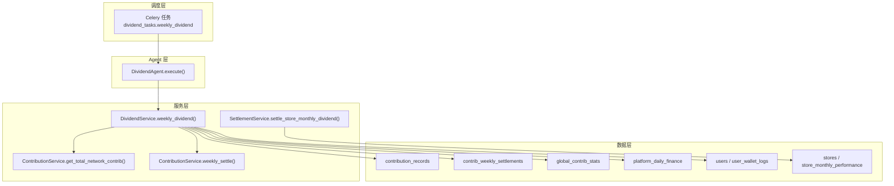
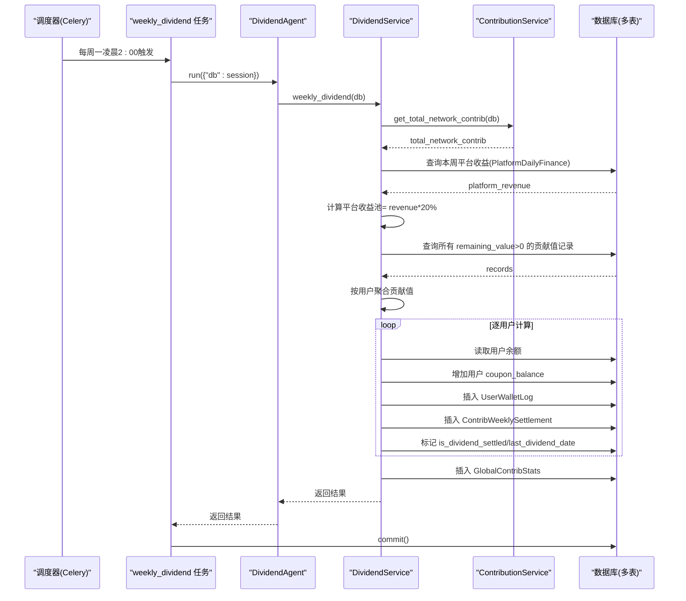
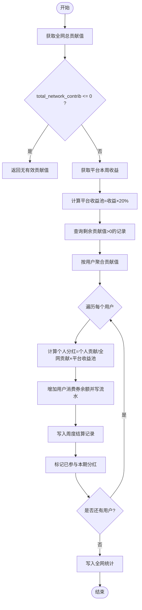
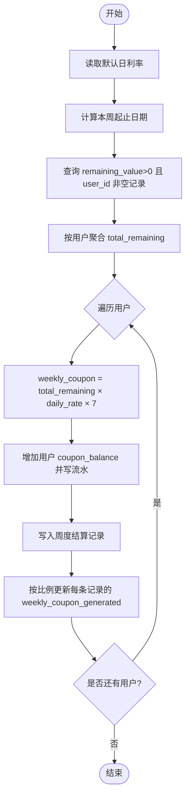
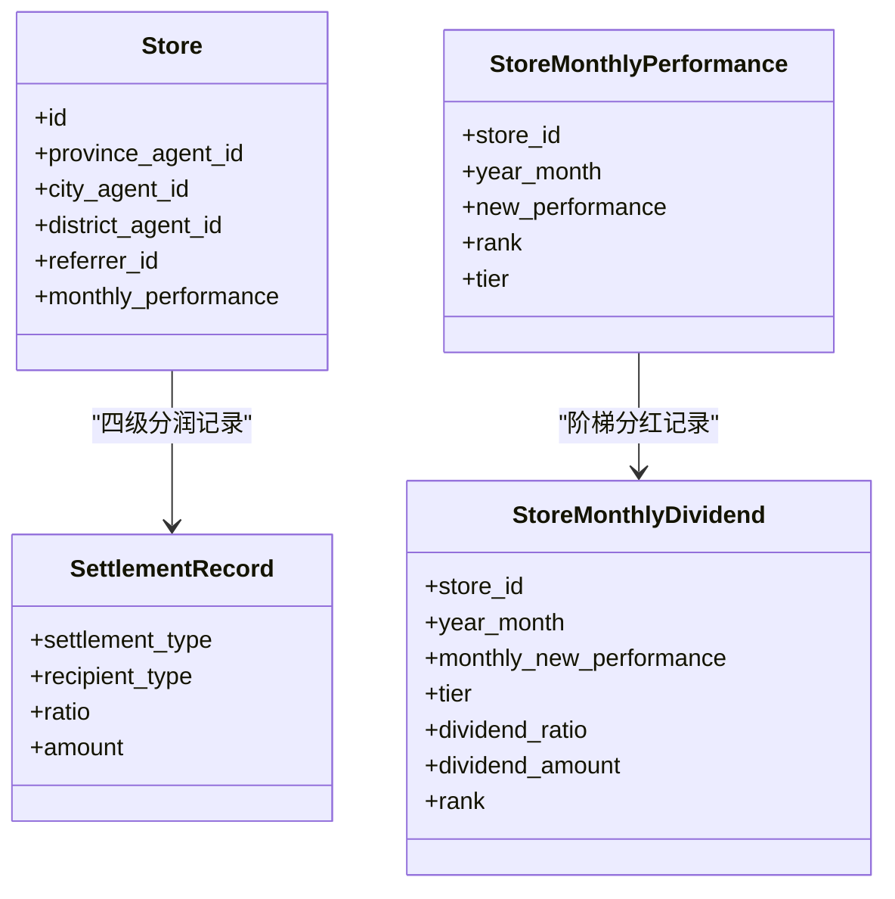
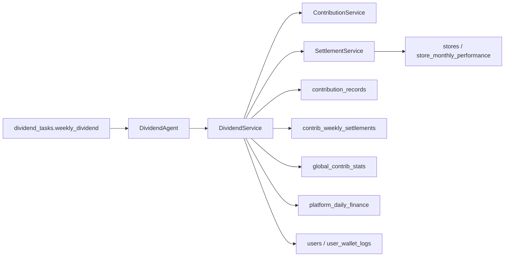
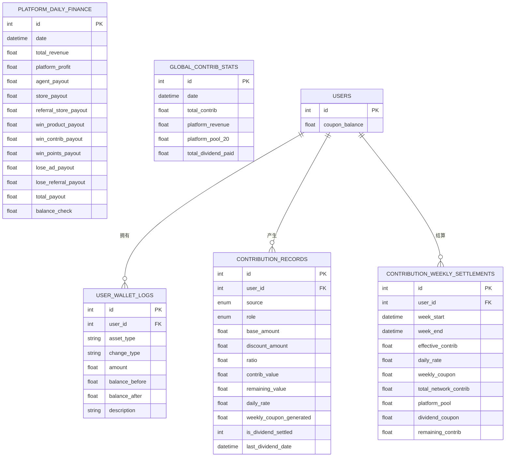

# 分红计算Agent

<cite>
**本文引用的文件**   
- [backend/app/agents/all_agents.py](file://backend/app/agents/all_agents.py)
- [backend/app/services/dividend_service.py](file://backend/app/services/dividend_service.py)
- [backend/app/tasks/dividend_tasks.py](file://backend/app/tasks/dividend_tasks.py)
- [backend/app/models/contribution.py](file://backend/app/models/contribution.py)
- [backend/app/models/settlement.py](file://backend/app/models/settlement.py)
- [backend/app/models/user.py](file://backend/app/models/user.py)
- [backend/app/config.py](file://backend/app/config.py)
- [backend/app/services/contribution_service.py](file://backend/app/services/contribution_service.py)
- [backend/app/services/settlement_service.py](file://backend/app/services/settlement_service.py)
- [backend/app/models/store.py](file://backend/app/models/store.py)
</cite>

## 目录
1. [引言](#引言)
2. [项目结构](#项目结构)
3. [核心组件](#核心组件)
4. [架构总览](#架构总览)
5. [详细组件分析](#详细组件分析)
6. [依赖关系分析](#依赖关系分析)
7. [性能与优化](#性能与优化)
8. [准确性与一致性保障](#准确性与一致性保障)
9. [财务对接与审计追踪](#财务对接与审计追踪)
10. [故障排查指南](#故障排查指南)
11. [结论](#结论)

## 引言
本技术文档聚焦于“分红计算Agent（DividendAgent）”，围绕贡献值周度分红算法、四级代理体系的分润逻辑、递减兑换机制、数据准确性保障、财务系统对接与审计追踪，以及性能优化策略进行系统化说明。目标是帮助读者快速理解并正确维护该模块。

## 项目结构
与分红计算相关的后端代码主要分布在 agents、services、tasks、models 四个层次：
- agents：定义业务 Agent 的编排入口，DividendAgent 负责调用服务层执行周度分红。
- services：实现具体业务逻辑，如 DividendService 的分红计算、ContributionService 的贡献值生成与递减兑换、SettlementService 的四級分润与门店阶梯分红。
- tasks：基于 Celery 的定时任务，触发每周分红与每日贡献值核算。
- models：定义贡献值、结算、用户、门店等数据模型及索引。

图表来源
- [backend/app/tasks/dividend_tasks.py:15-26](file://backend/app/tasks/dividend_tasks.py#L15-L26)
- [backend/app/agents/all_agents.py:52-62](file://backend/app/agents/all_agents.py#L52-L62)
- [backend/app/services/dividend_service.py:20-123](file://backend/app/services/dividend_service.py#L20-L123)
- [backend/app/services/contribution_service.py:252-260](file://backend/app/services/contribution_service.py#L252-L260)
- [backend/app/services/contribution_service.py:163-240](file://backend/app/services/contribution_service.py#L163-L240)
- [backend/app/services/settlement_service.py:88-133](file://backend/app/services/settlement_service.py#L88-L133)
- [backend/app/models/contribution.py:32-115](file://backend/app/models/contribution.py#L32-L115)
- [backend/app/models/settlement.py:96-123](file://backend/app/models/settlement.py#L96-L123)
- [backend/app/models/user.py:74-93](file://backend/app/models/user.py#L74-L93)
- [backend/app/models/store.py:83-104](file://backend/app/models/store.py#L83-L104)

章节来源
- [backend/app/agents/all_agents.py:52-62](file://backend/app/agents/all_agents.py#L52-L62)
- [backend/app/tasks/dividend_tasks.py:15-26](file://backend/app/tasks/dividend_tasks.py#L15-L26)
- [backend/app/services/dividend_service.py:20-123](file://backend/app/services/dividend_service.py#L20-L123)

## 核心组件
- DividendAgent：每周一触发的分红结算入口，委托 DividendService 完成全网贡献值统计、平台收益池计算、个人分红发放与记录。
- DividendService：核心算法实现，包含：
  - 全网贡献值汇总
  - 平台收益池（20%）计算
  - 按用户维度计算分红并发放消费券
  - 写入周度结算表与全局统计表
- ContributionService：贡献值生成与递减兑换，提供全网贡献值查询接口。
- SettlementService：线下四级分润与门店月度阶梯分红。
- 数据模型：贡献值记录、周度结算、全局统计、平台日财务、用户钱包流水、门店业绩与团队关系。

章节来源
- [backend/app/agents/all_agents.py:52-62](file://backend/app/agents/all_agents.py#L52-L62)
- [backend/app/services/dividend_service.py:20-123](file://backend/app/services/dividend_service.py#L20-L123)
- [backend/app/services/contribution_service.py:252-260](file://backend/app/services/contribution_service.py#L252-L260)
- [backend/app/services/settlement_service.py:88-133](file://backend/app/services/settlement_service.py#L88-L133)

## 架构总览
下图展示了从定时任务到数据库落盘的完整流程，包括贡献值统计、平台收益池获取、个人分红计算与发放、周度结算与全局统计记录。

图表来源
- [backend/app/tasks/dividend_tasks.py:15-26](file://backend/app/tasks/dividend_tasks.py#L15-L26)
- [backend/app/agents/all_agents.py:52-62](file://backend/app/agents/all_agents.py#L52-L62)
- [backend/app/services/dividend_service.py:20-123](file://backend/app/services/dividend_service.py#L20-L123)
- [backend/app/services/contribution_service.py:252-260](file://backend/app/services/contribution_service.py#L252-L260)
- [backend/app/models/contribution.py:72-115](file://backend/app/models/contribution.py#L72-L115)
- [backend/app/models/settlement.py:96-123](file://backend/app/models/settlement.py#L96-L123)
- [backend/app/models/user.py:74-93](file://backend/app/models/user.py#L74-L93)

## 详细组件分析

### 贡献值周度分红算法
- 全网贡献值统计：对所有 remaining_value > 0 的贡献值记录求和，得到 total_network_contrib。
- 平台收益池：取上周平台总收益 total_revenue，乘以固定比例 20% 得到 platform_pool。
- 个人分红公式：user_dividend = (user_contrib / total_network_contrib) × platform_pool。
- 发放与记录：
  - 增加用户 coupon_balance，并写入 UserWalletLog。
  - 写入 ContribWeeklySettlement，记录 effective_contrib、total_network_contrib、platform_pool、dividend_coupon、remaining_contrib 等。
  - 标记贡献值记录的 is_dividend_settled 与 last_dividend_date。
  - 写入 GlobalContribStats 用于后续对账与审计。

图表来源
- [backend/app/services/dividend_service.py:20-123](file://backend/app/services/dividend_service.py#L20-L123)
- [backend/app/models/contribution.py:72-115](file://backend/app/models/contribution.py#L72-L115)
- [backend/app/models/settlement.py:96-123](file://backend/app/models/settlement.py#L96-L123)
- [backend/app/models/user.py:74-93](file://backend/app/models/user.py#L74-L93)

章节来源
- [backend/app/services/dividend_service.py:20-123](file://backend/app/services/dividend_service.py#L20-L123)
- [backend/app/services/contribution_service.py:252-260](file://backend/app/services/contribution_service.py#L252-L260)

### 递减兑换机制
- 规则：当周消费券 = 有效贡献值 × 日利率 × 7。
- 行为：
  - 增加用户 coupon_balance，并写入 UserWalletLog。
  - 写入 ContribWeeklySettlement，记录 effective_contrib、daily_rate、weekly_coupon、remaining_contrib。
  - 更新各条贡献值记录的 weekly_coupon_generated，按比例分摊。
- 注意：当前贡献值不扣减，继续参与下期；周度结算仅周一执行，其余时间仅累计数据。

图表来源
- [backend/app/services/contribution_service.py:163-240](file://backend/app/services/contribution_service.py#L163-L240)
- [backend/app/models/contribution.py:72-115](file://backend/app/models/contribution.py#L72-L115)
- [backend/app/models/user.py:74-93](file://backend/app/models/user.py#L74-L93)

章节来源
- [backend/app/services/contribution_service.py:163-240](file://backend/app/services/contribution_service.py#L163-L240)
- [backend/app/config.py:101-105](file://backend/app/config.py#L101-L105)

### 四级代理体系的分红逻辑
- 线下四级分润比例：省级1%、市级2%、区县4%、门店8%、推荐门店1%。
- 拼团成功结算时，根据门店所属代理链路与推荐关系，分别记录分润金额与接收方类型。
- 门店月度阶梯分红：依据当月新增业绩落入不同阶梯，对应不同分红比例，并记录排名与等级。

图表来源
- [backend/app/models/store.py:22-63](file://backend/app/models/store.py#L22-L63)
- [backend/app/models/settlement.py:30-63](file://backend/app/models/settlement.py#L30-L63)
- [backend/app/models/settlement.py:66-93](file://backend/app/models/settlement.py#L66-L93)
- [backend/app/models/store.py:83-104](file://backend/app/models/store.py#L83-L104)
- [backend/app/services/settlement_service.py:20-85](file://backend/app/services/settlement_service.py#L20-85)
- [backend/app/services/settlement_service.py:88-133](file://backend/app/services/settlement_service.py#L88-L133)

章节来源
- [backend/app/services/settlement_service.py:20-85](file://backend/app/services/settlement_service.py#L20-85)
- [backend/app/services/settlement_service.py:88-133](file://backend/app/services/settlement_service.py#L88-L133)
- [backend/app/models/settlement.py:30-93](file://backend/app/models/settlement.py#L30-L93)
- [backend/app/models/store.py:22-63](file://backend/app/models/store.py#L22-L63)
- [backend/app/models/store.py:83-104](file://backend/app/models/store.py#L83-L104)

### 数学模型与示例
- 基础参数
  - GLOBAL_DISCOUNT_RATIO：整体让利比例（例如 20%）。
  - CONTRIB_MULTIPLIER：贡献值乘数（例如 10）。
  - CONTRIB_DAILY_RATE_DEFAULT：默认日利率（例如 0.0005）。
  - 平台收益池比例：20%。
- 贡献值计算
  - 让利金额 = base_amount × GLOBAL_DISCOUNT_RATIO
  - 贡献值 = 让利金额 × 分配比例 × CONTRIB_MULTIPLIER
- 递减兑换
  - weekly_coupon = effective_contrib × CONTRIB_DAILY_RATE_DEFAULT × 7
- 周度分红
  - user_dividend = (user_contrib / total_network_contrib) × platform_pool
  - platform_pool = sum(platform_daily_finance.total_revenue over last week) × 20%

示例（数值仅为演示）：
- 假设某用户当周有效贡献值为 10000，全网总贡献值为 10,000,000，平台上周总收益为 5,000,000。
  - platform_pool = 5,000,000 × 20% = 1,000,000
  - user_dividend = (10,000 / 10,000,000) × 1,000,000 = 100
  - 该用户获得 100 元消费券。

章节来源
- [backend/app/config.py:60-70](file://backend/app/config.py#L60-L70)
- [backend/app/config.py:101-105](file://backend/app/config.py#L101-L105)
- [backend/app/services/dividend_service.py:20-123](file://backend/app/services/dividend_service.py#L20-L123)
- [backend/app/services/contribution_service.py:29-36](file://backend/app/services/contribution_service.py#L29-36)

## 依赖关系分析
- 任务层：Celery 任务 weekly_dividend 通过事件循环运行异步函数，创建数据库会话并调用 DividendAgent。
- Agent 层：DividendAgent 将 db 注入到 DividendService。
- 服务层：
  - DividendService 依赖 ContributionService 的全网贡献值查询与递减兑换方法。
  - SettlementService 处理四级分润与门店阶梯分红。
- 数据层：
  - contribution_records、contrib_weekly_settlements、global_contrib_stats、platform_daily_finance、users、user_wallet_logs、stores、store_monthly_performance 等表被广泛使用。

图表来源
- [backend/app/tasks/dividend_tasks.py:15-26](file://backend/app/tasks/dividend_tasks.py#L15-L26)
- [backend/app/agents/all_agents.py:52-62](file://backend/app/agents/all_agents.py#L52-L62)
- [backend/app/services/dividend_service.py:20-123](file://backend/app/services/dividend_service.py#L20-L123)
- [backend/app/services/contribution_service.py:252-260](file://backend/app/services/contribution_service.py#L252-L260)
- [backend/app/services/settlement_service.py:88-133](file://backend/app/services/settlement_service.py#L88-L133)

章节来源
- [backend/app/tasks/dividend_tasks.py:15-26](file://backend/app/tasks/dividend_tasks.py#L15-L26)
- [backend/app/agents/all_agents.py:52-62](file://backend/app/agents/all_agents.py#L52-L62)
- [backend/app/services/dividend_service.py:20-123](file://backend/app/services/dividend_service.py#L20-L123)

## 性能与优化
- 批量计算
  - 在 DividendService 中先聚合用户贡献值再逐用户计算，减少重复查询。
  - 使用 SQL 聚合与索引加速查询（见贡献值表的复合索引）。
- 缓存机制
  - 可将平台上周收益与全网总贡献值缓存至 Redis，降低数据库压力。
  - 建议设置合理的过期时间与失效策略（如每周一结算后刷新）。
- 异步处理
  - 任务层通过 Celery 异步执行，避免阻塞主进程。
  - 可考虑将用户余额更新与流水写入拆分为子任务并行处理（需保证事务边界与幂等性）。
- 批提交
  - 当前使用 flush 后统一 commit，建议在大数据量场景下分批 flush 与 commit，控制内存占用。

[本节为通用指导，无需特定文件引用]

## 准确性与一致性保障
- 并发处理
  - 当前任务以单会话串行执行，避免并发竞争。若扩展为多实例，需引入分布式锁或队列分区。
- 事务一致性
  - 任务层在 agent.run 完成后显式 commit，确保分红、流水、结算与统计写入原子性。
  - 建议在关键路径加入 try/except 与回滚逻辑，失败时重试或告警。
- 数据校验
  - 在全网贡献值 ≤ 0 时提前返回，避免除零错误。
  - 对平台收益池与分红金额进行范围校验，防止异常波动。
  - 使用唯一索引（如 contrib_weekly_settlements 的用户+周）防止重复结算。
- 幂等性
  - 通过 is_dividend_settled 与 last_dividend_date 标记，结合唯一约束，避免重复分红。

章节来源
- [backend/app/tasks/dividend_tasks.py:15-26](file://backend/app/tasks/dividend_tasks.py#L15-L26)
- [backend/app/services/dividend_service.py:20-123](file://backend/app/services/dividend_service.py#L20-L123)
- [backend/app/models/contribution.py:72-115](file://backend/app/models/contribution.py#L72-L115)

## 财务对接与审计追踪
- 平台收支分配
  - PlatformDailyFinance 记录平台每日收入与支出明细，确保 100% 分配模型自动对账。
  - 分红服务读取上周 total_revenue 计算平台收益池，并与 global_contrib_stats 中的 total_dividend_paid 对齐。
- 审计追踪
  - UserWalletLog 记录每次消费券变动的前后余额与描述，便于追溯。
  - ContribWeeklySettlement 记录每期结算的关键指标（effective_contrib、platform_pool、dividend_coupon 等）。
  - GlobalContribStats 记录全网统计，支持报表与审计。

图表来源
- [backend/app/models/settlement.py:96-123](file://backend/app/models/settlement.py#L96-L123)
- [backend/app/models/contribution.py:32-115](file://backend/app/models/contribution.py#L32-L115)
- [backend/app/models/user.py:74-93](file://backend/app/models/user.py#L74-L93)

章节来源
- [backend/app/models/settlement.py:96-123](file://backend/app/models/settlement.py#L96-L123)
- [backend/app/models/contribution.py:72-115](file://backend/app/models/contribution.py#L72-L115)
- [backend/app/models/user.py:74-93](file://backend/app/models/user.py#L74-L93)

## 故障排查指南
- 常见问题
  - 全网贡献值为 0：检查是否有 remaining_value > 0 的记录，确认贡献值生成流程是否正常。
  - 平台收益为 0：核对 PlatformDailyFinance 的写入任务与数据源。
  - 重复分红：检查唯一索引与 is_dividend_settled 标记是否正确设置。
  - 消费券未到账：查看 UserWalletLog 是否存在对应记录，确认事务是否提交。
- 定位步骤
  - 查看 Celery 任务日志与返回值。
  - 查询 ContribWeeklySettlement 与 GlobalContribStats 的最近记录。
  - 核对 Users.coupon_balance 与 UserWalletLog 的一致性。
  - 对比 PlatformDailyFinance 的 total_revenue 与上周区间。

章节来源
- [backend/app/tasks/dividend_tasks.py:15-26](file://backend/app/tasks/dividend_tasks.py#L15-L26)
- [backend/app/services/dividend_service.py:20-123](file://backend/app/services/dividend_service.py#L20-L123)
- [backend/app/models/contribution.py:72-115](file://backend/app/models/contribution.py#L72-L115)
- [backend/app/models/settlement.py:96-123](file://backend/app/models/settlement.py#L96-L123)
- [backend/app/models/user.py:74-93](file://backend/app/models/user.py#L74-L93)

## 结论
DividendAgent 通过清晰的 Agent-Service-Task 分层与完善的数据模型，实现了贡献值周度分红、递减兑换与四级代理分润的核心能力。其优势在于：
- 算法明确、可配置化强（比例与日利率集中管理）。
- 审计链路完整（钱包流水、周度结算、全局统计）。
- 可扩展性强（支持缓存、异步与批处理优化）。

在生产环境中，建议进一步完善并发控制、幂等性与监控告警，以确保高可用与数据一致性。