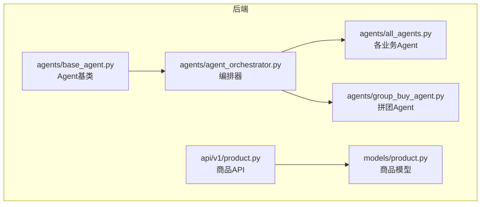
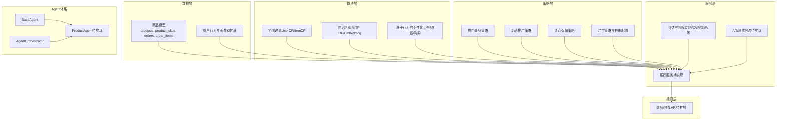
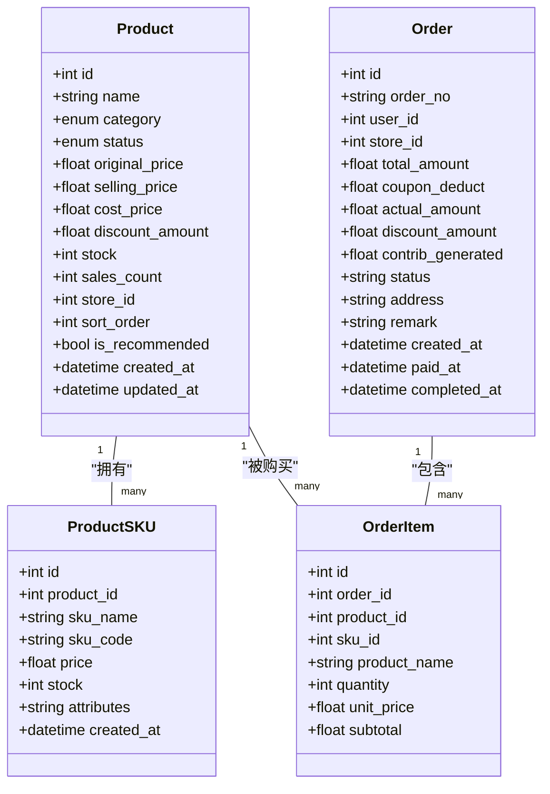
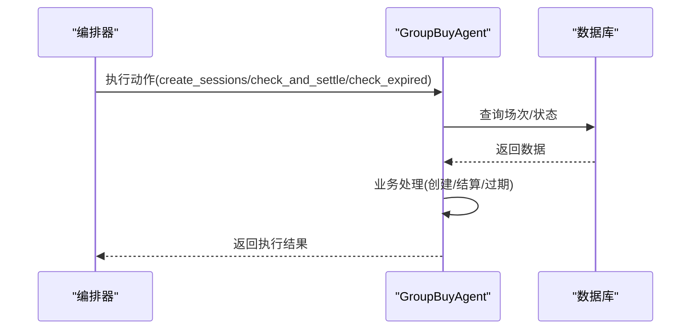
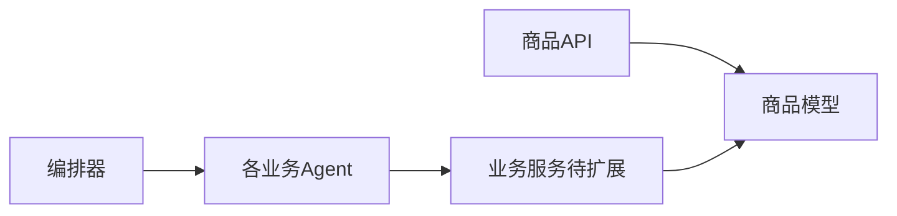

# 商品推荐Agent

<cite>
**本文引用的文件**   
- [base_agent.py](file://backend/app/agents/base_agent.py)
- [agent_orchestrator.py](file://backend/app/agents/agent_orchestrator.py)
- [all_agents.py](file://backend/app/agents/all_agents.py)
- [group_buy_agent.py](file://backend/app/agents/group_buy_agent.py)
- [product.py](file://backend/app/models/product.py)
- [product_api.py](file://backend/app/api/v1/product.py)
</cite>

## 目录
1. [简介](#简介)
2. [项目结构](#项目结构)
3. [核心组件](#核心组件)
4. [架构总览](#架构总览)
5. [详细组件分析](#详细组件分析)
6. [依赖关系分析](#依赖关系分析)
7. [性能考虑](#性能考虑)
8. [故障排查指南](#故障排查指南)
9. [结论](#结论)
10. [附录](#附录)

## 简介
本技术文档聚焦于“商品推荐Agent（ProductAgent）”的设计与实现，围绕以下目标展开：
- 智能推荐算法：基于用户行为的个性化推荐、协同过滤、内容相似度匹配。
- 商品标签体系与分类逻辑：自动打标与人工标注结合。
- 推荐策略配置与管理：热门商品、新品推广、清仓促销等场景化策略。
- 推荐效果评估与A/B测试框架。
- 与用户画像Agent的数据协作机制。
- 推荐结果多样性控制与冷启动解决方案。

说明：当前仓库中未包含专门的“ProductAgent”代码实现，但已具备通用Agent基类、编排器以及商品数据模型与基础API。本文在严格依据现有代码的基础上，给出可扩展的推荐Agent设计方案与落地路径，确保后续可直接接入到既有Agent体系中。

## 项目结构
本项目采用分层与领域驱动相结合的组织方式：
- agents：定义Agent抽象与具体业务Agent（如拼团、分账、风控等），并提供了统一的编排调度器。
- models：领域数据模型，包括商品、订单、SKU等。
- api：对外REST接口，提供商品列表与详情查询。
- services：业务服务层（当前仓库未见推荐相关服务）。
- tasks：异步任务（当前仓库未见推荐相关任务）。

图表来源
- [base_agent.py:1-47](file://backend/app/agents/base_agent.py#L1-L47)
- [agent_orchestrator.py:1-94](file://backend/app/agents/agent_orchestrator.py#L1-L94)
- [all_agents.py:1-114](file://backend/app/agents/all_agents.py#L1-L114)
- [group_buy_agent.py:1-67](file://backend/app/agents/group_buy_agent.py#L1-L67)
- [product.py:1-135](file://backend/app/models/product.py#L1-L135)
- [product_api.py:1-41](file://backend/app/api/v1/product.py#L1-L41)

章节来源
- [base_agent.py:1-47](file://backend/app/agents/base_agent.py#L1-L47)
- [agent_orchestrator.py:1-94](file://backend/app/agents/agent_orchestrator.py#L1-L94)
- [all_agents.py:1-114](file://backend/app/agents/all_agents.py#L1-L114)
- [group_buy_agent.py:1-67](file://backend/app/agents/group_buy_agent.py#L1-L67)
- [product.py:1-135](file://backend/app/models/product.py#L1-L135)
- [product_api.py:1-41](file://backend/app/api/v1/product.py#L1-L41)

## 核心组件
- Agent基类：定义了Agent的统一生命周期（执行、继续判断、状态管理、日志记录），为新增推荐Agent提供标准化扩展点。
- 编排器：集中管理多个Agent实例，并提供流水线式调用能力；推荐Agent可无缝接入该编排器。
- 商品模型：提供商品品类、状态、排序与推荐标记字段，是推荐系统的基础数据源。
- 商品API：提供商品列表与详情查询，可作为推荐结果的消费入口。

章节来源
- [base_agent.py:1-47](file://backend/app/agents/base_agent.py#L1-L47)
- [agent_orchestrator.py:1-94](file://backend/app/agents/agent_orchestrator.py#L1-L94)
- [product.py:1-135](file://backend/app/models/product.py#L1-L135)
- [product_api.py:1-41](file://backend/app/api/v1/product.py#L1-L41)

## 架构总览
推荐系统的整体架构由“数据层—算法层—策略层—服务层—接口层”构成，并与现有Agent体系集成。

图表来源
- [base_agent.py:1-47](file://backend/app/agents/base_agent.py#L1-L47)
- [agent_orchestrator.py:1-94](file://backend/app/agents/agent_orchestrator.py#L1-L94)
- [product.py:1-135](file://backend/app/models/product.py#L1-L135)
- [product_api.py:1-41](file://backend/app/api/v1/product.py#L1-L41)

## 详细组件分析

### 商品标签体系与分类逻辑
- 品类维度：通过枚举定义四大品类（吃/喝/用/穿），便于按品类进行召回与过滤。
- 状态维度：支持草稿、上架、下架、售罄等状态，用于控制推荐可见性。
- 排序与推荐标记：提供排序权重与是否推荐的布尔标记，便于运营干预与策略组合。
- SKU维度：规格与库存信息支撑价格与库存相关的策略（如清仓促销）。

图表来源
- [product.py:1-135](file://backend/app/models/product.py#L1-L135)

章节来源
- [product.py:1-135](file://backend/app/models/product.py#L1-L135)

### 智能推荐算法设计
- 基于用户行为的个性化推荐
  - 输入：用户历史行为（浏览、收藏、加购、购买）、时间衰减权重、会话上下文。
  - 方法：行为序列建模（滑动窗口、兴趣漂移）、偏好向量更新、实时特征计算。
  - 输出：候选集与打分，供策略层融合。
- 协同过滤算法
  - UserCF：基于用户相似度的物品推荐，适合长尾与兴趣迁移。
  - ItemCF：基于物品相似度的推荐，稳定性高、易解释。
  - 工程要点：近邻索引、增量更新、稀疏矩阵优化。
- 内容相似度匹配
  - 文本特征：标题、描述、标签的TF-IDF或轻量Embedding。
  - 结构化特征：品类、价格带、门店、库存状态。
  - 相似度度量：余弦相似度、Jaccard、加权距离。
- 复杂度与性能
  - 离线构建用户-物品共现矩阵与物品相似度矩阵，在线检索降维。
  - 缓存热点用户与物品向量，降低重复计算。

[本节为概念性设计，不直接分析具体文件]

### 推荐策略的配置与管理
- 热门商品推荐
  - 规则：按销量、近期热度、转化率加权排序。
  - 适用：首页、频道页、活动页。
- 新品推广
  - 规则：上新时间窗内优先曝光，结合用户兴趣匹配度。
  - 适用：新品专区、个性化Feed。
- 清仓促销
  - 规则：低库存、高折扣、滞销品优先，结合用户价格敏感度。
  - 适用：特卖区、清仓频道。
- 混合策略
  - 多路召回+重排：将热门、协同、内容相似度结果融合，按业务权重动态调整。
  - 策略开关：通过配置中心或数据库表控制策略生效范围与权重。

[本节为概念性设计，不直接分析具体文件]

### 推荐效果评估与A/B测试框架
- 评估指标
  - 曝光与点击：CTR、曝光量、点击量。
  - 转化与交易：CVR、下单率、GMV、客单价。
  - 多样性与新颖性：品类覆盖率、长尾占比、重复度。
  - 公平性与质量：评分分布、退货率、差评率。
- A/B测试
  - 分流：基于用户ID哈希或会话ID分配实验组。
  - 指标采集：埋点上报、事件聚合、显著性检验。
  - 决策：以业务目标为导向的多指标综合评估。

[本节为概念性设计，不直接分析具体文件]

### 与用户画像Agent的数据协作机制
- 数据契约
  - 用户画像：兴趣标签、价格敏感度、品类偏好、活跃时段。
  - 行为流：实时事件（点击、收藏、购买）与离线统计（周/月趋势）。
- 协作流程
  - 画像更新：用户行为触发增量更新，定期全量校准。
  - 推荐调用：推荐服务读取画像与行为特征，生成候选与打分。
  - 反馈闭环：曝光与转化数据回流至画像与模型训练。

[本节为概念性设计，不直接分析具体文件]

### 推荐结果多样性控制与冷启动方案
- 多样性控制
  - 去重与打散：同品类/同门店限制比例，跨品类均衡。
  - 探索与利用：引入Bandit或随机注入，提升长尾曝光。
- 冷启动
  - 新用户：基于地域、渠道、注册来源的默认兴趣与热门策略。
  - 新商品：内容相似度与编辑精选，结合小流量测试逐步放量。

[本节为概念性设计，不直接分析具体文件]

### 与现有Agent体系的集成
- 统一基类
  - 所有Agent继承统一基类，具备标准执行与状态管理能力。
- 编排器接入
  - 推荐Agent可通过编排器纳入流水线，与其他Agent（如风控、权益）协作。
- 示例：拼团Agent的执行流程（作为参考模式）

图表来源
- [agent_orchestrator.py:1-94](file://backend/app/agents/agent_orchestrator.py#L1-L94)
- [group_buy_agent.py:1-67](file://backend/app/agents/group_buy_agent.py#L1-L67)

章节来源
- [base_agent.py:1-47](file://backend/app/agents/base_agent.py#L1-L47)
- [agent_orchestrator.py:1-94](file://backend/app/agents/agent_orchestrator.py#L1-L94)
- [group_buy_agent.py:1-67](file://backend/app/agents/group_buy_agent.py#L1-L67)

## 依赖关系分析
- 模块耦合
  - 商品API依赖商品模型，提供基础查询能力。
  - 编排器依赖各业务Agent，形成松耦合的插件式架构。
- 外部依赖
  - 数据库：商品、订单、SKU等实体存储。
  - 未来扩展：推荐算法库、特征存储、缓存与消息队列。

图表来源
- [product_api.py:1-41](file://backend/app/api/v1/product.py#L1-L41)
- [product.py:1-135](file://backend/app/models/product.py#L1-L135)
- [agent_orchestrator.py:1-94](file://backend/app/agents/agent_orchestrator.py#L1-L94)
- [all_agents.py:1-114](file://backend/app/agents/all_agents.py#L1-L114)

章节来源
- [product_api.py:1-41](file://backend/app/api/v1/product.py#L1-L41)
- [product.py:1-135](file://backend/app/models/product.py#L1-L135)
- [agent_orchestrator.py:1-94](file://backend/app/agents/agent_orchestrator.py#L1-L94)
- [all_agents.py:1-114](file://backend/app/agents/all_agents.py#L1-L114)

## 性能考虑
- 数据访问
  - 对商品列表与详情查询增加必要索引（品类、状态、门店、更新时间）。
  - 使用分页与限流，避免大结果集拖慢响应。
- 算法计算
  - 离线预计算用户-物品相似度与热门榜单，在线仅做检索与融合。
  - 缓存热点用户画像与物品向量，减少重复计算。
- 并发与异步
  - 推荐服务内部采用异步IO与批处理，降低延迟。
  - 关键路径（如首屏推荐）设置超时与降级策略。

[本节为通用指导，不直接分析具体文件]

## 故障排查指南
- 常见错误
  - 商品不存在：当请求的商品ID无效时返回404。
  - 数据库连接异常：检查连接池与网络连通性。
  - 推荐服务不可用：启用降级策略，回退到热门或编辑精选。
- 定位方法
  - 查看Agent日志与编排器日志，确认执行阶段与错误堆栈。
  - 核对商品状态与库存，确保推荐结果有效。
  - 校验A/B分流与埋点上报，确保指标准确。

章节来源
- [product_api.py:34-41](file://backend/app/api/v1/product.py#L34-L41)
- [base_agent.py:31-47](file://backend/app/agents/base_agent.py#L31-L47)

## 结论
当前仓库已具备通用的Agent基类与编排器，以及商品数据模型与基础API，为“商品推荐Agent”的落地提供了良好基础。建议按本文方案逐步实现：
- 在agents目录下新增ProductAgent，继承BaseAgent并通过编排器接入。
- 在services目录下实现推荐服务，整合协同过滤、内容相似度与行为个性化。
- 在api目录下扩展推荐接口，承接前端展示与埋点上报。
- 建立评估与A/B测试框架，持续优化推荐效果与业务指标。

[本节为总结性内容，不直接分析具体文件]

## 附录
- 术语
  - 协同过滤：基于用户或物品相似度的推荐方法。
  - 内容相似度：基于文本与结构化特征的相似度计算。
  - 冷启动：新用户或新商品的推荐问题。
- 扩展建议
  - 引入特征平台与模型服务，提升推荐精度与效率。
  - 完善监控与告警，保障线上稳定性。

[本节为补充说明，不直接分析具体文件]