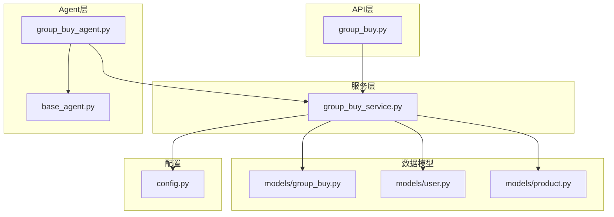
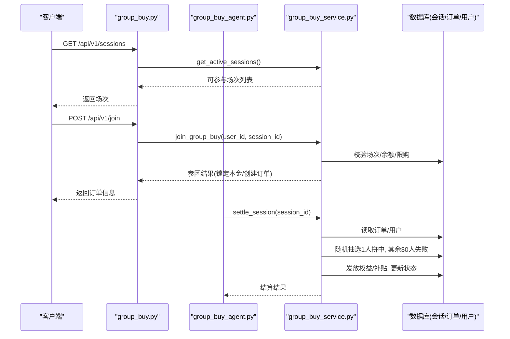
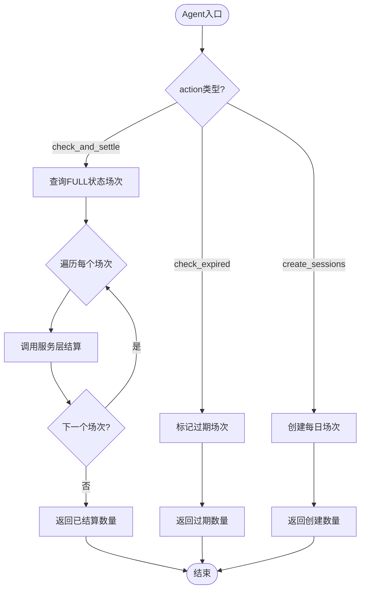
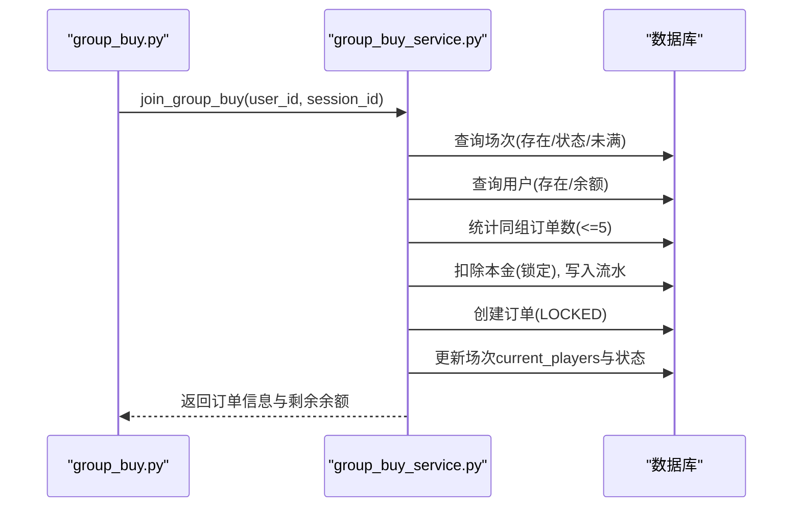
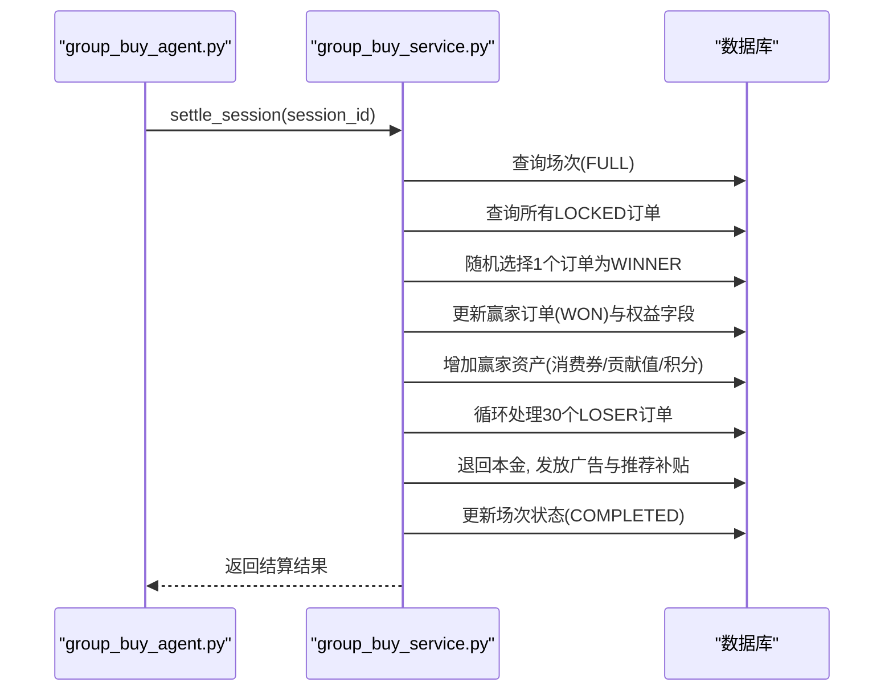
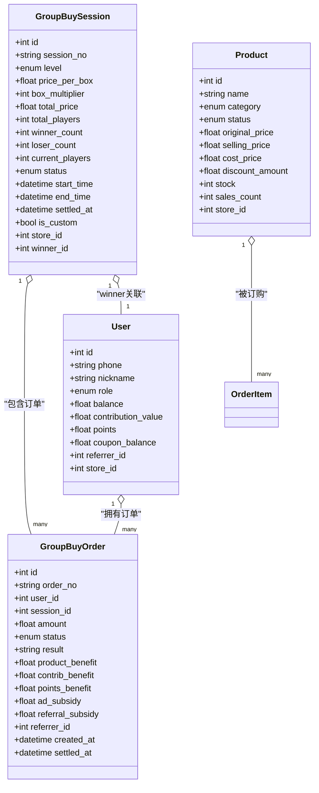
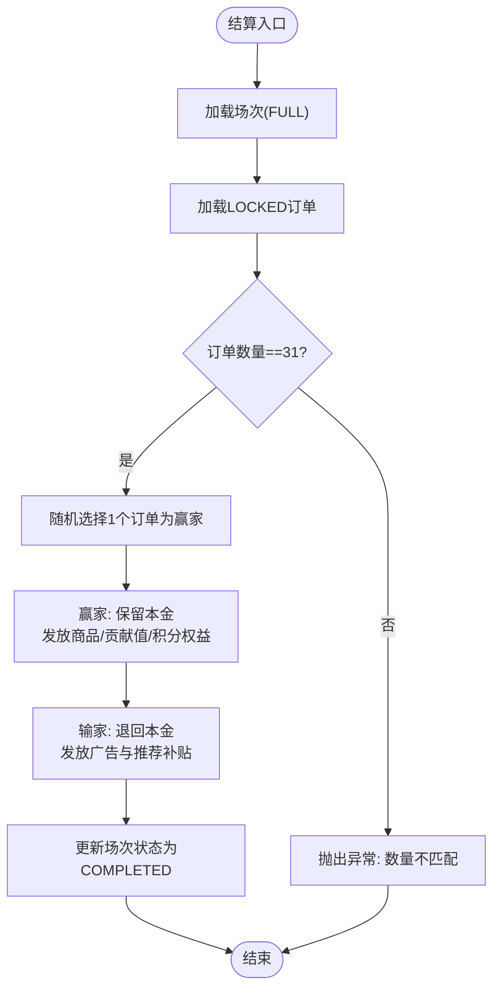
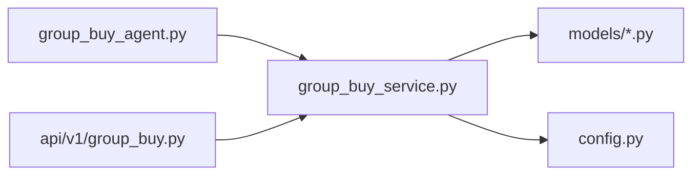

# 拼团分析Agent

<cite>
**本文引用的文件**   
- [backend/app/agents/group_buy_agent.py](file://backend/app/agents/group_buy_agent.py)
- [backend/app/agents/base_agent.py](file://backend/app/agents/base_agent.py)
- [backend/app/services/group_buy_service.py](file://backend/app/services/group_buy_service.py)
- [backend/app/models/group_buy.py](file://backend/app/models/group_buy.py)
- [backend/app/models/user.py](file://backend/app/models/user.py)
- [backend/app/models/product.py](file://backend/app/models/product.py)
- [backend/app/api/v1/group_buy.py](file://backend/app/api/v1/group_buy.py)
- [backend/app/config.py](file://backend/app/config.py)
</cite>

## 目录
1. [简介](#简介)
2. [项目结构](#项目结构)
3. [核心组件](#核心组件)
4. [架构总览](#架构总览)
5. [详细组件分析](#详细组件分析)
6. [依赖关系分析](#依赖关系分析)
7. [性能考虑](#性能考虑)
8. [故障排查指南](#故障排查指南)
9. [结论](#结论)
10. [附录：调用示例与集成方式](#附录调用示例与集成方式)

## 简介
本技术文档聚焦于“GroupBuyAgent（拼团分析Agent）”的业务逻辑与实现。该Agent负责拼团场次的调度、人数监控、结果判定与分账触发，并围绕“法库啤酒专属拼团”的固定规则进行结算：每场31人参与，1人拼中，30人拼失败；拼中用户获得商品权益、贡献值与积分，拼失败用户获得本金退回与补贴。文档同时说明数据输入来源（场次信息、用户历史行为、商品属性）、结果判定经济学模型、异常处理机制、性能优化策略、调试方法以及与其他模块的集成方式。

## 项目结构
后端采用分层架构：API层暴露REST接口，Service层封装业务逻辑，Agent层负责定时或事件驱动的调度任务，Models定义数据模型，Config提供全局配置。

图表来源
- [backend/app/api/v1/group_buy.py:1-65](file://backend/app/api/v1/group_buy.py#L1-L65)
- [backend/app/services/group_buy_service.py:1-348](file://backend/app/services/group_buy_service.py#L1-L348)
- [backend/app/agents/group_buy_agent.py:1-67](file://backend/app/agents/group_buy_agent.py#L1-L67)
- [backend/app/agents/base_agent.py:1-47](file://backend/app/agents/base_agent.py#L1-L47)
- [backend/app/models/group_buy.py:1-158](file://backend/app/models/group_buy.py#L1-L158)
- [backend/app/models/user.py:1-93](file://backend/app/models/user.py#L1-L93)
- [backend/app/models/product.py:1-135](file://backend/app/models/product.py#L1-L135)
- [backend/app/config.py:1-136](file://backend/app/config.py#L1-L136)

章节来源
- [backend/app/api/v1/group_buy.py:1-65](file://backend/app/api/v1/group_buy.py#L1-L65)
- [backend/app/services/group_buy_service.py:1-348](file://backend/app/services/group_buy_service.py#L1-L348)
- [backend/app/agents/group_buy_agent.py:1-67](file://backend/app/agents/group_buy_agent.py#L1-L67)
- [backend/app/agents/base_agent.py:1-47](file://backend/app/agents/base_agent.py#L1-L47)
- [backend/app/models/group_buy.py:1-158](file://backend/app/models/group_buy.py#L1-L158)
- [backend/app/models/user.py:1-93](file://backend/app/models/user.py#L1-L93)
- [backend/app/models/product.py:1-135](file://backend/app/models/product.py#L1-L135)
- [backend/app/config.py:1-136](file://backend/app/config.py#L1-L136)

## 核心组件
- GroupBuyAgent：拼团调度Agent，负责创建每日场次、检查已满场次并结算、处理过期场次等动作。
- GroupBuyService：拼团核心业务服务，实现开团、参团、满员判定、结果结算、权益发放等全流程。
- 数据模型：GroupBuySession、GroupBuyOrder、User、Product等，承载场次、订单、用户资产与商品信息。
- 配置：全局参数控制拼团规模、收益比例、时间窗口等。

章节来源
- [backend/app/agents/group_buy_agent.py:1-67](file://backend/app/agents/group_buy_agent.py#L1-L67)
- [backend/app/services/group_buy_service.py:1-348](file://backend/app/services/group_buy_service.py#L1-L348)
- [backend/app/models/group_buy.py:1-158](file://backend/app/models/group_buy.py#L1-L158)
- [backend/app/models/user.py:1-93](file://backend/app/models/user.py#L1-L93)
- [backend/app/models/product.py:1-135](file://backend/app/models/product.py#L1-L135)
- [backend/app/config.py:1-136](file://backend/app/config.py#L1-L136)

## 架构总览
下图展示从API到Agent再到服务与模型的调用链，以及关键状态流转。

图表来源
- [backend/app/api/v1/group_buy.py:15-49](file://backend/app/api/v1/group_buy.py#L15-L49)
- [backend/app/services/group_buy_service.py:93-181](file://backend/app/services/group_buy_service.py#L93-L181)
- [backend/app/services/group_buy_service.py:184-321](file://backend/app/services/group_buy_service.py#L184-L321)
- [backend/app/agents/group_buy_agent.py:31-46](file://backend/app/agents/group_buy_agent.py#L31-L46)

## 详细组件分析

### GroupBuyAgent（拼团调度Agent）
职责与能力
- 创建每日场次：按配置的时间段与级别批量生成场次。
- 检查并结算：查询已满员场次，逐个调用服务层进行结算。
- 处理过期场次：将超时未完成的场次标记为过期。

执行流程要点
- execute(context)根据action分支执行不同任务。
- should_continue返回False表示单次执行即可。

图表来源
- [backend/app/agents/group_buy_agent.py:21-63](file://backend/app/agents/group_buy_agent.py#L21-L63)
- [backend/app/services/group_buy_service.py:28-59](file://backend/app/services/group_buy_service.py#L28-L59)

章节来源
- [backend/app/agents/group_buy_agent.py:1-67](file://backend/app/agents/group_buy_agent.py#L1-L67)
- [backend/app/agents/base_agent.py:1-47](file://backend/app/agents/base_agent.py#L1-L47)

### GroupBuyService（拼团核心服务）
关键能力
- 创建每日场次：按小时与级别生成场次，设置价格、人数、时间窗等。
- 自定义开团：门店可发起自定义场次。
- 用户参团：校验场次状态、单组限购、余额充足，锁定本金并创建订单。
- 场次结算：满员后随机抽取1人拼中，其余30人失败，发放权益与补贴，更新状态。
- 查询接口：获取可参与场次与用户订单记录。

参团流程时序图

图表来源
- [backend/app/api/v1/group_buy.py:26-38](file://backend/app/api/v1/group_buy.py#L26-L38)
- [backend/app/services/group_buy_service.py:93-181](file://backend/app/services/group_buy_service.py#L93-L181)

结算流程时序图

图表来源
- [backend/app/agents/group_buy_agent.py:31-46](file://backend/app/agents/group_buy_agent.py#L31-L46)
- [backend/app/services/group_buy_service.py:184-321](file://backend/app/services/group_buy_service.py#L184-L321)

章节来源
- [backend/app/services/group_buy_service.py:1-348](file://backend/app/services/group_buy_service.py#L1-L348)

### 数据模型与关系

图表来源
- [backend/app/models/group_buy.py:42-131](file://backend/app/models/group_buy.py#L42-L131)
- [backend/app/models/user.py:26-71](file://backend/app/models/user.py#L26-L71)
- [backend/app/models/product.py:30-72](file://backend/app/models/product.py#L30-L72)

章节来源
- [backend/app/models/group_buy.py:1-158](file://backend/app/models/group_buy.py#L1-L158)
- [backend/app/models/user.py:1-93](file://backend/app/models/user.py#L1-L93)
- [backend/app/models/product.py:1-135](file://backend/app/models/product.py#L1-L135)

### 经济学模型与结果判定
- 场次规模：每场31人，1人拼中，30人拼失败。
- 拼中权益：商品权益=金额×10%，贡献值权益=金额×20%，积分权益=金额×20%。
- 拼失败保障：本金全额退回，广告补贴=金额×0.7%，推荐人补贴=金额×0.1%。
- 平台收支分配：代理支出、门店分账、推荐门店、拼中权益、拼失败补贴、平台利润等比例在配置中统一维护。

图表来源
- [backend/app/services/group_buy_service.py:184-321](file://backend/app/services/group_buy_service.py#L184-L321)
- [backend/app/config.py:79-99](file://backend/app/config.py#L79-L99)

章节来源
- [backend/app/services/group_buy_service.py:184-321](file://backend/app/services/group_buy_service.py#L184-L321)
- [backend/app/config.py:79-99](file://backend/app/config.py#L79-L99)

### 库存匹配算法
当前代码未实现基于库存的商品匹配逻辑。商品模型具备库存字段，可用于后续扩展：在结算时依据赢家偏好或品类偏好，结合库存余量进行商品权益发放匹配。建议引入以下策略：
- 优先级排序：按用户偏好、商品毛利、库存深度加权评分。
- 约束条件：库存≥需求、SKU可用、区域配送可达。
- 回退策略：当首选不可用时，按次优候选依次尝试。

[本节为概念性设计，不涉及具体源码]

### 用户画像与成功率预测
当前代码未实现用户画像与成功率预测功能。可在现有数据基础上扩展：
- 用户画像维度：参团频次、平均参团金额、历史赢率、推荐关系深度、消费偏好。
- 预测目标：某用户在特定场次中的获胜概率（受随机抽取影响，可作为营销与风控参考）。
- 特征工程：历史订单分布、时间段偏好、等级偏好、余额波动。
- 模型输出：用于前端展示“期望收益测算”或作为运营策略输入。

[本节为概念性设计，不涉及具体源码]

## 依赖关系分析
- Agent依赖Service完成具体业务操作。
- Service依赖数据模型与配置，读写数据库。
- API层通过依赖注入获取数据库会话，调用Service。

图表来源
- [backend/app/agents/group_buy_agent.py:1-67](file://backend/app/agents/group_buy_agent.py#L1-L67)
- [backend/app/services/group_buy_service.py:1-348](file://backend/app/services/group_buy_service.py#L1-L348)
- [backend/app/api/v1/group_buy.py:1-65](file://backend/app/api/v1/group_buy.py#L1-L65)
- [backend/app/config.py:1-136](file://backend/app/config.py#L1-L136)

章节来源
- [backend/app/agents/group_buy_agent.py:1-67](file://backend/app/agents/group_buy_agent.py#L1-L67)
- [backend/app/services/group_buy_service.py:1-348](file://backend/app/services/group_buy_service.py#L1-L348)
- [backend/app/api/v1/group_buy.py:1-65](file://backend/app/api/v1/group_buy.py#L1-L65)
- [backend/app/config.py:1-136](file://backend/app/config.py#L1-L136)

## 性能考虑
- 并发参团：在高并发场景下，需确保场次人数与余额扣减的原子性，避免超卖与重复锁定。建议在Service层使用数据库事务与行级锁。
- 批量结算：对FULL场次批量结算时，应分批处理，避免长事务导致锁竞争。
- 索引优化：订单与场次表已有复合索引，有助于快速查询与分页。
- 异步化：Agent可通过Celery等任务队列异步执行，降低主线程阻塞风险。
- 缓存热点：场次列表与用户订单可采用Redis缓存，减少数据库压力。

[本节为通用指导，不涉及具体源码]

## 故障排查指南
- 参团失败常见原因：
  - 场次不存在或状态不允许参与。
  - 单ID单组超过最大订单数限制。
  - 用户余额不足。
- 结算失败常见原因：
  - 场次状态非FULL。
  - 订单数量与场次人数不一致。
- 日志定位：
  - Agent在执行过程中会记录错误日志，便于追踪问题。
  - 钱包流水表记录每次资产变动，便于核对资金流向。

章节来源
- [backend/app/agents/group_buy_agent.py:41-46](file://backend/app/agents/group_buy_agent.py#L41-L46)
- [backend/app/services/group_buy_service.py:104-181](file://backend/app/services/group_buy_service.py#L104-L181)
- [backend/app/services/group_buy_service.py:184-207](file://backend/app/services/group_buy_service.py#L184-L207)
- [backend/app/models/user.py:74-93](file://backend/app/models/user.py#L74-L93)

## 结论
GroupBuyAgent与GroupBuyService共同实现了拼团的核心闭环：场次管理、参团校验、结果判定与权益发放。系统以固定经济学模型为基础，保证公平性与可预期性。未来可扩展库存匹配、用户画像与成功率预测等AI能力，进一步提升运营效率与用户体验。

[本节为总结，不涉及具体源码]

## 附录：调用示例与集成方式

### 通过API调用拼团
- 获取可参与场次：GET /api/v1/sessions?level=junior|senior|svip
- 参与拼团：POST /api/v1/join，请求体包含session_id
- 查看我的订单：GET /api/v1/orders?page=1&size=20
- 场次详情：GET /api/v1/sessions/{session_id}

章节来源
- [backend/app/api/v1/group_buy.py:15-65](file://backend/app/api/v1/group_buy.py#L15-L65)

### 通过Agent执行调度任务
- 创建每日场次：调用Agent.execute(context={"db": session, "action": "create_sessions", "date": datetime})
- 检查并结算：调用Agent.execute(context={"db": session, "action": "check_and_settle"})
- 处理过期场次：调用Agent.execute(context={"db": session, "action": "check_expired"})

章节来源
- [backend/app/agents/group_buy_agent.py:21-63](file://backend/app/agents/group_buy_agent.py#L21-L63)

### 与其他Agent的数据交互模式
- 当前仓库未定义其他Agent的具体实现。若需要扩展，建议：
  - 通过消息队列或共享数据库表传递上下文（如场次ID、用户ID、订单ID）。
  - 在Service层抽象出可复用的领域函数，供多个Agent协同调用。
  - 使用统一的日志与指标上报，便于跨Agent链路追踪。

[本节为概念性设计，不涉及具体源码]