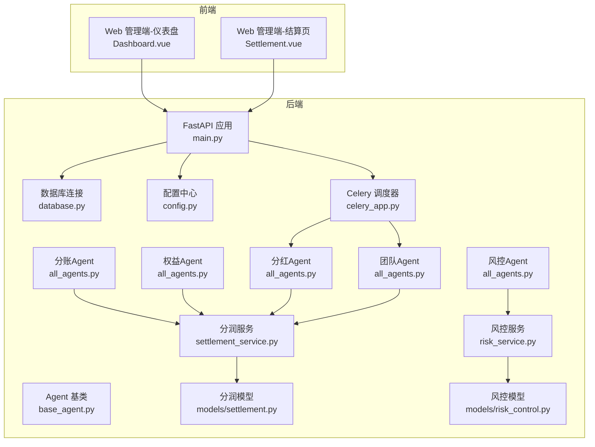
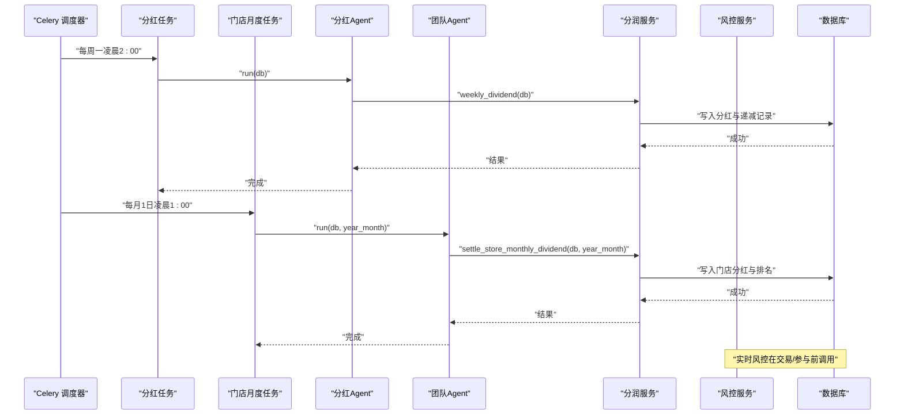
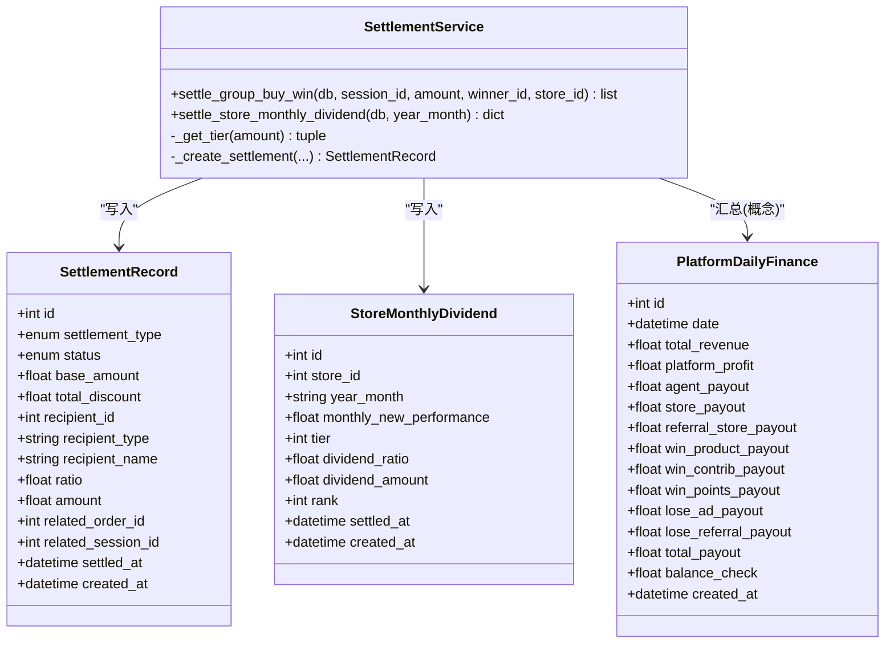
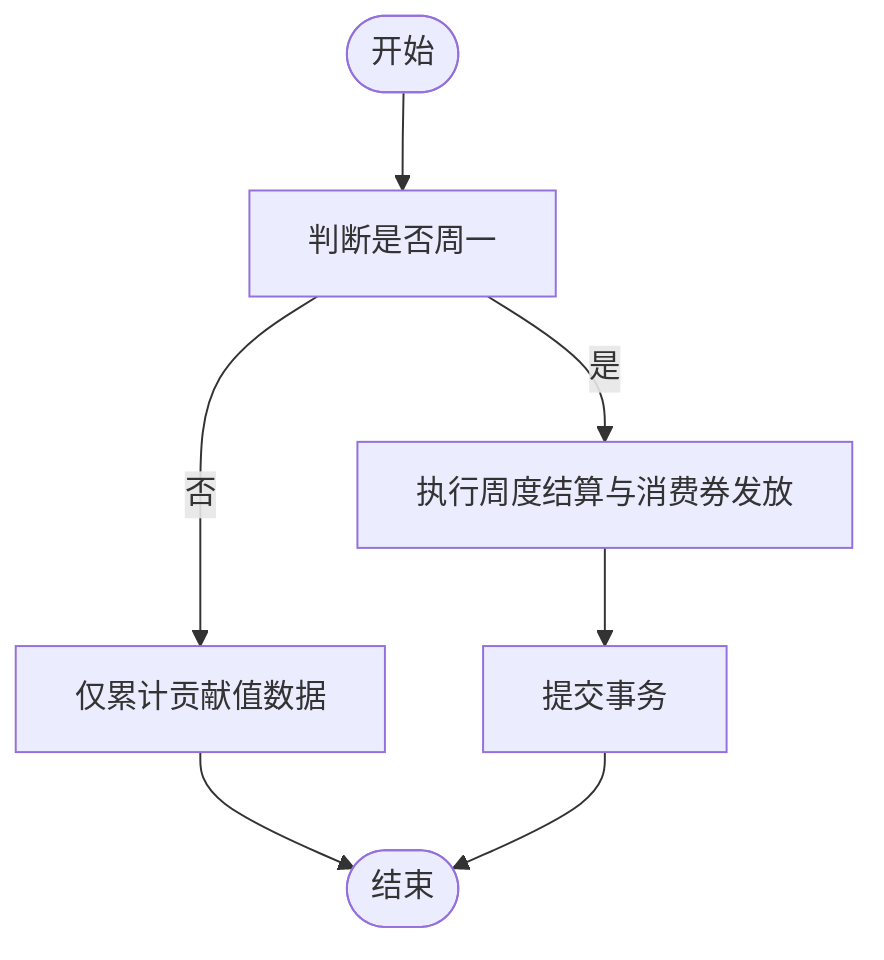
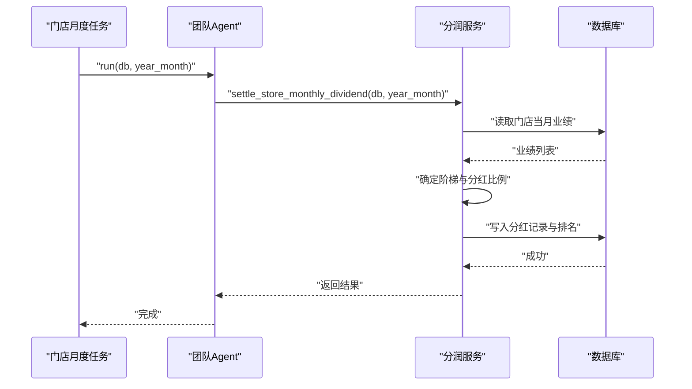
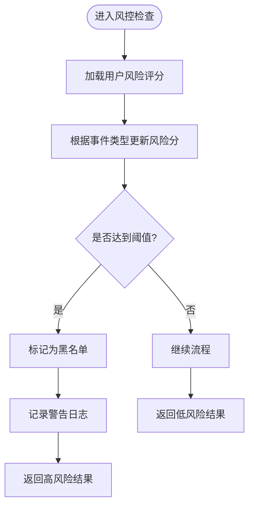
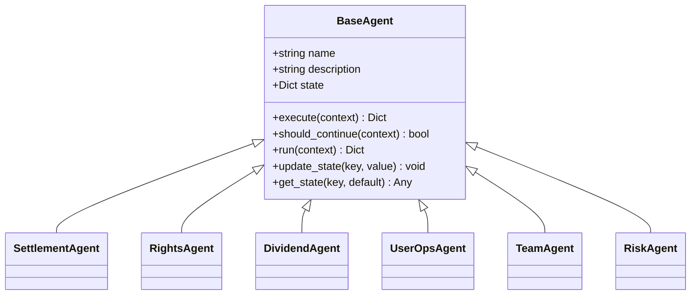
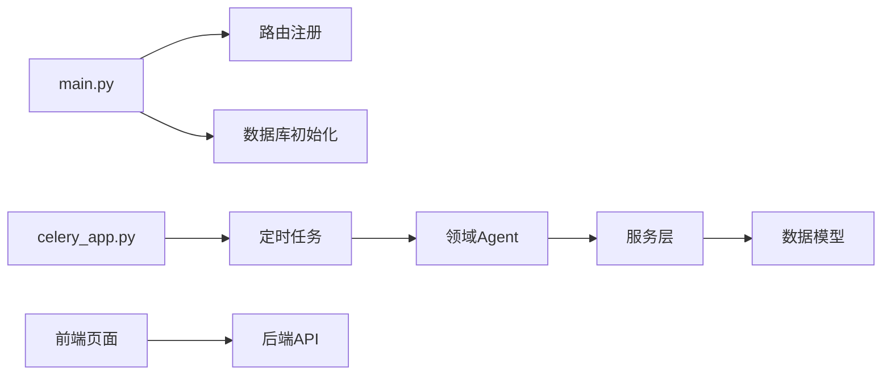

# 数据分析Agent

<cite>
**本文引用的文件**
- [backend/app/main.py](file://backend/app/main.py)
- [backend/app/database.py](file://backend/app/database.py)
- [backend/app/config.py](file://backend/app/config.py)
- [backend/app/tasks/celery_app.py](file://backend/app/tasks/celery_app.py)
- [backend/app/tasks/dividend_tasks.py](file://backend/app/tasks/dividend_tasks.py)
- [backend/app/tasks/contribution_tasks.py](file://backend/app/tasks/contribution_tasks.py)
- [backend/app/tasks/store_rank_tasks.py](file://backend/app/tasks/store_rank_tasks.py)
- [backend/app/agents/base_agent.py](file://backend/app/agents/base_agent.py)
- [backend/app/agents/all_agents.py](file://backend/app/agents/all_agents.py)
- [backend/app/agents/agent_orchestrator.py](file://backend/app/agents/agent_orchestrator.py)
- [backend/app/services/settlement_service.py](file://backend/app/services/settlement_service.py)
- [backend/app/models/settlement.py](file://backend/app/models/settlement.py)
- [backend/app/models/risk_control.py](file://backend/app/models/risk_control.py)
- [backend/app/services/risk_service.py](file://backend/app/services/risk_service.py)
- [frontend/web-admin/src/views/Dashboard.vue](file://frontend/web-admin/src/views/Dashboard.vue)
- [frontend/web-admin/src/views/Settlement.vue](file://frontend/web-admin/src/views/Settlement.vue)
</cite>

## 目录
1. [引言](#引言)
2. [项目结构](#项目结构)
3. [核心组件](#核心组件)
4. [架构总览](#架构总览)
5. [详细组件分析](#详细组件分析)
6. [依赖关系分析](#依赖关系分析)
7. [性能与查询优化](#性能与查询优化)
8. [数据质量与完整性校验](#数据质量与完整性校验)
9. [可视化与交互式分析](#可视化与交互式分析)
10. [报表自动生成与定时推送](#报表自动生成与定时推送)
11. [自定义分析与扩展接口](#自定义分析与扩展接口)
12. [故障排查指南](#故障排查指南)
13. [结论](#结论)

## 引言
本技术文档聚焦于平台级“数据分析Agent”能力，围绕关键业务指标监控、趋势分析、异常检测、预测建模、报表自动化生成与推送、数据仓库与ETL链路、可视化与交互分析、大数据量查询优化、数据质量与完整性校验，以及自定义分析任务的开发接口与扩展方法展开。文档以现有代码为基础，给出可落地的架构设计与实现路径，并配套时序图、流程图与类图帮助读者快速理解。

## 项目结构
后端采用FastAPI应用入口，结合Celery进行任务调度；Agent层通过统一基类抽象执行流程，具体领域Agent（分账、权益、分红、团队、风控等）调用服务层完成计算与持久化；前端管理端提供仪表盘与结算页面用于指标展示与操作。

图表来源
- [backend/app/main.py:1-75](file://backend/app/main.py#L1-L75)
- [backend/app/tasks/celery_app.py:1-56](file://backend/app/tasks/celery_app.py#L1-L56)
- [backend/app/agents/base_agent.py:1-47](file://backend/app/agents/base_agent.py#L1-L47)
- [backend/app/agents/all_agents.py:1-114](file://backend/app/agents/all_agents.py#L1-L114)
- [backend/app/services/settlement_service.py:1-166](file://backend/app/services/settlement_service.py#L1-L166)
- [backend/app/models/settlement.py:1-123](file://backend/app/models/settlement.py#L1-L123)
- [backend/app/models/risk_control.py:1-44](file://backend/app/models/risk_control.py#L1-L44)
- [backend/app/services/risk_service.py:67-106](file://backend/app/services/risk_service.py#L67-L106)
- [frontend/web-admin/src/views/Dashboard.vue:64-94](file://frontend/web-admin/src/views/Dashboard.vue#L64-L94)
- [frontend/web-admin/src/views/Settlement.vue:36-145](file://frontend/web-admin/src/views/Settlement.vue#L36-L145)

章节来源
- [backend/app/main.py:1-75](file://backend/app/main.py#L1-L75)
- [backend/app/tasks/celery_app.py:1-56](file://backend/app/tasks/celery_app.py#L1-L56)
- [backend/app/agents/base_agent.py:1-47](file://backend/app/agents/base_agent.py#L1-L47)
- [backend/app/agents/all_agents.py:1-114](file://backend/app/agents/all_agents.py#L1-L114)
- [backend/app/services/settlement_service.py:1-166](file://backend/app/services/settlement_service.py#L1-L166)
- [backend/app/models/settlement.py:1-123](file://backend/app/models/settlement.py#L1-L123)
- [backend/app/models/risk_control.py:1-44](file://backend/app/models/risk_control.py#L1-L44)
- [backend/app/services/risk_service.py:67-106](file://backend/app/services/risk_service.py#L67-L106)
- [frontend/web-admin/src/views/Dashboard.vue:64-94](file://frontend/web-admin/src/views/Dashboard.vue#L64-L94)
- [frontend/web-admin/src/views/Settlement.vue:36-145](file://frontend/web-admin/src/views/Settlement.vue#L36-L145)

## 核心组件
- Agent基类：定义统一的执行生命周期、状态管理与日志记录，所有领域Agent继承该基类以实现标准化运行。
- 领域Agent：
  - 分账Agent：订单完成后按固定比例计算各方收益并写入结算记录。
  - 权益Agent：根据拼团结果发放贡献值、积分、消费券。
  - 分红Agent：每周一触发全网贡献值分红与递减核算。
  - 团队Agent：统计四级团队业绩、排名与阶梯分红。
  - 风控Agent：实时监控限购、异常操作、违规开团并自动拦截或警告。
- 服务层：封装复杂业务逻辑，如分润结算、门店月度阶梯分红、风控评分更新等。
- 数据模型：分润结算记录、门店月度分红、平台每日财务汇总、风控日志与评分等。
- 任务调度：Celery Beat定时任务驱动分红、贡献值核算、门店月度排名与分红等。

章节来源
- [backend/app/agents/base_agent.py:1-47](file://backend/app/agents/base_agent.py#L1-L47)
- [backend/app/agents/all_agents.py:1-114](file://backend/app/agents/all_agents.py#L1-L114)
- [backend/app/services/settlement_service.py:1-166](file://backend/app/services/settlement_service.py#L1-L166)
- [backend/app/models/settlement.py:1-123](file://backend/app/models/settlement.py#L1-L123)
- [backend/app/models/risk_control.py:1-44](file://backend/app/models/risk_control.py#L1-L44)
- [backend/app/services/risk_service.py:67-106](file://backend/app/services/risk_service.py#L67-L106)
- [backend/app/tasks/celery_app.py:1-56](file://backend/app/tasks/celery_app.py#L1-L56)

## 架构总览
系统由“事件/定时触发 → Celery调度 → Agent编排 → 服务计算 → 数据持久化 → 前端展示”的闭环构成。关键业务流程包括：
- 每日例行：创建场次、检查过期、结算已满场次。
- 每周结算：贡献值递减兑换与全网分红。
- 月度结算：门店业绩排名与阶梯分红。
- 实时风控：用户参与前风险评分与规则校验。

图表来源
- [backend/app/tasks/celery_app.py:24-55](file://backend/app/tasks/celery_app.py#L24-L55)
- [backend/app/tasks/dividend_tasks.py:15-26](file://backend/app/tasks/dividend_tasks.py#L15-L26)
- [backend/app/tasks/store_rank_tasks.py:15-29](file://backend/app/tasks/store_rank_tasks.py#L15-L29)
- [backend/app/agents/all_agents.py:48-94](file://backend/app/agents/all_agents.py#L48-L94)
- [backend/app/services/settlement_service.py:87-133](file://backend/app/services/settlement_service.py#L87-L133)
- [backend/app/services/risk_service.py:67-106](file://backend/app/services/risk_service.py#L67-L106)

## 详细组件分析

### 分账与结算体系
- 分账规则：线下四级代理（省1%、市2%、区县4%）、门店8%、推荐门店1%，平台利润10%，合计100%分配。
- 结算记录：每笔交易产生多角色分润记录，包含基础金额、折扣、接收方类型与金额、关联会话/订单等。
- 门店月度阶梯分红：依据当月新增业绩落入不同阶梯，按比例计算分红金额并记录排名。
- 平台每日财务汇总：记录总收入、各支出项与总支出，平衡校验字段确保100%分配。

图表来源
- [backend/app/models/settlement.py:30-123](file://backend/app/models/settlement.py#L30-L123)
- [backend/app/services/settlement_service.py:17-166](file://backend/app/services/settlement_service.py#L17-L166)

章节来源
- [backend/app/models/settlement.py:1-123](file://backend/app/models/settlement.py#L1-L123)
- [backend/app/services/settlement_service.py:1-166](file://backend/app/services/settlement_service.py#L1-L166)

### 分红与贡献值核算
- 每周分红：每周一凌晨2:00触发，调用分红Agent执行全网贡献值分红与递减核算。
- 每日贡献值核算：每日凌晨3:00累计贡献值，仅在周一进行统一结算并发放消费券。
- 贡献值来源：拼团成功、消费行为等，按策略生成贡献值记录。

图表来源
- [backend/app/tasks/contribution_tasks.py:15-29](file://backend/app/tasks/contribution_tasks.py#L15-L29)
- [backend/app/tasks/dividend_tasks.py:15-26](file://backend/app/tasks/dividend_tasks.py#L15-L26)

章节来源
- [backend/app/tasks/contribution_tasks.py:1-29](file://backend/app/tasks/contribution_tasks.py#L1-L29)
- [backend/app/tasks/dividend_tasks.py:1-26](file://backend/app/tasks/dividend_tasks.py#L1-L26)

### 团队与门店月度排名
- 月度排名：每月1日凌晨1:00执行，基于上月业绩排序，计算阶梯分红并更新排名与等级。
- 阶梯规则：业绩区间对应不同分红比例，记录分红金额与排名。

图表来源
- [backend/app/tasks/store_rank_tasks.py:15-29](file://backend/app/tasks/store_rank_tasks.py#L15-L29)
- [backend/app/agents/all_agents.py:79-94](file://backend/app/agents/all_agents.py#L79-L94)
- [backend/app/services/settlement_service.py:87-133](file://backend/app/services/settlement_service.py#L87-L133)

章节来源
- [backend/app/tasks/store_rank_tasks.py:1-29](file://backend/app/tasks/store_rank_tasks.py#L1-L29)
- [backend/app/agents/all_agents.py:79-94](file://backend/app/agents/all_agents.py#L79-L94)
- [backend/app/services/settlement_service.py:87-133](file://backend/app/services/settlement_service.py#L87-L133)

### 风控与异常检测
- 风控规则：单日参与上限、单场参与上限、单ID单组最多5单、异常操作检测、违规开团检测、金额异常检测、频率异常检测。
- 风险评分：根据事件类型增加风险分，超过阈值加入黑名单；记录风控日志与动作（放行、警告、拦截、冻结）。
- 实时校验：用户参与前调用风控服务进行检查，必要时发出警告或阻止。

图表来源
- [backend/app/models/risk_control.py:1-44](file://backend/app/models/risk_control.py#L1-L44)
- [backend/app/services/risk_service.py:67-106](file://backend/app/services/risk_service.py#L67-L106)

章节来源
- [backend/app/models/risk_control.py:1-44](file://backend/app/models/risk_control.py#L1-L44)
- [backend/app/services/risk_service.py:67-106](file://backend/app/services/risk_service.py#L67-L106)

### Agent编排与生命周期
- 基类提供统一执行与错误处理，子类实现execute与should_continue。
- 编排器负责串联多个Agent（分账、权益、用户运营等），支持每日例行与周度结算流程。

图表来源
- [backend/app/agents/base_agent.py:1-47](file://backend/app/agents/base_agent.py#L1-L47)
- [backend/app/agents/all_agents.py:1-114](file://backend/app/agents/all_agents.py#L1-L114)

章节来源
- [backend/app/agents/base_agent.py:1-47](file://backend/app/agents/base_agent.py#L1-L47)
- [backend/app/agents/all_agents.py:1-114](file://backend/app/agents/all_agents.py#L1-L114)
- [backend/app/agents/agent_orchestrator.py:42-76](file://backend/app/agents/agent_orchestrator.py#L42-L76)

## 依赖关系分析
- 应用入口注册路由与中间件，初始化数据库表与健康检查。
- Celery调度器集中管理定时任务，任务函数调用对应Agent与服务。
- 服务层依赖模型与配置，完成分润计算、风控评分等业务逻辑。
- 前端通过API获取统计数据与列表，渲染仪表盘与结算页面。

图表来源
- [backend/app/main.py:1-75](file://backend/app/main.py#L1-L75)
- [backend/app/tasks/celery_app.py:1-56](file://backend/app/tasks/celery_app.py#L1-L56)
- [backend/app/agents/all_agents.py:1-114](file://backend/app/agents/all_agents.py#L1-L114)
- [backend/app/services/settlement_service.py:1-166](file://backend/app/services/settlement_service.py#L1-L166)
- [backend/app/models/settlement.py:1-123](file://backend/app/models/settlement.py#L1-L123)

章节来源
- [backend/app/main.py:1-75](file://backend/app/main.py#L1-L75)
- [backend/app/tasks/celery_app.py:1-56](file://backend/app/tasks/celery_app.py#L1-L56)
- [backend/app/agents/all_agents.py:1-114](file://backend/app/agents/all_agents.py#L1-L114)
- [backend/app/services/settlement_service.py:1-166](file://backend/app/services/settlement_service.py#L1-L166)
- [backend/app/models/settlement.py:1-123](file://backend/app/models/settlement.py#L1-L123)

## 性能与查询优化
- 索引设计：针对高频查询字段建立复合索引，如结算记录的类型与状态、接收方维度、门店业绩年月等。
- 分页与过滤：前端列表接口支持分页与日期范围筛选，减少单次传输数据量。
- 批量写入：服务层使用flush批量提交，降低事务开销。
- 异步执行：Celery任务与异步数据库会话提升吞吐。
- 建议：
  - 对大表按月分区，避免全表扫描。
  - 热点聚合指标预计算，缓存至Redis或物化视图。
  - 慢查询审计与SQL计划分析，定期优化。

章节来源
- [backend/app/models/settlement.py:60-93](file://backend/app/models/settlement.py#L60-L93)
- [backend/app/services/settlement_service.py:84-85](file://backend/app/services/settlement_service.py#L84-L85)
- [frontend/web-admin/src/views/Settlement.vue:118-131](file://frontend/web-admin/src/views/Settlement.vue#L118-L131)

## 数据质量与完整性校验
- 收支平衡校验：平台每日财务汇总包含balance_check字段，确保收入与支出一致。
- 风控日志：记录每次风控动作与原因，便于追溯与审计。
- 唯一约束：门店月度分红记录按store_id与year_month唯一，防止重复结算。
- 建议：
  - 引入数据质量规则引擎，对关键字段进行非空、范围、一致性校验。
  - 建立数据血缘与变更追踪，保障可回溯性。

章节来源
- [backend/app/models/settlement.py:96-123](file://backend/app/models/settlement.py#L96-L123)
- [backend/app/models/risk_control.py:40-44](file://backend/app/models/risk_control.py#L40-L44)
- [backend/app/models/settlement.py:91-93](file://backend/app/models/settlement.py#L91-L93)

## 可视化与交互式分析
- 仪表盘：展示AI Agent运行状态、今日场次与金额、贡献值与积分余额等关键指标。
- 结算页面：支持按日期范围与类型筛选分润记录，分页浏览与统计概览。
- 建议：
  - 引入ECharts或AntV进行趋势图、漏斗图、热力图展示。
  - 提供导出功能（CSV/PDF）与订阅推送（邮件/企业微信）。

章节来源
- [frontend/web-admin/src/views/Dashboard.vue:64-94](file://frontend/web-admin/src/views/Dashboard.vue#L64-L94)
- [frontend/web-admin/src/views/Settlement.vue:36-145](file://frontend/web-admin/src/views/Settlement.vue#L36-L145)

## 报表自动生成与定时推送
- 日报：每日汇总销售额、订单数、分润明细，生成PDF并通过邮件或IM推送。
- 周报：每周一汇总贡献值分红、门店排名变化、风控告警统计。
- 月报：每月1日汇总门店阶梯分红、平台财务平衡、异常事件复盘。
- 实现建议：
  - 基于Celery Beat扩展报表任务，调用模板引擎生成报告。
  - 将报表存储至对象存储，并提供下载链接。
  - 设置重试与失败通知机制，确保可靠性。

[本节为概念性说明，不直接分析具体文件]

## 自定义分析与扩展接口
- 新增Agent：继承BaseAgent，实现execute与should_continue，注册到编排器或任务中。
- 新增服务：封装业务逻辑，复用模型与配置，保持高内聚低耦合。
- 新增定时任务：在celery_app.py中添加beat_schedule条目，指向新任务函数。
- 扩展API：在v1路由下新增接口，供前端或外部系统调用。
- 建议：
  - 使用统一日志与错误码规范，便于监控与排障。
  - 提供OpenAPI文档与示例请求，降低集成成本。

章节来源
- [backend/app/agents/base_agent.py:1-47](file://backend/app/agents/base_agent.py#L1-L47)
- [backend/app/tasks/celery_app.py:24-55](file://backend/app/tasks/celery_app.py#L24-L55)
- [backend/app/main.py:58-69](file://backend/app/main.py#L58-L69)

## 故障排查指南
- 任务未执行：检查Celery Worker与Beat进程状态、Broker与Backend连通性、时区与Crontab表达式。
- 分润不平衡：核对PlatformDailyFinance的balance_check字段与各支出项加总是否等于总收入。
- 风控误拦：查看RiskControlLogs日志，确认事件类型与风险评分阈值配置。
- 前端数据为空：确认API健康检查与路由注册，检查数据库连接与权限。

章节来源
- [backend/app/tasks/celery_app.py:1-56](file://backend/app/tasks/celery_app.py#L1-L56)
- [backend/app/models/settlement.py:96-123](file://backend/app/models/settlement.py#L96-L123)
- [backend/app/models/risk_control.py:40-44](file://backend/app/models/risk_control.py#L40-L44)
- [backend/app/main.py:72-75](file://backend/app/main.py#L72-L75)

## 结论
本方案以Agent为核心，结合Celery调度与服务层计算，构建了覆盖分润结算、贡献值分红、门店排名与风控校验的数据分析体系。通过完善的模型设计、索引优化与任务编排，实现了从数据采集、清洗、转换到加载与可视化的完整链路。未来可在预测建模、智能报表与数据治理方面持续演进，进一步提升平台的智能化与可观测性。