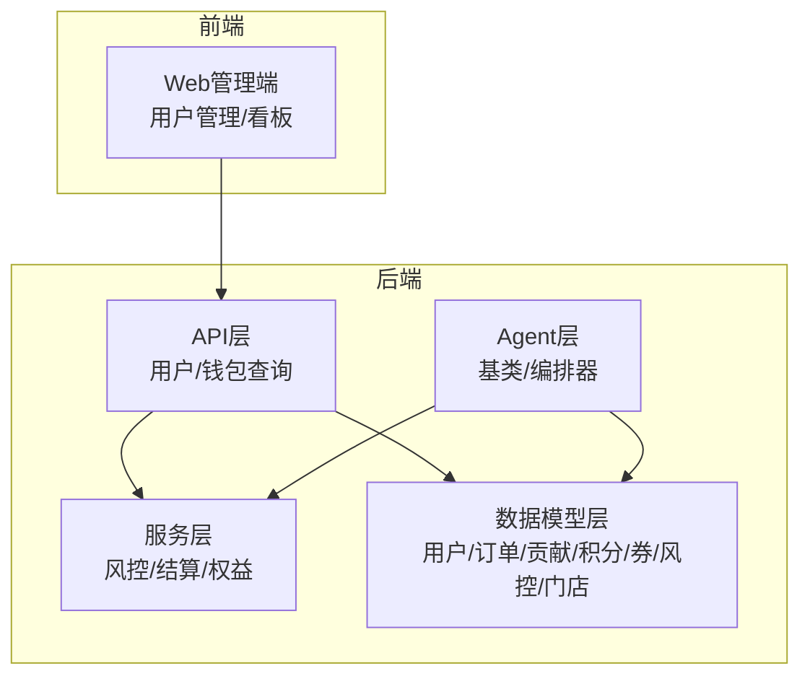
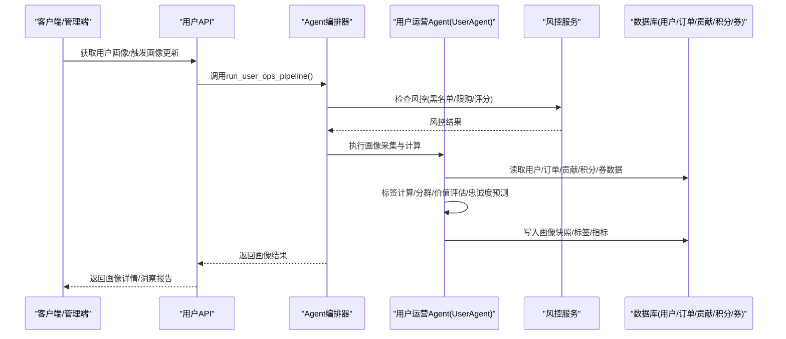
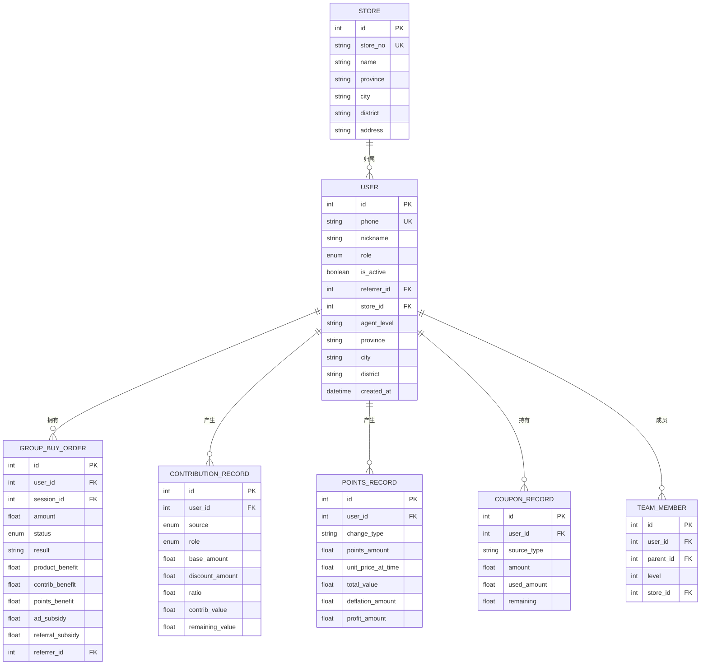
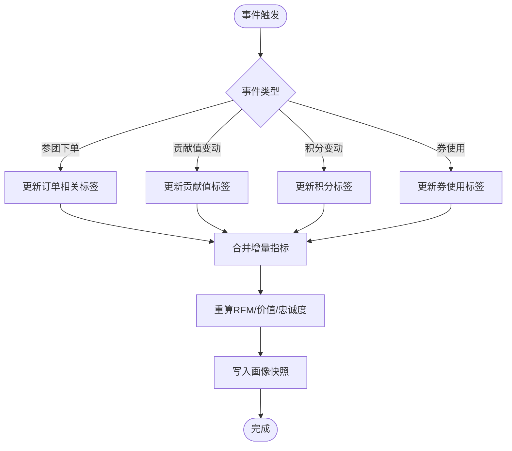
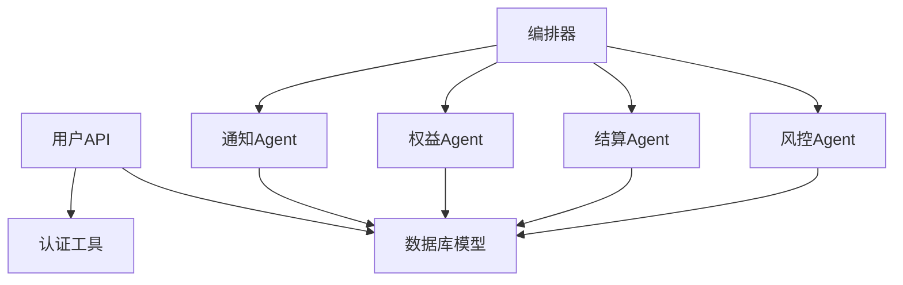

# 用户画像Agent

<cite>
**本文引用的文件**   
- [backend/app/models/user.py](file://backend/app/models/user.py)
- [backend/app/api/v1/user.py](file://backend/app/api/v1/user.py)
- [backend/app/agents/base_agent.py](file://backend/app/agents/base_agent.py)
- [backend/app/agents/agent_orchestrator.py](file://backend/app/agents/agent_orchestrator.py)
- [backend/app/services/risk_service.py](file://backend/app/services/risk_service.py)
- [backend/app/models/group_buy.py](file://backend/app/models/group_buy.py)
- [backend/app/models/contribution.py](file://backend/app/models/contribution.py)
- [backend/app/models/points.py](file://backend/app/models/points.py)
- [backend/app/models/coupon.py](file://backend/app/models/coupon.py)
- [backend/app/models/settlement.py](file://backend/app/models/settlement.py)
- [backend/app/models/store.py](file://backend/app/models/store.py)
- [backend/app/schemas/main.py](file://backend/app/schemas/main.py)
- [frontend/web-admin/src/views/Users.vue](file://frontend/web-admin/src/views/Users.vue)
</cite>

## 目录
1. [引言](#引言)
2. [项目结构](#项目结构)
3. [核心组件](#核心组件)
4. [架构总览](#架构总览)
5. [详细组件分析](#详细组件分析)
6. [依赖关系分析](#依赖关系分析)
7. [性能考虑](#性能考虑)
8. [故障排查指南](#故障排查指南)
9. [结论](#结论)
10. [附录](#附录)

## 引言
本技术文档围绕“用户画像Agent（UserAgent）”进行系统化设计与实现说明，聚焦以下目标：
- 多维度用户行为数据采集与整合：浏览、购买历史、社交关系、地理位置等
- 用户标签体系构建：基础属性、行为特征、偏好、价值分层
- 用户分群与细分算法：RFM模型、聚类分析、生命周期阶段划分
- 用户价值评估与忠诚度预测
- 画像实时更新机制与隐私保护
- 洞察报告生成与可视化展示

当前代码库已具备完善的数据模型与业务服务基础，包括用户、拼团订单、贡献值、积分、消费券、风控日志、门店团队等。基于这些资产，可构建高可用、可扩展的用户画像Agent，并通过编排器统一调度。

## 项目结构
后端采用分层架构：API层暴露接口，服务层封装业务逻辑，数据模型层定义持久化结构；Agent层提供AI智能体能力，由编排器统一调度。前端管理端提供用户管理与运营看板。

图表来源
- [backend/app/api/v1/user.py:1-37](file://backend/app/api/v1/user.py#L1-L37)
- [backend/app/agents/agent_orchestrator.py:1-94](file://backend/app/agents/agent_orchestrator.py#L1-L94)
- [backend/app/models/user.py:1-93](file://backend/app/models/user.py#L1-L93)

章节来源
- [backend/app/api/v1/user.py:1-37](file://backend/app/api/v1/user.py#L1-L37)
- [backend/app/agents/agent_orchestrator.py:1-94](file://backend/app/agents/agent_orchestrator.py#L1-L94)
- [backend/app/models/user.py:1-93](file://backend/app/models/user.py#L1-L93)

## 核心组件
- 用户与资产模型：用户表包含角色、推荐关系、钱包四大资产（余额、贡献值、积分、消费券），并关联订单、贡献记录、积分记录、券记录等。
- 拼团订单与场次：记录参团金额、结果、权益与补贴明细，支撑消费行为与收益分配。
- 贡献值与积分系统：贡献值按场景与角色分配，积分池总量恒定且动态单价递增，支持兑换消费券。
- 消费券与使用记录：多来源发放，支持抵扣消费。
- 风控服务与日志：黑名单、限购规则、异常频率、风险评分更新与日志分页查询。
- Agent基类与编排器：统一执行流程、状态机、错误处理；编排器串联风控、结算、权益、通知等Agent。

章节来源
- [backend/app/models/user.py:1-93](file://backend/app/models/user.py#L1-L93)
- [backend/app/models/group_buy.py:1-158](file://backend/app/models/group_buy.py#L1-L158)
- [backend/app/models/contribution.py:1-115](file://backend/app/models/contribution.py#L1-L115)
- [backend/app/models/points.py:1-76](file://backend/app/models/points.py#L1-L76)
- [backend/app/models/coupon.py:1-55](file://backend/app/models/coupon.py#L1-L55)
- [backend/app/services/risk_service.py:1-135](file://backend/app/services/risk_service.py#L1-L135)
- [backend/app/agents/base_agent.py:1-47](file://backend/app/agents/base_agent.py#L1-L47)
- [backend/app/agents/agent_orchestrator.py:1-94](file://backend/app/agents/agent_orchestrator.py#L1-L94)

## 架构总览
用户画像Agent作为独立智能体，通过编排器接入现有业务流水线，负责采集、清洗、建模、更新画像与输出洞察。

图表来源
- [backend/app/agents/agent_orchestrator.py:32-52](file://backend/app/agents/agent_orchestrator.py#L32-L52)
- [backend/app/services/risk_service.py:17-74](file://backend/app/services/risk_service.py#L17-L74)
- [backend/app/api/v1/user.py:14-36](file://backend/app/api/v1/user.py#L14-L36)

## 详细组件分析

### 用户画像数据源与字段设计
- 基础属性：手机号、昵称、角色、代理级别、省市区、注册时间、是否活跃、推荐人ID、所属门店ID
- 行为特征：拼团订单（金额、状态、结果、权益/补贴）、贡献值来源与分配、积分变动与兑换、消费券来源与使用
- 社交关系：推荐人关系、团队成员层级、门店归属
- 地理位置：省市区、门店地址
- 资产维度：余额、贡献值、积分、消费券余额

图表来源
- [backend/app/models/user.py:26-71](file://backend/app/models/user.py#L26-L71)
- [backend/app/models/group_buy.py:89-131](file://backend/app/models/group_buy.py#L89-L131)
- [backend/app/models/contribution.py:32-69](file://backend/app/models/contribution.py#L32-L69)
- [backend/app/models/points.py:29-59](file://backend/app/models/points.py#L29-L59)
- [backend/app/models/coupon.py:14-42](file://backend/app/models/coupon.py#L14-L42)
- [backend/app/models/store.py:22-63](file://backend/app/models/store.py#L22-L63)
- [backend/app/models/store.py:66-80](file://backend/app/models/store.py#L66-L80)

章节来源
- [backend/app/models/user.py:26-71](file://backend/app/models/user.py#L26-L71)
- [backend/app/models/group_buy.py:89-131](file://backend/app/models/group_buy.py#L89-L131)
- [backend/app/models/contribution.py:32-69](file://backend/app/models/contribution.py#L32-L69)
- [backend/app/models/points.py:29-59](file://backend/app/models/points.py#L29-L59)
- [backend/app/models/coupon.py:14-42](file://backend/app/models/coupon.py#L14-L42)
- [backend/app/models/store.py:22-63](file://backend/app/models/store.py#L22-L63)
- [backend/app/models/store.py:66-80](file://backend/app/models/store.py#L66-L80)

### 用户标签体系构建
- 基础属性标签：角色、代理级别、省市区、是否活跃、注册时间段
- 行为特征标签：近N日/周/月参团次数、成功/失败率、平均客单、贡献值增量、积分兑换频次、消费券使用率
- 偏好标签：拼团级别偏好（初级/高级/SVIP）、品类偏好（商品分类）、时段偏好（开团时间分布）
- 价值分层标签：基于RFM的R（最近一次参团/消费间隔）、F（参团/消费频次）、M（累计金额/贡献值/积分价值）

标签计算建议：
- 窗口聚合：以天/周/月为窗口统计行为指标
- 阈值分段：对连续变量进行分箱（如低/中/高）
- 权重融合：不同标签加权得到综合得分

章节来源
- [backend/app/models/group_buy.py:15-40](file://backend/app/models/group_buy.py#L15-L40)
- [backend/app/models/contribution.py:15-30](file://backend/app/models/contribution.py#L15-L30)
- [backend/app/models/points.py:14-26](file://backend/app/models/points.py#L14-L26)
- [backend/app/models/coupon.py:14-28](file://backend/app/models/coupon.py#L14-L28)

### 用户分群与细分算法
- RFM模型：
  - R：最近一次参团/消费距今天数
  - F：指定周期内参团/消费次数
  - M：指定周期内累计金额或贡献值/积分价值
  - 将R/F/M分别分箱后组合形成用户分层（如高价值、潜力、流失预警）
- 聚类分析：
  - 特征向量：行为频次、金额均值、贡献值增速、积分兑换率、券使用率、社交层级深度
  - 算法选择：KMeans或DBSCAN，结合肘部法则或轮廓系数确定簇数
  - 输出：簇中心与用户归属，用于个性化策略
- 生命周期阶段划分：
  - 新客（注册≤7天且首次参团）
  - 成长期（近30天活跃度上升）
  - 成熟期（稳定参与且高价值）
  - 衰退期（活跃度下降或长时间未参与）
  - 流失期（超过阈值未参与）

章节来源
- [backend/app/models/group_buy.py:89-131](file://backend/app/models/group_buy.py#L89-L131)
- [backend/app/models/contribution.py:32-69](file://backend/app/models/contribution.py#L32-L69)
- [backend/app/models/points.py:29-59](file://backend/app/models/points.py#L29-L59)
- [backend/app/models/coupon.py:14-42](file://backend/app/models/coupon.py#L14-L42)

### 用户价值评估与忠诚度预测
- 价值评估：
  - 直接价值：累计参团金额、贡献值、积分价值、消费券使用额
  - 间接价值：推荐人数、团队层级贡献、门店业绩关联
  - 综合得分：加权融合直接/间接价值，形成用户价值等级
- 忠诚度预测：
  - 特征：历史参与稳定性、复购间隔、券使用粘性、风险评分变化趋势
  - 方法：逻辑回归或XGBoost，输出未来N天留存概率
  - 应用：针对高流失风险用户推送激励策略（优惠券、权益提升）

章节来源
- [backend/app/models/contribution.py:32-69](file://backend/app/models/contribution.py#L32-L69)
- [backend/app/models/points.py:29-59](file://backend/app/models/points.py#L29-L59)
- [backend/app/models/coupon.py:14-42](file://backend/app/models/coupon.py#L14-L42)
- [backend/app/models/store.py:83-103](file://backend/app/models/store.py#L83-L103)

### 用户画像实时更新机制
- 事件驱动：
  - 参团下单/锁定/完成/退款时触发画像增量更新
  - 贡献值/积分/券变动时刷新相关标签
- 批处理：
  - 每日/每周定时任务聚合指标、重算RFM与聚类
- 一致性保障：
  - 事务边界：在订单结算与权益发放完成后更新画像
  - 幂等性：重复事件不导致重复计数

章节来源
- [backend/app/models/group_buy.py:89-131](file://backend/app/models/group_buy.py#L89-L131)
- [backend/app/models/contribution.py:32-69](file://backend/app/models/contribution.py#L32-L69)
- [backend/app/models/points.py:29-59](file://backend/app/models/points.py#L29-L59)
- [backend/app/models/coupon.py:14-42](file://backend/app/models/coupon.py#L14-L42)

### 隐私保护措施
- 最小化采集：仅采集必要字段（手机号、昵称、角色、区域、行为指标）
- 脱敏存储：敏感字段加密或哈希存储（密码哈希已在用户模型体现）
- 访问控制：基于角色的接口鉴权与权限校验
- 审计与合规：风控日志记录操作轨迹，支持追溯与处理

章节来源
- [backend/app/models/user.py:30-36](file://backend/app/models/user.py#L30-L36)
- [backend/app/services/risk_service.py:110-135](file://backend/app/services/risk_service.py#L110-L135)

### 用户洞察报告与可视化
- 报告内容：
  - 用户分层分布、RFM矩阵、价值等级占比
  - 生命周期阶段迁移图、流失预警清单
  - 标签热力图、偏好趋势
- 可视化展示：
  - Web管理端用户列表与详情弹窗，支持搜索与状态切换
  - 看板展示关键指标（场次、交易金额、贡献值、积分池剩余）

章节来源
- [frontend/web-admin/src/views/Users.vue:1-144](file://frontend/web-admin/src/views/Users.vue#L1-L144)

## 依赖关系分析
- 用户API依赖数据库会话与认证工具，返回用户信息与钱包信息
- 风控服务依赖用户风险评分与订单状态，执行限购与异常检测
- Agent编排器协调多个Agent，贯穿风控、结算、权益、通知流程
- 数据模型间通过外键与索引建立强关联，确保查询效率

图表来源
- [backend/app/api/v1/user.py:1-37](file://backend/app/api/v1/user.py#L1-L37)
- [backend/app/agents/agent_orchestrator.py:18-52](file://backend/app/agents/agent_orchestrator.py#L18-L52)
- [backend/app/services/risk_service.py:17-74](file://backend/app/services/risk_service.py#L17-L74)

章节来源
- [backend/app/api/v1/user.py:1-37](file://backend/app/api/v1/user.py#L1-L37)
- [backend/app/agents/agent_orchestrator.py:18-52](file://backend/app/agents/agent_orchestrator.py#L18-L52)
- [backend/app/services/risk_service.py:17-74](file://backend/app/services/risk_service.py#L17-L74)

## 性能考虑
- 索引优化：用户角色、推荐人、门店、风控日志、订单状态等已有索引，建议为画像查询新增复合索引（user_id+时间窗口）
- 异步处理：画像计算与批处理任务通过Celery队列执行，避免阻塞主流程
- 缓存策略：热点用户画像与标签缓存至Redis，降低数据库压力
- 分片与归档：历史行为数据按月归档，减少在线查询规模

[本节为通用指导，无需特定文件引用]

## 故障排查指南
- 风控拦截问题：
  - 检查黑名单与限购规则命中情况
  - 查看风险评分与警告日志
- 画像更新不一致：
  - 核对事件触发顺序与事务边界
  - 确认增量更新幂等性与去重逻辑
- 报表数据缺失：
  - 验证定时任务执行状态与日志
  - 检查数据管道链路（采集→清洗→聚合→入库）

章节来源
- [backend/app/services/risk_service.py:17-74](file://backend/app/services/risk_service.py#L17-L74)
- [backend/app/services/risk_service.py:110-135](file://backend/app/services/risk_service.py#L110-L135)

## 结论
基于现有数据模型与Agent编排框架，用户画像Agent可实现从数据采集、标签计算、分群建模到洞察输出的全链路闭环。通过RFM与聚类算法、价值评估与忠诚度预测，结合实时更新与隐私保护，能够为用户提供精准运营与个性化策略支撑。建议在后续迭代中引入更丰富的外部数据源与机器学习平台，进一步提升画像质量与策略效果。

[本节为总结，无需特定文件引用]

## 附录
- API参考：
  - 获取当前用户信息：GET /api/v1/user/me
  - 获取钱包信息：GET /api/v1/user/wallet
- 数据模型参考：
  - 用户与资产：users、user_wallet_logs
  - 拼团订单：group_buy_orders、group_buy_sessions
  - 贡献值：contribution_records、contrib_weekly_settlements
  - 积分：points_pool、points_records、points_convert_records
  - 消费券：coupon_records、coupon_usage_logs
  - 风控：risk_control_logs、user_risk_scores
  - 门店与团队：stores、team_members、store_monthly_performance

章节来源
- [backend/app/api/v1/user.py:14-36](file://backend/app/api/v1/user.py#L14-L36)
- [backend/app/models/user.py:26-93](file://backend/app/models/user.py#L26-L93)
- [backend/app/models/group_buy.py:42-131](file://backend/app/models/group_buy.py#L42-L131)
- [backend/app/models/contribution.py:32-115](file://backend/app/models/contribution.py#L32-L115)
- [backend/app/models/points.py:14-76](file://backend/app/models/points.py#L14-L76)
- [backend/app/models/coupon.py:14-55](file://backend/app/models/coupon.py#L14-L55)
- [backend/app/models/risk_control.py:41-75](file://backend/app/models/risk_control.py#L41-L75)
- [backend/app/models/store.py:22-103](file://backend/app/models/store.py#L22-L103)