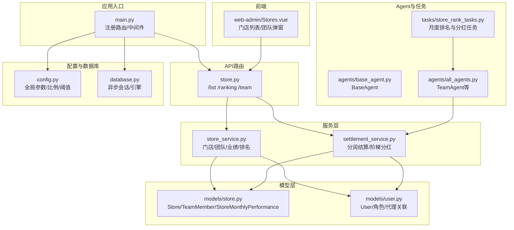
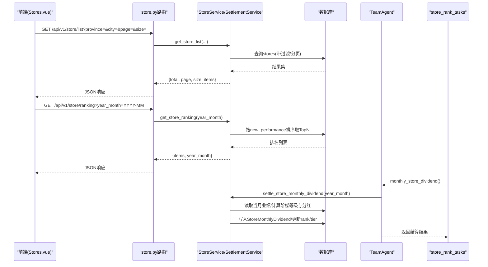
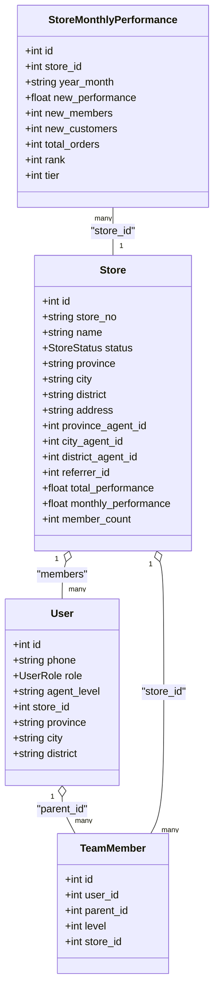
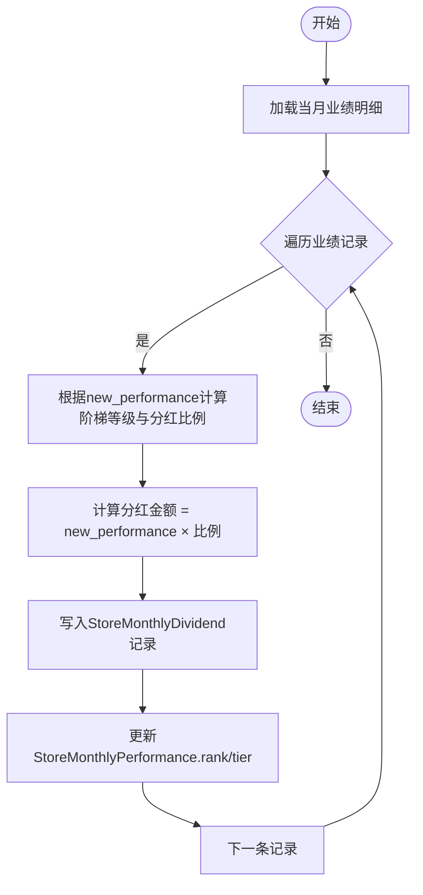
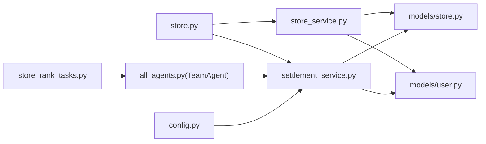

# 门店管理Agent

<cite>
**本文引用的文件**   
- [backend/app/main.py](file://backend/app/main.py)
- [backend/app/config.py](file://backend/app/config.py)
- [backend/app/database.py](file://backend/app/database.py)
- [backend/app/models/store.py](file://backend/app/models/store.py)
- [backend/app/models/user.py](file://backend/app/models/user.py)
- [backend/app/services/store_service.py](file://backend/app/services/store_service.py)
- [backend/app/services/settlement_service.py](file://backend/app/services/settlement_service.py)
- [backend/app/api/v1/store.py](file://backend/app/api/v1/store.py)
- [backend/app/agents/base_agent.py](file://backend/app/agents/base_agent.py)
- [backend/app/agents/all_agents.py](file://backend/app/agents/all_agents.py)
- [backend/app/tasks/store_rank_tasks.py](file://backend/app/tasks/store_rank_tasks.py)
- [frontend/web-admin/src/views/Stores.vue](file://frontend/web-admin/src/views/Stores.vue)
</cite>

## 目录
1. [简介](#简介)
2. [项目结构](#项目结构)
3. [核心组件](#核心组件)
4. [架构总览](#架构总览)
5. [详细组件分析](#详细组件分析)
6. [依赖关系分析](#依赖关系分析)
7. [性能与缓存策略](#性能与缓存策略)
8. [故障排查指南](#故障排查指南)
9. [结论](#结论)
10. [附录：API调用示例与集成指南](#附录api调用示例与集成指南)

## 简介
本技术文档围绕StoreAgent（门店管理Agent）展开，聚焦以下能力：
- 四级代理体系维护与门店层级关系管理
- 区域划分逻辑与门店归属
- 门店业绩统计、团队业绩汇总与排行榜生成
- 门店入驻审核流程的自动化处理建议
- 门店数据分析：经营指标监控、趋势预测、异常预警
- 数据同步机制、缓存策略与性能优化
- API调用示例与集成指南

## 项目结构
后端采用FastAPI分层架构：路由层→服务层→模型层；AI Agent以基类抽象统一执行入口；定时任务通过Celery触发月度排名与分红。前端管理端提供门店列表与团队查看页面。

图表来源
- [backend/app/main.py:1-73](file://backend/app/main.py#L1-L73)
- [backend/app/api/v1/store.py:1-48](file://backend/app/api/v1/store.py#L1-L48)
- [backend/app/services/store_service.py:1-161](file://backend/app/services/store_service.py#L1-L161)
- [backend/app/services/settlement_service.py:1-166](file://backend/app/services/settlement_service.py#L1-L166)
- [backend/app/models/store.py:1-104](file://backend/app/models/store.py#L1-L104)
- [backend/app/models/user.py:1-93](file://backend/app/models/user.py#L1-L93)
- [backend/app/agents/base_agent.py:1-47](file://backend/app/agents/base_agent.py#L1-L47)
- [backend/app/agents/all_agents.py:1-114](file://backend/app/agents/all_agents.py#L1-L114)
- [backend/app/tasks/store_rank_tasks.py:1-29](file://backend/app/tasks/store_rank_tasks.py#L1-L29)
- [backend/app/config.py:1-136](file://backend/app/config.py#L1-L136)
- [frontend/web-admin/src/views/Stores.vue:1-128](file://frontend/web-admin/src/views/Stores.vue#L1-L128)

章节来源
- [backend/app/main.py:1-73](file://backend/app/main.py#L1-L73)
- [backend/app/config.py:1-136](file://backend/app/config.py#L1-L136)

## 核心组件
- BaseAgent：定义Agent统一生命周期（execute/should_continue/run），封装日志与状态上下文。
- TeamAgent：负责“统计四级团队业绩→排名→核算阶梯分红”的月度结算流程。
- StoreService：提供门店创建、月度业绩更新、团队成员查询、门店排名与分页列表等能力。
- SettlementService：实现线下四级分润与门店月度阶梯分红计算，并持久化结算记录。
- 数据模型：Store、TeamMember、StoreMonthlyPerformance、User等，支撑四级代理与门店层级关系。
- 定时任务：每月1日触发TeamAgent执行上月门店排名与分红。

章节来源
- [backend/app/agents/base_agent.py:1-47](file://backend/app/agents/base_agent.py#L1-L47)
- [backend/app/agents/all_agents.py:79-95](file://backend/app/agents/all_agents.py#L79-L95)
- [backend/app/services/store_service.py:1-161](file://backend/app/services/store_service.py#L1-L161)
- [backend/app/services/settlement_service.py:1-166](file://backend/app/services/settlement_service.py#L1-L166)
- [backend/app/models/store.py:1-104](file://backend/app/models/store.py#L1-L104)
- [backend/app/models/user.py:1-93](file://backend/app/models/user.py#L1-L93)
- [backend/app/tasks/store_rank_tasks.py:1-29](file://backend/app/tasks/store_rank_tasks.py#L1-L29)

## 架构总览
门店管理相关的数据流与控制流如下：
- 业务请求：前端调用 /api/v1/store/* 路由，进入StoreService进行读写。
- 结算与分红：SettlementService根据配置的比例与阈值计算分润与阶梯分红，写入结算表与月度业绩表。
- 定时任务：Celery在每月1日凌晨触发TeamAgent，基于上月业绩完成排名与分红结算。
- 模型与索引：StoreMonthlyPerformance按年月唯一索引，配合复合索引提升查询效率。

图表来源
- [backend/app/api/v1/store.py:13-36](file://backend/app/api/v1/store.py#L13-L36)
- [backend/app/services/store_service.py:121-133](file://backend/app/services/store_service.py#L121-L133)
- [backend/app/services/settlement_service.py:87-133](file://backend/app/services/settlement_service.py#L87-L133)
- [backend/app/agents/all_agents.py:83-94](file://backend/app/agents/all_agents.py#L83-L94)
- [backend/app/tasks/store_rank_tasks.py:15-28](file://backend/app/tasks/store_rank_tasks.py#L15-L28)

## 详细组件分析

### 四级代理体系与门店层级关系
- 代理层级：省→市→区县→门店，门店通过外键关联对应级别的代理用户。
- 推荐关系：门店支持referrer_id，用于推荐门店分润。
- 团队关系：TeamMember记录用户间的上下级关系与层级（直推/间推/间间推/间间间推）。
- 区域字段：Store包含province/city/district/address，便于区域筛选与聚合。

图表来源
- [backend/app/models/user.py:26-71](file://backend/app/models/user.py#L26-L71)
- [backend/app/models/store.py:22-63](file://backend/app/models/store.py#L22-L63)
- [backend/app/models/store.py:66-81](file://backend/app/models/store.py#L66-L81)
- [backend/app/models/store.py:83-104](file://backend/app/models/store.py#L83-L104)

章节来源
- [backend/app/models/store.py:22-63](file://backend/app/models/store.py#L22-L63)
- [backend/app/models/store.py:66-81](file://backend/app/models/store.py#L66-L81)
- [backend/app/models/user.py:26-71](file://backend/app/models/user.py#L26-L71)

### 门店业绩统计与排名算法
- 月度业绩累计：StoreService.update_monthly_performance对指定年月的新增业绩、会员数、客户数、订单数进行增量累加，并同步更新Store.total_performance与monthly_performance。
- 排行榜生成：StoreService.get_store_ranking按new_performance降序返回TopN；SettlementService.settle_store_monthly_dividend进一步为每条业绩记录计算阶梯等级与分红金额，并写入StoreMonthlyDividend，同时回填rank与tier。

图表来源
- [backend/app/services/store_service.py:55-99](file://backend/app/services/store_service.py#L55-L99)
- [backend/app/services/settlement_service.py:87-133](file://backend/app/services/settlement_service.py#L87-L133)
- [backend/app/config.py:112-123](file://backend/app/config.py#L112-L123)

章节来源
- [backend/app/services/store_service.py:55-99](file://backend/app/services/store_service.py#L55-L99)
- [backend/app/services/settlement_service.py:87-133](file://backend/app/services/settlement_service.py#L87-L133)
- [backend/app/config.py:112-123](file://backend/app/config.py#L112-L123)

### 门店入驻审核流程（自动化建议）
当前Store.status默认PENDING，结合现有模型与服务可设计如下自动化流程：
- 提交入驻：调用StoreService.create_store创建门店，状态为PENDING。
- 自动校验：基于配置规则（如必填字段、区域合法性、代理绑定完整性）进行校验。
- 审批动作：管理员或系统规则通过后，将status更新为ACTIVE；否则保持PENDING或置为SUSPENDED/CLOSED。
- 通知与审计：记录操作日志与变更流水，便于追溯。

说明：该流程为基于现有模型的扩展建议，具体实现可在StoreService中新增方法或在Admin路由中补充。

章节来源
- [backend/app/models/store.py:14-20](file://backend/app/models/store.py#L14-L20)
- [backend/app/services/store_service.py:18-52](file://backend/app/services/store_service.py#L18-L52)

### 门店数据分析（指标、趋势、预警）
- 经营指标：StoreMonthlyPerformance提供new_performance/new_members/new_customers/total_orders等关键指标。
- 趋势预测：可基于历史月度序列（year_month维度）构建时间序列模型进行预测（建议在外部分析服务或BI工具中实现）。
- 异常预警：当某门店指标突增/突降超过阈值时触发告警（例如环比变化率、同比变化率），可通过定时任务扫描StoreMonthlyPerformance并结合阈值配置实现。

说明：上述为通用数据分析方案建议，代码层面需新增相应任务或服务模块。

[本节为概念性内容，不直接分析具体文件]

### 门店数据同步机制
- 实时同步：订单/交易完成后，调用StoreService.update_monthly_performance增量更新当月业绩与门店累计指标。
- 批量同步：月度结算任务（Celery）在月初汇总上月数据，生成排名与分红记录，确保一致性。
- 幂等保障：StoreMonthlyPerformance以(store_id, year_month)唯一约束，避免重复累加。

章节来源
- [backend/app/services/store_service.py:55-99](file://backend/app/services/store_service.py#L55-L99)
- [backend/app/models/store.py:101-103](file://backend/app/models/store.py#L101-L103)
- [backend/app/tasks/store_rank_tasks.py:15-28](file://backend/app/tasks/store_rank_tasks.py#L15-L28)

### 缓存策略与性能优化
- 数据库索引：
  - stores表：idx_store_status、idx_store_area加速状态与区域筛选。
  - team_members表：idx_team_parent加速团队层级查询。
  - store_monthly_performance表：idx_store_perf_month保证按月查询与唯一性。
- 查询优化：
  - 列表接口使用分页与条件过滤，减少数据传输量。
  - 排名接口按new_performance排序并限制limit，降低排序成本。
- 缓存建议：
  - 热门城市/省份门店列表可引入Redis缓存，设置合理过期时间。
  - 月度排名结果可按year_month缓存，减少月初高峰期的数据库压力。
- 连接池：
  - 通过DATABASE_POOL_SIZE与DATABASE_MAX_OVERFLOW控制并发与资源占用。

章节来源
- [backend/app/models/store.py:60-63](file://backend/app/models/store.py#L60-L63)
- [backend/app/models/store.py:78-80](file://backend/app/models/store.py#L78-L80)
- [backend/app/models/store.py:101-103](file://backend/app/models/store.py#L101-L103)
- [backend/app/config.py:16-19](file://backend/app/config.py#L16-L19)
- [backend/app/api/v1/store.py:13-23](file://backend/app/api/v1/store.py#L13-L23)
- [backend/app/api/v1/store.py:26-36](file://backend/app/api/v1/store.py#L26-L36)

## 依赖关系分析
- 路由依赖服务：store.py依赖StoreService与认证工具。
- 服务依赖模型：StoreService/SettlementService依赖Store、TeamMember、StoreMonthlyPerformance、User等模型。
- Agent与任务：TeamAgent调用SettlementService完成月度分红；store_rank_tasks作为调度入口。
- 配置驱动：所有比例与阈值来自config.py，便于集中管理与灰度调整。

图表来源
- [backend/app/api/v1/store.py:1-48](file://backend/app/api/v1/store.py#L1-L48)
- [backend/app/services/store_service.py:1-161](file://backend/app/services/store_service.py#L1-L161)
- [backend/app/services/settlement_service.py:1-166](file://backend/app/services/settlement_service.py#L1-L166)
- [backend/app/models/store.py:1-104](file://backend/app/models/store.py#L1-L104)
- [backend/app/models/user.py:1-93](file://backend/app/models/user.py#L1-L93)
- [backend/app/agents/all_agents.py:79-95](file://backend/app/agents/all_agents.py#L79-L95)
- [backend/app/tasks/store_rank_tasks.py:1-29](file://backend/app/tasks/store_rank_tasks.py#L1-L29)
- [backend/app/config.py:1-136](file://backend/app/config.py#L1-L136)

章节来源
- [backend/app/api/v1/store.py:1-48](file://backend/app/api/v1/store.py#L1-L48)
- [backend/app/services/store_service.py:1-161](file://backend/app/services/store_service.py#L1-L161)
- [backend/app/services/settlement_service.py:1-166](file://backend/app/services/settlement_service.py#L1-L166)
- [backend/app/models/store.py:1-104](file://backend/app/models/store.py#L1-L104)
- [backend/app/models/user.py:1-93](file://backend/app/models/user.py#L1-L93)
- [backend/app/agents/all_agents.py:79-95](file://backend/app/agents/all_agents.py#L79-L95)
- [backend/app/tasks/store_rank_tasks.py:1-29](file://backend/app/tasks/store_rank_tasks.py#L1-L29)
- [backend/app/config.py:1-136](file://backend/app/config.py#L1-L136)

## 性能与缓存策略
- 索引与查询：充分利用复合索引与唯一索引，避免全表扫描；分页与限幅控制返回规模。
- 批处理与事务：月度结算任务内聚式写入，减少频繁提交开销。
- 缓存与热点：对高频读接口（门店列表、排名）引入Redis缓存，注意失效策略与一致性。
- 连接池与并发：合理配置数据库连接池大小，避免连接耗尽。

[本节为通用指导，不直接分析具体文件]

## 故障排查指南
- 门店列表为空或分页异常：检查province/city过滤条件与索引是否命中；确认page/size参数范围。
- 排名数据缺失：确认月度业绩已正确累计；核对year_month格式与唯一索引冲突。
- 分红未生效：检查配置中的阶梯阈值与比例；确认任务是否按时执行；查看StoreMonthlyDividend记录是否存在。
- 团队查询无结果：确认TeamMember.parent_id与level是否正确；检查用户角色与所属门店关联。

章节来源
- [backend/app/api/v1/store.py:13-23](file://backend/app/api/v1/store.py#L13-L23)
- [backend/app/api/v1/store.py:26-36](file://backend/app/api/v1/store.py#L26-L36)
- [backend/app/services/store_service.py:121-133](file://backend/app/services/store_service.py#L121-L133)
- [backend/app/services/settlement_service.py:87-133](file://backend/app/services/settlement_service.py#L87-L133)
- [backend/app/models/store.py:101-103](file://backend/app/models/store.py#L101-L103)

## 结论
StoreAgent依托统一的Agent基类与清晰的分层架构，实现了门店网络管理、业绩统计、排名与分红结算的核心能力。通过合理的索引设计与定时任务，系统在准确性与性能之间取得平衡。后续可在数据分析、缓存与异常预警方面进一步增强，以提升运营洞察与稳定性。

[本节为总结性内容，不直接分析具体文件]

## 附录：API调用示例与集成指南

### 获取门店列表
- 路径：GET /api/v1/store/list
- 查询参数：
  - province: 可选，省份筛选
  - city: 可选，城市筛选
  - page: 页码，默认1
  - size: 每页数量，默认20，最大100
- 返回：{ total, page, size, items }

章节来源
- [backend/app/api/v1/store.py:13-23](file://backend/app/api/v1/store.py#L13-L23)

### 获取门店排名
- 路径：GET /api/v1/store/ranking
- 查询参数：
  - year_month: 可选，格式YYYY-MM，默认当前月
- 返回：{ items, year_month }

章节来源
- [backend/app/api/v1/store.py:26-36](file://backend/app/api/v1/store.py#L26-L36)

### 获取我的团队成员
- 路径：GET /api/v1/store/team
- 查询参数：
  - level: 1-4，层级深度
  - user_id: 由认证中间件注入
- 返回：{ items, level }

章节来源
- [backend/app/api/v1/store.py:39-47](file://backend/app/api/v1/store.py#L39-L47)

### 前端集成要点
- Stores.vue通过getStores/getStoreTeam调用后端接口，展示门店列表与团队弹窗。
- 建议增加错误提示与加载态，提升用户体验。

章节来源
- [frontend/web-admin/src/views/Stores.vue:91-108](file://frontend/web-admin/src/views/Stores.vue#L91-L108)