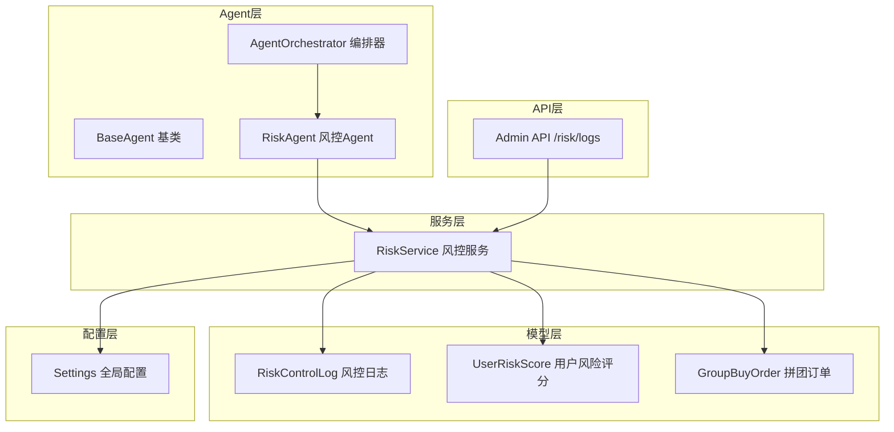
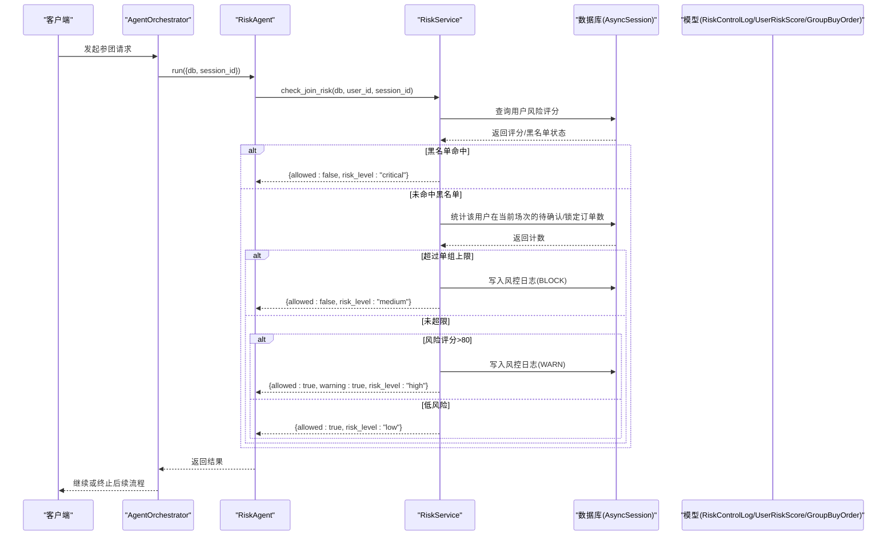
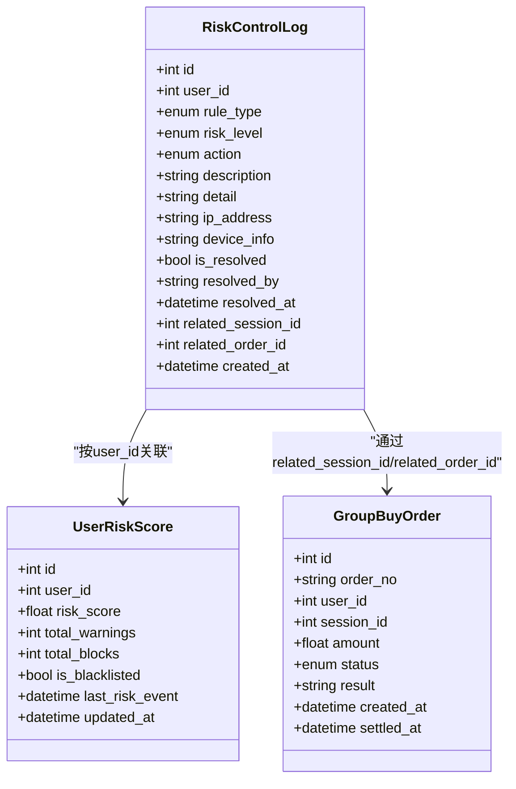
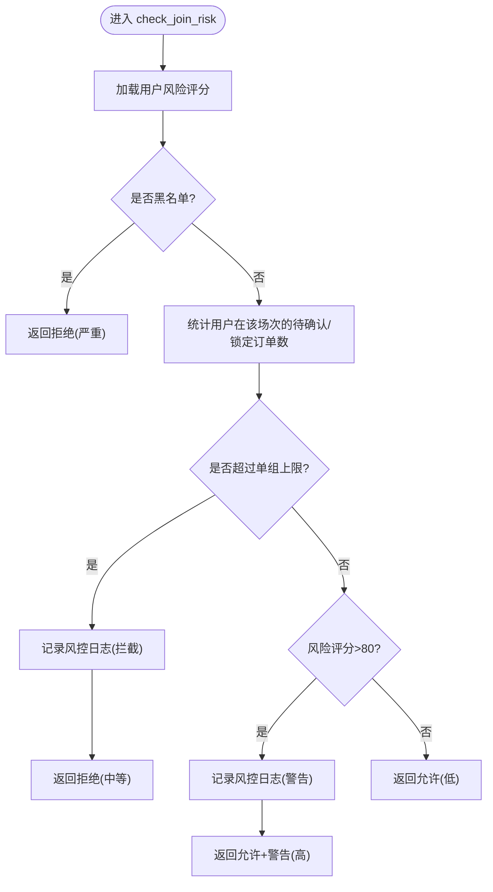
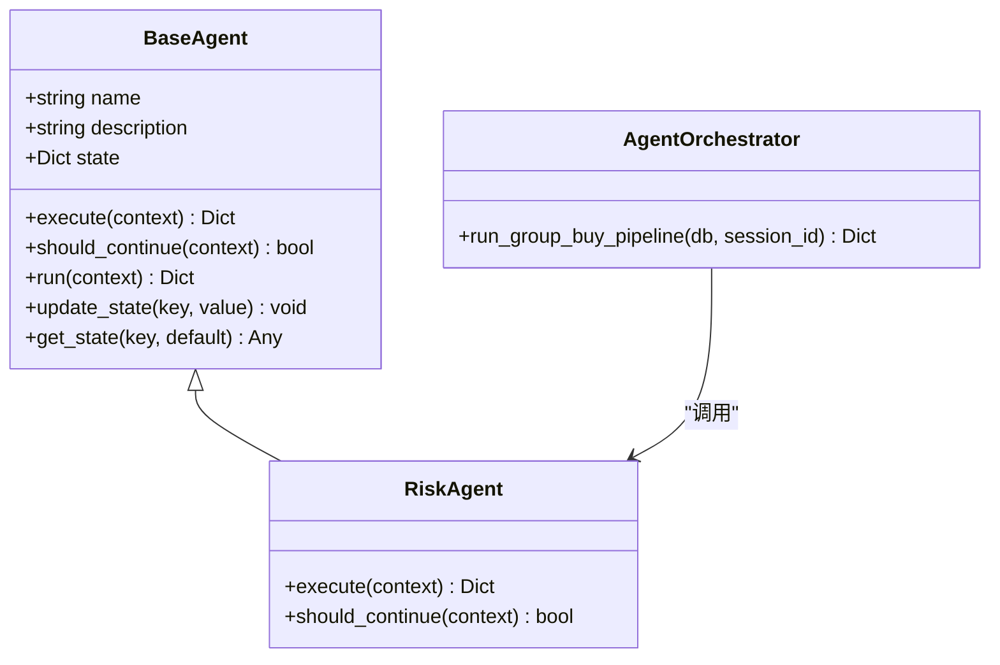
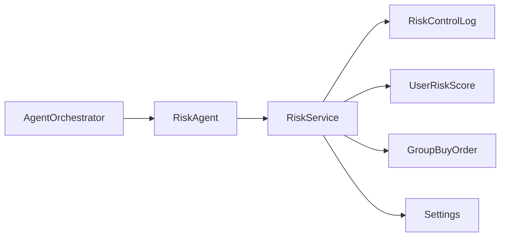

# 风控检测Agent

<cite>
**本文引用的文件**   
- [backend/app/agents/base_agent.py](file://backend/app/agents/base_agent.py)
- [backend/app/agents/all_agents.py](file://backend/app/agents/all_agents.py)
- [backend/app/agents/agent_orchestrator.py](file://backend/app/agents/agent_orchestrator.py)
- [backend/app/services/risk_service.py](file://backend/app/services/risk_service.py)
- [backend/app/models/risk_control.py](file://backend/app/models/risk_control.py)
- [backend/app/models/group_buy.py](file://backend/app/models/group_buy.py)
- [backend/app/config.py](file://backend/app/config.py)
- [backend/app/api/v1/admin.py](file://backend/app/api/v1/admin.py)
</cite>

## 目录
1. [简介](#简介)
2. [项目结构](#项目结构)
3. [核心组件](#核心组件)
4. [架构总览](#架构总览)
5. [详细组件分析](#详细组件分析)
6. [依赖关系分析](#依赖关系分析)
7. [性能与扩展性](#性能与扩展性)
8. [故障排查指南](#故障排查指南)
9. [结论](#结论)
10. [附录：规则配置与示例](#附录：规则配置与示例)

## 简介
本技术文档围绕“风控检测Agent（RiskControlAgent）”展开，聚焦风控规则引擎在拼团业务中的落地实现。当前仓库已提供基础的风控能力：黑名单检查、单组参与上限校验、用户风险评分与告警记录；同时预留了多种规则类型枚举，为后续扩展异常交易检测、刷单行为识别、限购规则验证、金额/频率异常等策略奠定基础。文档将结合源码对数据模型、服务层、Agent编排与API进行系统化说明，并提供可扩展的设计建议与最佳实践。

## 项目结构
风控相关代码主要分布在以下模块：
- Agent层：定义风控Agent及其基类，负责接入统一编排器并执行风控逻辑
- 服务层：封装风控策略、评分更新、日志查询等核心方法
- 模型层：定义风控日志、用户风险评分、以及拼团订单等关联实体
- 配置层：集中管理风控阈值与业务参数
- API层：暴露风控日志查询接口，便于后台运营查看

图表来源
- [backend/app/agents/base_agent.py:1-47](file://backend/app/agents/base_agent.py#L1-L47)
- [backend/app/agents/all_agents.py:97-113](file://backend/app/agents/all_agents.py#L97-L113)
- [backend/app/agents/agent_orchestrator.py:18-43](file://backend/app/agents/agent_orchestrator.py#L18-L43)
- [backend/app/services/risk_service.py:14-134](file://backend/app/services/risk_service.py#L14-L134)
- [backend/app/models/risk_control.py:40-84](file://backend/app/models/risk_control.py#L40-L84)
- [backend/app/models/group_buy.py:89-131](file://backend/app/models/group_buy.py#L89-L131)
- [backend/app/config.py:42-58](file://backend/app/config.py#L42-L58)
- [backend/app/api/v1/admin.py:71-79](file://backend/app/api/v1/admin.py#L71-L79)

章节来源
- [backend/app/agents/base_agent.py:1-47](file://backend/app/agents/base_agent.py#L1-L47)
- [backend/app/agents/all_agents.py:97-113](file://backend/app/agents/all_agents.py#L97-L113)
- [backend/app/agents/agent_orchestrator.py:18-43](file://backend/app/agents/agent_orchestrator.py#L18-L43)
- [backend/app/services/risk_service.py:14-134](file://backend/app/services/risk_service.py#L14-L134)
- [backend/app/models/risk_control.py:40-84](file://backend/app/models/risk_control.py#L40-L84)
- [backend/app/models/group_buy.py:89-131](file://backend/app/models/group_buy.py#L89-L131)
- [backend/app/config.py:42-58](file://backend/app/config.py#L42-L58)
- [backend/app/api/v1/admin.py:71-79](file://backend/app/api/v1/admin.py#L71-L79)

## 核心组件
- 风控Agent（RiskAgent）
  - 职责：作为统一Agent流水线的一环，接收上下文（数据库会话、用户ID、场次ID），调用风控服务执行检查，返回决策结果。
  - 关键路径：execute(context) → RiskService.check_join_risk(...)
- 风控服务（RiskService）
  - 职责：实现具体风控策略（黑名单、单组参与上限、高风险评分警告）、更新用户风险评分、分页查询风控日志。
  - 关键方法：check_join_risk、update_risk_score、get_risk_logs
- 风控数据模型
  - 风控日志（RiskControlLog）：记录触发规则、风险等级、动作、详情、处理状态、关联会话/订单等
  - 用户风险评分（UserRiskScore）：维护用户风险分、累计警告/拦截次数、是否黑名单、最近事件时间
- 配置（Settings）
  - 关键参数：GROUP_BUY_MAX_ORDERS_PER_USER（单ID单组最多5单）
- API（Admin API）
  - 获取风控日志：GET /api/v1/risk/logs

章节来源
- [backend/app/agents/all_agents.py:97-113](file://backend/app/agents/all_agents.py#L97-L113)
- [backend/app/services/risk_service.py:14-134](file://backend/app/services/risk_service.py#L14-L134)
- [backend/app/models/risk_control.py:40-84](file://backend/app/models/risk_control.py#L40-L84)
- [backend/app/config.py:52-58](file://backend/app/config.py#L52-L58)
- [backend/app/api/v1/admin.py:71-79](file://backend/app/api/v1/admin.py#L71-L79)

## 架构总览
风控检测在拼团流水线的早期阶段执行，确保违规或高风险请求在进入结算与权益发放前被拦截或标记。

图表来源
- [backend/app/agents/agent_orchestrator.py:32-43](file://backend/app/agents/agent_orchestrator.py#L32-L43)
- [backend/app/agents/all_agents.py:105-110](file://backend/app/agents/all_agents.py#L105-L110)
- [backend/app/services/risk_service.py:18-74](file://backend/app/services/risk_service.py#L18-L74)
- [backend/app/models/risk_control.py:40-70](file://backend/app/models/risk_control.py#L40-L70)
- [backend/app/models/group_buy.py:89-131](file://backend/app/models/group_buy.py#L89-L131)

## 详细组件分析

### 风控数据模型与枚举
- 风险等级（RiskLevel）：低、中、高、严重
- 风控动作（RiskAction）：放行、警告、拦截、冻结
- 规则类型（RiskRuleType）：单日/单场/单组上限、异常操作、违规开团、金额异常、频率异常
- 风控日志（RiskControlLog）：包含用户、规则类型、风险等级、动作、描述、详情JSON、IP/设备信息、处理状态、关联会话/订单、创建时间，并建立索引以支持高效查询
- 用户风险评分（UserRiskScore）：用户唯一、风险评分、累计警告/拦截次数、是否黑名单、最近事件时间、更新时间

图表来源
- [backend/app/models/risk_control.py:40-84](file://backend/app/models/risk_control.py#L40-L84)
- [backend/app/models/group_buy.py:89-131](file://backend/app/models/group_buy.py#L89-L131)

章节来源
- [backend/app/models/risk_control.py:13-37](file://backend/app/models/risk_control.py#L13-L37)
- [backend/app/models/risk_control.py:40-84](file://backend/app/models/risk_control.py#L40-L84)
- [backend/app/models/group_buy.py:89-131](file://backend/app/models/group_buy.py#L89-L131)

### 风控服务（RiskService）
- 检查参团风控（check_join_risk）
  - 黑名单优先：若用户已拉黑，直接拒绝
  - 单组参与上限：统计用户在该场次下处于待确认/锁定的订单数量，超过配置上限则拦截并记录日志
  - 高风险评分：若评分高于阈值，放行但记录警告，供后续人工审核
- 更新风险评分（update_risk_score）
  - 根据事件类型加权加分，累计警告次数，更新最近事件时间
  - 达到阈值自动加入黑名单
- 获取风控日志（get_risk_logs）
  - 支持按用户、风险等级过滤，分页返回

图表来源
- [backend/app/services/risk_service.py:18-74](file://backend/app/services/risk_service.py#L18-L74)
- [backend/app/config.py:52-58](file://backend/app/config.py#L52-L58)

章节来源
- [backend/app/services/risk_service.py:14-134](file://backend/app/services/risk_service.py#L14-L134)

### 风控Agent与编排器
- 基类（BaseAgent）
  - 提供统一的run流程、状态管理与日志记录
- 风控Agent（RiskAgent）
  - 从上下文中提取db、user_id、session_id，调用RiskService进行检查
  - should_continue固定返回False，表示风控为独立分支
- 编排器（AgentOrchestrator）
  - 在拼团流水线中先执行风控，再执行结算等后续步骤

图表来源
- [backend/app/agents/base_agent.py:12-47](file://backend/app/agents/base_agent.py#L12-L47)
- [backend/app/agents/all_agents.py:101-113](file://backend/app/agents/all_agents.py#L101-L113)
- [backend/app/agents/agent_orchestrator.py:18-43](file://backend/app/agents/agent_orchestrator.py#L18-L43)

章节来源
- [backend/app/agents/base_agent.py:12-47](file://backend/app/agents/base_agent.py#L12-L47)
- [backend/app/agents/all_agents.py:101-113](file://backend/app/agents/all_agents.py#L101-L113)
- [backend/app/agents/agent_orchestrator.py:18-43](file://backend/app/agents/agent_orchestrator.py#L18-L43)

### API集成（风控日志查询）
- 接口：GET /api/v1/risk/logs
- 功能：分页获取风控日志，便于运营人员审查与导出

章节来源
- [backend/app/api/v1/admin.py:71-79](file://backend/app/api/v1/admin.py#L71-L79)

## 依赖关系分析
- 耦合关系
  - RiskAgent 依赖 RiskService
  - RiskService 依赖模型层（RiskControlLog、UserRiskScore、GroupBuyOrder）与配置（Settings）
  - AgentOrchestrator 聚合多个Agent，包括RiskAgent
- 外部依赖
  - 异步数据库会话（AsyncSession）
  - SQLAlchemy查询构建
- 潜在循环依赖
  - 当前未见循环导入；各层职责清晰

图表来源
- [backend/app/agents/all_agents.py:105-110](file://backend/app/agents/all_agents.py#L105-L110)
- [backend/app/services/risk_service.py:9-11](file://backend/app/services/risk_service.py#L9-L11)
- [backend/app/models/risk_control.py:40-84](file://backend/app/models/risk_control.py#L40-L84)
- [backend/app/models/group_buy.py:89-131](file://backend/app/models/group_buy.py#L89-L131)
- [backend/app/config.py:52-58](file://backend/app/config.py#L52-L58)
- [backend/app/agents/agent_orchestrator.py:22-30](file://backend/app/agents/agent_orchestrator.py#L22-L30)

章节来源
- [backend/app/agents/all_agents.py:105-110](file://backend/app/agents/all_agents.py#L105-L110)
- [backend/app/services/risk_service.py:9-11](file://backend/app/services/risk_service.py#L9-L11)
- [backend/app/models/risk_control.py:40-84](file://backend/app/models/risk_control.py#L40-L84)
- [backend/app/models/group_buy.py:89-131](file://backend/app/models/group_buy.py#L89-L131)
- [backend/app/config.py:52-58](file://backend/app/config.py#L52-L58)
- [backend/app/agents/agent_orchestrator.py:22-30](file://backend/app/agents/agent_orchestrator.py#L22-L30)

## 性能与扩展性
- 性能要点
  - 使用异步数据库会话提升并发处理能力
  - 风控日志表针对用户与时间、风险等级建立索引，利于快速检索
  - 单组参与上限统计基于订单状态过滤，避免全表扫描
- 扩展建议
  - 新增规则类型：在RiskRuleType中扩展枚举项，并在RiskService中增加对应判断分支
  - 引入缓存：对高频读取的用户风险评分与黑名单状态可考虑Redis缓存，降低数据库压力
  - 异步任务：将风控日志落库与告警通知放入Celery任务队列，削峰填谷
  - 指标监控：对风控拦截率、平均响应时延、评分分布等进行埋点与可视化

[本节为通用指导，不直接分析具体文件]

## 故障排查指南
- 常见问题定位
  - 黑名单误判：核查UserRiskScore.is_blacklisted字段与update_risk_score的阈值逻辑
  - 单组上限误拦截：核对GroupBuyOrder.status过滤条件与配置上限值
  - 高风险评分告警过多：评估评分权重与阈值设置，必要时调整score_map
- 日志与审计
  - 通过Admin API分页查询风控日志，结合user_id、risk_level筛选
  - 关注is_resolved、resolved_by、resolved_at字段，跟踪人工处理闭环

章节来源
- [backend/app/services/risk_service.py:76-107](file://backend/app/services/risk_service.py#L76-L107)
- [backend/app/models/risk_control.py:40-70](file://backend/app/models/risk_control.py#L40-L70)
- [backend/app/api/v1/admin.py:71-79](file://backend/app/api/v1/admin.py#L71-L79)

## 结论
当前风控检测Agent已具备黑名单检查、单组参与上限控制与高风险评分告警的核心能力，并通过Agent编排器嵌入到拼团主流程中。数据模型与API为后续扩展提供了良好基础。建议在现有基础上逐步完善时间窗口限制、金额阈值控制、地理位置验证、频率异常检测等高级策略，并结合缓存与异步任务优化性能，形成更完善的风控体系。

[本节为总结性内容，不直接分析具体文件]

## 附录：规则配置与示例

### 规则类型与含义
- 单日参与上限（daily_limit）
- 单场参与上限（session_limit）
- 单ID单组最多N单（order_limit）
- 异常操作检测（abnormal）
- 违规开团检测（illegal_group）
- 金额异常检测（amount_anomaly）
- 频率异常检测（frequency）

章节来源
- [backend/app/models/risk_control.py:29-37](file://backend/app/models/risk_control.py#L29-L37)

### 关键配置项
- GROUP_BUY_MAX_ORDERS_PER_USER：单ID单组最多参与订单数（默认5）

章节来源
- [backend/app/config.py:52-58](file://backend/app/config.py#L52-L58)

### 典型场景与算法思路（概念性说明）
- 异常交易检测
  - 思路：基于订单金额、频次、设备/IP画像等多维特征计算异常得分，超过阈值则拦截或转人工
  - 参考：RiskRuleType.AMOUNT_ANOMALY、FREQUENCY_ANOMALY
- 刷单行为识别
  - 思路：同一用户/设备/IP在短时间内多次下单且无真实消费轨迹，结合账号活跃度判定
  - 参考：RiskRuleType.ABNORMAL_BEHAVIOR
- 限购规则验证
  - 思路：按日/场/组维度统计参与次数，超过上限即拦截
  - 参考：RiskRuleType.DAILY_LIMIT、SESSION_LIMIT、ORDER_LIMIT
- 黑名单检查
  - 思路：用户风险评分达到阈值自动入黑，或在管理端手动添加
  - 参考：UserRiskScore.is_blacklisted

[本节为概念性说明，不直接分析具体文件]

### 自定义风控规则与扩展新策略的步骤（概念性说明）
- 在RiskRuleType中新增规则枚举
- 在RiskService中实现新的检查方法或扩展现有方法
- 在RiskAgent或编排器中接入新规则的执行顺序
- 在RiskControlLog中记录触发详情，便于审计与回溯
- 在Admin API中提供查询与导出能力

[本节为概念性说明，不直接分析具体文件]

### 风控日志、告警与人工审核集成（概念性说明）
- 风控日志：所有触发规则的事件均落库，包含用户、规则类型、风险等级、动作、详情、IP/设备、处理状态
- 告警机制：高风险评分或严重级别事件可触发内部告警（如消息队列/邮件/IM）
- 人工审核：通过Admin API展示待处理列表，支持标记已处理、备注处理人及时间

[本节为概念性说明，不直接分析具体文件]