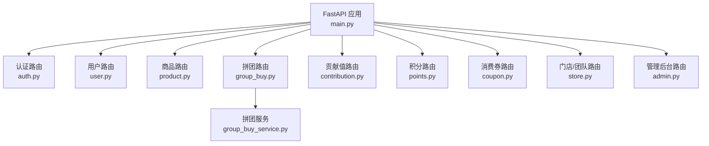
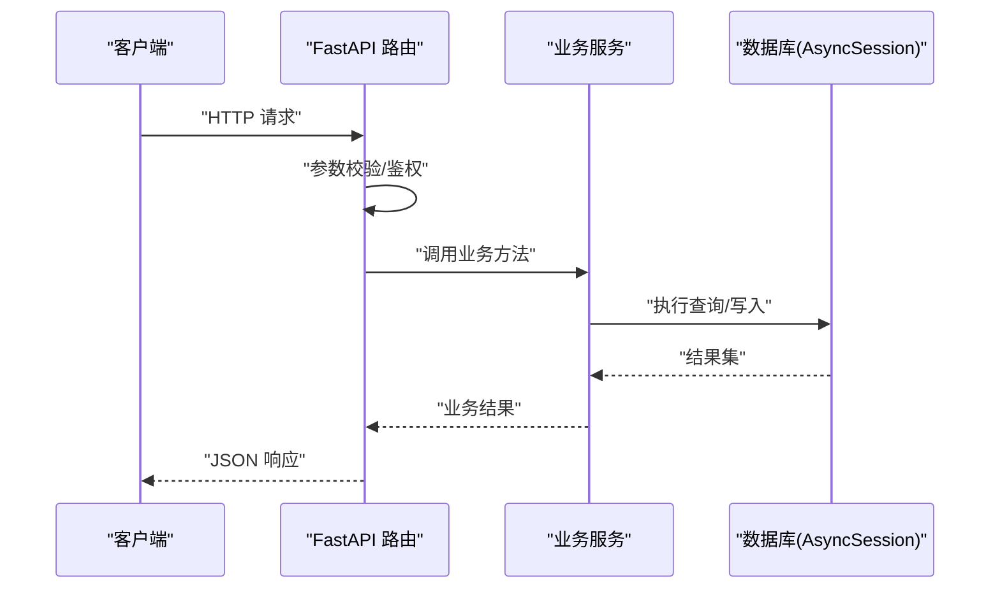
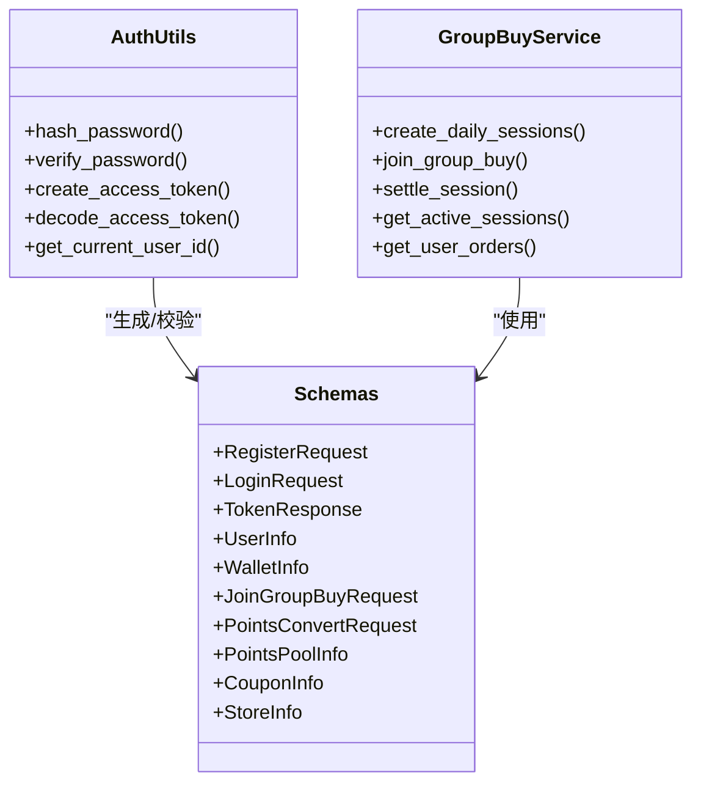

# API接口文档

<cite>
**本文引用的文件**   
- [backend/app/main.py](file://backend/app/main.py)
- [backend/app/config.py](file://backend/app/config.py)
- [backend/app/utils/auth.py](file://backend/app/utils/auth.py)
- [backend/app/schemas/main.py](file://backend/app/schemas/main.py)
- [backend/app/api/v1/auth.py](file://backend/app/api/v1/auth.py)
- [backend/app/api/v1/user.py](file://backend/app/api/v1/user.py)
- [backend/app/api/v1/group_buy.py](file://backend/app/api/v1/group_buy.py)
- [backend/app/api/v1/contribution.py](file://backend/app/api/v1/contribution.py)
- [backend/app/api/v1/store.py](file://backend/app/api/v1/store.py)
- [backend/app/api/v1/product.py](file://backend/app/api/v1/product.py)
- [backend/app/api/v1/points.py](file://backend/app/api/v1/points.py)
- [backend/app/api/v1/coupon.py](file://backend/app/api/v1/coupon.py)
- [backend/app/api/v1/admin.py](file://backend/app/api/v1/admin.py)
- [backend/app/services/group_buy_service.py](file://backend/app/services/group_buy_service.py)
- [backend/app/models/user.py](file://backend/app/models/user.py)
</cite>

## 目录
1. [简介](#简介)
2. [项目结构](#项目结构)
3. [核心组件](#核心组件)
4. [架构总览](#架构总览)
5. [详细接口说明](#详细接口说明)
6. [依赖分析](#依赖分析)
7. [性能与一致性](#性能与一致性)
8. [故障排查指南](#故障排查指南)
9. [结论](#结论)
10. [附录](#附录)

## 简介
本文件为 AIxingmu 项目的 RESTful API 接口文档，覆盖认证、用户管理、拼团、贡献值、门店团队、商品商城、积分、消费券与管理后台等模块。所有接口统一以 /api/v1 为前缀，采用 JSON 请求/响应体，使用 JWT Bearer Token 进行鉴权。

## 项目结构
后端基于 FastAPI，路由按功能模块拆分在 app/api/v1 下，并通过主应用入口集中注册。配置集中在 app/config.py，通用数据模型在 app/schemas/main.py，认证工具在 app/utils/auth.py。

图表来源
- [backend/app/main.py:44-53](file://backend/app/main.py#L44-L53)
- [backend/app/api/v1/group_buy.py:1-65](file://backend/app/api/v1/group_buy.py#L1-L65)
- [backend/app/services/group_buy_service.py:1-200](file://backend/app/services/group_buy_service.py#L1-L200)

章节来源
- [backend/app/main.py:25-53](file://backend/app/main.py#L25-L53)
- [backend/app/config.py:14](file://backend/app/config.py#L14)

## 核心组件
- 认证与鉴权：JWT 签发与校验、密码哈希、Bearer Token 提取。
- 数据模型：Pydantic 请求/响应模型定义，保证参数校验与返回结构一致。
- 业务服务：拼团、贡献值、积分、消费券、门店等核心逻辑封装在服务层。
- 数据库访问：异步 SQLAlchemy Session 注入，统一通过 get_db 获取。

章节来源
- [backend/app/utils/auth.py:1-50](file://backend/app/utils/auth.py#L1-L50)
- [backend/app/schemas/main.py:1-176](file://backend/app/schemas/main.py#L1-L176)
- [backend/app/services/group_buy_service.py:1-200](file://backend/app/services/group_buy_service.py#L1-L200)

## 架构总览
整体采用“路由层 -> 服务层 -> 数据层”的分层架构。路由负责参数校验与异常映射；服务层实现业务规则；数据层通过异步 ORM 访问数据库。

图表来源
- [backend/app/main.py:44-53](file://backend/app/main.py#L44-L53)
- [backend/app/api/v1/group_buy.py:26-38](file://backend/app/api/v1/group_buy.py#L26-L38)
- [backend/app/services/group_buy_service.py:93-181](file://backend/app/services/group_buy_service.py#L93-L181)

## 详细接口说明

### 全局约定
- 基础路径：/api/v1
- 认证方式：请求头携带 Authorization: Bearer <token>
- 成功响应：部分接口直接返回数据对象或列表；部分接口返回统一包装 {code, message, data}
- 错误响应：HTTP 状态码 + detail 字段（如 400/401/404）
- 分页参数：page、size（默认 page=1, size=20），部分接口限制 size 范围

章节来源
- [backend/app/main.py:44-53](file://backend/app/main.py#L44-L53)
- [backend/app/utils/auth.py:39-49](file://backend/app/utils/auth.py#L39-L49)
- [backend/app/schemas/main.py:172-176](file://backend/app/schemas/main.py#L172-L176)

### 认证接口（/api/v1/auth/*）
- POST /api/v1/auth/register
  - 描述：用户注册并返回访问令牌
  - 请求体：RegisterRequest
  - 响应：TokenResponse
  - 错误：手机号已注册时返回 400
- POST /api/v1/auth/login
  - 描述：用户登录并返回访问令牌
  - 请求体：LoginRequest
  - 响应：TokenResponse
  - 错误：手机号或密码错误时返回 401

请求示例
- 注册
  - 请求体：{"phone": "13800001111", "password": "123456", "nickname": "测试用户", "referrer_id": null}
  - 响应：{"access_token": "...", "token_type": "bearer", "user_id": 1}
- 登录
  - 请求体：{"phone": "13800001111", "password": "123456"}
  - 响应：{"access_token": "...", "token_type": "bearer", "user_id": 1}

错误处理
- 400：手机号已注册
- 401：手机号或密码错误

章节来源
- [backend/app/api/v1/auth.py:14-42](file://backend/app/api/v1/auth.py#L14-L42)
- [backend/app/schemas/main.py:10-24](file://backend/app/schemas/main.py#L10-L24)

### 用户管理接口（/api/v1/user/*）
- GET /api/v1/user/me
  - 描述：获取当前用户信息
  - 鉴权：需要
  - 响应：UserInfo
- GET /api/v1/user/wallet
  - 描述：获取当前用户钱包信息（余额、贡献值、积分、消费券余额）
  - 鉴权：需要
  - 响应：WalletInfo

请求示例
- 获取个人信息
  - 响应：{"id": 1, "phone": "13800001111", "nickname": "测试用户", "role": "consumer", "balance": 0.0, "contribution_value": 0.0, "points": 0.0, "coupon_balance": 0.0, "store_id": null, "created_at": "2024-01-01T00:00:00Z"}
- 获取钱包
  - 响应：{"balance": 0.0, "contribution_value": 0.0, "points": 0.0, "coupon_balance": 0.0}

错误处理
- 401：未提供或无效 Token

章节来源
- [backend/app/api/v1/user.py:14-36](file://backend/app/api/v1/user.py#L14-L36)
- [backend/app/schemas/main.py:26-46](file://backend/app/schemas/main.py#L26-L46)

### 拼团接口（/api/v1/group-buy/*）
- GET /api/v1/group-buy/sessions
  - 描述：获取当前可参与的拼团场次，支持按 level 过滤
  - 查询参数：level（可选，枚举值见 GroupBuyLevel）
  - 响应：{"items": [...]}
- POST /api/v1/group-buy/join
  - 描述：参与拼团
  - 请求体：JoinGroupBuyRequest
  - 响应：{"code": 0, "message": "参团成功", "data": {...}}
  - 错误：400（场次不存在/已满员/余额不足/单组超参与次数）
- GET /api/v1/group-buy/orders
  - 描述：获取我的拼团订单（分页）
  - 查询参数：page, size
  - 响应：由服务层返回的订单列表结构
- GET /api/v1/group-buy/sessions/{session_id}
  - 描述：获取拼团场次详情
  - 路径参数：session_id
  - 响应：场次对象
  - 错误：404（场次不存在）

请求示例
- 获取场次
  - 响应：{"items": [{"id": 1, "session_no": "GB2024010110J...", "level": "junior", "total_price": 288.0, "current_players": 10, "status": "active", ...}]}
- 参团
  - 请求体：{"session_id": 1}
  - 响应：{"code": 0, "message": "参团成功", "data": {"order_id": 1, "order_no": "GO20240101...", "amount": 288.0, "remaining_balance": 0.0, "session_full": false}}

错误处理
- 400：参团失败原因（由 ValueError 转换）
- 404：场次不存在

章节来源
- [backend/app/api/v1/group_buy.py:15-64](file://backend/app/api/v1/group_buy.py#L15-L64)
- [backend/app/services/group_buy_service.py:93-181](file://backend/app/services/group_buy_service.py#L93-L181)
- [backend/app/schemas/main.py:73-105](file://backend/app/schemas/main.py#L73-L105)

### 贡献值接口（/api/v1/contribution/*）
- GET /api/v1/contribution/my
  - 描述：获取我的贡献值记录
  - 鉴权：需要
  - 响应：{"items": [...]}
- GET /api/v1/contribution/total
  - 描述：获取全网总贡献值
  - 响应：{"total_network_contribution": 数值}

请求示例
- 我的贡献值
  - 响应：{"items": [{"id": 1, "source": "group_buy", "role": "consumer", "base_amount": 288.0, "contrib_value": 57.6, ...}]}
- 全网总贡献值
  - 响应：{"total_network_contribution": 1234567.89}

章节来源
- [backend/app/api/v1/contribution.py:12-26](file://backend/app/api/v1/contribution.py#L12-L26)
- [backend/app/schemas/main.py:108-121](file://backend/app/schemas/main.py#L108-L121)

### 门店接口（/api/v1/store/*）
- GET /api/v1/store/list
  - 描述：获取门店列表（支持省/市筛选与分页）
  - 查询参数：province, city, page, size
  - 响应：由服务层返回的门店列表结构
- GET /api/v1/store/ranking
  - 描述：获取门店排名（默认当月）
  - 查询参数：year_month（可选，格式 YYYY-MM）
  - 响应：{"items": [...], "year_month": "YYYY-MM"}
- GET /api/v1/store/team
  - 描述：获取我的团队成员（按层级）
  - 查询参数：level（1-4）
  - 鉴权：需要
  - 响应：{"items": [...], "level": 1}

请求示例
- 门店列表
  - 响应：{"items": [{"id": 1, "name": "XX啤酒体验店", "province": "广东", "city": "深圳", "member_count": 120, ...}], "page": 1, "size": 20}
- 门店排名
  - 响应：{"items": [{"store_id": 1, "monthly_performance": 120000.0, ...}], "year_month": "2024-01"}
- 我的团队
  - 响应：{"items": [{"user_id": 2, "nickname": "张三", "role": "consumer"}, ...], "level": 1}

章节来源
- [backend/app/api/v1/store.py:13-47](file://backend/app/api/v1/store.py#L13-L47)
- [backend/app/schemas/main.py:146-169](file://backend/app/schemas/main.py#L146-L169)

### 商品/商城接口（/api/v1/product/*）
- GET /api/v1/product/list
  - 描述：商品列表（仅展示上架商品，支持分类筛选与分页）
  - 查询参数：category, page, size
  - 响应：{"total": 总数, "page": 页码, "size": 每页数量, "items": [...]}
- GET /api/v1/product/{product_id}
  - 描述：商品详情
  - 路径参数：product_id
  - 响应：商品对象或 {"code": 404, "message": "商品不存在"}

请求示例
- 商品列表
  - 响应：{"total": 100, "page": 1, "size": 20, "items": [{"id": 1, "name": "法库啤酒", "selling_price": 288.0, "stock": 1000, "status": "active", ...}]}
- 商品详情
  - 响应：{"id": 1, "name": "法库啤酒", "selling_price": 288.0, "stock": 1000, "status": "active", ...}

章节来源
- [backend/app/api/v1/product.py:15-40](file://backend/app/api/v1/product.py#L15-L40)
- [backend/app/schemas/main.py:48-70](file://backend/app/schemas/main.py#L48-L70)

### 积分接口（/api/v1/points/*）
- GET /api/v1/points/pool
  - 描述：获取积分池状态
  - 响应：PointsPoolInfo
- POST /api/v1/points/convert
  - 描述：积分兑换消费券
  - 请求体：PointsConvertRequest
  - 响应：{"code": 0, "message": "兑换成功", "data": {...}}
  - 错误：400（参数不合法或余额不足）

请求示例
- 积分池状态
  - 响应：{"total_supply": 12000000, "total_issued": 1000000, "current_unit_price": 0.001, "remaining": 11000000}
- 积分兑换
  - 请求体：{"points_amount": 100}
  - 响应：{"code": 0, "message": "兑换成功", "data": {"coupon_amount": 10.0}}

章节来源
- [backend/app/api/v1/points.py:13-30](file://backend/app/api/v1/points.py#L13-L30)
- [backend/app/schemas/main.py:123-133](file://backend/app/schemas/main.py#L123-L133)

### 消费券接口（/api/v1/coupon/*）
- GET /api/v1/coupon/my
  - 描述：获取我的消费券列表
  - 鉴权：需要
  - 响应：{"items": [...]}

请求示例
- 我的消费券
  - 响应：{"items": [{"id": 1, "source_type": "points_convert", "amount": 10.0, "remaining": 10.0, "created_at": "2024-01-01T00:00:00Z"}]}

章节来源
- [backend/app/api/v1/coupon.py:12-19](file://backend/app/api/v1/coupon.py#L12-L19)
- [backend/app/schemas/main.py:135-143](file://backend/app/schemas/main.py#L135-L143)

### 管理后台接口（/api/v1/admin/*）
- POST /api/v1/admin/group-buy/create-sessions
  - 描述：手动创建每日拼团场次（可按日期）
  - 查询参数：date（可选，YYYY-MM-DD）
  - 响应：{"created": 场次数量, "date": "YYYY-MM-DD"}
- POST /api/v1/admin/group-buy/settle/{session_id}
  - 描述：手动结算指定场次
  - 路径参数：session_id
  - 响应：{"code": 0, "message": "结算成功", "data": {...}}
  - 错误：400（场次状态异常）
- POST /api/v1/admin/dividend/weekly
  - 描述：手动触发每周分红
  - 响应：{"code": 0, "message": "分红完成", "data": {...}}
- POST /api/v1/admin/contribution/weekly-settle
  - 描述：手动触发每周贡献值递减结算
  - 响应：{"code": 0, "message": "结算完成", "data": {...}}
- POST /api/v1/admin/store/monthly-dividend
  - 描述：手动触发门店月度阶梯分红（可按年月）
  - 查询参数：year_month（可选，YYYY-MM）
  - 响应：{"code": 0, "message": "分红完成", "data": {...}}
- GET /api/v1/admin/risk/logs
  - 描述：获取风控日志（分页）
  - 查询参数：page, size
  - 响应：由服务层返回的风控日志列表
- GET /api/v1/admin/points/pool
  - 描述：获取积分池状态
  - 响应：PointsPoolInfo

章节来源
- [backend/app/api/v1/admin.py:18-85](file://backend/app/api/v1/admin.py#L18-L85)

## 依赖分析
- 路由依赖
  - 所有受保护接口通过 get_current_user_id 从请求头解析 JWT，失败则返回 401。
  - 数据库会话通过 get_db 注入，确保异步事务安全。
- 服务依赖
  - 拼团接口强依赖 group_buy_service，包含开团、参团、结算等核心流程。
- 配置依赖
  - 拼团价格、人数、时间窗口、贡献值比例、积分总量等关键参数来自配置中心。

图表来源
- [backend/app/utils/auth.py:16-49](file://backend/app/utils/auth.py#L16-L49)
- [backend/app/schemas/main.py:10-176](file://backend/app/schemas/main.py#L10-L176)
- [backend/app/services/group_buy_service.py:27-90](file://backend/app/services/group_buy_service.py#L27-L90)

章节来源
- [backend/app/utils/auth.py:39-49](file://backend/app/utils/auth.py#L39-L49)
- [backend/app/services/group_buy_service.py:93-181](file://backend/app/services/group_buy_service.py#L93-L181)
- [backend/app/config.py:42-123](file://backend/app/config.py#L42-L123)

## 性能与一致性
- 并发与锁
  - 参团流程涉及余额扣减与场次人数更新，建议在高并发场景引入行级锁或分布式锁以避免超卖。
- 分页与索引
  - 列表接口均支持分页，建议在常用查询字段建立索引（如 session.status、user.role）。
- 批量操作
  - 结算类接口可能涉及大量订单更新，建议分批提交与事务边界控制，避免长事务阻塞。
- 缓存策略
  - 热门场次与商品列表可考虑 Redis 缓存，注意失效策略与一致性。

[本节为通用指导，无需代码引用]

## 故障排查指南
- 认证失败
  - 现象：401 未授权
  - 排查：确认请求头是否携带 Authorization: Bearer <token>，检查 token 是否过期或签名不一致
- 参团失败
  - 现象：400 余额不足/场次已满/单组超参与次数
  - 排查：核对用户余额、场次状态与人数、同组订单计数
- 商品不存在
  - 现象：404 或自定义 404 响应
  - 排查：确认 product_id 是否存在且状态为上架

章节来源
- [backend/app/utils/auth.py:42-49](file://backend/app/utils/auth.py#L42-L49)
- [backend/app/api/v1/group_buy.py:33-37](file://backend/app/api/v1/group_buy.py#L33-L37)
- [backend/app/api/v1/product.py:35-40](file://backend/app/api/v1/product.py#L35-L40)

## 结论
本 API 文档覆盖了 AIxingmu 平台的核心能力与接口规范。通过统一的鉴权机制、清晰的请求/响应结构与完善的错误处理，便于前后端协作与第三方集成。建议在生产环境完善幂等性、限流与审计日志，保障系统稳定性与安全性。

[本节为总结，无需代码引用]

## 附录

### JWT 认证使用方法
- 获取 Token
  - 调用 POST /api/v1/auth/login 或 /api/v1/auth/register
- 携带 Token
  - 请求头：Authorization: Bearer <token>
- 有效期
  - 默认 24 小时，可通过配置调整

章节来源
- [backend/app/utils/auth.py:24-49](file://backend/app/utils/auth.py#L24-L49)
- [backend/app/config.py:28-31](file://backend/app/config.py#L28-L31)

### 权限控制说明
- 公开接口：认证、商品列表、商品详情、贡献值总计、门店列表/排名
- 受保护接口：用户信息、钱包、拼团参与与订单、贡献值明细、积分兑换、消费券列表、团队信息等
- 管理员接口：后台运营相关（创建场次、结算、分红、风控日志、积分池状态）

章节来源
- [backend/app/api/v1/auth.py:14-42](file://backend/app/api/v1/auth.py#L14-L42)
- [backend/app/api/v1/user.py:14-36](file://backend/app/api/v1/user.py#L14-L36)
- [backend/app/api/v1/group_buy.py:26-49](file://backend/app/api/v1/group_buy.py#L26-L49)
- [backend/app/api/v1/admin.py:18-85](file://backend/app/api/v1/admin.py#L18-L85)

### API 版本管理与兼容性
- 版本策略
  - 当前版本前缀 /api/v1，后续大版本变更将升级前缀（如 /api/v2）
- 向后兼容
  - 新增字段保持可选，删除字段需废弃期公告与迁移指引
- 废弃接口
  - 通过响应头或文档标注废弃，保留至少一个版本过渡期

[本节为通用策略，无需代码引用]

### 调试与测试推荐
- 在线文档
  - Swagger UI：/api/docs
  - ReDoc：/api/redoc
- 健康检查
  - GET /health
- 本地调试
  - 使用 curl 或 Postman 发送请求，设置 Authorization 头
  - 关注 HTTP 状态码与 detail 字段定位问题

章节来源
- [backend/app/main.py:25-32](file://backend/app/main.py#L25-L32)
- [backend/app/main.py:56-58](file://backend/app/main.py#L56-L58)