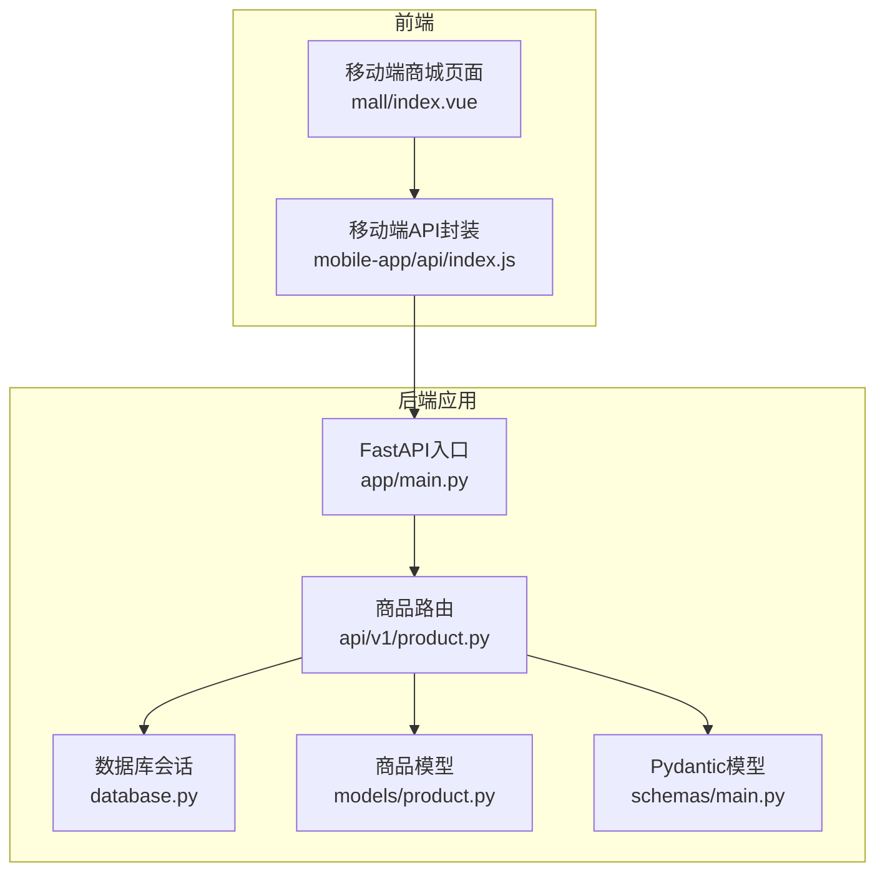
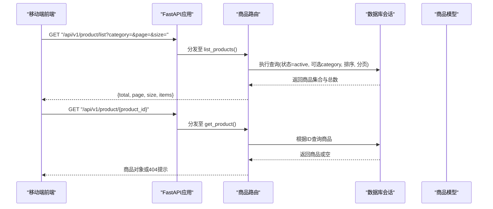
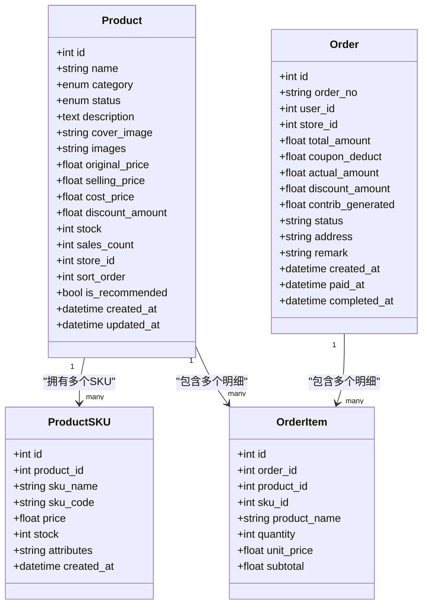
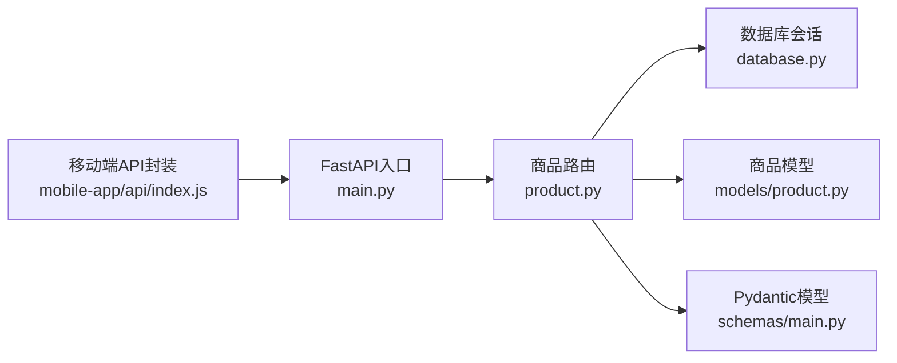

# 商品接口

<cite>
**本文引用的文件**
- [backend/app/main.py](file://backend/app/main.py)
- [backend/app/api/v1/product.py](file://backend/app/api/v1/product.py)
- [backend/app/models/product.py](file://backend/app/models/product.py)
- [backend/app/schemas/main.py](file://backend/app/schemas/main.py)
- [backend/app/database.py](file://backend/app/database.py)
- [frontend/mobile-app/pages/mall/index.vue](file://frontend/mobile-app/pages/mall/index.vue)
- [frontend/mobile-app/api/index.js](file://frontend/mobile-app/api/index.js)
</cite>

## 目录
1. [简介](#简介)
2. [项目结构](#项目结构)
3. [核心组件](#核心组件)
4. [架构总览](#架构总览)
5. [详细组件分析](#详细组件分析)
6. [依赖分析](#依赖分析)
7. [性能考虑](#性能考虑)
8. [故障排查指南](#故障排查指南)
9. [结论](#结论)
10. [附录](#附录)

## 简介
本文件为 AIxingmu 项目的“商品管理”接口文档，聚焦于商品查询、分类筛选、分页展示、详情获取等能力，并说明与库存、订单、拼团业务的集成方式。文档同时覆盖数据模型、请求/响应示例、错误处理与性能建议，帮助前后端开发者快速对接与排障。

## 项目结构
后端采用 FastAPI + SQLAlchemy（异步）分层架构：路由层负责参数校验与返回封装；服务层承载业务逻辑；模型层定义数据库表结构与关系；Schema 层定义 Pydantic 请求/响应结构。前端移动端通过 API 封装调用后端 /api/v1 前缀的 REST 接口。

图表来源
- [backend/app/main.py:58-69](file://backend/app/main.py#L58-L69)
- [backend/app/api/v1/product.py:12-41](file://backend/app/api/v1/product.py#L12-L41)
- [backend/app/database.py:29-40](file://backend/app/database.py#L29-L40)
- [backend/app/models/product.py:30-73](file://backend/app/models/product.py#L30-L73)
- [backend/app/schemas/main.py:47-71](file://backend/app/schemas/main.py#L47-L71)
- [frontend/mobile-app/pages/mall/index.vue:48-92](file://frontend/mobile-app/pages/mall/index.vue#L48-L92)
- [frontend/mobile-app/api/index.js:43-44](file://frontend/mobile-app/api/index.js#L43-L44)

章节来源
- [backend/app/main.py:58-69](file://backend/app/main.py#L58-L69)
- [backend/app/api/v1/product.py:12-41](file://backend/app/api/v1/product.py#L12-L41)
- [backend/app/database.py:29-40](file://backend/app/database.py#L29-L40)
- [backend/app/models/product.py:30-73](file://backend/app/models/product.py#L30-L73)
- [backend/app/schemas/main.py:47-71](file://backend/app/schemas/main.py#L47-L71)
- [frontend/mobile-app/pages/mall/index.vue:48-92](file://frontend/mobile-app/pages/mall/index.vue#L48-L92)
- [frontend/mobile-app/api/index.js:43-44](file://frontend/mobile-app/api/index.js#L43-L44)

## 核心组件
- 商品路由：提供商品列表与详情接口，支持按品类筛选与分页。
- 商品模型：定义商品主表、SKU、订单及明细的数据结构与关系。
- Pydantic Schema：定义商品创建与展示的结构化字段。
- 数据库会话：基于异步引擎与 Session 工厂，统一事务提交与回滚。
- 前端调用：移动端商城页面通过 API 封装发起商品列表请求，实现分类切换与分页加载。

章节来源
- [backend/app/api/v1/product.py:15-41](file://backend/app/api/v1/product.py#L15-L41)
- [backend/app/models/product.py:30-135](file://backend/app/models/product.py#L30-L135)
- [backend/app/schemas/main.py:47-71](file://backend/app/schemas/main.py#L47-L71)
- [backend/app/database.py:10-40](file://backend/app/database.py#L10-L40)
- [frontend/mobile-app/pages/mall/index.vue:64-91](file://frontend/mobile-app/pages/mall/index.vue#L64-L91)
- [frontend/mobile-app/api/index.js:43-44](file://frontend/mobile-app/api/index.js#L43-L44)

## 架构总览
商品接口在 FastAPI 中注册到 /api/v1/product 前缀下，路由层直接访问数据库会话与模型，返回结构化数据。前端通过统一的请求封装携带认证令牌与基础路径，完成商品列表与详情的读取。

图表来源
- [backend/app/main.py:58-69](file://backend/app/main.py#L58-L69)
- [backend/app/api/v1/product.py:15-41](file://backend/app/api/v1/product.py#L15-L41)
- [backend/app/database.py:29-40](file://backend/app/database.py#L29-L40)
- [backend/app/models/product.py:30-73](file://backend/app/models/product.py#L30-L73)

## 详细组件分析

### 商品列表接口
- 端点：GET /api/v1/product/list
- 功能：获取上架商品列表，支持按品类筛选与分页。
- 查询参数：
  - category: 可选，商品品类枚举值（food/drink/use/wear）
  - page: 页码，默认1，最小1
  - size: 每页数量，默认20，范围1-100
- 返回结构：
  - total: 符合条件的商品总数
  - page: 当前页码
  - size: 每页数量
  - items: 商品对象数组
- 业务规则：
  - 仅返回状态为 active 的商品
  - 按 sort_order 降序排列
  - 支持 category 过滤
- 错误处理：
  - 未找到商品时返回 code=404 的提示信息（详情接口）
- 典型调用：
  - 移动端商城页面在分类切换与滚动到底部时触发分页加载

章节来源
- [backend/app/api/v1/product.py:15-31](file://backend/app/api/v1/product.py#L15-L31)
- [backend/app/models/product.py:30-73](file://backend/app/models/product.py#L30-L73)
- [frontend/mobile-app/pages/mall/index.vue:64-91](file://frontend/mobile-app/pages/mall/index.vue#L64-L91)
- [frontend/mobile-app/api/index.js:43-44](file://frontend/mobile-app/api/index.js#L43-L44)

### 商品详情接口
- 端点：GET /api/v1/product/{product_id}
- 功能：根据商品ID获取商品详情。
- 路径参数：
  - product_id: 商品ID
- 返回结构：
  - 成功：返回商品对象
  - 失败：返回 {"code": 404, "message": "商品不存在"}
- 业务规则：
  - 无额外状态过滤，直接按ID查询
- 错误处理：
  - 商品不存在时返回404提示

章节来源
- [backend/app/api/v1/product.py:34-41](file://backend/app/api/v1/product.py#L34-L41)
- [backend/app/models/product.py:30-73](file://backend/app/models/product.py#L30-L73)

### 商品数据模型
- 商品主表（products）
  - 关键字段：id、name、category、status、description、cover_image、images、original_price、selling_price、cost_price、discount_amount、stock、sales_count、store_id、sort_order、is_recommended、created_at、updated_at
  - 索引：category、status、store_id
  - 关系：skus、order_items
- SKU表（product_skus）
  - 关键字段：id、product_id、sku_name、sku_code、price、stock、attributes、created_at
  - 关系：product
- 订单表（orders）
  - 关键字段：id、order_no、user_id、store_id、total_amount、coupon_deduct、actual_amount、discount_amount、contrib_generated、status、address、remark、created_at、paid_at、completed_at
  - 关系：items
- 订单明细表（order_items）
  - 关键字段：id、order_id、product_id、sku_id、product_name、quantity、unit_price、subtotal
  - 关系：order、product

图表来源
- [backend/app/models/product.py:30-135](file://backend/app/models/product.py#L30-L135)

章节来源
- [backend/app/models/product.py:30-135](file://backend/app/models/product.py#L30-L135)

### 价格与让利计算
- 原价与售价：original_price、selling_price
- 成本价：cost_price（可选）
- 让利金额：discount_amount = selling_price × GLOBAL_DISCOUNT_RATIO（配置项，默认20%）
- 贡献值生成：订单层面记录 contrib_generated，用于后续贡献值分配

章节来源
- [backend/app/models/product.py:42-49](file://backend/app/models/product.py#L42-L49)
- [backend/app/config.py:69-71](file://backend/app/config.py#L69-L71)

### 库存控制
- 商品级库存：stock（商品主表）
- SKU级库存：stock（SKU表）
- 已售数量：sales_count（商品主表）
- 库存扣减与回滚：建议在下单、支付、发货、退款等关键节点进行事务性更新，确保一致性

章节来源
- [backend/app/models/product.py:50-52](file://backend/app/models/product.py#L50-L52)
- [backend/app/models/product.py:83-85](file://backend/app/models/product.py#L83-85)

### 上下架状态
- 状态枚举：draft、active、inactive、sold_out
- 列表接口仅返回 active 状态商品
- 建议后台管理提供状态变更接口（当前仓库未实现）

章节来源
- [backend/app/models/product.py:22-28](file://backend/app/models/product.py#L22-28)
- [backend/app/api/v1/product.py:22-24](file://backend/app/api/v1/product.py#L22-24)

### 搜索与筛选
- 当前实现：
  - 分类筛选：category 参数
  - 排序：sort_order 降序
  - 分页：page、size
- 缺失能力（建议扩展）：
  - 关键词搜索（名称模糊匹配）
  - 价格区间筛选
  - 推荐标记筛选（is_recommended）
  - 门店维度筛选（store_id）

章节来源
- [backend/app/api/v1/product.py:15-31](file://backend/app/api/v1/product.py#L15-L31)
- [backend/app/models/product.py:57-60](file://backend/app/models/product.py#L57-60)

### 分页查询
- 参数：
  - page: 页码，默认1
  - size: 每页数量，默认20，最大100
- 返回：
  - total: 总数
  - page: 当前页
  - size: 每页数量
  - items: 商品列表
- 前端行为：
  - 分类切换重置页码
  - 滚动到底部追加下一页数据

章节来源
- [backend/app/api/v1/product.py:18-31](file://backend/app/api/v1/product.py#L18-L31)
- [frontend/mobile-app/pages/mall/index.vue:64-91](file://frontend/mobile-app/pages/mall/index.vue#L64-L91)

### 与订单关联
- 商品与订单明细：
  - OrderItem 包含 product_id、sku_id、product_name、quantity、unit_price、subtotal
  - 商品主表通过 order_items 关系指向订单明细
- 已售统计：
  - sales_count 可用于展示销量
- 建议：
  - 订单结算后批量更新 sales_count
  - 使用事务保证库存与销量的一致性

章节来源
- [backend/app/models/product.py:65-66](file://backend/app/models/product.py#L65-66)
- [backend/app/models/product.py:120-135](file://backend/app/models/product.py#L120-L135)

### 与拼团业务集成
- 拼团场次与订单：
  - GroupBuySession：场次级别、人数规则、时间窗口、结果判定
  - GroupBuyOrder：参团订单、权益与补贴记录
- 商品与拼团的结合点：
  - 商品定价作为拼团金额的基础（例如箱数倍数×单价）
  - 拼中用户获得商品权益（比例由配置决定）
  - 拼失败用户获得广告补贴与推荐人补贴（比例由配置决定）
- 前端调用：
  - 移动端通过 group-buy 相关接口参与拼团与查看订单

章节来源
- [backend/app/models/group_buy.py:42-158](file://backend/app/models/group_buy.py#L42-L158)
- [backend/app/api/v1/group_buy.py:15-65](file://backend/app/api/v1/group_buy.py#L15-65)
- [frontend/mobile-app/api/index.js:38-41](file://frontend/mobile-app/api/index.js#L38-41)

### 商品创建与展示模型
- 创建模型（ProductCreate）：
  - 字段：name、category、original_price、selling_price、description、cover_image、stock
- 展示模型（ProductInfo）：
  - 字段：id、name、category、original_price、selling_price、discount_amount、stock、sales_count、cover_image、status
- 用途：
  - 创建商品时使用 ProductCreate 进行入参校验
  - 展示商品时使用 ProductInfo 进行出参序列化

章节来源
- [backend/app/schemas/main.py:47-71](file://backend/app/schemas/main.py#L47-L71)

## 依赖分析
- 路由依赖：
  - 数据库会话：get_db 提供异步会话与事务管理
  - 模型：Product、ProductCategory、ProductStatus
  - Schema：ProductCreate、ProductInfo
- 前端依赖：
  - 移动端 API 封装统一设置 BASE_URL 与 Authorization 头
  - 商城页面通过 getProducts 发起列表请求

图表来源
- [backend/app/api/v1/product.py:7-11](file://backend/app/api/v1/product.py#L7-11)
- [backend/app/database.py:29-40](file://backend/app/database.py#L29-L40)
- [backend/app/models/product.py:30-73](file://backend/app/models/product.py#L30-L73)
- [backend/app/schemas/main.py:47-71](file://backend/app/schemas/main.py#L47-L71)
- [frontend/mobile-app/api/index.js:4-16](file://frontend/mobile-app/api/index.js#L4-L16)
- [backend/app/main.py:58-69](file://backend/app/main.py#L58-L69)

章节来源
- [backend/app/api/v1/product.py:7-11](file://backend/app/api/v1/product.py#L7-11)
- [backend/app/database.py:29-40](file://backend/app/database.py#L29-L40)
- [backend/app/models/product.py:30-73](file://backend/app/models/product.py#L30-L73)
- [backend/app/schemas/main.py:47-71](file://backend/app/schemas/main.py#L47-L71)
- [frontend/mobile-app/api/index.js:4-16](file://frontend/mobile-app/api/index.js#L4-L16)
- [backend/app/main.py:58-69](file://backend/app/main.py#L58-L69)

## 性能考虑
- 索引优化：
  - 已对 category、status、store_id 建立索引，提升筛选与查询效率
- 分页策略：
  - 限制 size 上限为100，避免一次性拉取过多数据
- 排序与过滤：
  - 按 sort_order 降序，减少前端二次排序开销
- 建议：
  - 增加关键词搜索时引入全文检索或搜索引擎
  - 热点商品可引入缓存层（如 Redis）降低数据库压力
  - 库存扣减使用乐观锁或行级锁保障并发安全

章节来源
- [backend/app/models/product.py:68-72](file://backend/app/models/product.py#L68-L72)
- [backend/app/api/v1/product.py:18-31](file://backend/app/api/v1/product.py#L18-L31)

## 故障排查指南
- 常见问题：
  - 商品不存在：详情接口返回 code=404 与 message 提示
  - 未登录：前端封装在 401 时清除 token 并跳转登录页
  - 请求失败：前端统一捕获并显示 detail 信息
- 定位方法：
  - 检查路由注册是否正确（/api/v1/product）
  - 确认数据库连接与会话是否正常
  - 核对前端 BASE_URL 与 Authorization 头设置

章节来源
- [backend/app/api/v1/product.py:38-40](file://backend/app/api/v1/product.py#L38-L40)
- [frontend/mobile-app/api/index.js:18-27](file://frontend/mobile-app/api/index.js#L18-L27)
- [backend/app/main.py:58-69](file://backend/app/main.py#L58-L69)

## 结论
当前商品接口实现了基础的列表查询、分类筛选、分页与详情获取，并与订单、拼团等业务模块形成良好耦合。建议后续补充商品创建、上下架管理、关键词搜索、价格区间筛选等能力，并结合缓存与并发控制提升性能与稳定性。

## 附录

### 接口清单
- 商品列表
  - 方法：GET
  - 路径：/api/v1/product/list
  - 参数：category、page、size
  - 返回：{total, page, size, items}
- 商品详情
  - 方法：GET
  - 路径：/api/v1/product/{product_id}
  - 返回：商品对象或 {code: 404, message: "商品不存在"}

章节来源
- [backend/app/api/v1/product.py:15-41](file://backend/app/api/v1/product.py#L15-L41)

### 数据模型示例
- 商品主表字段参考：
  - id、name、category、status、original_price、selling_price、discount_amount、stock、sales_count、sort_order、is_recommended
- SKU字段参考：
  - id、product_id、sku_name、sku_code、price、stock、attributes
- 订单与明细字段参考：
  - orders: order_no、user_id、store_id、total_amount、actual_amount、status
  - order_items: product_id、sku_id、product_name、quantity、unit_price、subtotal

章节来源
- [backend/app/models/product.py:30-135](file://backend/app/models/product.py#L30-L135)

### 前端调用示例
- 移动端 API 封装：
  - BASE_URL = "/api/v1"
  - getProducts(params) 调用 /product/list
- 商城页面：
  - 分类切换与分页加载，展示商品图片、名称、价格、销量与贡献值提示

章节来源
- [frontend/mobile-app/api/index.js:4-44](file://frontend/mobile-app/api/index.js#L4-L44)
- [frontend/mobile-app/pages/mall/index.vue:48-91](file://frontend/mobile-app/pages/mall/index.vue#L48-L91)