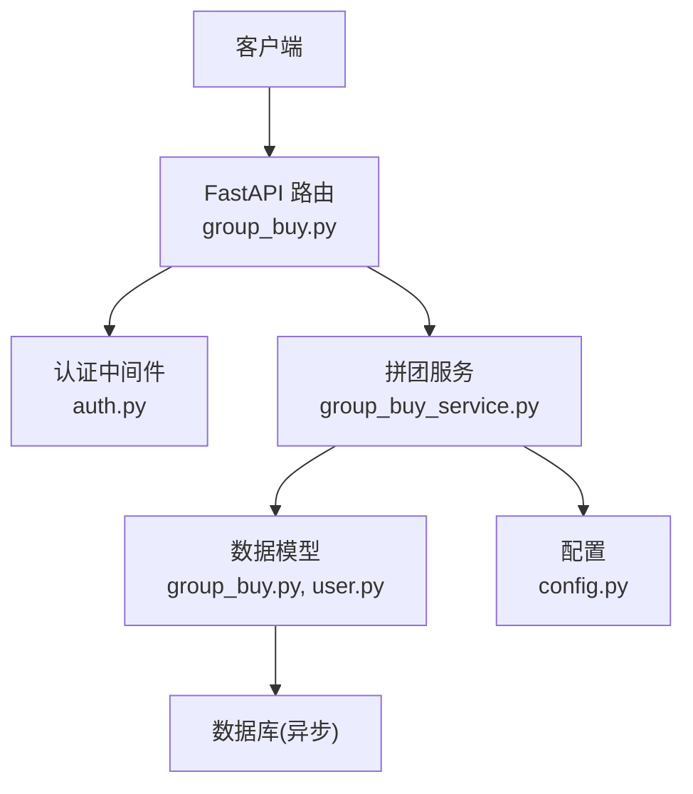
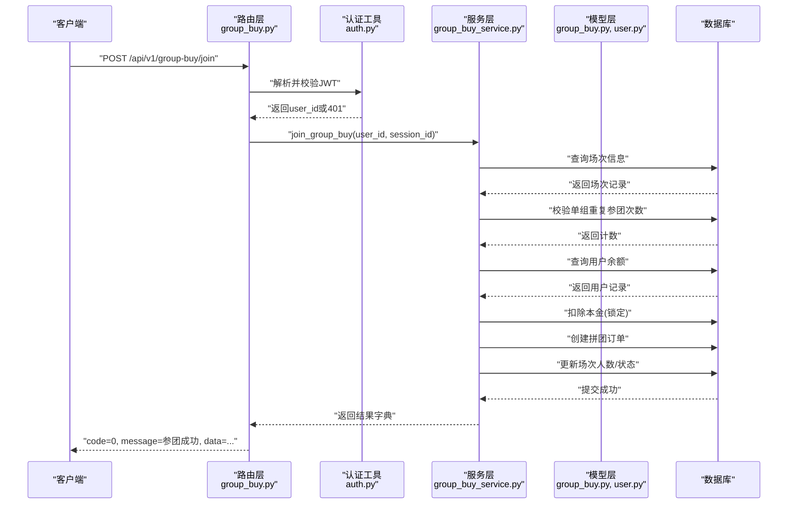
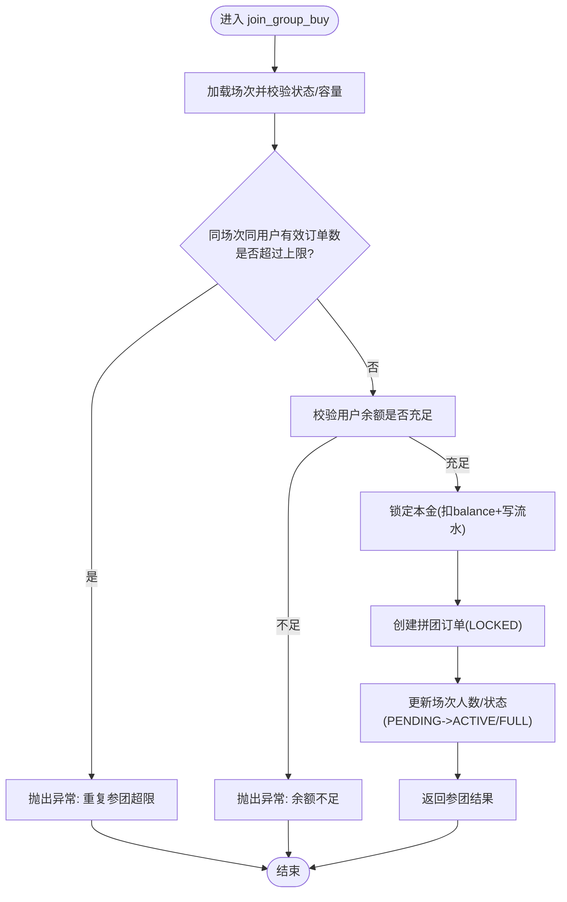
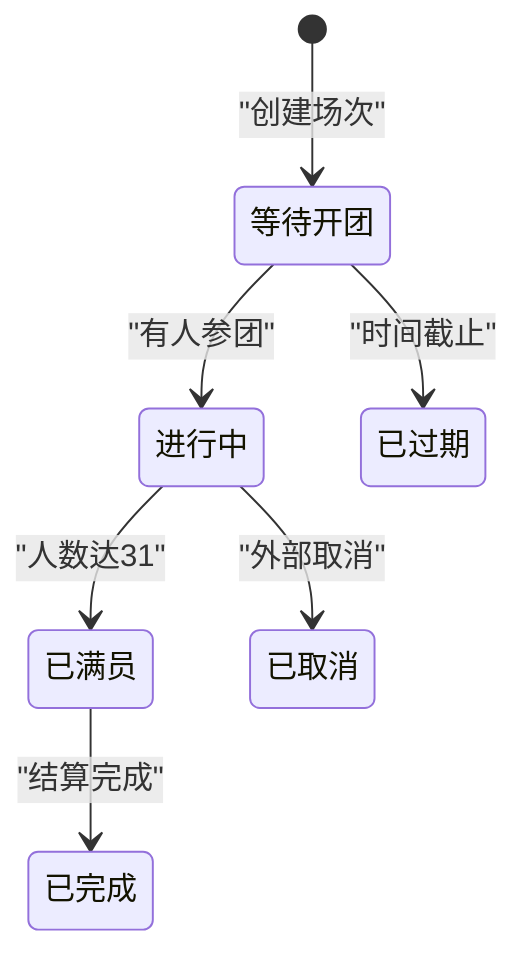
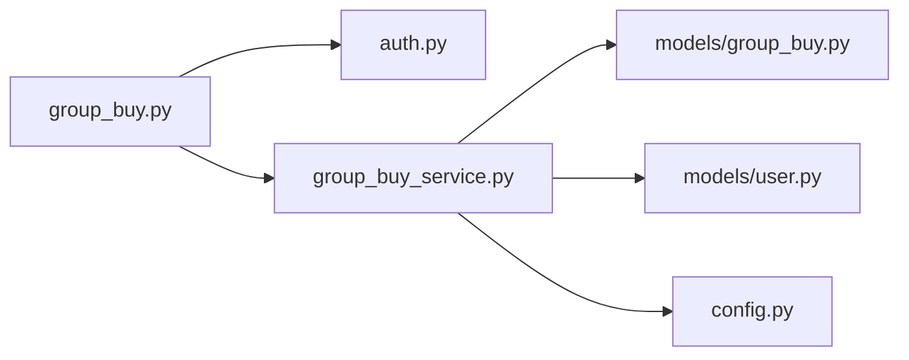

# 参团流程接口

<cite>
**本文引用的文件**   
- [backend/app/api/v1/group_buy.py](file://backend/app/api/v1/group_buy.py)
- [backend/app/services/group_buy_service.py](file://backend/app/services/group_buy_service.py)
- [backend/app/models/group_buy.py](file://backend/app/models/group_buy.py)
- [backend/app/models/user.py](file://backend/app/models/user.py)
- [backend/app/schemas/main.py](file://backend/app/schemas/main.py)
- [backend/app/utils/auth.py](file://backend/app/utils/auth.py)
- [backend/app/config.py](file://backend/app/config.py)
</cite>

## 目录
1. [简介](#简介)
2. [项目结构](#项目结构)
3. [核心组件](#核心组件)
4. [架构总览](#架构总览)
5. [详细组件分析](#详细组件分析)
6. [依赖关系分析](#依赖关系分析)
7. [性能与并发控制](#性能与并发控制)
8. [事务处理与一致性](#事务处理与一致性)
9. [错误码与异常处理](#错误码与异常处理)
10. [完整调用示例](#完整调用示例)
11. [故障排查指南](#故障排查指南)
12. [结论](#结论)

## 简介
本文档聚焦于 AIxingmu 项目的“参团”能力，详细说明 POST /api/v1/group-buy/join 端点的完整参团流程。内容涵盖：
- JoinGroupBuyRequest 请求体字段定义
- 用户身份验证机制（JWT）
- 业务规则校验（重复参团检测、场次状态检查、余额校验等）
- 参团成功响应数据结构
- 参团失败错误码与异常说明
- 事务处理、并发控制、库存扣减等关键技术实现建议
- 正常流程与异常场景的端到端示例

## 项目结构
后端采用 FastAPI + SQLAlchemy 异步 ORM 的分层架构：
- API 层：路由与参数解析
- 服务层：拼团核心业务逻辑
- 模型层：数据表结构与枚举
- 认证工具：JWT 生成/校验
- 配置中心：全局业务常量与开关

图表来源
- [backend/app/api/v1/group_buy.py:1-65](file://backend/app/api/v1/group_buy.py#L1-L65)
- [backend/app/utils/auth.py:1-50](file://backend/app/utils/auth.py#L1-L50)
- [backend/app/services/group_buy_service.py:1-348](file://backend/app/services/group_buy_service.py#L1-L348)
- [backend/app/models/group_buy.py:1-158](file://backend/app/models/group_buy.py#L1-L158)
- [backend/app/models/user.py:1-93](file://backend/app/models/user.py#L1-L93)
- [backend/app/config.py:1-136](file://backend/app/config.py#L1-L136)

章节来源
- [backend/app/api/v1/group_buy.py:1-65](file://backend/app/api/v1/group_buy.py#L1-L65)
- [backend/app/services/group_buy_service.py:1-348](file://backend/app/services/group_buy_service.py#L1-L348)
- [backend/app/models/group_buy.py:1-158](file://backend/app/models/group_buy.py#L1-L158)
- [backend/app/models/user.py:1-93](file://backend/app/models/user.py#L1-L93)
- [backend/app/schemas/main.py:1-176](file://backend/app/schemas/main.py#L1-L176)
- [backend/app/utils/auth.py:1-50](file://backend/app/utils/auth.py#L1-L50)
- [backend/app/config.py:1-136](file://backend/app/config.py#L1-L136)

## 核心组件
- 路由层：提供 GET/POST 接口，负责鉴权注入、参数绑定与统一响应包装
- 服务层：封装参团全流程（校验、锁定本金、创建订单、更新场次人数、满员判定）
- 模型层：场次、订单、用户钱包流水等实体及状态枚举
- 认证工具：从 JWT 中提取当前用户 ID
- 配置：拼团规模、价格倍数、权益比例等全局常量

章节来源
- [backend/app/api/v1/group_buy.py:26-38](file://backend/app/api/v1/group_buy.py#L26-L38)
- [backend/app/services/group_buy_service.py:92-181](file://backend/app/services/group_buy_service.py#L92-L181)
- [backend/app/models/group_buy.py:42-131](file://backend/app/models/group_buy.py#L42-L131)
- [backend/app/models/user.py:26-93](file://backend/app/models/user.py#L26-L93)
- [backend/app/schemas/main.py:73-75](file://backend/app/schemas/main.py#L73-L75)
- [backend/app/utils/auth.py:39-50](file://backend/app/utils/auth.py#L39-L50)
- [backend/app/config.py:42-58](file://backend/app/config.py#L42-L58)

## 架构总览
下图展示一次参团请求在系统中的流转路径与关键交互点。

图表来源
- [backend/app/api/v1/group_buy.py:26-38](file://backend/app/api/v1/group_buy.py#L26-L38)
- [backend/app/utils/auth.py:39-50](file://backend/app/utils/auth.py#L39-L50)
- [backend/app/services/group_buy_service.py:92-181](file://backend/app/services/group_buy_service.py#L92-L181)
- [backend/app/models/group_buy.py:42-131](file://backend/app/models/group_buy.py#L42-L131)
- [backend/app/models/user.py:26-93](file://backend/app/models/user.py#L26-L93)

## 详细组件分析

### 接口定义与请求体
- 端点：POST /api/v1/group-buy/join
- 请求体：JoinGroupBuyRequest
  - session_id: 整数，必填，表示要参与的场次ID
- 响应体：统一包装 { code, message, data }
  - 成功时 data 包含订单与场次相关信息（见后文“响应数据结构”）

章节来源
- [backend/app/api/v1/group_buy.py:26-38](file://backend/app/api/v1/group_buy.py#L26-L38)
- [backend/app/schemas/main.py:73-75](file://backend/app/schemas/main.py#L73-L75)

### 用户身份验证机制
- 使用 HTTP Bearer Token 进行鉴权
- get_current_user_id 从 Authorization: Bearer <token> 中解析 payload，提取 sub 作为 user_id
- 无效或缺失 token 将返回 401 未授权

章节来源
- [backend/app/utils/auth.py:39-50](file://backend/app/utils/auth.py#L39-L50)
- [backend/app/api/v1/group_buy.py:29](file://backend/app/api/v1/group_buy.py#L29)

### 业务规则校验
- 场次存在性与状态：仅允许 PENDING 或 ACTIVE 状态参与；FULL/COMPLETED/CANCELLED/EXPIRED 不可参与
- 场次容量：current_players < total_players 方可继续参团
- 重复参团限制：同一用户在同一场次内，处于 PENDING 或 LOCKED 状态的订单数不得超过配置上限（默认5单）
- 余额校验：用户 balance 必须大于等于该场次的 total_price
- 其他：用户存在性校验

章节来源
- [backend/app/services/group_buy_service.py:104-136](file://backend/app/services/group_buy_service.py#L104-L136)
- [backend/app/config.py:53-58](file://backend/app/config.py#L53-L58)

### 参团主流程（join_group_buy）
- 步骤概览
  1) 读取场次信息并校验状态与容量
  2) 统计用户在该场次的有效订单数，判断是否超限
  3) 读取用户余额并校验
  4) 锁定本金：扣减用户 balance，写入 UserWalletLog（lock）
  5) 创建 GroupBuyOrder（状态 LOCKED），携带 referrer_id
  6) 增加场次 current_players，若由 PENDING 变为首次有人参团则置为 ACTIVE
  7) 若达到满员阈值，则将场次置为 FULL
  8) 返回订单与剩余余额等信息

图表来源
- [backend/app/services/group_buy_service.py:92-181](file://backend/app/services/group_buy_service.py#L92-L181)

章节来源
- [backend/app/services/group_buy_service.py:92-181](file://backend/app/services/group_buy_service.py#L92-L181)

### 数据模型与状态机
- 场次状态：PENDING -> ACTIVE -> FULL -> COMPLETED
- 订单状态：PENDING -> LOCKED -> WON/REFUNDED(CANCELLED)
- 关键字段：total_players=31，winner_count=1，loser_count=30
- 用户资产：balance/contribution_value/points/coupon_balance，以及变动流水表

图表来源
- [backend/app/models/group_buy.py:22-30](file://backend/app/models/group_buy.py#L22-L30)
- [backend/app/models/group_buy.py:42-86](file://backend/app/models/group_buy.py#L42-L86)

章节来源
- [backend/app/models/group_buy.py:22-30](file://backend/app/models/group_buy.py#L22-L30)
- [backend/app/models/group_buy.py:42-86](file://backend/app/models/group_buy.py#L42-L86)
- [backend/app/models/group_buy.py:89-131](file://backend/app/models/group_buy.py#L89-L131)
- [backend/app/models/user.py:26-93](file://backend/app/models/user.py#L26-L93)

### 响应数据结构
- 成功响应
  - code: 0
  - message: "参团成功"
  - data:
    - order_id: 订单ID
    - order_no: 订单编号
    - session_id: 场次ID
    - amount: 参团金额
    - remaining_balance: 用户剩余余额
    - session_full: 布尔值，表示本次参团后是否刚好满员
- 失败响应
  - 通过 HTTPException 抛出，HTTP 状态码 400，detail 为具体错误信息（如“该场次已满员”、“余额不足”等）

章节来源
- [backend/app/api/v1/group_buy.py:33-37](file://backend/app/api/v1/group_buy.py#L33-L37)
- [backend/app/services/group_buy_service.py:174-181](file://backend/app/services/group_buy_service.py#L174-L181)

### 错误码与异常处理
- 401 未授权：Token 无效或缺失
- 400 业务异常：
  - 场次不存在
  - 场次已截止参与（非 PENDING/ACTIVE）
  - 场次已满员
  - 单ID单组最多参与 N 单（N 来自配置）
  - 用户不存在
  - 余额不足
- 404 资源不存在：场次详情查询时可能触发（用于其他接口）

章节来源
- [backend/app/utils/auth.py:39-50](file://backend/app/utils/auth.py#L39-L50)
- [backend/app/api/v1/group_buy.py:33-37](file://backend/app/api/v1/group_buy.py#L33-L37)
- [backend/app/services/group_buy_service.py:104-136](file://backend/app/services/group_buy_service.py#L104-L136)

## 依赖关系分析
- 路由依赖认证工具与数据库会话
- 服务层依赖模型与配置
- 模型层定义表结构与索引，支撑高并发查询与过滤

图表来源
- [backend/app/api/v1/group_buy.py:1-65](file://backend/app/api/v1/group_buy.py#L1-L65)
- [backend/app/utils/auth.py:1-50](file://backend/app/utils/auth.py#L1-L50)
- [backend/app/services/group_buy_service.py:1-348](file://backend/app/services/group_buy_service.py#L1-L348)
- [backend/app/models/group_buy.py:1-158](file://backend/app/models/group_buy.py#L1-L158)
- [backend/app/models/user.py:1-93](file://backend/app/models/user.py#L1-L93)
- [backend/app/config.py:1-136](file://backend/app/config.py#L1-L136)

章节来源
- [backend/app/api/v1/group_buy.py:1-65](file://backend/app/api/v1/group_buy.py#L1-L65)
- [backend/app/services/group_buy_service.py:1-348](file://backend/app/services/group_buy_service.py#L1-L348)
- [backend/app/models/group_buy.py:1-158](file://backend/app/models/group_buy.py#L1-L158)
- [backend/app/models/user.py:1-93](file://backend/app/models/user.py#L1-L93)
- [backend/app/config.py:1-136](file://backend/app/config.py#L1-L136)

## 性能与并发控制
- 当前实现要点
  - 使用异步 ORM 减少阻塞
  - 通过数据库唯一索引与条件查询避免重复参团
  - 使用 flush 批量提交，降低往返开销
- 潜在并发风险与建议
  - 重复参团与超卖防护：建议在“查询有效订单数”和“插入新订单”之间引入分布式锁（如 Redis SETNX）或数据库行级锁（SELECT ... FOR UPDATE），确保原子性
  - 场次人数原子递增：建议使用数据库原子操作（UPDATE ... SET current_players = current_players + 1 WHERE id = ? AND status IN (...)）替代先读后写
  - 余额扣减原子性：使用带条件的 UPDATE 语句，结合唯一约束与幂等键（order_no）防止重复入账
  - 读写分离与缓存：对“可参与场次列表”做短时缓存，降低热点查询压力
  - 限流与防刷：对同一用户/同一场次接入网关层限流，避免恶意压测

[本节为通用性能建议，不直接分析具体代码文件]

## 事务处理与一致性
- 当前实现
  - 单次请求内多次 db.add 与一次 await db.flush()，属于同一会话内的批处理
- 改进建议
  - 显式事务边界：使用 async with db.begin(): 包裹整个 join 流程，确保“锁定本金、创建订单、更新场次人数”三者要么全部成功，要么全部回滚
  - 幂等设计：以 order_no 作为幂等键，支持重试安全
  - 补偿机制：若后续结算失败，需具备资金与权益的回滚或补偿任务

章节来源
- [backend/app/services/group_buy_service.py:138-173](file://backend/app/services/group_buy_service.py#L138-L173)

## 错误码与异常处理
- 401 未授权：JWT 无效或缺失
- 400 业务异常：
  - 场次不存在
  - 场次已截止参与
  - 场次已满员
  - 单ID单组最多参与 N 单
  - 用户不存在
  - 余额不足
- 404 资源不存在：场次详情查询时可能触发

章节来源
- [backend/app/utils/auth.py:39-50](file://backend/app/utils/auth.py#L39-L50)
- [backend/app/api/v1/group_buy.py:33-37](file://backend/app/api/v1/group_buy.py#L33-L37)
- [backend/app/services/group_buy_service.py:104-136](file://backend/app/services/group_buy_service.py#L104-L136)

## 完整调用示例

### 前置准备
- 获取 JWT：通过登录接口获得 access_token
- 获取可参与场次：GET /api/v1/group-buy/sessions，选择 session_id

章节来源
- [backend/app/api/v1/group_buy.py:15-23](file://backend/app/api/v1/group_buy.py#L15-L23)

### 正常流程
- 请求
  - 方法：POST
  - 路径：/api/v1/group-buy/join
  - Header：Authorization: Bearer <access_token>
  - Body：{ "session_id": 123 }
- 服务端处理
  - 校验场次状态与容量
  - 校验用户在本场次的有效订单数
  - 校验用户余额
  - 锁定本金、创建订单、更新场次人数
- 响应
  - code: 0
  - message: "参团成功"
  - data: { order_id, order_no, session_id, amount, remaining_balance, session_full }

章节来源
- [backend/app/api/v1/group_buy.py:26-38](file://backend/app/api/v1/group_buy.py#L26-L38)
- [backend/app/services/group_buy_service.py:92-181](file://backend/app/services/group_buy_service.py#L92-L181)

### 异常场景
- 未携带或无效 Token
  - 现象：HTTP 401，detail 提示无效凭据
- 场次不存在
  - 现象：HTTP 400，detail 提示“拼团场次不存在”
- 场次已截止参与
  - 现象：HTTP 400，detail 提示“该场次已截止参与”
- 场次已满员
  - 现象：HTTP 400，detail 提示“该场次已满员”
- 重复参团超限
  - 现象：HTTP 400，detail 提示“单ID单组最多参与 N 单”
- 用户不存在
  - 现象：HTTP 400，detail 提示“用户不存在”
- 余额不足
  - 现象：HTTP 400，detail 提示“余额不足, 请先充值”

章节来源
- [backend/app/utils/auth.py:39-50](file://backend/app/utils/auth.py#L39-L50)
- [backend/app/services/group_buy_service.py:104-136](file://backend/app/services/group_buy_service.py#L104-L136)
- [backend/app/api/v1/group_buy.py:33-37](file://backend/app/api/v1/group_buy.py#L33-L37)

## 故障排查指南
- 常见问题定位
  - 401：检查 Authorization 头格式是否为 Bearer <token>，确认 token 未过期
  - 400：查看 detail 中的具体原因，优先核对 session_id 是否存在且状态为 PENDING/ACTIVE
  - 重复参团：确认用户是否已在该场次有 PENDING/LOCKED 订单
  - 余额不足：核对用户 balance 与场次 total_price
- 日志与追踪
  - 关注 UserWalletLog 流水记录，确认 lock/unlock 是否正确落库
  - 核对 GroupBuyOrder 状态变化是否符合预期
  - 检查 GroupBuySession.current_players 与 status 变更是否一致

章节来源
- [backend/app/models/user.py:74-93](file://backend/app/models/user.py#L74-L93)
- [backend/app/models/group_buy.py:89-131](file://backend/app/models/group_buy.py#L89-L131)
- [backend/app/models/group_buy.py:42-86](file://backend/app/models/group_buy.py#L42-L86)

## 结论
POST /api/v1/group-buy/join 实现了完整的参团闭环：鉴权、业务校验、资金锁定、订单创建与场次人数更新。为保证在高并发与强一致性要求下的稳定性，建议引入显式事务边界、原子更新与分布式锁，并结合幂等设计与限流策略提升系统鲁棒性。