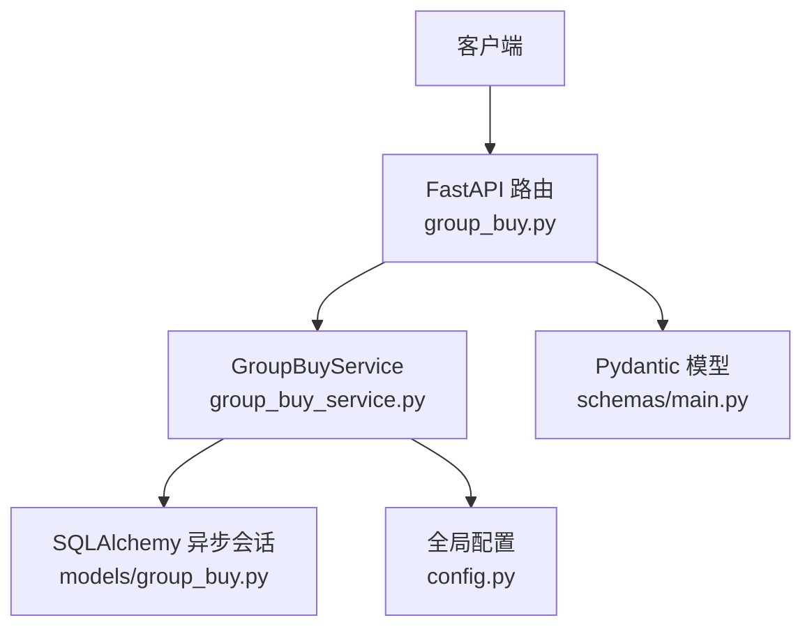
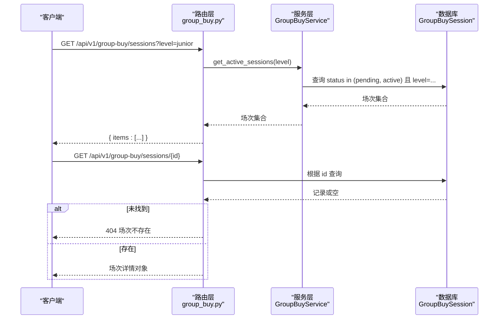
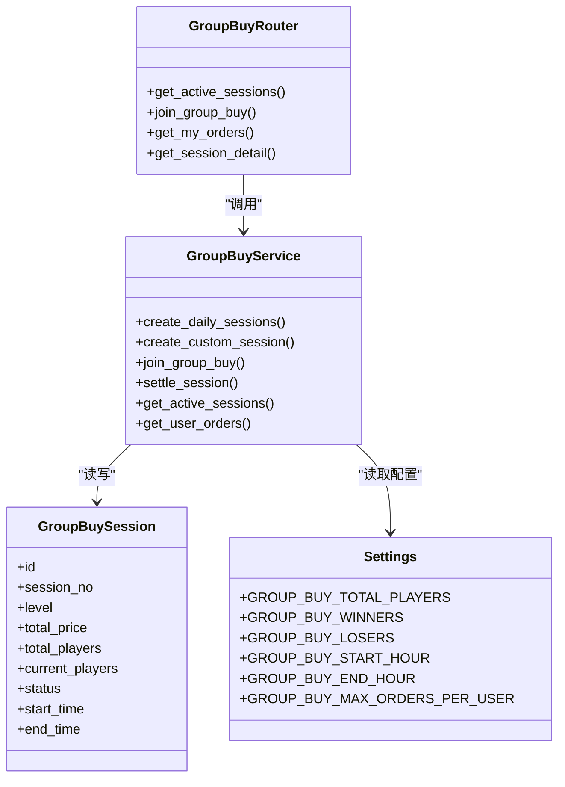
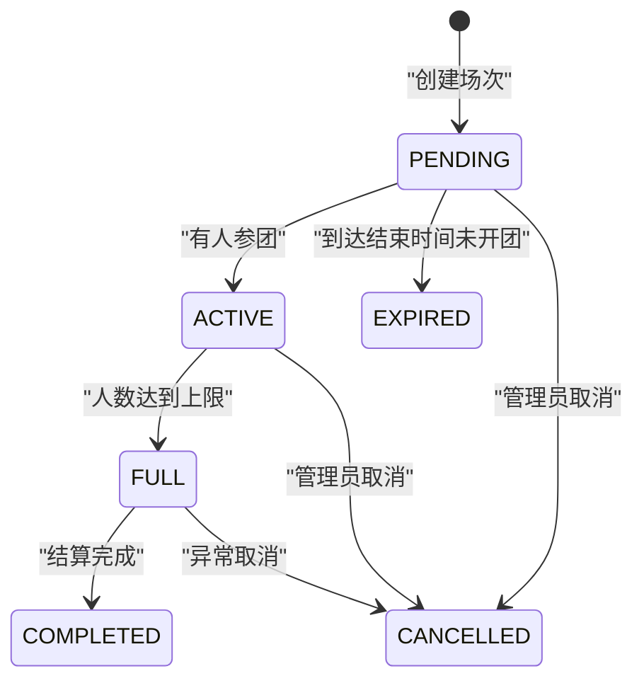

# 拼团场次管理接口

<cite>
**本文引用的文件**
- [backend/app/api/v1/group_buy.py](file://backend/app/api/v1/group_buy.py)
- [backend/app/services/group_buy_service.py](file://backend/app/services/group_buy_service.py)
- [backend/app/models/group_buy.py](file://backend/app/models/group_buy.py)
- [backend/app/schemas/main.py](file://backend/app/schemas/main.py)
- [backend/app/config.py](file://backend/app/config.py)
</cite>

## 目录
1. [简介](#简介)
2. [项目结构](#项目结构)
3. [核心组件](#核心组件)
4. [架构总览](#架构总览)
5. [详细组件分析](#详细组件分析)
6. [依赖关系分析](#依赖关系分析)
7. [性能与一致性考虑](#性能与一致性考虑)
8. [故障排查指南](#故障排查指南)
9. [结论](#结论)
10. [附录：请求与响应示例](#附录请求与响应示例)

## 简介
本文件为 AIxingmu 项目的“拼团场次管理”相关接口的权威文档，聚焦以下能力：
- 获取可参与拼团场次列表（支持按级别筛选）
- 获取指定场次详情（含路径参数校验与错误处理）
- 接口层面的状态机、时间控制与人数限制规则说明
- 完整的成功/失败请求与响应示例

## 项目结构
后端采用 FastAPI + SQLAlchemy 异步 ORM 的分层设计：
- API 层：定义路由与入参出参
- Service 层：封装业务逻辑（场次创建、参团、结算、查询等）
- Model 层：数据模型与枚举（场次、订单、状态等）
- Schema 层：Pydantic 请求/响应模型
- Config 层：全局配置（拼团人数、时段、比例等）

图示来源
- [backend/app/api/v1/group_buy.py:15-64](file://backend/app/api/v1/group_buy.py#L15-L64)
- [backend/app/services/group_buy_service.py:324-333](file://backend/app/services/group_buy_service.py#L324-L333)
- [backend/app/models/group_buy.py:42-86](file://backend/app/models/group_buy.py#L42-L86)
- [backend/app/schemas/main.py:72-88](file://backend/app/schemas/main.py#L72-L88)
- [backend/app/config.py:52-58](file://backend/app/config.py#L52-L58)

章节来源
- [backend/app/api/v1/group_buy.py:15-64](file://backend/app/api/v1/group_buy.py#L15-L64)
- [backend/app/services/group_buy_service.py:324-333](file://backend/app/services/group_buy_service.py#L324-L333)
- [backend/app/models/group_buy.py:42-86](file://backend/app/models/group_buy.py#L42-L86)
- [backend/app/schemas/main.py:72-88](file://backend/app/schemas/main.py#L72-L88)
- [backend/app/config.py:52-58](file://backend/app/config.py#L52-L58)

## 核心组件
- 路由组：/api/v1/group-buy
  - GET /sessions：获取当前可参与的场次（可选 level 筛选）
  - GET /sessions/{session_id}：获取场次详情（不存在返回 404）
- 服务层：GroupBuyService
  - get_active_sessions：按状态与级别过滤并排序
  - join_group_buy：参团校验、余额锁定、人数更新、满员判定
  - settle_session：满员后结算（随机抽中1人，其余退回并发放补贴）
- 数据模型：GroupBuySession、GroupBuyOrder、枚举 SessionStatus、OrderStatus、GroupBuyLevel
- 配置：每场人数、胜负人数、开团时段、单用户同组最大订单数等

章节来源
- [backend/app/api/v1/group_buy.py:15-64](file://backend/app/api/v1/group_buy.py#L15-L64)
- [backend/app/services/group_buy_service.py:93-181](file://backend/app/services/group_buy_service.py#L93-L181)
- [backend/app/services/group_buy_service.py:184-321](file://backend/app/services/group_buy_service.py#L184-L321)
- [backend/app/models/group_buy.py:15-30](file://backend/app/models/group_buy.py#L15-30)
- [backend/app/models/group_buy.py:42-86](file://backend/app/models/group_buy.py#L42-L86)
- [backend/app/config.py:52-58](file://backend/app/config.py#L52-L58)

## 架构总览
下图展示“获取可参与场次”和“获取场次详情”的调用链路。

图示来源
- [backend/app/api/v1/group_buy.py:15-23](file://backend/app/api/v1/group_buy.py#L15-L23)
- [backend/app/api/v1/group_buy.py:52-64](file://backend/app/api/v1/group_buy.py#L52-L64)
- [backend/app/services/group_buy_service.py:324-333](file://backend/app/services/group_buy_service.py#L324-L333)
- [backend/app/models/group_buy.py:42-86](file://backend/app/models/group_buy.py#L42-L86)

## 详细组件分析

### 接口一：获取可参与拼团场次
- 端点：GET /api/v1/group-buy/sessions
- 认证：无需鉴权（从路由签名可见无用户依赖）
- 查询参数
  - level: 可选，字符串，取值范围 junior、senior、svip（对应 GroupBuyLevel）
- 行为
  - 仅返回处于“等待开团 pending”或“进行中 active”的场次
  - 若提供 level，则按该级别过滤
  - 结果按 start_time 升序排列
- 响应体
  - items: 数组，元素为场次对象（字段见下方“数据结构”）
- 错误码
  - 200：正常返回
  - 其他：由框架统一异常处理（本端点未显式抛出）

数据结构（items 中的对象）
- id: 整数
- session_no: 字符串
- level: 字符串（junior/senior/svip）
- total_price: 浮点数
- total_players: 整数（默认 31）
- current_players: 整数
- status: 字符串（pending/active/full/completed/cancelled/expired）
- start_time: 时间戳
- end_time: 时间戳

章节来源
- [backend/app/api/v1/group_buy.py:15-23](file://backend/app/api/v1/group_buy.py#L15-L23)
- [backend/app/services/group_buy_service.py:324-333](file://backend/app/services/group_buy_service.py#L324-L333)
- [backend/app/models/group_buy.py:42-86](file://backend/app/models/group_buy.py#L42-L86)
- [backend/app/models/group_buy.py:15-30](file://backend/app/models/group_buy.py#L15-30)
- [backend/app/config.py:52-58](file://backend/app/config.py#L52-L58)

### 接口二：获取拼团场次详情
- 端点：GET /api/v1/group-buy/sessions/{session_id}
- 路径参数
  - session_id: 整数，必填
- 行为
  - 根据 session_id 查询场次
  - 若不存在，返回 404 错误
- 响应体
  - 直接返回场次对象（字段同上）
- 错误码
  - 200：正常返回
  - 404：场次不存在

章节来源
- [backend/app/api/v1/group_buy.py:52-64](file://backend/app/api/v1/group_buy.py#L52-L64)
- [backend/app/models/group_buy.py:42-86](file://backend/app/models/group_buy.py#L42-L86)

### 接口三：参与拼团（补充说明，便于理解状态与人数规则）
- 端点：POST /api/v1/group-buy/join
- 认证：需要登录（依赖当前用户ID）
- 请求体
  - session_id: 整数
- 校验与规则
  - 场次必须处于 pending 或 active
  - 未满员（current_players < total_players）
  - 同一用户在同一场次最多参与 N 单（N 来自配置 GROUP_BUY_MAX_ORDERS_PER_USER，默认 5）
  - 用户余额充足（扣除 total_price）
- 副作用
  - 锁定本金（钱包流水记录）
  - 创建订单（状态 LOCKED）
  - 更新 current_players；若达到 total_players，将状态置为 FULL
- 响应体
  - order_id、order_no、session_id、amount、remaining_balance、session_full（布尔）
- 错误码
  - 400：业务校验失败（如场次不存在、已截止、已满员、余额不足、超过同组上限）

章节来源
- [backend/app/api/v1/group_buy.py:26-38](file://backend/app/api/v1/group_buy.py#L26-38)
- [backend/app/services/group_buy_service.py:93-181](file://backend/app/services/group_buy_service.py#L93-L181)
- [backend/app/config.py:58](file://backend/app/config.py#L58)

### 接口四：我的拼团订单（补充说明）
- 端点：GET /api/v1/group-buy/orders
- 认证：需要登录
- 查询参数
  - page: 页码，默认 1
  - size: 每页条数，默认 20
- 响应体
  - total、page、size、items（订单列表）

章节来源
- [backend/app/api/v1/group_buy.py:40-49](file://backend/app/api/v1/group_buy.py#L40-L49)
- [backend/app/services/group_buy_service.py:336-347](file://backend/app/services/group_buy_service.py#L336-L347)

## 依赖关系分析
- 路由层依赖服务层进行业务处理
- 服务层依赖模型层进行数据访问
- 服务层依赖配置层读取拼团核心参数（人数、时段、比例等）
- 路由层在详情接口中直接通过模型查询，并在缺失时抛出 HTTP 404

图示来源
- [backend/app/api/v1/group_buy.py:15-64](file://backend/app/api/v1/group_buy.py#L15-L64)
- [backend/app/services/group_buy_service.py:27-90](file://backend/app/services/group_buy_service.py#L27-90)
- [backend/app/services/group_buy_service.py:324-347](file://backend/app/services/group_buy_service.py#L324-L347)
- [backend/app/models/group_buy.py:42-86](file://backend/app/models/group_buy.py#L42-L86)
- [backend/app/config.py:52-58](file://backend/app/config.py#L52-L58)

## 性能与一致性考虑
- 查询优化
  - 获取可参与场次使用索引列 level、status 组合索引，并按 start_time 排序，利于分页与前端展示
- 事务与一致性
  - 参团流程包含余额锁定、订单创建、人数更新与状态变更，需保证原子性（建议以数据库事务包裹）
- 并发与超卖防护
  - 满员判定与人数更新应在同一事务内完成，避免并发导致超卖
- 幂等性
  - 同一用户在同一场次多次提交应受“同组最大订单数”限制保护

[本节为通用指导，不直接分析具体文件]

## 故障排查指南
- 404 场次不存在
  - 检查路径参数 session_id 是否正确
  - 确认场次是否已被结算或取消
- 400 业务错误（参团）
  - 常见原因：场次不存在、已截止、已满员、余额不足、同组已达上限
  - 定位方法：查看参团服务抛出的 ValueError 信息
- 状态不一致
  - 核对 current_players 与 total_players 是否一致
  - 检查 FULL 到 COMPLETED 的结算流程是否执行

章节来源
- [backend/app/api/v1/group_buy.py:52-64](file://backend/app/api/v1/group_buy.py#L52-L64)
- [backend/app/services/group_buy_service.py:93-181](file://backend/app/services/group_buy_service.py#L93-L181)

## 结论
- 获取可参与场次接口简洁高效，支持按级别筛选，适合前端“可报名列表”场景
- 获取场次详情接口具备明确的 404 错误语义，便于前端友好提示
- 状态机与人数限制在参团与结算流程中得到严格实现，建议在详情与列表中也暴露关键状态字段供前端展示

[本节为总结，不直接分析具体文件]

## 附录：请求与响应示例

### 获取可参与场次
- 请求
  - 方法：GET
  - 路径：/api/v1/group-buy/sessions
  - 查询参数：level=junior（可选）
- 成功响应（200）
  - 结构：{ "items": [场次对象, ...] }
  - 字段参考：id、session_no、level、total_price、total_players、current_players、status、start_time、end_time
- 失败响应
  - 本端点未显式抛出错误，通常返回 200 且 items 为空数组

章节来源
- [backend/app/api/v1/group_buy.py:15-23](file://backend/app/api/v1/group_buy.py#L15-L23)
- [backend/app/services/group_buy_service.py:324-333](file://backend/app/services/group_buy_service.py#L324-L333)
- [backend/app/models/group_buy.py:42-86](file://backend/app/models/group_buy.py#L42-L86)

### 获取场次详情
- 请求
  - 方法：GET
  - 路径：/api/v1/group-buy/sessions/{session_id}
- 成功响应（200）
  - 结构：场次对象（字段同上）
- 失败响应（404）
  - 结构：HTTP 404，detail="场次不存在"

章节来源
- [backend/app/api/v1/group_buy.py:52-64](file://backend/app/api/v1/group_buy.py#L52-L64)

## 拼团场次状态机与规则说明

### 状态机设计

图示来源
- [backend/app/models/group_buy.py:22-30](file://backend/app/models/group_buy.py#L22-30)
- [backend/app/services/group_buy_service.py:166-171](file://backend/app/services/group_buy_service.py#L166-L171)
- [backend/app/services/group_buy_service.py:309-310](file://backend/app/services/group_buy_service.py#L309-L310)

### 时间控制逻辑
- 每日固定时段开团：从配置 GROUP_BUY_START_HOUR 至 GROUP_BUY_END_HOUR（默认 10:00-22:00），每小时一场
- 场次开始时间与结束时间在创建时确定，列表接口仅返回 pending/active 的场次，确保前端只展示可参与的场次

章节来源
- [backend/app/services/group_buy_service.py:27-59](file://backend/app/services/group_buy_service.py#L27-59)
- [backend/app/config.py:56-57](file://backend/app/config.py#L56-L57)
- [backend/app/services/group_buy_service.py:324-333](file://backend/app/services/group_buy_service.py#L324-L333)

### 人数限制规则
- 每场总人数：GROUP_BUY_TOTAL_PLAYERS（默认 31）
- 单用户同组最大订单数：GROUP_BUY_MAX_ORDERS_PER_USER（默认 5）
- 参团时校验：
  - 场次未满
  - 同组未达上限
  - 余额充足
- 满员后状态置为 FULL，随后进入结算流程

章节来源
- [backend/app/config.py:52-58](file://backend/app/config.py#L52-L58)
- [backend/app/services/group_buy_service.py:113-128](file://backend/app/services/group_buy_service.py#L113-L128)
- [backend/app/services/group_buy_service.py:165-171](file://backend/app/services/group_buy_service.py#L165-L171)