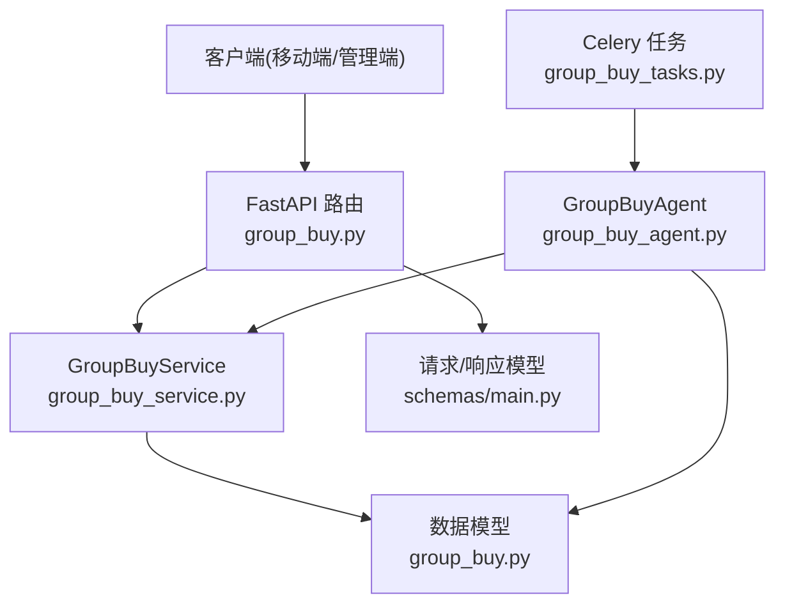
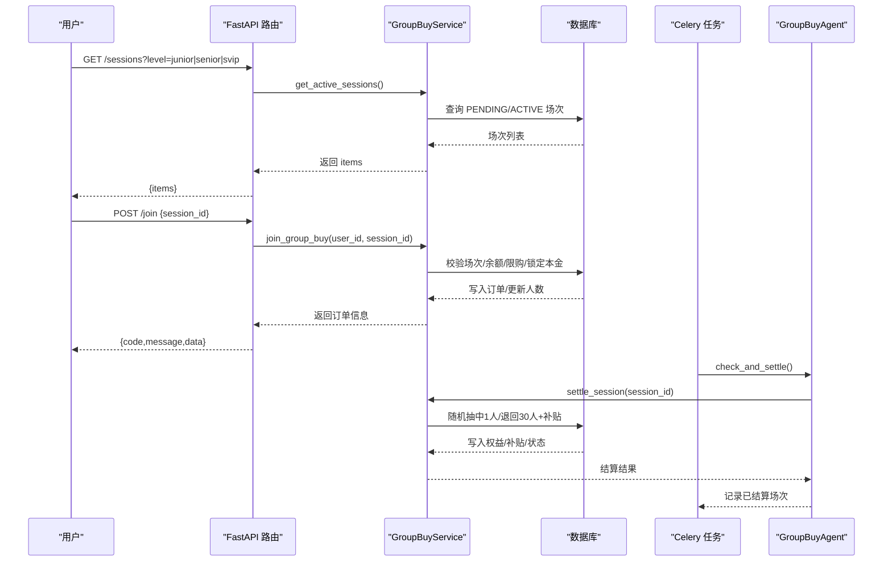
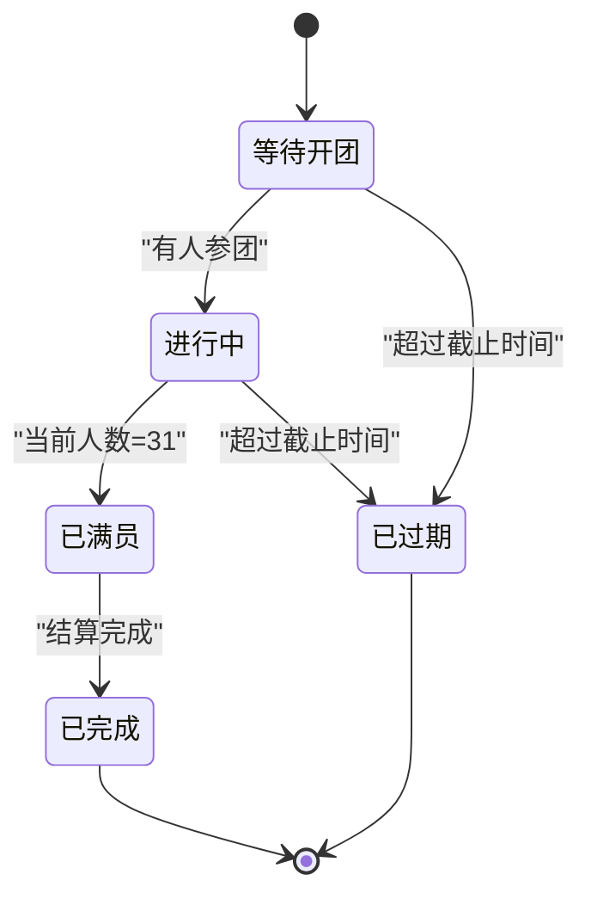
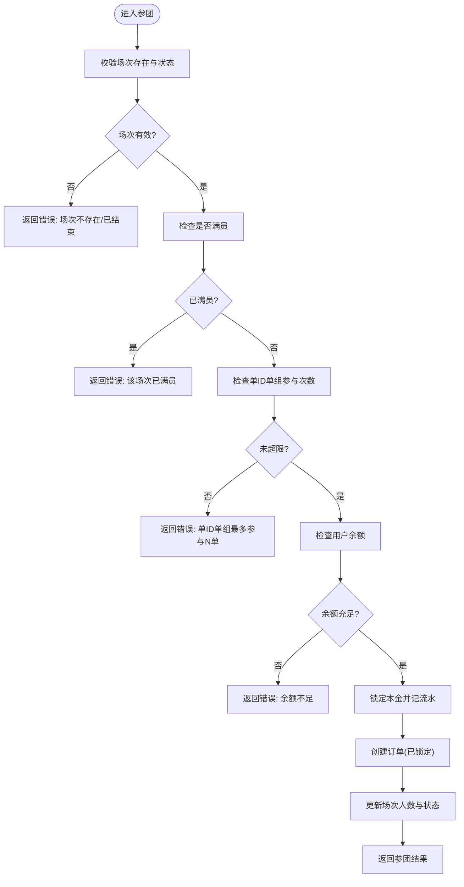
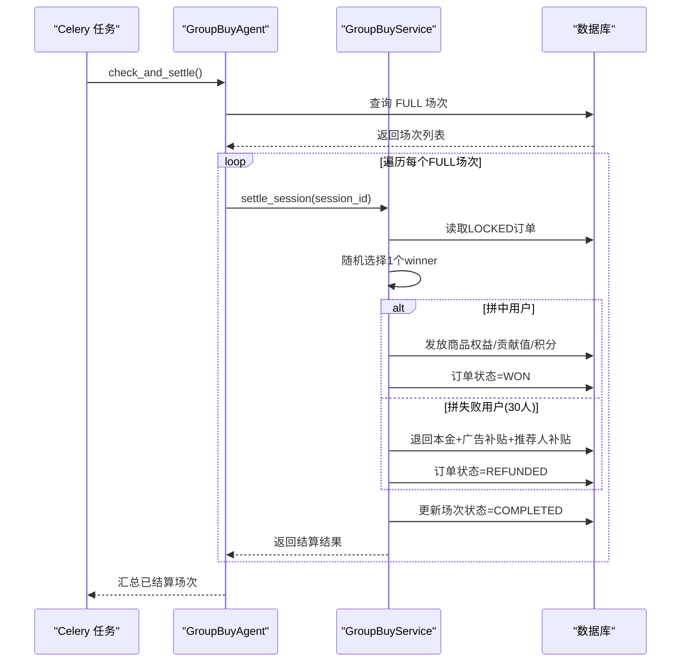
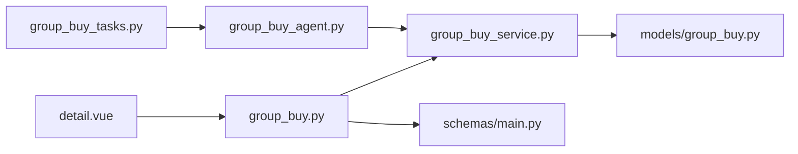

# 拼团接口

<cite>
**本文引用的文件列表**
- [backend/app/api/v1/group_buy.py](file://backend/app/api/v1/group_buy.py)
- [backend/app/services/group_buy_service.py](file://backend/app/services/group_buy_service.py)
- [backend/app/models/group_buy.py](file://backend/app/models/group_buy.py)
- [backend/app/schemas/main.py](file://backend/app/schemas/main.py)
- [backend/app/agents/group_buy_agent.py](file://backend/app/agents/group_buy_agent.py)
- [backend/app/tasks/group_buy_tasks.py](file://backend/app/tasks/group_buy_tasks.py)
- [frontend/mobile-app/pages/group-buy/detail.vue](file://frontend/mobile-app/pages/group-buy/detail.vue)
</cite>

## 目录
1. [简介](#简介)
2. [项目结构](#项目结构)
3. [核心组件](#核心组件)
4. [架构总览](#架构总览)
5. [详细组件分析](#详细组件分析)
6. [依赖关系分析](#依赖关系分析)
7. [性能与并发考虑](#性能与并发考虑)
8. [故障排查指南](#故障排查指南)
9. [结论](#结论)
10. [附录：API 规范与示例](#附录api-规范与示例)

## 简介
本文件为 AIxingmu 项目的“拼团业务”接口文档，覆盖拼团场次管理、参团流程、结果查询等所有拼团相关 API。重点说明开团、参团、查看拼团详情、查询参与历史等核心业务流程的接口规范；阐述拼团状态机、人数限制、时间控制等业务规则在接口层面的体现；提供全流程的请求响应示例（含成功与失败场景）；并解释拼团结果的判定逻辑与结算机制。

## 项目结构
后端采用 FastAPI + SQLAlchemy 异步 ORM，服务层封装业务逻辑，定时任务通过 Celery 驱动 Agent 调度，模型定义数据表结构与枚举状态。前端移动端页面展示拼团详情与参团入口，调用后端接口完成交互。

图表来源
- [backend/app/api/v1/group_buy.py:1-65](file://backend/app/api/v1/group_buy.py#L1-L65)
- [backend/app/services/group_buy_service.py:1-348](file://backend/app/services/group_buy_service.py#L1-L348)
- [backend/app/models/group_buy.py:1-158](file://backend/app/models/group_buy.py#L1-L158)
- [backend/app/schemas/main.py:1-176](file://backend/app/schemas/main.py#L1-L176)
- [backend/app/agents/group_buy_agent.py:1-67](file://backend/app/agents/group_buy_agent.py#L1-L67)
- [backend/app/tasks/group_buy_tasks.py:1-54](file://backend/app/tasks/group_buy_tasks.py#L1-L54)

章节来源
- [backend/app/api/v1/group_buy.py:1-65](file://backend/app/api/v1/group_buy.py#L1-L65)
- [backend/app/services/group_buy_service.py:1-348](file://backend/app/services/group_buy_service.py#L1-L348)
- [backend/app/models/group_buy.py:1-158](file://backend/app/models/group_buy.py#L1-L158)
- [backend/app/schemas/main.py:1-176](file://backend/app/schemas/main.py#L1-L176)
- [backend/app/agents/group_buy_agent.py:1-67](file://backend/app/agents/group_buy_agent.py#L1-L67)
- [backend/app/tasks/group_buy_tasks.py:1-54](file://backend/app/tasks/group_buy_tasks.py#L1-L54)

## 核心组件
- 路由层：暴露 RESTful 接口，负责参数校验、鉴权注入、异常映射。
- 服务层：实现拼团核心流程（创建场次、参团、结算、查询）。
- 模型层：定义场次、订单、统计等实体及状态枚举。
- 调度层：Celery 任务驱动 Agent 执行定时动作（开团、结算、过期处理）。
- 前端：移动端详情页展示进度、收益测算与参团按钮，调用接口完成操作。

章节来源
- [backend/app/api/v1/group_buy.py:1-65](file://backend/app/api/v1/group_buy.py#L1-L65)
- [backend/app/services/group_buy_service.py:1-348](file://backend/app/services/group_buy_service.py#L1-L348)
- [backend/app/models/group_buy.py:1-158](file://backend/app/models/group_buy.py#L1-L158)
- [backend/app/agents/group_buy_agent.py:1-67](file://backend/app/agents/group_buy_agent.py#L1-L67)
- [backend/app/tasks/group_buy_tasks.py:1-54](file://backend/app/tasks/group_buy_tasks.py#L1-L54)
- [frontend/mobile-app/pages/group-buy/detail.vue:1-202](file://frontend/mobile-app/pages/group-buy/detail.vue#L1-L202)

## 架构总览
拼团系统由“用户侧接口 + 后台调度”双通道组成：
- 用户侧：获取可参与场次、参团、查看我的订单、查看场次详情。
- 后台调度：每日定时创建固定场次；每小时检查已满场次并结算；夜间扫描过期场次。

图表来源
- [backend/app/api/v1/group_buy.py:15-49](file://backend/app/api/v1/group_buy.py#L15-L49)
- [backend/app/services/group_buy_service.py:92-181](file://backend/app/services/group_buy_service.py#L92-L181)
- [backend/app/services/group_buy_service.py:184-321](file://backend/app/services/group_buy_service.py#L184-L321)
- [backend/app/agents/group_buy_agent.py:31-46](file://backend/app/agents/group_buy_agent.py#L31-L46)
- [backend/app/tasks/group_buy_tasks.py:30-40](file://backend/app/tasks/group_buy_tasks.py#L30-L40)

## 详细组件分析

### 数据模型与状态机
- 拼团级别：初级团、高级团、SVIP团，对应不同箱数倍数与参团金额。
- 场次状态：等待开团、进行中、已满员、已完成、已取消、已过期。
- 订单状态：待确认、已锁定、拼中、拼失败、已退款、已取消。
- 人数与时间：每场默认31人，1人拼中、30人拼失败；每日10:00-22:00每小时一场。

图表来源
- [backend/app/models/group_buy.py:22-30](file://backend/app/models/group_buy.py#L22-L30)
- [backend/app/models/group_buy.py:42-86](file://backend/app/models/group_buy.py#L42-L86)
- [backend/app/services/group_buy_service.py:28-59](file://backend/app/services/group_buy_service.py#L28-L59)

章节来源
- [backend/app/models/group_buy.py:15-86](file://backend/app/models/group_buy.py#L15-L86)
- [backend/app/services/group_buy_service.py:28-59](file://backend/app/services/group_buy_service.py#L28-L59)

### 场次管理接口
- 获取可参与场次
  - 方法路径：GET /sessions
  - 查询参数：level（可选，junior/senior/svip）
  - 功能：返回状态为“等待开团/进行中”的场次列表，支持按级别过滤，按开始时间排序。
  - 返回：包含 items 数组，每项为场次对象。
- 获取场次详情
  - 方法路径：GET /sessions/{session_id}
  - 功能：根据 ID 获取单场详情，不存在则返回 404。
  - 返回：场次对象。

章节来源
- [backend/app/api/v1/group_buy.py:15-23](file://backend/app/api/v1/group_buy.py#L15-L23)
- [backend/app/api/v1/group_buy.py:52-64](file://backend/app/api/v1/group_buy.py#L52-L64)
- [backend/app/services/group_buy_service.py:324-333](file://backend/app/services/group_buy_service.py#L324-L333)

### 参团接口
- 参与拼团
  - 方法路径：POST /join
  - 请求体：JoinGroupBuyRequest，包含 session_id。
  - 业务规则：
    - 场次必须存在且状态为“等待开团/进行中”。
    - 场次未满员（当前人数 < 31）。
    - 单ID单组最多参与 N 单（N 由配置项决定）。
    - 用户余额充足，扣除参团本金并生成“锁定”流水。
    - 创建订单，状态为“已锁定”，更新场次人数；若满员则标记“已满员”。
  - 返回：包含 order_id、order_no、session_id、amount、remaining_balance、session_full。
  - 错误：
    - 400：场次不存在/已结束/已满员/单组超上限/余额不足。
    - 401：未登录或 token 无效（由鉴权中间件返回）。

图表来源
- [backend/app/api/v1/group_buy.py:26-37](file://backend/app/api/v1/group_buy.py#L26-L37)
- [backend/app/services/group_buy_service.py:92-181](file://backend/app/services/group_buy_service.py#L92-L181)

章节来源
- [backend/app/api/v1/group_buy.py:26-37](file://backend/app/api/v1/group_buy.py#L26-L37)
- [backend/app/services/group_buy_service.py:92-181](file://backend/app/services/group_buy_service.py#L92-L181)
- [backend/app/schemas/main.py:73-75](file://backend/app/schemas/main.py#L73-L75)

### 订单查询接口
- 获取我的拼团订单
  - 方法路径：GET /orders
  - 查询参数：page、size（分页）
  - 功能：按用户维度返回订单列表，按创建时间倒序。
  - 返回：total、page、size、items（订单对象集合）。

章节来源
- [backend/app/api/v1/group_buy.py:40-49](file://backend/app/api/v1/group_buy.py#L40-L49)
- [backend/app/services/group_buy_service.py:336-347](file://backend/app/services/group_buy_service.py#L336-L347)
- [backend/app/schemas/main.py:90-105](file://backend/app/schemas/main.py#L90-L105)

### 后台调度与结算
- 定时任务
  - 每日 9:50 创建当日固定场次（每小时1场，三大板块并行）。
  - 每小时检查已满场次并触发结算。
  - 每日 23:00 检查过期场次并标记为“已过期”。
- 结算逻辑
  - 条件：场次状态为“已满员”，订单数量等于总人数。
  - 随机抽取1人拼中，其余30人拼失败。
  - 拼中权益：商品权益10%、贡献值20%、积分20%（以配置为准），不退回本金。
  - 拼失败保障：本金全额退回，广告补贴0.7%，推荐人补贴0.1%。
  - 更新订单状态与字段，更新场次状态为“已完成”，记录结算时间。

图表来源
- [backend/app/tasks/group_buy_tasks.py:30-40](file://backend/app/tasks/group_buy_tasks.py#L30-L40)
- [backend/app/agents/group_buy_agent.py:31-46](file://backend/app/agents/group_buy_agent.py#L31-L46)
- [backend/app/services/group_buy_service.py:184-321](file://backend/app/services/group_buy_service.py#L184-L321)

章节来源
- [backend/app/tasks/group_buy_tasks.py:17-27](file://backend/app/tasks/group_buy_tasks.py#L17-L27)
- [backend/app/tasks/group_buy_tasks.py:30-40](file://backend/app/tasks/group_buy_tasks.py#L30-L40)
- [backend/app/tasks/group_buy_tasks.py:43-53](file://backend/app/tasks/group_buy_tasks.py#L43-L53)
- [backend/app/agents/group_buy_agent.py:25-61](file://backend/app/agents/group_buy_agent.py#L25-L61)
- [backend/app/services/group_buy_service.py:184-321](file://backend/app/services/group_buy_service.py#L184-L321)

### 前端交互要点
- 拼团详情页展示：
  - 场次基本信息（级别、价格、箱数倍数）。
  - 实时进度条（当前人数/总人数）。
  - 规则说明与收益测算（拼中权益、失败补贴）。
  - 底部操作栏显示参团金额与参团按钮。
- 参团流程：
  - 点击参团后调用 POST /join，成功后禁用按钮并刷新场次数据。
  - 失败时提示错误信息。

章节来源
- [frontend/mobile-app/pages/group-buy/detail.vue:1-202](file://frontend/mobile-app/pages/group-buy/detail.vue#L1-L202)

## 依赖关系分析
- 路由层依赖服务层与鉴权工具，服务层依赖模型与配置。
- 调度层通过 Agent 调用服务层，任务层通过 Celery 驱动。
- 前端通过 API 模块间接调用后端路由。

图表来源
- [backend/app/api/v1/group_buy.py:1-65](file://backend/app/api/v1/group_buy.py#L1-L65)
- [backend/app/services/group_buy_service.py:1-348](file://backend/app/services/group_buy_service.py#L1-L348)
- [backend/app/models/group_buy.py:1-158](file://backend/app/models/group_buy.py#L1-L158)
- [backend/app/schemas/main.py:1-176](file://backend/app/schemas/main.py#L1-L176)
- [backend/app/agents/group_buy_agent.py:1-67](file://backend/app/agents/group_buy_agent.py#L1-L67)
- [backend/app/tasks/group_buy_tasks.py:1-54](file://backend/app/tasks/group_buy_tasks.py#L1-L54)
- [frontend/mobile-app/pages/group-buy/detail.vue:1-202](file://frontend/mobile-app/pages/group-buy/detail.vue#L1-L202)

章节来源
- [backend/app/api/v1/group_buy.py:1-65](file://backend/app/api/v1/group_buy.py#L1-L65)
- [backend/app/services/group_buy_service.py:1-348](file://backend/app/services/group_buy_service.py#L1-L348)
- [backend/app/models/group_buy.py:1-158](file://backend/app/models/group_buy.py#L1-L158)
- [backend/app/schemas/main.py:1-176](file://backend/app/schemas/main.py#L1-L176)
- [backend/app/agents/group_buy_agent.py:1-67](file://backend/app/agents/group_buy_agent.py#L1-L67)
- [backend/app/tasks/group_buy_tasks.py:1-54](file://backend/app/tasks/group_buy_tasks.py#L1-L54)
- [frontend/mobile-app/pages/group-buy/detail.vue:1-202](file://frontend/mobile-app/pages/group-buy/detail.vue#L1-L202)

## 性能与并发考虑
- 高并发参团：
  - 建议对“场次人数更新”和“订单插入”使用事务与行级锁，避免超卖。
  - 对“单ID单组参与次数”计数查询增加索引，减少热点冲突。
- 结算批处理：
  - 对 FULL 场次批量读取 LOCKED 订单，随机抽样前进行一致性校验（订单数=总人数）。
  - 权益与补贴发放尽量合并写库，减少往返。
- 定时任务：
  - 使用分布式锁防止多实例重复执行同一任务。
  - 对过期场次扫描采用增量策略（仅扫描临近截止时间的场次）。

[本节为通用指导，无需具体文件引用]

## 故障排查指南
- 常见错误码与原因：
  - 400：场次不存在/已结束/已满员/单组超上限/余额不足。
  - 404：场次详情不存在。
  - 401：未登录或 token 无效。
- 定位步骤：
  - 核对场次状态是否为 PENDING/ACTIVE。
  - 检查用户余额与参团金额是否匹配。
  - 确认单ID单组参与次数是否达到上限。
  - 查看订单状态流转是否正确（PENDING→LOCKED→WON/REFUNDED）。
  - 检查定时任务日志，确认 FULL 场次是否被正确结算。

章节来源
- [backend/app/api/v1/group_buy.py:26-37](file://backend/app/api/v1/group_buy.py#L26-L37)
- [backend/app/api/v1/group_buy.py:52-64](file://backend/app/api/v1/group_buy.py#L52-L64)
- [backend/app/services/group_buy_service.py:92-181](file://backend/app/services/group_buy_service.py#L92-L181)
- [backend/app/services/group_buy_service.py:184-321](file://backend/app/services/group_buy_service.py#L184-L321)

## 结论
本接口文档完整覆盖了拼团业务的开团、参团、结算与查询流程，明确了状态机、人数与时间约束以及权益与补贴分配规则。通过“用户侧接口 + 后台调度”的双通道设计，系统在可用性、一致性与可观测性方面具备良好基础。后续可在并发控制、幂等性与监控告警方面进一步增强。

[本节为总结性内容，无需具体文件引用]

## 附录：API 规范与示例

### 接口清单
- 获取可参与场次
  - 方法路径：GET /sessions
  - 查询参数：level（可选，junior/senior/svip）
  - 返回：{ items: [场次对象...] }
- 参与拼团
  - 方法路径：POST /join
  - 请求体：{ session_id: number }
  - 返回：{ code: 0, message: "参团成功", data: { order_id, order_no, session_id, amount, remaining_balance, session_full } }
- 获取我的拼团订单
  - 方法路径：GET /orders?page=1&size=20
  - 返回：{ total, page, size, items: [订单对象...] }
- 获取场次详情
  - 方法路径：GET /sessions/{session_id}
  - 返回：场次对象（不存在返回 404）

章节来源
- [backend/app/api/v1/group_buy.py:15-23](file://backend/app/api/v1/group_buy.py#L15-L23)
- [backend/app/api/v1/group_buy.py:26-37](file://backend/app/api/v1/group_buy.py#L26-L37)
- [backend/app/api/v1/group_buy.py:40-49](file://backend/app/api/v1/group_buy.py#L40-L49)
- [backend/app/api/v1/group_buy.py:52-64](file://backend/app/api/v1/group_buy.py#L52-L64)
- [backend/app/schemas/main.py:73-105](file://backend/app/schemas/main.py#L73-L105)

### 请求与响应示例（成功）
- 获取可参与场次
  - 请求：GET /sessions?level=junior
  - 响应：
    - {
      - "items": [
        - {
          - "id": 1,
          - "session_no": "GB2025010110Jxxxx",
          - "level": "junior",
          - "total_price": 288.0,
          - "total_players": 31,
          - "current_players": 12,
          - "status": "active",
          - "start_time": "2025-01-01T10:00:00Z",
          - "end_time": "2025-01-01T11:00:00Z"
        }
      ]
    }
- 参与拼团
  - 请求：POST /join
    - { "session_id": 1 }
  - 响应：
    - {
      - "code": 0,
      - "message": "参团成功",
      - "data": {
        - "order_id": 1001,
        - "order_no": "GO20250101101234abcd",
        - "session_id": 1,
        - "amount": 288.0,
        - "remaining_balance": 1000.0,
        - "session_full": false
      }
    }
- 获取我的拼团订单
  - 请求：GET /orders?page=1&size=20
  - 响应：
    - {
      - "total": 1,
      - "page": 1,
      - "size": 20,
      - "items": [
        - {
          - "id": 1001,
          - "order_no": "GO20250101101234abcd",
          - "session_id": 1,
          - "amount": 288.0,
          - "status": "locked",
          - "result": null,
          - "product_benefit": 0.0,
          - "contrib_benefit": 0.0,
          - "points_benefit": 0.0,
          - "ad_subsidy": 0.0,
          - "referral_subsidy": 0.0,
          - "created_at": "2025-01-01T10:12:34Z"
        }
      ]
    }
- 获取场次详情
  - 请求：GET /sessions/1
  - 响应：
    - {
      - "id": 1,
      - "session_no": "GB2025010110Jxxxx",
      - "level": "junior",
      - "total_price": 288.0,
      - "total_players": 31,
      - "current_players": 12,
      - "status": "active",
      - "start_time": "2025-01-01T10:00:00Z",
      - "end_time": "2025-01-01T11:00:00Z"
    }

章节来源
- [backend/app/api/v1/group_buy.py:15-23](file://backend/app/api/v1/group_buy.py#L15-L23)
- [backend/app/api/v1/group_buy.py:26-37](file://backend/app/api/v1/group_buy.py#L26-L37)
- [backend/app/api/v1/group_buy.py:40-49](file://backend/app/api/v1/group_buy.py#L40-L49)
- [backend/app/api/v1/group_buy.py:52-64](file://backend/app/api/v1/group_buy.py#L52-L64)
- [backend/app/schemas/main.py:73-105](file://backend/app/schemas/main.py#L73-L105)

### 请求与响应示例（失败）
- 场次不存在
  - 请求：GET /sessions/999
  - 响应：HTTP 404，detail="场次不存在"
- 场次已满员
  - 请求：POST /join { "session_id": 2 }
  - 响应：HTTP 400，detail="该场次已满员"
- 单ID单组超上限
  - 请求：POST /join { "session_id": 3 }
  - 响应：HTTP 400，detail="单ID单组最多参与N单"
- 余额不足
  - 请求：POST /join { "session_id": 4 }
  - 响应：HTTP 400，detail="余额不足, 请先充值"

章节来源
- [backend/app/api/v1/group_buy.py:26-37](file://backend/app/api/v1/group_buy.py#L26-L37)
- [backend/app/api/v1/group_buy.py:52-64](file://backend/app/api/v1/group_buy.py#L52-L64)
- [backend/app/services/group_buy_service.py:92-181](file://backend/app/services/group_buy_service.py#L92-L181)

### 拼团结果判定与结算机制
- 判定逻辑：
  - 当场次状态为“已满员”且订单数量等于总人数时，随机抽取1个订单作为拼中，其余为拼失败。
- 结算机制：
  - 拼中用户：
    - 商品权益 = 参团金额 × 10%
    - 贡献值权益 = 参团金额 × 20%
    - 积分权益 = 参团金额 × 20%
    - 本金不退回（用于购买啤酒）
  - 拼失败用户：
    - 本金全额退回
    - 广告补贴 = 参团金额 × 0.7%
    - 推荐人补贴 = 参团金额 × 0.1%
- 状态更新：
  - 拼中订单状态为“拼中”，拼失败订单状态为“已退款”。
  - 场次状态更新为“已完成”，记录结算时间。

章节来源
- [backend/app/services/group_buy_service.py:184-321](file://backend/app/services/group_buy_service.py#L184-L321)
- [backend/app/models/group_buy.py:32-40](file://backend/app/models/group_buy.py#L32-L40)
- [backend/app/models/group_buy.py:89-131](file://backend/app/models/group_buy.py#L89-L131)