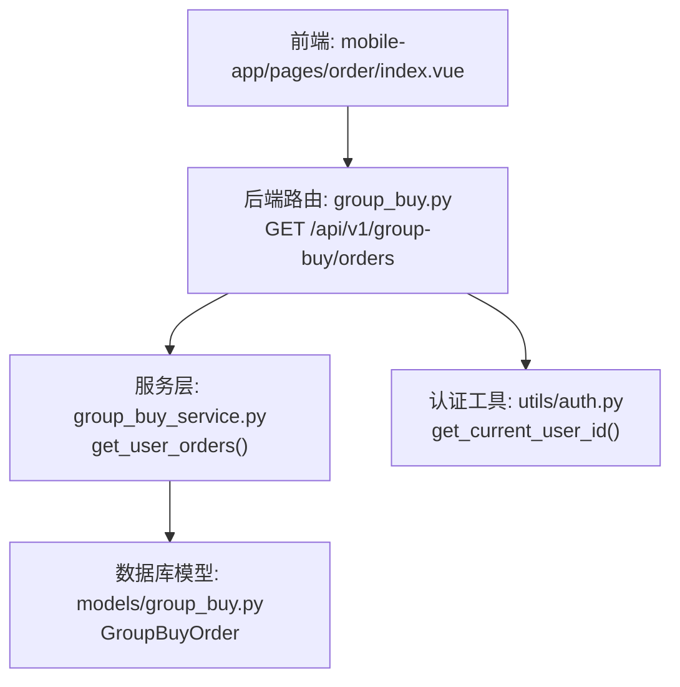
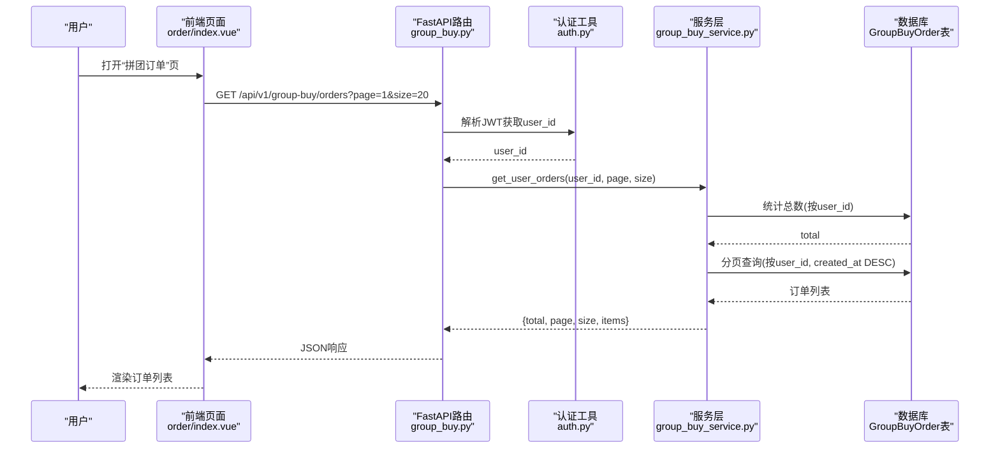
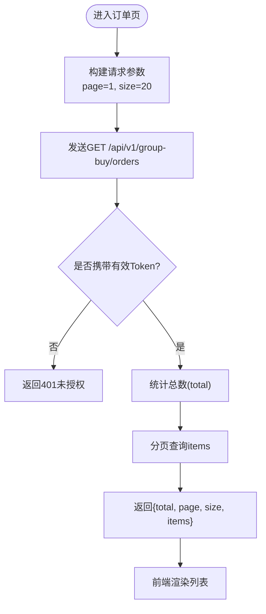
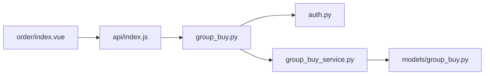

# 订单历史查询接口

<cite>
**本文引用的文件**
- [backend/app/api/v1/group_buy.py](file://backend/app/api/v1/group_buy.py)
- [backend/app/services/group_buy_service.py](file://backend/app/services/group_buy_service.py)
- [backend/app/models/group_buy.py](file://backend/app/models/group_buy.py)
- [backend/app/utils/auth.py](file://backend/app/utils/auth.py)
- [frontend/mobile-app/pages/order/index.vue](file://frontend/mobile-app/pages/order/index.vue)
- [frontend/mobile-app/api/index.js](file://frontend/mobile-app/api/index.js)
</cite>

## 目录
1. [简介](#简介)
2. [项目结构](#项目结构)
3. [核心组件](#核心组件)
4. [架构总览](#架构总览)
5. [详细组件分析](#详细组件分析)
6. [依赖关系分析](#依赖关系分析)
7. [性能考虑](#性能考虑)
8. [故障排查指南](#故障排查指南)
9. [结论](#结论)
10. [附录](#附录)

## 简介
本文件为AIxingmu项目中“拼团订单历史查询”接口的权威文档，聚焦于GET /api/v1/group-buy/orders端点的分页查询能力。内容涵盖：
- 请求参数与分页规则（page、size）
- 排序规则与查询条件
- 返回数据结构与关键字段说明（订单状态、参与时间、结果信息等）
- 用户权限控制（仅能查看本人订单）
- 完整调用示例（不同页面大小）
- 订单状态流转逻辑与查询优化策略

## 项目结构
该功能位于后端FastAPI路由层、服务层与数据模型层之间，前端通过移动端页面发起请求并渲染列表。

图表来源
- [backend/app/api/v1/group_buy.py:40-49](file://backend/app/api/v1/group_buy.py#L40-L49)
- [backend/app/services/group_buy_service.py:336-347](file://backend/app/services/group_buy_service.py#L336-L347)
- [backend/app/models/group_buy.py:89-131](file://backend/app/models/group_buy.py#L89-L131)
- [backend/app/utils/auth.py:39-49](file://backend/app/utils/auth.py#L39-L49)
- [frontend/mobile-app/pages/order/index.vue:104-117](file://frontend/mobile-app/pages/order/index.vue#L104-L117)
- [frontend/mobile-app/api/index.js:41](file://frontend/mobile-app/api/index.js#L41)

章节来源
- [backend/app/api/v1/group_buy.py:40-49](file://backend/app/api/v1/group_buy.py#L40-L49)
- [backend/app/services/group_buy_service.py:336-347](file://backend/app/services/group_buy_service.py#L336-L347)
- [backend/app/models/group_buy.py:89-131](file://backend/app/models/group_buy.py#L89-L131)
- [backend/app/utils/auth.py:39-49](file://backend/app/utils/auth.py#L39-L49)
- [frontend/mobile-app/pages/order/index.vue:104-117](file://frontend/mobile-app/pages/order/index.vue#L104-L117)
- [frontend/mobile-app/api/index.js:41](file://frontend/mobile-app/api/index.js#L41)

## 核心组件
- 路由层：定义GET /api/v1/group-buy/orders，接收page、size参数，并通过依赖注入获取当前用户ID与数据库会话。
- 服务层：实现分页查询逻辑，按创建时间倒序返回用户订单集合及总数。
- 数据模型：定义拼团订单表结构与索引，支撑高效查询。
- 认证工具：从JWT中解析当前用户ID，确保访问者身份有效。
- 前端：在订单页拉取并展示拼团订单列表，默认使用较大size一次性加载。

章节来源
- [backend/app/api/v1/group_buy.py:40-49](file://backend/app/api/v1/group_buy.py#L40-L49)
- [backend/app/services/group_buy_service.py:336-347](file://backend/app/services/group_buy_service.py#L336-L347)
- [backend/app/models/group_buy.py:89-131](file://backend/app/models/group_buy.py#L89-L131)
- [backend/app/utils/auth.py:39-49](file://backend/app/utils/auth.py#L39-L49)
- [frontend/mobile-app/pages/order/index.vue:104-117](file://frontend/mobile-app/pages/order/index.vue#L104-L117)
- [frontend/mobile-app/api/index.js:41](file://frontend/mobile-app/api/index.js#L41)

## 架构总览
以下时序图展示了从前端到后端的完整调用流程，包括鉴权、分页查询与响应返回。

图表来源
- [backend/app/api/v1/group_buy.py:40-49](file://backend/app/api/v1/group_buy.py#L40-L49)
- [backend/app/utils/auth.py:39-49](file://backend/app/utils/auth.py#L39-L49)
- [backend/app/services/group_buy_service.py:336-347](file://backend/app/services/group_buy_service.py#L336-L347)
- [frontend/mobile-app/pages/order/index.vue:104-117](file://frontend/mobile-app/pages/order/index.vue#L104-L117)
- [frontend/mobile-app/api/index.js:41](file://frontend/mobile-app/api/index.js#L41)

## 详细组件分析

### 接口定义与参数
- 端点：GET /api/v1/group-buy/orders
- 路径参数：无
- 查询参数：
  - page: 页码，整数，默认1
  - size: 每页条数，整数，默认20
- 认证要求：需要携带有效的Bearer Token，否则返回未授权错误
- 权限控制：仅允许用户查看自己的订单记录（基于JWT中的user_id过滤）

章节来源
- [backend/app/api/v1/group_buy.py:40-49](file://backend/app/api/v1/group_buy.py#L40-L49)
- [backend/app/utils/auth.py:39-49](file://backend/app/utils/auth.py#L39-L49)

### 排序规则与查询条件
- 排序：按订单创建时间created_at降序排列（最新在前）
- 查询条件：严格限定user_id为当前登录用户，避免越权访问
- 分页：使用offset与limit实现分页，offset=(page-1)*size，limit=size

章节来源
- [backend/app/services/group_buy_service.py:336-347](file://backend/app/services/group_buy_service.py#L336-L347)
- [backend/app/models/group_buy.py:89-131](file://backend/app/models/group_buy.py#L89-L131)

### 返回数据结构
响应体包含以下字段：
- total: 符合条件的订单总数
- page: 当前页码
- size: 每页条数
- items: 订单对象数组

每个订单对象包含的关键字段（来源于数据模型）：
- id: 订单主键
- order_no: 订单编号
- session_id: 所属场次ID
- amount: 参团金额
- status: 订单状态（见下节状态说明）
- result: 结果（won/lost或空）
- product_benefit: 商品权益
- contrib_benefit: 贡献值权益
- points_benefit: 积分权益
- ad_subsidy: 广告补贴
- referral_subsidy: 推荐人补贴
- created_at: 创建时间（参与时间）

章节来源
- [backend/app/services/group_buy_service.py:336-347](file://backend/app/services/group_buy_service.py#L336-L347)
- [backend/app/models/group_buy.py:89-131](file://backend/app/models/group_buy.py#L89-L131)

### 订单状态与结果
- 状态枚举（OrderStatus）：
  - pending: 待确认
  - locked: 已锁定（本金已扣）
  - won: 拼中
  - lost: 拼失败
  - refunded: 已退款（失败退回）
  - cancelled: 已取消
- 结果字段（result）：
  - won: 表示拼中
  - lost: 表示拼失败
  - 空字符串或未设置：表示尚未结算或仍在进行中

章节来源
- [backend/app/models/group_buy.py:32-40](file://backend/app/models/group_buy.py#L32-L40)

### 权限控制与安全
- 认证方式：HTTP Bearer Token（JWT）
- 用户隔离：所有查询均基于当前用户的user_id进行过滤，确保用户只能查看自己的订单
- 未认证处理：若Token无效或缺失，将返回401未授权错误

章节来源
- [backend/app/utils/auth.py:39-49](file://backend/app/utils/auth.py#L39-L49)
- [backend/app/api/v1/group_buy.py:40-49](file://backend/app/api/v1/group_buy.py#L40-L49)

### 前端调用示例
- 默认调用（page=1, size=20）：
  - 请求URL：/api/v1/group-buy/orders?page=1&size=20
  - 头部需包含Authorization: Bearer <token>
- 自定义页面大小（例如size=50）：
  - 请求URL：/api/v1/group-buy/orders?page=1&size=50
- 翻页示例（第2页，每页20条）：
  - 请求URL：/api/v1/group-buy/orders?page=2&size=20

章节来源
- [frontend/mobile-app/api/index.js:41](file://frontend/mobile-app/api/index.js#L41)
- [frontend/mobile-app/pages/order/index.vue:104-117](file://frontend/mobile-app/pages/order/index.vue#L104-L117)

### 分页查询流程图

图表来源
- [backend/app/api/v1/group_buy.py:40-49](file://backend/app/api/v1/group_buy.py#L40-L49)
- [backend/app/services/group_buy_service.py:336-347](file://backend/app/services/group_buy_service.py#L336-L347)
- [frontend/mobile-app/pages/order/index.vue:104-117](file://frontend/mobile-app/pages/order/index.vue#L104-L117)
- [frontend/mobile-app/api/index.js:41](file://frontend/mobile-app/api/index.js#L41)

## 依赖关系分析
- 路由层依赖认证工具以获取当前用户ID，并依赖服务层执行业务逻辑
- 服务层依赖数据模型进行SQL查询，使用索引提升性能
- 前端依赖统一的请求封装函数，自动附加Token并处理401跳转

图表来源
- [backend/app/api/v1/group_buy.py:40-49](file://backend/app/api/v1/group_buy.py#L40-L49)
- [backend/app/utils/auth.py:39-49](file://backend/app/utils/auth.py#L39-L49)
- [backend/app/services/group_buy_service.py:336-347](file://backend/app/services/group_buy_service.py#L336-L347)
- [backend/app/models/group_buy.py:89-131](file://backend/app/models/group_buy.py#L89-L131)
- [frontend/mobile-app/pages/order/index.vue:104-117](file://frontend/mobile-app/pages/order/index.vue#L104-L117)
- [frontend/mobile-app/api/index.js:41](file://frontend/mobile-app/api/index.js#L41)

## 性能考虑
- 索引优化：
  - 订单表对user_id建立索引，加速按用户筛选
  - 订单表对status建立索引，便于后续按状态扩展查询
  - 订单表对user_id+session_id建立联合索引，支持更复杂的组合查询
- 排序优化：
  - 按created_at倒序排序，建议在created_at上建立索引以提升分页性能
- 分页策略：
  - 使用offset+limit实现分页，适合中小规模数据；当数据量极大时，可考虑游标分页（基于id或时间戳）
- 前端加载策略：
  - 移动端默认一次加载较多条目（如size=50），可减少网络往返，但需注意首屏渲染压力

章节来源
- [backend/app/models/group_buy.py:128-131](file://backend/app/models/group_buy.py#L128-L131)
- [backend/app/services/group_buy_service.py:336-347](file://backend/app/services/group_buy_service.py#L336-L347)
- [frontend/mobile-app/pages/order/index.vue:104-117](file://frontend/mobile-app/pages/order/index.vue#L104-L117)

## 故障排查指南
- 401未授权：
  - 检查请求头是否包含正确的Authorization: Bearer <token>
  - 确认Token未过期且有效
- 空列表：
  - 确认当前用户是否存在订单记录
  - 检查page与size参数是否正确
- 数据不一致：
  - 核对订单状态与结果字段是否符合业务预期
  - 关注结算流程是否已完成（result为空可能表示尚未结算）

章节来源
- [backend/app/utils/auth.py:39-49](file://backend/app/utils/auth.py#L39-L49)
- [backend/app/services/group_buy_service.py:336-347](file://backend/app/services/group_buy_service.py#L336-L347)
- [backend/app/models/group_buy.py:32-40](file://backend/app/models/group_buy.py#L32-L40)

## 结论
GET /api/v1/group-buy/orders提供了安全、高效的拼团订单历史分页查询能力。通过JWT鉴权与严格的user_id过滤，确保用户仅能访问自身订单；结合合理的索引与排序策略，满足日常查询性能需求。前端采用灵活的分页参数配置，适配不同场景的展示需求。

## 附录

### 状态流转与结算逻辑概览
- 参团阶段：订单状态由pending转为locked（本金锁定）
- 满员结算：随机抽取1人拼中（状态变为won，result=“won”），其余30人拼失败（状态变为refunded，result=“lost”）
- 权益发放：拼中用户获得商品权益、贡献值与积分；拼失败用户获得本金退回与补贴

章节来源
- [backend/app/services/group_buy_service.py:183-321](file://backend/app/services/group_buy_service.py#L183-L321)
- [backend/app/models/group_buy.py:32-40](file://backend/app/models/group_buy.py#L32-L40)