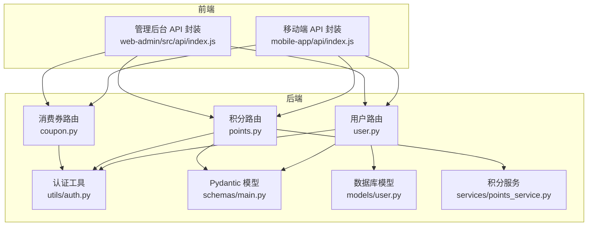
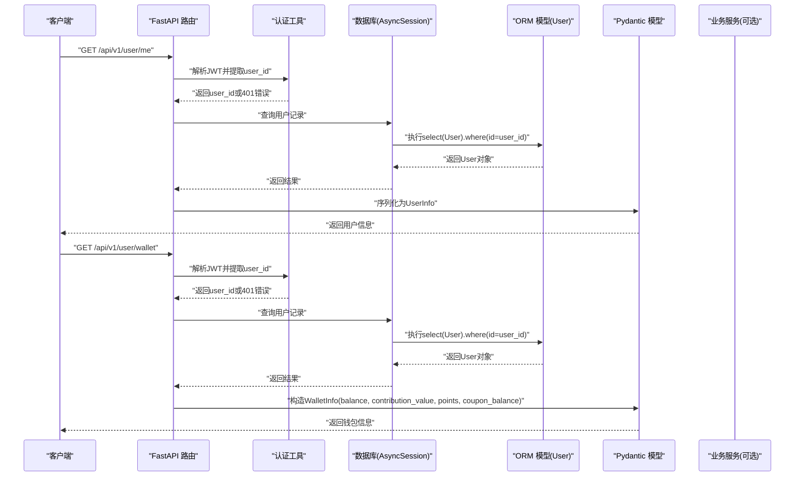
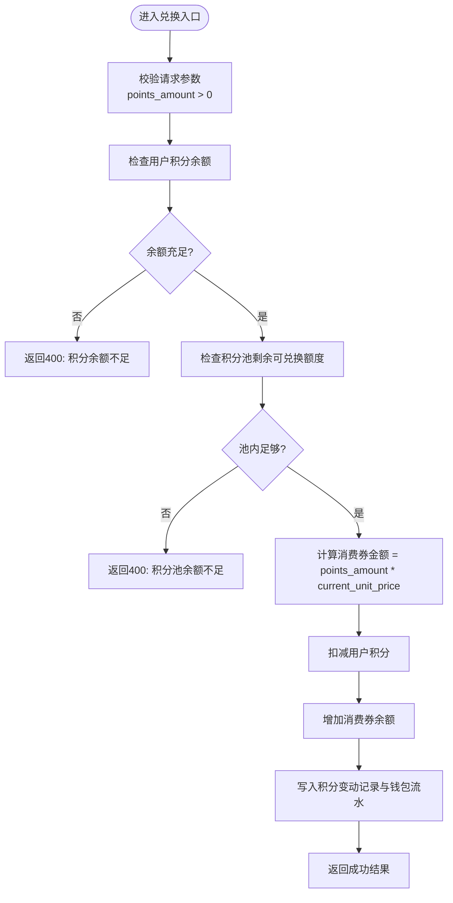
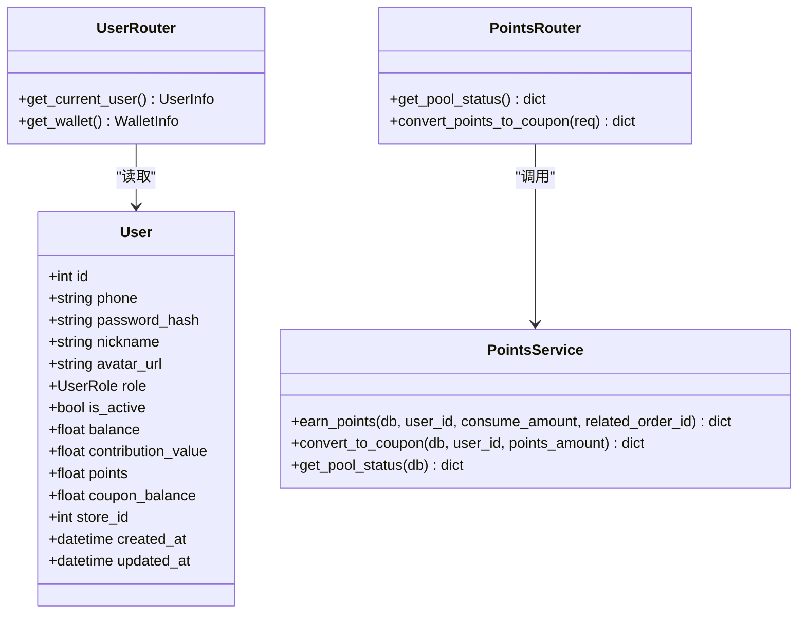

# 用户管理接口

<cite>
**本文引用的文件**   
- [backend/app/api/v1/user.py](file://backend/app/api/v1/user.py)
- [backend/app/models/user.py](file://backend/app/models/user.py)
- [backend/app/schemas/main.py](file://backend/app/schemas/main.py)
- [backend/app/utils/auth.py](file://backend/app/utils/auth.py)
- [backend/app/api/v1/points.py](file://backend/app/api/v1/points.py)
- [backend/app/services/points_service.py](file://backend/app/services/points_service.py)
- [backend/app/api/v1/coupon.py](file://backend/app/api/v1/coupon.py)
- [frontend/mobile-app/api/index.js](file://frontend/mobile-app/api/index.js)
- [frontend/web-admin/src/api/index.js](file://frontend/web-admin/src/api/index.js)
</cite>

## 目录
1. [简介](#简介)
2. [项目结构](#项目结构)
3. [核心组件](#核心组件)
4. [架构总览](#架构总览)
5. [详细组件分析](#详细组件分析)
6. [依赖分析](#依赖分析)
7. [性能考虑](#性能考虑)
8. [故障排查指南](#故障排查指南)
9. [结论](#结论)
10. [附录](#附录)

## 简介
本文件为 AIxingmu 项目的“用户管理接口”文档，聚焦以下能力：
- 用户信息获取与展示
- 钱包余额查询（余额、贡献值、积分、消费券）
- 角色权限控制机制说明
- 请求参数校验与数据格式规范
- 用户状态管理与个人信息修改的接口约定
- 钱包操作相关接口（含积分兑换消费券）
- 用户数据的 CRUD 与批量操作方法建议（基于现有模型与通用模式）

注意：当前仓库中已实现的与用户相关的接口主要包含“获取当前用户信息”和“获取钱包余额”，以及“积分池状态查询”和“积分兑换消费券”。其他如“更新个人资料”“批量操作”等在本仓库未直接实现，本节提供接口契约建议与最佳实践。

## 项目结构
后端采用 FastAPI + SQLAlchemy 异步 ORM，按功能域划分 API 路由与 Service 层；前端移动端与管理后台通过 HTTP 调用后端 /api/v1 前缀的接口。

图表来源
- [backend/app/api/v1/user.py:1-37](file://backend/app/api/v1/user.py#L1-L37)
- [backend/app/api/v1/points.py:1-31](file://backend/app/api/v1/points.py#L1-L31)
- [backend/app/api/v1/coupon.py:1-20](file://backend/app/api/v1/coupon.py#L1-L20)
- [backend/app/utils/auth.py:1-50](file://backend/app/utils/auth.py#L1-L50)
- [backend/app/schemas/main.py:1-176](file://backend/app/schemas/main.py#L1-L176)
- [backend/app/models/user.py:1-93](file://backend/app/models/user.py#L1-L93)
- [backend/app/services/points_service.py:1-180](file://backend/app/services/points_service.py#L1-L180)
- [frontend/mobile-app/api/index.js:40-64](file://frontend/mobile-app/api/index.js#L40-L64)
- [frontend/web-admin/src/api/index.js:1-55](file://frontend/web-admin/src/api/index.js#L1-L55)

章节来源
- [backend/app/api/v1/user.py:1-37](file://backend/app/api/v1/user.py#L1-L37)
- [backend/app/api/v1/points.py:1-31](file://backend/app/api/v1/points.py#L1-L31)
- [backend/app/api/v1/coupon.py:1-20](file://backend/app/api/v1/coupon.py#L1-L20)
- [backend/app/utils/auth.py:1-50](file://backend/app/utils/auth.py#L1-L50)
- [backend/app/schemas/main.py:1-176](file://backend/app/schemas/main.py#L1-L176)
- [backend/app/models/user.py:1-93](file://backend/app/models/user.py#L1-L93)
- [backend/app/services/points_service.py:1-180](file://backend/app/services/points_service.py#L1-L180)
- [frontend/mobile-app/api/index.js:40-64](file://frontend/mobile-app/api/index.js#L40-L64)
- [frontend/web-admin/src/api/index.js:1-55](file://frontend/web-admin/src/api/index.js#L1-L55)

## 核心组件
- 用户路由：提供“获取当前用户信息”“获取钱包余额”两个只读接口，均要求携带有效 JWT。
- 认证工具：负责 JWT 签发、解码与提取当前用户 ID，失败时返回 401。
- Pydantic 模型：定义 UserInfo、WalletInfo、PointsConvertRequest 等请求/响应结构。
- 数据库模型：User 表字段涵盖身份、角色、推荐关系、四大资产（余额、贡献值、积分、消费券）、代理/门店关联等。
- 积分服务：提供积分池状态查询与积分兑换消费券的业务逻辑，并记录流水。
- 消费券路由：提供“我的消费券列表”查询。

章节来源
- [backend/app/api/v1/user.py:1-37](file://backend/app/api/v1/user.py#L1-L37)
- [backend/app/utils/auth.py:1-50](file://backend/app/utils/auth.py#L1-L50)
- [backend/app/schemas/main.py:1-176](file://backend/app/schemas/main.py#L1-L176)
- [backend/app/models/user.py:1-93](file://backend/app/models/user.py#L1-L93)
- [backend/app/services/points_service.py:1-180](file://backend/app/services/points_service.py#L1-L180)
- [backend/app/api/v1/coupon.py:1-20](file://backend/app/api/v1/coupon.py#L1-L20)

## 架构总览
下图展示了用户与钱包相关接口的端到端调用流程，包括鉴权、数据读取与服务处理。

图表来源
- [backend/app/api/v1/user.py:14-36](file://backend/app/api/v1/user.py#L14-L36)
- [backend/app/utils/auth.py:39-50](file://backend/app/utils/auth.py#L39-L50)
- [backend/app/models/user.py:26-66](file://backend/app/models/user.py#L26-L66)
- [backend/app/schemas/main.py:26-46](file://backend/app/schemas/main.py#L26-L46)

## 详细组件分析

### 用户信息接口
- 路径与方法：GET /api/v1/user/me
- 鉴权：需要 Bearer Token（JWT），由认证工具解析出 user_id
- 请求参数：无
- 响应体：UserInfo（包含 id、phone、nickname、role、balance、contribution_value、points、coupon_balance、store_id、created_at）
- 错误码：
  - 401：Token 无效或缺失
  - 404：用户不存在（根据实现，若查询不到会抛出异常）
- 示例调用（参考前端封装）：
  - 移动端：[getUserInfo:47-47](file://frontend/mobile-app/api/index.js#L47-L47)
  - 管理后台：[getUserInfo:30-30](file://frontend/web-admin/src/api/index.js#L30-L30)

章节来源
- [backend/app/api/v1/user.py:14-21](file://backend/app/api/v1/user.py#L14-L21)
- [backend/app/schemas/main.py:26-39](file://backend/app/schemas/main.py#L26-L39)
- [backend/app/utils/auth.py:39-50](file://backend/app/utils/auth.py#L39-L50)
- [frontend/mobile-app/api/index.js:47-47](file://frontend/mobile-app/api/index.js#L47-L47)
- [frontend/web-admin/src/api/index.js:30-30](file://frontend/web-admin/src/api/index.js#L30-L30)

### 钱包余额接口
- 路径与方法：GET /api/v1/user/wallet
- 鉴权：需要 Bearer Token（JWT）
- 请求参数：无
- 响应体：WalletInfo（包含 balance、contribution_value、points、coupon_balance）
- 错误码：
  - 401：Token 无效或缺失
  - 404：用户不存在
- 示例调用（参考前端封装）：
  - 移动端：[getWallet:48-48](file://frontend/mobile-app/api/index.js#L48-L48)
  - 管理后台：[getWallet:31-31](file://frontend/web-admin/src/api/index.js#L31-L31)

章节来源
- [backend/app/api/v1/user.py:24-36](file://backend/app/api/v1/user.py#L24-L36)
- [backend/app/schemas/main.py:41-46](file://backend/app/schemas/main.py#L41-L46)
- [backend/app/utils/auth.py:39-50](file://backend/app/utils/auth.py#L39-L50)
- [frontend/mobile-app/api/index.js:48-48](file://frontend/mobile-app/api/index.js#L48-L48)
- [frontend/web-admin/src/api/index.js:31-31](file://frontend/web-admin/src/api/index.js#L31-L31)

### 积分池状态与积分兑换
- 积分池状态查询
  - 路径与方法：GET /api/v1/points/pool
  - 鉴权：无需鉴权（公开接口）
  - 响应体：包含 total_supply、total_issued、total_deflated、total_converted、current_unit_price、remaining
  - 示例调用：
    - 移动端：[getPointsPool:54-54](file://frontend/mobile-app/api/index.js#L54-L54)
    - 管理后台：[getPointsPool:38-38](file://frontend/web-admin/src/api/index.js#L38-L38)
- 积分兑换消费券
  - 路径与方法：POST /api/v1/points/convert
  - 鉴权：需要 Bearer Token（JWT）
  - 请求体：PointsConvertRequest（points_amount: float，必填）
  - 业务规则：
    - 检查用户积分余额是否足够
    - 检查积分池剩余可兑换额度
    - 按 current_unit_price 折算为消费券金额
    - 扣减用户积分、增加消费券余额，写入积分变动记录与钱包流水
  - 响应体：code=0 成功，data 包含 points_spent、coupon_gained、unit_price、remaining_points
  - 错误码：
    - 400：积分不足或积分池余额不足
  - 示例调用：
    - 移动端：[convertPoints:55-55](file://frontend/mobile-app/api/index.js#L55-L55)
    - 管理后台：[convertPoints:39-39](file://frontend/web-admin/src/api/index.js#L39-L39)

图表来源
- [backend/app/api/v1/points.py:19-31](file://backend/app/api/v1/points.py#L19-L31)
- [backend/app/services/points_service.py:94-166](file://backend/app/services/points_service.py#L94-L166)
- [backend/app/schemas/main.py:123-125](file://backend/app/schemas/main.py#L123-L125)

章节来源
- [backend/app/api/v1/points.py:1-31](file://backend/app/api/v1/points.py#L1-L31)
- [backend/app/services/points_service.py:1-180](file://backend/app/services/points_service.py#L1-L180)
- [backend/app/schemas/main.py:123-125](file://backend/app/schemas/main.py#L123-L125)
- [frontend/mobile-app/api/index.js:54-55](file://frontend/mobile-app/api/index.js#L54-L55)
- [frontend/web-admin/src/api/index.js:38-39](file://frontend/web-admin/src/api/index.js#L38-L39)

### 消费券列表接口
- 路径与方法：GET /api/v1/coupon/my
- 鉴权：需要 Bearer Token（JWT）
- 请求参数：无
- 响应体：{ items: [...] }，每项包含 id、source_type、amount、remaining、created_at
- 示例调用：
  - 移动端：[getMyCoupons:58-58](file://frontend/mobile-app/api/index.js#L58-L58)

章节来源
- [backend/app/api/v1/coupon.py:12-19](file://backend/app/api/v1/coupon.py#L12-L19)
- [backend/app/schemas/main.py:135-143](file://backend/app/schemas/main.py#L135-L143)
- [frontend/mobile-app/api/index.js:58-58](file://frontend/mobile-app/api/index.js#L58-L58)

### 角色与权限控制
- 用户角色枚举：consumer、referrer、store、referral_store、district_agent、city_agent、province_agent、admin
- 当前实现：
  - 所有受保护接口通过 get_current_user_id 从 JWT 中提取 user_id，未做细粒度角色校验
  - 如需按角色授权，可在路由层引入 Depends 进行角色检查或在中间件统一拦截
- 建议扩展：
  - 在路由装饰器后添加角色校验依赖，例如 admin 仅允许管理员访问
  - 对敏感操作（如余额调整、批量变更）增加二次确认与审计日志

章节来源
- [backend/app/models/user.py:14-24](file://backend/app/models/user.py#L14-L24)
- [backend/app/utils/auth.py:39-50](file://backend/app/utils/auth.py#L39-L50)

### 用户资料管理与状态更新（建议）
当前仓库未提供“更新个人资料”“激活/禁用用户”等写接口。以下为建议的接口契约与校验规则，便于后续实现：

- 更新个人资料
  - 路径与方法：PATCH /api/v1/user/profile
  - 鉴权：需要 Bearer Token
  - 请求体：
    - nickname: string，长度 1-50
    - avatar_url: string，URL 格式
  - 校验：nickname 非空且长度限制；avatar_url 符合 URL 正则
  - 响应体：返回更新后的 UserInfo
- 用户状态管理
  - 路径与方法：PUT /api/v1/user/status
  - 鉴权：需要 Bearer Token 且具备 admin 角色
  - 请求体：is_active: boolean
  - 响应体：返回更新后的用户状态
- 批量操作（建议）
  - 路径与方法：POST /api/v1/users/batch/update
  - 鉴权：需要 Bearer Token 且具备 admin 角色
  - 请求体：ids: int[]，fields: { nickname?: string, is_active?: boolean }
  - 校验：ids 非空且数量上限（如 1000）；fields 至少包含一个可更新字段
  - 响应体：{ updated_count: int, failed_ids: int[] }

说明：以上为接口设计建议，尚未在后端实现。

## 依赖分析
- 路由到服务/模型的依赖关系
  - user.py 依赖 auth.get_current_user_id、database.get_db、models.user.User、schemas.main.UserInfo/WalletInfo
  - points.py 依赖 auth.get_current_user_id、schemas.main.PointsConvertRequest、services.points_service.PointsService
  - coupon.py 依赖 auth.get_current_user_id、services.coupon_service.CouponService
- 外部依赖
  - JWT 库 jose、密码哈希 passlib
  - FastAPI 安全依赖 HTTPBearer
  - SQLAlchemy 异步会话

图表来源
- [backend/app/models/user.py:26-66](file://backend/app/models/user.py#L26-L66)
- [backend/app/services/points_service.py:15-180](file://backend/app/services/points_service.py#L15-L180)
- [backend/app/api/v1/user.py:14-36](file://backend/app/api/v1/user.py#L14-L36)
- [backend/app/api/v1/points.py:13-31](file://backend/app/api/v1/points.py#L13-L31)

章节来源
- [backend/app/api/v1/user.py:1-37](file://backend/app/api/v1/user.py#L1-L37)
- [backend/app/api/v1/points.py:1-31](file://backend/app/api/v1/points.py#L1-L31)
- [backend/app/services/points_service.py:1-180](file://backend/app/services/points_service.py#L1-L180)
- [backend/app/models/user.py:1-93](file://backend/app/models/user.py#L1-L93)

## 性能考虑
- 数据库查询
  - 用户信息查询使用主键索引，性能良好
  - 建议在高频查询场景下增加缓存层（如 Redis）以减轻数据库压力
- 事务与并发
  - 积分兑换涉及多表写入，需保证事务一致性；当前实现使用 flush 提交，建议在生产环境开启显式事务边界与重试策略
- 限流与幂等
  - 对兑换类接口建议增加幂等键（如订单号或时间戳+用户ID）防止重复提交
  - 结合网关层对用户态接口进行速率限制

## 故障排查指南
- 401 未认证
  - 现象：调用 /user/me 或 /user/wallet 返回 401
  - 原因：缺少 Authorization: Bearer <token> 或 token 过期/非法
  - 处理：检查前端是否在请求头附加 token；确认登录流程正确生成并保存 token
- 400 业务错误
  - 现象：积分兑换返回 400
  - 原因：积分余额不足或积分池余额不足
  - 处理：提示用户减少兑换数量或等待积分池扩容
- 404 资源不存在
  - 现象：用户信息查询返回 404
  - 原因：数据库中不存在该用户
  - 处理：检查用户注册流程与 token 中的 user_id 是否正确

章节来源
- [backend/app/utils/auth.py:39-50](file://backend/app/utils/auth.py#L39-L50)
- [backend/app/api/v1/points.py:19-31](file://backend/app/api/v1/points.py#L19-L31)
- [backend/app/services/points_service.py:94-166](file://backend/app/services/points_service.py#L94-L166)

## 结论
- 已实现接口：用户信息获取、钱包余额查询、积分池状态查询、积分兑换消费券、我的消费券列表
- 鉴权机制：基于 JWT 的 Bearer Token，统一通过 get_current_user_id 提取用户标识
- 可扩展方向：完善用户资料更新、状态管理、批量操作与细粒度角色权限控制
- 生产建议：引入缓存、事务边界、幂等与限流策略，提升稳定性与性能

## 附录

### 接口清单与示例（基于前端封装）
- 用户信息
  - GET /api/v1/user/me
  - 移动端调用：[getUserInfo:47-47](file://frontend/mobile-app/api/index.js#L47-L47)
  - 管理后台调用：[getUserInfo:30-30](file://frontend/web-admin/src/api/index.js#L30-L30)
- 钱包余额
  - GET /api/v1/user/wallet
  - 移动端调用：[getWallet:48-48](file://frontend/mobile-app/api/index.js#L48-L48)
  - 管理后台调用：[getWallet:31-31](file://frontend/web-admin/src/api/index.js#L31-L31)
- 积分池状态
  - GET /api/v1/points/pool
  - 移动端调用：[getPointsPool:54-54](file://frontend/mobile-app/api/index.js#L54-L54)
  - 管理后台调用：[getPointsPool:38-38](file://frontend/web-admin/src/api/index.js#L38-L38)
- 积分兑换消费券
  - POST /api/v1/points/convert
  - 请求体：{ points_amount: number }
  - 移动端调用：[convertPoints:55-55](file://frontend/mobile-app/api/index.js#L55-L55)
  - 管理后台调用：[convertPoints:39-39](file://frontend/web-admin/src/api/index.js#L39-L39)
- 我的消费券
  - GET /api/v1/coupon/my
  - 移动端调用：[getMyCoupons:58-58](file://frontend/mobile-app/api/index.js#L58-L58)

章节来源
- [frontend/mobile-app/api/index.js:47-58](file://frontend/mobile-app/api/index.js#L47-L58)
- [frontend/web-admin/src/api/index.js:30-39](file://frontend/web-admin/src/api/index.js#L30-L39)