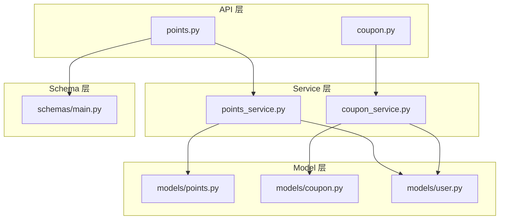
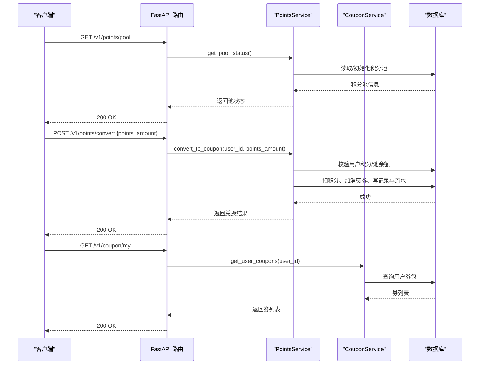
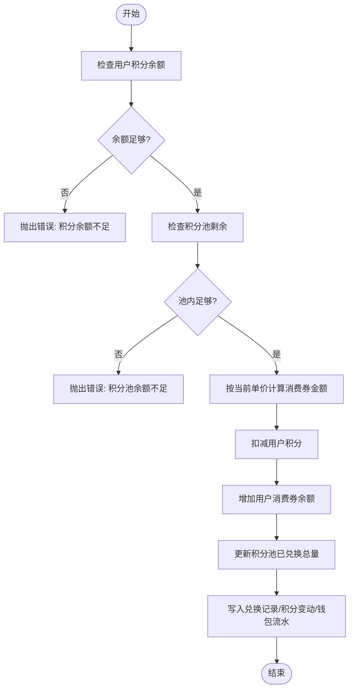
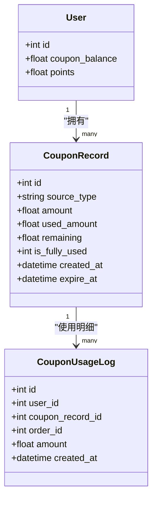
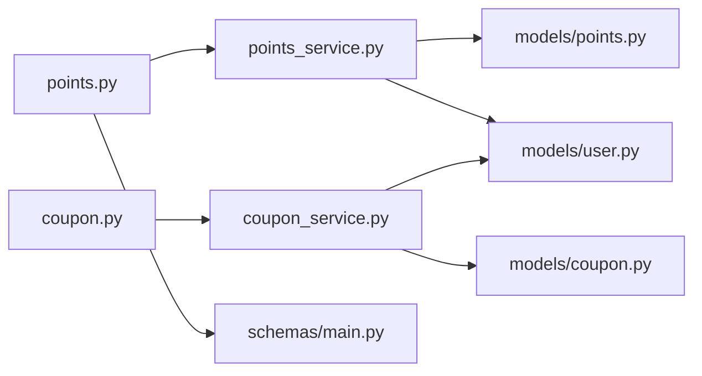

# 积分与消费券接口

<cite>
**本文引用的文件列表**   
- [backend/app/api/v1/points.py](file://backend/app/api/v1/points.py)
- [backend/app/api/v1/coupon.py](file://backend/app/api/v1/coupon.py)
- [backend/app/services/points_service.py](file://backend/app/services/points_service.py)
- [backend/app/services/coupon_service.py](file://backend/app/services/coupon_service.py)
- [backend/app/models/points.py](file://backend/app/models/points.py)
- [backend/app/models/coupon.py](file://backend/app/models/coupon.py)
- [backend/app/models/user.py](file://backend/app/models/user.py)
- [backend/app/schemas/main.py](file://backend/app/schemas/main.py)
</cite>

## 目录
1. [简介](#简介)
2. [项目结构](#项目结构)
3. [核心组件](#核心组件)
4. [架构总览](#架构总览)
5. [详细组件分析](#详细组件分析)
6. [依赖关系分析](#依赖关系分析)
7. [性能考虑](#性能考虑)
8. [故障排查指南](#故障排查指南)
9. [结论](#结论)
10. [附录：API 定义与调用示例](#附录api-定义与调用示例)

## 简介
本文件为 AIxingmu 项目的“积分系统与消费券”模块的接口文档，覆盖以下能力：
- 积分池管理：查询全局积分池状态、动态单价计算逻辑说明
- 积分获取与消耗：消费获得积分（含利润值与通缩机制）、积分兑换消费券
- 消费券发放与使用：用户券包查询、按先进先出规则抵扣订单
- 数据模型与流水：积分变动记录、兑换记录、消费券明细及使用日志
- 与经济系统集成：与订单、拼团、贡献值等系统的联动点说明

注意：当前代码未实现“积分等级制度”，也未在模型中体现“消费券有效期”。本文仅基于现有代码进行说明。

## 项目结构
后端采用 FastAPI + SQLAlchemy 异步模式，分层清晰：
- API 层：路由定义与参数校验
- Service 层：业务逻辑与事务边界
- Model 层：数据库表结构与关系
- Schema 层：请求/响应 Pydantic 模型

图表来源
- [backend/app/api/v1/points.py:1-31](file://backend/app/api/v1/points.py#L1-L31)
- [backend/app/api/v1/coupon.py:1-20](file://backend/app/api/v1/coupon.py#L1-L20)
- [backend/app/services/points_service.py:1-180](file://backend/app/services/points_service.py#L1-L180)
- [backend/app/services/coupon_service.py:1-86](file://backend/app/services/coupon_service.py#L1-L86)
- [backend/app/models/points.py:1-76](file://backend/app/models/points.py#L1-L76)
- [backend/app/models/coupon.py:1-55](file://backend/app/models/coupon.py#L1-L55)
- [backend/app/models/user.py:1-93](file://backend/app/models/user.py#L1-L93)
- [backend/app/schemas/main.py:1-176](file://backend/app/schemas/main.py#L1-L176)

章节来源
- [backend/app/api/v1/points.py:1-31](file://backend/app/api/v1/points.py#L1-L31)
- [backend/app/api/v1/coupon.py:1-20](file://backend/app/api/v1/coupon.py#L1-L20)
- [backend/app/services/points_service.py:1-180](file://backend/app/services/points_service.py#L1-L180)
- [backend/app/services/coupon_service.py:1-86](file://backend/app/services/coupon_service.py#L1-L86)
- [backend/app/models/points.py:1-76](file://backend/app/models/points.py#L1-L76)
- [backend/app/models/coupon.py:1-55](file://backend/app/models/coupon.py#L1-L55)
- [backend/app/models/user.py:1-93](file://backend/app/models/user.py#L1-L93)
- [backend/app/schemas/main.py:1-176](file://backend/app/schemas/main.py#L1-L176)

## 核心组件
- 积分服务 PointsService：提供积分池状态查询、消费获积分（含利润值与通缩）、积分兑换消费券
- 消费券服务 CouponService：提供按先进先出原则使用消费券、查询用户券包
- 数据模型：
  - 积分池与记录：PointsPool、PointsRecord、PointsConvertRecord
  - 消费券与使用明细：CouponRecord、CouponUsageLog
  - 用户钱包：User.coupon_balance、User.points、UserWalletLog

章节来源
- [backend/app/services/points_service.py:1-180](file://backend/app/services/points_service.py#L1-L180)
- [backend/app/services/coupon_service.py:1-86](file://backend/app/services/coupon_service.py#L1-L86)
- [backend/app/models/points.py:1-76](file://backend/app/models/points.py#L1-L76)
- [backend/app/models/coupon.py:1-55](file://backend/app/models/coupon.py#L1-L55)
- [backend/app/models/user.py:1-93](file://backend/app/models/user.py#L1-L93)

## 架构总览
积分与消费券的核心流程如下：
- 消费获积分：根据消费金额按比例生成利润值积分并触发通缩，更新积分池单价与用户余额，写入流水
- 积分兑换消费券：按当前单价折算为用户消费券余额，写入兑换记录与流水
- 使用消费券：按创建时间顺序（先进先出）扣减各券剩余可用额度，记录使用明细与流水

图表来源
- [backend/app/api/v1/points.py:13-31](file://backend/app/api/v1/points.py#L13-L31)
- [backend/app/api/v1/coupon.py:12-20](file://backend/app/api/v1/coupon.py#L12-L20)
- [backend/app/services/points_service.py:168-180](file://backend/app/services/points_service.py#L168-L180)
- [backend/app/services/points_service.py:94-166](file://backend/app/services/points_service.py#L94-L166)
- [backend/app/services/coupon_service.py:77-86](file://backend/app/services/coupon_service.py#L77-L86)

## 详细组件分析

### 积分池与积分获取/消耗
- 积分池单例：维护总发行量、已发放、已通缩、已兑换、当前单价等指标
- 消费获积分：
  - 新增利润值积分 = 消费金额 × 利润比例
  - 通缩积分 = 利润值积分 × 通缩比例
  - 净新增积分 = 利润值积分 − 通缩积分
  - 新单价 = 累计总金额 / 累计通缩数量（当累计通缩 > 0）
- 积分兑换消费券：
  - 校验用户积分余额与积分池剩余
  - 按当前单价折算为消费券金额
  - 扣减用户积分、增加用户消费券余额
  - 写入兑换记录、积分变动记录与钱包流水

图表来源
- [backend/app/services/points_service.py:94-166](file://backend/app/services/points_service.py#L94-L166)

章节来源
- [backend/app/services/points_service.py:18-92](file://backend/app/services/points_service.py#L18-L92)
- [backend/app/services/points_service.py:94-166](file://backend/app/services/points_service.py#L94-L166)
- [backend/app/models/points.py:14-76](file://backend/app/models/points.py#L14-L76)

### 消费券发放与使用
- 发放来源：代码注释指出来源于拼团失败补贴、贡献值递减兑换、分红发放等；当前模型字段支持多种来源类型
- 使用规则：
  - 按创建时间排序，优先使用最早创建的券（先进先出）
  - 支持一张券多次部分使用，直至剩余为 0
  - 每次使用写入使用明细与钱包流水
- 查询接口：返回用户所有券记录（包含来源、总额度、剩余、创建时间等）

图表来源
- [backend/app/models/coupon.py:14-55](file://backend/app/models/coupon.py#L14-L55)
- [backend/app/models/user.py:26-66](file://backend/app/models/user.py#L26-L66)

章节来源
- [backend/app/services/coupon_service.py:16-75](file://backend/app/services/coupon_service.py#L16-L75)
- [backend/app/services/coupon_service.py:77-86](file://backend/app/services/coupon_service.py#L77-L86)
- [backend/app/models/coupon.py:14-55](file://backend/app/models/coupon.py#L14-L55)
- [backend/app/models/user.py:26-66](file://backend/app/models/user.py#L26-L66)

### 数据模型与索引
- 积分相关：
  - PointsPool：全局单例，维护发行量、发放量、通缩量、兑换量、单价
  - PointsRecord：记录每次积分变动（earn/deflate/convert），含当时单价与对应金额
  - PointsConvertRecord：记录积分兑换消费券的换算明细
- 消费券相关：
  - CouponRecord：券包主记录，含来源、总额度、已用、剩余、是否用完、过期时间
  - CouponUsageLog：券使用明细，关联订单
- 用户钱包：
  - UserWalletLog：统一记录四类资产（余额/贡献值/积分/消费券）的收支流水

章节来源
- [backend/app/models/points.py:14-76](file://backend/app/models/points.py#L14-L76)
- [backend/app/models/coupon.py:14-55](file://backend/app/models/coupon.py#L14-L55)
- [backend/app/models/user.py:74-93](file://backend/app/models/user.py#L74-L93)

## 依赖关系分析
- API 到 Service：
  - points.py → PointsService
  - coupon.py → CouponService
- Service 到 Model：
  - PointsService → PointsPool/PointsRecord/PointsConvertRecord/User/UserWalletLog
  - CouponService → CouponRecord/CouponUsageLog/User/UserWalletLog
- Schema：
  - points.py 使用 PointsConvertRequest 校验入参

图表来源
- [backend/app/api/v1/points.py:1-31](file://backend/app/api/v1/points.py#L1-L31)
- [backend/app/api/v1/coupon.py:1-20](file://backend/app/api/v1/coupon.py#L1-L20)
- [backend/app/services/points_service.py:1-180](file://backend/app/services/points_service.py#L1-L180)
- [backend/app/services/coupon_service.py:1-86](file://backend/app/services/coupon_service.py#L1-L86)
- [backend/app/models/points.py:1-76](file://backend/app/models/points.py#L1-L76)
- [backend/app/models/coupon.py:1-55](file://backend/app/models/coupon.py#L1-L55)
- [backend/app/models/user.py:1-93](file://backend/app/models/user.py#L1-L93)
- [backend/app/schemas/main.py:122-133](file://backend/app/schemas/main.py#L122-L133)

## 性能考虑
- 并发安全：积分池与用户余额更新涉及多表写入，建议在事务中执行，避免竞态条件导致的数据不一致
- 索引优化：
  - 积分记录按 user_id + change_type 建立复合索引，利于查询用户积分流水
  - 消费券记录按 user_id + source_type 建立复合索引，便于按来源统计
  - 钱包流水按 user_id + asset_type 建立复合索引，提升对账与审计效率
- 批量操作：若存在批量发券或批量核销场景，建议分批提交，降低锁竞争与内存占用

[本节为通用指导，不直接分析具体文件]

## 故障排查指南
- 常见错误
  - 积分余额不足：兑换前需校验用户积分余额
  - 积分池余额不足：兑换前需校验池内可兑换额度
  - 消费券余额不足：使用消费券时需校验用户券余额
- 定位方法
  - 通过钱包流水表筛选指定用户的资产变动，核对前后余额一致性
  - 通过积分变动记录与兑换记录核对单价与折算金额
  - 通过券使用明细核对订单号与券ID的对应关系

章节来源
- [backend/app/services/points_service.py:105-114](file://backend/app/services/points_service.py#L105-L114)
- [backend/app/services/coupon_service.py:26-30](file://backend/app/services/coupon_service.py#L26-L30)
- [backend/app/models/user.py:74-93](file://backend/app/models/user.py#L74-L93)

## 结论
- 当前实现提供了完整的积分池状态查询、消费获积分、积分兑换消费券、券包查询与按先进先出使用的能力
- 经济系统集成点明确：订单支付后触发积分发放；订单结算时可按策略使用消费券；贡献值与分红等外部事件可作为券的来源
- 尚未实现的功能：积分等级制度、消费券有效期控制（模型有字段但未在服务层生效）。后续可在 Service 层增加有效期校验与定时任务处理

[本节为总结性内容，不直接分析具体文件]

## 附录：API 定义与调用示例

### 端点总览
- 积分池状态
  - 方法：GET
  - 路径：/v1/points/pool
  - 鉴权：无需
  - 响应：返回总发行量、已发放、已通缩、已兑换、当前单价、剩余可发
- 积分兑换消费券
  - 方法：POST
  - 路径：/v1/points/convert
  - 鉴权：需要（从上下文获取 user_id）
  - 请求体：{ "points_amount": 数值 }
  - 响应：返回消耗的积分、获得的消费券金额、兑换单价、剩余积分
- 我的消费券
  - 方法：GET
  - 路径：/v1/coupon/my
  - 鉴权：需要（从上下文获取 user_id）
  - 响应：返回用户券包列表（包含来源、总额度、剩余、创建时间等）

章节来源
- [backend/app/api/v1/points.py:13-31](file://backend/app/api/v1/points.py#L13-L31)
- [backend/app/api/v1/coupon.py:12-20](file://backend/app/api/v1/coupon.py#L12-L20)
- [backend/app/schemas/main.py:122-133](file://backend/app/schemas/main.py#L122-L133)

### 调用示例（概念性）
- 查询积分池状态
  - 请求：GET /v1/points/pool
  - 响应：包含 total_supply、total_issued、total_deflated、total_converted、current_unit_price、remaining
- 积分兑换消费券
  - 请求：POST /v1/points/convert
  - 请求体：{ "points_amount": 100.0 }
  - 响应：包含 points_spent、coupon_gained、unit_price、remaining_points
- 查询我的消费券
  - 请求：GET /v1/coupon/my
  - 响应：items 数组，每项包含 id、source_type、amount、remaining、created_at

章节来源
- [backend/app/api/v1/points.py:13-31](file://backend/app/api/v1/points.py#L13-L31)
- [backend/app/api/v1/coupon.py:12-20](file://backend/app/api/v1/coupon.py#L12-L20)
- [backend/app/services/points_service.py:168-180](file://backend/app/services/points_service.py#L168-L180)
- [backend/app/services/points_service.py:94-166](file://backend/app/services/points_service.py#L94-L166)
- [backend/app/services/coupon_service.py:77-86](file://backend/app/services/coupon_service.py#L77-L86)

### 与经济系统的集成方式
- 订单支付完成后：
  - 调用积分服务 earn_points，传入消费金额与订单 ID，系统自动计算利润值积分与通缩，更新用户积分与积分池单价
- 订单结算时：
  - 如需使用消费券，调用 use_coupon，传入订单 ID 与抵扣金额，系统按先进先出扣减券包并记录使用明细
- 其他来源发放消费券：
  - 如拼团失败补贴、贡献值兑换、分红发放等，可直接插入券记录并更新用户券余额，同时写入钱包流水

章节来源
- [backend/app/services/points_service.py:30-92](file://backend/app/services/points_service.py#L30-L92)
- [backend/app/services/coupon_service.py:16-75](file://backend/app/services/coupon_service.py#L16-L75)
- [backend/app/models/coupon.py:14-55](file://backend/app/models/coupon.py#L14-L55)
- [backend/app/models/user.py:74-93](file://backend/app/models/user.py#L74-L93)