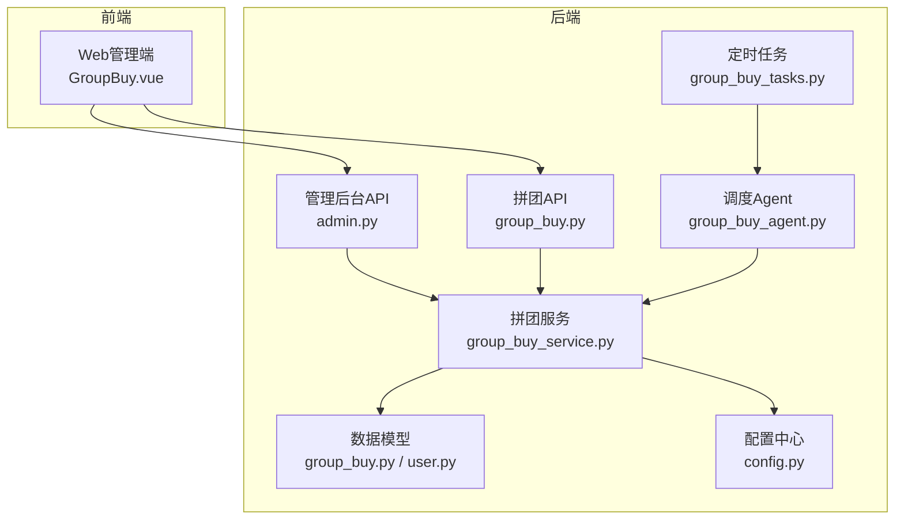
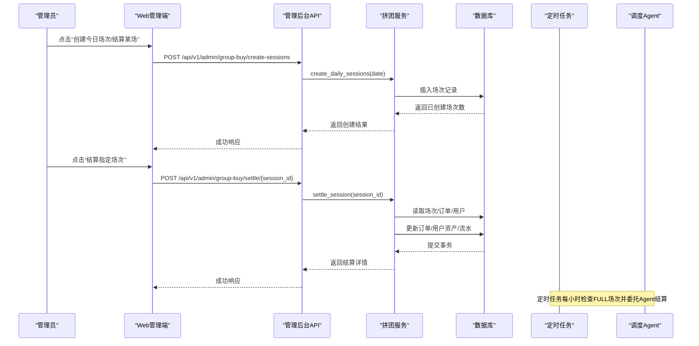
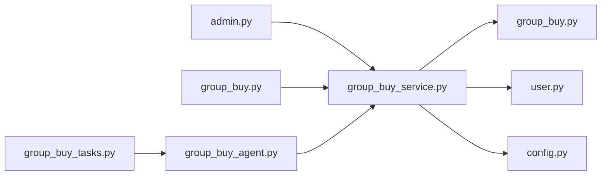
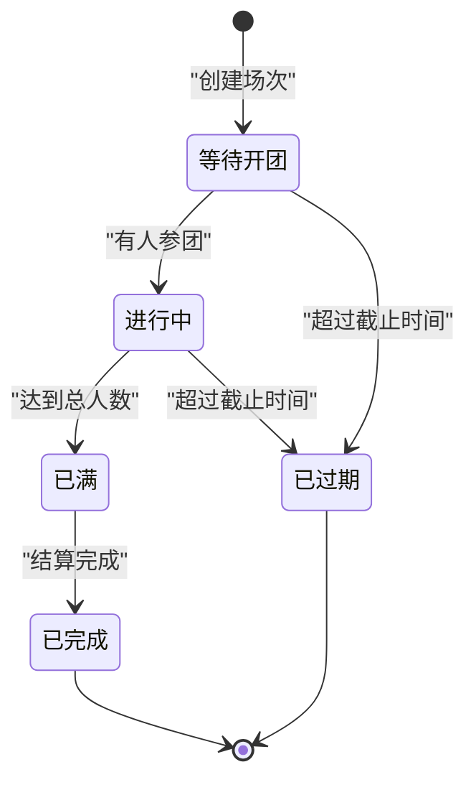
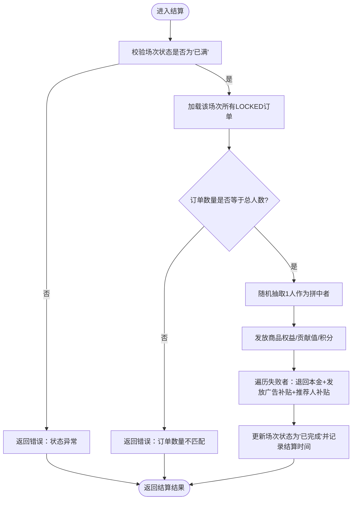

# 拼团管理接口

<cite>
**本文引用的文件**   
- [admin.py](file://backend/app/api/v1/admin.py)
- [group_buy_service.py](file://backend/app/services/group_buy_service.py)
- [group_buy_tasks.py](file://backend/app/tasks/group_buy_tasks.py)
- [group_buy_agent.py](file://backend/app/agents/group_buy_agent.py)
- [group_buy.py](file://backend/app/models/group_buy.py)
- [config.py](file://backend/app/config.py)
- [user.py](file://backend/app/models/user.py)
- [main.py](file://backend/app/schemas/main.py)
- [group_buy.py](file://backend/app/api/v1/group_buy.py)
- [GroupBuy.vue](file://frontend/web-admin/src/views/GroupBuy.vue)
</cite>

## 目录
1. [简介](#简介)
2. [项目结构](#项目结构)
3. [核心组件](#核心组件)
4. [架构总览](#架构总览)
5. [详细组件分析](#详细组件分析)
6. [依赖分析](#依赖分析)
7. [性能考虑](#性能考虑)
8. [故障排查指南](#故障排查指南)
9. [结论](#结论)
10. [附录：API定义与示例](#附录api定义与示例)

## 简介
本文件面向平台管理员，系统化文档化AIxingmu项目的“拼团管理”能力，重点覆盖以下高级管控功能：
- 手动创建每日拼团场次（批量）
- 手动结算指定场次（触发条件、处理流程、权益发放）
- 场次生命周期管理与状态变更机制
- 前端管理界面操作说明与调用示例
- 请求参数校验、错误处理与响应格式规范

## 项目结构
后端采用FastAPI分层架构：路由层（API）→ 服务层（业务逻辑）→ 模型层（数据持久化），并通过Celery任务与Agent进行定时调度。前端管理端提供可视化操作入口。

图表来源
- [admin.py:18-43](file://backend/app/api/v1/admin.py#L18-L43)
- [group_buy_service.py:27-90](file://backend/app/services/group_buy_service.py#L27-L90)
- [group_buy_tasks.py:17-54](file://backend/app/tasks/group_buy_tasks.py#L17-L54)
- [group_buy_agent.py:21-63](file://backend/app/agents/group_buy_agent.py#L21-L63)
- [group_buy.py](file://backend/app/models/group_buy.py)
- [user.py](file://backend/app/models/user.py)
- [config.py](file://backend/app/config.py)

章节来源
- [admin.py:18-43](file://backend/app/api/v1/admin.py#L18-L43)
- [group_buy_service.py:27-90](file://backend/app/services/group_buy_service.py#L27-L90)
- [group_buy_tasks.py:17-54](file://backend/app/tasks/group_buy_tasks.py#L17-L54)
- [group_buy_agent.py:21-63](file://backend/app/agents/group_buy_agent.py#L21-L63)
- [group_buy.py](file://backend/app/models/group_buy.py)
- [user.py](file://backend/app/models/user.py)
- [config.py](file://backend/app/config.py)

## 核心组件
- 管理后台API：提供“手动创建每日场次”和“手动结算指定场次”等管理接口。
- 拼团服务：实现场次批量创建、参团、满员判定、结果结算、权益发放等核心业务。
- 定时任务与Agent：负责自动创建场次、检查并结算已满场次、处理过期场次。
- 数据模型：定义场次、订单、用户钱包流水等实体及状态枚举。
- 配置中心：集中管理拼团规则、价格、比例等关键参数。

章节来源
- [admin.py:18-43](file://backend/app/api/v1/admin.py#L18-L43)
- [group_buy_service.py:27-90](file://backend/app/services/group_buy_service.py#L27-L90)
- [group_buy_tasks.py:17-54](file://backend/app/tasks/group_buy_tasks.py#L17-L54)
- [group_buy_agent.py:21-63](file://backend/app/agents/group_buy_agent.py#L21-L63)
- [group_buy.py](file://backend/app/models/group_buy.py)
- [config.py](file://backend/app/config.py)

## 架构总览
管理员通过Web管理端发起管理操作，调用管理后台API；服务层执行具体业务逻辑，读写数据库；定时任务与Agent在后台周期性执行开团、结算与过期清理。

图表来源
- [admin.py:18-43](file://backend/app/api/v1/admin.py#L18-L43)
- [group_buy_service.py:184-321](file://backend/app/services/group_buy_service.py#L184-L321)
- [group_buy_tasks.py:30-40](file://backend/app/tasks/group_buy_tasks.py#L30-L40)
- [group_buy_agent.py:31-46](file://backend/app/agents/group_buy_agent.py#L31-L46)

## 详细组件分析

### 管理后台API
- 手动创建每日拼团场次
  - 路径与方法：POST /api/v1/admin/group-buy/create-sessions
  - 入参：date（可选，YYYY-MM-DD；不传则默认当天UTC时间）
  - 行为：按配置的小时区间为每个小时创建初级/高级/SVIP三档场次，写入数据库并返回创建数量与日期
  - 成功响应：包含创建场次数量与日期
  - 失败处理：由服务层抛出异常，API统一转换为HTTP 4xx或5xx
- 手动结算指定场次
  - 路径与方法：POST /api/v1/admin/group-buy/settle/{session_id}
  - 入参：session_id（路径参数）
  - 行为：校验场次状态为“已满”，随机抽取1人拼中，其余30人退款并发放补贴，更新订单与用户资产，记录流水
  - 成功响应：包含结算结果摘要
  - 失败处理：当场次状态非“已满”或订单数量不匹配时，返回400错误

章节来源
- [admin.py:18-43](file://backend/app/api/v1/admin.py#L18-L43)
- [group_buy_service.py:27-59](file://backend/app/services/group_buy_service.py#L27-L59)
- [group_buy_service.py:184-321](file://backend/app/services/group_buy_service.py#L184-L321)

### 拼团服务（核心业务）
- 批量创建每日场次
  - 输入：目标日期
  - 输出：创建的场次列表
  - 规则：按配置的开始/结束小时，每小时生成三个级别场次；字段包括定价、倍数、人数、状态、起止时间等
- 门店自定义开团
  - 输入：门店ID、级别、开始时间
  - 输出：新场次对象
- 参与拼团
  - 校验：场次存在且未截止、未满员；单用户同组最多参与次数；余额充足
  - 动作：锁定本金、创建订单、更新场次人数与状态；若满员标记为“已满”
- 场次结算
  - 前置条件：场次状态为“已满”，订单数量等于总人数
  - 逻辑：随机抽1人拼中，其余30人退款；根据配置比例发放商品权益、贡献值、积分给拼中者；向拼失败者发放广告补贴与推荐人补贴；更新订单结果与场次完成时间
- 查询可参与场次与用户订单

章节来源
- [group_buy_service.py:27-90](file://backend/app/services/group_buy_service.py#L27-L90)
- [group_buy_service.py:92-182](file://backend/app/services/group_buy_service.py#L92-L182)
- [group_buy_service.py:184-321](file://backend/app/services/group_buy_service.py#L184-L321)
- [group_buy_service.py:324-348](file://backend/app/services/group_buy_service.py#L324-L348)

### 定时任务与调度Agent
- 定时任务
  - 每日9:50创建当日场次
  - 每小时检查并结算已满场次
  - 每日23:00检查过期场次
- 调度Agent
  - 根据action分发到不同处理分支：创建场次、检查并结算、检查过期
  - 对结算异常进行日志记录，不影响其他场次结算

章节来源
- [group_buy_tasks.py:17-54](file://backend/app/tasks/group_buy_tasks.py#L17-L54)
- [group_buy_agent.py:21-63](file://backend/app/agents/group_buy_agent.py#L21-L63)

### 数据模型与状态机
- 场次状态
  - 等待开团 → 进行中 → 已满 → 已完成 → 已取消/已过期
- 订单状态
  - 待确认 → 已锁定 → 拼中/拼失败 → 已退款/已取消
- 关键字段
  - 场次：编号、级别、定价、倍数、总人数、中奖人数、失败人数、当前人数、起止时间、是否自定义、拼中者ID
  - 订单：订单号、用户ID、场次ID、金额、状态、结果、权益与补贴明细、推荐人ID
  - 用户钱包流水：资产类型、变动类型、金额、变动前后余额、关联会话/订单、描述

章节来源
- [group_buy.py:22-86](file://backend/app/models/group_buy.py#L22-L86)
- [group_buy.py:89-132](file://backend/app/models/group_buy.py#L89-L132)
- [user.py:74-93](file://backend/app/models/user.py#L74-L93)

### 前端管理界面
- 功能点
  - 创建今日场次：弹出确认框后调用管理接口
  - 批量结算：筛选出“已满”场次逐一结算
  - 场次列表：支持日期范围与级别筛选
  - 场次详情：查看参团记录与结果
- 交互流程
  - 点击按钮 → 二次确认 → 调用API → 刷新列表/提示结果

章节来源
- [GroupBuy.vue:165-199](file://frontend/web-admin/src/views/GroupBuy.vue#L165-L199)

## 依赖分析
- 模块耦合
  - 管理API依赖服务层；服务层依赖模型与配置；定时任务通过Agent间接调用服务层
- 外部依赖
  - 数据库（异步SQLAlchemy）、Redis/Celery（任务队列与结果存储）
- 潜在循环依赖
  - 当前未见直接循环引用；Agent与服务之间通过函数调用解耦

图表来源
- [admin.py:18-43](file://backend/app/api/v1/admin.py#L18-L43)
- [group_buy.py](file://backend/app/api/v1/group_buy.py)
- [group_buy_tasks.py:17-54](file://backend/app/tasks/group_buy_tasks.py#L17-L54)
- [group_buy_agent.py:21-63](file://backend/app/agents/group_buy_agent.py#L21-L63)
- [group_buy_service.py:27-90](file://backend/app/services/group_buy_service.py#L27-L90)
- [group_buy.py](file://backend/app/models/group_buy.py)
- [user.py](file://backend/app/models/user.py)
- [config.py](file://backend/app/config.py)

章节来源
- [admin.py:18-43](file://backend/app/api/v1/admin.py#L18-L43)
- [group_buy.py](file://backend/app/api/v1/group_buy.py)
- [group_buy_tasks.py:17-54](file://backend/app/tasks/group_buy_tasks.py#L17-L54)
- [group_buy_agent.py:21-63](file://backend/app/agents/group_buy_agent.py#L21-L63)
- [group_buy_service.py:27-90](file://backend/app/services/group_buy_service.py#L27-L90)
- [group_buy.py](file://backend/app/models/group_buy.py)
- [user.py](file://backend/app/models/user.py)
- [config.py](file://backend/app/config.py)

## 性能考虑
- 批量创建场次
  - 使用批量插入与flush减少往返开销；建议在高并发场景下结合连接池与事务批处理
- 结算流程
  - 随机选择与遍历订单为O(n)，n=31，计算量小；但涉及多次用户资产更新与流水写入，需保证事务原子性
- 定时任务
  - 每小时扫描FULL场次，避免全表扫描，建议基于索引查询；异常场次隔离处理，防止阻塞整体任务

[本节为通用指导，无需源码引用]

## 故障排查指南
- 常见错误
  - 场次不存在或状态异常：检查场次是否存在且处于“已满”
  - 订单数量不匹配：核对场次总人数与实际LOCKED订单数
  - 余额不足：参团前校验余额，确保充值到位
- 定位方法
  - 查看管理API返回的HTTP状态码与detail信息
  - 检查用户钱包流水记录，确认资产变动是否正确
  - 查看定时任务日志，确认Agent是否捕获结算异常

章节来源
- [admin.py:38-43](file://backend/app/api/v1/admin.py#L38-L43)
- [group_buy_service.py:195-207](file://backend/app/services/group_buy_service.py#L195-L207)
- [group_buy_service.py:135-136](file://backend/app/services/group_buy_service.py#L135-L136)
- [group_buy_agent.py:44-46](file://backend/app/agents/group_buy_agent.py#L44-L46)

## 结论
本管理接口为平台提供了对拼团业务的强管控能力，支持批量开团与精准结算，配合定时任务与Agent实现自动化运营。通过清晰的状态机与完善的权益发放逻辑，保障业务闭环与资金安全。建议在上线前完善幂等性与重试策略，并对高并发场景做压测与容量规划。

[本节为总结，无需源码引用]

## 附录：API定义与示例

### 管理接口清单
- 手动创建每日拼团场次
  - 方法：POST
  - 路径：/api/v1/admin/group-buy/create-sessions
  - 请求参数
    - date: string，可选，格式YYYY-MM-DD；不传则使用当前UTC日期
  - 成功响应
    - created: number，本次创建的场次数量
    - date: string，创建日期
  - 错误处理
    - 服务层抛出的异常将转为HTTP 4xx/5xx
- 手动结算指定场次
  - 方法：POST
  - 路径：/api/v1/admin/group-buy/settle/{session_id}
  - 路径参数
    - session_id: integer，场次ID
  - 成功响应
    - code: number，固定为0
    - message: string，固定为“结算成功”
    - data: object，包含结算摘要（如winner_id、loser_count、各项权益金额等）
  - 错误处理
    - 当场次状态非“已满”或订单数量不匹配时，返回HTTP 400与错误消息

章节来源
- [admin.py:18-43](file://backend/app/api/v1/admin.py#L18-L43)
- [group_buy_service.py:184-321](file://backend/app/services/group_buy_service.py#L184-L321)

### 调用示例（概念性）
- 创建今日场次
  - 请求：POST /api/v1/admin/group-buy/create-sessions?date=2024-10-01
  - 响应：{"created": 36, "date": "2024-10-01"}
- 结算指定场次
  - 请求：POST /api/v1/admin/group-buy/settle/12345
  - 响应：{"code": 0, "message": "结算成功", "data": {"session_id": 12345, "winner_id": 1001, "loser_count": 30, ...}}

[本节为示例说明，不涉及具体代码片段]

### 场次生命周期与状态变更

图表来源
- [group_buy.py:22-30](file://backend/app/models/group_buy.py#L22-L30)
- [group_buy_service.py:166-172](file://backend/app/services/group_buy_service.py#L166-L172)
- [group_buy_service.py:309-311](file://backend/app/services/group_buy_service.py#L309-L311)
- [group_buy_agent.py:48-61](file://backend/app/agents/group_buy_agent.py#L48-L61)

### 结算流程图（手动触发）

图表来源
- [group_buy_service.py:184-321](file://backend/app/services/group_buy_service.py#L184-L321)

### 批量创建场次的业务逻辑与参数配置
- 业务逻辑
  - 依据配置的开始/结束小时，逐小时生成三个级别场次
  - 每场默认31人，1人拼中，30人失败
  - 每场定价=288元×倍数（初级1箱、高级5箱、SVIP40箱）
- 关键配置项
  - 单箱定价、每箱瓶数
  - 各级别倍数
  - 每场总人数、中奖人数、失败人数
  - 开始/结束小时
  - 单用户同组最大参与次数
  - 拼中/拼失败权益比例
  - 平台收支分配比例
  - 贡献值与积分相关比例

章节来源
- [group_buy_service.py:27-59](file://backend/app/services/group_buy_service.py#L27-L59)
- [config.py:42-124](file://backend/app/config.py#L42-L124)

### 手动结算的触发条件与处理流程
- 触发条件
  - 场次状态为“已满”
  - 该场次LOCKED订单数量等于总人数
- 处理流程
  - 随机抽取1人拼中，其余30人退款
  - 按配置比例发放拼中者权益与失败者补贴
  - 更新订单结果、用户资产与流水，标记场次完成

章节来源
- [group_buy_service.py:195-207](file://backend/app/services/group_buy_service.py#L195-L207)
- [group_buy_service.py:210-311](file://backend/app/services/group_buy_service.py#L210-L311)

### 前端管理操作要点
- 创建场次：确认后调用管理接口，成功后刷新列表
- 批量结算：仅对“已满”场次执行，逐个调用结算接口
- 查看详情：展示场次基本信息与参团记录

章节来源
- [GroupBuy.vue:165-199](file://frontend/web-admin/src/views/GroupBuy.vue#L165-L199)