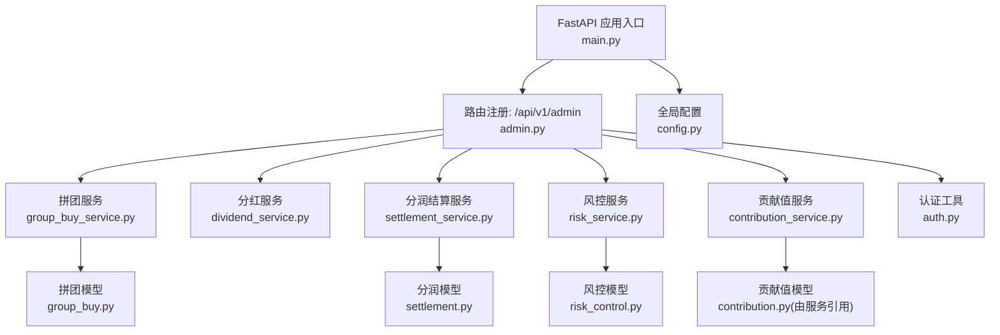
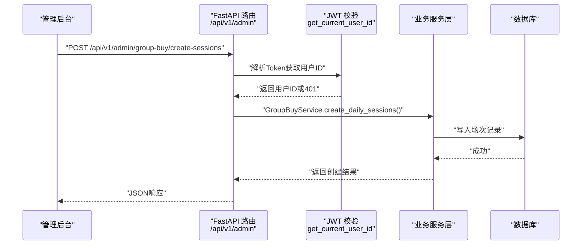
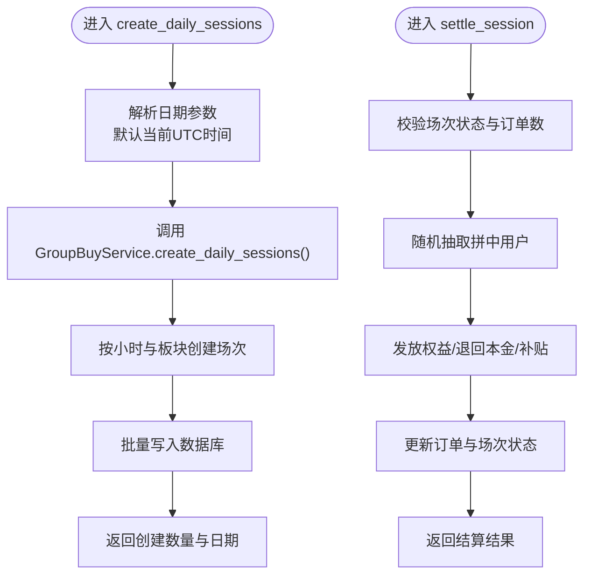
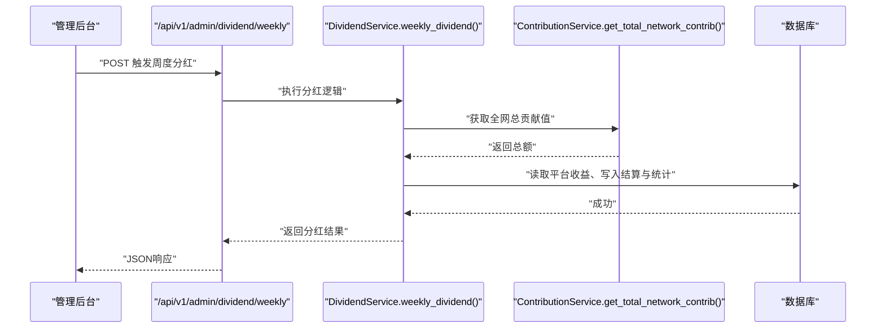
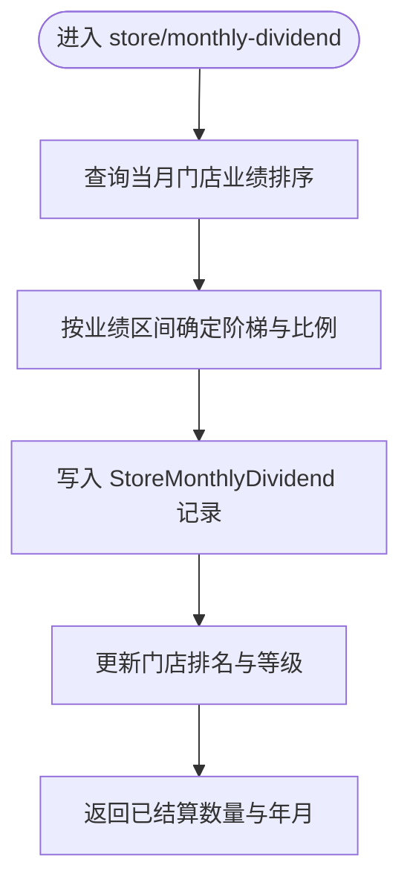
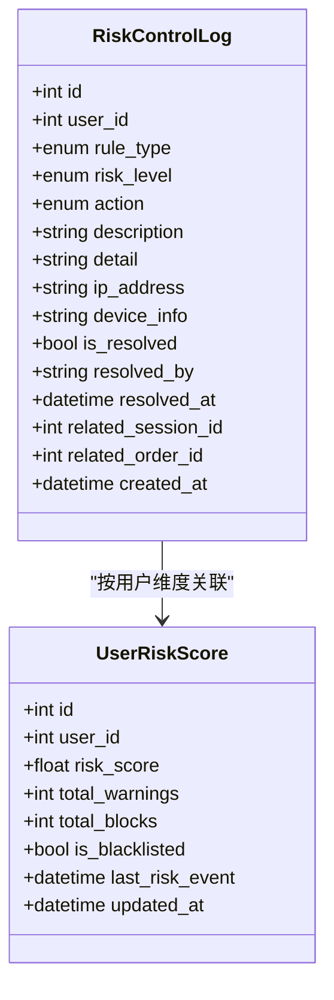
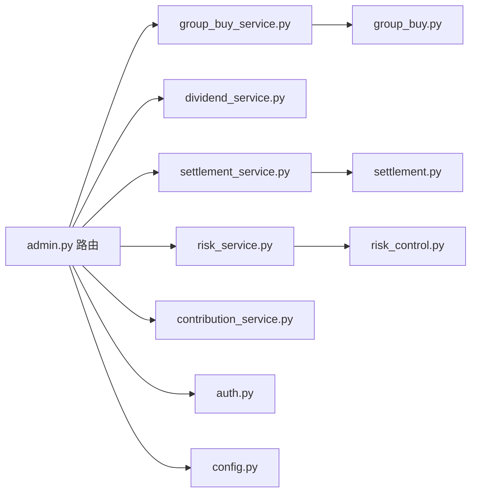

# 管理后台接口

<cite>
**本文引用的文件**   
- [main.py](file://backend/app/main.py)
- [admin.py](file://backend/app/api/v1/admin.py)
- [auth.py](file://backend/app/utils/auth.py)
- [config.py](file://backend/app/config.py)
- [group_buy_service.py](file://backend/app/services/group_buy_service.py)
- [dividend_service.py](file://backend/app/services/dividend_service.py)
- [settlement_service.py](file://backend/app/services/settlement_service.py)
- [risk_service.py](file://backend/app/services/risk_service.py)
- [contribution_service.py](file://backend/app/services/contribution_service.py)
- [group_buy.py](file://backend/app/models/group_buy.py)
- [risk_control.py](file://backend/app/models/risk_control.py)
- [settlement.py](file://backend/app/models/settlement.py)
- [user.py](file://backend/app/models/user.py)
</cite>

## 目录
1. [简介](#简介)
2. [项目结构](#项目结构)
3. [核心组件](#核心组件)
4. [架构总览](#架构总览)
5. [详细组件分析](#详细组件分析)
6. [依赖关系分析](#依赖关系分析)
7. [性能与扩展性](#性能与扩展性)
8. [故障排查指南](#故障排查指南)
9. [结论](#结论)
10. [附录：接口清单与调用示例](#附录接口清单与调用示例)

## 简介
本文件为 AIxingmu 平台的管理后台接口文档，聚焦平台管理员使用的系统管理、风控监控、数据统计等高级功能。内容覆盖用户管理、订单审核、财务审计、风险预警、权限控制、操作日志、数据导出等管理能力的接口规范与调用示例，帮助运维与管理团队高效开展系统运营与治理工作。

## 项目结构
后端采用 FastAPI 模块化路由与服务分层设计，管理后台相关能力集中在 v1 路由下的 admin 模块，并通过服务层对接业务模型与数据库。

图表来源
- [main.py:58-69](file://backend/app/main.py#L58-L69)
- [admin.py:15-86](file://backend/app/api/v1/admin.py#L15-L86)
- [group_buy_service.py:17-348](file://backend/app/services/group_buy_service.py#L17-L348)
- [dividend_service.py:16-136](file://backend/app/services/dividend_service.py#L16-L136)
- [settlement_service.py:17-166](file://backend/app/services/settlement_service.py#L17-L166)
- [risk_service.py:14-135](file://backend/app/services/risk_service.py#L14-L135)
- [contribution_service.py:16-261](file://backend/app/services/contribution_service.py#L16-L261)
- [group_buy.py:42-158](file://backend/app/models/group_buy.py#L42-L158)
- [risk_control.py:40-85](file://backend/app/models/risk_control.py#L40-L85)
- [settlement.py:30-123](file://backend/app/models/settlement.py#L30-L123)
- [auth.py:39-50](file://backend/app/utils/auth.py#L39-L50)
- [config.py:8-136](file://backend/app/config.py#L8-L136)

章节来源
- [main.py:1-75](file://backend/app/main.py#L1-L75)
- [admin.py:1-86](file://backend/app/api/v1/admin.py#L1-L86)

## 核心组件
- 管理后台路由（/api/v1/admin）：提供场次创建、手动结算、周度分红、门店月度分红、贡献值递减兑换、风控日志查询、积分池状态等管理端点。
- 认证鉴权：基于 JWT 的凭据校验，用于提取当前用户标识；管理端点需结合角色控制策略实现（见“权限控制”说明）。
- 业务服务层：
  - 拼团服务：负责每日场次创建、手动结算、参与规则校验等。
  - 分红服务：负责每周贡献值分红计算与发放。
  - 分润结算服务：负责线下四级分润记录与门店月度阶梯分红。
  - 风控服务：负责参团风控检查、评分更新、日志分页查询。
  - 贡献值服务：负责贡献值生成、周度递减兑换、全网统计汇总。
- 数据模型：涵盖拼团、风控、分润、用户钱包流水等关键实体。

章节来源
- [admin.py:15-86](file://backend/app/api/v1/admin.py#L15-L86)
- [auth.py:39-50](file://backend/app/utils/auth.py#L39-L50)
- [group_buy_service.py:27-348](file://backend/app/services/group_buy_service.py#L27-L348)
- [dividend_service.py:19-136](file://backend/app/services/dividend_service.py#L19-L136)
- [settlement_service.py:17-166](file://backend/app/services/settlement_service.py#L17-L166)
- [risk_service.py:14-135](file://backend/app/services/risk_service.py#L14-L135)
- [contribution_service.py:16-261](file://backend/app/services/contribution_service.py#L16-L261)

## 架构总览
管理后台通过统一的前缀路由挂载到 FastAPI 应用，各端点调用对应服务完成业务处理，并持久化至数据库。

图表来源
- [main.py:58-69](file://backend/app/main.py#L58-L69)
- [admin.py:18-29](file://backend/app/api/v1/admin.py#L18-L29)
- [auth.py:39-50](file://backend/app/utils/auth.py#L39-L50)
- [group_buy_service.py:27-59](file://backend/app/services/group_buy_service.py#L27-L59)

## 详细组件分析

### 管理后台路由（/api/v1/admin）
- 字段与行为概览
  - 场次管理：支持按日期批量创建固定时段场次；支持对指定场次进行手动结算。
  - 分红与结算：支持触发每周贡献值分红、每周贡献值递减兑换、门店月度阶梯分红。
  - 风控与统计：支持分页查询风控日志；查看积分池状态。
- 请求参数与返回约定
  - 通用分页参数：page、size（默认分别为1、20）。
  - 时间参数：date（YYYY-MM-DD）、year_month（YYYY-MM）。
  - 返回体包含 code、message、data 等字段，错误时抛出 HTTPException。
- 权限与安全
  - 使用 JWT 提取当前用户ID；建议结合用户角色（UserRole.ADMIN）进行访问控制。
  - 所有写操作应记录操作日志（建议新增独立日志表与中间件）。

章节来源
- [admin.py:15-86](file://backend/app/api/v1/admin.py#L15-L86)
- [auth.py:39-50](file://backend/app/utils/auth.py#L39-L50)
- [user.py:14-24](file://backend/app/models/user.py#L14-L24)

#### 场次创建与结算流程

图表来源
- [admin.py:18-43](file://backend/app/api/v1/admin.py#L18-L43)
- [group_buy_service.py:27-59](file://backend/app/services/group_buy_service.py#L27-L59)
- [group_buy_service.py:183-321](file://backend/app/services/group_buy_service.py#L183-L321)

章节来源
- [admin.py:18-43](file://backend/app/api/v1/admin.py#L18-L43)
- [group_buy_service.py:27-59](file://backend/app/services/group_buy_service.py#L27-L59)
- [group_buy_service.py:183-321](file://backend/app/services/group_buy_service.py#L183-L321)

#### 每周分红与贡献值递减兑换
- 每周分红：根据平台收益池的20%按个人贡献值占比分配消费券，并记录周度结算与全网统计。
- 贡献值递减兑换：按日利率×7计算当周可兑换消费券，发放后记录周度结算明细。

图表来源
- [admin.py:45-49](file://backend/app/api/v1/admin.py#L45-L49)
- [dividend_service.py:19-123](file://backend/app/services/dividend_service.py#L19-L123)
- [contribution_service.py:252-261](file://backend/app/services/contribution_service.py#L252-L261)

章节来源
- [admin.py:45-49](file://backend/app/api/v1/admin.py#L45-L49)
- [dividend_service.py:19-123](file://backend/app/services/dividend_service.py#L19-L123)
- [contribution_service.py:162-240](file://backend/app/services/contribution_service.py#L162-L240)

#### 门店月度阶梯分红
- 依据当月业绩排名与阶梯阈值计算分红比例与金额，写入门店月度分红记录并更新排名。

图表来源
- [admin.py:59-68](file://backend/app/api/v1/admin.py#L59-L68)
- [settlement_service.py:87-133](file://backend/app/services/settlement_service.py#L87-L133)
- [settlement.py:66-94](file://backend/app/models/settlement.py#L66-L94)

章节来源
- [admin.py:59-68](file://backend/app/api/v1/admin.py#L59-L68)
- [settlement_service.py:87-133](file://backend/app/services/settlement_service.py#L87-L133)
- [settlement.py:66-94](file://backend/app/models/settlement.py#L66-L94)

#### 风控日志查询
- 支持按用户ID与风险等级筛选，分页返回风控日志列表。
- 风控动作包括放行、警告、拦截、冻结账号等；支持关联场次与订单ID。

图表来源
- [risk_control.py:40-85](file://backend/app/models/risk_control.py#L40-L85)
- [risk_service.py:109-135](file://backend/app/services/risk_service.py#L109-L135)

章节来源
- [admin.py:71-79](file://backend/app/api/v1/admin.py#L71-L79)
- [risk_service.py:109-135](file://backend/app/services/risk_service.py#L109-L135)
- [risk_control.py:40-85](file://backend/app/models/risk_control.py#L40-L85)

#### 积分池状态
- 返回当前积分池的关键指标（如总量、流通量、通缩比例等），便于运营监控。

章节来源
- [admin.py:82-86](file://backend/app/api/v1/admin.py#L82-L86)

## 依赖关系分析
- 路由层依赖服务层，服务层依赖数据模型与配置项。
- 认证工具被路由层依赖，用于提取用户身份。
- 配置集中管理业务常量（如让利比例、分润比例、场次规则等）。

图表来源
- [admin.py:15-86](file://backend/app/api/v1/admin.py#L15-L86)
- [auth.py:39-50](file://backend/app/utils/auth.py#L39-L50)
- [config.py:8-136](file://backend/app/config.py#L8-L136)
- [group_buy_service.py:17-348](file://backend/app/services/group_buy_service.py#L17-L348)
- [dividend_service.py:16-136](file://backend/app/services/dividend_service.py#L16-L136)
- [settlement_service.py:17-166](file://backend/app/services/settlement_service.py#L17-L166)
- [risk_service.py:14-135](file://backend/app/services/risk_service.py#L14-L135)
- [contribution_service.py:16-261](file://backend/app/services/contribution_service.py#L16-L261)
- [group_buy.py:42-158](file://backend/app/models/group_buy.py#L42-L158)
- [risk_control.py:40-85](file://backend/app/models/risk_control.py#L40-L85)
- [settlement.py:30-123](file://backend/app/models/settlement.py#L30-L123)

章节来源
- [main.py:58-69](file://backend/app/main.py#L58-L69)
- [admin.py:15-86](file://backend/app/api/v1/admin.py#L15-L86)

## 性能与扩展性
- 批量写入：场次创建采用批量添加与一次 flush，降低数据库往返开销。
- 分页查询：风控日志与订单查询使用 offset/limit 分页，避免全表扫描。
- 索引优化：风控日志与分润记录均定义复合索引，提升查询效率。
- 可扩展点：
  - 增加异步任务（Celery）执行大规模结算与统计任务。
  - 引入缓存（Redis）缓存热点配置与统计数据。
  - 增加导出接口（CSV/Excel）供审计与报表使用。

[本节为通用指导，不直接分析具体文件]

## 故障排查指南
- 常见错误
  - 401 未授权：JWT 无效或缺失，检查 Token 生成与传递。
  - 400 业务异常：场次状态不符、订单数量不匹配、余额不足等，检查输入参数与前置条件。
- 定位方法
  - 查看风控日志：通过 /api/v1/admin/risk/logs 分页查询，关注高风险事件与黑名单用户。
  - 核对分润记录：检查 SettlementRecord 的状态与金额是否平衡。
  - 检查配置项：确认让利比例、分润比例、场次规则等配置是否符合预期。

章节来源
- [auth.py:39-50](file://backend/app/utils/auth.py#L39-L50)
- [admin.py:32-43](file://backend/app/api/v1/admin.py#L32-L43)
- [risk_service.py:109-135](file://backend/app/services/risk_service.py#L109-L135)
- [settlement.py:30-64](file://backend/app/models/settlement.py#L30-L64)
- [config.py:42-123](file://backend/app/config.py#L42-L123)

## 结论
管理后台接口围绕场次管理、分红结算、风控监控与数据统计展开，具备清晰的职责划分与良好的扩展性。建议在现有基础上完善权限控制、操作日志与数据导出能力，以满足平台治理与合规需求。

[本节为总结性内容，不直接分析具体文件]

## 附录：接口清单与调用示例

### 基础信息
- 基础路径：/api/v1
- 认证方式：HTTP Bearer（JWT），Header 中携带 Authorization: Bearer <token>
- 字符编码：UTF-8
- 返回格式：JSON

### 管理后台端点清单
- POST /api/v1/admin/group-buy/create-sessions
  - 作用：手动创建每日拼团场次
  - 参数：date（可选，YYYY-MM-DD）
  - 返回：created（创建数量）、date（日期字符串）
  - 示例：
    - 请求：POST /api/v1/admin/group-buy/create-sessions?date=2024-06-01
    - 响应：{"created": 36, "date": "2024-06-01"}

- POST /api/v1/admin/group-buy/settle/{session_id}
  - 作用：手动结算指定场次
  - 路径参数：session_id（整数）
  - 返回：code、message、data（含 winner_id、loser_count 等）
  - 示例：
    - 请求：POST /api/v1/admin/group-buy/settle/12345
    - 响应：{"code": 0, "message": "结算成功", "data": {"session_id": 12345, "winner_id": 1001, "loser_count": 30}}

- POST /api/v1/admin/dividend/weekly
  - 作用：手动触发每周贡献值分红
  - 返回：code、message、data（含 dividend_count、total_dividend_paid 等）
  - 示例：
    - 请求：POST /api/v1/admin/dividend/weekly
    - 响应：{"code": 0, "message": "分红完成", "data": {"dividend_count": 1200, "total_dividend_paid": 50000.0}}

- POST /api/v1/admin/contribution/weekly-settle
  - 作用：手动触发每周贡献值递减兑换
  - 返回：code、message、data（含 settled_users、total_coupon_generated 等）
  - 示例：
    - 请求：POST /api/v1/admin/contribution/weekly-settle
    - 响应：{"code": 0, "message": "结算完成", "data": {"settled_users": 800, "total_coupon_generated": 30000.0}}

- POST /api/v1/admin/store/monthly-dividend
  - 作用：手动触发门店月度阶梯分红
  - 参数：year_month（可选，YYYY-MM）
  - 返回：code、message、data（含 settled_count、year_month）
  - 示例：
    - 请求：POST /api/v1/admin/store/monthly-dividend?year_month=2024-06
    - 响应：{"code": 0, "message": "分红完成", "data": {"settled_count": 120, "year_month": "2024-06"}}

- GET /api/v1/admin/risk/logs
  - 作用：获取风控日志（分页）
  - 参数：page（默认1）、size（默认20）、user_id（可选）、risk_level（可选）
  - 返回：total、page、size、items（风控日志列表）
  - 示例：
    - 请求：GET /api/v1/admin/risk/logs?page=1&size=20&risk_level=high
    - 响应：{"total": 150, "page": 1, "size": 20, "items": [...]}

- GET /api/v1/admin/points/pool
  - 作用：获取积分池状态
  - 返回：积分池关键指标（如总量、流通量、通缩比例等）
  - 示例：
    - 请求：GET /api/v1/admin/points/pool
    - 响应：{"total_supply": 12000000, "circulating": 8500000, "deflation_ratio": 0.2}

### 权限控制建议
- 在路由层增加角色校验，仅允许 UserRole.ADMIN 访问管理端点。
- 结合 get_current_user_id 与用户表中的 role 字段进行判断。
- 对敏感操作（结算、分红）增加二次确认与审批流。

章节来源
- [admin.py:15-86](file://backend/app/api/v1/admin.py#L15-L86)
- [auth.py:39-50](file://backend/app/utils/auth.py#L39-L50)
- [user.py:14-24](file://backend/app/models/user.py#L14-L24)

### 操作日志与审计
- 建议新增操作日志表，记录管理员操作人、时间、IP、操作类型、目标对象与结果。
- 在关键写操作前后插入日志记录，便于追溯与审计。

[本节为通用建议，不直接分析具体文件]

### 数据导出
- 建议提供 CSV/Excel 导出接口，支持风控日志、分润记录、场次统计等数据的批量导出。
- 导出任务可异步执行，完成后通知下载链接。

[本节为通用建议，不直接分析具体文件]