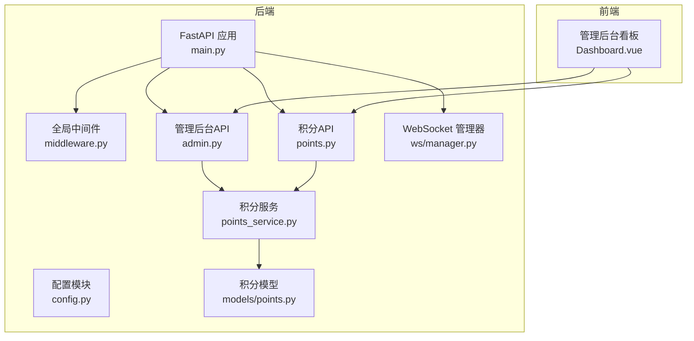
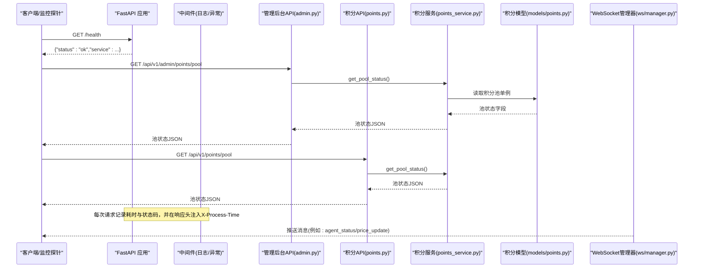
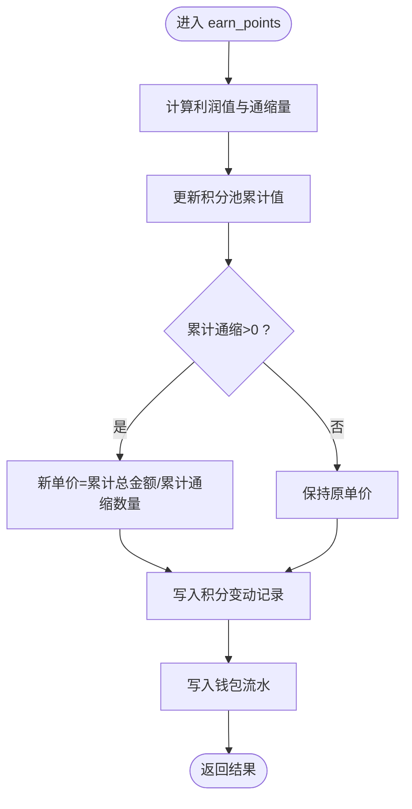
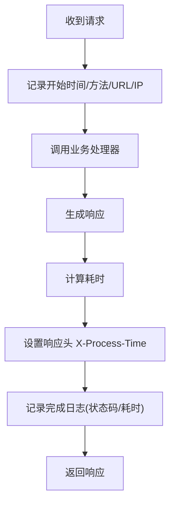
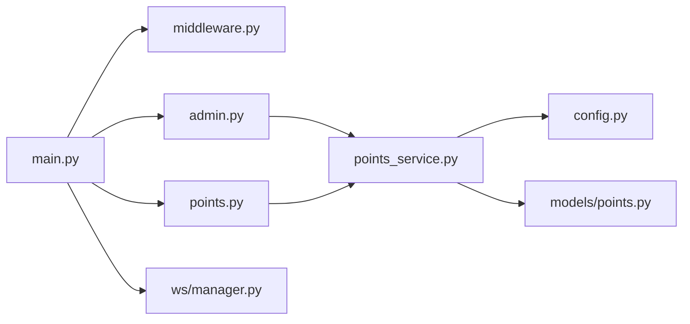

# 系统监控接口

<cite>
**本文引用的文件**   
- [backend/app/main.py](file://backend/app/main.py)
- [backend/app/middleware.py](file://backend/app/middleware.py)
- [backend/app/config.py](file://backend/app/config.py)
- [backend/app/api/v1/admin.py](file://backend/app/api/v1/admin.py)
- [backend/app/api/v1/points.py](file://backend/app/api/v1/points.py)
- [backend/app/services/points_service.py](file://backend/app/services/points_service.py)
- [backend/app/models/points.py](file://backend/app/models/points.py)
- [backend/app/ws/manager.py](file://backend/app/ws/manager.py)
- [frontend/web-admin/src/views/Dashboard.vue](file://frontend/web-admin/src/views/Dashboard.vue)
</cite>

## 目录
1. [简介](#简介)
2. [项目结构](#项目结构)
3. [核心组件](#核心组件)
4. [架构总览](#架构总览)
5. [详细组件分析](#详细组件分析)
6. [依赖关系分析](#依赖关系分析)
7. [性能与可观测性](#性能与可观测性)
8. [故障排查指南](#故障排查指南)
9. [结论](#结论)
10. [附录：API定义与示例](#附录api定义与示例)

## 简介
本文件为AIxingmu项目的“系统监控接口”文档，聚焦于系统运行状态的监控能力，包括：
- 健康检查与健康指标
- 积分池状态查询与实时数据结构说明
- 请求级性能指标收集（耗时、错误率）
- WebSocket实时推送通道（用于拼团进度、Agent状态、积分单价更新等）
- 可视化展示建议与趋势分析方法
- 告警阈值配置建议与调用示例

## 项目结构
后端采用FastAPI应用，提供REST API与WebSocket能力；前端管理后台已包含部分监控看板页面。关键路径如下：
- 应用入口与路由注册、健康检查端点
- 全局中间件（异常处理、请求日志、CORS）
- 配置中心（含积分池参数）
- 积分池服务与数据模型
- 管理后台API（含积分池状态查询）
- WebSocket管理器（消息类型与连接管理）
- 前端Dashboard（统计卡片与表格展示）

图表来源
- [backend/app/main.py:36-78](file://backend/app/main.py#L36-L78)
- [backend/app/middleware.py:16-121](file://backend/app/middleware.py#L16-L121)
- [backend/app/config.py:107-111](file://backend/app/config.py#L107-L111)
- [backend/app/api/v1/admin.py:82-86](file://backend/app/api/v1/admin.py#L82-L86)
- [backend/app/api/v1/points.py:13-16](file://backend/app/api/v1/points.py#L13-L16)
- [backend/app/services/points_service.py:169-179](file://backend/app/services/points_service.py#L169-L179)
- [backend/app/models/points.py:14-27](file://backend/app/models/points.py#L14-L27)
- [backend/app/ws/manager.py:14-31](file://backend/app/ws/manager.py#L14-L31)
- [frontend/web-admin/src/views/Dashboard.vue:1-36](file://frontend/web-admin/src/views/Dashboard.vue#L1-L36)

章节来源
- [backend/app/main.py:36-78](file://backend/app/main.py#L36-L78)
- [backend/app/middleware.py:82-109](file://backend/app/middleware.py#L82-L109)
- [backend/app/config.py:107-111](file://backend/app/config.py#L107-L111)
- [backend/app/api/v1/admin.py:82-86](file://backend/app/api/v1/admin.py#L82-L86)
- [backend/app/api/v1/points.py:13-16](file://backend/app/api/v1/points.py#L13-L16)
- [backend/app/services/points_service.py:169-179](file://backend/app/services/points_service.py#L169-L179)
- [backend/app/models/points.py:14-27](file://backend/app/models/points.py#L14-L27)
- [backend/app/ws/manager.py:14-31](file://backend/app/ws/manager.py#L14-L31)
- [frontend/web-admin/src/views/Dashboard.vue:1-36](file://frontend/web-admin/src/views/Dashboard.vue#L1-L36)

## 核心组件
- 健康检查接口：返回服务名称与状态，便于探针与编排系统探测存活。
- 积分池状态接口：暴露当前发行量、已发放、通缩、兑换、单价与剩余等指标。
- 请求级性能指标：通过中间件记录请求开始/结束时间与状态码，并注入响应头X-Process-Time。
- WebSocket实时通道：支持按用户或频道推送状态变更（如Agent状态、价格更新）。
- 配置项：积分池总量、利润比例、通缩比例等，作为监控阈值与业务规则的基础。

章节来源
- [backend/app/main.py:75-78](file://backend/app/main.py#L75-L78)
- [backend/app/api/v1/admin.py:82-86](file://backend/app/api/v1/admin.py#L82-L86)
- [backend/app/api/v1/points.py:13-16](file://backend/app/api/v1/points.py#L13-L16)
- [backend/app/services/points_service.py:169-179](file://backend/app/services/points_service.py#L169-L179)
- [backend/app/middleware.py:82-109](file://backend/app/middleware.py#L82-L109)
- [backend/app/ws/manager.py:14-31](file://backend/app/ws/manager.py#L14-L31)
- [backend/app/config.py:107-111](file://backend/app/config.py#L107-L111)

## 架构总览
下图展示了从客户端到后端各层的关键交互，以及监控数据的采集与输出位置。

图表来源
- [backend/app/main.py:75-78](file://backend/app/main.py#L75-L78)
- [backend/app/api/v1/admin.py:82-86](file://backend/app/api/v1/admin.py#L82-L86)
- [backend/app/api/v1/points.py:13-16](file://backend/app/api/v1/points.py#L13-L16)
- [backend/app/services/points_service.py:169-179](file://backend/app/services/points_service.py#L169-L179)
- [backend/app/models/points.py:14-27](file://backend/app/models/points.py#L14-L27)
- [backend/app/middleware.py:82-109](file://backend/app/middleware.py#L82-L109)
- [backend/app/ws/manager.py:14-31](file://backend/app/ws/manager.py#L14-L31)

## 详细组件分析

### 健康检查接口
- 端点：GET /health
- 功能：返回服务名与状态，供负载均衡器、容器编排或外部探针进行存活检测。
- 响应字段：
  - status: 字符串，表示服务状态
  - service: 字符串，应用名称

章节来源
- [backend/app/main.py:75-78](file://backend/app/main.py#L75-L78)

### 积分池状态接口
- 端点：
  - GET /api/v1/admin/points/pool（管理后台）
  - GET /api/v1/points/pool（通用）
- 功能：返回积分池的实时状态，包括总发行量、已发放、通缩、兑换、当前单价与剩余。
- 响应字段：
  - total_supply: 总发行量
  - total_issued: 累计已发放积分
  - total_deflated: 累计通缩积分
  - total_converted: 累计兑换消费券的积分
  - current_unit_price: 当前积分单价
  - remaining: 剩余可用积分（由服务计算得出）
- 数据来源：积分池单例记录（数据库表），由服务聚合返回。

章节来源
- [backend/app/api/v1/admin.py:82-86](file://backend/app/api/v1/admin.py#L82-L86)
- [backend/app/api/v1/points.py:13-16](file://backend/app/api/v1/points.py#L13-L16)
- [backend/app/services/points_service.py:169-179](file://backend/app/services/points_service.py#L169-L179)
- [backend/app/models/points.py:14-27](file://backend/app/models/points.py#L14-L27)

### 积分池数据结构与更新机制
- 数据结构要点：
  - 总发行量固定，永不超发
  - 已发放与通缩累计值驱动动态单价
  - 兑换记录影响已兑换总量
- 更新机制：
  - 消费获得积分时，按比例新增利润值与通缩，并重新计算单价
  - 兑换消费券时，扣减用户积分并增加兑换总量
  - 所有变动均写入流水记录，保证可追溯

图表来源
- [backend/app/services/points_service.py:30-92](file://backend/app/services/points_service.py#L30-L92)
- [backend/app/models/points.py:29-59](file://backend/app/models/points.py#L29-L59)

章节来源
- [backend/app/services/points_service.py:30-92](file://backend/app/services/points_service.py#L30-L92)
- [backend/app/models/points.py:29-59](file://backend/app/models/points.py#L29-L59)

### 请求级性能指标与日志
- 请求日志中间件：
  - 记录方法、URL、客户端IP、状态码与耗时
  - 在响应头注入X-Process-Time，便于下游链路追踪
- 全局异常中间件：
  - 统一捕获验证错误、数据库错误、业务错误、权限错误与未处理异常
  - 返回标准化错误体，便于监控面板统计错误率

图表来源
- [backend/app/middleware.py:82-109](file://backend/app/middleware.py#L82-L109)
- [backend/app/middleware.py:16-79](file://backend/app/middleware.py#L16-L79)

章节来源
- [backend/app/middleware.py:82-109](file://backend/app/middleware.py#L82-L109)
- [backend/app/middleware.py:16-79](file://backend/app/middleware.py#L16-L79)

### WebSocket实时推送
- 消息类型：
  - group_buy_update：拼团人数更新
  - group_buy_result：拼团结果
  - agent_status：Agent状态变更
  - notification：通用通知
  - price_update：积分单价更新
- 连接管理：
  - 支持全局连接、按用户ID分组、按频道分组
  - 适用于实时监控大屏与告警推送

章节来源
- [backend/app/ws/manager.py:14-31](file://backend/app/ws/manager.py#L14-L31)

### 前端监控看板
- Dashboard页面展示：
  - 今日场次、交易金额、全网贡献值、积分池剩余
  - 拼团场次实时状态表格
  - AI Agent运行状态概览
- 数据来源：
  - 通过API获取活跃场次与统计数据
  - 积分池剩余可由积分池接口补充

章节来源
- [frontend/web-admin/src/views/Dashboard.vue:1-36](file://frontend/web-admin/src/views/Dashboard.vue#L1-L36)

## 依赖关系分析
- 应用入口依赖：
  - 中间件（日志、异常、CORS）
  - 路由模块（认证、用户、商品、拼团、贡献值、积分、消费券、门店、管理后台、智能体）
- 管理后台API依赖：
  - 积分服务（获取池状态）
- 积分服务依赖：
  - 配置（积分池常量）
  - 数据模型（积分池、记录、兑换记录）
- WebSocket管理器独立于业务逻辑，仅负责连接与消息分发

图表来源
- [backend/app/main.py:36-78](file://backend/app/main.py#L36-L78)
- [backend/app/middleware.py:16-121](file://backend/app/middleware.py#L16-L121)
- [backend/app/api/v1/admin.py:82-86](file://backend/app/api/v1/admin.py#L82-L86)
- [backend/app/api/v1/points.py:13-16](file://backend/app/api/v1/points.py#L13-L16)
- [backend/app/services/points_service.py:169-179](file://backend/app/services/points_service.py#L169-L179)
- [backend/app/config.py:107-111](file://backend/app/config.py#L107-L111)
- [backend/app/models/points.py:14-27](file://backend/app/models/points.py#L14-L27)
- [backend/app/ws/manager.py:14-31](file://backend/app/ws/manager.py#L14-L31)

章节来源
- [backend/app/main.py:36-78](file://backend/app/main.py#L36-L78)
- [backend/app/api/v1/admin.py:82-86](file://backend/app/api/v1/admin.py#L82-L86)
- [backend/app/api/v1/points.py:13-16](file://backend/app/api/v1/points.py#L13-L16)
- [backend/app/services/points_service.py:169-179](file://backend/app/services/points_service.py#L169-L179)
- [backend/app/config.py:107-111](file://backend/app/config.py#L107-L111)
- [backend/app/models/points.py:14-27](file://backend/app/models/points.py#L14-L27)
- [backend/app/ws/manager.py:14-31](file://backend/app/ws/manager.py#L14-L31)

## 性能与可观测性
- 指标采集
  - 请求耗时：中间件自动计算并注入响应头X-Process-Time
  - 错误率：统一异常中间件返回标准错误体，便于统计各类错误占比
  - 业务指标：积分池状态接口提供关键业务指标快照
- 建议增强
  - 增加Prometheus指标导出（QPS、P95/P99延迟、错误率、积分池关键指标）
  - 结构化日志接入集中式日志平台（ELK/Loki），按traceId关联
  - 使用分布式追踪（OpenTelemetry）串联HTTP与异步任务链路
- 资源监控
  - 进程CPU/内存、GC、线程数
  - 数据库连接池使用率、慢查询
  - Redis/Celery队列积压与任务执行时长

[本节为通用指导，不直接分析具体文件]

## 故障排查指南
- 健康检查失败
  - 确认服务启动成功且端口可达
  - 检查数据库连接与初始化流程
- 积分池状态异常
  - 核对配置中的总发行量与比例参数
  - 检查积分变动流水是否完整
- 请求超时或高延迟
  - 查看中间件日志中的耗时与状态码
  - 结合数据库慢查询与连接池使用情况定位瓶颈
- WebSocket推送异常
  - 检查连接管理与频道订阅是否正确
  - 确认消息类型与业务事件触发时机

章节来源
- [backend/app/main.py:75-78](file://backend/app/main.py#L75-L78)
- [backend/app/middleware.py:82-109](file://backend/app/middleware.py#L82-L109)
- [backend/app/services/points_service.py:169-179](file://backend/app/services/points_service.py#L169-L179)
- [backend/app/ws/manager.py:14-31](file://backend/app/ws/manager.py#L14-L31)

## 结论
本项目已具备基础的系统监控能力：健康检查、请求级性能指标、积分池状态查询与WebSocket实时推送。建议在现有基础上引入更完善的指标导出、结构化日志与分布式追踪，以提升整体可观测性与排障效率。同时，基于现有接口与数据模型，可快速构建可视化看板与告警策略。

[本节为总结，不直接分析具体文件]

## 附录：API定义与示例

### 健康检查
- 方法：GET
- 路径：/health
- 响应字段：
  - status: 字符串
  - service: 字符串

章节来源
- [backend/app/main.py:75-78](file://backend/app/main.py#L75-L78)

### 积分池状态（管理后台）
- 方法：GET
- 路径：/api/v1/admin/points/pool
- 响应字段：
  - total_supply: 数字
  - total_issued: 数字
  - total_deflated: 数字
  - total_converted: 数字
  - current_unit_price: 数字
  - remaining: 数字

章节来源
- [backend/app/api/v1/admin.py:82-86](file://backend/app/api/v1/admin.py#L82-L86)
- [backend/app/services/points_service.py:169-179](file://backend/app/services/points_service.py#L169-L179)

### 积分池状态（通用）
- 方法：GET
- 路径：/api/v1/points/pool
- 响应字段：同上

章节来源
- [backend/app/api/v1/points.py:13-16](file://backend/app/api/v1/points.py#L13-L16)
- [backend/app/services/points_service.py:169-179](file://backend/app/services/points_service.py#L169-L179)

### 请求级性能指标
- 响应头：X-Process-Time（秒）
- 日志：请求开始/完成日志包含方法、URL、IP、状态码、耗时

章节来源
- [backend/app/middleware.py:82-109](file://backend/app/middleware.py#L82-L109)

### WebSocket消息类型
- group_buy_update
- group_buy_result
- agent_status
- notification
- price_update

章节来源
- [backend/app/ws/manager.py:14-31](file://backend/app/ws/manager.py#L14-L31)

### 可视化与趋势分析建议
- 看板维度
  - 业务：今日场次、交易金额、全网贡献值、积分池剩余
  - 系统：QPS、P95/P99延迟、错误率、数据库连接池使用率
  - 积分池：total_issued、total_deflated、current_unit_price变化曲线
- 趋势分析
  - 滑动窗口统计（5分钟/1小时/24小时）
  - 同比/环比对比（日/周/月）
  - 分位值与异常点检测（Z-Score/IQR）
- 告警阈值建议
  - 健康检查失败持续N次
  - P99延迟超过阈值（如>2s）
  - 错误率超过阈值（如>1%）
  - 积分池单价波动超过阈值（如>5%/小时）
  - 数据库连接池使用率超过阈值（如>80%）

[本节为通用指导，不直接分析具体文件]