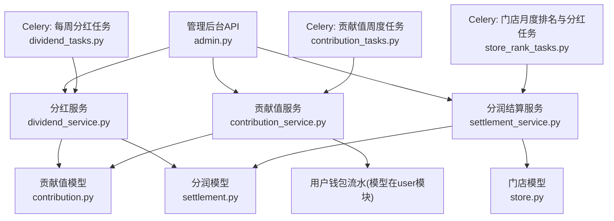
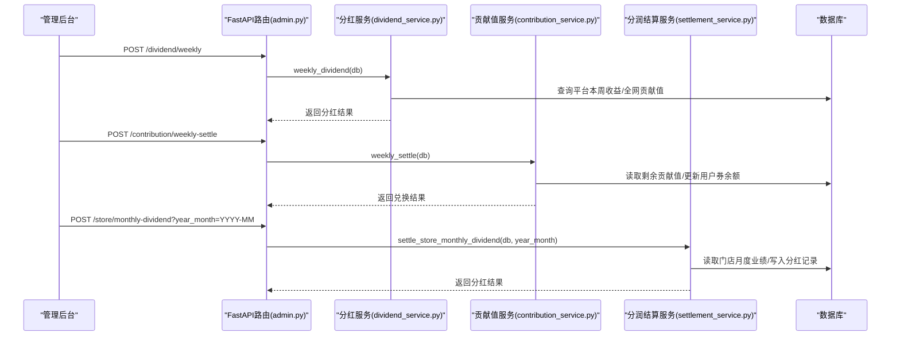
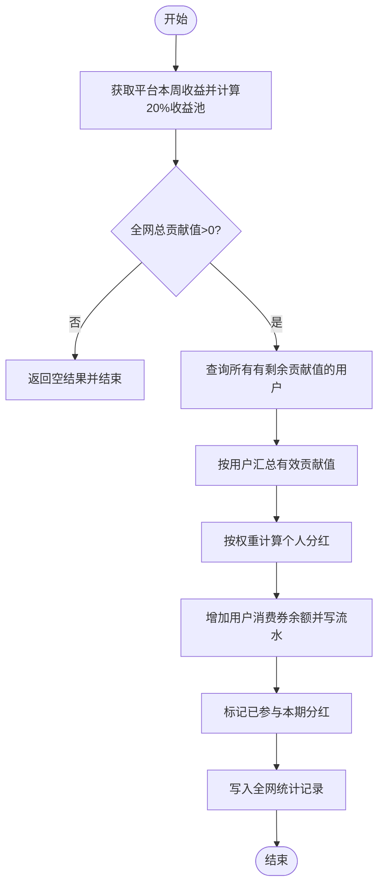
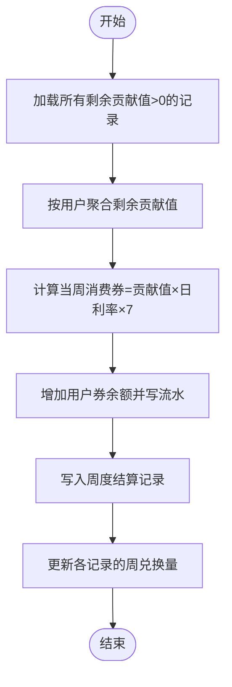
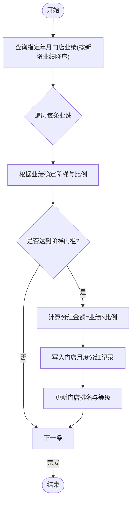
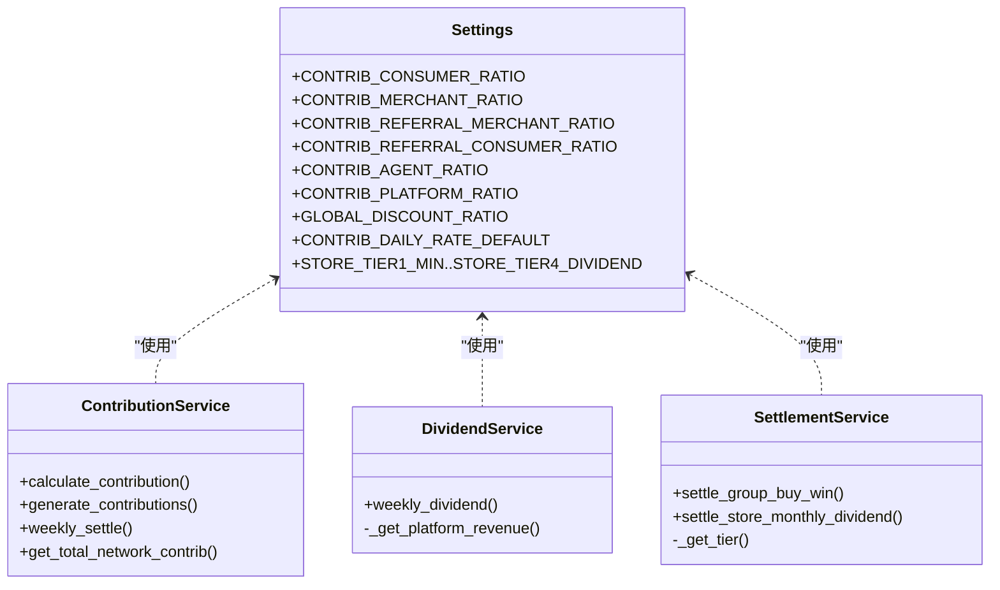

# 财务结算接口

<cite>
**本文引用的文件**   
- [backend/app/api/v1/admin.py](file://backend/app/api/v1/admin.py)
- [backend/app/services/settlement_service.py](file://backend/app/services/settlement_service.py)
- [backend/app/models/settlement.py](file://backend/app/models/settlement.py)
- [backend/app/services/dividend_service.py](file://backend/app/services/dividend_service.py)
- [backend/app/models/contribution.py](file://backend/app/models/contribution.py)
- [backend/app/services/contribution_service.py](file://backend/app/services/contribution_service.py)
- [backend/app/tasks/dividend_tasks.py](file://backend/app/tasks/dividend_tasks.py)
- [backend/app/tasks/contribution_tasks.py](file://backend/app/tasks/contribution_tasks.py)
- [backend/app/tasks/store_rank_tasks.py](file://backend/app/tasks/store_rank_tasks.py)
- [backend/app/models/store.py](file://backend/app/models/store.py)
- [backend/app/config.py](file://backend/app/config.py)
</cite>

## 目录
1. [简介](#简介)
2. [项目结构](#项目结构)
3. [核心组件](#核心组件)
4. [架构总览](#架构总览)
5. [详细组件分析](#详细组件分析)
6. [依赖关系分析](#依赖关系分析)
7. [性能与一致性保障](#性能与一致性保障)
8. [故障排查指南](#故障排查指南)
9. [结论](#结论)
10. [附录：API 调用示例与参数说明](#附录api-调用示例与参数说明)

## 简介
本文件为 AIxingmu 项目的“财务结算接口”文档，聚焦平台财务相关的管理接口与计算规则，覆盖以下核心能力：
- 每周贡献值分红（全网贡献值按比例分配平台收益池）
- 贡献值递减兑换（按周累计、周一发放消费券）
- 门店月度阶梯分红（按当月新增业绩分档计发）

同时提供手动触发接口的调用方式、时间参数配置、返回结果结构与异常处理建议，并说明数据准确性与一致性的保障机制。

## 项目结构
后端采用 FastAPI + SQLAlchemy 异步模型，结合 Celery 定时任务驱动财务结算流程。关键路径如下：
- 管理后台 API：统一入口，暴露手动触发接口
- 服务层：实现分红、贡献值核算、门店阶梯分红等核心业务逻辑
- 模型层：定义分润记录、贡献值、门店业绩与平台日结表等
- 任务层：通过 Celery 调度每周一/每月一等周期任务

图表来源
- [backend/app/api/v1/admin.py:1-86](file://backend/app/api/v1/admin.py#L1-L86)
- [backend/app/services/dividend_service.py:1-136](file://backend/app/services/dividend_service.py#L1-L136)
- [backend/app/services/contribution_service.py:1-261](file://backend/app/services/contribution_service.py#L1-L261)
- [backend/app/services/settlement_service.py:1-166](file://backend/app/services/settlement_service.py#L1-L166)
- [backend/app/models/contribution.py:1-115](file://backend/app/models/contribution.py#L1-L115)
- [backend/app/models/settlement.py:1-123](file://backend/app/models/settlement.py#L1-L123)
- [backend/app/models/store.py:1-104](file://backend/app/models/store.py#L1-L104)
- [backend/app/tasks/dividend_tasks.py:1-26](file://backend/app/tasks/dividend_tasks.py#L1-L26)
- [backend/app/tasks/contribution_tasks.py:1-29](file://backend/app/tasks/contribution_tasks.py#L1-L29)
- [backend/app/tasks/store_rank_tasks.py:1-29](file://backend/app/tasks/store_rank_tasks.py#L1-L29)

章节来源
- [backend/app/api/v1/admin.py:1-86](file://backend/app/api/v1/admin.py#L1-L86)
- [backend/app/config.py:60-124](file://backend/app/config.py#L60-L124)

## 核心组件
- 管理后台 API
  - 每周贡献值分红：POST /api/v1/dividend/weekly
  - 贡献值递减兑换：POST /api/v1/contribution/weekly-settle
  - 门店月度阶梯分红：POST /api/v1/store/monthly-dividend?year_month=YYYY-MM
- 服务层
  - 分红服务：计算平台收益池并按全网贡献值比例发放消费券
  - 贡献值服务：生成贡献值记录、周度递减兑换并发放消费券
  - 分润结算服务：线下四级分润与门店月度阶梯分红
- 模型层
  - 贡献值记录、周度结算、全网统计
  - 分润记录、门店月度分红、平台每日财务汇总
  - 门店月度业绩统计
- 任务层
  - 每周一凌晨执行分红与贡献值结算
  - 每月1日凌晨执行门店排名与分红

章节来源
- [backend/app/api/v1/admin.py:45-68](file://backend/app/api/v1/admin.py#L45-L68)
- [backend/app/services/dividend_service.py:19-123](file://backend/app/services/dividend_service.py#L19-L123)
- [backend/app/services/contribution_service.py:162-240](file://backend/app/services/contribution_service.py#L162-L240)
- [backend/app/services/settlement_service.py:87-133](file://backend/app/services/settlement_service.py#L87-L133)
- [backend/app/models/contribution.py:32-115](file://backend/app/models/contribution.py#L32-L115)
- [backend/app/models/settlement.py:30-123](file://backend/app/models/settlement.py#L30-L123)
- [backend/app/models/store.py:83-104](file://backend/app/models/store.py#L83-L104)
- [backend/app/tasks/dividend_tasks.py:15-25](file://backend/app/tasks/dividend_tasks.py#L15-L25)
- [backend/app/tasks/contribution_tasks.py:15-28](file://backend/app/tasks/contribution_tasks.py#L15-L28)
- [backend/app/tasks/store_rank_tasks.py:15-28](file://backend/app/tasks/store_rank_tasks.py#L15-L28)

## 架构总览
下图展示从管理后台触发到服务层与数据库的完整调用链，以及 Celery 定时任务的自动执行路径。

图表来源
- [backend/app/api/v1/admin.py:45-68](file://backend/app/api/v1/admin.py#L45-L68)
- [backend/app/services/dividend_service.py:19-123](file://backend/app/services/dividend_service.py#L19-L123)
- [backend/app/services/contribution_service.py:162-240](file://backend/app/services/contribution_service.py#L162-L240)
- [backend/app/services/settlement_service.py:87-133](file://backend/app/services/settlement_service.py#L87-L133)

## 详细组件分析

### 每周贡献值分红接口
- 接口路径与方法
  - POST /api/v1/dividend/weekly
- 功能说明
  - 计算平台本周收益池（取平台总收益的20%），按个人贡献值占全网总贡献值的比例发放消费券
  - 分红后标记已参与本期分红，但不扣减贡献值；贡献值继续参与下期
- 计算规则
  - 平台收益池 = 平台本周总收益 × 20%
  - 个人分红 = (个人有效贡献值 / 全网总贡献值) × 平台收益池
- 执行时机
  - 支持手动触发；也可由 Celery 每周一定时任务自动执行
- 输入参数
  - 无请求体参数
- 返回字段
  - code: 状态码
  - message: 消息
  - data: { dividend_count, total_dividend_paid, total_network_contrib, platform_pool }
- 异常处理
  - 若全网无有效贡献值，返回提示并结束
  - 其他异常由上层捕获并返回 HTTP 错误
- 相关代码片段路径
  - [每周分红服务实现:19-123](file://backend/app/services/dividend_service.py#L19-L123)
  - [管理后台路由:45-49](file://backend/app/api/v1/admin.py#L45-L49)
  - [每周分红任务:15-25](file://backend/app/tasks/dividend_tasks.py#L15-L25)

图表来源
- [backend/app/services/dividend_service.py:19-123](file://backend/app/services/dividend_service.py#L19-L123)
- [backend/app/models/contribution.py:103-115](file://backend/app/models/contribution.py#L103-L115)

章节来源
- [backend/app/services/dividend_service.py:19-123](file://backend/app/services/dividend_service.py#L19-L123)
- [backend/app/api/v1/admin.py:45-49](file://backend/app/api/v1/admin.py#L45-L49)
- [backend/app/tasks/dividend_tasks.py:15-25](file://backend/app/tasks/dividend_tasks.py#L15-L25)
- [backend/app/models/contribution.py:103-115](file://backend/app/models/contribution.py#L103-L115)

### 贡献值递减兑换接口
- 接口路径与方法
  - POST /api/v1/contribution/weekly-settle
- 功能说明
  - 对当周有效贡献值进行递减兑换，按日利率×7天计算应发消费券并发放到用户账户
  - 兑换后贡献值不扣减，继续参与下期
- 计算规则
  - 当周消费券 = 有效贡献值 × 日利率 × 7
- 执行时机
  - 支持手动触发；Celery 每日凌晨检查，仅周一实际结算并发放
- 输入参数
  - 无请求体参数
- 返回字段
  - code: 状态码
  - message: 消息
  - data: { settled_users, total_coupon_generated, daily_rate, week_start }
- 异常处理
  - 若无符合条件的用户，返回空结果
- 相关代码片段路径
  - [周度兑换服务实现](file://backend/app/services/contribution_service.py:162-L240)
  - [管理后台路由](file://backend/app/api/v1/admin.py:52-L56)
  - [贡献值周度任务](file://backend/app/tasks/contribution_tasks.py:15-L28)

图表来源
- [backend/app/services/contribution_service.py:162-240](file://backend/app/services/contribution_service.py#L162-L240)
- [backend/app/models/contribution.py:72-101](file://backend/app/models/contribution.py#L72-L101)

章节来源
- [backend/app/services/contribution_service.py:162-240](file://backend/app/services/contribution_service.py#L162-L240)
- [backend/app/api/v1/admin.py:52-56](file://backend/app/api/v1/admin.py#L52-L56)
- [backend/app/tasks/contribution_tasks.py:15-28](file://backend/app/tasks/contribution_tasks.py#L15-L28)
- [backend/app/models/contribution.py:72-101](file://backend/app/models/contribution.py#L72-L101)

### 门店月度阶梯分红接口
- 接口路径与方法
  - POST /api/v1/store/monthly-dividend?year_month=YYYY-MM
- 功能说明
  - 根据门店当月新增业绩确定阶梯等级与分红比例，计算并写入门店月度分红记录，同时更新门店排名与等级
- 阶梯规则
  - 阶梯一：3万~5万 → 0.5%
  - 阶梯二：5万~10万 → 0.5%
  - 阶梯三：10万~50万 → 0.5%
  - 阶梯四：50万以上 → 1%
- 执行时机
  - 支持手动触发；Celery 每月1日凌晨自动执行上月排名与分红
- 输入参数
  - year_month: 可选，格式 YYYY-MM；未传则默认当前月份
- 返回字段
  - code: 状态码
  - message: 消息
  - data: { settled_count, year_month }
- 异常处理
  - 若指定月份无业绩数据，返回空结果
- 相关代码片段路径
  - [门店月度分红服务实现](file://backend/app/services/settlement_service.py:87-L133)
  - [管理后台路由](file://backend/app/api/v1/admin.py:59-L68)
  - [门店月度任务](file://backend/app/tasks/store_rank_tasks.py:15-L28)
  - [门店月度业绩模型](file://backend/app/models/store.py:83-L104)
  - [门店月度分红模型](file://backend/app/models/settlement.py:66-L94)

图表来源
- [backend/app/services/settlement_service.py:87-133](file://backend/app/services/settlement_service.py#L87-L133)
- [backend/app/models/settlement.py:66-94](file://backend/app/models/settlement.py#L66-L94)
- [backend/app/models/store.py:83-104](file://backend/app/models/store.py#L83-L104)

章节来源
- [backend/app/services/settlement_service.py:87-133](file://backend/app/services/settlement_service.py#L87-L133)
- [backend/app/api/v1/admin.py:59-68](file://backend/app/api/v1/admin.py#L59-L68)
- [backend/app/tasks/store_rank_tasks.py:15-28](file://backend/app/tasks/store_rank_tasks.py#L15-L28)
- [backend/app/models/settlement.py:66-94](file://backend/app/models/settlement.py#L66-L94)
- [backend/app/models/store.py:83-104](file://backend/app/models/store.py#L83-L104)

## 依赖关系分析
- 配置依赖
  - 贡献值分配比例、让利比例、日利率、门店阶梯阈值与比例等均在配置中集中管理
- 模型依赖
  - 分红与兑换均依赖贡献值记录与用户钱包流水
  - 门店分红依赖门店月度业绩与门店信息
  - 平台收支分配依赖平台每日财务汇总
- 任务依赖
  - 分红与兑换任务依赖数据库会话工厂与 Celery 应用
  - 门店任务依赖团队 Agent 或结算服务

图表来源
- [backend/app/config.py:60-124](file://backend/app/config.py#L60-L124)
- [backend/app/services/contribution_service.py:16-143](file://backend/app/services/contribution_service.py#L16-L143)
- [backend/app/services/dividend_service.py:16-136](file://backend/app/services/dividend_service.py#L16-L136)
- [backend/app/services/settlement_service.py:17-166](file://backend/app/services/settlement_service.py#L17-L166)

章节来源
- [backend/app/config.py:60-124](file://backend/app/config.py#L60-L124)
- [backend/app/services/contribution_service.py:16-143](file://backend/app/services/contribution_service.py#L16-L143)
- [backend/app/services/dividend_service.py:16-136](file://backend/app/services/dividend_service.py#L16-L136)
- [backend/app/services/settlement_service.py:17-166](file://backend/app/services/settlement_service.py#L17-L166)

## 性能与一致性保障
- 批量操作与事务
  - 服务层使用 flush 提交批次写入，减少多次提交开销
  - 任务层以异步会话包裹整个流程，确保原子性
- 幂等性与重复执行防护
  - 分红记录包含“是否已参与本期分红”标志，避免重复计入
  - 门店月度分红记录按 store_id + year_month 唯一索引约束
- 数据校验与平衡
  - 平台每日财务汇总字段用于收支平衡校验，便于审计与对账
- 索引优化
  - 贡献值、分润记录、门店业绩等表建立常用查询索引，提升扫描效率
- 可观测性
  - 用户钱包流水记录资产变动前后余额，便于追踪与核对

章节来源
- [backend/app/services/dividend_service.py:19-123](file://backend/app/services/dividend_service.py#L19-L123)
- [backend/app/services/contribution_service.py:162-240](file://backend/app/services/contribution_service.py#L162-L240)
- [backend/app/services/settlement_service.py:87-133](file://backend/app/services/settlement_service.py#L87-L133)
- [backend/app/models/contribution.py:66-69](file://backend/app/models/contribution.py#L66-L69)
- [backend/app/models/settlement.py:60-63](file://backend/app/models/settlement.py#L60-L63)
- [backend/app/models/settlement.py:91-93](file://backend/app/models/settlement.py#L91-L93)
- [backend/app/models/store.py:101-103](file://backend/app/models/store.py#L101-L103)

## 故障排查指南
- 常见问题定位
  - 分红结果为空：检查全网总贡献值是否为0，确认平台本周收益是否正确累计
  - 兑换结果为空：确认存在 remaining_value > 0 且 user_id 非空的贡献值记录
  - 门店分红数量为0：确认指定年月的门店业绩是否存在
- 日志与审计
  - 查看用户钱包流水，核对消费券发放前后余额变化
  - 查看平台每日财务汇总，验证收支平衡字段
- 重试与补偿
  - 对于失败的任务，可通过管理后台再次手动触发对应接口进行补偿
  - 针对重复执行风险，利用唯一索引与状态位防止重复入账

章节来源
- [backend/app/services/dividend_service.py:19-123](file://backend/app/services/dividend_service.py#L19-L123)
- [backend/app/services/contribution_service.py:162-240](file://backend/app/services/contribution_service.py#L162-L240)
- [backend/app/services/settlement_service.py:87-133](file://backend/app/services/settlement_service.py#L87-L133)
- [backend/app/models/settlement.py:96-123](file://backend/app/models/settlement.py#L96-L123)

## 结论
AIxingmu 的财务结算体系围绕“贡献值—消费券—门店阶梯分红”的主线构建，通过统一的配置与模型设计，实现了线上零售、拼团成功、线下门店三大场景的贡献值归集与分发。管理后台提供便捷的手动触发能力，配合 Celery 定时任务形成自动化闭环。通过事务、索引、唯一约束与流水记录等手段，保障了数据的准确性与一致性。

## 附录：API 调用示例与参数说明

- 每周贡献值分红
  - 方法：POST
  - 路径：/api/v1/dividend/weekly
  - 请求体：无
  - 返回示例：
    - { "code": 0, "message": "分红完成", "data": { "dividend_count": N, "total_dividend_paid": X, "total_network_contrib": Y, "platform_pool": Z } }
  - 参考实现：[每周分红服务:19-123](file://backend/app/services/dividend_service.py#L19-L123)，[路由:45-49](file://backend/app/api/v1/admin.py#L45-L49)

- 贡献值递减兑换
  - 方法：POST
  - 路径：/api/v1/contribution/weekly-settle
  - 请求体：无
  - 返回示例：
    - { "code": 0, "message": "结算完成", "data": { "settled_users": N, "total_coupon_generated": X, "daily_rate": R, "week_start": "YYYY-MM-DDTHH:MM:SS" } }
  - 参考实现：[周度兑换服务:162-240](file://backend/app/services/contribution_service.py#L162-L240)，[路由:52-56](file://backend/app/api/v1/admin.py#L52-L56)

- 门店月度阶梯分红
  - 方法：POST
  - 路径：/api/v1/store/monthly-dividend
  - 查询参数：
    - year_month: 可选，格式 YYYY-MM；未传则默认当前月份
  - 返回示例：
    - { "code": 0, "message": "分红完成", "data": { "settled_count": N, "year_month": "YYYY-MM" } }
  - 参考实现：[门店月度分红服务:87-133](file://backend/app/services/settlement_service.py#L87-L133)，[路由:59-68](file://backend/app/api/v1/admin.py#L59-L68)

- 时间参数与执行时机
  - 手动触发：任意时间调用上述接口即可
  - 自动执行：
    - 每周一凌晨：分红与贡献值兑换任务
    - 每月1日凌晨：门店排名与分红任务
  - 参考任务：
    - [每周分红任务:15-25](file://backend/app/tasks/dividend_tasks.py#L15-L25)
    - [贡献值周度任务:15-28](file://backend/app/tasks/contribution_tasks.py#L15-L28)
    - [门店月度任务:15-28](file://backend/app/tasks/store_rank_tasks.py#L15-L28)

- 异常处理建议
  - 参数校验：如 year_month 格式不正确，应在路由层返回 400 错误
  - 业务异常：如全网无贡献值或无业绩数据，返回明确提示信息
  - 系统异常：统一捕获并返回标准错误结构，便于前端处理

章节来源
- [backend/app/api/v1/admin.py:45-68](file://backend/app/api/v1/admin.py#L45-L68)
- [backend/app/services/dividend_service.py:19-123](file://backend/app/services/dividend_service.py#L19-L123)
- [backend/app/services/contribution_service.py:162-240](file://backend/app/services/contribution_service.py#L162-L240)
- [backend/app/services/settlement_service.py:87-133](file://backend/app/services/settlement_service.py#L87-L133)
- [backend/app/tasks/dividend_tasks.py:15-25](file://backend/app/tasks/dividend_tasks.py#L15-L25)
- [backend/app/tasks/contribution_tasks.py:15-28](file://backend/app/tasks/contribution_tasks.py#L15-L28)
- [backend/app/tasks/store_rank_tasks.py:15-28](file://backend/app/tasks/store_rank_tasks.py#L15-L28)