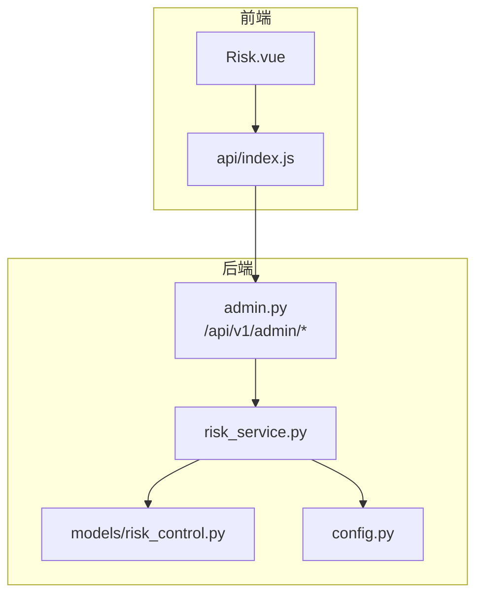
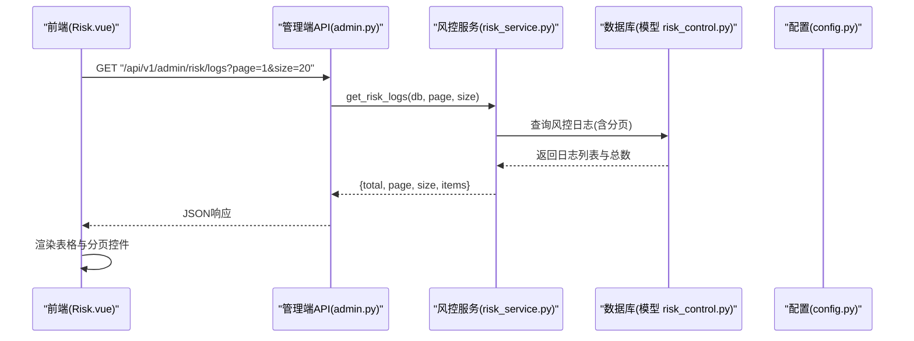
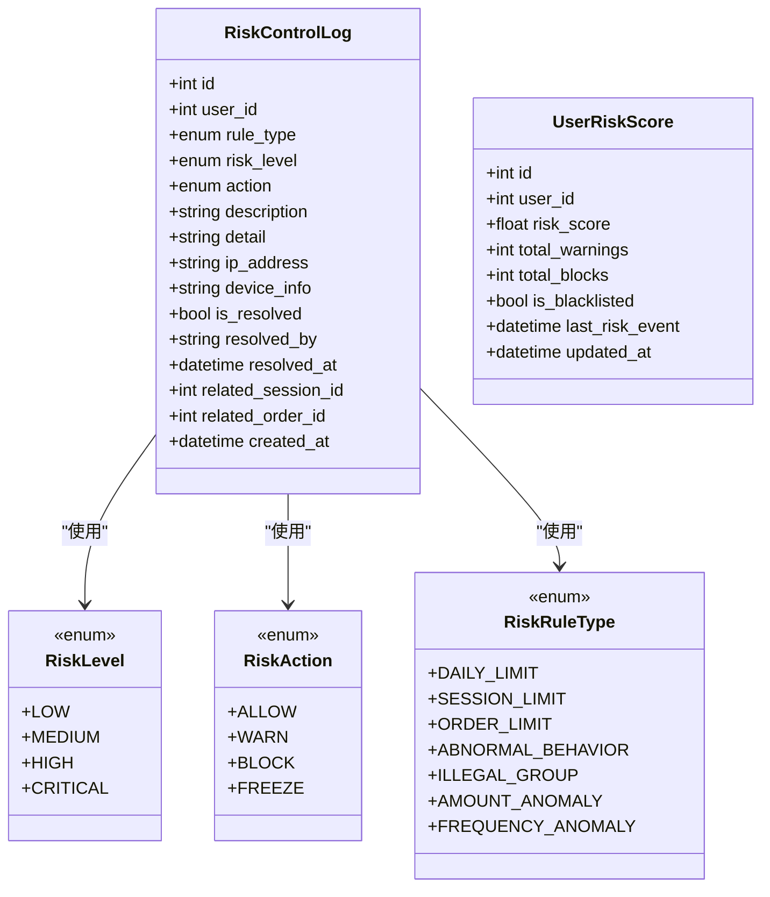
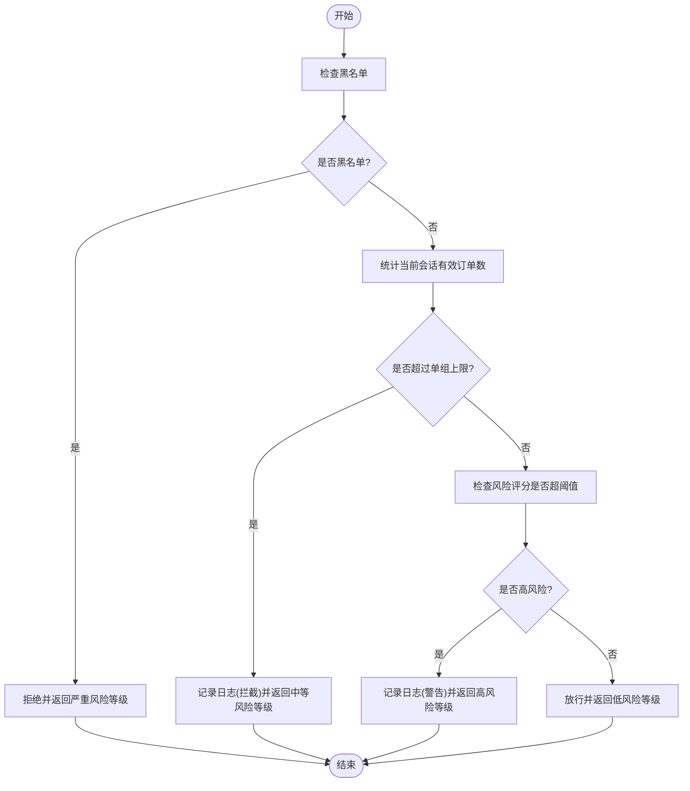
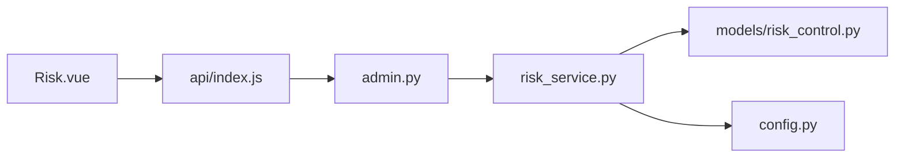

# 风控监控接口

<cite>
**本文引用的文件**   
- [backend/app/models/risk_control.py](file://backend/app/models/risk_control.py)
- [backend/app/services/risk_service.py](file://backend/app/services/risk_service.py)
- [backend/app/api/v1/admin.py](file://backend/app/api/v1/admin.py)
- [backend/app/config.py](file://backend/app/config.py)
- [frontend/web-admin/src/views/Risk.vue](file://frontend/web-admin/src/views/Risk.vue)
- [frontend/web-admin/src/api/index.js](file://frontend/web-admin/src/api/index.js)
</cite>

## 目录
1. [简介](#简介)
2. [项目结构](#项目结构)
3. [核心组件](#核心组件)
4. [架构总览](#架构总览)
5. [详细组件分析](#详细组件分析)
6. [依赖关系分析](#依赖关系分析)
7. [性能考虑](#性能考虑)
8. [故障排查指南](#故障排查指南)
9. [结论](#结论)
10. [附录](#附录)

## 简介
本文件为 AIxingmu 项目的“风控监控接口”文档，聚焦于风险控制的监控与管理能力，包括：
- 风控日志查询（分页、筛选）
- 异常行为检测与评分更新
- 风险预警与黑名单管理
- 规则类型与处理流程说明
- 前端页面调用示例与结果字段解读

该文档面向运营与研发人员，既提供API层面的规范，也给出数据模型与处理逻辑的可视化说明。

## 项目结构
与风控监控相关的主要代码位于后端服务与前端管理后台中：
- 后端数据模型定义在 models/risk_control.py
- 风控业务逻辑在 services/risk_service.py
- 管理端API路由在 api/v1/admin.py
- 配置项在 config.py
- 前端风控页面在 web-admin/src/views/Risk.vue
- 前端API封装在 web-admin/src/api/index.js

图表来源
- [backend/app/api/v1/admin.py:71-79](file://backend/app/api/v1/admin.py#L71-L79)
- [backend/app/services/risk_service.py:14-134](file://backend/app/services/risk_service.py#L14-L134)
- [backend/app/models/risk_control.py:40-84](file://backend/app/models/risk_control.py#L40-L84)
- [backend/app/config.py:42-58](file://backend/app/config.py#L42-L58)
- [frontend/web-admin/src/views/Risk.vue:104-186](file://frontend/web-admin/src/views/Risk.vue#L104-L186)
- [frontend/web-admin/src/api/index.js:72-77](file://frontend/web-admin/src/api/index.js#L72-L77)

章节来源
- [backend/app/models/risk_control.py:40-84](file://backend/app/models/risk_control.py#L40-L84)
- [backend/app/services/risk_service.py:14-134](file://backend/app/services/risk_service.py#L14-L134)
- [backend/app/api/v1/admin.py:71-79](file://backend/app/api/v1/admin.py#L71-L79)
- [backend/app/config.py:42-58](file://backend/app/config.py#L42-L58)
- [frontend/web-admin/src/views/Risk.vue:104-186](file://frontend/web-admin/src/views/Risk.vue#L104-L186)
- [frontend/web-admin/src/api/index.js:72-77](file://frontend/web-admin/src/api/index.js#L72-L77)

## 核心组件
- 数据模型
  - 风控日志表：记录每次风控事件的关键信息，包含用户ID、规则类型、风险等级、执行动作、描述、详情、IP、设备、处理状态、关联会话/订单、创建时间等，并建立索引以优化查询。
  - 用户风险评分表：维护用户风险评分、累计警告/拦截次数、是否黑名单、最近风控事件时间与更新时间。
- 服务层
  - 参团风控检查：校验黑名单、单组参与上限、风险评分阈值，必要时记录日志并返回允许/拒绝及风险等级。
  - 风险评分更新：根据事件类型累加风险分，超过阈值自动加入黑名单。
  - 风控日志查询：支持按用户ID、风险等级过滤，分页返回总数与列表。
- 管理端API
  - 获取风控日志：GET /api/v1/admin/risk/logs，支持分页参数。
- 前端
  - 风控概览与日志列表展示，支持分页与规则筛选；黑名单管理（查看、添加、移除）。

章节来源
- [backend/app/models/risk_control.py:40-84](file://backend/app/models/risk_control.py#L40-L84)
- [backend/app/services/risk_service.py:17-134](file://backend/app/services/risk_service.py#L17-L134)
- [backend/app/api/v1/admin.py:71-79](file://backend/app/api/v1/admin.py#L71-L79)
- [frontend/web-admin/src/views/Risk.vue:104-186](file://frontend/web-admin/src/views/Risk.vue#L104-L186)
- [frontend/web-admin/src/api/index.js:72-77](file://frontend/web-admin/src/api/index.js#L72-L77)

## 架构总览
风控监控的整体交互流程如下：
- 前端通过 axios 封装的请求访问管理端API
- 管理端路由将请求委派给风控服务
- 风控服务读取/写入数据库模型，结合配置进行规则判断与统计
- 前端渲染风控日志与统计面板，并提供黑名单管理能力

图表来源
- [frontend/web-admin/src/api/index.js:72-77](file://frontend/web-admin/src/api/index.js#L72-L77)
- [backend/app/api/v1/admin.py:71-79](file://backend/app/api/v1/admin.py#L71-L79)
- [backend/app/services/risk_service.py:109-134](file://backend/app/services/risk_service.py#L109-L134)
- [backend/app/models/risk_control.py:40-70](file://backend/app/models/risk_control.py#L40-L70)

## 详细组件分析

### 数据模型与枚举
- 风险等级：低、中、高、严重
- 风控动作：放行、警告、拦截、冻结账号
- 规则类型：单日参与上限、单场参与上限、单ID单组最多N单、异常操作检测、违规开团检测、金额异常检测、频率异常检测
- 风控日志字段：用户ID、规则类型、风险等级、动作、描述、详情(JSON)、IP地址、设备信息、是否已处理、处理人、处理时间、关联会话ID、关联订单ID、创建时间
- 用户风险评分字段：用户ID、风险评分(0-100)、累计警告次数、累计拦截次数、是否黑名单、最近风控事件时间、更新时间

图表来源
- [backend/app/models/risk_control.py:13-38](file://backend/app/models/risk_control.py#L13-L38)
- [backend/app/models/risk_control.py:40-84](file://backend/app/models/risk_control.py#L40-L84)

章节来源
- [backend/app/models/risk_control.py:13-38](file://backend/app/models/risk_control.py#L13-L38)
- [backend/app/models/risk_control.py:40-84](file://backend/app/models/risk_control.py#L40-L84)

### 风控服务与规则处理
- 参团风控检查流程
  - 黑名单检查：若用户在黑名单则直接拒绝
  - 单组参与上限：统计用户当前会话下有效订单数，超过配置上限则拦截并记录日志
  - 风险评分阈值：若评分超过阈值则发出警告并记录日志，但仍允许继续
- 风险评分更新
  - 根据事件类型增加分数，累计警告次数，并设置最近风控事件时间
  - 当评分达到或超过阈值时，自动标记为黑名单
- 风控日志查询
  - 支持按用户ID与风险等级过滤
  - 返回总数与分页后的日志列表

图表来源
- [backend/app/services/risk_service.py:17-74](file://backend/app/services/risk_service.py#L17-L74)
- [backend/app/config.py:58](file://backend/app/config.py#L58)

章节来源
- [backend/app/services/risk_service.py:17-74](file://backend/app/services/risk_service.py#L17-L74)
- [backend/app/services/risk_service.py:76-107](file://backend/app/services/risk_service.py#L76-L107)
- [backend/app/services/risk_service.py:109-134](file://backend/app/services/risk_service.py#L109-L134)
- [backend/app/config.py:58](file://backend/app/config.py#L58)

### 管理端API定义
- 获取风控日志
  - 方法：GET
  - 路径：/api/v1/admin/risk/logs
  - 查询参数：
    - page：页码，默认1
    - size：每页条数，默认20
  - 返回结构：
    - total：总记录数
    - page：当前页码
    - size：每页大小
    - items：风控日志对象数组
- 其他风控相关API（由前端调用，后端实现待补充）
  - 获取风控统计：GET /api/v1/admin/risk/stats
  - 获取黑名单列表：GET /api/v1/admin/risk/blacklist
  - 添加黑名单：POST /api/v1/admin/risk/blacklist
  - 移除黑名单：DELETE /api/v1/admin/risk/blacklist/{user_id}

章节来源
- [backend/app/api/v1/admin.py:71-79](file://backend/app/api/v1/admin.py#L71-L79)
- [frontend/web-admin/src/api/index.js:72-77](file://frontend/web-admin/src/api/index.js#L72-L77)

### 前端调用示例与结果分析
- 发起请求
  - 通过封装的axios实例访问 /api/v1/admin/risk/logs，传入 page 与 size
  - 同时可传入 rule_type 用于筛选（前端传递，后端需扩展支持）
- 渲染与交互
  - 展示今日拦截、黑名单数量、高风险用户数、平均风险评分等统计卡片
  - 表格列包含：用户ID、手机号、原因、动作、风险评分、详情、触发时间
  - 分页控件绑定 current-page 与 total，切换页码重新加载
  - 黑名单弹窗支持添加与移除操作
- 结果字段解读
  - items 中的每条记录对应风控日志对象，包含用户ID、规则类型、风险等级、动作、描述、详情、触发时间等
  - total 用于计算分页总数

章节来源
- [frontend/web-admin/src/api/index.js:72-77](file://frontend/web-admin/src/api/index.js#L72-L77)
- [frontend/web-admin/src/views/Risk.vue:104-186](file://frontend/web-admin/src/views/Risk.vue#L104-L186)

## 依赖关系分析
- 模块耦合
  - admin.py 依赖 risk_service.py 提供的风控服务方法
  - risk_service.py 依赖 models/risk_control.py 的数据模型以及 config.py 的配置项
  - 前端 Risk.vue 通过 api/index.js 调用管理端API
- 外部依赖
  - 数据库：PostgreSQL（异步驱动）
  - Redis/Celery：用于缓存与任务队列（风控可扩展为异步任务）
  - MinIO：对象存储（与风控无直接耦合）

图表来源
- [backend/app/api/v1/admin.py:71-79](file://backend/app/api/v1/admin.py#L71-L79)
- [backend/app/services/risk_service.py:14-134](file://backend/app/services/risk_service.py#L14-L134)
- [backend/app/models/risk_control.py:40-84](file://backend/app/models/risk_control.py#L40-L84)
- [backend/app/config.py:42-58](file://backend/app/config.py#L42-L58)
- [frontend/web-admin/src/api/index.js:72-77](file://frontend/web-admin/src/api/index.js#L72-L77)
- [frontend/web-admin/src/views/Risk.vue:104-186](file://frontend/web-admin/src/views/Risk.vue#L104-L186)

章节来源
- [backend/app/api/v1/admin.py:71-79](file://backend/app/api/v1/admin.py#L71-L79)
- [backend/app/services/risk_service.py:14-134](file://backend/app/services/risk_service.py#L14-L134)
- [backend/app/models/risk_control.py:40-84](file://backend/app/models/risk_control.py#L40-L84)
- [backend/app/config.py:42-58](file://backend/app/config.py#L42-L58)
- [frontend/web-admin/src/api/index.js:72-77](file://frontend/web-admin/src/api/index.js#L72-L77)
- [frontend/web-admin/src/views/Risk.vue:104-186](file://frontend/web-admin/src/views/Risk.vue#L104-L186)

## 性能考虑
- 索引优化
  - 风控日志表针对 user_id 与 created_at 建立复合索引，提升按用户与时间的查询效率
  - 针对 risk_level 建立索引，便于按风险等级筛选
- 分页策略
  - 使用 offset/limit 实现分页，建议合理设置 size，避免过大导致数据库压力
- 并发与异步
  - 使用异步数据库会话，提高并发处理能力
- 扩展建议
  - 对高频查询（如统计面板）引入Redis缓存
  - 将黑名单检查与评分更新下沉为独立服务或消息队列任务，降低主链路延迟

[本节为通用性能指导，不直接分析具体文件]

## 故障排查指南
- 常见问题
  - 分页参数错误：page 或 size 非正整数会导致查询异常，需在服务端做参数校验
  - 筛选条件缺失：前端传入了 rule_type 但后端未实现，将忽略该条件
  - 黑名单操作失败：前后端接口不一致或权限不足，需检查路由与认证
- 定位步骤
  - 确认前端请求路径与参数是否正确
  - 检查后端路由是否存在对应实现
  - 查看数据库索引与数据量，评估查询性能
  - 核对配置项（如单组上限）是否符合预期

章节来源
- [backend/app/api/v1/admin.py:71-79](file://backend/app/api/v1/admin.py#L71-L79)
- [backend/app/services/risk_service.py:109-134](file://backend/app/services/risk_service.py#L109-L134)
- [frontend/web-admin/src/api/index.js:72-77](file://frontend/web-admin/src/api/index.js#L72-L77)

## 结论
AIxingmu 的风控监控体系以数据模型为基础，通过服务层实现规则判断与评分更新，并以管理端API暴露查询与管理能力。前端提供了直观的风控概览与日志列表，支持分页与黑名单管理。建议在后续迭代中完善统计与黑名单接口的后端实现，增强筛选维度与实时性，并结合缓存与异步任务提升整体性能。

[本节为总结性内容，不直接分析具体文件]

## 附录

### API参考
- 获取风控日志
  - 方法：GET
  - 路径：/api/v1/admin/risk/logs
  - 查询参数：
    - page：页码，默认1
    - size：每页条数，默认20
  - 返回字段：
    - total：总记录数
    - page：当前页码
    - size：每页大小
    - items：风控日志对象数组
- 风控统计（前端调用，后端实现待补充）
  - 方法：GET
  - 路径：/api/v1/admin/risk/stats
- 黑名单管理（前端调用，后端实现待补充）
  - 获取列表：GET /api/v1/admin/risk/blacklist
  - 添加：POST /api/v1/admin/risk/blacklist
  - 移除：DELETE /api/v1/admin/risk/blacklist/{user_id}

章节来源
- [backend/app/api/v1/admin.py:71-79](file://backend/app/api/v1/admin.py#L71-L79)
- [frontend/web-admin/src/api/index.js:72-77](file://frontend/web-admin/src/api/index.js#L72-L77)

### 数据模型参考
- 风控日志表字段
  - id、user_id、rule_type、risk_level、action、description、detail、ip_address、device_info、is_resolved、resolved_by、resolved_at、related_session_id、related_order_id、created_at
- 用户风险评分表字段
  - id、user_id、risk_score、total_warnings、total_blocks、is_blacklisted、last_risk_event、updated_at

章节来源
- [backend/app/models/risk_control.py:40-84](file://backend/app/models/risk_control.py#L40-L84)

### 规则与配置参考
- 规则类型
  - 单日参与上限、单场参与上限、单ID单组最多N单、异常操作检测、违规开团检测、金额异常检测、频率异常检测
- 关键配置
  - 单ID单组最多订单数：GROUP_BUY_MAX_ORDERS_PER_USER

章节来源
- [backend/app/models/risk_control.py:29-38](file://backend/app/models/risk_control.py#L29-L38)
- [backend/app/config.py:58](file://backend/app/config.py#L58)