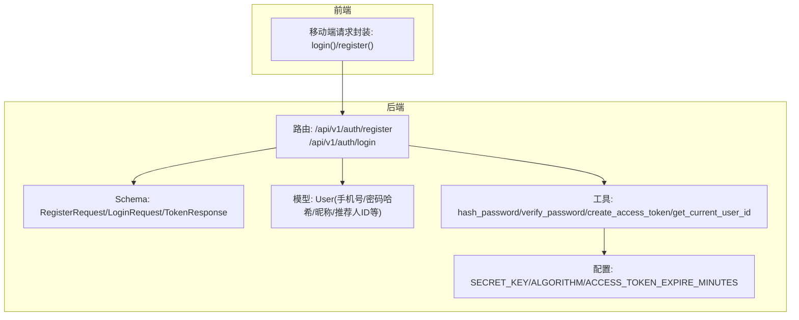
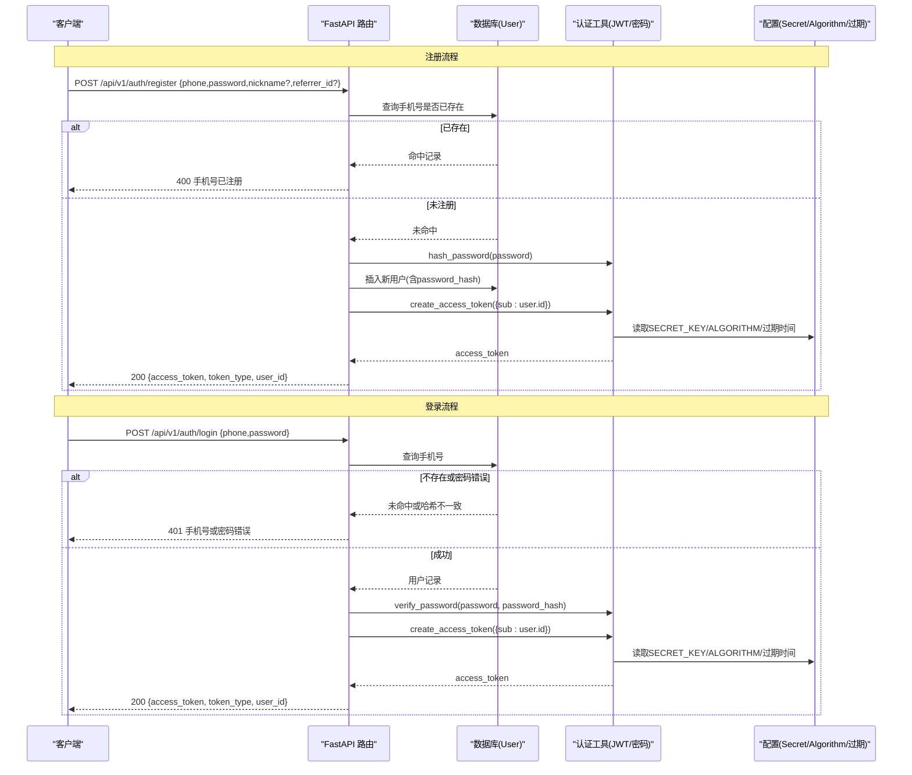
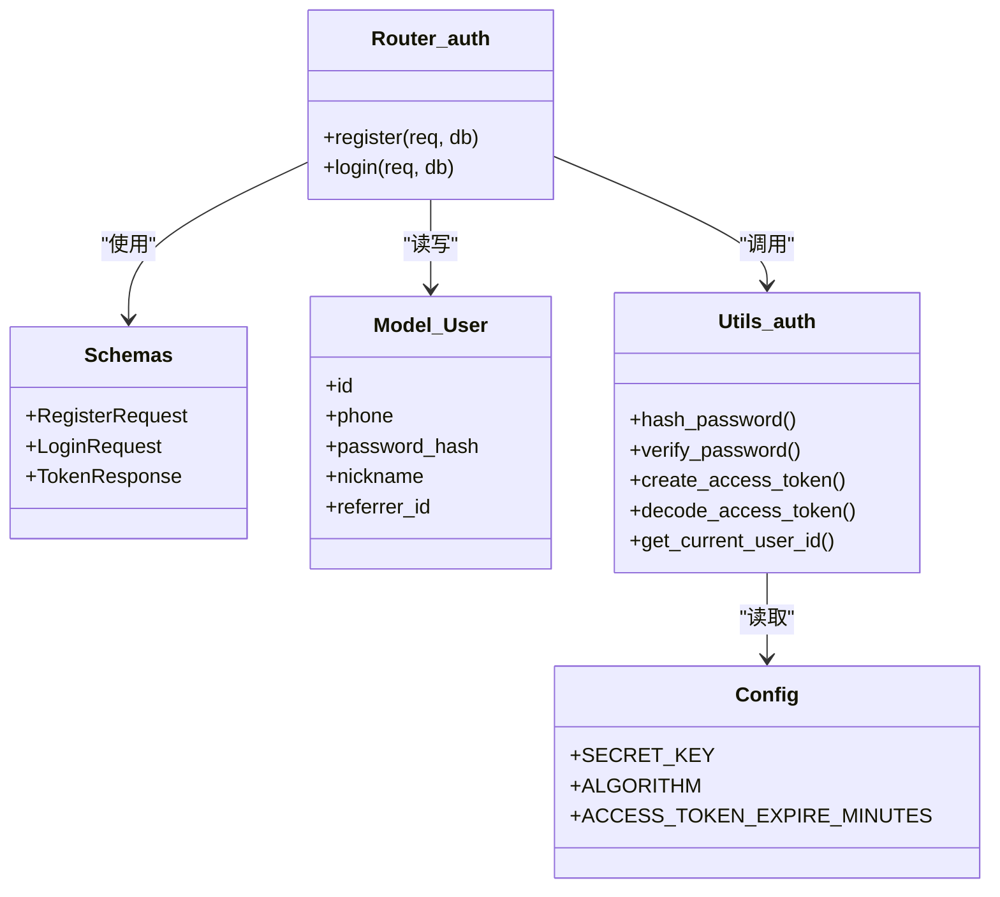

# 认证接口

<cite>
**本文引用的文件**   
- [backend/app/api/v1/auth.py](file://backend/app/api/v1/auth.py)
- [backend/app/schemas/main.py](file://backend/app/schemas/main.py)
- [backend/app/models/user.py](file://backend/app/models/user.py)
- [backend/app/utils/auth.py](file://backend/app/utils/auth.py)
- [backend/app/config.py](file://backend/app/config.py)
- [frontend/mobile-app/api/index.js](file://frontend/mobile-app/api/index.js)
</cite>

## 目录
1. [简介](#简介)
2. [项目结构](#项目结构)
3. [核心组件](#核心组件)
4. [架构总览](#架构总览)
5. [详细组件分析](#详细组件分析)
6. [依赖关系分析](#依赖关系分析)
7. [性能与安全考虑](#性能与安全考虑)
8. [故障排查指南](#故障排查指南)
9. [结论](#结论)
10. [附录：客户端集成示例](#附录客户端集成示例)

## 简介
本文件为 AIxingmu 项目的认证子系统提供完整接口文档，覆盖用户注册与登录两大端点。内容包括请求参数、响应格式、错误码与处理策略、JWT 令牌生成机制、密码加密算法、会话管理策略，以及前端调用示例与最佳实践。

## 项目结构
认证相关代码主要位于后端 FastAPI 应用的路由层、数据模型、工具函数与配置中；移动端通过统一请求封装调用认证接口。

图表来源
- [backend/app/api/v1/auth.py:1-43](file://backend/app/api/v1/auth.py#L1-L43)
- [backend/app/schemas/main.py:10-24](file://backend/app/schemas/main.py#L10-L24)
- [backend/app/models/user.py:26-71](file://backend/app/models/user.py#L26-L71)
- [backend/app/utils/auth.py:16-50](file://backend/app/utils/auth.py#L16-L50)
- [backend/app/config.py:28-31](file://backend/app/config.py#L28-L31)
- [frontend/mobile-app/api/index.js:34-36](file://frontend/mobile-app/api/index.js#L34-L36)

章节来源
- [backend/app/api/v1/auth.py:1-43](file://backend/app/api/v1/auth.py#L1-L43)
- [backend/app/schemas/main.py:10-24](file://backend/app/schemas/main.py#L10-L24)
- [backend/app/models/user.py:26-71](file://backend/app/models/user.py#L26-L71)
- [backend/app/utils/auth.py:16-50](file://backend/app/utils/auth.py#L16-L50)
- [backend/app/config.py:28-31](file://backend/app/config.py#L28-L31)
- [frontend/mobile-app/api/index.js:34-36](file://frontend/mobile-app/api/index.js#L34-L36)

## 核心组件
- 认证路由
  - POST /api/v1/auth/register：用户注册并返回访问令牌与用户ID
  - POST /api/v1/auth/login：用户登录并返回访问令牌与用户ID
- 数据模型
  - User：存储手机号、密码哈希、昵称、推荐人ID等
- Schema
  - RegisterRequest：注册请求体（手机号、密码、可选昵称、可选推荐人ID）
  - LoginRequest：登录请求体（手机号、密码）
  - TokenResponse：响应体（access_token、token_type、user_id）
- 安全工具
  - 密码哈希与校验：bcrypt
  - JWT 签发与解码：HS256，基于配置的密钥与过期时间
  - 鉴权依赖：从 Authorization: Bearer <token> 提取当前用户ID
- 配置
  - SECRET_KEY、ALGORITHM、ACCESS_TOKEN_EXPIRE_MINUTES

章节来源
- [backend/app/api/v1/auth.py:14-42](file://backend/app/api/v1/auth.py#L14-L42)
- [backend/app/schemas/main.py:10-24](file://backend/app/schemas/main.py#L10-L24)
- [backend/app/models/user.py:26-71](file://backend/app/models/user.py#L26-L71)
- [backend/app/utils/auth.py:16-50](file://backend/app/utils/auth.py#L16-L50)
- [backend/app/config.py:28-31](file://backend/app/config.py#L28-L31)

## 架构总览
认证流程采用“无状态”的 JWT 方案：服务端不维护会话，客户端在后续请求头携带 Bearer Token 完成身份识别。

图表来源
- [backend/app/api/v1/auth.py:14-42](file://backend/app/api/v1/auth.py#L14-L42)
- [backend/app/utils/auth.py:24-36](file://backend/app/utils/auth.py#L24-L36)
- [backend/app/config.py:28-31](file://backend/app/config.py#L28-L31)
- [backend/app/models/user.py:26-71](file://backend/app/models/user.py#L26-L71)

## 详细组件分析

### 注册接口 POST /api/v1/auth/register
- 功能说明
  - 校验手机号唯一性
  - 使用 bcrypt 对密码进行哈希后入库
  - 若未提供昵称，则按规则生成默认昵称
  - 支持可选推荐人ID
  - 成功后签发 JWT 并返回 access_token 与 user_id
- 请求路径与方法
  - POST /api/v1/auth/register
- 请求体字段
  - phone: 字符串，必填，用于唯一标识用户
  - password: 字符串，必填，最小长度6位
  - nickname: 字符串，可选，未提供时自动生成
  - referrer_id: 整数，可选，推荐人用户ID
- 响应体字段
  - access_token: 字符串，JWT 访问令牌
  - token_type: 字符串，固定为 bearer
  - user_id: 整数，新注册用户ID
- 错误处理
  - 400：手机号已注册
  - 其他：由框架抛出的通用异常（如参数校验失败）
- 业务细节
  - 密码加密：bcrypt
  - 默认昵称：当 nickname 为空时，系统根据手机号末四位生成
  - 推荐关系：将 referrer_id 写入用户记录，便于后续分润与统计

章节来源
- [backend/app/api/v1/auth.py:14-31](file://backend/app/api/v1/auth.py#L14-L31)
- [backend/app/schemas/main.py:10-14](file://backend/app/schemas/main.py#L10-L14)
- [backend/app/models/user.py:26-71](file://backend/app/models/user.py#L26-L71)
- [backend/app/utils/auth.py:16-17](file://backend/app/utils/auth.py#L16-L17)

### 登录接口 POST /api/v1/auth/login
- 功能说明
  - 根据手机号查找用户
  - 校验密码是否正确
  - 成功后签发 JWT 并返回 access_token 与 user_id
- 请求路径与方法
  - POST /api/v1/auth/login
- 请求体字段
  - phone: 字符串，必填
  - password: 字符串，必填
- 响应体字段
  - access_token: 字符串，JWT 访问令牌
  - token_type: 字符串，固定为 bearer
  - user_id: 整数，登录用户ID
- 错误处理
  - 401：手机号或密码错误
- 业务细节
  - 密码校验：bcrypt.verify
  - 令牌载荷：包含用户ID（sub），有效期由配置决定

章节来源
- [backend/app/api/v1/auth.py:34-42](file://backend/app/api/v1/auth.py#L34-L42)
- [backend/app/schemas/main.py:16-24](file://backend/app/schemas/main.py#L16-L24)
- [backend/app/utils/auth.py:20-21](file://backend/app/utils/auth.py#L20-L21)

### JWT 令牌机制与会话管理
- 令牌生成
  - 算法：HS256
  - 密钥：来自配置项 SECRET_KEY
  - 过期时间：ACCESS_TOKEN_EXPIRE_MINUTES（默认24小时）
  - 载荷：包含用户ID（sub）
- 令牌验证
  - 解析：decode_access_token
  - 依赖注入：get_current_user_id 从 Authorization: Bearer <token> 中提取并校验用户ID
- 会话策略
  - 无状态：服务端不保存会话，所有受保护接口通过 Bearer Token 鉴权
  - 刷新策略：当前实现未提供刷新接口，建议结合前端缓存与过期提示实现体验优化

章节来源
- [backend/app/utils/auth.py:24-50](file://backend/app/utils/auth.py#L24-L50)
- [backend/app/config.py:28-31](file://backend/app/config.py#L28-L31)

### 密码加密算法
- 算法：bcrypt
- 用途：注册时对明文密码进行哈希存储；登录时进行比对
- 安全性：盐值随机化，抗彩虹表攻击

章节来源
- [backend/app/utils/auth.py:12-21](file://backend/app/utils/auth.py#L12-L21)

### 数据模型与约束
- 用户表关键字段
  - phone：唯一索引，用于登录与去重
  - password_hash：存储 bcrypt 哈希结果
  - nickname：可选，未提供时自动生成
  - referrer_id：外键，指向推荐人用户ID
- 索引与关联
  - 针对 role、referrer_id、store_id 建立索引以提升查询性能
  - 与订单、贡献值、积分、消费券等模块存在一对多关系

章节来源
- [backend/app/models/user.py:26-71](file://backend/app/models/user.py#L26-L71)

## 依赖关系分析

图表来源
- [backend/app/api/v1/auth.py:1-43](file://backend/app/api/v1/auth.py#L1-L43)
- [backend/app/schemas/main.py:10-24](file://backend/app/schemas/main.py#L10-L24)
- [backend/app/models/user.py:26-71](file://backend/app/models/user.py#L26-L71)
- [backend/app/utils/auth.py:16-50](file://backend/app/utils/auth.py#L16-L50)
- [backend/app/config.py:28-31](file://backend/app/config.py#L28-L31)

章节来源
- [backend/app/api/v1/auth.py:1-43](file://backend/app/api/v1/auth.py#L1-L43)
- [backend/app/schemas/main.py:10-24](file://backend/app/schemas/main.py#L10-L24)
- [backend/app/models/user.py:26-71](file://backend/app/models/user.py#L26-L71)
- [backend/app/utils/auth.py:16-50](file://backend/app/utils/auth.py#L16-L50)
- [backend/app/config.py:28-31](file://backend/app/config.py#L28-L31)

## 性能与安全考虑
- 性能
  - 注册/登录涉及一次数据库查询与一次写操作（注册），应确保数据库连接池与索引合理
  - JWT 签发与校验为轻量计算，开销可控
- 安全
  - 密码使用 bcrypt 哈希，避免明文存储
  - JWT 使用 HS256 与强密钥，生产环境需更换 SECRET_KEY
  - 建议启用 HTTPS，防止中间人窃听
  - 建议增加登录频率限制与风控策略（当前未实现）
  - 建议引入刷新令牌机制以改善用户体验与安全性平衡

[本节为通用指导，无需源码引用]

## 故障排查指南
- 常见错误
  - 400 手机号已注册：检查手机号是否已在系统中存在
  - 401 手机号或密码错误：核对手机号与密码组合
  - 401 无效的认证凭据/无效的Token：检查 Authorization 头是否为 Bearer 且 token 未过期
- 定位步骤
  - 确认请求体字段是否符合 Schema 定义
  - 检查数据库连接与用户记录是否存在
  - 查看 JWT 配置（密钥、算法、过期时间）是否与客户端一致
  - 前端日志中捕获 401 跳转逻辑，确认 token 是否被正确清理与重新登录

章节来源
- [backend/app/api/v1/auth.py:18-39](file://backend/app/api/v1/auth.py#L18-L39)
- [backend/app/utils/auth.py:42-49](file://backend/app/utils/auth.py#L42-L49)
- [frontend/mobile-app/api/index.js:21-27](file://frontend/mobile-app/api/index.js#L21-L27)

## 结论
AIxingmu 的认证子系统采用标准的 REST + JWT 模式，具备清晰的请求/响应规范与安全的密码存储策略。通过无状态令牌与统一的鉴权依赖，可快速扩展受保护接口。建议在后续版本中补充刷新令牌、登录限流与更完善的错误码体系，以提升安全性与用户体验。

[本节为总结，无需源码引用]

## 附录：客户端集成示例
以下示例展示如何在移动端使用统一请求封装调用认证接口，并在本地缓存 token，以便后续请求自动携带。

- 基础设置
  - BASE_URL = "/api/v1"
  - 请求头 Content-Type: application/json
  - 认证头 Authorization: Bearer <token>
- 注册
  - 方法：POST /auth/register
  - 请求体：{ phone, password, nickname?, referrer_id? }
  - 成功响应：{ access_token, token_type, user_id }
  - 失败：400 手机号已注册
- 登录
  - 方法：POST /auth/login
  - 请求体：{ phone, password }
  - 成功响应：{ access_token, token_type, user_id }
  - 失败：401 手机号或密码错误
- 前端封装要点
  - 从本地存储读取 token 并注入到请求头
  - 收到 401 时清除本地 token 并跳转到登录页
  - 注册/登录成功后保存 access_token 到本地存储

章节来源
- [frontend/mobile-app/api/index.js:4-36](file://frontend/mobile-app/api/index.js#L4-L36)
- [backend/app/api/v1/auth.py:14-42](file://backend/app/api/v1/auth.py#L14-L42)
- [backend/app/schemas/main.py:10-24](file://backend/app/schemas/main.py#L10-L24)