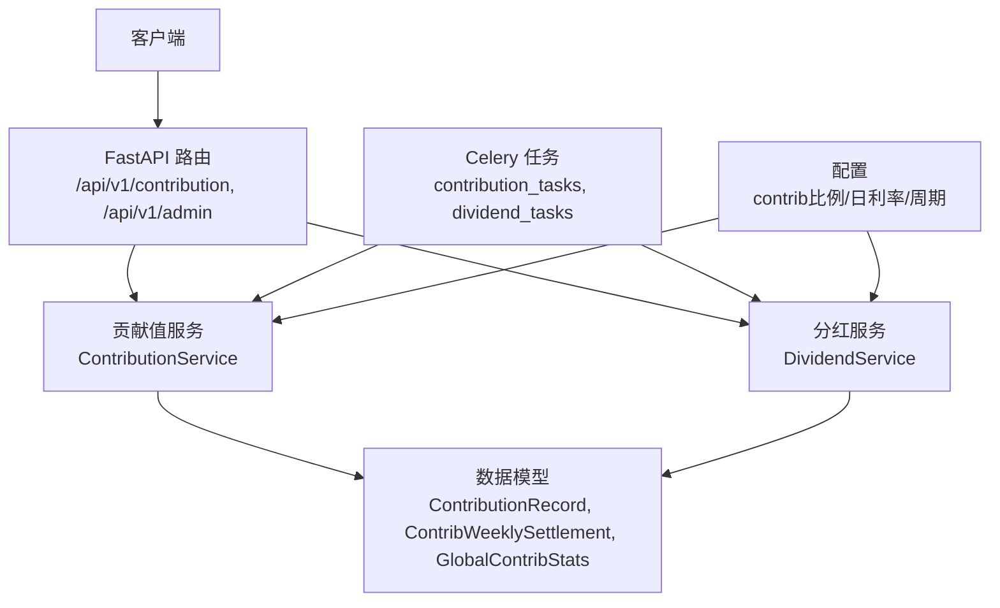
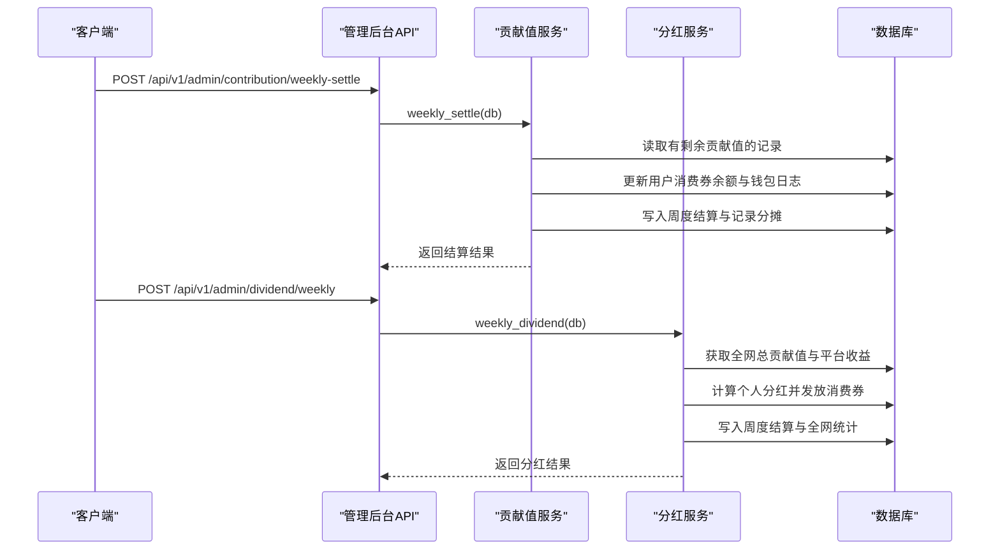
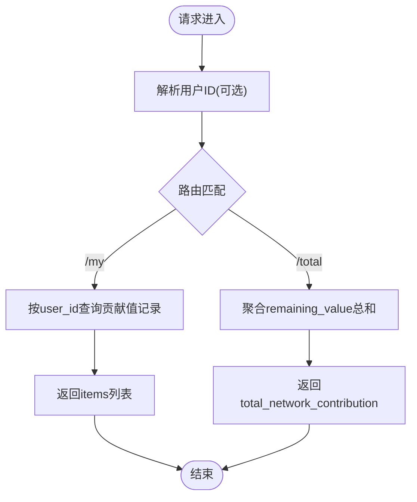
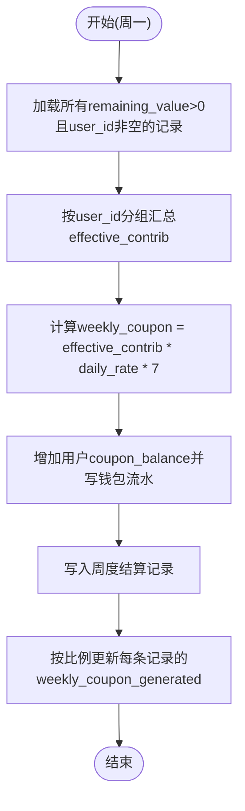
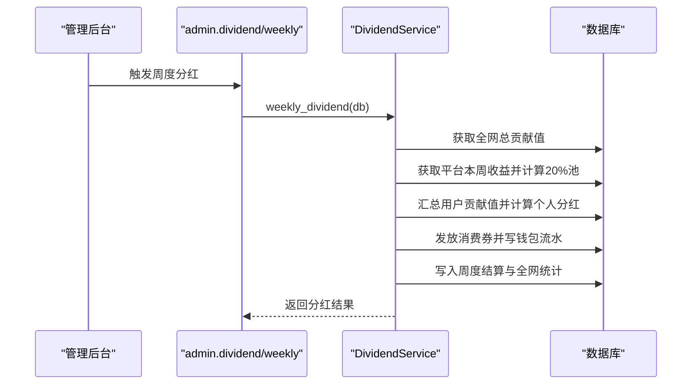
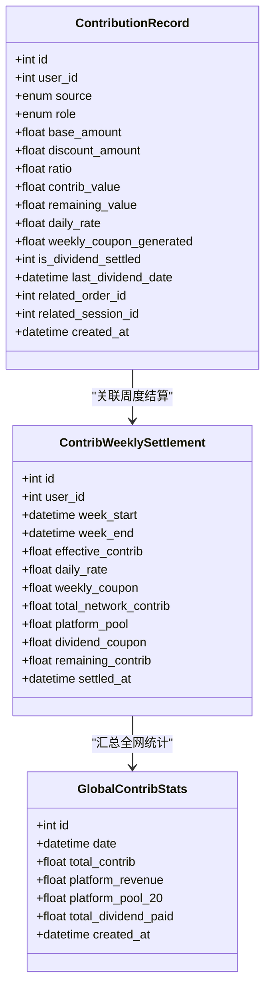
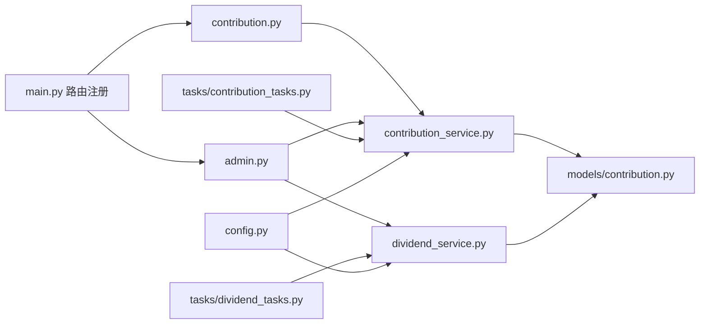
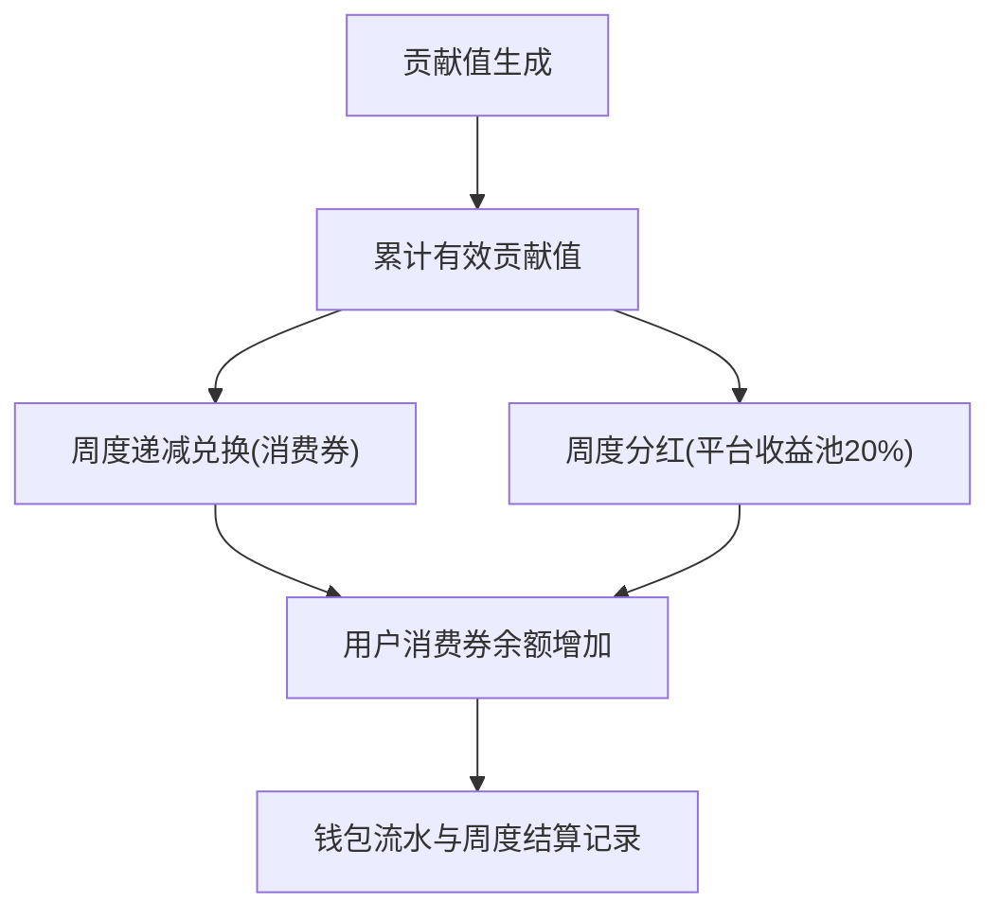

# 贡献值接口

<cite>
**本文引用的文件**   
- [backend/app/main.py](file://backend/app/main.py)
- [backend/app/api/v1/contribution.py](file://backend/app/api/v1/contribution.py)
- [backend/app/api/v1/admin.py](file://backend/app/api/v1/admin.py)
- [backend/app/services/contribution_service.py](file://backend/app/services/contribution_service.py)
- [backend/app/services/dividend_service.py](file://backend/app/services/dividend_service.py)
- [backend/app/models/contribution.py](file://backend/app/models/contribution.py)
- [backend/app/tasks/contribution_tasks.py](file://backend/app/tasks/contribution_tasks.py)
- [backend/app/tasks/dividend_tasks.py](file://backend/app/tasks/dividend_tasks.py)
- [backend/app/config.py](file://backend/app/config.py)
</cite>

## 目录
1. [简介](#简介)
2. [项目结构](#项目结构)
3. [核心组件](#核心组件)
4. [架构总览](#架构总览)
5. [详细组件分析](#详细组件分析)
6. [依赖关系分析](#依赖关系分析)
7. [性能与扩展性](#性能与扩展性)
8. [故障排查指南](#故障排查指南)
9. [结论](#结论)
10. [附录：调用示例与业务规则](#附录调用示例与业务规则)

## 简介
本文件为 AIxingmu 项目的“贡献值系统”接口文档，覆盖以下能力：
- 贡献值查询：我的贡献值记录、全网总贡献值
- 分红计算：周度全网贡献值分红（平台收益池20%按贡献值占比分配）
- 兑换操作：周度递减兑换（消费券=有效贡献值×日利率×7）
- 历史记录与明细：贡献值流水、周度结算与分红明细
- 经济模型与流转：贡献值生成规则、周度分红机制、递减兑换算法在接口中的实现

## 项目结构
贡献值相关代码主要分布在 API 层、服务层、数据模型层与定时任务层。API 路由通过主应用注册到 /api/v1 前缀下，服务层封装核算与结算逻辑，模型层定义贡献值、周度结算与全局统计等表结构，任务层负责每周/每日的自动化执行。

图表来源
- [backend/app/main.py:57-67](file://backend/app/main.py#L57-L67)
- [backend/app/api/v1/contribution.py:1-27](file://backend/app/api/v1/contribution.py#L1-L27)
- [backend/app/api/v1/admin.py:45-56](file://backend/app/api/v1/admin.py#L45-L56)
- [backend/app/services/contribution_service.py:16-261](file://backend/app/services/contribution_service.py#L16-L261)
- [backend/app/services/dividend_service.py:16-136](file://backend/app/services/dividend_service.py#L16-L136)
- [backend/app/models/contribution.py:32-115](file://backend/app/models/contribution.py#L32-L115)
- [backend/app/tasks/contribution_tasks.py:15-28](file://backend/app/tasks/contribution_tasks.py#L15-L28)
- [backend/app/tasks/dividend_tasks.py:15-25](file://backend/app/tasks/dividend_tasks.py#L15-L25)
- [backend/app/config.py:60-105](file://backend/app/config.py#L60-L105)

章节来源
- [backend/app/main.py:57-67](file://backend/app/main.py#L57-L67)

## 核心组件
- 贡献值服务 ContributionService
  - 贡献值生成：基于让利金额×分配比例×乘数，支持消费者、商家、推荐方、代理、平台六大角色
  - 周度递减兑换：每周一按有效贡献值×日利率×7发放消费券，剩余贡献值继续参与下期
  - 查询接口：用户贡献值记录、全网总贡献值
- 分红服务 DividendService
  - 周度分红：个人分红=个人贡献值/全网总贡献值×平台20%收益池
  - 记录周度结算与全网统计
- 数据模型
  - ContributionRecord：贡献值记录（含让利金额、分配比例、贡献值、剩余可兑换、是否已分红等）
  - ContribWeeklySettlement：周度结算（含有效贡献值、日利率、本周兑换消费券、分红消费券、剩余贡献值）
  - GlobalContribStats：全网贡献值统计（用于分红计算）
- 定时任务
  - 每日凌晨检查并仅在周一执行递减兑换
  - 每周一凌晨触发分红任务

章节来源
- [backend/app/services/contribution_service.py:16-261](file://backend/app/services/contribution_service.py#L16-L261)
- [backend/app/services/dividend_service.py:16-136](file://backend/app/services/dividend_service.py#L16-L136)
- [backend/app/models/contribution.py:32-115](file://backend/app/models/contribution.py#L32-L115)
- [backend/app/tasks/contribution_tasks.py:15-28](file://backend/app/tasks/contribution_tasks.py#L15-L28)
- [backend/app/tasks/dividend_tasks.py:15-25](file://backend/app/tasks/dividend_tasks.py#L15-L25)

## 架构总览
贡献值系统采用“API 路由 + 服务层 + 数据模型 + Celery 任务”的分层架构。API 暴露查询与手动触发接口；服务层实现核心算法与事务写入；模型层提供持久化结构；任务层保证周期性结算与分红的稳定执行。

图表来源
- [backend/app/api/v1/admin.py:45-56](file://backend/app/api/v1/admin.py#L45-L56)
- [backend/app/services/contribution_service.py:163-240](file://backend/app/services/contribution_service.py#L163-L240)
- [backend/app/services/dividend_service.py:20-123](file://backend/app/services/dividend_service.py#L20-L123)

## 详细组件分析

### 贡献值查询接口
- 端点
  - GET /api/v1/contribution/my
    - 功能：获取当前用户的贡献值记录列表
    - 鉴权：需要登录态（从上下文获取 user_id）
    - 响应：包含 items 数组（贡献值记录集合）
  - GET /api/v1/contribution/total
    - 功能：获取全网总贡献值（用于分红计算参考）
    - 响应：total_network_contribution 数值
- 关键实现
  - 用户贡献值查询：按 user_id 过滤并按创建时间倒序
  - 全网总贡献值：对 remaining_value > 0 的记录求和

图表来源
- [backend/app/api/v1/contribution.py:12-26](file://backend/app/api/v1/contribution.py#L12-L26)
- [backend/app/services/contribution_service.py:243-260](file://backend/app/services/contribution_service.py#L243-L260)

章节来源
- [backend/app/api/v1/contribution.py:1-27](file://backend/app/api/v1/contribution.py#L1-L27)
- [backend/app/services/contribution_service.py:243-260](file://backend/app/services/contribution_service.py#L243-L260)

### 周度递减兑换（消费券）
- 触发方式
  - 自动：Celery 任务每日凌晨检查，仅周一执行
  - 手动：管理后台接口 POST /api/v1/admin/contribution/weekly-settle
- 算法要点
  - 当周消费券 = 有效贡献值 × 日利率 × 7
  - 贡献值不扣减，继续参与下期
  - 将本周兑换的消费券按比例分摊到各条贡献值记录
- 数据落库
  - 更新用户 coupon_balance 并写入钱包流水
  - 写入 ContribWeeklySettlement 记录
  - 更新 ContributionRecord.weekly_coupon_generated

图表来源
- [backend/app/services/contribution_service.py:163-240](file://backend/app/services/contribution_service.py#L163-L240)
- [backend/app/tasks/contribution_tasks.py:15-28](file://backend/app/tasks/contribution_tasks.py#L15-L28)
- [backend/app/api/v1/admin.py:52-56](file://backend/app/api/v1/admin.py#L52-L56)

章节来源
- [backend/app/services/contribution_service.py:163-240](file://backend/app/services/contribution_service.py#L163-L240)
- [backend/app/tasks/contribution_tasks.py:15-28](file://backend/app/tasks/contribution_tasks.py#L15-L28)
- [backend/app/api/v1/admin.py:52-56](file://backend/app/api/v1/admin.py#L52-L56)

### 周度分红（平台收益池20%）
- 触发方式
  - 自动：Celery 任务每周一凌晨触发
  - 手动：管理后台接口 POST /api/v1/admin/dividend/weekly
- 算法要点
  - 个人消费券分红 = 个人贡献值 / 全网总贡献值 × 平台20%收益池
  - 分红后标记 is_dividend_settled=1 并记录 last_dividend_date
  - 贡献值不扣减，继续参与下期
- 数据落库
  - 更新用户 coupon_balance 并写入钱包流水
  - 写入 ContribWeeklySettlement 记录（含 total_network_contrib、platform_pool、dividend_coupon）
  - 写入 GlobalContribStats 全网统计

图表来源
- [backend/app/api/v1/admin.py:45-49](file://backend/app/api/v1/admin.py#L45-L49)
- [backend/app/services/dividend_service.py:20-123](file://backend/app/services/dividend_service.py#L20-L123)
- [backend/app/tasks/dividend_tasks.py:15-25](file://backend/app/tasks/dividend_tasks.py#L15-L25)

章节来源
- [backend/app/services/dividend_service.py:20-123](file://backend/app/services/dividend_service.py#L20-L123)
- [backend/app/tasks/dividend_tasks.py:15-25](file://backend/app/tasks/dividend_tasks.py#L15-L25)
- [backend/app/api/v1/admin.py:45-49](file://backend/app/api/v1/admin.py#L45-L49)

### 贡献值生成规则（接口侧）
- 说明
  - 贡献值由交易场景触发，在服务层按六大角色分别计算并落库
  - 公式：贡献值 = 让利金额 × 分配比例 × 乘数
  - 让利金额 = 消费金额 × 整体让利比例
- 角色与比例
  - 消费者、合作商家、推荐商家、推荐消费者、代理（省/市/区县合计）、平台
- 接口侧
  - 当前公开 API 未直接暴露“生成贡献值”的入口，通常由订单/拼团/门店消费流程在服务层调用贡献值服务完成

章节来源
- [backend/app/services/contribution_service.py:29-143](file://backend/app/services/contribution_service.py#L29-L143)
- [backend/app/config.py:60-70](file://backend/app/config.py#L60-L70)

### 数据结构与关系

图表来源
- [backend/app/models/contribution.py:32-115](file://backend/app/models/contribution.py#L32-L115)

章节来源
- [backend/app/models/contribution.py:32-115](file://backend/app/models/contribution.py#L32-L115)

## 依赖关系分析
- API 层依赖服务层进行业务处理
- 服务层依赖数据模型进行读写
- 任务层通过 Celery 调度服务层方法
- 配置模块提供统一的比例、乘数、日利率与周期参数

图表来源
- [backend/app/main.py:57-67](file://backend/app/main.py#L57-L67)
- [backend/app/api/v1/contribution.py:1-27](file://backend/app/api/v1/contribution.py#L1-L27)
- [backend/app/api/v1/admin.py:45-56](file://backend/app/api/v1/admin.py#L45-L56)
- [backend/app/services/contribution_service.py:16-261](file://backend/app/services/contribution_service.py#L16-L261)
- [backend/app/services/dividend_service.py:16-136](file://backend/app/services/dividend_service.py#L16-L136)
- [backend/app/models/contribution.py:32-115](file://backend/app/models/contribution.py#L32-L115)
- [backend/app/tasks/contribution_tasks.py:15-28](file://backend/app/tasks/contribution_tasks.py#L15-L28)
- [backend/app/tasks/dividend_tasks.py:15-25](file://backend/app/tasks/dividend_tasks.py#L15-L25)
- [backend/app/config.py:60-105](file://backend/app/config.py#L60-L105)

章节来源
- [backend/app/main.py:57-67](file://backend/app/main.py#L57-L67)

## 性能与扩展性
- 批量聚合与分组：周度结算与分红均按用户维度聚合，避免逐条重复计算
- 索引优化：贡献值记录表针对 user_id+source、role 建立索引，提升查询效率
- 异步会话：使用 AsyncSession 提高并发处理能力
- 可扩展点
  - 日利率策略可按用户或区域差异化
  - 平台收益池来源可接入更精细的财务统计
  - 任务失败重试与幂等控制建议完善

[本节为通用指导，无需引用具体文件]

## 故障排查指南
- 常见问题
  - 周度结算未发放消费券：确认是否为周一且任务正常执行；检查数据库连接与事务提交
  - 分红结果为0：检查全网总贡献值是否为正、平台收益池是否正确计算
  - 贡献值记录缺失：核查交易链路是否调用贡献值生成服务
- 定位手段
  - 查看周度结算与分红记录表，核对 effective_contrib、weekly_coupon、dividend_coupon 字段
  - 查看钱包流水，确认消费券入账描述与金额
  - 检查 Celery 任务日志与错误堆栈

章节来源
- [backend/app/services/contribution_service.py:163-240](file://backend/app/services/contribution_service.py#L163-L240)
- [backend/app/services/dividend_service.py:20-123](file://backend/app/services/dividend_service.py#L20-L123)
- [backend/app/tasks/contribution_tasks.py:15-28](file://backend/app/tasks/contribution_tasks.py#L15-L28)
- [backend/app/tasks/dividend_tasks.py:15-25](file://backend/app/tasks/dividend_tasks.py#L15-L25)

## 结论
贡献值系统以清晰的三层架构实现了贡献值生成、周度递减兑换与周度分红三大核心能力。通过统一的配置与模型设计，保证了算法的可维护性与扩展性。API 层提供查询与手动触发能力，任务层保障周期性结算与分红的稳定性。

[本节为总结，无需引用具体文件]

## 附录：调用示例与业务规则

### 接口清单与说明
- 贡献值查询
  - GET /api/v1/contribution/my
    - 鉴权：需要登录态
    - 响应：{ items: [...] }
  - GET /api/v1/contribution/total
    - 响应：{ total_network_contribution: number }
- 周度递减兑换（消费券）
  - 自动：Celery 任务每日凌晨检查，仅周一执行
  - 手动：POST /api/v1/admin/contribution/weekly-settle
    - 响应：{ code: 0, message: "结算完成", data: {...} }
- 周度分红（平台收益池20%）
  - 自动：Celery 任务每周一凌晨触发
  - 手动：POST /api/v1/admin/dividend/weekly
    - 响应：{ code: 0, message: "分红完成", data: {...} }

章节来源
- [backend/app/api/v1/contribution.py:12-26](file://backend/app/api/v1/contribution.py#L12-L26)
- [backend/app/api/v1/admin.py:45-56](file://backend/app/api/v1/admin.py#L45-L56)

### 贡献值经济模型与流转
- 贡献值生成
  - 让利金额 = 消费金额 × 整体让利比例
  - 贡献值 = 让利金额 × 分配比例 × 乘数
  - 六大角色按固定比例分配
- 周度递减兑换
  - 当周消费券 = 有效贡献值 × 日利率 × 7
  - 贡献值不扣减，继续参与下期
- 周度分红
  - 个人分红 = 个人贡献值 / 全网总贡献值 × 平台20%收益池
  - 分红后标记已分红并记录日期

图表来源
- [backend/app/services/contribution_service.py:29-143](file://backend/app/services/contribution_service.py#L29-L143)
- [backend/app/services/contribution_service.py:163-240](file://backend/app/services/contribution_service.py#L163-L240)
- [backend/app/services/dividend_service.py:20-123](file://backend/app/services/dividend_service.py#L20-L123)
- [backend/app/config.py:60-105](file://backend/app/config.py#L60-L105)

章节来源
- [backend/app/services/contribution_service.py:29-143](file://backend/app/services/contribution_service.py#L29-L143)
- [backend/app/services/contribution_service.py:163-240](file://backend/app/services/contribution_service.py#L163-L240)
- [backend/app/services/dividend_service.py:20-123](file://backend/app/services/dividend_service.py#L20-L123)
- [backend/app/config.py:60-105](file://backend/app/config.py#L60-L105)