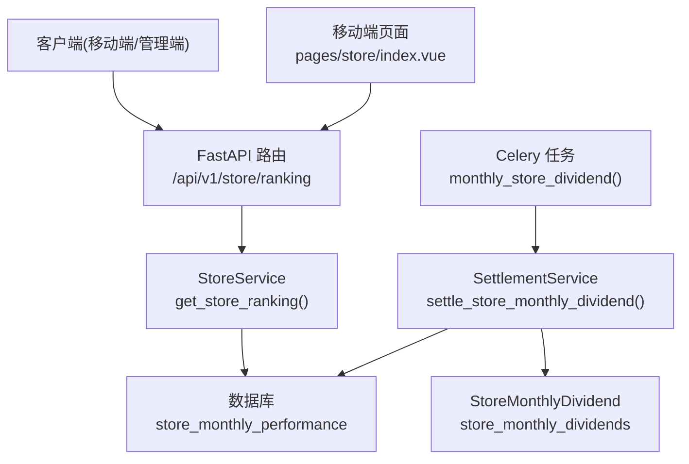
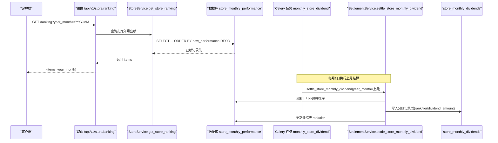
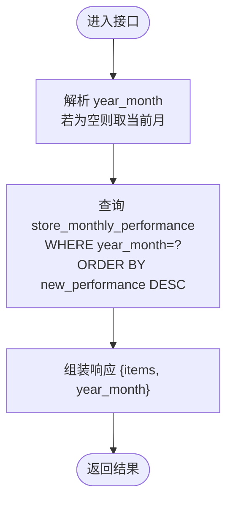
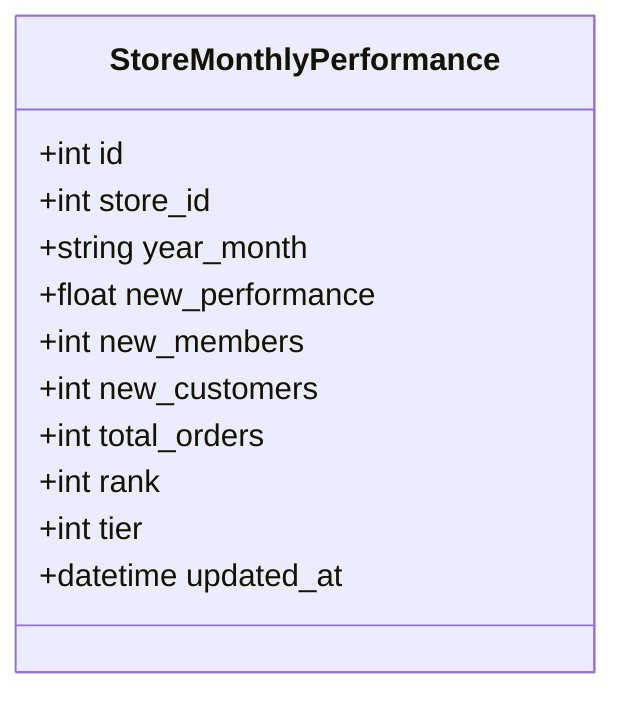
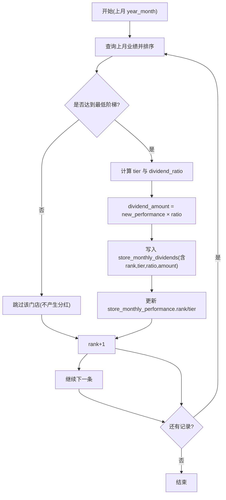
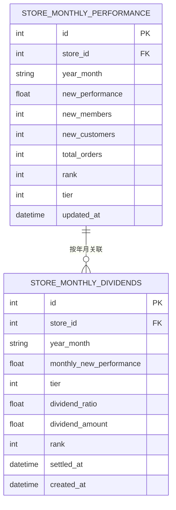
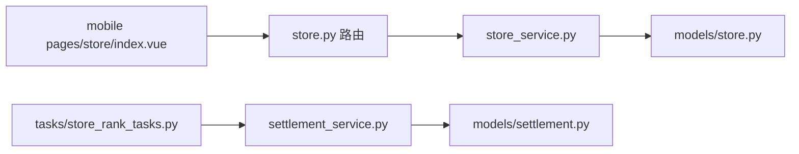

# 业绩排名接口

<cite>
**本文引用的文件列表**
- [backend/app/api/v1/store.py](file://backend/app/api/v1/store.py)
- [backend/app/services/store_service.py](file://backend/app/services/store_service.py)
- [backend/app/models/store.py](file://backend/app/models/store.py)
- [backend/app/services/settlement_service.py](file://backend/app/services/settlement_service.py)
- [backend/app/models/settlement.py](file://backend/app/models/settlement.py)
- [backend/app/tasks/store_rank_tasks.py](file://backend/app/tasks/store_rank_tasks.py)
- [frontend/mobile-app/pages/store/index.vue](file://frontend/mobile-app/pages/store/index.vue)
</cite>

## 目录
1. [简介](#简介)
2. [项目结构](#项目结构)
3. [核心组件](#核心组件)
4. [架构总览](#架构总览)
5. [详细组件分析](#详细组件分析)
6. [依赖关系分析](#依赖关系分析)
7. [性能与扩展性](#性能与扩展性)
8. [故障排查指南](#故障排查指南)
9. [结论](#结论)
10. [附录：接口规范与示例](#附录接口规范与示例)

## 简介
本文件为 AIxingmu 项目的“业绩排名接口”技术文档，聚焦以下能力：
- 门店月度排名查询（按年月维度）
- 业绩统计报表（门店月度新增业绩、订单数、会员/客户增量等）
- 阶梯分红计算（基于当月新增业绩的四级阶梯比例）
- 多层级分销体系中的业绩汇总与排名机制说明

文档同时给出 year_month 参数格式、排名算法逻辑、数据模型定义、任务调度流程以及前端展示样例路径。

## 项目结构
围绕业绩排名相关的关键代码分布在后端 API、服务层、数据模型、定时任务与移动端页面中：
- API 路由：提供门店排名查询入口
- 服务层：实现排名查询、团队查询、月度业绩更新
- 结算服务：实现门店月度阶梯分红结算与排名落库
- 数据模型：门店、团队成员、月度业绩、月度分红记录、平台财务汇总
- 定时任务：每月自动执行上月门店排名与分红结算
- 前端页面：展示门店阶梯分红规则与排名列表

图表来源
- [backend/app/api/v1/store.py:26-36](file://backend/app/api/v1/store.py#L26-L36)
- [backend/app/services/store_service.py:120-133](file://backend/app/services/store_service.py#L120-L133)
- [backend/app/services/settlement_service.py:87-133](file://backend/app/services/settlement_service.py#L87-L133)
- [backend/app/models/settlement.py:66-93](file://backend/app/models/settlement.py#L66-L93)
- [backend/app/tasks/store_rank_tasks.py:15-28](file://backend/app/tasks/store_rank_tasks.py#L15-L28)
- [frontend/mobile-app/pages/store/index.vue:1-44](file://frontend/mobile-app/pages/store/index.vue#L1-L44)

章节来源
- [backend/app/api/v1/store.py:1-48](file://backend/app/api/v1/store.py#L1-L48)
- [backend/app/services/store_service.py:1-161](file://backend/app/services/store_service.py#L1-L161)
- [backend/app/models/store.py:83-103](file://backend/app/models/store.py#L83-L103)
- [backend/app/services/settlement_service.py:87-166](file://backend/app/services/settlement_service.py#L87-L166)
- [backend/app/models/settlement.py:66-123](file://backend/app/models/settlement.py#L66-L123)
- [backend/app/tasks/store_rank_tasks.py:1-29](file://backend/app/tasks/store_rank_tasks.py#L1-L29)
- [frontend/mobile-app/pages/store/index.vue:1-81](file://frontend/mobile-app/pages/store/index.vue#L1-L81)

## 核心组件
- 门店排名查询接口
  - 路由：GET /api/v1/store/ranking
  - 入参：year_month（可选，默认当前月）
  - 返回：items（门店月度业绩记录集合）、year_month
- 门店月度业绩更新
  - 方法：update_monthly_performance
  - 作用：累计当月新增业绩、会员/客户增量、订单数，并同步门店总业绩与当月业绩
- 门店月度阶梯分红结算
  - 方法：settle_store_monthly_dividend
  - 作用：按当月新增业绩排序生成排名，判定阶梯等级与分红比例，写入分红记录表，并回写排名与等级到业绩表
- 月度任务调度
  - 任务：monthly_store_dividend
  - 作用：每月1日执行上月门店排名与分红结算

章节来源
- [backend/app/api/v1/store.py:26-36](file://backend/app/api/v1/store.py#L26-L36)
- [backend/app/services/store_service.py:54-99](file://backend/app/services/store_service.py#L54-L99)
- [backend/app/services/settlement_service.py:87-133](file://backend/app/services/settlement_service.py#L87-L133)
- [backend/app/tasks/store_rank_tasks.py:15-28](file://backend/app/tasks/store_rank_tasks.py#L15-L28)

## 架构总览
从请求到结果的数据流如下：
- 客户端调用排名接口，传入或默认 year_month
- 路由调用服务层查询指定年月的门店月度业绩并按新增业绩降序返回
- 后台任务在月初对上月数据进行排名与分红结算，写入分红记录并更新业绩表的 rank 与 tier

图表来源
- [backend/app/api/v1/store.py:26-36](file://backend/app/api/v1/store.py#L26-L36)
- [backend/app/services/store_service.py:120-133](file://backend/app/services/store_service.py#L120-L133)
- [backend/app/services/settlement_service.py:87-133](file://backend/app/services/settlement_service.py#L87-L133)
- [backend/app/tasks/store_rank_tasks.py:15-28](file://backend/app/tasks/store_rank_tasks.py#L15-L28)

## 详细组件分析

### 接口：门店月度排名查询
- 路径与方法
  - GET /api/v1/store/ranking
- 参数
  - year_month: 字符串，格式 YYYY-MM；若不传则使用当前月份
- 返回
  - items: 门店月度业绩记录集合（包含 store_id、year_month、new_performance 等字段）
  - year_month: 实际使用的年月
- 业务规则
  - 排名依据：当月新增业绩 new_performance 降序
  - 分页：当前接口未内置分页，如需分页可在服务层扩展 limit/offset
- 数据来源
  - 表：store_monthly_performance
  - 排序字段：new_performance DESC

图表来源
- [backend/app/api/v1/store.py:26-36](file://backend/app/api/v1/store.py#L26-L36)
- [backend/app/services/store_service.py:120-133](file://backend/app/services/store_service.py#L120-L133)
- [backend/app/models/store.py:83-103](file://backend/app/models/store.py#L83-L103)

章节来源
- [backend/app/api/v1/store.py:26-36](file://backend/app/api/v1/store.py#L26-L36)
- [backend/app/services/store_service.py:120-133](file://backend/app/services/store_service.py#L120-L133)
- [backend/app/models/store.py:83-103](file://backend/app/models/store.py#L83-L103)

### 业绩统计与更新
- 功能
  - 按月聚合门店的新增业绩、新增会员、新增客户、订单数
  - 同步更新门店总业绩与当月业绩
- 关键方法
  - update_monthly_performance(db, store_id, year_month, new_performance, new_members, new_customers, total_orders)
- 数据模型
  - 表：store_monthly_performance
  - 关键字段：store_id、year_month、new_performance、new_members、new_customers、total_orders、rank、tier

图表来源
- [backend/app/models/store.py:83-103](file://backend/app/models/store.py#L83-L103)

章节来源
- [backend/app/services/store_service.py:54-99](file://backend/app/services/store_service.py#L54-L99)
- [backend/app/models/store.py:83-103](file://backend/app/models/store.py#L83-L103)

### 阶梯分红计算与排名落库
- 触发方式
  - Celery 任务：每月1日凌晨执行上月结算
- 核心逻辑
  - 读取上月所有门店业绩，按 new_performance 降序遍历
  - 根据业绩区间确定阶梯等级与分红比例
  - 计算分红金额 = 当月新增业绩 × 分红比例
  - 写入 store_monthly_dividends 记录（含 rank、tier、dividend_ratio、dividend_amount）
  - 回写 store_monthly_performance 的 rank 与 tier
- 阶梯规则
  - 阶梯一：3万~5万 → 0.5%
  - 阶梯二：5万~10万 → 0.5%
  - 阶梯三：10万~50万 → 0.5%
  - 阶梯四：50万以上 → 1.0%
- 配置来源
  - 阈值与比例来自系统配置项（STORE_TIER*_MIN、STORE_TIER*_DIVIDEND）

图表来源
- [backend/app/services/settlement_service.py:87-133](file://backend/app/services/settlement_service.py#L87-L133)
- [backend/app/models/settlement.py:66-93](file://backend/app/models/settlement.py#L66-L93)
- [backend/app/tasks/store_rank_tasks.py:15-28](file://backend/app/tasks/store_rank_tasks.py#L15-L28)

章节来源
- [backend/app/services/settlement_service.py:87-133](file://backend/app/services/settlement_service.py#L87-L133)
- [backend/app/models/settlement.py:66-93](file://backend/app/models/settlement.py#L66-L93)
- [backend/app/tasks/store_rank_tasks.py:15-28](file://backend/app/tasks/store_rank_tasks.py#L15-L28)

### 数据模型与字段说明
- 门店月度业绩表（store_monthly_performance）
  - 用途：记录门店某月新增业绩及相关指标，用于排名与分红
  - 关键字段：store_id、year_month、new_performance、new_members、new_customers、total_orders、rank、tier
- 门店月度分红记录表（store_monthly_dividends）
  - 用途：记录门店某月分红明细，含阶梯等级、分红比例、分红金额与排名
  - 关键字段：store_id、year_month、monthly_new_performance、tier、dividend_ratio、dividend_amount、rank
- 平台每日财务汇总表（platform_daily_finance）
  - 用途：平台收支分配对账，确保100%分配（与门店分红无直接耦合）

图表来源
- [backend/app/models/store.py:83-103](file://backend/app/models/store.py#L83-L103)
- [backend/app/models/settlement.py:66-93](file://backend/app/models/settlement.py#L66-L93)

章节来源
- [backend/app/models/store.py:83-103](file://backend/app/models/store.py#L83-L103)
- [backend/app/models/settlement.py:66-93](file://backend/app/models/settlement.py#L66-L93)

### 多层级分销体系中的业绩汇总与排名机制
- 团队层级
  - 四级线下体系：省→市→区县→门店
  - 团队成员关系通过 team_members 表维护 parent_id 与 level
- 业绩汇总
  - 门店月度业绩以门店为单位统计，不直接跨层级汇总
  - 可通过团队查询接口获取指定层级成员，结合门店业绩进行上层汇总展示（由业务侧组合）
- 排名范围
  - 当前排名为全网门店排名（按当月新增业绩），非团队内排名

章节来源
- [backend/app/models/store.py:66-80](file://backend/app/models/store.py#L66-L80)
- [backend/app/services/store_service.py:101-118](file://backend/app/services/store_service.py#L101-118)

## 依赖关系分析
- 路由层依赖服务层
  - /api/v1/store/ranking → StoreService.get_store_ranking
- 服务层依赖数据模型
  - StoreService 操作 StoreMonthlyPerformance
  - SettlementService 操作 StoreMonthlyPerformance 与 StoreMonthlyDividend
- 任务层驱动结算
  - Celery 任务调用 SettlementService 完成上月结算与排名落库
- 前端消费接口
  - 移动端页面调用排名接口并展示规则与列表

图表来源
- [backend/app/api/v1/store.py:26-36](file://backend/app/api/v1/store.py#L26-L36)
- [backend/app/services/store_service.py:120-133](file://backend/app/services/store_service.py#L120-L133)
- [backend/app/services/settlement_service.py:87-133](file://backend/app/services/settlement_service.py#L87-L133)
- [backend/app/models/store.py:83-103](file://backend/app/models/store.py#L83-L103)
- [backend/app/models/settlement.py:66-93](file://backend/app/models/settlement.py#L66-L93)
- [backend/app/tasks/store_rank_tasks.py:15-28](file://backend/app/tasks/store_rank_tasks.py#L15-L28)
- [frontend/mobile-app/pages/store/index.vue:1-44](file://frontend/mobile-app/pages/store/index.vue#L1-L44)

章节来源
- [backend/app/api/v1/store.py:1-48](file://backend/app/api/v1/store.py#L1-L48)
- [backend/app/services/store_service.py:1-161](file://backend/app/services/store_service.py#L1-L161)
- [backend/app/services/settlement_service.py:1-166](file://backend/app/services/settlement_service.py#L1-L166)
- [backend/app/models/store.py:1-104](file://backend/app/models/store.py#L1-L104)
- [backend/app/models/settlement.py:1-123](file://backend/app/models/settlement.py#L1-L123)
- [backend/app/tasks/store_rank_tasks.py:1-29](file://backend/app/tasks/store_rank_tasks.py#L1-L29)
- [frontend/mobile-app/pages/store/index.vue:1-81](file://frontend/mobile-app/pages/store/index.vue#L1-L81)

## 性能与扩展性
- 查询性能
  - 排名查询按 year_month 过滤并按 new_performance 排序，建议在 (year_month, new_performance) 建立复合索引以提升排序效率
- 结算性能
  - 月度结算需遍历上月全部门店业绩，建议分批处理或使用窗口函数优化排名计算
- 可扩展点
  - 增加分页与筛选（如按省份/城市）
  - 支持团队维度排名（按上级聚合）
  - 引入缓存层（Redis）存储热门月份排名快照

[本节为通用指导，不涉及具体文件分析]

## 故障排查指南
- 接口返回空数据
  - 检查对应 year_month 是否存在门店月度业绩记录
  - 确认定时任务是否成功执行上月结算
- 排名异常
  - 核对 new_performance 是否为负值或异常数据
  - 检查排序字段索引与数据一致性
- 分红金额不符
  - 核对阶梯阈值与比例配置项是否正确
  - 确认结算任务执行时间与数据时间边界

章节来源
- [backend/app/services/settlement_service.py:87-133](file://backend/app/services/settlement_service.py#L87-L133)
- [backend/app/tasks/store_rank_tasks.py:15-28](file://backend/app/tasks/store_rank_tasks.py#L15-L28)

## 结论
- 门店月度排名接口简洁明确，基于当月新增业绩排序
- 阶梯分红结算在月初自动执行，保证数据一致性与可追溯性
- 数据模型清晰，便于后续扩展团队维度排名与更多统计维度

[本节为总结，不涉及具体文件分析]

## 附录：接口规范与示例

### 接口定义
- 名称：门店月度排名查询
- 路径：GET /api/v1/store/ranking
- 参数
  - year_month: 字符串，格式 YYYY-MM；可选，默认当前月
- 返回
  - items: 门店月度业绩记录集合
  - year_month: 实际使用的年月

章节来源
- [backend/app/api/v1/store.py:26-36](file://backend/app/api/v1/store.py#L26-L36)
- [backend/app/services/store_service.py:120-133](file://backend/app/services/store_service.py#L120-L133)

### 数据结构定义
- 门店月度业绩记录（store_monthly_performance）
  - store_id: 门店ID
  - year_month: 年月（YYYY-MM）
  - new_performance: 当月新增业绩
  - new_members: 当月新增会员
  - new_customers: 当月新增客户
  - total_orders: 当月总订单数
  - rank: 全网排名
  - tier: 阶梯等级（1-4）
- 门店月度分红记录（store_monthly_dividends）
  - store_id: 门店ID
  - year_month: 年月（YYYY-MM）
  - monthly_new_performance: 当月新增业绩
  - tier: 阶梯等级（1-4）
  - dividend_ratio: 分红比例
  - dividend_amount: 分红金额
  - rank: 全网排名

章节来源
- [backend/app/models/store.py:83-103](file://backend/app/models/store.py#L83-L103)
- [backend/app/models/settlement.py:66-93](file://backend/app/models/settlement.py#L66-L93)

### 业务规则摘要
- 排名算法
  - 按当月新增业绩 new_performance 降序排列
- 阶梯分红规则
  - 阶梯一：3万~5万 → 0.5%
  - 阶梯二：5万~10万 → 0.5%
  - 阶梯三：10万~50万 → 0.5%
  - 阶梯四：50万以上 → 1.0%
- 结算时机
  - 每月1日执行上月结算，写入分红记录并更新排名与等级

章节来源
- [backend/app/services/settlement_service.py:87-133](file://backend/app/services/settlement_service.py#L87-L133)
- [backend/app/tasks/store_rank_tasks.py:15-28](file://backend/app/tasks/store_rank_tasks.py#L15-L28)

### 完整示例（前端展示参考）
- 移动端页面展示了门店阶梯分红规则与排名列表，包括月份切换、规则卡片与排名条目渲染
- 参考路径：frontend/mobile-app/pages/store/index.vue

章节来源
- [frontend/mobile-app/pages/store/index.vue:1-81](file://frontend/mobile-app/pages/store/index.vue#L1-L81)