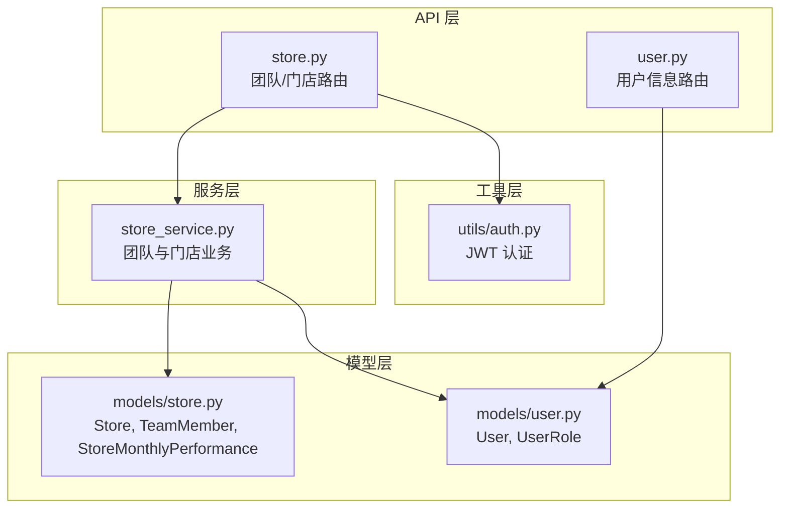
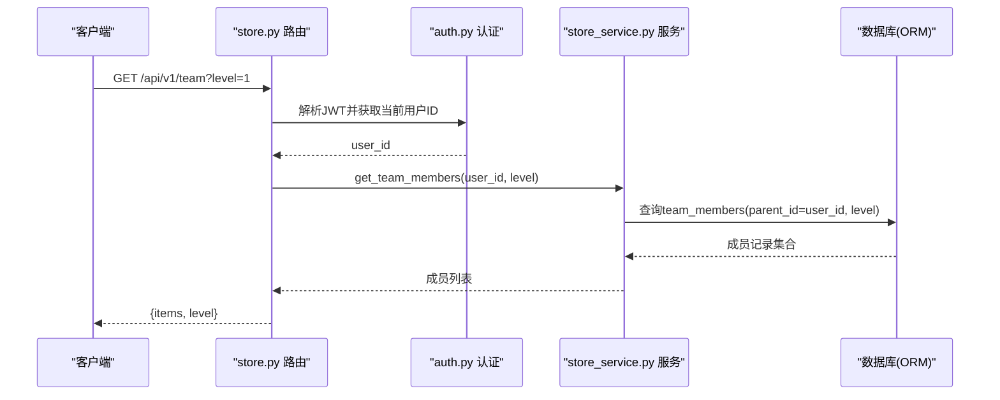
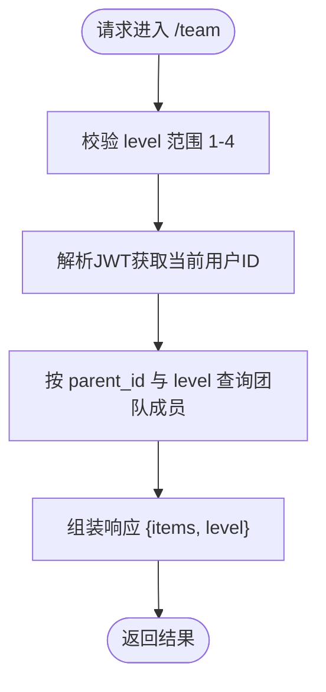
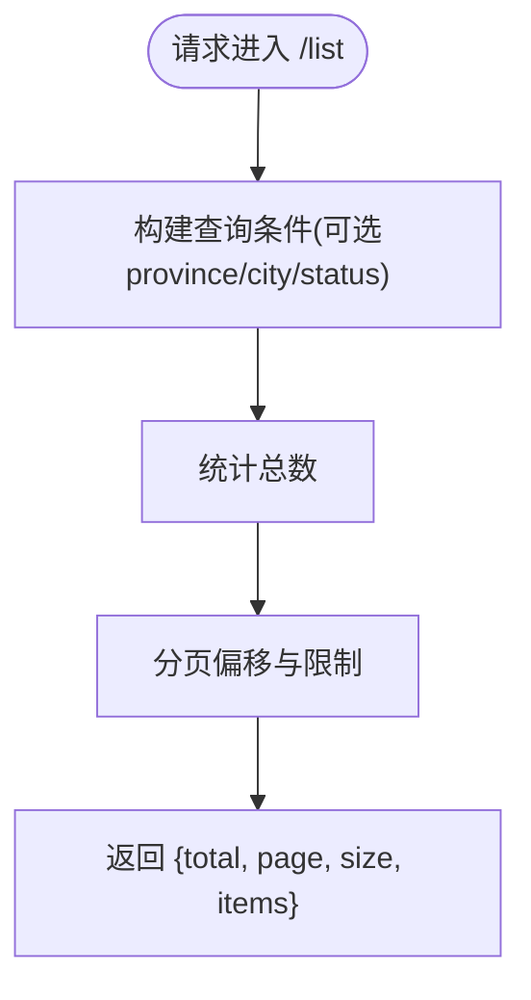
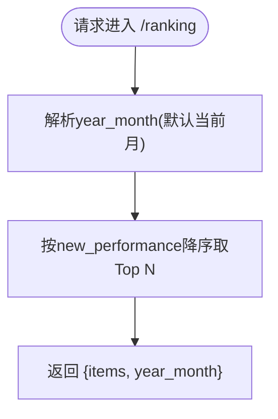
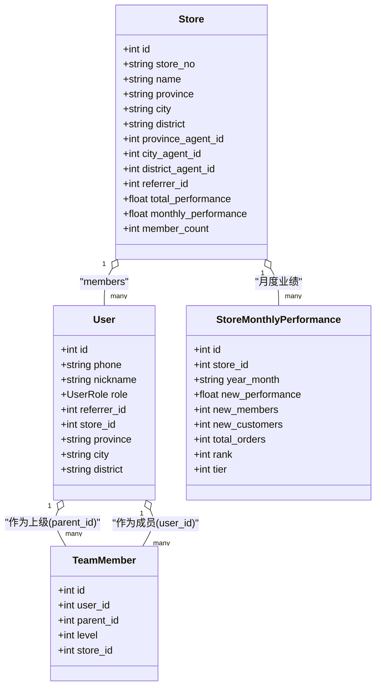

# 团队管理接口

<cite>
**本文引用的文件**   
- [store.py](file://backend/app/api/v1/store.py)
- [user.py](file://backend/app/api/v1/user.py)
- [auth.py](file://backend/app/utils/auth.py)
- [store_service.py](file://backend/app/services/store_service.py)
- [store.py](file://backend/app/models/store.py)
- [user.py](file://backend/app/models/user.py)
</cite>

## 目录
1. [简介](#简介)
2. [项目结构](#项目结构)
3. [核心组件](#核心组件)
4. [架构总览](#架构总览)
5. [详细组件分析](#详细组件分析)
6. [依赖关系分析](#依赖关系分析)
7. [性能考虑](#性能考虑)
8. [故障排查指南](#故障排查指南)
9. [结论](#结论)
10. [附录：调用示例与数据结构](#附录调用示例与数据结构)

## 简介
本文件为 AIxingmu 项目的“团队管理接口”技术文档，聚焦以下能力：
- 团队成员查询（支持 level 参数控制 1-4 级）
- 下级门店管理与查看
- 团队层级查看（四级代理体系：省→市→区县→门店）
- 用户权限验证与访问控制
- 数据模型、层级关系表示与业务逻辑说明
- 多级团队管理的完整调用示例（展示四级代理上下级关系的查询方法）

## 项目结构
后端采用分层架构：API 层负责路由与入参校验，Service 层封装业务与数据库操作，Models 定义数据表结构与关系。认证工具提供 JWT 解析与当前用户提取。

图表来源
- [store.py:1-48](file://backend/app/api/v1/store.py#L1-L48)
- [user.py:1-37](file://backend/app/api/v1/user.py#L1-L37)
- [store_service.py:1-161](file://backend/app/services/store_service.py#L1-L161)
- [store.py:1-104](file://backend/app/models/store.py#L1-L104)
- [user.py:1-93](file://backend/app/models/user.py#L1-L93)
- [auth.py:1-50](file://backend/app/utils/auth.py#L1-L50)

章节来源
- [store.py:1-48](file://backend/app/api/v1/store.py#L1-L48)
- [user.py:1-37](file://backend/app/api/v1/user.py#L1-L37)
- [store_service.py:1-161](file://backend/app/services/store_service.py#L1-L161)
- [store.py:1-104](file://backend/app/models/store.py#L1-L104)
- [user.py:1-93](file://backend/app/models/user.py#L1-L93)
- [auth.py:1-50](file://backend/app/utils/auth.py#L1-L50)

## 核心组件
- 团队与门店 API：提供门店列表、排名、我的团队成员等接口。
- 团队与门店服务：实现团队成员查询、月度业绩更新、门店排名与分页列表等业务逻辑。
- 数据模型：定义用户、门店、团队成员关系、月度业绩统计等表结构。
- 认证工具：基于 JWT 的令牌生成与解析，以及从请求头中提取当前用户 ID。

章节来源
- [store.py:1-48](file://backend/app/api/v1/store.py#L1-L48)
- [store_service.py:1-161](file://backend/app/services/store_service.py#L1-L161)
- [store.py:1-104](file://backend/app/models/store.py#L1-L104)
- [user.py:1-93](file://backend/app/models/user.py#L1-L93)
- [auth.py:1-50](file://backend/app/utils/auth.py#L1-L50)

## 架构总览
下图展示了团队管理接口的端到端调用流程：客户端通过 HTTP 请求进入 FastAPI 路由，路由使用认证中间件获取当前用户 ID，再调用服务层进行团队或门店相关的数据查询与处理，最终返回结构化响应。

图表来源
- [store.py:39-48](file://backend/app/api/v1/store.py#L39-L48)
- [auth.py:39-50](file://backend/app/utils/auth.py#L39-L50)
- [store_service.py:101-118](file://backend/app/services/store_service.py#L101-L118)

## 详细组件分析

### 团队成员查询接口
- 路径与方法：GET /api/v1/team
- 功能：根据当前登录用户与层级 level（1-4），返回其直推/间推/间间推/间间间推的成员列表。
- 关键参数：
  - level：整数，范围 1-4，分别对应直推、间推、间间推、间间间推。
- 权限控制：
  - 必须携带有效的 JWT 令牌；未认证或无效令牌将返回 401。
  - 当前用户 ID 由认证工具从 Token 中解析得到，用于限定查询范围。
- 返回结构：
  - items：团队成员记录集合（包含 user_id、parent_id、level、store_id 等字段）。
  - level：本次查询的层级值。

图表来源
- [store.py:39-48](file://backend/app/api/v1/store.py#L39-L48)
- [auth.py:39-50](file://backend/app/utils/auth.py#L39-L50)
- [store_service.py:101-118](file://backend/app/services/store_service.py#L101-L118)

章节来源
- [store.py:39-48](file://backend/app/api/v1/store.py#L39-L48)
- [store_service.py:101-118](file://backend/app/services/store_service.py#L101-L118)
- [auth.py:39-50](file://backend/app/utils/auth.py#L39-L50)

### 下级门店管理接口
- 路径与方法：GET /api/v1/list
- 功能：按省份、城市、状态等条件分页查询门店列表。
- 关键参数：
  - province：可选，省份筛选
  - city：可选，城市筛选
  - page：页码，默认 1
  - size：每页数量，默认 20，最大 100
- 返回结构：
  - total：符合条件的总数
  - page：当前页码
  - size：每页大小
  - items：门店对象集合（包含 store_no、name、province、city、district、status、agent 关联等）

图表来源
- [store.py:13-24](file://backend/app/api/v1/store.py#L13-L24)
- [store_service.py:135-161](file://backend/app/services/store_service.py#L135-L161)

章节来源
- [store.py:13-24](file://backend/app/api/v1/store.py#L13-L24)
- [store_service.py:135-161](file://backend/app/services/store_service.py#L135-L161)

### 团队层级查看接口
- 路径与方法：GET /api/v1/ranking
- 功能：获取指定年月的门店月度排名，用于评估各级代理的团队业绩表现。
- 关键参数：
  - year_month：可选，格式 YYYY-MM；不传则默认为当前月。
- 返回结构：
  - items：门店月度业绩记录集合（包含 new_performance、rank、tier 等）
  - year_month：查询年月

图表来源
- [store.py:26-36](file://backend/app/api/v1/store.py#L26-L36)
- [store_service.py:120-133](file://backend/app/services/store_service.py#L120-L133)

章节来源
- [store.py:26-36](file://backend/app/api/v1/store.py#L26-L36)
- [store_service.py:120-133](file://backend/app/services/store_service.py#L120-L133)

### 用户信息与钱包接口（辅助）
- 路径与方法：
  - GET /api/v1/me：获取当前用户基本信息
  - GET /api/v1/wallet：获取当前用户四大资产余额
- 用途：在团队管理中用于确认当前用户身份与角色，便于后续扩展权限控制。

章节来源
- [user.py:14-36](file://backend/app/api/v1/user.py#L14-L36)

## 依赖关系分析
- API 层依赖：
  - store.py 路由依赖 auth.py 的认证工具与 store_service.py 的业务方法。
  - user.py 路由依赖 auth.py 与 models/user.py 的用户模型。
- 服务层依赖：
  - store_service.py 依赖 models/store.py 与 models/user.py 的 ORM 模型，执行团队与门店相关查询。
- 模型层关系：
  - User 与 Store 存在一对多关系（门店成员 members）。
  - TeamMember 记录用户间的推荐关系与层级（parent_id、level）。
  - StoreMonthlyPerformance 记录门店月度业绩与排名。

图表来源
- [user.py:26-71](file://backend/app/models/user.py#L26-L71)
- [store.py:22-63](file://backend/app/models/store.py#L22-L63)
- [store.py:66-81](file://backend/app/models/store.py#L66-L81)
- [store.py:83-104](file://backend/app/models/store.py#L83-L104)

章节来源
- [user.py:26-71](file://backend/app/models/user.py#L26-L71)
- [store.py:22-63](file://backend/app/models/store.py#L22-L63)
- [store.py:66-81](file://backend/app/models/store.py#L66-L81)
- [store.py:83-104](file://backend/app/models/store.py#L83-L104)

## 性能考虑
- 索引优化：
  - team_members.parent_id 与 level 组合索引可加速按上级与层级查询。
  - users.role、users.referrer_id、users.store_id 索引有助于用户维度查询。
  - stores.province、stores.city、stores.district 组合索引提升区域筛选效率。
- 分页与限流：
  - 门店列表接口已内置分页参数，建议前端合理设置 size，避免过大导致响应缓慢。
- 缓存策略：
  - 对于高频读取的排名与团队树，可在服务层引入缓存（如 Redis）以减少数据库压力。
- 异步与连接池：
  - 使用异步会话与连接池配置，确保在高并发下稳定吞吐。

[本节为通用性能建议，无需特定文件引用]

## 故障排查指南
- 401 未认证：
  - 检查请求头是否携带正确的 Authorization: Bearer <token>。
  - 确认 token 未过期且子字段 sub 为用户 ID。
- 参数校验失败：
  - level 必须在 1-4 范围内；page 需大于等于 1；size 需在 1-100 之间。
- 数据为空：
  - 若返回 items 为空，检查是否存在对应的推荐关系记录或门店数据。
- 权限越权：
  - 当前实现以当前用户 ID 限定查询范围，如需更细粒度权限控制，可在路由或服务层增加角色判断。

章节来源
- [auth.py:39-50](file://backend/app/utils/auth.py#L39-L50)
- [store.py:39-48](file://backend/app/api/v1/store.py#L39-L48)

## 结论
团队管理接口围绕“四级代理体系”的核心诉求，提供了团队成员查询、门店列表与排名等基础能力。通过 JWT 认证与明确的层级参数控制，系统实现了安全可控的上下级关系查询。建议在后续迭代中完善权限细化、缓存策略与监控告警，以提升稳定性与可观测性。

[本节为总结性内容，无需特定文件引用]

## 附录：调用示例与数据结构

### 团队成员查询示例（四级代理体系）
- 直推成员（level=1）
  - 请求：GET /api/v1/team?level=1
  - 说明：返回当前用户的直推成员列表。
- 间推成员（level=2）
  - 请求：GET /api/v1/team?level=2
  - 说明：返回当前用户的间推成员列表。
- 间间推成员（level=3）
  - 请求：GET /api/v1/team?level=3
  - 说明：返回当前用户的间间推成员列表。
- 间间间推成员（level=4）
  - 请求：GET /api/v1/team?level=4
  - 说明：返回当前用户的间间间推成员列表。

章节来源
- [store.py:39-48](file://backend/app/api/v1/store.py#L39-L48)
- [store_service.py:101-118](file://backend/app/services/store_service.py#L101-L118)

### 下级门店管理示例
- 按省份与城市筛选
  - 请求：GET /api/v1/list?province=广东省&city=深圳市&page=1&size=20
  - 说明：返回符合条件的门店分页列表。
- 全量分页
  - 请求：GET /api/v1/list?page=1&size=50
  - 说明：返回所有门店的分页列表。

章节来源
- [store.py:13-24](file://backend/app/api/v1/store.py#L13-L24)
- [store_service.py:135-161](file://backend/app/services/store_service.py#L135-L161)

### 团队层级查看示例
- 当月排名
  - 请求：GET /api/v1/ranking
  - 说明：返回当月门店排名。
- 指定月份排名
  - 请求：GET /api/v1/ranking?year_month=2024-05
  - 说明：返回指定月份的门店排名。

章节来源
- [store.py:26-36](file://backend/app/api/v1/store.py#L26-L36)
- [store_service.py:120-133](file://backend/app/services/store_service.py#L120-L133)

### 数据结构定义
- 团队成员（TeamMember）
  - 字段：id、user_id、parent_id、level、store_id、created_at
  - 含义：记录用户之间的推荐关系与层级，level 取值 1-4。
- 门店（Store）
  - 字段：id、store_no、name、status、province、city、district、address、province_agent_id、city_agent_id、district_agent_id、referrer_id、total_performance、monthly_performance、member_count、contact_name、contact_phone、created_at、updated_at
  - 含义：线下门店主数据，含区域与代理归属、业绩统计与联系方式。
- 用户（User）
  - 字段：id、phone、password_hash、nickname、avatar_url、role、is_active、referrer_id、balance、contribution_value、points、coupon_balance、agent_level、store_id、province、city、district、created_at、updated_at
  - 含义：平台用户主数据，含角色、推荐关系、钱包资产与代理区域信息。
- 门店月度业绩（StoreMonthlyPerformance）
  - 字段：id、store_id、year_month、new_performance、new_members、new_customers、total_orders、rank、tier、updated_at
  - 含义：门店月度新增业绩、会员与客户数、订单数及排名与阶梯等级。

章节来源
- [store.py:66-81](file://backend/app/models/store.py#L66-L81)
- [store.py:22-63](file://backend/app/models/store.py#L22-L63)
- [user.py:26-71](file://backend/app/models/user.py#L26-L71)
- [store.py:83-104](file://backend/app/models/store.py#L83-L104)