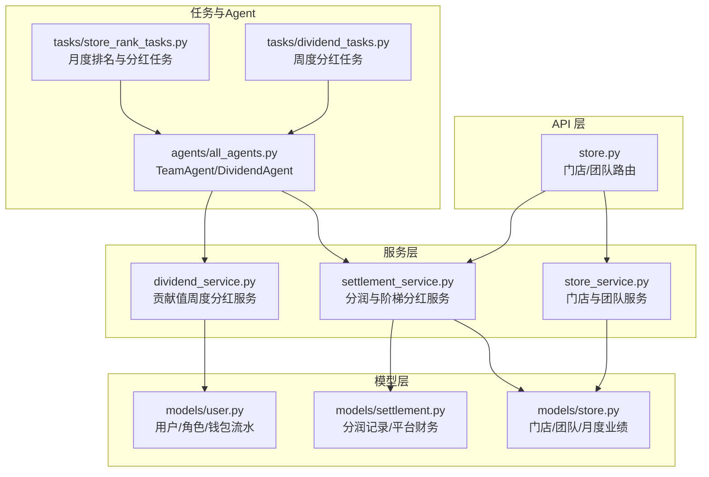
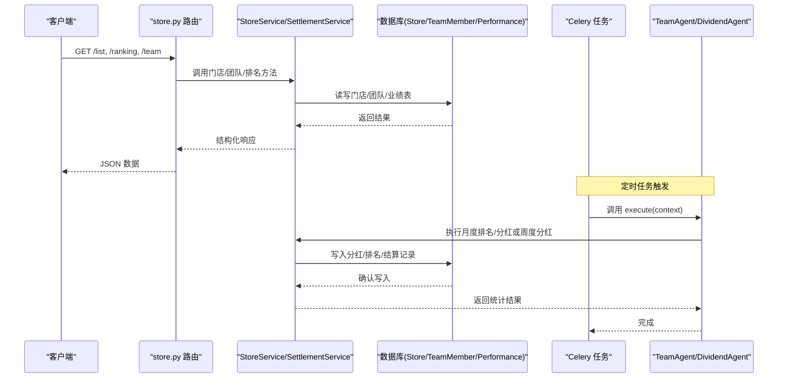
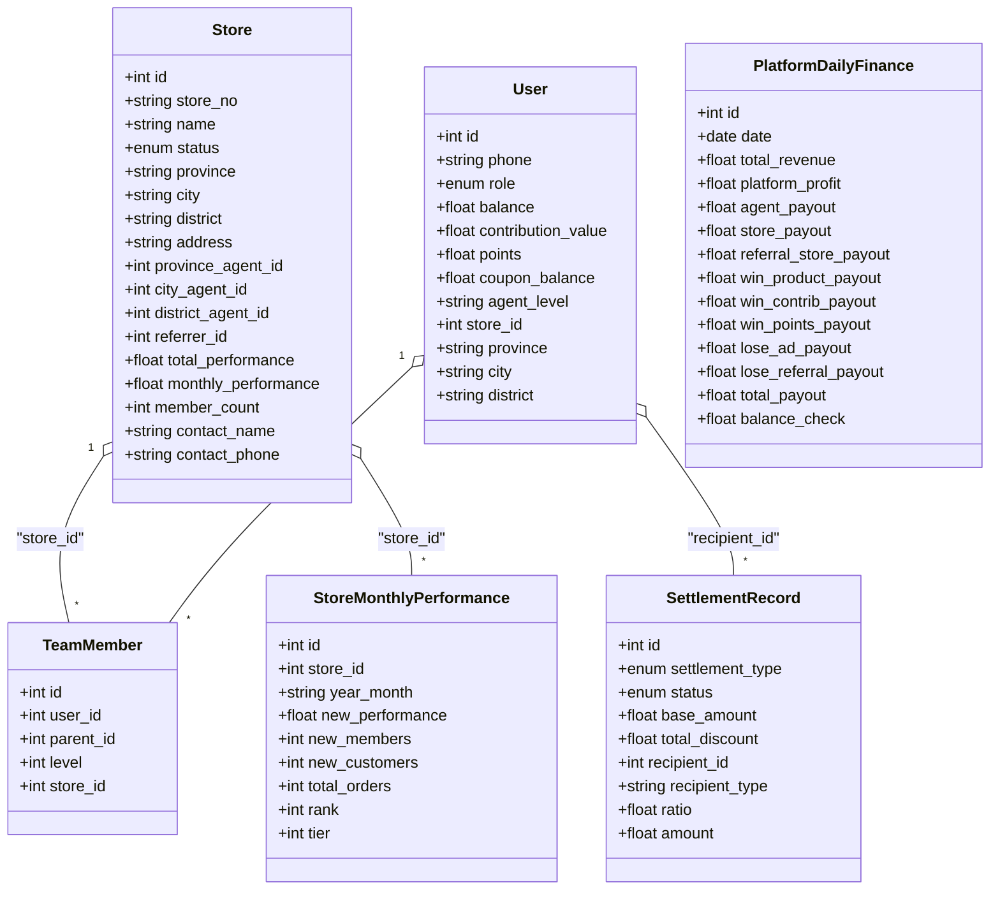
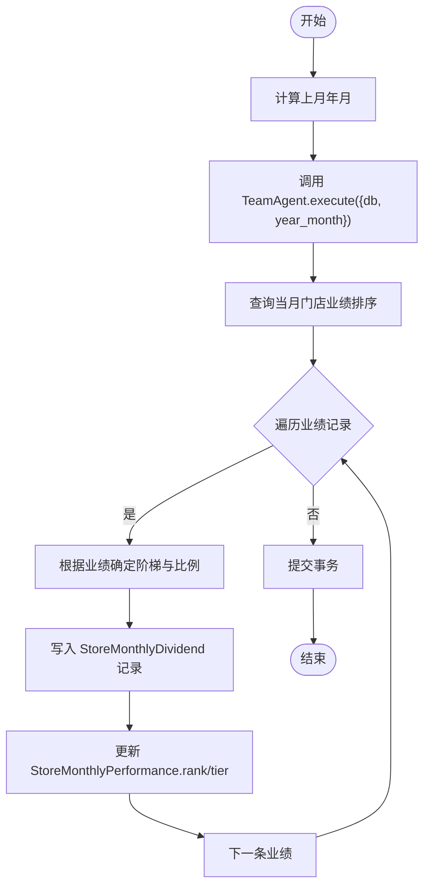
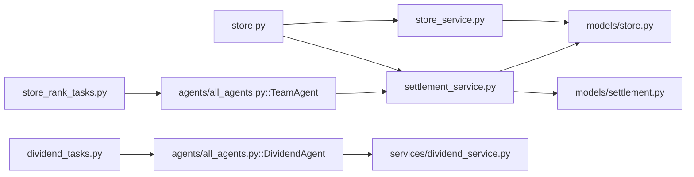

# 门店接口

<cite>
**本文引用的文件**   
- [backend/app/api/v1/store.py](file://backend/app/api/v1/store.py)
- [backend/app/services/store_service.py](file://backend/app/services/store_service.py)
- [backend/app/models/store.py](file://backend/app/models/store.py)
- [backend/app/models/user.py](file://backend/app/models/user.py)
- [backend/app/models/settlement.py](file://backend/app/models/settlement.py)
- [backend/app/services/settlement_service.py](file://backend/app/services/settlement_service.py)
- [backend/app/tasks/store_rank_tasks.py](file://backend/app/tasks/store_rank_tasks.py)
- [backend/app/agents/all_agents.py](file://backend/app/agents/all_agents.py)
- [backend/app/services/dividend_service.py](file://backend/app/services/dividend_service.py)
- [backend/app/tasks/dividend_tasks.py](file://backend/app/tasks/dividend_tasks.py)
</cite>

## 目录
1. [简介](#简介)
2. [项目结构](#项目结构)
3. [核心组件](#核心组件)
4. [架构总览](#架构总览)
5. [详细组件分析](#详细组件分析)
6. [依赖关系分析](#依赖关系分析)
7. [性能与扩展性](#性能与扩展性)
8. [故障排查指南](#故障排查指南)
9. [结论](#结论)
10. [附录：API 端点清单与调用示例](#附录api-端点清单与调用示例)

## 简介
本文件为 AIxingmu 项目的“门店管理”接口文档，聚焦四级代理体系（省/市/区县/门店）的门店网络管理与业绩分红能力。内容涵盖：
- 门店入驻申请、信息维护、下级门店管理
- 业绩统计与排名查询
- 团队管理（直推/间推/间间推/间间间推）
- 阶梯分红计算与月度结算流程
- 多层级分销体系的接口设计与调用示例

## 项目结构
后端采用 FastAPI + SQLAlchemy 异步 ORM，服务层按领域拆分，定时任务通过 Celery 调度。门店相关代码主要分布在以下位置：
- API 路由：backend/app/api/v1/store.py
- 服务层：backend/app/services/store_service.py、backend/app/services/settlement_service.py、backend/app/services/dividend_service.py
- 数据模型：backend/app/models/store.py、backend/app/models/user.py、backend/app/models/settlement.py
- 定时任务与 Agent：backend/app/tasks/store_rank_tasks.py、backend/app/tasks/dividend_tasks.py、backend/app/agents/all_agents.py

图表来源
- [backend/app/api/v1/store.py:1-48](file://backend/app/api/v1/store.py#L1-L48)
- [backend/app/services/store_service.py:1-161](file://backend/app/services/store_service.py#L1-L161)
- [backend/app/services/settlement_service.py:1-166](file://backend/app/services/settlement_service.py#L1-L166)
- [backend/app/services/dividend_service.py:1-136](file://backend/app/services/dividend_service.py#L1-L136)
- [backend/app/models/store.py:1-104](file://backend/app/models/store.py#L1-L104)
- [backend/app/models/user.py:1-93](file://backend/app/models/user.py#L1-L93)
- [backend/app/models/settlement.py:1-123](file://backend/app/models/settlement.py#L1-L123)
- [backend/app/tasks/store_rank_tasks.py:1-29](file://backend/app/tasks/store_rank_tasks.py#L1-L29)
- [backend/app/tasks/dividend_tasks.py:1-26](file://backend/app/tasks/dividend_tasks.py#L1-L26)
- [backend/app/agents/all_agents.py:1-114](file://backend/app/agents/all_agents.py#L1-L114)

章节来源
- [backend/app/api/v1/store.py:1-48](file://backend/app/api/v1/store.py#L1-L48)
- [backend/app/services/store_service.py:1-161](file://backend/app/services/store_service.py#L1-L161)
- [backend/app/models/store.py:1-104](file://backend/app/models/store.py#L1-L104)

## 核心组件
- 门店与团队服务 StoreService：提供门店创建、月度业绩更新、团队成员查询、门店列表与排名等能力。
- 分润与阶梯分红服务 SettlementService：实现拼团成功分润、门店月度阶梯分红计算与排名落库。
- 贡献值周度分红服务 DividendService：每周一自动执行全网贡献值分红，发放消费券并记录结算。
- 定时任务与 Agent：store_rank_tasks 每月1日触发 TeamAgent 执行门店月度排名与分红；dividend_tasks 每周一触发 DividendAgent 执行贡献值分红。

章节来源
- [backend/app/services/store_service.py:1-161](file://backend/app/services/store_service.py#L1-L161)
- [backend/app/services/settlement_service.py:1-166](file://backend/app/services/settlement_service.py#L1-L166)
- [backend/app/services/dividend_service.py:1-136](file://backend/app/services/dividend_service.py#L1-L136)
- [backend/app/tasks/store_rank_tasks.py:1-29](file://backend/app/tasks/store_rank_tasks.py#L1-L29)
- [backend/app/tasks/dividend_tasks.py:1-26](file://backend/app/tasks/dividend_tasks.py#L1-L26)
- [backend/app/agents/all_agents.py:1-114](file://backend/app/agents/all_agents.py#L1-L114)

## 架构总览
门店管理涉及“门店网络+团队关系+业绩统计+分红结算”的闭环。下图展示从 API 到服务、模型与任务的调用链路。

图表来源
- [backend/app/api/v1/store.py:1-48](file://backend/app/api/v1/store.py#L1-L48)
- [backend/app/services/store_service.py:1-161](file://backend/app/services/store_service.py#L1-L161)
- [backend/app/services/settlement_service.py:1-166](file://backend/app/services/settlement_service.py#L1-L166)
- [backend/app/tasks/store_rank_tasks.py:1-29](file://backend/app/tasks/store_rank_tasks.py#L1-L29)
- [backend/app/tasks/dividend_tasks.py:1-26](file://backend/app/tasks/dividend_tasks.py#L1-L26)
- [backend/app/agents/all_agents.py:1-114](file://backend/app/agents/all_agents.py#L1-L114)

## 详细组件分析

### 数据模型与权限控制
- 门店模型 Store：包含省/市/区县/地址、状态、累计与当月业绩、联系人等字段，并通过外键关联省级/市级/区县级代理与推荐人。
- 团队成员 TeamMember：记录用户间的四级团队关系（parent_id + level），level=1 表示直推，最大支持到 level=4。
- 月度业绩 StoreMonthlyPerformance：按月聚合门店新增业绩、新增会员/客户、订单数，并存储排名与阶梯等级。
- 用户模型 User：定义消费者、商家、各级代理、管理员等角色，以及钱包资产（余额/贡献值/积分/消费券）。
- 分润记录 SettlementRecord：记录各类交易的分润明细，含接收方类型与比例金额。
- 平台每日财务 PlatformDailyFinance：汇总平台收支，确保分配平衡。

图表来源
- [backend/app/models/store.py:1-104](file://backend/app/models/store.py#L1-L104)
- [backend/app/models/user.py:1-93](file://backend/app/models/user.py#L1-L93)
- [backend/app/models/settlement.py:1-123](file://backend/app/models/settlement.py#L1-L123)

章节来源
- [backend/app/models/store.py:1-104](file://backend/app/models/store.py#L1-L104)
- [backend/app/models/user.py:1-93](file://backend/app/models/user.py#L1-L93)
- [backend/app/models/settlement.py:1-123](file://backend/app/models/settlement.py#L1-L123)

### 门店列表与筛选
- 端点：GET /api/v1/store/list
- 参数：province、city、page、size
- 功能：按省/市过滤门店列表，支持分页。
- 返回：total、page、size、items（门店集合）

章节来源
- [backend/app/api/v1/store.py:13-23](file://backend/app/api/v1/store.py#L13-L23)
- [backend/app/services/store_service.py:136-161](file://backend/app/services/store_service.py#L136-L161)

### 门店排名查询
- 端点：GET /api/v1/store/ranking
- 参数：year_month（可选，默认当前年月）
- 功能：按指定月份的新增业绩降序返回门店排名。
- 返回：items（排名列表）、year_month

章节来源
- [backend/app/api/v1/store.py:26-36](file://backend/app/api/v1/store.py#L26-L36)
- [backend/app/services/store_service.py:121-133](file://backend/app/services/store_service.py#L121-L133)

### 我的团队（四级代理）
- 端点：GET /api/v1/store/team
- 参数：level（1-4，直推/间推/间间推/间间间推）、user_id（由鉴权中间件注入）
- 功能：根据当前登录用户 ID 与层级，返回其团队成员列表。
- 返回：items（成员集合）、level

章节来源
- [backend/app/api/v1/store.py:39-47](file://backend/app/api/v1/store.py#L39-L47)
- [backend/app/services/store_service.py:102-118](file://backend/app/services/store_service.py#L102-L118)

### 门店入驻申请与信息维护
- 说明：当前路由未暴露创建/更新门店的 HTTP 端点，但服务层提供了创建门店与更新月度业绩的方法，供内部流程或后台管理调用。
- 能力：
  - 创建门店：支持填写编号、名称、区域、联系人、代理归属与推荐人，初始状态为待审核。
  - 更新月度业绩：按门店与年月累加新增业绩、新增会员/客户、订单数，并同步门店总业绩与当月业绩。

章节来源
- [backend/app/services/store_service.py:18-52](file://backend/app/services/store_service.py#L18-L52)
- [backend/app/services/store_service.py:54-99](file://backend/app/services/store_service.py#L54-L99)

### 业绩报表与阶梯分红计算
- 月度排名与分红：
  - 任务：每月1日凌晨1:00执行 store_rank_tasks.monthly_store_dividend。
  - 流程：获取上月年月 → 调用 TeamAgent.run → 进入 SettlementService.settle_store_monthly_dividend → 计算各门店当月新增业绩对应的阶梯等级与分红比例 → 写入 StoreMonthlyDividend 并更新 StoreMonthlyPerformance.rank/tier。
- 阶梯规则：
  - 阶梯一：3-5万 → 0.5%
  - 阶梯二：5-10万 → 0.5%
  - 阶梯三：10-50万 → 0.5%
  - 阶梯四：50万+ → 1%

图表来源
- [backend/app/tasks/store_rank_tasks.py:15-28](file://backend/app/tasks/store_rank_tasks.py#L15-L28)
- [backend/app/agents/all_agents.py:83-94](file://backend/app/agents/all_agents.py#L83-L94)
- [backend/app/services/settlement_service.py:88-133](file://backend/app/services/settlement_service.py#L88-L133)
- [backend/app/models/settlement.py:66-93](file://backend/app/models/settlement.py#L66-L93)

章节来源
- [backend/app/tasks/store_rank_tasks.py:1-29](file://backend/app/tasks/store_rank_tasks.py#L1-29)
- [backend/app/agents/all_agents.py:79-94](file://backend/app/agents/all_agents.py#L79-L94)
- [backend/app/services/settlement_service.py:88-146](file://backend/app/services/settlement_service.py#L88-L146)
- [backend/app/models/settlement.py:66-93](file://backend/app/models/settlement.py#L66-L93)

### 贡献值周度分红（辅助能力）
- 任务：每周一凌晨2:00执行 dividend_tasks.weekly_dividend。
- 流程：调用 DividendAgent.execute → DividendService.weekly_dividend → 计算全网总贡献值与平台收益池（20%）→ 按个人贡献值占比发放消费券 → 记录周度结算与全局统计。

章节来源
- [backend/app/tasks/dividend_tasks.py:15-25](file://backend/app/tasks/dividend_tasks.py#L15-L25)
- [backend/app/agents/all_agents.py:52-62](file://backend/app/agents/all_agents.py#L52-L62)
- [backend/app/services/dividend_service.py:19-123](file://backend/app/services/dividend_service.py#L19-L123)

## 依赖关系分析
- API 层依赖服务层：store.py 仅做参数校验与转发，业务逻辑集中在 store_service.py 与 settlement_service.py。
- 服务层依赖模型层：所有读写操作基于 models/store.py、models/user.py、models/settlement.py。
- 定时任务通过 Agent 编排服务：store_rank_tasks 与 dividend_tasks 分别调用 TeamAgent 与 DividendAgent，再由 Agent 调用对应 Service。

图表来源
- [backend/app/api/v1/store.py:1-48](file://backend/app/api/v1/store.py#L1-L48)
- [backend/app/services/store_service.py:1-161](file://backend/app/services/store_service.py#L1-L161)
- [backend/app/services/settlement_service.py:1-166](file://backend/app/services/settlement_service.py#L1-L166)
- [backend/app/models/store.py:1-104](file://backend/app/models/store.py#L1-L104)
- [backend/app/models/settlement.py:1-123](file://backend/app/models/settlement.py#L1-L123)
- [backend/app/tasks/store_rank_tasks.py:1-29](file://backend/app/tasks/store_rank_tasks.py#L1-L29)
- [backend/app/tasks/dividend_tasks.py:1-26](file://backend/app/tasks/dividend_tasks.py#L1-L26)
- [backend/app/agents/all_agents.py:1-114](file://backend/app/agents/all_agents.py#L1-L114)

章节来源
- [backend/app/api/v1/store.py:1-48](file://backend/app/api/v1/store.py#L1-L48)
- [backend/app/services/store_service.py:1-161](file://backend/app/services/store_service.py#L1-L161)
- [backend/app/services/settlement_service.py:1-166](file://backend/app/services/settlement_service.py#L1-L166)
- [backend/app/models/store.py:1-104](file://backend/app/models/store.py#L1-L104)
- [backend/app/models/settlement.py:1-123](file://backend/app/models/settlement.py#L1-L123)
- [backend/app/tasks/store_rank_tasks.py:1-29](file://backend/app/tasks/store_rank_tasks.py#L1-L29)
- [backend/app/tasks/dividend_tasks.py:1-26](file://backend/app/tasks/dividend_tasks.py#L1-L26)
- [backend/app/agents/all_agents.py:1-114](file://backend/app/agents/all_agents.py#L1-L114)

## 性能与扩展性
- 索引优化：门店表对状态与省市区建立复合索引；团队成员表对 parent_id+level 建立索引；月度业绩表对 store_id+year_month 唯一索引，利于分页与月度聚合查询。
- 分页与限流：门店列表接口支持 page/size 分页，size 上限限制在 100，避免大结果集拖慢响应。
- 异步处理：服务层使用 AsyncSession，提升并发处理能力；耗时任务（排名、分红）通过 Celery 异步执行，降低主线程阻塞。
- 可扩展点：
  - 可在 store.py 中新增创建/更新门店的 REST 端点，复用 StoreService.create_store/update_monthly_performance。
  - 可引入缓存层（如 Redis）缓存热门城市/省份的门店列表与排名，减少数据库压力。
  - 可按区域维度增加更细粒度的权限控制（例如仅允许某市代理查看本市门店）。

[本节为通用建议，不直接分析具体文件]

## 故障排查指南
- 门店列表为空或数据异常：
  - 检查是否传入正确的 province/city 参数；确认 stores 表中是否存在对应区域数据。
  - 关注分页参数 page/size 是否越界。
- 团队列表为空：
  - 确认当前登录用户的 user_id 是否正确注入；检查 team_members 表中是否存在 parent_id=user_id 且 level 匹配的记录。
- 排名数据缺失：
  - 确认是否已执行月度任务 store_rank_tasks.monthly_store_dividend；检查 store_monthly_performance 表中是否有对应 year_month 的数据。
- 分红金额异常：
  - 核对阶梯阈值与比例配置；检查 store_monthly_performance.new_performance 是否准确；确认平台收益池数据来源与计算周期。

章节来源
- [backend/app/api/v1/store.py:13-47](file://backend/app/api/v1/store.py#L13-L47)
- [backend/app/services/store_service.py:102-161](file://backend/app/services/store_service.py#L102-L161)
- [backend/app/tasks/store_rank_tasks.py:15-28](file://backend/app/tasks/store_rank_tasks.py#L15-L28)
- [backend/app/services/settlement_service.py:88-146](file://backend/app/services/settlement_service.py#L88-L146)

## 结论
本项目围绕“省/市/区县/门店”四级架构，构建了完整的门店网络与团队管理体系，并提供业绩统计、排名查询与阶梯分红结算能力。API 层简洁清晰，服务层职责明确，配合定时任务与 Agent 实现自动化运营。后续可在门店入驻与维护方面补充更多 REST 端点，并结合权限模型完善多级管控。

[本节为总结性内容，不直接分析具体文件]

## 附录：API 端点清单与调用示例

### 端点清单
- 门店列表
  - 方法：GET
  - 路径：/api/v1/store/list
  - 参数：province（可选）、city（可选）、page（默认1）、size（默认20，最大100）
  - 返回：{ total, page, size, items }
- 门店排名
  - 方法：GET
  - 路径：/api/v1/store/ranking
  - 参数：year_month（可选，默认当前年月）
  - 返回：{ items, year_month }
- 我的团队
  - 方法：GET
  - 路径：/api/v1/store/team
  - 参数：level（1-4）、user_id（由鉴权中间件注入）
  - 返回：{ items, level }

章节来源
- [backend/app/api/v1/store.py:13-47](file://backend/app/api/v1/store.py#L13-L47)

### 调用示例（概念性）
- 获取某市门店列表
  - 请求：GET /api/v1/store/list?city=杭州市&page=1&size=20
  - 响应：包含该市的门店分页数据
- 查询当月门店排名
  - 请求：GET /api/v1/store/ranking?year_month=2024-05
  - 响应：按当月新增业绩降序的门店列表
- 查看直推团队成员
  - 请求：GET /api/v1/store/team?level=1
  - 响应：当前用户的直推成员列表

[本节为概念性示例，不直接分析具体文件]