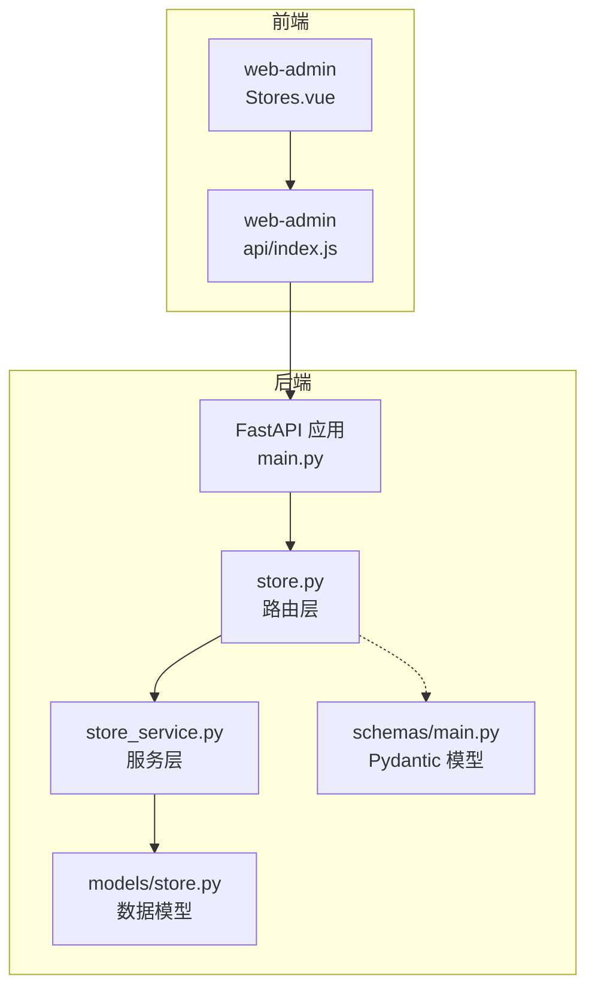
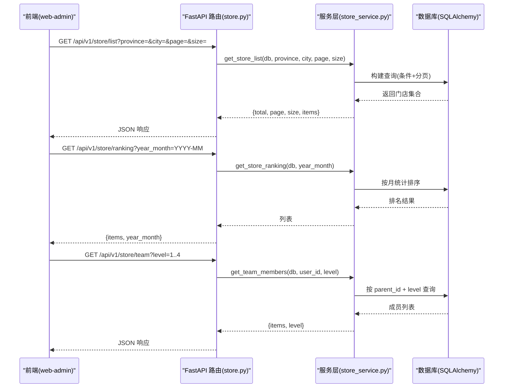
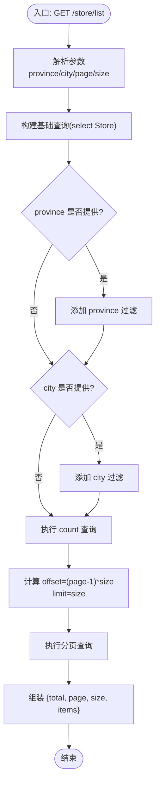
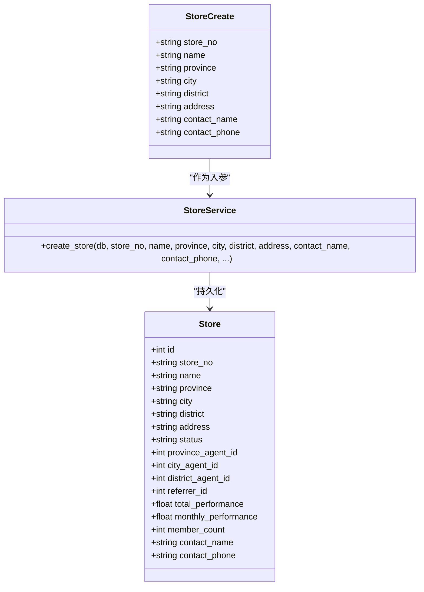
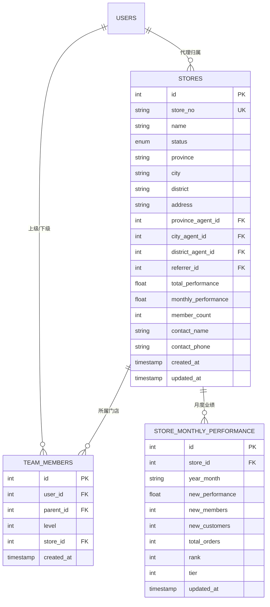
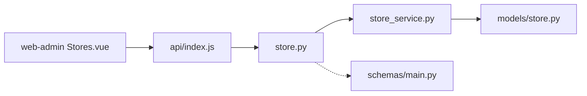

# 门店管理接口

<cite>
**本文引用的文件列表**
- [backend/app/api/v1/store.py](file://backend/app/api/v1/store.py)
- [backend/app/services/store_service.py](file://backend/app/services/store_service.py)
- [backend/app/models/store.py](file://backend/app/models/store.py)
- [backend/app/schemas/main.py](file://backend/app/schemas/main.py)
- [backend/app/main.py](file://backend/app/main.py)
- [frontend/web-admin/src/views/Stores.vue](file://frontend/web-admin/src/views/Stores.vue)
- [frontend/web-admin/src/api/index.js](file://frontend/web-admin/src/api/index.js)
</cite>

## 目录
1. [简介](#简介)
2. [项目结构](#项目结构)
3. [核心组件](#核心组件)
4. [架构总览](#架构总览)
5. [详细组件分析](#详细组件分析)
6. [依赖关系分析](#依赖关系分析)
7. [性能与分页机制](#性能与分页机制)
8. [故障排查指南](#故障排查指南)
9. [结论](#结论)
10. [附录：API 定义与示例](#附录api-定义与示例)

## 简介
本文件为 AIxingmu 项目的“门店管理”模块接口文档，覆盖以下能力：
- 门店列表查询（支持省/市筛选、分页）
- 门店信息维护（创建、状态管理等）
- 门店入驻申请（创建门店并进入待审核流程）
- 门店排名与团队层级查询（四级代理体系：省→市→区县→门店）

文档包含请求/响应参数说明、数据模型字段定义与校验规则、调用时序图与流程图，以及前端实际调用案例。

## 项目结构
后端采用 FastAPI + SQLAlchemy 异步 ORM，服务层按领域拆分；前端 web-admin 通过 axios 封装 API 调用。

图表来源
- [backend/app/main.py:58-68](file://backend/app/main.py#L58-L68)
- [backend/app/api/v1/store.py:1-48](file://backend/app/api/v1/store.py#L1-L48)
- [backend/app/services/store_service.py:1-161](file://backend/app/services/store_service.py#L1-L161)
- [backend/app/models/store.py:1-104](file://backend/app/models/store.py#L1-L104)
- [backend/app/schemas/main.py:145-169](file://backend/app/schemas/main.py#L145-L169)
- [frontend/web-admin/src/views/Stores.vue:1-128](file://frontend/web-admin/src/views/Stores.vue#L1-L128)
- [frontend/web-admin/src/api/index.js:44-66](file://frontend/web-admin/src/api/index.js#L44-L66)

章节来源
- [backend/app/main.py:58-68](file://backend/app/main.py#L58-L68)
- [backend/app/api/v1/store.py:1-48](file://backend/app/api/v1/store.py#L1-L48)
- [backend/app/services/store_service.py:1-161](file://backend/app/services/store_service.py#L1-L161)
- [backend/app/models/store.py:1-104](file://backend/app/models/store.py#L1-L104)
- [backend/app/schemas/main.py:145-169](file://backend/app/schemas/main.py#L145-L169)
- [frontend/web-admin/src/views/Stores.vue:1-128](file://frontend/web-admin/src/views/Stores.vue#L1-L128)
- [frontend/web-admin/src/api/index.js:44-66](file://frontend/web-admin/src/api/index.js#L44-L66)

## 核心组件
- 路由层：提供 /api/v1/store 下的列表、排名、团队等接口
- 服务层：实现门店列表查询、月度业绩更新、团队查询、排名计算
- 数据模型：门店表、团队成员关系表、门店月度业绩表
- Pydantic 模型：门店创建与展示的数据结构

章节来源
- [backend/app/api/v1/store.py:1-48](file://backend/app/api/v1/store.py#L1-L48)
- [backend/app/services/store_service.py:1-161](file://backend/app/services/store_service.py#L1-L161)
- [backend/app/models/store.py:1-104](file://backend/app/models/store.py#L1-L104)
- [backend/app/schemas/main.py:145-169](file://backend/app/schemas/main.py#L145-L169)

## 架构总览
下图展示了从前端到后端的完整调用链路，包括路由注册、服务层处理与数据库访问。

图表来源
- [backend/app/api/v1/store.py:13-47](file://backend/app/api/v1/store.py#L13-L47)
- [backend/app/services/store_service.py:120-161](file://backend/app/services/store_service.py#L120-L161)
- [backend/app/main.py:58-68](file://backend/app/main.py#L58-L68)

## 详细组件分析

### 门店列表查询
- 功能：根据省/市筛选，分页获取门店列表
- 路由：GET /api/v1/store/list
- 查询参数
  - province: 可选，省份名称
  - city: 可选，城市名称
  - page: 页码，默认 1，最小 1
  - size: 每页条数，默认 20，范围 1~100
- 业务逻辑
  - 当 province 或 city 非空时，按对应字段过滤
  - 使用 count 查询总数，offset/limit 实现分页
- 返回结构
  - total: 总记录数
  - page: 当前页码
  - size: 每页大小
  - items: 门店对象数组

图表来源
- [backend/app/api/v1/store.py:13-23](file://backend/app/api/v1/store.py#L13-L23)
- [backend/app/services/store_service.py:135-161](file://backend/app/services/store_service.py#L135-L161)

章节来源
- [backend/app/api/v1/store.py:13-23](file://backend/app/api/v1/store.py#L13-L23)
- [backend/app/services/store_service.py:135-161](file://backend/app/services/store_service.py#L135-L161)

### 门店信息维护与入驻申请
- 功能：创建门店（入驻申请），初始状态为“待审核”
- 路由：当前仓库未暴露 POST /store 的 REST 端点，但服务层已提供 create_store 方法
- 建议扩展
  - 新增路由：POST /api/v1/store
  - 入参使用 Pydantic 模型 StoreCreate
  - 服务层调用 StoreService.create_store
  - 返回新创建的门店信息
- 数据模型与校验
  - store_no: 字符串，必填
  - name: 字符串，必填
  - province/city/district/address/contact_name/contact_phone: 字符串，必填
  - 其他可选字段如代理归属、推荐人可在后续扩展中增加

图表来源
- [backend/app/schemas/main.py:145-154](file://backend/app/schemas/main.py#L145-L154)
- [backend/app/services/store_service.py:18-52](file://backend/app/services/store_service.py#L18-L52)
- [backend/app/models/store.py:22-63](file://backend/app/models/store.py#L22-L63)

章节来源
- [backend/app/schemas/main.py:145-154](file://backend/app/schemas/main.py#L145-L154)
- [backend/app/services/store_service.py:18-52](file://backend/app/services/store_service.py#L18-L52)
- [backend/app/models/store.py:22-63](file://backend/app/models/store.py#L22-L63)

### 门店排名
- 功能：按指定年月获取门店月度业绩排名
- 路由：GET /api/v1/store/ranking
- 查询参数
  - year_month: 可选，格式 YYYY-MM；不传则取当前月
- 返回结构
  - items: 门店月度业绩对象列表（按 new_performance 降序）
  - year_month: 查询年月

章节来源
- [backend/app/api/v1/store.py:26-36](file://backend/app/api/v1/store.py#L26-L36)
- [backend/app/services/store_service.py:120-133](file://backend/app/services/store_service.py#L120-L133)

### 我的团队成员（四级代理）
- 功能：查询当前用户直推/间推/间接N层的团队成员
- 路由：GET /api/v1/store/team
- 查询参数
  - level: 1~4，分别表示直推、二推、三推、四推
- 返回结构
  - items: 团队成员对象列表
  - level: 查询层级

章节来源
- [backend/app/api/v1/store.py:39-47](file://backend/app/api/v1/store.py#L39-L47)
- [backend/app/services/store_service.py:101-118](file://backend/app/services/store_service.py#L101-L118)

### 门店网络管理与层级关系
- 背景：四级线下体系为“省→市→区县→门店”，门店关联三级代理（省/市/区县）
- 数据结构
  - 门店表 stores：包含 province/city/district 及对应的代理 ID 外键
  - 团队成员表 team_members：记录用户间的上下级关系与层级
  - 月度业绩表 store_monthly_performance：记录门店月度指标与排名
- 可视化关系

图表来源
- [backend/app/models/store.py:22-104](file://backend/app/models/store.py#L22-L104)

章节来源
- [backend/app/models/store.py:22-104](file://backend/app/models/store.py#L22-L104)

## 依赖关系分析
- 路由层依赖服务层进行业务处理
- 服务层依赖数据模型进行 SQL 查询与聚合
- 前端通过统一 axios 实例发起请求，自动附加 Token

图表来源
- [backend/app/api/v1/store.py:1-48](file://backend/app/api/v1/store.py#L1-L48)
- [backend/app/services/store_service.py:1-161](file://backend/app/services/store_service.py#L1-L161)
- [backend/app/models/store.py:1-104](file://backend/app/models/store.py#L1-L104)
- [backend/app/schemas/main.py:145-169](file://backend/app/schemas/main.py#L145-L169)
- [frontend/web-admin/src/views/Stores.vue:1-128](file://frontend/web-admin/src/views/Stores.vue#L1-L128)
- [frontend/web-admin/src/api/index.js:44-66](file://frontend/web-admin/src/api/index.js#L44-L66)

章节来源
- [backend/app/api/v1/store.py:1-48](file://backend/app/api/v1/store.py#L1-L48)
- [backend/app/services/store_service.py:1-161](file://backend/app/services/store_service.py#L1-L161)
- [backend/app/models/store.py:1-104](file://backend/app/models/store.py#L1-L104)
- [backend/app/schemas/main.py:145-169](file://backend/app/schemas/main.py#L145-L169)
- [frontend/web-admin/src/views/Stores.vue:1-128](file://frontend/web-admin/src/views/Stores.vue#L1-L128)
- [frontend/web-admin/src/api/index.js:44-66](file://frontend/web-admin/src/api/index.js#L44-L66)

## 性能与分页机制
- 列表查询
  - 使用 count 查询总数，避免全量加载
  - 使用 offset/limit 实现分页，减少单次传输数据量
  - 索引优化：stores 表对 status、province/city/district 建立索引，提升筛选与排序效率
- 排名查询
  - 基于月度业绩表按 new_performance 降序排序，限制返回数量
- 建议
  - 在高频筛选条件下，可考虑缓存热门省市的门店列表
  - 对大表分页建议使用游标分页替代 offset/limit，避免深分页性能问题

章节来源
- [backend/app/services/store_service.py:135-161](file://backend/app/services/store_service.py#L135-L161)
- [backend/app/models/store.py:60-63](file://backend/app/models/store.py#L60-L63)
- [backend/app/services/store_service.py:120-133](file://backend/app/services/store_service.py#L120-L133)

## 故障排查指南
- 常见问题
  - 参数缺失或类型错误：检查 query 参数是否符合约束（如 page>=1、size 在 1~100）
  - 权限问题：部分接口需要认证，确认前端是否正确附加 Authorization 头
  - 数据为空：确认筛选条件是否过于严格，或数据库中是否存在匹配记录
- 定位步骤
  - 查看浏览器 Network 面板的请求与响应
  - 检查后端日志与异常中间件输出
  - 核对数据库索引与数据一致性

章节来源
- [backend/app/api/v1/store.py:13-47](file://backend/app/api/v1/store.py#L13-L47)
- [frontend/web-admin/src/api/index.js:8-15](file://frontend/web-admin/src/api/index.js#L8-15)

## 结论
门店管理模块提供了基础的门店列表查询、排名与团队层级查询能力，并通过服务层与数据模型清晰分离职责。当前仓库尚未暴露门店创建与维护的 REST 端点，但服务层与 Pydantic 模型已具备扩展条件。建议在路由层补充创建/更新接口，完善门店入驻申请与状态管理流程。

## 附录：API 定义与示例

### 通用约定
- 基础路径：/api/v1
- 认证方式：Bearer Token（前端自动附加）
- 响应格式：JSON

### 门店列表
- 方法：GET
- 路径：/api/v1/store/list
- 查询参数
  - province: 可选，字符串
  - city: 可选，字符串
  - page: 整数，默认 1，最小 1
  - size: 整数，默认 20，范围 1~100
- 响应体
  - total: 整数
  - page: 整数
  - size: 整数
  - items: 门店对象数组

章节来源
- [backend/app/api/v1/store.py:13-23](file://backend/app/api/v1/store.py#L13-L23)
- [backend/app/services/store_service.py:135-161](file://backend/app/services/store_service.py#L135-L161)

### 门店排名
- 方法：GET
- 路径：/api/v1/store/ranking
- 查询参数
  - year_month: 可选，字符串，格式 YYYY-MM
- 响应体
  - items: 门店月度业绩对象数组
  - year_month: 字符串

章节来源
- [backend/app/api/v1/store.py:26-36](file://backend/app/api/v1/store.py#L26-L36)
- [backend/app/services/store_service.py:120-133](file://backend/app/services/store_service.py#L120-L133)

### 我的团队成员
- 方法：GET
- 路径：/api/v1/store/team
- 查询参数
  - level: 整数，范围 1~4
- 响应体
  - items: 团队成员对象数组
  - level: 整数

章节来源
- [backend/app/api/v1/store.py:39-47](file://backend/app/api/v1/store.py#L39-L47)
- [backend/app/services/store_service.py:101-118](file://backend/app/services/store_service.py#L101-L118)

### 门店信息维护（建议扩展）
- 方法：POST
- 路径：/api/v1/store
- 请求体（参考 Pydantic 模型）
  - store_no: 字符串
  - name: 字符串
  - province: 字符串
  - city: 字符串
  - district: 字符串
  - address: 字符串
  - contact_name: 字符串
  - contact_phone: 字符串
- 响应体
  - 新创建的门店信息对象

章节来源
- [backend/app/schemas/main.py:145-154](file://backend/app/schemas/main.py#L145-L154)
- [backend/app/services/store_service.py:18-52](file://backend/app/services/store_service.py#L18-L52)

### 前端调用案例（web-admin）
- 获取门店列表
  - 调用：getStores(params)
  - 示例：传入 { city: '上海' }
- 查看门店团队
  - 调用：getStoreTeam(storeId)
  - 示例：传入具体门店 ID

章节来源
- [frontend/web-admin/src/api/index.js:64-66](file://frontend/web-admin/src/api/index.js#L64-L66)
- [frontend/web-admin/src/views/Stores.vue:91-108](file://frontend/web-admin/src/views/Stores.vue#L91-L108)