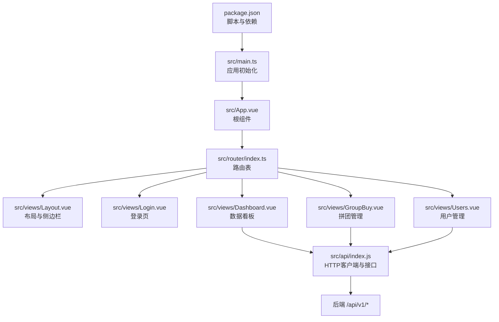
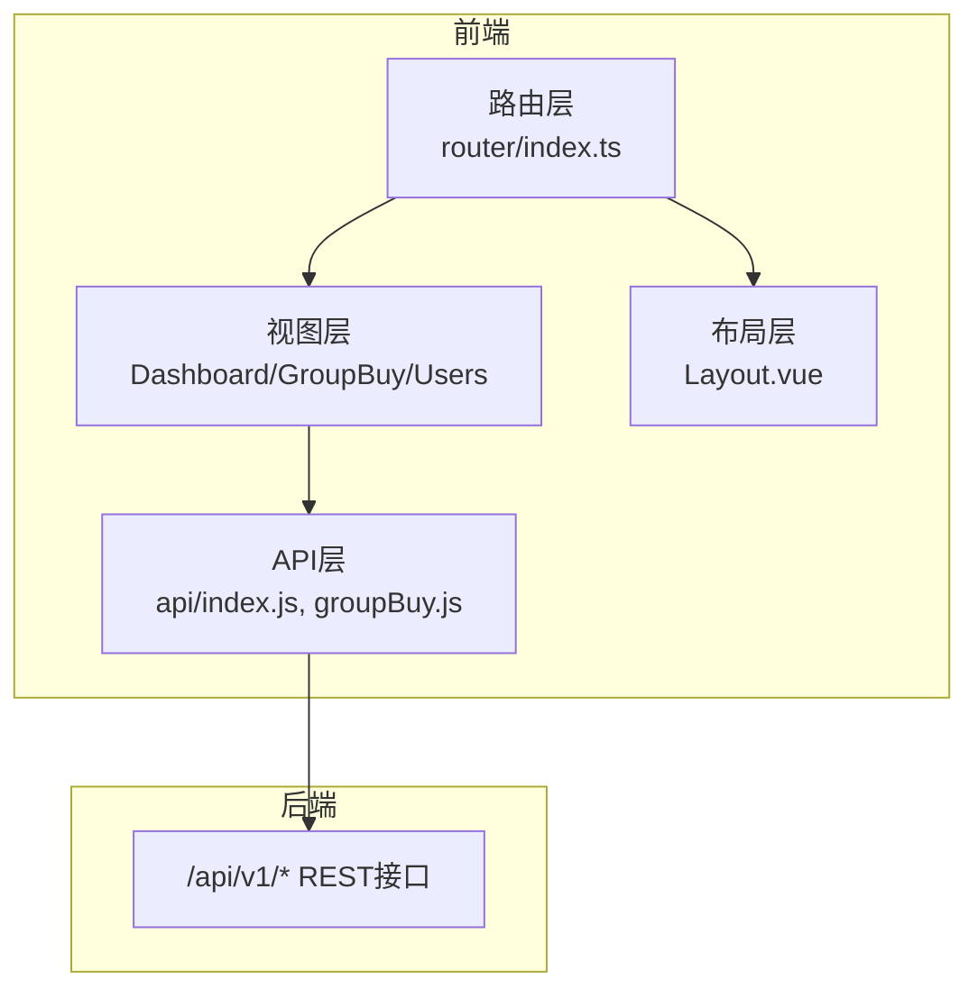
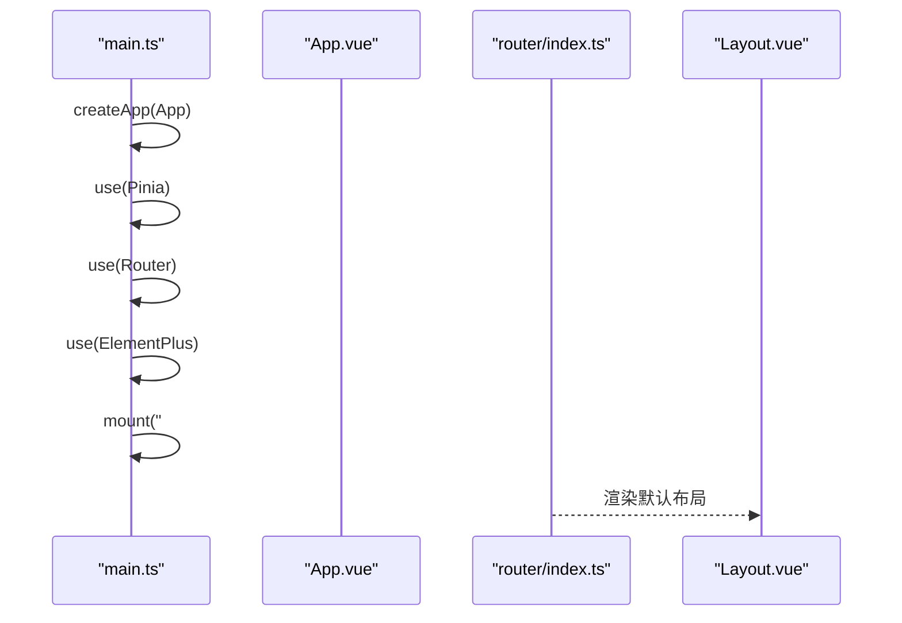
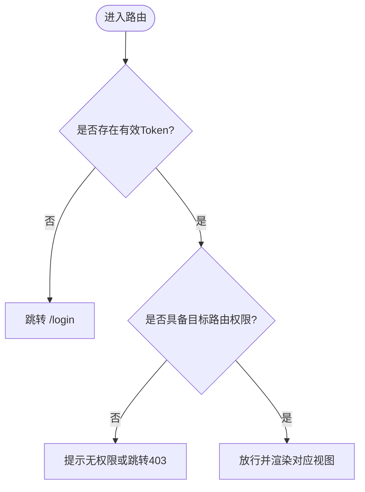
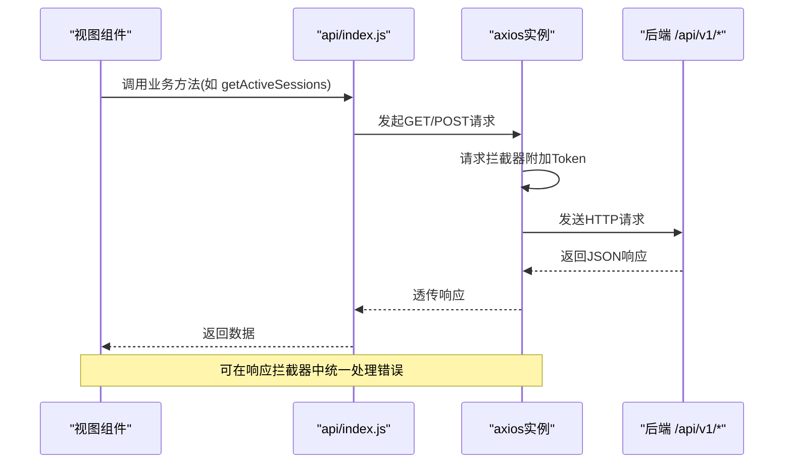
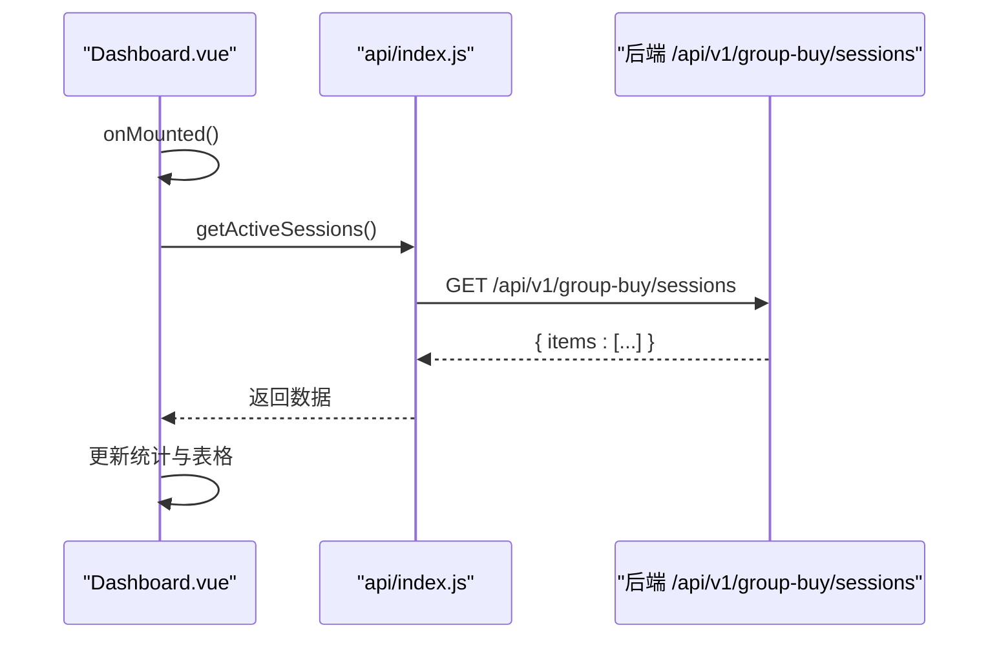
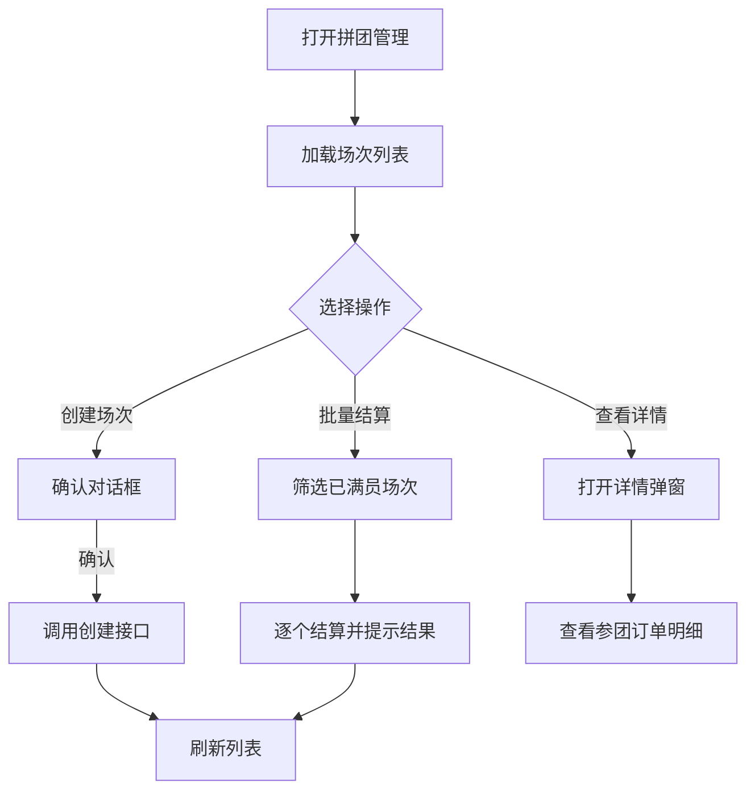
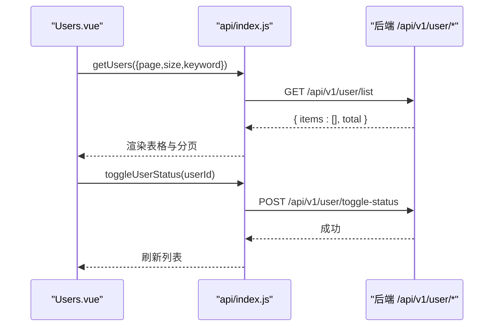
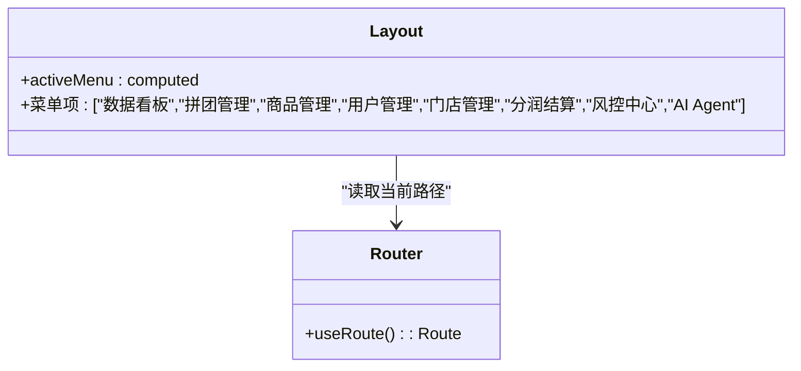
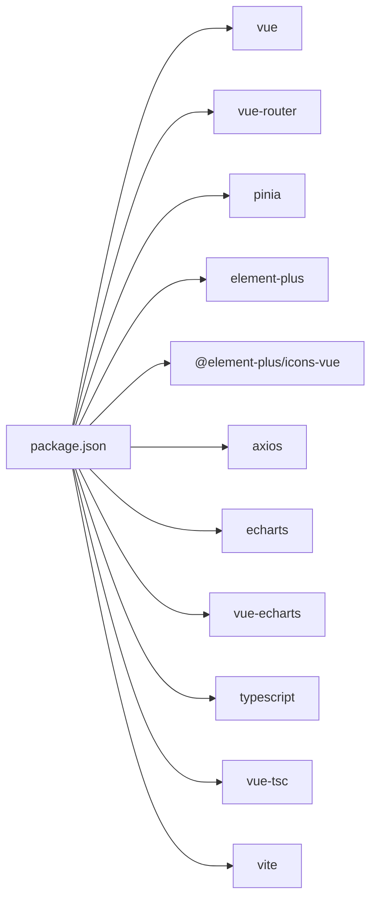

# Web管理后台Vue3应用

<cite>
**本文引用的文件**   
- [frontend/web-admin/package.json](file://frontend/web-admin/package.json)
- [frontend/web-admin/src/main.ts](file://frontend/web-admin/src/main.ts)
- [frontend/web-admin/src/App.vue](file://frontend/web-admin/src/App.vue)
- [frontend/web-admin/src/router/index.ts](file://frontend/web-admin/src/router/index.ts)
- [frontend/web-admin/src/views/Layout.vue](file://frontend/web-admin/src/views/Layout.vue)
- [frontend/web-admin/src/views/Login.vue](file://frontend/web-admin/src/views/Login.vue)
- [frontend/web-admin/src/views/Dashboard.vue](file://frontend/web-admin/src/views/Dashboard.vue)
- [frontend/web-admin/src/views/GroupBuy.vue](file://frontend/web-admin/src/views/GroupBuy.vue)
- [frontend/web-admin/src/views/Users.vue](file://frontend/web-admin/src/views/Users.vue)
- [frontend/web-admin/src/api/index.js](file://frontend/web-admin/src/api/index.js)
- [frontend/web-admin/src/api/groupBuy.js](file://frontend/web-admin/src/api/groupBuy.js)
</cite>

## 目录
1. [简介](#简介)
2. [项目结构](#项目结构)
3. [核心组件](#核心组件)
4. [架构总览](#架构总览)
5. [详细组件分析](#详细组件分析)
6. [依赖分析](#依赖分析)
7. [性能考虑](#性能考虑)
8. [故障排查指南](#故障排查指南)
9. [结论](#结论)
10. [附录](#附录)

## 简介
本技术文档面向AIxingmu Web管理后台（基于Vue3 + TypeScript + Element Plus）的前端实现，系统覆盖数据看板、拼团业务管理、用户管理、门店管理、订单处理等核心后台界面。文档从模块化项目结构、路由与权限控制、组件库集成、状态管理方案入手，深入解析前后端通信协议、API封装、错误处理机制与缓存策略，并给出安全防护、权限验证、操作日志记录、数据导出、构建打包优化与部署策略建议，以及开发环境搭建指南。

## 项目结构
前端采用按功能域划分的模块组织方式：
- 入口与全局配置：main.ts、App.vue
- 路由定义：router/index.ts
- 页面视图：views/*（Layout、Login、Dashboard、GroupBuy、Users等）
- API层：api/index.js、api/groupBuy.js
- 构建与依赖：package.json

图表来源
- [frontend/web-admin/package.json:1-28](file://frontend/web-admin/package.json#L1-L28)
- [frontend/web-admin/src/main.ts:1-13](file://frontend/web-admin/src/main.ts#L1-L13)
- [frontend/web-admin/src/App.vue:1-4](file://frontend/web-admin/src/App.vue#L1-L4)
- [frontend/web-admin/src/router/index.ts:1-26](file://frontend/web-admin/src/router/index.ts#L1-L26)
- [frontend/web-admin/src/views/Layout.vue:1-85](file://frontend/web-admin/src/views/Layout.vue#L1-L85)
- [frontend/web-admin/src/views/Login.vue:1-2](file://frontend/web-admin/src/views/Login.vue#L1-L2)
- [frontend/web-admin/src/views/Dashboard.vue:1-109](file://frontend/web-admin/src/views/Dashboard.vue#L1-L109)
- [frontend/web-admin/src/views/GroupBuy.vue:1-218](file://frontend/web-admin/src/views/GroupBuy.vue#L1-L218)
- [frontend/web-admin/src/views/Users.vue:1-144](file://frontend/web-admin/src/views/Users.vue#L1-L144)
- [frontend/web-admin/src/api/index.js:1-56](file://frontend/web-admin/src/api/index.js#L1-L56)

章节来源
- [frontend/web-admin/package.json:1-28](file://frontend/web-admin/package.json#L1-L28)
- [frontend/web-admin/src/main.ts:1-13](file://frontend/web-admin/src/main.ts#L1-L13)
- [frontend/web-admin/src/App.vue:1-4](file://frontend/web-admin/src/App.vue#L1-L4)
- [frontend/web-admin/src/router/index.ts:1-26](file://frontend/web-admin/src/router/index.ts#L1-L26)

## 核心组件
- 应用初始化与插件注册
  - Vue应用创建、Pinia状态管理、Element Plus UI框架、路由挂载顺序清晰，便于扩展。
- 路由与布局
  - 使用vue-router的history模式；Layout作为主布局容器，包含侧边导航与顶部用户信息区；子路由按需懒加载。
- 页面视图
  - Dashboard：统计卡片+场次列表+Agent运行状态展示。
  - GroupBuy：场次筛选、批量结算、详情弹窗、状态标签映射。
  - Users：分页、搜索、启用/禁用切换、详情弹窗。
- API封装
  - axios实例统一baseURL与超时；请求拦截器自动附加Authorization头；按业务域拆分导出方法。

章节来源
- [frontend/web-admin/src/main.ts:1-13](file://frontend/web-admin/src/main.ts#L1-L13)
- [frontend/web-admin/src/router/index.ts:1-26](file://frontend/web-admin/src/router/index.ts#L1-L26)
- [frontend/web-admin/src/views/Layout.vue:1-85](file://frontend/web-admin/src/views/Layout.vue#L1-L85)
- [frontend/web-admin/src/views/Dashboard.vue:1-109](file://frontend/web-admin/src/views/Dashboard.vue#L1-L109)
- [frontend/web-admin/src/views/GroupBuy.vue:1-218](file://frontend/web-admin/src/views/GroupBuy.vue#L1-L218)
- [frontend/web-admin/src/views/Users.vue:1-144](file://frontend/web-admin/src/views/Users.vue#L1-L144)
- [frontend/web-admin/src/api/index.js:1-56](file://frontend/web-admin/src/api/index.js#L1-L56)

## 架构总览
前端以“视图层 + 路由层 + API层”分层组织，通过axios进行前后端通信，后端提供RESTful API。

图表来源
- [frontend/web-admin/src/router/index.ts:1-26](file://frontend/web-admin/src/router/index.ts#L1-L26)
- [frontend/web-admin/src/views/Layout.vue:1-85](file://frontend/web-admin/src/views/Layout.vue#L1-L85)
- [frontend/web-admin/src/views/Dashboard.vue:1-109](file://frontend/web-admin/src/views/Dashboard.vue#L1-L109)
- [frontend/web-admin/src/views/GroupBuy.vue:1-218](file://frontend/web-admin/src/views/GroupBuy.vue#L1-L218)
- [frontend/web-admin/src/views/Users.vue:1-144](file://frontend/web-admin/src/views/Users.vue#L1-L144)
- [frontend/web-admin/src/api/index.js:1-56](file://frontend/web-admin/src/api/index.js#L1-L56)

## 详细组件分析

### 应用初始化与全局配置
- 应用启动流程
  - 创建Vue应用实例 -> 注册Pinia -> 注册Router -> 注册ElementPlus -> 挂载到DOM。
- 插件与样式
  - Element Plus样式全局引入，图标按需导入至视图层。

图表来源
- [frontend/web-admin/src/main.ts:1-13](file://frontend/web-admin/src/main.ts#L1-L13)
- [frontend/web-admin/src/App.vue:1-4](file://frontend/web-admin/src/App.vue#L1-L4)
- [frontend/web-admin/src/router/index.ts:1-26](file://frontend/web-admin/src/router/index.ts#L1-L26)
- [frontend/web-admin/src/views/Layout.vue:1-85](file://frontend/web-admin/src/views/Layout.vue#L1-L85)

章节来源
- [frontend/web-admin/src/main.ts:1-13](file://frontend/web-admin/src/main.ts#L1-L13)
- [frontend/web-admin/src/App.vue:1-4](file://frontend/web-admin/src/App.vue#L1-L4)

### 路由与权限控制
- 路由表
  - 登录页独立；其余页面在Layout下以children形式组织，支持懒加载。
- 权限控制现状与建议
  - 当前未实现全局前置守卫；建议在路由层增加beforeEach校验token与角色，结合后端返回的用户权限进行动态菜单渲染与访问拦截。

章节来源
- [frontend/web-admin/src/router/index.ts:1-26](file://frontend/web-admin/src/router/index.ts#L1-L26)

### API层与前后端通信
- HTTP客户端
  - 统一baseURL为/api/v1，设置超时；请求拦截器自动注入Authorization头（Bearer Token）。
- 接口分组
  - 认证、拼团、商品、用户、贡献值、积分、消费券、门店、管理后台等接口集中导出；groupBuy.js对部分方法进行再导出以便按模块引用。
- 错误处理
  - 当前在各视图中捕获异常并提示；建议在API层增加响应拦截器，统一处理401/403/网络异常与业务错误码。

图表来源
- [frontend/web-admin/src/api/index.js:1-56](file://frontend/web-admin/src/api/index.js#L1-L56)
- [frontend/web-admin/src/api/groupBuy.js:1-2](file://frontend/web-admin/src/api/groupBuy.js#L1-2)

章节来源
- [frontend/web-admin/src/api/index.js:1-56](file://frontend/web-admin/src/api/index.js#L1-L56)
- [frontend/web-admin/src/api/groupBuy.js:1-2](file://frontend/web-admin/src/api/groupBuy.js#L1-2)

### 数据看板（Dashboard）
- 功能要点
  - 统计卡片：今日场次、交易金额、全网贡献值、积分池剩余。
  - 实时场次表格：显示级别、人数、状态等，并通过标签区分。
  - Agent运行状态：以描述列表展示各Agent健康度。
- 数据来源
  - 通过getActiveSessions获取活跃场次，填充统计与表格。

图表来源
- [frontend/web-admin/src/views/Dashboard.vue:1-109](file://frontend/web-admin/src/views/Dashboard.vue#L1-L109)
- [frontend/web-admin/src/api/index.js:1-56](file://frontend/web-admin/src/api/index.js#L1-56)

章节来源
- [frontend/web-admin/src/views/Dashboard.vue:1-109](file://frontend/web-admin/src/views/Dashboard.vue#L1-L109)

### 拼团业务管理（GroupBuy）
- 功能要点
  - 操作栏：创建当日场次、批量结算、日期范围筛选、级别筛选。
  - 场次列表：字段含ID、日期、时间、级别、金额、参团人数、状态、获胜者等。
  - 详情弹窗：展示场次信息与参团订单明细。
- 交互流程
  - 创建/结算前弹出确认框；成功后刷新列表；失败时提示错误。

图表来源
- [frontend/web-admin/src/views/GroupBuy.vue:1-218](file://frontend/web-admin/src/views/GroupBuy.vue#L1-218)
- [frontend/web-admin/src/api/index.js:1-56](file://frontend/web-admin/src/api/index.js#L1-56)

章节来源
- [frontend/web-admin/src/views/GroupBuy.vue:1-218](file://frontend/web-admin/src/views/GroupBuy.vue#L1-218)

### 用户管理（Users）
- 功能要点
  - 搜索：手机号/昵称模糊查询。
  - 列表：展示代理级别、余额、贡献值、积分、消费券、状态、注册时间等。
  - 操作：启用/禁用切换、查看详情。
  - 分页：支持页码与每页条数切换。
- 交互流程
  - 切换状态前二次确认；成功则刷新列表。

图表来源
- [frontend/web-admin/src/views/Users.vue:1-144](file://frontend/web-admin/src/views/Users.vue#L1-144)
- [frontend/web-admin/src/api/index.js:1-56](file://frontend/web-admin/src/api/index.js#L1-56)

章节来源
- [frontend/web-admin/src/views/Users.vue:1-144](file://frontend/web-admin/src/views/Users.vue#L1-144)

### 布局与导航（Layout）
- 布局结构
  - 左侧固定宽度侧边栏，深色主题；右侧头部包含用户下拉菜单；主体区域承载路由视图。
- 菜单联动
  - 根据当前路由高亮对应菜单项。

图表来源
- [frontend/web-admin/src/views/Layout.vue:1-85](file://frontend/web-admin/src/views/Layout.vue#L1-85)
- [frontend/web-admin/src/router/index.ts:1-26](file://frontend/web-admin/src/router/index.ts#L1-26)

章节来源
- [frontend/web-admin/src/views/Layout.vue:1-85](file://frontend/web-admin/src/views/Layout.vue#L1-85)

## 依赖分析
- 运行时依赖
  - vue、vue-router、pinia、element-plus、@element-plus/icons-vue、axios、echarts、vue-echarts。
- 开发依赖
  - @vitejs/plugin-vue、typescript、vite、vue-tsc。
- 构建脚本
  - dev/build/preview命令用于开发与预览。

图表来源
- [frontend/web-admin/package.json:1-28](file://frontend/web-admin/package.json#L1-28)

章节来源
- [frontend/web-admin/package.json:1-28](file://frontend/web-admin/package.json#L1-28)

## 性能考虑
- 路由懒加载：所有子路由均使用动态import，减少首屏体积。
- 组件按需引入：Element Plus图标按需导入，避免全量引入。
- 列表渲染优化：大数据量场景可考虑虚拟滚动与分页加载。
- 图表渲染：ECharts按需引入与销毁，避免内存泄漏。
- 请求优化：合并重复请求、防抖/节流、合理缓存策略（见下文）。

[本节为通用指导，不直接分析具体文件]

## 故障排查指南
- 常见问题定位
  - 401未授权：检查localStorage中的token是否正确注入到Authorization头。
  - 跨域问题：确认Nginx反向代理将/api/v1转发至后端服务。
  - 接口报错：在浏览器Network面板查看请求URL、参数与响应体，定位后端错误码。
  - 页面空白：检查路由匹配与组件懒加载是否正常。
- 建议增强
  - 在API层增加响应拦截器，统一处理错误码与提示。
  - 增加全局错误边界与重试机制。
  - 关键操作添加操作日志上报。

章节来源
- [frontend/web-admin/src/api/index.js:1-56](file://frontend/web-admin/src/api/index.js#L1-56)

## 结论
本项目采用清晰的Vue3 + TypeScript + Element Plus技术栈，模块化组织良好，路由懒加载与API封装基础完备。后续可在权限控制、错误统一处理、数据缓存与导出、安全加固等方面持续完善，以提升系统的稳定性与可维护性。

[本节为总结性内容，不直接分析具体文件]

## 附录

### 前后端通信协议与接口清单（前端视角）
- 基础约定
  - baseURL: /api/v1
  - 认证：请求头Authorization: Bearer <token>
- 主要接口（示例）
  - 认证：POST /auth/login、POST /auth/register
  - 拼团：GET /group-buy/sessions、POST /group-buy/join、GET /group-buy/orders
  - 商品：GET /product/list
  - 用户：GET /user/me、GET /user/wallet
  - 贡献值：GET /contribution/my、GET /contribution/total
  - 积分：GET /points/pool、POST /points/convert
  - 消费券：GET /coupon/my
  - 门店：GET /store/list、GET /store/ranking、GET /store/team
  - 管理后台：POST /admin/group-buy/create-sessions、POST /admin/group-buy/settle/:id、POST /admin/dividend/weekly、GET /admin/risk/logs

章节来源
- [frontend/web-admin/src/api/index.js:1-56](file://frontend/web-admin/src/api/index.js#L1-56)

### 安全防护与权限验证建议
- 前端
  - 路由守卫：beforeEach校验token与角色，未登录重定向至登录页。
  - 输入校验：表单必填与格式校验，防止XSS与非法输入。
  - 敏感信息：不在控制台打印敏感数据，避免硬编码密钥。
- 后端配合
  - JWT签发与校验、RBAC权限模型、接口限流与审计日志。

[本节为通用建议，不直接分析具体文件]

### 操作日志与数据导出建议
- 操作日志
  - 在API层或视图层对关键操作（创建、结算、状态变更）进行埋点上报，包含操作人、时间、资源ID与结果。
- 数据导出
  - 列表页增加导出按钮，后端生成CSV/Excel并提供下载链接；前端处理大文件分片下载与进度提示。

[本节为通用建议，不直接分析具体文件]

### 构建、打包与部署
- 本地开发
  - 安装依赖后执行开发命令，启动Vite开发服务器。
- 生产构建
  - 类型检查与构建命令组合，输出静态资源。
- 部署策略
  - Nginx反向代理：将/api/v1转发至后端服务；静态资源走CDN或Nginx缓存。
  - 环境变量：通过构建期变量注入后端地址与特性开关。

章节来源
- [frontend/web-admin/package.json:1-28](file://frontend/web-admin/package.json#L1-28)

### 开发环境搭建指南
- 前置条件
  - Node.js LTS版本、包管理器（npm/yarn/pnpm）。
- 步骤
  - 进入前端目录，安装依赖。
  - 启动开发服务器，访问本地端口。
  - 配置Nginx反向代理，确保/api/v1正确转发至后端。

章节来源
- [frontend/web-admin/package.json:1-28](file://frontend/web-admin/package.json#L1-28)