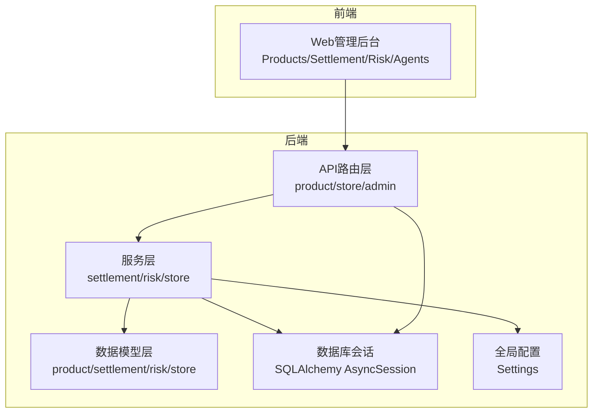
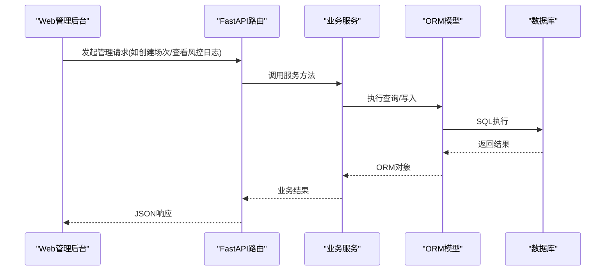
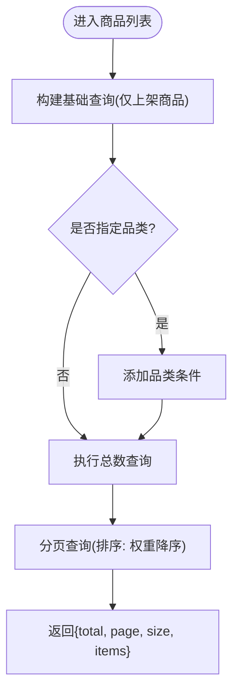
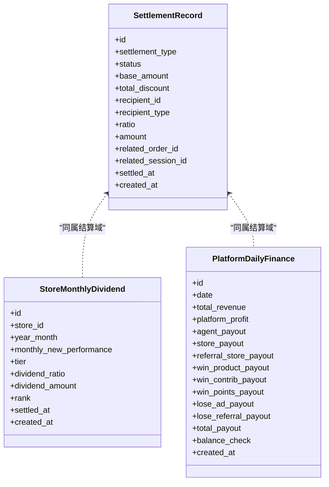
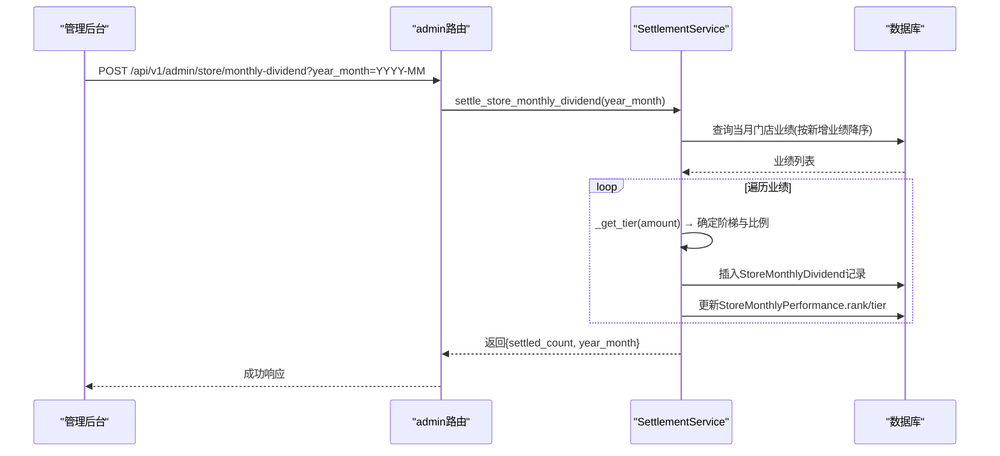
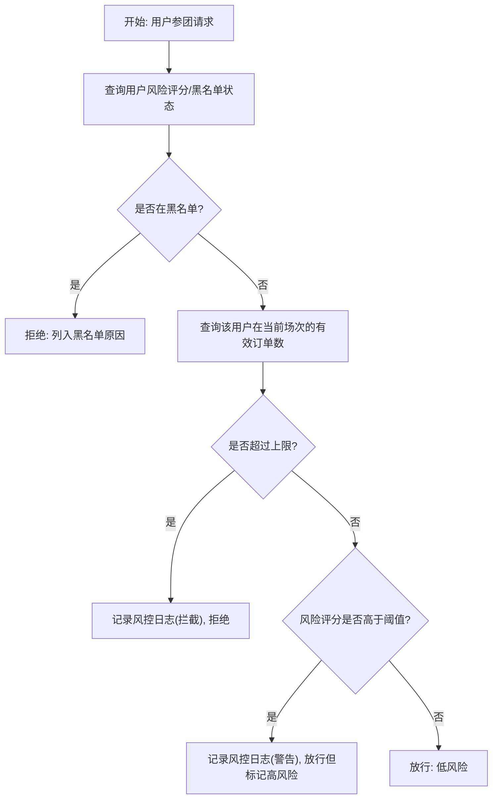
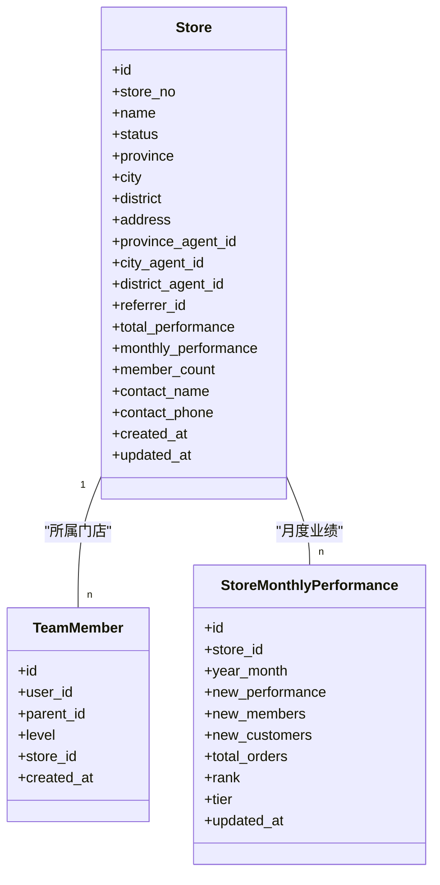
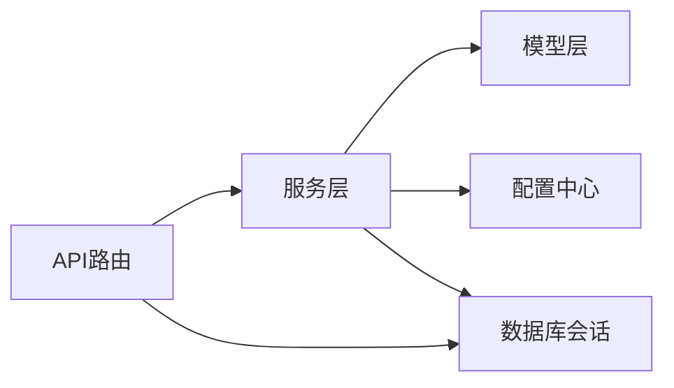

# 其他业务模块

<cite>
**本文引用的文件**   
- [backend/app/main.py](file://backend/app/main.py)
- [backend/app/config.py](file://backend/app/config.py)
- [backend/app/database.py](file://backend/app/database.py)
- [backend/app/api/v1/product.py](file://backend/app/api/v1/product.py)
- [backend/app/models/product.py](file://backend/app/models/product.py)
- [backend/app/services/settlement_service.py](file://backend/app/services/settlement_service.py)
- [backend/app/models/settlement.py](file://backend/app/models/settlement.py)
- [backend/app/services/risk_service.py](file://backend/app/services/risk_service.py)
- [backend/app/models/risk_control.py](file://backend/app/models/risk_control.py)
- [backend/app/api/v1/admin.py](file://backend/app/api/v1/admin.py)
- [backend/app/api/v1/store.py](file://backend/app/api/v1/store.py)
- [backend/app/models/store.py](file://backend/app/models/store.py)
- [backend/app/services/store_service.py](file://backend/app/services/store_service.py)
- [frontend/web-admin/src/views/Products.vue](file://frontend/web-admin/src/views/Products.vue)
- [frontend/web-admin/src/views/Settlement.vue](file://frontend/web-admin/src/views/Settlement.vue)
- [frontend/web-admin/src/views/Risk.vue](file://frontend/web-admin/src/views/Risk.vue)
- [frontend/web-admin/src/views/Agents.vue](file://frontend/web-admin/src/views/Agents.vue)
</cite>

## 目录
1. [引言](#引言)
2. [项目结构](#项目结构)
3. [核心组件](#核心组件)
4. [架构总览](#架构总览)
5. [详细组件分析](#详细组件分析)
6. [依赖分析](#依赖分析)
7. [性能考虑](#性能考虑)
8. [故障排查指南](#故障排查指南)
9. [结论](#结论)
10. [附录](#附录)

## 引言
本章节面向AIxingmu Web管理后台的“其他业务模块”，聚焦商品管理、财务结算、风控管理与代理管理等辅助功能。文档将深入解析：
- 商品信息管理、库存监控、价格调整与促销配置（以商品模型与API为支撑）
- 财务对账管理、分润结算、提现审核与财务报表生成（以结算服务与平台日结模型为核心）
- 风控规则配置、异常交易监控、黑名单管理与风险预警（以风控服务与风控日志模型为基础）
- 代理体系管理、团队业绩统计、佣金结算与代理等级管理（以门店与团队模型及门店服务为主）
并提供各模块的API对接方式、数据同步机制与业务流程集成方案，帮助前后端协同落地。

## 项目结构
后端采用FastAPI分层架构：路由层（api）、领域服务层（services）、数据模型层（models），并通过数据库会话工厂进行异步I/O；前端Web管理后台使用Vue+Element Plus页面承载各业务模块操作入口。

图表来源
- [backend/app/main.py:59-72](file://backend/app/main.py#L59-L72)
- [backend/app/api/v1/product.py:1-41](file://backend/app/api/v1/product.py#L1-L41)
- [backend/app/api/v1/store.py:1-48](file://backend/app/api/v1/store.py#L1-L48)
- [backend/app/api/v1/admin.py:1-86](file://backend/app/api/v1/admin.py#L1-L86)
- [backend/app/services/settlement_service.py:1-166](file://backend/app/services/settlement_service.py#L1-L166)
- [backend/app/services/risk_service.py:1-135](file://backend/app/services/risk_service.py#L1-L135)
- [backend/app/services/store_service.py:1-161](file://backend/app/services/store_service.py#L1-L161)
- [backend/app/models/product.py:1-135](file://backend/app/models/product.py#L1-L135)
- [backend/app/models/settlement.py:1-123](file://backend/app/models/settlement.py#L1-L123)
- [backend/app/models/risk_control.py:1-85](file://backend/app/models/risk_control.py#L1-L85)
- [backend/app/models/store.py:1-104](file://backend/app/models/store.py#L1-L104)
- [backend/app/database.py:1-40](file://backend/app/database.py#L1-L40)
- [backend/app/config.py:1-145](file://backend/app/config.py#L1-L145)
- [frontend/web-admin/src/views/Products.vue:1-2](file://frontend/web-admin/src/views/Products.vue#L1-L2)
- [frontend/web-admin/src/views/Settlement.vue:1-151](file://frontend/web-admin/src/views/Settlement.vue#L1-L151)
- [frontend/web-admin/src/views/Risk.vue:1-202](file://frontend/web-admin/src/views/Risk.vue#L1-L202)
- [frontend/web-admin/src/views/Agents.vue:1-195](file://frontend/web-admin/src/views/Agents.vue#L1-L195)

章节来源
- [backend/app/main.py:59-72](file://backend/app/main.py#L59-L72)
- [backend/app/database.py:1-40](file://backend/app/database.py#L1-L40)
- [backend/app/config.py:1-145](file://backend/app/config.py#L1-L145)

## 核心组件
- 商品管理组件
  - 提供商品列表查询与详情接口，支持按品类筛选与分页排序，关联SKU与订单明细模型，便于库存与价格联动。
- 财务结算组件
  - 实现线下四级分润（省/市/区县/门店）与推荐门店分润，记录每笔分润明细，并支持门店月度阶梯分红计算与排名更新。
- 风控管理组件
  - 参团前风控检查（黑名单、单组限购、风险评分），事件驱动的风险评分更新与日志归档，支持分页查询。
- 代理与门店组件
  - 门店创建、区域归属、团队成员关系维护、月度业绩聚合与排名、门店列表与筛选。

章节来源
- [backend/app/api/v1/product.py:15-41](file://backend/app/api/v1/product.py#L15-L41)
- [backend/app/models/product.py:30-135](file://backend/app/models/product.py#L30-L135)
- [backend/app/services/settlement_service.py:17-166](file://backend/app/services/settlement_service.py#L17-L166)
- [backend/app/models/settlement.py:30-123](file://backend/app/models/settlement.py#L30-L123)
- [backend/app/services/risk_service.py:14-135](file://backend/app/services/risk_service.py#L14-L135)
- [backend/app/models/risk_control.py:40-85](file://backend/app/models/risk_control.py#L40-L85)
- [backend/app/api/v1/store.py:13-48](file://backend/app/api/v1/store.py#L13-L48)
- [backend/app/models/store.py:22-104](file://backend/app/models/store.py#L22-L104)
- [backend/app/services/store_service.py:15-161](file://backend/app/services/store_service.py#L15-L161)

## 架构总览
系统通过FastAPI统一注册各业务路由，服务层封装复杂业务逻辑，模型层定义持久化结构与索引，数据库会话由依赖注入提供。前端页面调用对应API完成管理操作。

图表来源
- [backend/app/main.py:59-72](file://backend/app/main.py#L59-L72)
- [backend/app/api/v1/admin.py:18-86](file://backend/app/api/v1/admin.py#L18-L86)
- [backend/app/services/settlement_service.py:87-133](file://backend/app/services/settlement_service.py#L87-L133)
- [backend/app/services/risk_service.py:110-135](file://backend/app/services/risk_service.py#L110-L135)
- [backend/app/database.py:29-40](file://backend/app/database.py#L29-L40)

## 详细组件分析

### 商品管理模块
- 能力概览
  - 商品列表：支持按品类过滤、分页、排序（权重降序）。
  - 商品详情：按ID获取，不存在时返回404提示。
  - 库存与价格：模型包含原价、售价、成本价、让利金额、库存与已售数量，便于库存监控与价格调整。
  - SKU与订单明细：SKU独立表，订单明细记录购买项，支撑库存扣减与价格核算。
- 关键流程
  - 列表查询：构建基础查询→条件过滤→计数→分页取数→组装返回。
  - 详情查询：按主键查找→空值处理→返回实体。
- 前端集成
  - 商品管理页面作为入口，后续可对接商品CRUD与库存/价格调整表单。

图表来源
- [backend/app/api/v1/product.py:15-31](file://backend/app/api/v1/product.py#L15-L31)
- [backend/app/models/product.py:30-73](file://backend/app/models/product.py#L30-L73)

章节来源
- [backend/app/api/v1/product.py:15-41](file://backend/app/api/v1/product.py#L15-L41)
- [backend/app/models/product.py:30-135](file://backend/app/models/product.py#L30-L135)
- [frontend/web-admin/src/views/Products.vue:1-2](file://frontend/web-admin/src/views/Products.vue#L1-L2)

### 财务结算模块
- 能力概览
  - 分润结算：拼团成功场景下，按配置比例向省级/市级/区县代理、门店、推荐门店分别记录分润明细。
  - 门店月度分红：根据当月新增业绩落入阶梯区间，计算分红比例与金额，并更新排名与等级。
  - 平台日结汇总：记录平台收入与支出明细，确保收支平衡校验。
- 关键流程
  - 分润结算：读取门店代理信息→按配置比例计算→批量创建分润记录→flush提交。
  - 月度分红：拉取当月业绩→判定阶梯→计算分红→写入分红记录→更新排名与等级。
- 前端集成
  - 结算页面展示今日/本月总额、待结算与已结算金额，支持日期范围与类型筛选的分润记录分页浏览。

图表来源
- [backend/app/models/settlement.py:30-123](file://backend/app/models/settlement.py#L30-L123)

图表来源
- [backend/app/api/v1/admin.py:59-68](file://backend/app/api/v1/admin.py#L59-L68)
- [backend/app/services/settlement_service.py:87-133](file://backend/app/services/settlement_service.py#L87-L133)
- [backend/app/models/settlement.py:66-94](file://backend/app/models/settlement.py#L66-L94)

章节来源
- [backend/app/services/settlement_service.py:17-166](file://backend/app/services/settlement_service.py#L17-L166)
- [backend/app/models/settlement.py:30-123](file://backend/app/models/settlement.py#L30-L123)
- [backend/app/api/v1/admin.py:59-68](file://backend/app/api/v1/admin.py#L59-L68)
- [frontend/web-admin/src/views/Settlement.vue:1-151](file://frontend/web-admin/src/views/Settlement.vue#L1-L151)

### 风控管理模块
- 能力概览
  - 参团风控检查：黑名单拦截、单组参与次数限制、高风险用户警告放行。
  - 风险评分更新：基于事件类型累计加分，超过阈值自动加入黑名单。
  - 风控日志：支持按用户与风险等级筛选，分页返回。
- 关键流程
  - 检查流程：查黑名单→查单组订单计数→查风险评分→记录日志并返回决策。
  - 评分更新：存在则累加，不存在则初始化；超过阈值标记黑名单。
- 前端集成
  - 风控页面展示拦截统计、黑名单人数、高风险人数与平均评分；支持规则筛选与黑名单增删。

图表来源
- [backend/app/services/risk_service.py:17-74](file://backend/app/services/risk_service.py#L17-L74)
- [backend/app/models/risk_control.py:40-85](file://backend/app/models/risk_control.py#L40-L85)

章节来源
- [backend/app/services/risk_service.py:17-135](file://backend/app/services/risk_service.py#L17-L135)
- [backend/app/models/risk_control.py:40-85](file://backend/app/models/risk_control.py#L40-L85)
- [frontend/web-admin/src/views/Risk.vue:1-202](file://frontend/web-admin/src/views/Risk.vue#L1-L202)

### 代理与门店管理模块
- 能力概览
  - 门店管理：创建门店、区域归属（省/市/区县）、联系人信息、状态管理。
  - 团队关系：四级团队层级（直推/间推/间间推/间间间推），支持按层级查询成员。
  - 业绩统计：月度新增业绩、会员与客户增长、订单数聚合，支持全网排名。
  - 门店列表：按省份/城市/状态筛选与分页。
- 关键流程
  - 创建门店：填充基本信息与代理归属→设置初始状态→持久化。
  - 月度业绩更新：按年月聚合新增指标→同步门店总业绩与当月业绩。
  - 团队查询：按父级与层级过滤成员列表。
  - 排名查询：按年月与新增业绩降序取TopN。
- 前端集成
  - 门店与团队页面可通过列表、排名与团队接口完成日常运营。

图表来源
- [backend/app/models/store.py:22-104](file://backend/app/models/store.py#L22-L104)

章节来源
- [backend/app/api/v1/store.py:13-48](file://backend/app/api/v1/store.py#L13-L48)
- [backend/app/models/store.py:22-104](file://backend/app/models/store.py#L22-L104)
- [backend/app/services/store_service.py:15-161](file://backend/app/services/store_service.py#L15-L161)

## 依赖分析
- 模块耦合
  - 路由层依赖服务层，服务层依赖模型层与配置中心；数据库会话通过依赖注入提供。
  - 结算服务依赖门店与用户模型，用于代理分润计算；风控服务依赖拼团订单与风控模型。
- 外部依赖
  - 数据库：PostgreSQL（异步引擎与连接池）
  - Redis/Celery：消息队列与任务后端（配置中预留）
  - MinIO：对象存储（配置中预留）
- 潜在循环依赖
  - 当前未见直接循环导入；服务层内部按需import避免启动期耦合。

图表来源
- [backend/app/main.py:59-72](file://backend/app/main.py#L59-L72)
- [backend/app/database.py:1-40](file://backend/app/database.py#L1-L40)
- [backend/app/config.py:1-145](file://backend/app/config.py#L1-L145)

章节来源
- [backend/app/main.py:59-72](file://backend/app/main.py#L59-L72)
- [backend/app/database.py:1-40](file://backend/app/database.py#L1-L40)
- [backend/app/config.py:1-145](file://backend/app/config.py#L1-L145)

## 性能考虑
- 数据库索引
  - 商品：按品类、状态、门店建立索引，提升筛选与分页效率。
  - 结算：按结算类型/状态、接收方建立索引，加速报表与查询。
  - 风控：按用户/时间、风险等级建立索引，提高日志检索速度。
  - 门店：按状态、区域、年月建立索引，优化列表与排名查询。
- 分页与限流
  - 列表接口普遍采用offset/limit分页，建议结合游标或范围查询优化大数据量场景。
  - 风控检查在高频路径上应缓存黑名单与风险评分，减少重复查询。
- 事务与批处理
  - 分润结算与月度分红涉及多记录写入，建议使用批量插入与最小事务边界，降低锁竞争。
- 配置化参数
  - 分润比例、阶梯阈值、风控阈值等通过配置集中管理，便于A/B测试与灰度发布。

[本节为通用性能建议，不直接分析具体文件]

## 故障排查指南
- 常见问题定位
  - 商品列表为空：确认商品状态是否为上架，品类筛选是否正确，分页参数是否越界。
  - 分润未生成：检查门店代理ID是否存在，分润比例配置是否生效，相关场次是否已结算。
  - 风控误拦截：核查黑名单状态、单组订单计数、风险评分阈值与事件映射。
  - 门店排名异常：确认月度业绩是否按时聚合，排名与等级字段是否被覆盖。
- 日志与监控
  - 风控日志：通过管理后台接口分页查询，结合风险等级与规则类型快速定位问题。
  - 结算记录：按类型与日期范围筛选，核对分润金额与比例一致性。
- 中间件与异常
  - 全局异常中间件统一捕获异常，建议在服务层抛出明确错误码与消息，便于前端提示。

章节来源
- [backend/app/api/v1/admin.py:71-86](file://backend/app/api/v1/admin.py#L71-L86)
- [backend/app/services/risk_service.py:110-135](file://backend/app/services/risk_service.py#L110-L135)
- [backend/app/services/settlement_service.py:87-133](file://backend/app/services/settlement_service.py#L87-L133)

## 结论
本模块文档围绕商品、财务、风控与代理四大辅助业务展开，明确了数据模型、服务逻辑与API交互方式，并结合前端页面给出集成要点。通过配置化参数与索引优化，可在保证一致性的前提下提升性能与可维护性。后续建议完善提现审核与财务报表生成的API与页面，形成端到端的闭环管理能力。

[本节为总结性内容，不直接分析具体文件]

## 附录
- 关键API清单（示例）
  - 商品管理
    - GET /api/v1/product/list?category=&page=&size=
    - GET /api/v1/product/{product_id}
  - 管理后台
    - POST /api/v1/admin/group-buy/create-sessions?date=
    - POST /api/v1/admin/group-buy/settle/{session_id}
    - POST /api/v1/admin/dividend/weekly
    - POST /api/v1/admin/contribution/weekly-settle
    - POST /api/v1/admin/store/monthly-dividend?year_month=
    - GET /api/v1/admin/risk/logs?page=&size=
    - GET /api/v1/admin/points/pool
  - 门店与团队
    - GET /api/v1/store/list?province=&city=&page=&size=
    - GET /api/v1/store/ranking?year_month=
    - GET /api/v1/store/team?level=&user_id=

章节来源
- [backend/app/api/v1/product.py:15-41](file://backend/app/api/v1/product.py#L15-L41)
- [backend/app/api/v1/admin.py:18-86](file://backend/app/api/v1/admin.py#L18-L86)
- [backend/app/api/v1/store.py:13-48](file://backend/app/api/v1/store.py#L13-L48)