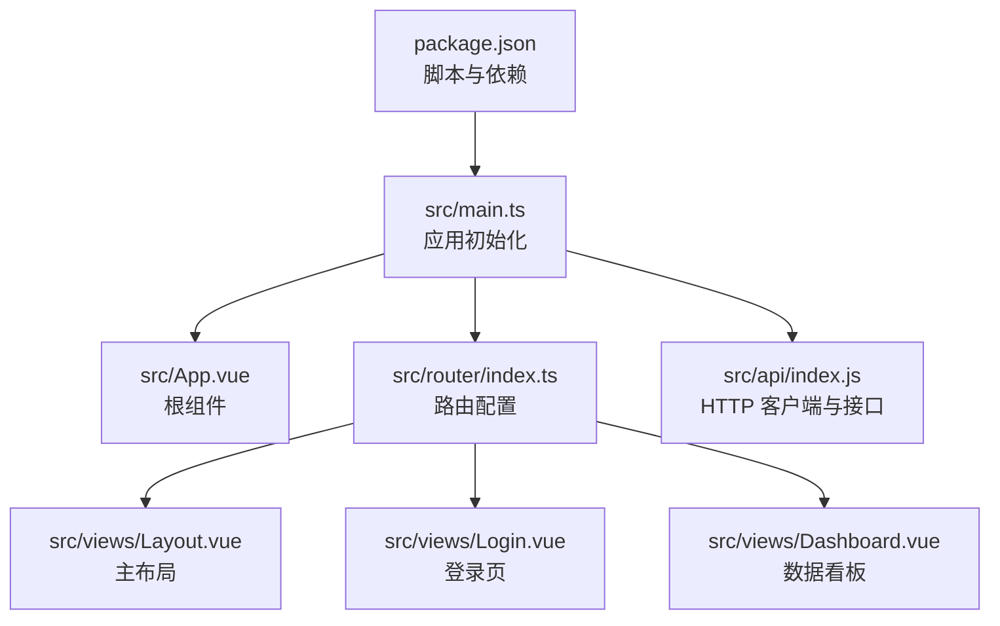
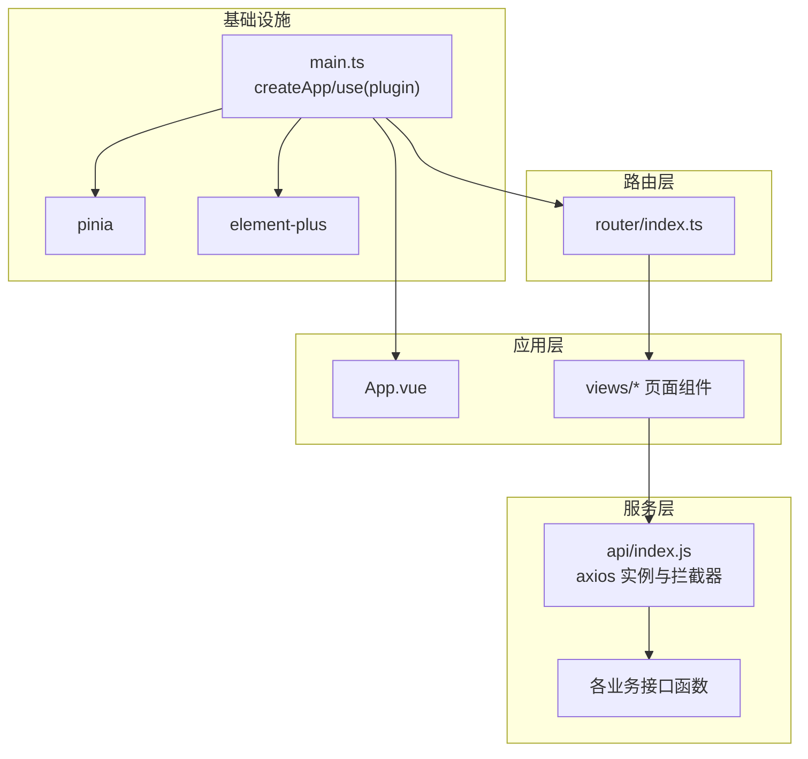
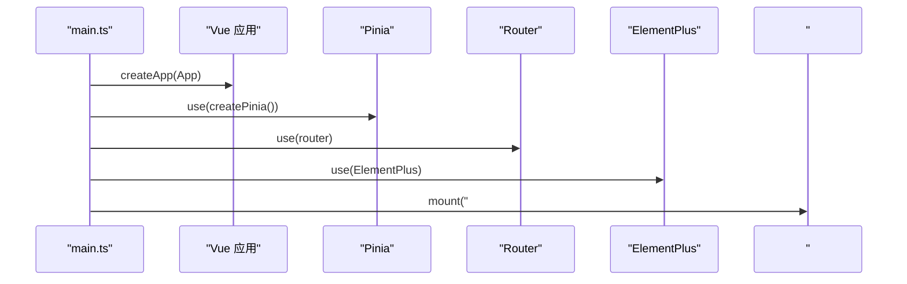
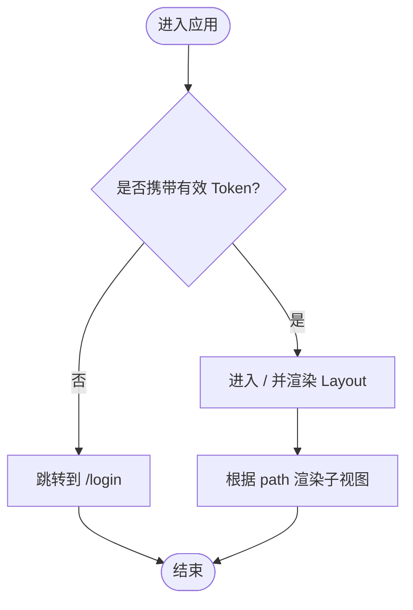
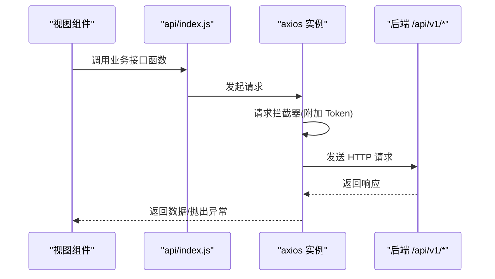
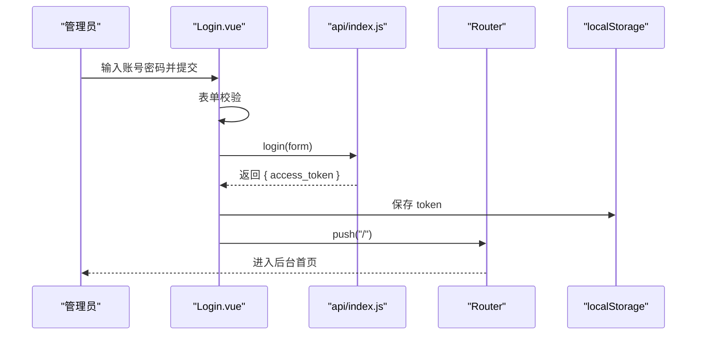
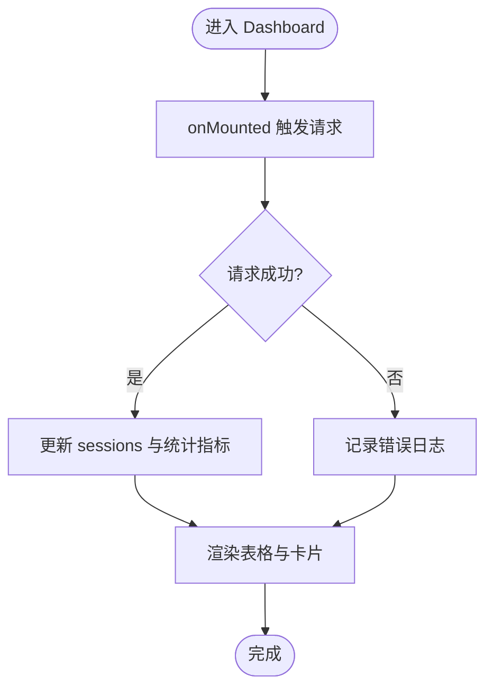
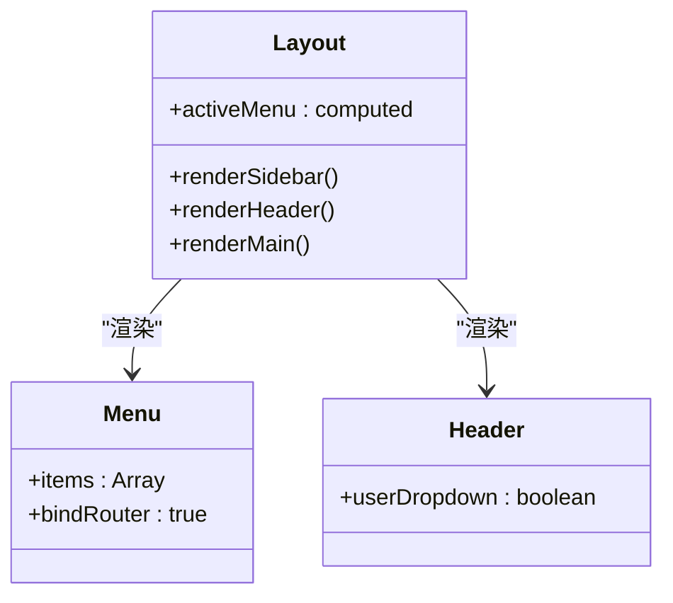
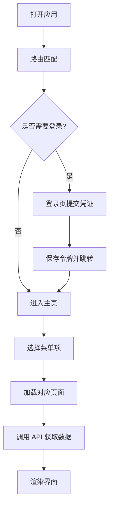
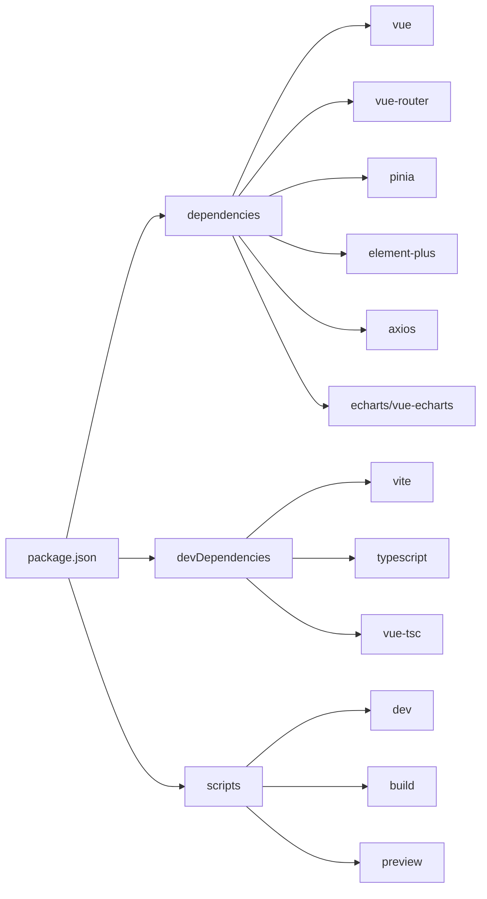

# 应用架构设计

<cite>
**本文引用的文件**   
- [package.json](file://frontend/web-admin/package.json)
- [main.ts](file://frontend/web-admin/src/main.ts)
- [App.vue](file://frontend/web-admin/src/App.vue)
- [index.ts](file://frontend/web-admin/src/router/index.ts)
- [Layout.vue](file://frontend/web-admin/src/views/Layout.vue)
- [Login.vue](file://frontend/web-admin/src/views/Login.vue)
- [Dashboard.vue](file://frontend/web-admin/src/views/Dashboard.vue)
- [index.js](file://frontend/web-admin/src/api/index.js)
</cite>

## 目录
1. [简介](#简介)
2. [项目结构](#项目结构)
3. [核心组件](#核心组件)
4. [架构总览](#架构总览)
5. [详细组件分析](#详细组件分析)
6. [依赖分析](#依赖分析)
7. [性能考虑](#性能考虑)
8. [故障排查指南](#故障排查指南)
9. [结论](#结论)
10. [附录](#附录)

## 简介
本文件为 AIxingmu Web 管理后台（Vue3 + TypeScript + Element Plus）的架构设计文档。文档围绕技术栈选型、整体架构模式、应用初始化流程、模块依赖注入、插件配置与全局组件注册机制展开，并深入解析目录组织原则、命名规范、分层架构与模块化策略。同时涵盖 Pinia 状态管理集成、路由配置管理、Element Plus 定制与主题方案、构建优化、开发环境搭建、热重载与调试工具使用指南。

## 项目结构
前端工程位于 frontend/web-admin，采用 Vite + Vue3 + TypeScript 的工程化方案，结合 Element Plus 提供企业级 UI 能力。当前仓库中已包含入口文件、路由、布局与登录页等关键实现，API 层通过 axios 封装统一请求拦截与业务接口导出。

图表来源
- [package.json:1-28](file://frontend/web-admin/package.json#L1-L28)
- [main.ts:1-13](file://frontend/web-admin/src/main.ts#L1-L13)
- [App.vue:1-4](file://frontend/web-admin/src/App.vue#L1-L4)
- [index.ts:1-26](file://frontend/web-admin/src/router/index.ts#L1-L26)
- [Layout.vue:1-85](file://frontend/web-admin/src/views/Layout.vue#L1-L85)
- [Login.vue:1-72](file://frontend/web-admin/src/views/Login.vue#L1-L72)
- [Dashboard.vue:1-109](file://frontend/web-admin/src/views/Dashboard.vue#L1-L109)
- [index.js:1-85](file://frontend/web-admin/src/api/index.js#L1-L85)

章节来源
- [package.json:1-28](file://frontend/web-admin/package.json#L1-L28)
- [main.ts:1-13](file://frontend/web-admin/src/main.ts#L1-L13)
- [App.vue:1-4](file://frontend/web-admin/src/App.vue#L1-L4)
- [index.ts:1-26](file://frontend/web-admin/src/router/index.ts#L1-L26)
- [Layout.vue:1-85](file://frontend/web-admin/src/views/Layout.vue#L1-L85)
- [Login.vue:1-72](file://frontend/web-admin/src/views/Login.vue#L1-L72)
- [Dashboard.vue:1-109](file://frontend/web-admin/src/views/Dashboard.vue#L1-L109)
- [index.js:1-85](file://frontend/web-admin/src/api/index.js#L1-L85)

## 核心组件
- 应用初始化与依赖注入
  - 创建 Vue 应用实例，挂载 Pinia、Router、ElementPlus 三大基础设施，最后挂载到 DOM。
  - 入口文件负责“装配”而非业务逻辑，保持职责单一。
- 路由系统
  - 基于 vue-router 4 的 History 模式，集中式声明式路由表，按功能域划分页面。
  - 使用懒加载提升首屏性能。
- HTTP 客户端与接口
  - 基于 axios 创建实例，设置基础路径与超时；在请求拦截器中自动附加 Token。
  - 将认证、拼团、商品、用户、门店、分润结算、风控、Agent 管理等接口统一导出。
- 布局与页面
  - Layout 作为主框架，左侧导航+顶部操作区+右侧内容区，配合 router-view 渲染子视图。
  - Login 页面完成表单校验、调用登录接口、存储 token 并跳转首页。
  - Dashboard 展示统计卡片与实时会话列表，演示从 API 拉取数据并渲染。

章节来源
- [main.ts:1-13](file://frontend/web-admin/src/main.ts#L1-L13)
- [index.ts:1-26](file://frontend/web-admin/src/router/index.ts#L1-L26)
- [index.js:1-85](file://frontend/web-admin/src/api/index.js#L1-L85)
- [Layout.vue:1-85](file://frontend/web-admin/src/views/Layout.vue#L1-L85)
- [Login.vue:1-72](file://frontend/web-admin/src/views/Login.vue#L1-L72)
- [Dashboard.vue:1-109](file://frontend/web-admin/src/views/Dashboard.vue#L1-L109)

## 架构总览
整体采用“薄入口 + 强路由 + 集中式 API 层 + 视图组件”的分层架构：
- 表现层：以 .vue 单文件组件为主，遵循组合式 API 风格。
- 路由层：集中式路由表，按模块拆分页面，支持嵌套与重定向。
- 服务层：axios 实例 + 业务接口函数，统一处理鉴权与错误提示。
- 状态层：Pinia 用于跨组件共享状态（当前仓库未启用 store 文件，但已在入口安装）。
- 基础设施：Vite 构建、TypeScript 类型检查、Element Plus 组件库。

图表来源
- [main.ts:1-13](file://frontend/web-admin/src/main.ts#L1-L13)
- [App.vue:1-4](file://frontend/web-admin/src/App.vue#L1-L4)
- [index.ts:1-26](file://frontend/web-admin/src/router/index.ts#L1-L26)
- [index.js:1-85](file://frontend/web-admin/src/api/index.js#L1-L85)

## 详细组件分析

### 应用初始化流程
- 创建应用实例后依次安装 Pinia、Router、ElementPlus，最终挂载到 #app。
- 该顺序确保路由与 UI 库在组件渲染前可用。

图表来源
- [main.ts:1-13](file://frontend/web-admin/src/main.ts#L1-L13)

章节来源
- [main.ts:1-13](file://frontend/web-admin/src/main.ts#L1-L13)

### 路由配置与导航守卫建议
- 路由表集中定义，首页嵌套 Layout，子路由按需懒加载。
- 建议增加全局前置守卫进行登录态校验与动态菜单控制（当前仓库未实现）。

图表来源
- [index.ts:1-26](file://frontend/web-admin/src/router/index.ts#L1-L26)

章节来源
- [index.ts:1-26](file://frontend/web-admin/src/router/index.ts#L1-L26)

### HTTP 客户端与接口组织
- 统一 baseURL 与超时时间，请求拦截器自动读取 localStorage 中的 token 并注入 Authorization 头。
- 按业务域导出接口函数，便于在组件中直接 import 使用。

图表来源
- [index.js:1-85](file://frontend/web-admin/src/api/index.js#L1-L85)

章节来源
- [index.js:1-85](file://frontend/web-admin/src/api/index.js#L1-L85)

### 登录流程
- 表单校验通过后调用登录接口，成功后将 access_token 写入 localStorage，并跳转至首页。
- 失败时通过消息提示错误信息。

图表来源
- [Login.vue:1-72](file://frontend/web-admin/src/views/Login.vue#L1-L72)
- [index.js:1-85](file://frontend/web-admin/src/api/index.js#L1-L85)
- [index.ts:1-26](file://frontend/web-admin/src/router/index.ts#L1-L26)

章节来源
- [Login.vue:1-72](file://frontend/web-admin/src/views/Login.vue#L1-L72)
- [index.js:1-85](file://frontend/web-admin/src/api/index.js#L1-L85)
- [index.ts:1-26](file://frontend/web-admin/src/router/index.ts#L1-L26)

### 数据看板与列表渲染
- 看板页在生命周期钩子中调用接口获取会话列表，更新本地响应式数据并渲染表格。
- 对空数据与异常进行基本容错处理。

图表来源
- [Dashboard.vue:1-109](file://frontend/web-admin/src/views/Dashboard.vue#L1-L109)
- [index.js:1-85](file://frontend/web-admin/src/api/index.js#L1-L85)

章节来源
- [Dashboard.vue:1-109](file://frontend/web-admin/src/views/Dashboard.vue#L1-L109)
- [index.js:1-85](file://frontend/web-admin/src/api/index.js#L1-L85)

### 布局与侧边栏
- 使用 Element Plus 容器组件构建左右布局，侧边栏菜单与路由 path 绑定，高亮当前项。
- 顶部区域预留用户信息与退出操作。

图表来源
- [Layout.vue:1-85](file://frontend/web-admin/src/views/Layout.vue#L1-L85)

章节来源
- [Layout.vue:1-85](file://frontend/web-admin/src/views/Layout.vue#L1-L85)

### 概念性概览
下图展示了典型的管理后台通用工作流，不直接映射具体源码文件，仅用于帮助理解整体交互。

[本图为概念流程图，无需图表来源]

## 依赖分析
- 运行时依赖
  - Vue 3、Vue Router 4、Pinia、Element Plus、Axios、ECharts 及 Vue ECharts。
- 开发依赖
  - Vite、@vitejs/plugin-vue、TypeScript、vue-tsc。
- 脚本命令
  - dev：启动开发服务器（含热重载）。
  - build：执行类型检查并打包。
  - preview：预览生产构建产物。

图表来源
- [package.json:1-28](file://frontend/web-admin/package.json#L1-L28)

章节来源
- [package.json:1-28](file://frontend/web-admin/package.json#L1-L28)

## 性能考虑
- 路由懒加载：所有页面组件均采用动态导入，减少首屏体积。
- 静态资源与样式：Element Plus 按需引入可进一步减小包体（当前为全量引入，可在后续优化）。
- 网络请求：合理设置超时与重试策略，必要时增加缓存与去抖节流。
- 图表渲染：大数据量场景下建议使用虚拟滚动或分页加载。

[本节为通用指导，不涉及具体文件分析]

## 故障排查指南
- 登录失败
  - 检查浏览器控制台是否有网络错误；确认后端 /api/v1/auth/login 可达。
  - 确认请求拦截器是否正确附加 Authorization 头。
- 路由无法访问
  - 确认路由表 path 与菜单 index 一致。
  - 若需鉴权，建议在全局前置守卫中校验 token。
- 页面空白或报错
  - 检查 main.ts 中插件安装顺序与挂载点是否存在。
  - 查看浏览器控制台与 Network 面板定位问题。

章节来源
- [index.js:1-85](file://frontend/web-admin/src/api/index.js#L1-L85)
- [index.ts:1-26](file://frontend/web-admin/src/router/index.ts#L1-L26)
- [main.ts:1-13](file://frontend/web-admin/src/main.ts#L1-L13)

## 结论
本项目采用清晰的分层与模块化设计，入口装配、路由集中、API 统一封装，具备良好的可扩展性与可维护性。建议在后续迭代中完善全局鉴权、错误边界、国际化与主题定制，并对 Element Plus 按需引入以提升构建性能。

[本节为总结性内容，不涉及具体文件分析]

## 附录

### 技术栈与版本
- 前端框架：Vue 3
- 路由：Vue Router 4
- 状态管理：Pinia
- UI 库：Element Plus
- HTTP：Axios
- 图表：ECharts + Vue ECharts
- 构建：Vite + TypeScript + vue-tsc

章节来源
- [package.json:1-28](file://frontend/web-admin/package.json#L1-L28)

### 开发环境与运行
- 安装依赖：在项目根目录执行依赖安装。
- 启动开发服务器：使用 dev 脚本，支持热重载。
- 构建生产包：使用 build 脚本，先执行类型检查再打包。
- 预览构建产物：使用 preview 脚本。

章节来源
- [package.json:1-28](file://frontend/web-admin/package.json#L1-L28)

### 代码规范与命名约定
- 目录组织
  - src/api：HTTP 客户端与接口函数
  - src/router：路由配置
  - src/views：页面级组件
  - src/components：可复用组件（待补充）
  - src/stores：Pinia Store（待补充）
- 文件命名
  - 路由与页面使用小驼峰或短横线均可，保持一致即可。
  - 接口函数按业务域分组导出，语义清晰。
- 组件风格
  - 优先使用组合式 API 与 <script setup>。
  - 模板简洁，逻辑抽离至 script 块。

[本节为通用规范建议，不涉及具体文件分析]

### Element Plus 定制与主题
- 当前为全量引入样式，可通过按需引入与 CSS 变量覆盖实现主题定制。
- 建议建立独立主题文件，集中管理颜色、字号、间距等设计令牌。

[本节为通用实践建议，不涉及具体文件分析]

### 构建与部署建议
- 环境变量：通过 Vite 环境变量区分开发与生产 API 地址。
- 代理配置：开发阶段通过 Vite proxy 转发至后端，避免跨域。
- 压缩与缓存：开启 gzip/brotli，静态资源添加哈希与长期缓存。
- 监控与上报：接入错误监控与性能埋点。

[本节为通用实践建议，不涉及具体文件分析]