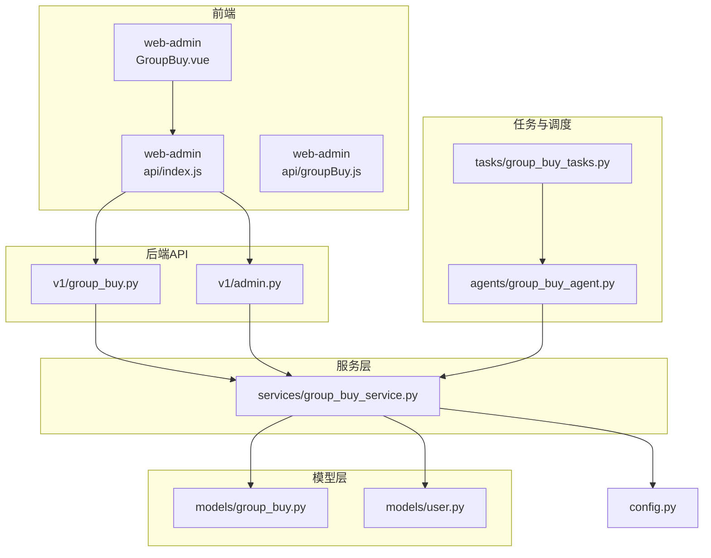
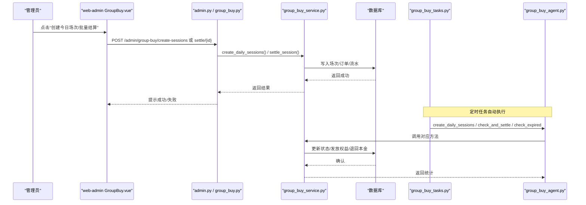
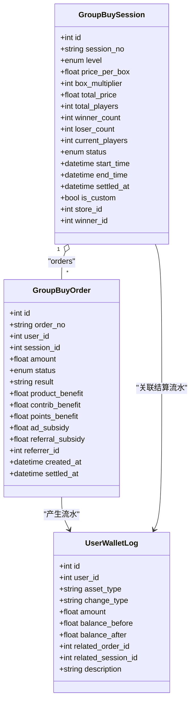
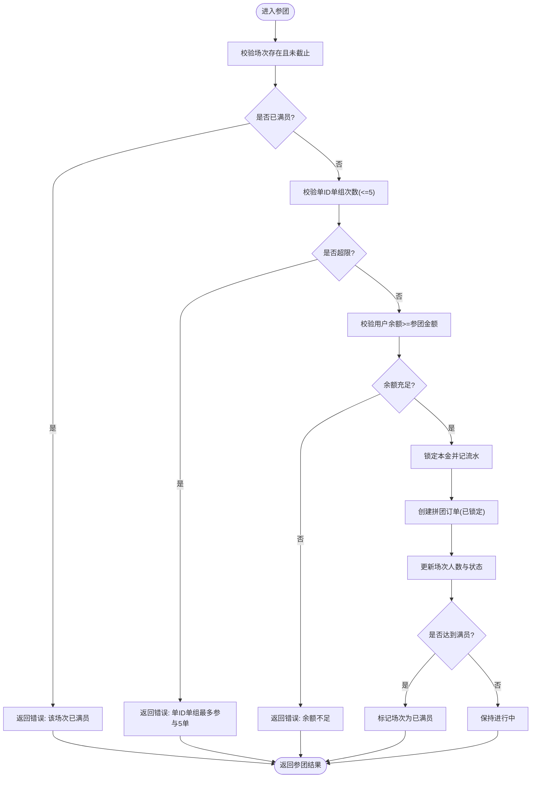
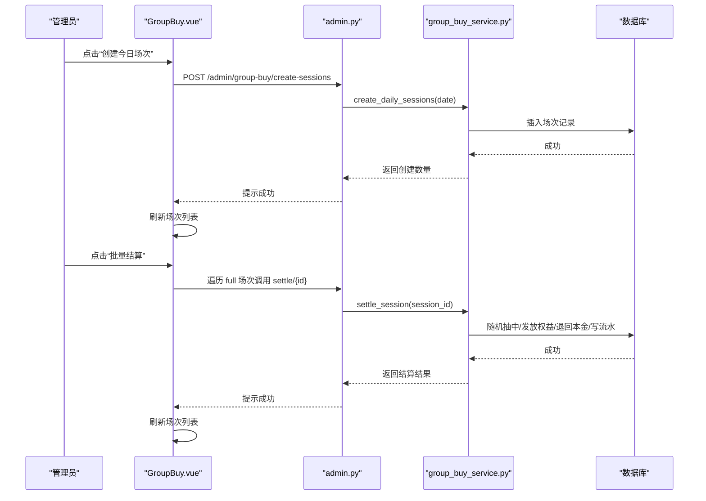
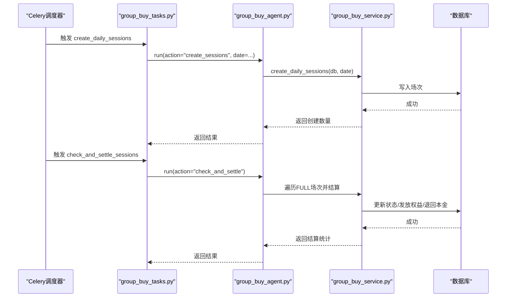
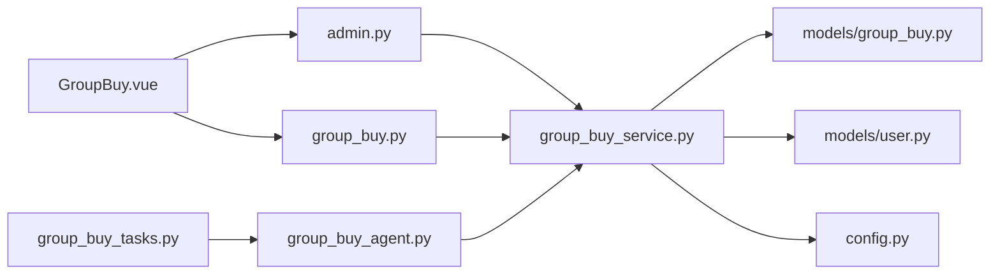

# 拼团业务管理

<cite>
**本文引用的文件列表**
- [backend/app/api/v1/group_buy.py](file://backend/app/api/v1/group_buy.py)
- [backend/app/api/v1/admin.py](file://backend/app/api/v1/admin.py)
- [backend/app/services/group_buy_service.py](file://backend/app/services/group_buy_service.py)
- [backend/app/models/group_buy.py](file://backend/app/models/group_buy.py)
- [backend/app/models/user.py](file://backend/app/models/user.py)
- [backend/app/tasks/group_buy_tasks.py](file://backend/app/tasks/group_buy_tasks.py)
- [backend/app/agents/group_buy_agent.py](file://backend/app/agents/group_buy_agent.py)
- [backend/app/config.py](file://backend/app/config.py)
- [frontend/web-admin/src/views/GroupBuy.vue](file://frontend/web-admin/src/views/GroupBuy.vue)
- [frontend/web-admin/src/api/index.js](file://frontend/web-admin/src/api/index.js)
- [frontend/web-admin/src/api/groupBuy.js](file://frontend/web-admin/src/api/groupBuy.js)
</cite>

## 目录
1. [引言](#引言)
2. [项目结构](#项目结构)
3. [核心组件](#核心组件)
4. [架构总览](#架构总览)
5. [详细组件分析](#详细组件分析)
6. [依赖关系分析](#依赖关系分析)
7. [性能与扩展性](#性能与扩展性)
8. [故障排查指南](#故障排查指南)
9. [结论](#结论)
10. [附录：运营工具与报表建议](#附录：运营工具与报表建议)

## 引言
本文件面向AIxingmu Web管理后台的“拼团业务管理”模块，聚焦以下目标：
- 拼团场次管理界面：创建、筛选、查看详情、手动结算、批量结算
- 拼团活动监控：状态流转、满员判定、过期处理、Agent调度
- 拼团结果处理：随机抽中、权益发放、失败补贴、退款逻辑
- 数据展示与分析：场次列表、参团用户、成功率、收益与补贴支出
- 规则配置与上下架：级别定价、人数与时间窗口、开团控制
- 营销效果评估与运营工具集成：风控日志、Agent运行状态、分润与贡献值结算入口

## 项目结构
后端采用FastAPI + SQLAlchemy异步模型，服务层封装核心业务，Celery任务驱动定时调度，Agent统一编排动作；前端Web管理端基于Vue+Element Plus提供操作面板。

图表来源
- [frontend/web-admin/src/views/GroupBuy.vue:1-218](file://frontend/web-admin/src/views/GroupBuy.vue#L1-L218)
- [frontend/web-admin/src/api/index.js:1-85](file://frontend/web-admin/src/api/index.js#L1-L85)
- [frontend/web-admin/src/api/groupBuy.js:1-2](file://frontend/web-admin/src/api/groupBuy.js#L1-L2)
- [backend/app/api/v1/group_buy.py:1-65](file://backend/app/api/v1/group_buy.py#L1-L65)
- [backend/app/api/v1/admin.py:1-86](file://backend/app/api/v1/admin.py#L1-L86)
- [backend/app/services/group_buy_service.py:1-348](file://backend/app/services/group_buy_service.py#L1-L348)
- [backend/app/models/group_buy.py:1-158](file://backend/app/models/group_buy.py#L1-L158)
- [backend/app/models/user.py:1-93](file://backend/app/models/user.py#L1-L93)
- [backend/app/tasks/group_buy_tasks.py:1-54](file://backend/app/tasks/group_buy_tasks.py#L1-L54)
- [backend/app/agents/group_buy_agent.py:1-67](file://backend/app/agents/group_buy_agent.py#L1-L67)
- [backend/app/config.py:1-145](file://backend/app/config.py#L1-L145)

章节来源
- [frontend/web-admin/src/views/GroupBuy.vue:1-218](file://frontend/web-admin/src/views/GroupBuy.vue#L1-L218)
- [backend/app/api/v1/group_buy.py:1-65](file://backend/app/api/v1/group_buy.py#L1-L65)
- [backend/app/api/v1/admin.py:1-86](file://backend/app/api/v1/admin.py#L1-L86)
- [backend/app/services/group_buy_service.py:1-348](file://backend/app/services/group_buy_service.py#L1-L348)
- [backend/app/models/group_buy.py:1-158](file://backend/app/models/group_buy.py#L1-L158)
- [backend/app/models/user.py:1-93](file://backend/app/models/user.py#L1-L93)
- [backend/app/tasks/group_buy_tasks.py:1-54](file://backend/app/tasks/group_buy_tasks.py#L1-L54)
- [backend/app/agents/group_buy_agent.py:1-67](file://backend/app/agents/group_buy_agent.py#L1-L67)
- [backend/app/config.py:1-145](file://backend/app/config.py#L1-L145)

## 核心组件
- 场次与订单模型：定义拼团级别、场次状态、订单状态及字段约束，支撑查询与统计。
- 服务层：实现每日场次创建、自定义开团、参团校验与锁定、满员结算（随机抽中、权益发放、失败补贴）、活跃场次查询、用户订单分页。
- API层：对外暴露用户侧与管理侧接口，包括获取可参与场次、参团、我的订单、管理端创建场次与手动结算等。
- 任务与Agent：Celery定时任务触发Agent执行“创建场次、检查并结算、检查过期”，Agent调用服务层完成具体业务。
- 配置中心：集中管理拼团价格、倍数、人数、时间段、权益比例、补贴比例等关键参数。
- 前端管理页：提供创建今日场次、批量结算、日期与级别筛选、场次详情弹窗、参团记录查看等操作。

章节来源
- [backend/app/models/group_buy.py:1-158](file://backend/app/models/group_buy.py#L1-L158)
- [backend/app/services/group_buy_service.py:1-348](file://backend/app/services/group_buy_service.py#L1-L348)
- [backend/app/api/v1/group_buy.py:1-65](file://backend/app/api/v1/group_buy.py#L1-L65)
- [backend/app/api/v1/admin.py:1-86](file://backend/app/api/v1/admin.py#L1-L86)
- [backend/app/tasks/group_buy_tasks.py:1-54](file://backend/app/tasks/group_buy_tasks.py#L1-L54)
- [backend/app/agents/group_buy_agent.py:1-67](file://backend/app/agents/group_buy_agent.py#L1-L67)
- [backend/app/config.py:1-145](file://backend/app/config.py#L1-L145)
- [frontend/web-admin/src/views/GroupBuy.vue:1-218](file://frontend/web-admin/src/views/GroupBuy.vue#L1-L218)

## 架构总览
系统通过“前端管理页 → 管理API → 服务层 → 数据库”的主路径完成日常运营操作；同时通过“Celery任务 → Agent → 服务层”的自动化路径完成定时开团、满员结算与过期清理。

图表来源
- [frontend/web-admin/src/views/GroupBuy.vue:1-218](file://frontend/web-admin/src/views/GroupBuy.vue#L1-L218)
- [backend/app/api/v1/admin.py:1-86](file://backend/app/api/v1/admin.py#L1-L86)
- [backend/app/api/v1/group_buy.py:1-65](file://backend/app/api/v1/group_buy.py#L1-L65)
- [backend/app/services/group_buy_service.py:1-348](file://backend/app/services/group_buy_service.py#L1-L348)
- [backend/app/tasks/group_buy_tasks.py:1-54](file://backend/app/tasks/group_buy_tasks.py#L1-L54)
- [backend/app/agents/group_buy_agent.py:1-67](file://backend/app/agents/group_buy_agent.py#L1-L67)

## 详细组件分析

### 数据模型与状态机
- 拼团级别：初级团、高级团、SVIP团，分别对应不同箱数倍数与参团金额。
- 场次状态：待开始→进行中→已满员→已完成/已取消/已过期。
- 订单状态：待确认→已锁定→拼中/拼失败→已退款/已取消。
- 每日统计表：按日期汇总各级别场次数量、交易金额、中奖与失败人次、补贴支出等。

图表来源
- [backend/app/models/group_buy.py:1-158](file://backend/app/models/group_buy.py#L1-L158)
- [backend/app/models/user.py:74-93](file://backend/app/models/user.py#L74-L93)

章节来源
- [backend/app/models/group_buy.py:1-158](file://backend/app/models/group_buy.py#L1-L158)
- [backend/app/models/user.py:1-93](file://backend/app/models/user.py#L1-L93)

### 服务层核心流程
- 创建每日场次：按配置的时间段与级别生成场次，设置初始状态为待开始。
- 参团流程：校验场次状态与人数上限、单ID单组次数限制、用户余额，扣除本金并锁定，创建订单，更新场次人数与状态。
- 结算流程：当场次满员后，随机抽取1人拼中，其余30人失败；对拼中者发放商品权益、贡献值、积分；对失败者退回本金并发放广告补贴与推荐人补贴；更新场次与订单状态。
- 查询能力：获取活跃场次（支持级别过滤）、用户订单分页。

图表来源
- [backend/app/services/group_buy_service.py:93-181](file://backend/app/services/group_buy_service.py#L93-L181)

章节来源
- [backend/app/services/group_buy_service.py:27-90](file://backend/app/services/group_buy_service.py#L27-L90)
- [backend/app/services/group_buy_service.py:93-181](file://backend/app/services/group_buy_service.py#L93-L181)
- [backend/app/services/group_buy_service.py:184-321](file://backend/app/services/group_buy_service.py#L184-L321)
- [backend/app/services/group_buy_service.py:324-348](file://backend/app/services/group_buy_service.py#L324-L348)

### 管理端API与前端交互
- 管理端创建场次：POST /admin/group-buy/create-sessions，支持指定日期或默认当天。
- 管理端手动结算：POST /admin/group-buy/settle/{session_id}，用于异常干预或补算。
- 前端页面：提供“创建今日场次”、“批量结算”、“日期范围筛选”、“级别筛选”、“场次详情弹窗”、“参团记录查看”。

图表来源
- [backend/app/api/v1/admin.py:18-42](file://backend/app/api/v1/admin.py#L18-L42)
- [frontend/web-admin/src/views/GroupBuy.vue:165-199](file://frontend/web-admin/src/views/GroupBuy.vue#L165-L199)
- [frontend/web-admin/src/api/index.js:56-58](file://frontend/web-admin/src/api/index.js#L56-L58)

章节来源
- [backend/app/api/v1/admin.py:18-42](file://backend/app/api/v1/admin.py#L18-L42)
- [frontend/web-admin/src/views/GroupBuy.vue:1-218](file://frontend/web-admin/src/views/GroupBuy.vue#L1-L218)
- [frontend/web-admin/src/api/index.js:56-58](file://frontend/web-admin/src/api/index.js#L56-L58)

### 定时任务与Agent调度
- Celery任务：
  - 每日9:50创建当日场次
  - 每小时检查并结算已满场次
  - 每日23:00检查过期场次
- Agent：统一接收上下文与动作，调用服务层完成具体业务，并记录日志。

图表来源
- [backend/app/tasks/group_buy_tasks.py:17-53](file://backend/app/tasks/group_buy_tasks.py#L17-L53)
- [backend/app/agents/group_buy_agent.py:21-63](file://backend/app/agents/group_buy_agent.py#L21-L63)
- [backend/app/services/group_buy_service.py:27-90](file://backend/app/services/group_buy_service.py#L27-L90)
- [backend/app/services/group_buy_service.py:184-321](file://backend/app/services/group_buy_service.py#L184-L321)

章节来源
- [backend/app/tasks/group_buy_tasks.py:1-54](file://backend/app/tasks/group_buy_tasks.py#L1-L54)
- [backend/app/agents/group_buy_agent.py:1-67](file://backend/app/agents/group_buy_agent.py#L1-L67)

### 规则配置与参数化
- 价格与倍数：单箱定价、三大板块倍数与对应参团金额。
- 人数与时间：每场31人、10:00-22:00每小时一场、单ID单组最多5单。
- 权益与补贴：拼中商品权益10%、贡献值20%、积分20%；失败广告补贴0.7%、推荐人补贴0.1%。
- 平台收支分配：代理、门店、推荐门店、拼中权益、失败补贴、平台利润等比例合计100%。

章节来源
- [backend/app/config.py:42-100](file://backend/app/config.py#L42-L100)

## 依赖关系分析
- 前端依赖：
  - GroupBuy.vue 依赖 api/index.js 提供的管理端接口（创建场次、结算、获取场次）。
  - groupBuy.js 复用 index.js 中的用户侧接口（获取活跃场次、参团、我的订单）。
- 后端依赖：
  - API层依赖服务层与数据库会话。
  - 服务层依赖模型层与配置中心。
  - 任务层依赖Agent与服务层。
  - Agent依赖服务层与模型层。

图表来源
- [frontend/web-admin/src/views/GroupBuy.vue:1-218](file://frontend/web-admin/src/views/GroupBuy.vue#L1-L218)
- [frontend/web-admin/src/api/index.js:1-85](file://frontend/web-admin/src/api/index.js#L1-L85)
- [frontend/web-admin/src/api/groupBuy.js:1-2](file://frontend/web-admin/src/api/groupBuy.js#L1-L2)
- [backend/app/api/v1/admin.py:1-86](file://backend/app/api/v1/admin.py#L1-L86)
- [backend/app/api/v1/group_buy.py:1-65](file://backend/app/api/v1/group_buy.py#L1-L65)
- [backend/app/services/group_buy_service.py:1-348](file://backend/app/services/group_buy_service.py#L1-L348)
- [backend/app/models/group_buy.py:1-158](file://backend/app/models/group_buy.py#L1-L158)
- [backend/app/models/user.py:1-93](file://backend/app/models/user.py#L1-L93)
- [backend/app/tasks/group_buy_tasks.py:1-54](file://backend/app/tasks/group_buy_tasks.py#L1-L54)
- [backend/app/agents/group_buy_agent.py:1-67](file://backend/app/agents/group_buy_agent.py#L1-L67)
- [backend/app/config.py:1-145](file://backend/app/config.py#L1-L145)

章节来源
- [frontend/web-admin/src/views/GroupBuy.vue:1-218](file://frontend/web-admin/src/views/GroupBuy.vue#L1-L218)
- [frontend/web-admin/src/api/index.js:1-85](file://frontend/web-admin/src/api/index.js#L1-L85)
- [frontend/web-admin/src/api/groupBuy.js:1-2](file://frontend/web-admin/src/api/groupBuy.js#L1-L2)
- [backend/app/api/v1/admin.py:1-86](file://backend/app/api/v1/admin.py#L1-L86)
- [backend/app/api/v1/group_buy.py:1-65](file://backend/app/api/v1/group_buy.py#L1-L65)
- [backend/app/services/group_buy_service.py:1-348](file://backend/app/services/group_buy_service.py#L1-L348)
- [backend/app/models/group_buy.py:1-158](file://backend/app/models/group_buy.py#L1-L158)
- [backend/app/models/user.py:1-93](file://backend/app/models/user.py#L1-L93)
- [backend/app/tasks/group_buy_tasks.py:1-54](file://backend/app/tasks/group_buy_tasks.py#L1-L54)
- [backend/app/agents/group_buy_agent.py:1-67](file://backend/app/agents/group_buy_agent.py#L1-L67)
- [backend/app/config.py:1-145](file://backend/app/config.py#L1-L145)

## 性能与扩展性
- 并发与锁：参团时进行人数与余额校验，建议在高频场景引入分布式锁或乐观锁避免超卖。
- 批量结算：当前为逐条结算，可在高并发下考虑分批提交与事务边界优化。
- 索引优化：已有针对级别/状态、时间、用户/场次组合的索引，有助于查询与统计。
- 可扩展点：
  - 增加“自定义开团”接口供线下门店发起，已在服务层预留。
  - 增加“异常场次处理”与“强制退款”接口，便于运营干预。
  - 增加“数据统计报表”接口，聚合每日统计表与订单明细。

[本节为通用指导，不直接分析具体文件]

## 故障排查指南
- 参团失败常见原因：
  - 场次不存在或已截止参与
  - 场次已满员
  - 单ID单组次数超限
  - 用户余额不足
- 结算失败常见原因：
  - 场次状态非“已满员”
  - 订单数量与期望人数不匹配
- 排查步骤：
  - 检查场次状态与时间窗口
  - 核对用户钱包流水记录（锁定/解锁、补贴发放）
  - 查看Agent日志与任务执行记录
  - 使用管理端“手动结算”进行补算

章节来源
- [backend/app/services/group_buy_service.py:93-181](file://backend/app/services/group_buy_service.py#L93-L181)
- [backend/app/services/group_buy_service.py:184-321](file://backend/app/services/group_buy_service.py#L184-L321)
- [backend/app/agents/group_buy_agent.py:41-46](file://backend/app/agents/group_buy_agent.py#L41-L46)

## 结论
本模块以清晰的模型与服务分层实现了拼团业务的完整闭环：从场次创建、参团锁定、满员结算到权益发放与失败补贴，配合定时任务与Agent保障自动化运行。管理端提供了必要的开团控制、手动干预与数据查看能力。后续可在异常处理、退款操作、数据统计报表方面进一步增强，以满足更复杂的运营需求。

[本节为总结性内容，不直接分析具体文件]

## 附录：运营工具与报表建议
- 拼团列表展示：
  - 支持按日期范围与级别筛选，显示场次编号、级别、金额、参团人数、状态、拼中者。
- 场次状态管理：
  - 提供“创建今日场次”、“批量结算”、“手动结算”按钮，结合状态标签直观展示。
- 参团用户查看：
  - 在“场次详情”弹窗中展示参团记录（用户ID、订单号、状态、参团时间）。
- 拼团数据分析：
  - 建议新增“每日统计”接口，聚合场次数、交易金额、中奖与失败人次、补贴支出，并在Dashboard展示。
- 开团控制与手动干预：
  - 支持自定义开团（门店级），并提供“异常场次处理”与“强制退款”接口。
- 退款操作：
  - 失败用户本金自动退回；必要时提供“手动退款”接口，记录流水说明。
- 成功率分析与收益报表：
  - 建议计算各时段/级别的成功率与收益分布，输出可视化报表。
- 用户参与热力图：
  - 基于参团时间与用户维度聚合，展示高峰时段与热门级别。
- 规则配置与活动上下架：
  - 通过配置中心调整价格、倍数、人数、时间段；提供“活动上下架”开关。
- 营销效果评估与运营工具集成：
  - 结合风控日志、Agent运行状态、分润与贡献值结算入口，形成一体化运营看板。

[本节为概念性建议，不直接分析具体文件]