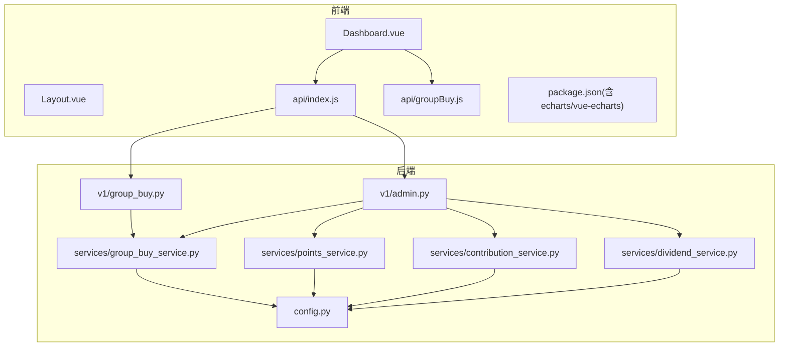
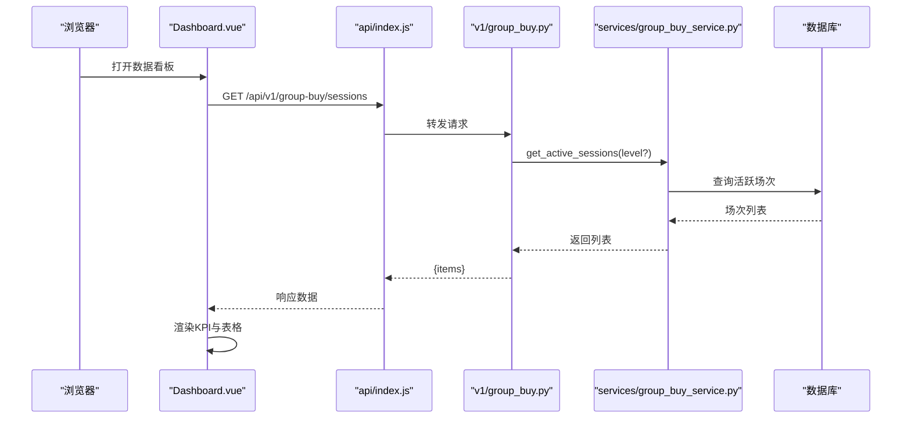
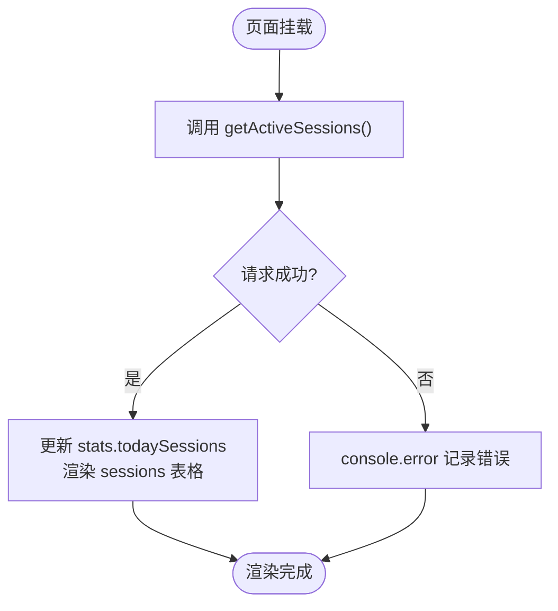
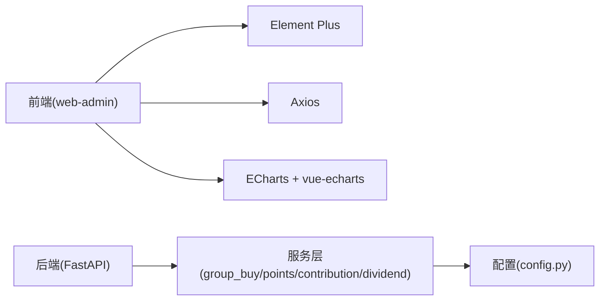

# 数据看板系统

<cite>
**本文引用的文件**   
- [Dashboard.vue](file://frontend/web-admin/src/views/Dashboard.vue)
- [Layout.vue](file://frontend/web-admin/src/views/Layout.vue)
- [index.js](file://frontend/web-admin/src/api/index.js)
- [groupBuy.js](file://frontend/web-admin/src/api/groupBuy.js)
- [package.json](file://frontend/web-admin/package.json)
- [admin.py](file://backend/app/api/v1/admin.py)
- [group_buy.py](file://backend/app/api/v1/group_buy.py)
- [group_buy_service.py](file://backend/app/services/group_buy_service.py)
- [points_service.py](file://backend/app/services/points_service.py)
- [contribution_service.py](file://backend/app/services/contribution_service.py)
- [dividend_service.py](file://backend/app/services/dividend_service.py)
- [config.py](file://backend/app/config.py)
</cite>

## 目录
1. [简介](#简介)
2. [项目结构](#项目结构)
3. [核心组件](#核心组件)
4. [架构总览](#架构总览)
5. [详细组件分析](#详细组件分析)
6. [依赖分析](#依赖分析)
7. [性能考虑](#性能考虑)
8. [故障排查指南](#故障排查指南)
9. [结论](#结论)
10. [附录](#附录)

## 简介
本文件为 AIxingmu Web 管理后台“数据看板”系统的技术文档，聚焦 Dashboard 页面的数据可视化实现、图表组件集成与实时数据更新机制。当前仓库中 Dashboard 已具备 KPI 卡片、场次状态表格与 Agent 运行状态展示；同时前端已引入 ECharts 与 vue-echarts 依赖，为后续扩展多类型图表（趋势、对比、分布等）提供基础。后端提供了拼团、积分池、贡献值与分红结算等关键业务接口与服务，支撑看板指标的计算与刷新。

## 项目结构
- 前端（web-admin）
  - 视图：Dashboard.vue、GroupBuy.vue、Settlement.vue、Layout.vue 等
  - API 封装：api/index.js、api/groupBuy.js
  - 依赖：vue、element-plus、axios、echarts、vue-echarts
- 后端（FastAPI）
  - 路由：v1/admin.py、v1/group_buy.py
  - 服务：group_buy_service.py、points_service.py、contribution_service.py、dividend_service.py
  - 配置：config.py

图示来源
- [Dashboard.vue:1-109](file://frontend/web-admin/src/views/Dashboard.vue#L1-L109)
- [Layout.vue:1-85](file://frontend/web-admin/src/views/Layout.vue#L1-L85)
- [index.js:1-85](file://frontend/web-admin/src/api/index.js#L1-L85)
- [groupBuy.js:1-2](file://frontend/web-admin/src/api/groupBuy.js#L1-L2)
- [package.json:1-28](file://frontend/web-admin/package.json#L1-L28)
- [group_buy.py:1-65](file://backend/app/api/v1/group_buy.py#L1-L65)
- [admin.py:1-86](file://backend/app/api/v1/admin.py#L1-L86)
- [group_buy_service.py:1-348](file://backend/app/services/group_buy_service.py#L1-L348)
- [points_service.py:1-180](file://backend/app/services/points_service.py#L1-L180)
- [contribution_service.py:1-261](file://backend/app/services/contribution_service.py#L1-L261)
- [dividend_service.py:1-136](file://backend/app/services/dividend_service.py#L1-L136)
- [config.py:1-145](file://backend/app/config.py#L1-L145)

章节来源
- [Dashboard.vue:1-109](file://frontend/web-admin/src/views/Dashboard.vue#L1-L109)
- [Layout.vue:1-85](file://frontend/web-admin/src/views/Layout.vue#L1-L85)
- [index.js:1-85](file://frontend/web-admin/src/api/index.js#L1-L85)
- [groupBuy.js:1-2](file://frontend/web-admin/src/api/groupBuy.js#L1-L2)
- [package.json:1-28](file://frontend/web-admin/package.json#L1-L28)
- [group_buy.py:1-65](file://backend/app/api/v1/group_buy.py#L1-L65)
- [admin.py:1-86](file://backend/app/api/v1/admin.py#L1-L86)
- [group_buy_service.py:1-348](file://backend/app/services/group_buy_service.py#L1-L348)
- [points_service.py:1-180](file://backend/app/services/points_service.py#L1-L180)
- [contribution_service.py:1-261](file://backend/app/services/contribution_service.py#L1-L261)
- [dividend_service.py:1-136](file://backend/app/services/dividend_service.py#L1-L136)
- [config.py:1-145](file://backend/app/config.py#L1-L145)

## 核心组件
- 数据看板页面（Dashboard.vue）
  - KPI 卡片：今日拼团场次、今日交易金额、全网总贡献值、积分池剩余
  - 实时状态：拼团场次列表（编号、级别、人数、状态）
  - Agent 运行状态：以描述列表展示各 Agent 状态
  - 数据来源：通过 getActiveSessions 获取活跃场次并统计场次数量
- 布局与导航（Layout.vue）
  - 侧边栏菜单包含“数据看板”入口，路由指向 /dashboard
- API 封装（index.js、groupBuy.js）
  - axios 实例统一 baseURL、超时与请求拦截器（自动附加 Token）
  - 导出 group-buy、用户、贡献值、积分、门店、风控、Agent 等接口
- 后端接口与服务
  - 拼团接口：获取活跃场次、参与、订单分页、场次详情
  - 管理接口：创建每日场次、手动结算、周度分红、贡献值递减兑换、门店月度分红、积分池状态
  - 服务层：拼团流程、积分增值、贡献值核算、分红结算
  - 配置：全局参数（拼团规则、贡献值比例、积分发行量与通缩、日利率等）

章节来源
- [Dashboard.vue:1-109](file://frontend/web-admin/src/views/Dashboard.vue#L1-L109)
- [Layout.vue:1-85](file://frontend/web-admin/src/views/Layout.vue#L1-L85)
- [index.js:1-85](file://frontend/web-admin/src/api/index.js#L1-L85)
- [groupBuy.js:1-2](file://frontend/web-admin/src/api/groupBuy.js#L1-L2)
- [group_buy.py:1-65](file://backend/app/api/v1/group_buy.py#L1-L65)
- [admin.py:1-86](file://backend/app/api/v1/admin.py#L1-L86)
- [group_buy_service.py:1-348](file://backend/app/services/group_buy_service.py#L1-L348)
- [points_service.py:1-180](file://backend/app/services/points_service.py#L1-L180)
- [contribution_service.py:1-261](file://backend/app/services/contribution_service.py#L1-L261)
- [dividend_service.py:1-136](file://backend/app/services/dividend_service.py#L1-L136)
- [config.py:1-145](file://backend/app/config.py#L1-L145)

## 架构总览
数据看板的数据流从前端 Dashboard 发起，经 API 封装调用后端 FastAPI 路由，路由再委托服务层完成业务计算与数据库读写，最终返回结构化数据供前端渲染。

图示来源
- [Dashboard.vue:81-101](file://frontend/web-admin/src/views/Dashboard.vue#L81-L101)
- [index.js:22](file://frontend/web-admin/src/api/index.js#L22)
- [group_buy.py:15-23](file://backend/app/api/v1/group_buy.py#L15-L23)
- [group_buy_service.py:324-333](file://backend/app/services/group_buy_service.py#L324-L333)

## 详细组件分析

### Dashboard 页面组件
- 功能要点
  - 使用 Element Plus 的 Row/Col/Card/Table/Descriptions 构建 KPI 卡片与状态面板
  - 通过 onMounted 生命周期拉取活跃场次，统计今日场次数
  - 错误处理：捕获异常并输出日志
- 可扩展点
  - 增加 ECharts 图表容器，接入 vue-echarts 渲染趋势图、对比图等
  - 增加定时轮询或 WebSocket 推送实现实时刷新
  - 增加主题切换与导出功能

图示来源
- [Dashboard.vue:81-101](file://frontend/web-admin/src/views/Dashboard.vue#L81-L101)

章节来源
- [Dashboard.vue:1-109](file://frontend/web-admin/src/views/Dashboard.vue#L1-L109)

### 图表组件集成方案（ECharts + vue-echarts）
- 依赖说明
  - package.json 已声明 echarts 与 vue-echarts 依赖，可直接在 Vue 组件中使用
- 集成步骤建议
  - 在 Dashboard 新增图表区域，引入 vue-echarts 组件
  - 定义 option 配置项（折线图、柱状图、饼图等），绑定到图表组件
  - 监听窗口 resize 事件，调用 chart.resize() 实现响应式适配
  - 将后端聚合数据映射为图表所需格式（时间序列、分类统计等）
- 主题定制
  - 基于 Element Plus 主题色与品牌色，统一图表配色
  - 支持明暗主题切换时动态更新图表主题
- 导出功能
  - 使用 ECharts 内置 downloadImage 方法导出 PNG/SVG
  - 结合按钮触发导出，命名规范包含日期与图表名称

[本节为概念性设计，不直接分析具体代码文件]

### 实时数据更新机制
- 现状
  - Dashboard 在 onMounted 时拉取一次数据
- 建议方案
  - 轮询：setInterval 定时刷新（如每 30s），注意防抖与错误重试
  - WebSocket：建立长连接，服务端推送场次状态变更
  - 增量更新：仅更新变化字段，减少重绘开销

[本节为概念性设计，不直接分析具体代码文件]

### 关键业务指标计算与数据来源
- 今日拼团场次
  - 数据来源：getActiveSessions 返回 items 长度
  - 计算逻辑：stats.todaySessions = sessions.length
- 今日交易金额
  - 建议来源：后端新增汇总接口（按日期聚合订单金额）
  - 前端格式化：货币千分位显示
- 全网总贡献值
  - 建议来源：后端 ContributionService.get_total_network_contrib
  - 前端展示：数值格式化
- 积分池剩余
  - 数据来源：后端 PointsService.get_pool_status 返回 remaining
  - 前端展示：数值格式化

章节来源
- [Dashboard.vue:85-101](file://frontend/web-admin/src/views/Dashboard.vue#L85-L101)
- [group_buy.py:15-23](file://backend/app/api/v1/group_buy.py#L15-L23)
- [contribution_service.py:253-261](file://backend/app/services/contribution_service.py#L253-L261)
- [points_service.py:169-179](file://backend/app/services/points_service.py#L169-L179)

### 数据接口封装与错误处理
- 统一 axios 实例
  - baseURL=/api/v1，超时 10s
  - 请求拦截器自动附加 Authorization: Bearer token
- 分组导出
  - index.js 集中导出所有接口，groupBuy.js 复用导出
- 错误处理
  - 前端 try/catch 捕获异常并提示
  - 后端 HTTPException 抛出 4xx/5xx 错误码与消息

章节来源
- [index.js:1-15](file://frontend/web-admin/src/api/index.js#L1-L15)
- [index.js:17-85](file://frontend/web-admin/src/api/index.js#L17-L85)
- [groupBuy.js:1-2](file://frontend/web-admin/src/api/groupBuy.js#L1-L2)
- [group_buy.py:26-37](file://backend/app/api/v1/group_buy.py#L26-L37)

### 加载状态管理与数据缓存策略
- 加载状态
  - 建议在请求前后设置 loading 标志，避免重复请求
- 缓存策略
  - 短期缓存：对热点数据（如站点配置、Agent 状态）做内存缓存
  - 失效策略：基于时间戳或版本号控制缓存失效
  - 离线降级：网络异常时回退到本地缓存数据

[本节为概念性设计，不直接分析具体代码文件]

### 趋势分析与对比统计展示
- 趋势分析
  - 近 7 天/30 天场次数量、交易金额、贡献值增长曲线
- 对比统计
  - 不同级别（初级/高级/SVIP）场次占比
  - 分润类型（拼团分润/门店分红/代理分润）金额对比
- 数据来源建议
  - 后端新增聚合接口（按时间维度与分类维度汇总）
  - 前端将结果映射为 ECharts 系列数据

[本节为概念性设计，不直接分析具体代码文件]

### 图表联动交互
- 筛选联动
  - 顶部筛选（日期范围、级别）联动图表与表格
- 下钻详情
  - 点击图表某类目，跳转至对应场次详情或订单列表
- 工具提示
  - 自定义 tooltip 展示更丰富的上下文信息

[本节为概念性设计，不直接分析具体代码文件]

## 依赖分析
- 前端依赖
  - vue、vue-router、pinia、element-plus、axios、@element-plus/icons-vue
  - echarts、vue-echarts（用于图表渲染）
- 后端依赖
  - FastAPI、SQLAlchemy Async、Pydantic Settings、Redis/Celery（可选）
- 模块耦合
  - Dashboard 依赖 api/index.js 与 groupBuy.js
  - 路由层依赖服务层，服务层依赖配置与模型

图示来源
- [package.json:11-20](file://frontend/web-admin/package.json#L11-L20)
- [group_buy_service.py:1-30](file://backend/app/services/group_buy_service.py#L1-L30)
- [points_service.py:1-20](file://backend/app/services/points_service.py#L1-L20)
- [contribution_service.py:1-20](file://backend/app/services/contribution_service.py#L1-L20)
- [dividend_service.py:1-20](file://backend/app/services/dividend_service.py#L1-L20)
- [config.py:1-20](file://backend/app/config.py#L1-L20)

章节来源
- [package.json:1-28](file://frontend/web-admin/package.json#L1-L28)
- [group_buy_service.py:1-348](file://backend/app/services/group_buy_service.py#L1-L348)
- [points_service.py:1-180](file://backend/app/services/points_service.py#L1-L180)
- [contribution_service.py:1-261](file://backend/app/services/contribution_service.py#L1-L261)
- [dividend_service.py:1-136](file://backend/app/services/dividend_service.py#L1-L136)
- [config.py:1-145](file://backend/app/config.py#L1-L145)

## 性能考虑
- 前端
  - 按需加载图表组件，避免首屏过大
  - 大数据集采用虚拟滚动或分页加载
  - 图表 resize 节流，减少频繁重绘
- 后端
  - 聚合查询加索引，避免全表扫描
  - 热点数据缓存（Redis）降低数据库压力
  - 批量写入与事务优化，减少锁竞争

[本节为通用指导，不直接分析具体代码文件]

## 故障排查指南
- 前端常见问题
  - 未登录导致 401：检查 localStorage 中的 token 是否正确注入
  - 跨域问题：确认后端 CORS 配置允许前端域名
  - 图表不渲染：检查容器尺寸与 resize 调用时机
- 后端常见问题
  - 400/404 错误：核对路由路径与参数
  - 数据库连接失败：检查 DATABASE_URL 与连接池配置
  - 业务校验失败：查看服务层抛出的 ValueError 与 HTTPException 消息

章节来源
- [index.js:8-15](file://frontend/web-admin/src/api/index.js#L8-L15)
- [group_buy.py:26-37](file://backend/app/api/v1/group_buy.py#L26-L37)
- [config.py:16-20](file://backend/app/config.py#L16-L20)

## 结论
当前 Dashboard 已具备基础的 KPI 与状态展示能力，且前端已引入 ECharts 生态，具备快速扩展多类型图表的条件。建议优先补齐后端聚合接口，完善趋势与对比统计的数据源，随后在前端集成图表组件，实现响应式与联动交互，并通过轮询或 WebSocket 提升实时性。同时完善错误处理、加载状态与缓存策略，保障用户体验与系统稳定性。

## 附录
- 相关接口清单（部分）
  - 获取活跃场次：GET /api/v1/group-buy/sessions
  - 获取积分池状态：GET /api/v1/admin/points/pool
  - 创建每日场次：POST /api/v1/admin/group-buy/create-sessions
  - 结算场次：POST /api/v1/admin/group-buy/settle/{session_id}
  - 周度分红：POST /api/v1/admin/dividend/weekly
  - 贡献值周度递减兑换：POST /api/v1/admin/contribution/weekly-settle
  - 门店月度分红：POST /api/v1/admin/store/monthly-dividend

章节来源
- [index.js:49-85](file://frontend/web-admin/src/api/index.js#L49-L85)
- [admin.py:18-86](file://backend/app/api/v1/admin.py#L18-L86)
- [group_buy.py:15-65](file://backend/app/api/v1/group_buy.py#L15-L65)