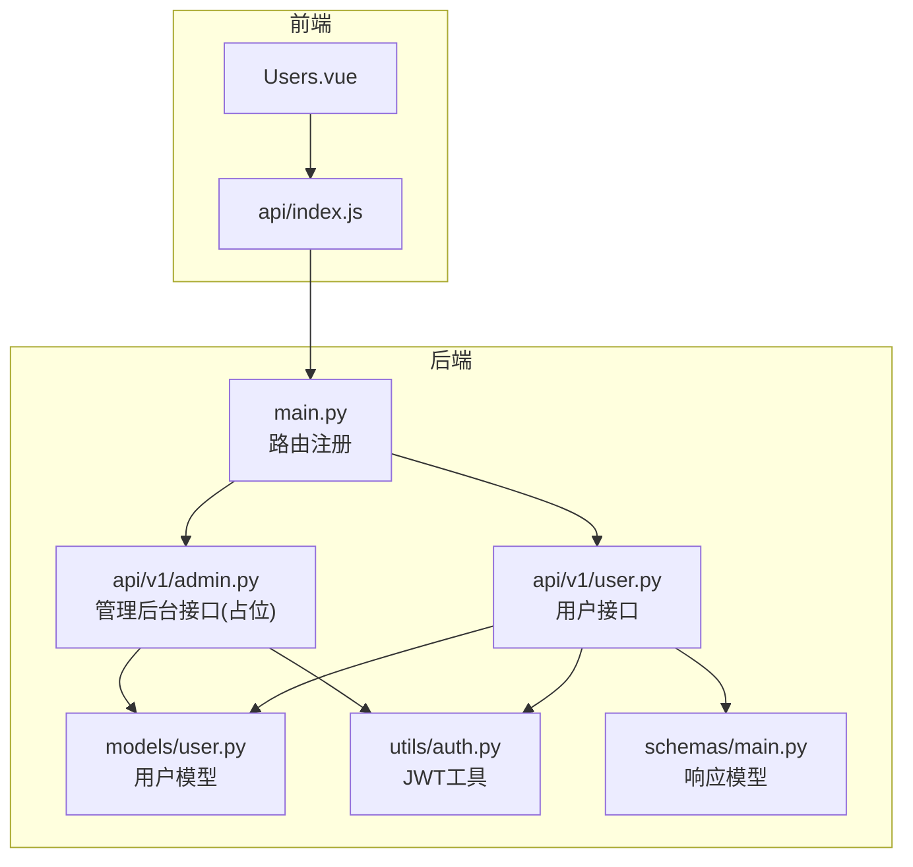
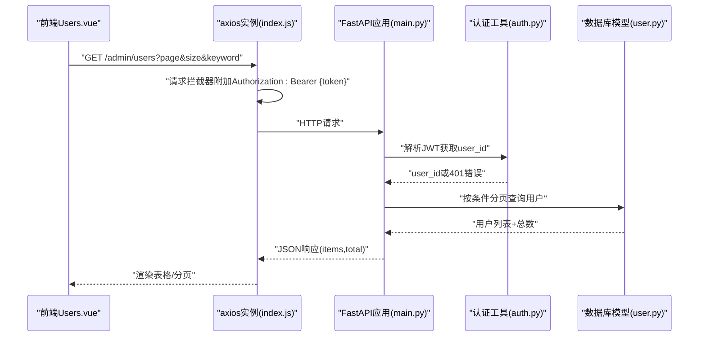
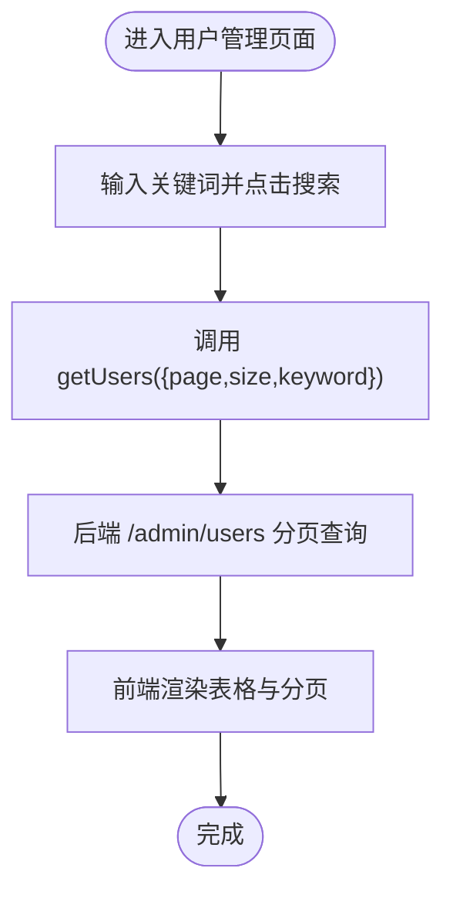
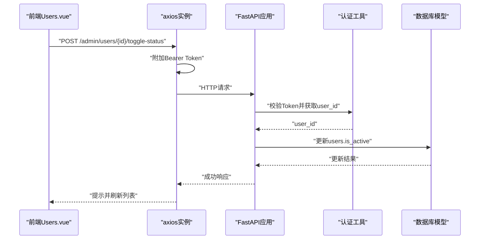
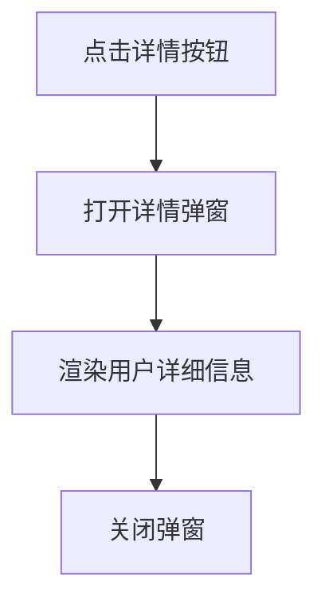
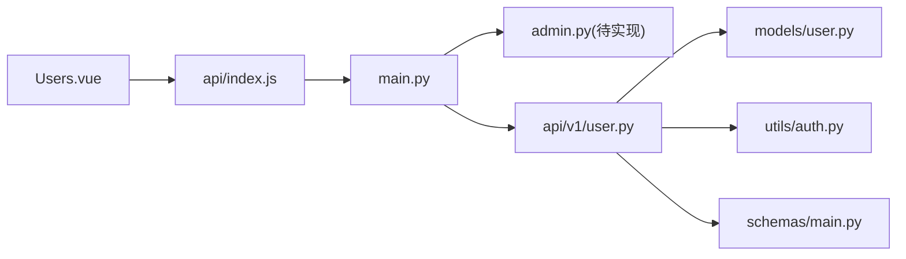

# 用户管理系统

<cite>
**本文引用的文件**   
- [backend/app/api/v1/user.py](file://backend/app/api/v1/user.py)
- [backend/app/models/user.py](file://backend/app/models/user.py)
- [backend/app/schemas/main.py](file://backend/app/schemas/main.py)
- [backend/app/utils/auth.py](file://backend/app/utils/auth.py)
- [backend/app/main.py](file://backend/app/main.py)
- [frontend/web-admin/src/views/Users.vue](file://frontend/web-admin/src/views/Users.vue)
- [frontend/web-admin/src/api/index.js](file://frontend/web-admin/src/api/index.js)
</cite>

## 目录
1. [简介](#简介)
2. [项目结构](#项目结构)
3. [核心组件](#核心组件)
4. [架构总览](#架构总览)
5. [详细组件分析](#详细组件分析)
6. [依赖关系分析](#依赖关系分析)
7. [性能考虑](#性能考虑)
8. [故障排查指南](#故障排查指南)
9. [结论](#结论)
10. [附录](#附录)

## 简介
本文件面向AIxingmu Web管理后台的用户管理系统，聚焦以下目标：
- 用户CRUD操作界面实现与交互流程
- 用户信息查询、筛选与分页查询
- 用户状态管理（启用/禁用）
- 用户列表表格组件、详情查看弹窗
- 角色分配与权限控制思路
- 密码重置与异常处理机制
- 搜索过滤、高级查询条件、数据导出与导入的扩展方案
- 表单验证规则与数据校验策略
- 操作日志记录建议

说明：当前仓库中已提供用户列表展示、状态切换的前端页面与部分后端模型/接口；完整的“创建/编辑/删除”、“批量操作”、“导出/导入”等能力在现有代码中未直接实现，文档将给出基于现有结构的扩展设计与落地建议。

## 项目结构
围绕用户管理的相关文件分布如下：
- 前端Web管理端
  - 视图层：用户管理页面 Users.vue
  - API封装：index.js 中的用户管理相关方法
- 后端服务
  - 路由注册：main.py 挂载 /api/v1/admin 等路由
  - 用户领域模型：models/user.py 定义用户表结构与枚举
  - 认证工具：utils/auth.py JWT生成与解析
  - 用户信息接口：api/v1/user.py 提供当前用户信息与钱包信息
  - 通用响应模型：schemas/main.py 包含 UserInfo/WalletInfo 等

图表来源
- [frontend/web-admin/src/views/Users.vue:1-144](file://frontend/web-admin/src/views/Users.vue#L1-L144)
- [frontend/web-admin/src/api/index.js:1-85](file://frontend/web-admin/src/api/index.js#L1-L85)
- [backend/app/main.py:1-78](file://backend/app/main.py#L1-L78)
- [backend/app/api/v1/user.py:1-37](file://backend/app/api/v1/user.py#L1-L37)
- [backend/app/models/user.py:1-93](file://backend/app/models/user.py#L1-L93)
- [backend/app/utils/auth.py:1-50](file://backend/app/utils/auth.py#L1-L50)
- [backend/app/schemas/main.py:1-176](file://backend/app/schemas/main.py#L1-L176)

章节来源
- [frontend/web-admin/src/views/Users.vue:1-144](file://frontend/web-admin/src/views/Users.vue#L1-L144)
- [frontend/web-admin/src/api/index.js:1-85](file://frontend/web-admin/src/api/index.js#L1-L85)
- [backend/app/main.py:1-78](file://backend/app/main.py#L1-L78)
- [backend/app/api/v1/user.py:1-37](file://backend/app/api/v1/user.py#L1-L37)
- [backend/app/models/user.py:1-93](file://backend/app/models/user.py#L1-L93)
- [backend/app/utils/auth.py:1-50](file://backend/app/utils/auth.py#L1-L50)
- [backend/app/schemas/main.py:1-176](file://backend/app/schemas/main.py#L1-L176)

## 核心组件
- 用户模型与字段
  - 用户表包含手机号、昵称、头像、角色、活跃状态、推荐人、四大资产余额、代理级别、门店关联、区域信息、时间戳等
  - 定义了用户角色枚举（消费者、推荐人、门店、各级代理、管理员）
- 用户信息响应模型
  - UserInfo/WalletInfo 用于返回用户基本信息与钱包资产
- 认证与鉴权
  - 通过JWT Bearer Token进行身份校验，从Token中提取user_id
- 用户管理前端
  - 用户列表页支持关键词搜索、分页、状态切换、详情弹窗
  - 调用 /admin/users 与 /admin/users/{id}/toggle-status 两个管理接口

章节来源
- [backend/app/models/user.py:14-71](file://backend/app/models/user.py#L14-L71)
- [backend/app/schemas/main.py:26-46](file://backend/app/schemas/main.py#L26-L46)
- [backend/app/utils/auth.py:39-50](file://backend/app/utils/auth.py#L39-L50)
- [frontend/web-admin/src/views/Users.vue:1-144](file://frontend/web-admin/src/views/Users.vue#L1-L144)
- [frontend/web-admin/src/api/index.js:60-62](file://frontend/web-admin/src/api/index.js#L60-L62)

## 架构总览
下图展示了从前端到后端的用户管理关键路径：前端发起请求，经Axios拦截器附加Token，进入FastAPI路由，由中间件完成全局异常与CORS处理，最终访问数据库模型并返回统一响应。

图表来源
- [frontend/web-admin/src/views/Users.vue:107-115](file://frontend/web-admin/src/views/Users.vue#L107-L115)
- [frontend/web-admin/src/api/index.js:1-15](file://frontend/web-admin/src/api/index.js#L1-L15)
- [backend/app/main.py:45-72](file://backend/app/main.py#L45-L72)
- [backend/app/utils/auth.py:39-50](file://backend/app/utils/auth.py#L39-L50)
- [backend/app/models/user.py:26-71](file://backend/app/models/user.py#L26-L71)

## 详细组件分析

### 用户列表与分页查询
- 前端
  - 使用Element Plus表格展示用户ID、手机号、昵称、代理级别、余额、贡献值、积分、消费券、状态、注册时间
  - 顶部搜索框支持按手机号/昵称模糊搜索，触发 loadUsers
  - 分页控件绑定 page/pageSize，变更时重新加载
  - 状态列显示“正常/禁用”，操作列提供“详情”和“禁用/启用”按钮
- 后端
  - 前端调用 GET /admin/users?page&size&keyword
  - 当前仓库未提供该接口的具体实现，建议在 admin.py 中新增路由，结合SQLAlchemy异步会话执行分页查询与关键字过滤
  - 返回格式需与前端期望一致：{ items: [...], total: number }

图表来源
- [frontend/web-admin/src/views/Users.vue:107-115](file://frontend/web-admin/src/views/Users.vue#L107-L115)
- [frontend/web-admin/src/api/index.js:60-62](file://frontend/web-admin/src/api/index.js#L60-L62)

章节来源
- [frontend/web-admin/src/views/Users.vue:15-58](file://frontend/web-admin/src/views/Users.vue#L15-L58)
- [frontend/web-admin/src/views/Users.vue:107-115](file://frontend/web-admin/src/views/Users.vue#L107-L115)
- [frontend/web-admin/src/api/index.js:60-62](file://frontend/web-admin/src/api/index.js#L60-L62)

### 用户状态管理（启用/禁用）
- 前端
  - 点击“禁用/启用”按钮弹出确认框，确认后调用 toggleUserStatus(userId)
  - 成功后刷新列表并提示结果
- 后端
  - 前端调用 POST /admin/users/{userId}/toggle-status
  - 当前仓库未提供该接口的具体实现，建议在 admin.py 中新增路由，根据当前用户ID更新 users.is_active 字段，并返回成功消息

图表来源
- [frontend/web-admin/src/views/Users.vue:122-132](file://frontend/web-admin/src/views/Users.vue#L122-L132)
- [frontend/web-admin/src/api/index.js:62-62](file://frontend/web-admin/src/api/index.js#L62-L62)
- [backend/app/utils/auth.py:39-50](file://backend/app/utils/auth.py#L39-L50)
- [backend/app/models/user.py:36-36](file://backend/app/models/user.py#L36-L36)

章节来源
- [frontend/web-admin/src/views/Users.vue:47-54](file://frontend/web-admin/src/views/Users.vue#L47-L54)
- [frontend/web-admin/src/views/Users.vue:122-132](file://frontend/web-admin/src/views/Users.vue#L122-L132)
- [frontend/web-admin/src/api/index.js:62-62](file://frontend/web-admin/src/api/index.js#L62-L62)
- [backend/app/models/user.py:36-36](file://backend/app/models/user.py#L36-L36)

### 用户详情查看
- 前端
  - 点击“详情”打开对话框，以描述列表形式展示用户ID、手机号、昵称、代理级别、四大资产、推荐人、邀请码、注册时间、状态
- 后端
  - 当前详情页仅使用前端本地数据渲染，未调用独立详情接口；如需服务端详情，可新增 GET /admin/users/{id} 并在 admin.py 中实现

图表来源
- [frontend/web-admin/src/views/Users.vue:61-78](file://frontend/web-admin/src/views/Users.vue#L61-L78)
- [frontend/web-admin/src/views/Users.vue:117-120](file://frontend/web-admin/src/views/Users.vue#L117-L120)

章节来源
- [frontend/web-admin/src/views/Users.vue:61-78](file://frontend/web-admin/src/views/Users.vue#L61-L78)
- [frontend/web-admin/src/views/Users.vue:117-120](file://frontend/web-admin/src/views/Users.vue#L117-L120)

### 用户信息查询与筛选
- 前端
  - 搜索框绑定 searchKeyword，change事件触发 loadUsers，向后端传递 keyword 参数
- 后端
  - 建议在 admin.py 的 /admin/users 路由中实现 keyword 过滤（如匹配 phone/nickname），并结合分页参数 page/size 返回 items 与 total

章节来源
- [frontend/web-admin/src/views/Users.vue:7-11](file://frontend/web-admin/src/views/Users.vue#L7-L11)
- [frontend/web-admin/src/views/Users.vue:107-115](file://frontend/web-admin/src/views/Users.vue#L107-L115)
- [frontend/web-admin/src/api/index.js:60-62](file://frontend/web-admin/src/api/index.js#L60-L62)

### 用户角色分配与权限设置
- 角色模型
  - UserRole 枚举定义了消费者、推荐人、门店、各级代理、管理员等角色
- 权限控制
  - 当前认证工具仅提取 user_id，未做角色/权限校验
  - 建议在认证工具中增加角色校验逻辑，或在路由层对管理员接口进行角色白名单校验
- 角色分配
  - 可在 admin.py 新增 PUT /admin/users/{id}/role 接口，更新 users.role 字段，并限制仅管理员可操作

章节来源
- [backend/app/models/user.py:14-24](file://backend/app/models/user.py#L14-L24)
- [backend/app/utils/auth.py:39-50](file://backend/app/utils/auth.py#L39-L50)

### 密码重置
- 现状
  - 用户模型包含 password_hash 字段，但未见密码重置接口
- 建议实现
  - 新增 POST /admin/users/{id}/reset-password 接口，接收新密码明文，在服务端使用 utils/auth.py 的 hash_password 加密后写入 users.password_hash
  - 前端提供“重置密码”按钮与二次确认

章节来源
- [backend/app/models/user.py:32-32](file://backend/app/models/user.py#L32-L32)
- [backend/app/utils/auth.py:16-21](file://backend/app/utils/auth.py#L16-L21)

### 表单验证规则与数据校验
- 前端
  - 当前用户管理页面主要为列表展示与状态切换，无复杂表单；后续新增创建/编辑表单时可引入Element Plus表单验证规则（必填、长度、格式等）
- 后端
  - 建议使用Pydantic模型对入参进行校验（如手机号格式、密码强度、数值范围），并在异常时返回统一错误码与消息

章节来源
- [backend/app/schemas/main.py:10-24](file://backend/app/schemas/main.py#L10-L24)

### 操作日志记录与审计
- 现状
  - 存在用户钱包流水表 user_wallet_logs，但未看到用户管理操作日志表
- 建议实现
  - 新增用户操作日志表（如 user_admin_logs），记录操作人、被操作用户、动作类型（启用/禁用/改密/改角色）、IP、时间戳
  - 在状态切换、密码重置、角色调整等接口中插入日志记录

章节来源
- [backend/app/models/user.py:74-93](file://backend/app/models/user.py#L74-L93)

### 异常处理机制
- 全局异常中间件
  - main.py 注册了 GlobalExceptionMiddleware，可用于统一捕获异常并返回标准错误响应
- 认证失败
  - auth.py 在Token无效或缺失时抛出401错误
- 建议
  - 在管理接口中对业务异常进行明确分类（如用户不存在、权限不足），并通过中间件转换为统一响应格式

章节来源
- [backend/app/main.py:45-49](file://backend/app/main.py#L45-L49)
- [backend/app/utils/auth.py:42-49](file://backend/app/utils/auth.py#L42-L49)

### 数据导出与导入（扩展方案）
- 导出
  - 新增 GET /admin/users/export?format=csv|excel 接口，后端查询用户数据并生成文件流返回
  - 前端提供“导出”按钮，下载文件
- 导入
  - 新增 POST /admin/users/import 接口，接收CSV/Excel文件，解析并批量创建或更新用户
  - 前端提供“导入”按钮与模板下载

章节来源
- [frontend/web-admin/src/views/Users.vue:1-144](file://frontend/web-admin/src/views/Users.vue#L1-L144)
- [frontend/web-admin/src/api/index.js:1-85](file://frontend/web-admin/src/api/index.js#L1-L85)

### 批量操作（扩展方案）
- 批量启用/禁用
  - 新增 POST /admin/users/batch-toggle-status，接收用户ID数组，逐个更新 is_active
  - 前端表格行多选，勾选后批量操作
- 批量修改角色
  - 新增 POST /admin/users/batch-set-role，接收用户ID数组与目标角色

章节来源
- [frontend/web-admin/src/views/Users.vue:1-144](file://frontend/web-admin/src/views/Users.vue#L1-L144)
- [backend/app/models/user.py:35-36](file://backend/app/models/user.py#L35-L36)

## 依赖关系分析
- 前端依赖
  - Users.vue 依赖 api/index.js 导出的 getUsers/toggleUserStatus
  - axios实例在请求拦截器中自动附加Authorization头
- 后端依赖
  - main.py 注册各模块路由，包括 /api/v1/admin
  - 用户接口依赖 models/user.py 的数据模型与 utils/auth.py 的认证工具
  - schemas/main.py 提供UserInfo/WalletInfo等响应模型

图表来源
- [frontend/web-admin/src/views/Users.vue:82-86](file://frontend/web-admin/src/views/Users.vue#L82-L86)
- [frontend/web-admin/src/api/index.js:60-62](file://frontend/web-admin/src/api/index.js#L60-L62)
- [backend/app/main.py:59-72](file://backend/app/main.py#L59-L72)
- [backend/app/api/v1/user.py:1-37](file://backend/app/api/v1/user.py#L1-L37)
- [backend/app/models/user.py:26-71](file://backend/app/models/user.py#L26-L71)
- [backend/app/utils/auth.py:39-50](file://backend/app/utils/auth.py#L39-L50)
- [backend/app/schemas/main.py:26-46](file://backend/app/schemas/main.py#L26-L46)

章节来源
- [frontend/web-admin/src/views/Users.vue:82-86](file://frontend/web-admin/src/views/Users.vue#L82-L86)
- [frontend/web-admin/src/api/index.js:60-62](file://frontend/web-admin/src/api/index.js#L60-L62)
- [backend/app/main.py:59-72](file://backend/app/main.py#L59-L72)
- [backend/app/api/v1/user.py:1-37](file://backend/app/api/v1/user.py#L1-L37)
- [backend/app/models/user.py:26-71](file://backend/app/models/user.py#L26-L71)
- [backend/app/utils/auth.py:39-50](file://backend/app/utils/auth.py#L39-L50)
- [backend/app/schemas/main.py:26-46](file://backend/app/schemas/main.py#L26-L46)

## 性能考虑
- 分页查询
  - 前端默认 pageSize=20，避免一次性拉取过多数据
  - 后端应使用LIMIT/OFFSET或游标分页，确保大数据量下的查询性能
- 索引优化
  - 用户表已为 role/referrer_id/store_id 建立索引，可按需为 phone/nickname 添加索引以提升搜索性能
- 缓存策略
  - 对于高频只读的用户统计信息，可引入Redis缓存，降低数据库压力
- 并发与事务
  - 状态切换、密码重置等操作应在事务中执行，保证一致性

[本节为通用指导，不直接分析具体文件]

## 故障排查指南
- 认证失败
  - 检查浏览器是否携带有效的Token，确认登录成功且Token未过期
  - 若出现401错误，检查后端JWT解码逻辑与密钥配置
- 接口未实现
  - 前端调用的 /admin/users 与 /admin/users/{id}/toggle-status 需在 admin.py 中实现，否则返回404
- 数据不一致
  - 状态切换后列表未刷新，检查前端是否在成功后调用 loadUsers
- 全局异常
  - 利用GlobalExceptionMiddleware捕获异常，统一返回code/message/data结构，便于前端提示

章节来源
- [backend/app/utils/auth.py:42-49](file://backend/app/utils/auth.py#L42-L49)
- [backend/app/main.py:45-49](file://backend/app/main.py#L45-L49)
- [frontend/web-admin/src/views/Users.vue:122-132](file://frontend/web-admin/src/views/Users.vue#L122-L132)

## 结论
当前用户管理系统已具备基础的前端展示与状态切换交互，以及用户模型与认证工具支撑。为实现完整的管理能力，建议在后端 admin.py 中补齐用户列表分页查询、状态切换、角色分配、密码重置等接口，并完善权限校验、操作日志、异常处理与性能优化。前端可在此基础上扩展批量操作、导出导入与高级筛选功能，提升管理效率与用户体验。

[本节为总结性内容，不直接分析具体文件]

## 附录
- 关键接口清单（待实现）
  - GET /admin/users?page&size&keyword → 返回 {items:[], total:number}
  - POST /admin/users/{id}/toggle-status → 切换用户状态
  - PUT /admin/users/{id}/role → 修改用户角色（管理员权限）
  - POST /admin/users/{id}/reset-password → 重置用户密码
  - GET /admin/users/export?format=csv|excel → 导出用户数据
  - POST /admin/users/import → 导入用户数据
  - POST /admin/users/batch-toggle-status → 批量启用/禁用
  - POST /admin/users/batch-set-role → 批量设置角色

章节来源
- [frontend/web-admin/src/api/index.js:60-62](file://frontend/web-admin/src/api/index.js#L60-L62)
- [backend/app/models/user.py:14-71](file://backend/app/models/user.py#L14-L71)
- [backend/app/utils/auth.py:16-21](file://backend/app/utils/auth.py#L16-L21)