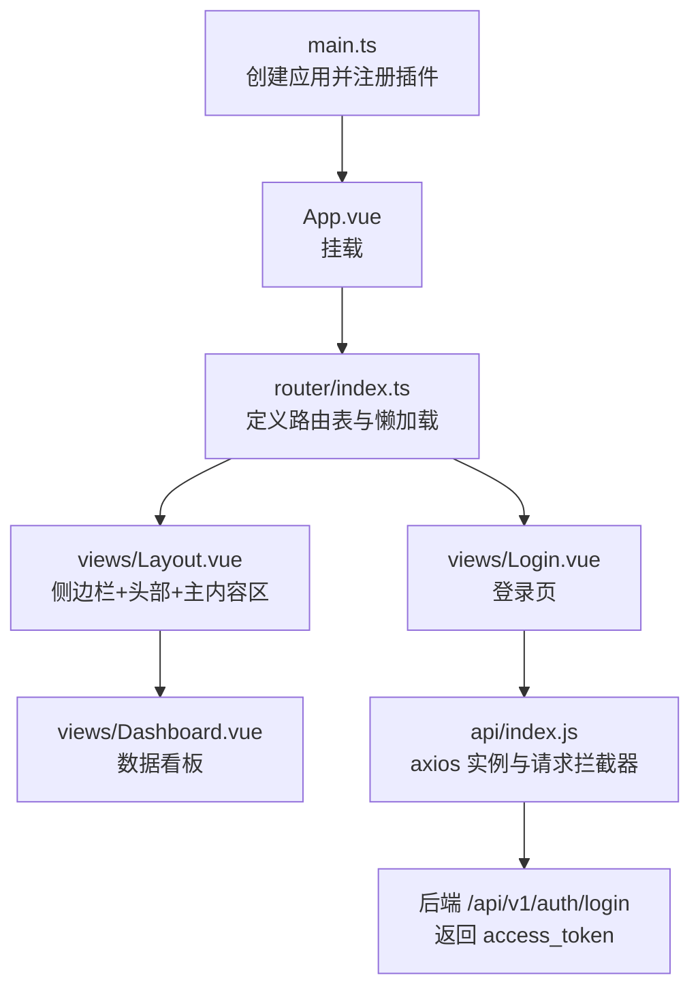
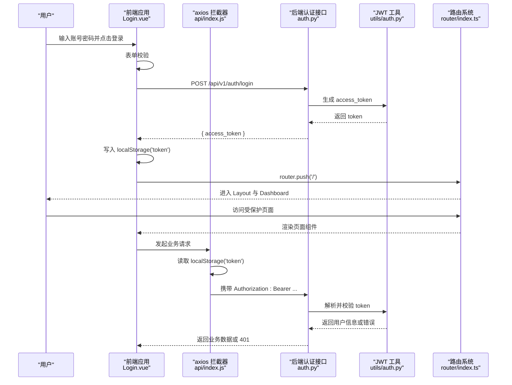
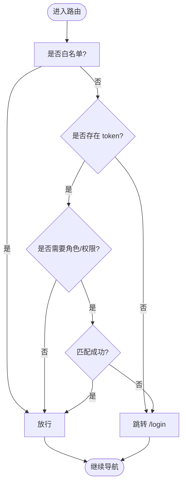
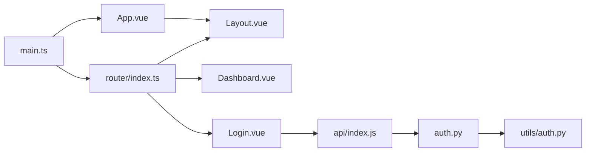

# 路由与权限控制

<cite>
**本文引用的文件列表**
- [前端入口 main.ts](file://frontend/web-admin/src/main.ts)
- [应用根组件 App.vue](file://frontend/web-admin/src/App.vue)
- [路由配置 index.ts](file://frontend/web-admin/src/router/index.ts)
- [布局组件 Layout.vue](file://frontend/web-admin/src/views/Layout.vue)
- [登录页面 Login.vue](file://frontend/web-admin/src/views/Login.vue)
- [数据看板 Dashboard.vue](file://frontend/web-admin/src/views/Dashboard.vue)
- [API 封装与请求拦截器 index.js](file://frontend/web-admin/src/api/index.js)
- [认证接口 auth.py](file://backend/app/api/v1/auth.py)
- [JWT 工具 utils/auth.py](file://backend/app/utils/auth.py)
</cite>

## 目录
1. [简介](#简介)
2. [项目结构](#项目结构)
3. [核心组件](#核心组件)
4. [架构总览](#架构总览)
5. [详细组件分析](#详细组件分析)
6. [依赖关系分析](#依赖关系分析)
7. [性能考虑](#性能考虑)
8. [故障排查指南](#故障排查指南)
9. [结论](#结论)
10. [附录](#附录)

## 简介
本文件围绕 AIxingmu Web 管理后台的路由与权限控制进行系统化说明，覆盖以下主题：
- Vue Router 配置、懒加载与重定向
- 登录流程与 JWT 令牌验证（前后端）
- 当前实现中的访问控制现状与改进建议（路由守卫、动态路由、菜单渲染、按钮级权限）
- Layout 布局组件设计、侧边栏导航与面包屑/标题管理的最佳实践
- 自动登出处理机制与权限缓存策略建议
- 权限配置示例、路由元信息定义与权限拦截器实现思路

## 项目结构
Web 管理后台采用 Vue 3 + Vue Router + Element Plus 的前端技术栈，后端使用 FastAPI。当前仓库中 web-admin 的路由为静态配置，未包含全局路由守卫；登录成功后将 token 写入本地存储，并在后续请求中通过 axios 拦截器自动附加 Authorization 头。

图表来源
- [前端入口 main.ts:1-13](file://frontend/web-admin/src/main.ts#L1-L13)
- [应用根组件 App.vue:1-4](file://frontend/web-admin/src/App.vue#L1-L4)
- [路由配置 index.ts:1-26](file://frontend/web-admin/src/router/index.ts#L1-L26)
- [布局组件 Layout.vue:1-85](file://frontend/web-admin/src/views/Layout.vue#L1-L85)
- [登录页面 Login.vue:1-72](file://frontend/web-admin/src/views/Login.vue#L1-L72)
- [API 封装与请求拦截器 index.js:1-85](file://frontend/web-admin/src/api/index.js#L1-L85)
- [认证接口 auth.py:1-43](file://backend/app/api/v1/auth.py#L1-L43)

章节来源
- [前端入口 main.ts:1-13](file://frontend/web-admin/src/main.ts#L1-L13)
- [应用根组件 App.vue:1-4](file://frontend/web-admin/src/App.vue#L1-L4)
- [路由配置 index.ts:1-26](file://frontend/web-admin/src/router/index.ts#L1-L26)
- [布局组件 Layout.vue:1-85](file://frontend/web-admin/src/views/Layout.vue#L1-L85)
- [登录页面 Login.vue:1-72](file://frontend/web-admin/src/views/Login.vue#L1-L72)
- [API 封装与请求拦截器 index.js:1-85](file://frontend/web-admin/src/api/index.js#L1-L85)
- [认证接口 auth.py:1-43](file://backend/app/api/v1/auth.py#L1-L43)

## 核心组件
- 路由配置：集中定义所有页面路由，采用函数式 import 实现懒加载，根路径重定向至仪表盘。
- 布局组件：提供侧边栏、顶部用户操作区与主内容区，侧边栏高亮跟随当前路由。
- 登录流程：表单校验后调用登录接口，成功时将 access_token 存入 localStorage，并跳转首页。
- API 拦截器：在请求前从 localStorage 读取 token 并注入 Authorization 头，保证受保护接口鉴权。
- 后端认证：登录接口校验凭据并签发 JWT，后续接口可通过 HTTPBearer 依赖解析当前用户。

章节来源
- [路由配置 index.ts:1-26](file://frontend/web-admin/src/router/index.ts#L1-L26)
- [布局组件 Layout.vue:1-85](file://frontend/web-admin/src/views/Layout.vue#L1-L85)
- [登录页面 Login.vue:1-72](file://frontend/web-admin/src/views/Login.vue#L1-L72)
- [API 封装与请求拦截器 index.js:1-85](file://frontend/web-admin/src/api/index.js#L1-L85)
- [认证接口 auth.py:1-43](file://backend/app/api/v1/auth.py#L1-L43)
- [JWT 工具 utils/auth.py:1-50](file://backend/app/utils/auth.py#L1-L50)

## 架构总览
下图展示从浏览器发起登录到受保护资源访问的完整链路，包括前端路由跳转、token 持久化、axios 拦截器注入以及后端 JWT 校验。

图表来源
- [登录页面 Login.vue:1-72](file://frontend/web-admin/src/views/Login.vue#L1-L72)
- [API 封装与请求拦截器 index.js:1-85](file://frontend/web-admin/src/api/index.js#L1-L85)
- [认证接口 auth.py:1-43](file://backend/app/api/v1/auth.py#L1-L43)
- [JWT 工具 utils/auth.py:1-50](file://backend/app/utils/auth.py#L1-L50)
- [路由配置 index.ts:1-26](file://frontend/web-admin/src/router/index.ts#L1-L26)

## 详细组件分析

### 路由配置与懒加载
- 路由表集中定义，包含登录页与带 Layout 的子路由集合。
- 子路由均使用函数式 import 实现按需加载，提升首屏性能。
- 根路径重定向至仪表盘，简化初始导航。

优化建议
- 为每个路由增加 meta.title，便于面包屑与页面标题统一管理。
- 引入全局前置守卫，统一判断登录态与角色权限，避免未授权访问。

章节来源
- [路由配置 index.ts:1-26](file://frontend/web-admin/src/router/index.ts#L1-L26)

### 布局组件与侧边栏导航
- 使用 Element Plus 容器组合侧边栏、头部与主内容区。
- 侧边栏菜单项与路由 path 一一对应，activeMenu 基于当前 route.path 计算。
- 顶部区域预留用户信息与退出登录下拉菜单。

扩展建议
- 将侧边栏菜单改为动态渲染，依据后端返回的菜单树或路由元信息生成。
- 在 Header 中集成面包屑导航，根据路由层级自动生成。

章节来源
- [布局组件 Layout.vue:1-85](file://frontend/web-admin/src/views/Layout.vue#L1-L85)

### 登录流程与状态管理
- 登录页完成表单校验后调用登录接口，成功后将 access_token 写入 localStorage，并跳转到首页。
- 失败时提示错误信息，保持 loading 状态正确复位。

待完善
- 当前未实现全局路由守卫，存在刷新后仍可进入受保护页面的风险。
- 建议在登录后同时缓存用户基本信息（如角色、权限标识），用于菜单与按钮级权限控制。

章节来源
- [登录页面 Login.vue:1-72](file://frontend/web-admin/src/views/Login.vue#L1-L72)

### API 请求拦截器与 Token 注入
- 在 axios 实例的请求拦截器中，自动从 localStorage 读取 token 并注入 Authorization 头。
- 所有业务接口无需手动设置 header，降低重复代码与维护成本。

待完善
- 可补充响应拦截器，对 401 进行统一处理（如清除本地状态并跳转登录）。
- 可结合后端返回的用户信息，在应用启动时拉取用户权限并缓存。

章节来源
- [API 封装与请求拦截器 index.js:1-85](file://frontend/web-admin/src/api/index.js#L1-L85)

### 后端认证与 JWT 校验
- 登录接口校验手机号与密码，成功后签发 access_token。
- 工具模块提供 token 生成与解码能力，HTTPBearer 依赖可用于受保护接口的鉴权。

建议
- 在需要权限控制的接口上，使用 get_current_user_id 等依赖解析当前用户身份。
- 可扩展 token 载荷以包含角色与权限标识，便于前端做细粒度控制。

章节来源
- [认证接口 auth.py:1-43](file://backend/app/api/v1/auth.py#L1-L43)
- [JWT 工具 utils/auth.py:1-50](file://backend/app/utils/auth.py#L1-L50)

### 页面访问控制机制（现状与建议）
现状
- 当前路由未配置全局前置守卫，仅依赖后端接口鉴权。
- 登录成功后直接跳转首页，无二次校验。

建议方案
- 在路由初始化后添加 beforeEach 守卫：
  - 白名单放行：登录页、公共页等。
  - 检查本地 token 是否存在，不存在则跳转登录。
  - 若已登录且访问登录页，则重定向至首页。
  - 可选：根据用户角色与路由 meta.roles 进行权限判定。

流程图（概念性）

[此图为概念流程，不映射具体源码]

### 菜单动态渲染与按钮级权限控制（实现思路）
- 菜单动态渲染：
  - 后端返回菜单树或路由元信息，前端在登录后拉取并缓存。
  - 在 Layout 中根据菜单树递归渲染 el-menu-item，支持多级嵌套。
- 按钮级权限：
  - 为路由或菜单项定义权限标识（如 meta.permissions）。
  - 自定义指令 v-permission 或在组件内根据权限数组决定是否渲染按钮。

[本节为通用实现思路，不直接分析具体源码]

### 面包屑导航与页面标题管理（实现思路）
- 为每个路由定义 meta.title。
- 在 Layout 的 Header 中使用 vue-router 的 route.matched 构建面包屑路径。
- 在路由切换时更新 document.title，确保浏览器标签显示正确标题。

[本节为通用实现思路，不直接分析具体源码]

## 依赖关系分析
- 前端入口 main.ts 注册 Pinia、ElementPlus 与 Router。
- App.vue 作为根组件挂载 router-view。
- router/index.ts 定义路由与懒加载组件。
- views/Layout.vue 承载侧边栏与主内容区。
- views/Login.vue 负责登录交互与跳转。
- api/index.js 提供 axios 实例与请求拦截器。
- 后端 auth.py 暴露登录接口，utils/auth.py 提供 JWT 工具。

图表来源
- [前端入口 main.ts:1-13](file://frontend/web-admin/src/main.ts#L1-L13)
- [应用根组件 App.vue:1-4](file://frontend/web-admin/src/App.vue#L1-L4)
- [路由配置 index.ts:1-26](file://frontend/web-admin/src/router/index.ts#L1-L26)
- [布局组件 Layout.vue:1-85](file://frontend/web-admin/src/views/Layout.vue#L1-L85)
- [登录页面 Login.vue:1-72](file://frontend/web-admin/src/views/Login.vue#L1-L72)
- [API 封装与请求拦截器 index.js:1-85](file://frontend/web-admin/src/api/index.js#L1-L85)
- [认证接口 auth.py:1-43](file://backend/app/api/v1/auth.py#L1-L43)
- [JWT 工具 utils/auth.py:1-50](file://backend/app/utils/auth.py#L1-L50)

章节来源
- [前端入口 main.ts:1-13](file://frontend/web-admin/src/main.ts#L1-L13)
- [应用根组件 App.vue:1-4](file://frontend/web-admin/src/App.vue#L1-L4)
- [路由配置 index.ts:1-26](file://frontend/web-admin/src/router/index.ts#L1-L26)
- [布局组件 Layout.vue:1-85](file://frontend/web-admin/src/views/Layout.vue#L1-L85)
- [登录页面 Login.vue:1-72](file://frontend/web-admin/src/views/Login.vue#L1-L72)
- [API 封装与请求拦截器 index.js:1-85](file://frontend/web-admin/src/api/index.js#L1-L85)
- [认证接口 auth.py:1-43](file://backend/app/api/v1/auth.py#L1-L43)
- [JWT 工具 utils/auth.py:1-50](file://backend/app/utils/auth.py#L1-L50)

## 性能考虑
- 路由懒加载：所有页面组件均采用函数式 import，减少首屏体积。
- 静态路由：当前路由数量较少，暂不需要动态路由带来的复杂度。
- 建议：
  - 为大型页面组件进一步拆分与按需加载。
  - 在 Layout 中避免不必要的重渲染，合理使用 computed 与 keep-alive（如需）。

[本节为通用指导，不直接分析具体源码]

## 故障排查指南
常见问题与定位要点
- 登录后仍无法访问受保护页面：
  - 确认 localStorage 中是否存在 token。
  - 检查 axios 拦截器是否正确注入 Authorization 头。
  - 查看后端接口是否要求鉴权并返回 401。
- 刷新后丢失登录态：
  - 当前未实现全局路由守卫，刷新后可能直接进入受保护页面但接口鉴权失败。
  - 建议增加全局前置守卫与响应拦截器统一处理 401。
- 菜单与权限不一致：
  - 当前菜单为静态配置，未与后端权限联动。
  - 建议引入动态菜单与权限标识，确保前后端一致。

章节来源
- [API 封装与请求拦截器 index.js:1-85](file://frontend/web-admin/src/api/index.js#L1-L85)
- [认证接口 auth.py:1-43](file://backend/app/api/v1/auth.py#L1-L43)
- [JWT 工具 utils/auth.py:1-50](file://backend/app/utils/auth.py#L1-L50)

## 结论
当前 Web 管理后台实现了基础的路由结构与登录流程，并通过 axios 拦截器完成 token 注入。尚未实现全局路由守卫、动态路由与细粒度权限控制。建议优先补齐路由守卫与响应拦截器，随后引入动态菜单与按钮级权限，以提升安全性与可维护性。

[本节为总结性内容，不直接分析具体源码]

## 附录

### 权限配置与路由元信息（示例说明）
- 路由元信息建议字段：
  - title：页面标题
  - roles：允许访问的角色列表
  - permissions：按钮级权限标识集合
- 示例约定（概念性）：
  - 在路由定义中添加 meta.title、meta.roles、meta.permissions。
  - 在全局前置守卫中根据 meta.roles 与本地缓存的用户角色进行判断。
  - 在按钮组件中根据 meta.permissions 与本地缓存的权限标识进行显隐控制。

[本节为示例说明，不直接分析具体源码]

### 权限拦截器实现思路（概念性）
- 全局前置守卫：
  - 白名单放行
  - 校验 token 与角色/权限
  - 未通过则跳转登录或无权限页
- 响应拦截器：
  - 捕获 401 错误
  - 清理本地状态并跳转登录
  - 可选：刷新 token 或提示重新登录

[本节为概念性实现思路，不直接分析具体源码]