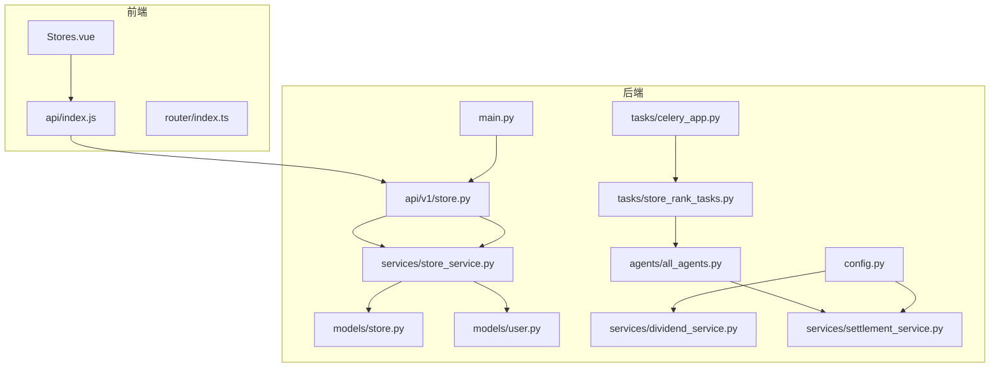
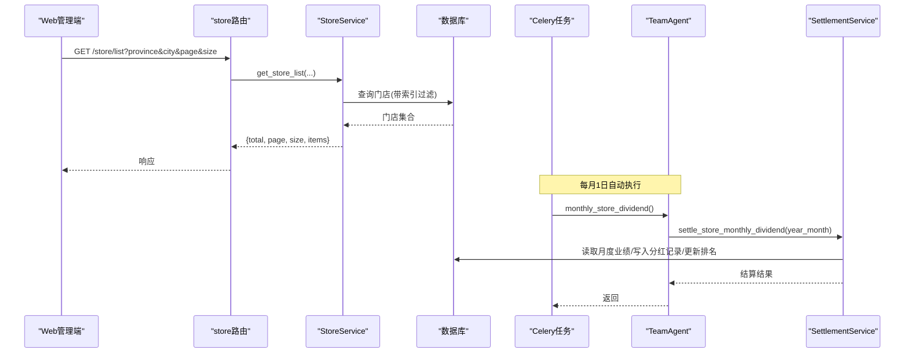
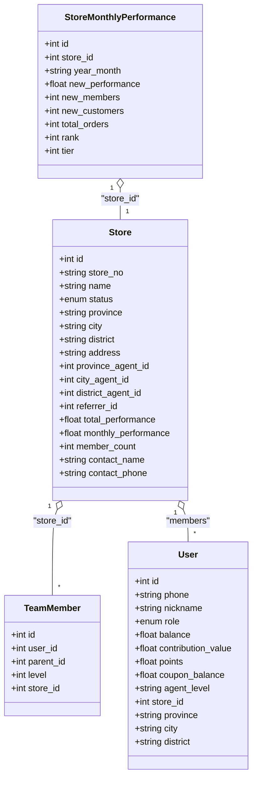
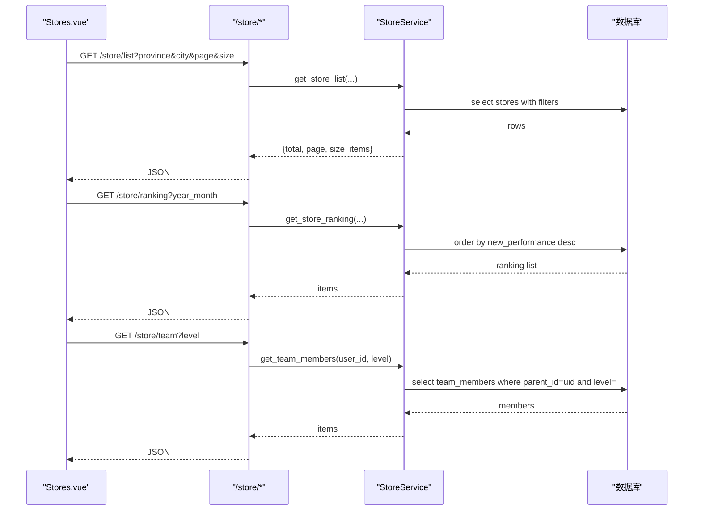
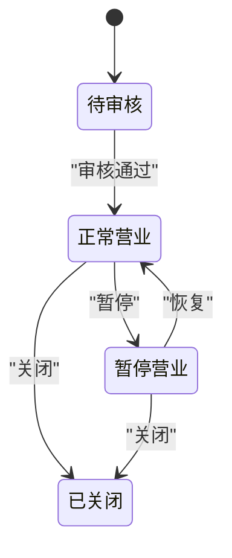
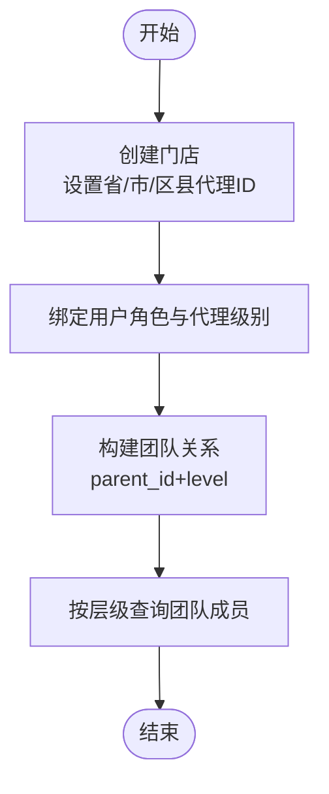
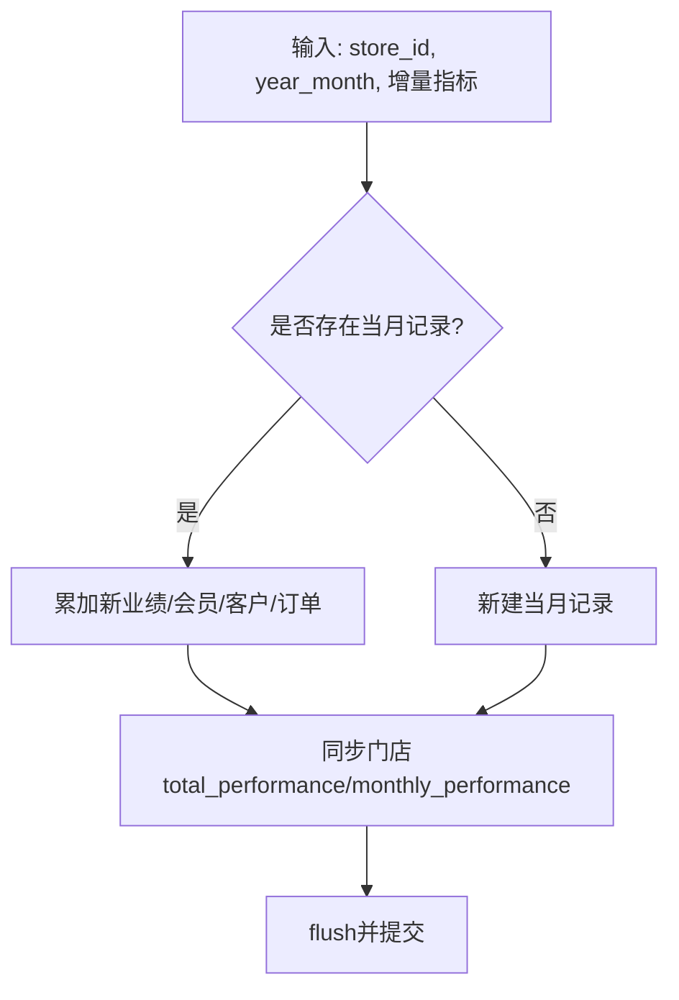
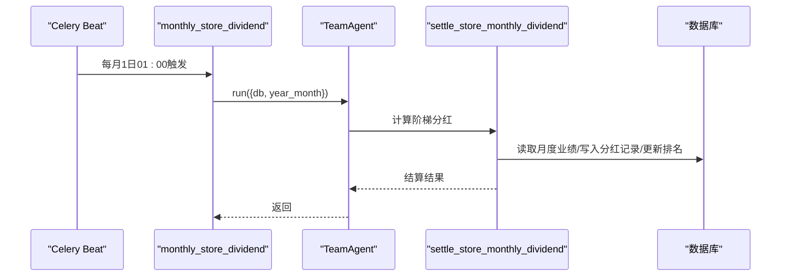
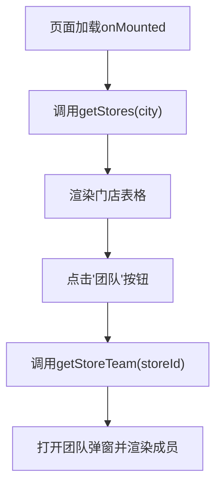
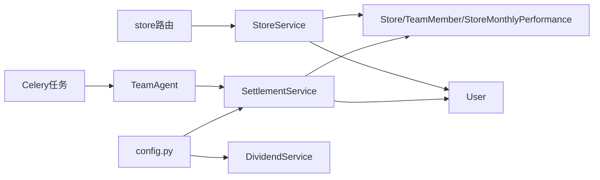

# 门店管理系统

<cite>
**本文引用的文件**
- [backend/app/api/v1/store.py](file://backend/app/api/v1/store.py)
- [backend/app/models/store.py](file://backend/app/models/store.py)
- [backend/app/services/store_service.py](file://backend/app/services/store_service.py)
- [backend/app/models/user.py](file://backend/app/models/user.py)
- [backend/app/services/dividend_service.py](file://backend/app/services/dividend_service.py)
- [backend/app/services/settlement_service.py](file://backend/app/services/settlement_service.py)
- [backend/app/agents/all_agents.py](file://backend/app/agents/all_agents.py)
- [backend/app/tasks/store_rank_tasks.py](file://backend/app/tasks/store_rank_tasks.py)
- [backend/app/tasks/celery_app.py](file://backend/app/tasks/celery_app.py)
- [backend/app/config.py](file://backend/app/config.py)
- [backend/app/main.py](file://backend/app/main.py)
- [frontend/web-admin/src/views/Stores.vue](file://frontend/web-admin/src/views/Stores.vue)
- [frontend/web-admin/src/api/index.js](file://frontend/web-admin/src/api/index.js)
- [frontend/web-admin/src/router/index.ts](file://frontend/web-admin/src/router/index.ts)
</cite>

## 目录
1. [简介](#简介)
2. [项目结构](#项目结构)
3. [核心组件](#核心组件)
4. [架构总览](#架构总览)
5. [详细组件分析](#详细组件分析)
6. [依赖关系分析](#依赖关系分析)
7. [性能与扩展性](#性能与扩展性)
8. [故障排查指南](#故障排查指南)
9. [结论](#结论)
10. [附录](#附录)

## 简介
本文件面向AIxingmu Web管理后台的“门店管理系统”，围绕以下目标进行系统化说明：
- 门店信息管理：列表展示、详情查看、地理位置标注（字段支撑）、审核流程（状态机）
- 区域代理关系与四级代理体系：省→市→区县→门店，团队层级维护
- 门店业绩统计与分红结算：月度排名、阶梯分红、分润记录
- 门店入驻申请、资质审核、合同管理与评级（以模型与流程为基线，结合后台能力）
- 数据统计与可视化：区域分布、业绩排名、经营分析报告（基于现有数据模型与任务）

## 项目结构
后端采用FastAPI + SQLAlchemy异步ORM + Celery定时任务；前端为Vue3 + Element Plus的管理后台。门店相关的关键路径如下：
- API层：store路由提供门店列表、排名、团队查询
- 服务层：StoreService封装门店创建、月度业绩更新、团队查询、排名计算
- 模型层：Store、TeamMember、StoreMonthlyPerformance定义门店、团队与业绩表
- 任务与Agent：Celery调度每月执行门店排名与分红，TeamAgent驱动结算逻辑
- 配置：统一的分润比例、阶梯阈值等参数集中管理
- 前端：Stores页面负责门店列表、筛选、团队弹窗展示

图表来源
- [backend/app/api/v1/store.py:1-48](file://backend/app/api/v1/store.py#L1-L48)
- [backend/app/services/store_service.py:1-161](file://backend/app/services/store_service.py#L1-L161)
- [backend/app/models/store.py:1-104](file://backend/app/models/store.py#L1-L104)
- [backend/app/models/user.py:1-93](file://backend/app/models/user.py#L1-L93)
- [backend/app/services/dividend_service.py:1-136](file://backend/app/services/dividend_service.py#L1-L136)
- [backend/app/services/settlement_service.py:1-166](file://backend/app/services/settlement_service.py#L1-L166)
- [backend/app/agents/all_agents.py:1-114](file://backend/app/agents/all_agents.py#L1-L114)
- [backend/app/tasks/store_rank_tasks.py:1-29](file://backend/app/tasks/store_rank_tasks.py#L1-L29)
- [backend/app/tasks/celery_app.py:1-56](file://backend/app/tasks/celery_app.py#L1-L56)
- [backend/app/config.py:1-145](file://backend/app/config.py#L1-L145)
- [backend/app/main.py:1-78](file://backend/app/main.py#L1-L78)
- [frontend/web-admin/src/views/Stores.vue:1-128](file://frontend/web-admin/src/views/Stores.vue#L1-L128)
- [frontend/web-admin/src/api/index.js:1-85](file://frontend/web-admin/src/api/index.js#L1-L85)
- [frontend/web-admin/src/router/index.ts:1-26](file://frontend/web-admin/src/router/index.ts#L1-L26)

章节来源
- [backend/app/main.py:1-78](file://backend/app/main.py#L1-L78)
- [backend/app/api/v1/store.py:1-48](file://backend/app/api/v1/store.py#L1-L48)
- [backend/app/services/store_service.py:1-161](file://backend/app/services/store_service.py#L1-L161)
- [backend/app/models/store.py:1-104](file://backend/app/models/store.py#L1-L104)
- [backend/app/models/user.py:1-93](file://backend/app/models/user.py#L1-L93)
- [backend/app/services/dividend_service.py:1-136](file://backend/app/services/dividend_service.py#L1-L136)
- [backend/app/services/settlement_service.py:1-166](file://backend/app/services/settlement_service.py#L1-L166)
- [backend/app/agents/all_agents.py:1-114](file://backend/app/agents/all_agents.py#L1-L114)
- [backend/app/tasks/store_rank_tasks.py:1-29](file://backend/app/tasks/store_rank_tasks.py#L1-L29)
- [backend/app/tasks/celery_app.py:1-56](file://backend/app/tasks/celery_app.py#L1-L56)
- [backend/app/config.py:1-145](file://backend/app/config.py#L1-L145)
- [frontend/web-admin/src/views/Stores.vue:1-128](file://frontend/web-admin/src/views/Stores.vue#L1-L128)
- [frontend/web-admin/src/api/index.js:1-85](file://frontend/web-admin/src/api/index.js#L1-L85)
- [frontend/web-admin/src/router/index.ts:1-26](file://frontend/web-admin/src/router/index.ts#L1-L26)

## 核心组件
- 门店数据模型
  - Store：门店主信息、区域归属、代理关联、推荐人、联系方式、累计/当月业绩、会员数、状态枚举
  - TeamMember：四级团队成员关系（直推/间推/间接2/间接3），支持按上级与层级查询
  - StoreMonthlyPerformance：门店月度业绩明细（新增业绩、新增会员/客户、订单数、排名、阶梯等级）
- 门店服务
  - create_store：创建门店并置为待审核
  - update_monthly_performance：增量更新月度业绩并同步门店汇总指标
  - get_team_members：按用户ID与层级获取团队成员
  - get_store_ranking：按年月取门店业绩排名
  - get_store_list：按省/市/状态分页查询门店
- 分红与结算
  - DividendService.weekly_dividend：全网贡献值周度分红（消费券发放）
  - SettlementService.settle_group_buy_win：拼团成功后的四级分润记录
  - SettlementService.settle_store_monthly_dividend：门店月度阶梯分红结算
- 任务与Agent
  - Celery按月调度门店排名与分红
  - TeamAgent调用结算服务完成月度分红
- 前端门店管理
  - Stores页面：城市筛选、门店列表、团队弹窗、基础操作入口
  - api/index.js：门店列表、排名、团队接口封装
  - router/index.ts：后台路由包含stores页面

章节来源
- [backend/app/models/store.py:1-104](file://backend/app/models/store.py#L1-L104)
- [backend/app/services/store_service.py:1-161](file://backend/app/services/store_service.py#L1-L161)
- [backend/app/services/dividend_service.py:1-136](file://backend/app/services/dividend_service.py#L1-L136)
- [backend/app/services/settlement_service.py:1-166](file://backend/app/services/settlement_service.py#L1-L166)
- [backend/app/agents/all_agents.py:1-114](file://backend/app/agents/all_agents.py#L1-L114)
- [backend/app/tasks/store_rank_tasks.py:1-29](file://backend/app/tasks/store_rank_tasks.py#L1-L29)
- [frontend/web-admin/src/views/Stores.vue:1-128](file://frontend/web-admin/src/views/Stores.vue#L1-L128)
- [frontend/web-admin/src/api/index.js:1-85](file://frontend/web-admin/src/api/index.js#L1-L85)
- [frontend/web-admin/src/router/index.ts:1-26](file://frontend/web-admin/src/router/index.ts#L1-L26)

## 架构总览
系统通过FastAPI暴露REST接口，服务层处理业务逻辑，模型层持久化数据；Celery定时任务驱动月度排名与分红；Agent将业务规则封装为可编排的执行单元。

图表来源
- [backend/app/api/v1/store.py:1-48](file://backend/app/api/v1/store.py#L1-L48)
- [backend/app/services/store_service.py:1-161](file://backend/app/services/store_service.py#L1-L161)
- [backend/app/tasks/store_rank_tasks.py:1-29](file://backend/app/tasks/store_rank_tasks.py#L1-L29)
- [backend/app/agents/all_agents.py:1-114](file://backend/app/agents/all_agents.py#L1-L114)
- [backend/app/services/settlement_service.py:1-166](file://backend/app/services/settlement_service.py#L1-L166)

## 详细组件分析

### 门店数据模型与关系
- Store：包含省市区地址、代理归属（省/市/区县）、推荐人、联系方式、累计与当月业绩、会员数、状态（待审核/营业中/暂停/关闭）
- TeamMember：四级团队关系，支持按parent_id与level查询
- StoreMonthlyPerformance：月度维度聚合指标，含排名与阶梯等级

图表来源
- [backend/app/models/store.py:1-104](file://backend/app/models/store.py#L1-L104)
- [backend/app/models/user.py:1-93](file://backend/app/models/user.py#L1-L93)

章节来源
- [backend/app/models/store.py:1-104](file://backend/app/models/store.py#L1-L104)
- [backend/app/models/user.py:1-93](file://backend/app/models/user.py#L1-L93)

### 门店API与服务
- 列表接口：支持按省/市/状态筛选，分页返回
- 排名接口：按年月返回门店业绩排名
- 团队接口：按当前登录用户与层级返回团队成员

图表来源
- [backend/app/api/v1/store.py:1-48](file://backend/app/api/v1/store.py#L1-L48)
- [backend/app/services/store_service.py:1-161](file://backend/app/services/store_service.py#L1-L161)

章节来源
- [backend/app/api/v1/store.py:1-48](file://backend/app/api/v1/store.py#L1-L48)
- [backend/app/services/store_service.py:1-161](file://backend/app/services/store_service.py#L1-L161)

### 门店审核流程与状态机
- 状态枚举：待审核、正常营业、暂停营业、已关闭
- 创建门店默认置为“待审核”
- 建议流程：提交申请→资质审核→合同签署→开启营业；在后台可通过状态切换推进流程

图表来源
- [backend/app/models/store.py:1-104](file://backend/app/models/store.py#L1-L104)

章节来源
- [backend/app/models/store.py:1-104](file://backend/app/models/store.py#L1-L104)

### 四级代理体系与团队层级
- 代理级别：省级、市级、区县、门店
- 团队层级：1级直推、2级间推、3级间接2、4级间接3
- 门店归属：通过province_agent_id、city_agent_id、district_agent_id建立区域代理关系
- 团队查询：按user_id与level检索团队成员

图表来源
- [backend/app/models/store.py:1-104](file://backend/app/models/store.py#L1-L104)
- [backend/app/models/user.py:1-93](file://backend/app/models/user.py#L1-L93)
- [backend/app/services/store_service.py:1-161](file://backend/app/services/store_service.py#L1-L161)

章节来源
- [backend/app/models/store.py:1-104](file://backend/app/models/store.py#L1-L104)
- [backend/app/models/user.py:1-93](file://backend/app/models/user.py#L1-L93)
- [backend/app/services/store_service.py:1-161](file://backend/app/services/store_service.py#L1-L161)

### 门店业绩统计与排名
- 月度业绩：新增业绩、新增会员/客户、订单数
- 排名：按new_performance降序生成
- 同步：更新月度业绩时同步门店累计与当月指标

图表来源
- [backend/app/services/store_service.py:1-161](file://backend/app/services/store_service.py#L1-L161)

章节来源
- [backend/app/services/store_service.py:1-161](file://backend/app/services/store_service.py#L1-L161)

### 门店月度阶梯分红与分润结算
- 月度阶梯分红：根据当月新增业绩落入不同区间，对应不同分红比例，生成StoreMonthlyDividend记录并更新rank/tier
- 四级分润：省1%、市2%、区县4%、门店8%、推荐门店1%，按全局配置比例写入结算记录
- 任务调度：每月1日凌晨由Celery触发TeamAgent执行月度分红

图表来源
- [backend/app/tasks/celery_app.py:1-56](file://backend/app/tasks/celery_app.py#L1-L56)
- [backend/app/tasks/store_rank_tasks.py:1-29](file://backend/app/tasks/store_rank_tasks.py#L1-L29)
- [backend/app/agents/all_agents.py:1-114](file://backend/app/agents/all_agents.py#L1-L114)
- [backend/app/services/settlement_service.py:1-166](file://backend/app/services/settlement_service.py#L1-L166)

章节来源
- [backend/app/tasks/celery_app.py:1-56](file://backend/app/tasks/celery_app.py#L1-L56)
- [backend/app/tasks/store_rank_tasks.py:1-29](file://backend/app/tasks/store_rank_tasks.py#L1-L29)
- [backend/app/agents/all_agents.py:1-114](file://backend/app/agents/all_agents.py#L1-L114)
- [backend/app/services/settlement_service.py:1-166](file://backend/app/services/settlement_service.py#L1-L166)

### 前端门店管理界面
- 门店列表：支持城市筛选、分页展示、状态标签、团队人数、月销售额、分红比例
- 团队弹窗：展示团队成员的用户ID、昵称、手机号、层级、加入时间
- 操作入口：添加门店、编辑门店（占位提示）

图表来源
- [frontend/web-admin/src/views/Stores.vue:1-128](file://frontend/web-admin/src/views/Stores.vue#L1-L128)
- [frontend/web-admin/src/api/index.js:1-85](file://frontend/web-admin/src/api/index.js#L1-L85)

章节来源
- [frontend/web-admin/src/views/Stores.vue:1-128](file://frontend/web-admin/src/views/Stores.vue#L1-L128)
- [frontend/web-admin/src/api/index.js:1-85](file://frontend/web-admin/src/api/index.js#L1-L85)

## 依赖关系分析
- 模块耦合
  - API层仅依赖服务层，服务层依赖模型层，职责清晰
  - 任务与Agent解耦于HTTP请求链路，通过Celery调度
- 外部依赖
  - 数据库：PostgreSQL（异步连接池）
  - 缓存/消息：Redis、RabbitMQ（Broker/Backend）
  - 对象存储：MinIO（用于图片/合同附件等）
- 配置中心
  - 分润比例、阶梯阈值、贡献值规则等集中在配置类

图表来源
- [backend/app/api/v1/store.py:1-48](file://backend/app/api/v1/store.py#L1-L48)
- [backend/app/services/store_service.py:1-161](file://backend/app/services/store_service.py#L1-L161)
- [backend/app/models/store.py:1-104](file://backend/app/models/store.py#L1-L104)
- [backend/app/models/user.py:1-93](file://backend/app/models/user.py#L1-L93)
- [backend/app/services/settlement_service.py:1-166](file://backend/app/services/settlement_service.py#L1-L166)
- [backend/app/services/dividend_service.py:1-136](file://backend/app/services/dividend_service.py#L1-L136)
- [backend/app/agents/all_agents.py:1-114](file://backend/app/agents/all_agents.py#L1-L114)
- [backend/app/tasks/celery_app.py:1-56](file://backend/app/tasks/celery_app.py#L1-L56)
- [backend/app/config.py:1-145](file://backend/app/config.py#L1-L145)

章节来源
- [backend/app/main.py:1-78](file://backend/app/main.py#L1-L78)
- [backend/app/config.py:1-145](file://backend/app/config.py#L1-L145)

## 性能与扩展性
- 查询优化
  - 门店列表使用索引：status、area(province, city, district)
  - 团队查询使用索引：parent_id, level
  - 月度业绩使用复合索引：store_id, year_month
- 异步与并发
  - FastAPI + asyncpg提升I/O吞吐
  - Celery异步执行耗时任务（月度排名与分红）
- 可扩展点
  - 增加地理坐标字段与地图服务集成（如高德/腾讯地图）
  - 引入缓存层（Redis）缓存热门门店列表与排名
  - 报表导出与可视化增强（ECharts/Mapbox）

[本节为通用指导，不直接分析具体文件]

## 故障排查指南
- 门店列表为空或筛选无效
  - 检查province/city/status参数是否正确传入
  - 确认数据库索引是否生效
- 团队查询无数据
  - 确认TeamMember.parent_id与level是否与预期一致
  - 检查用户角色与代理级别是否绑定正确
- 月度排名未更新
  - 核对Celery Beat是否运行且任务已注册
  - 检查TeamAgent与SettlementService执行日志
- 分红金额异常
  - 校验配置中的阶梯阈值与分红比例
  - 核对StoreMonthlyPerformance的new_performance数据源

章节来源
- [backend/app/services/store_service.py:1-161](file://backend/app/services/store_service.py#L1-L161)
- [backend/app/tasks/celery_app.py:1-56](file://backend/app/tasks/celery_app.py#L1-L56)
- [backend/app/agents/all_agents.py:1-114](file://backend/app/agents/all_agents.py#L1-L114)
- [backend/app/services/settlement_service.py:1-166](file://backend/app/services/settlement_service.py#L1-L166)
- [backend/app/config.py:1-145](file://backend/app/config.py#L1-L145)

## 结论
门店管理系统以清晰的模型与服务分层为基础，结合Celery与Agent实现自动化月度排名与分红；前端提供门店列表、团队查看与管理入口。后续可在地理标注、合同管理、资质审核与经营分析方面进一步扩展，完善从入驻到运营的全生命周期管理能力。

[本节为总结性内容，不直接分析具体文件]

## 附录

### 关键API一览
- 门店列表：GET /api/v1/store/list
- 门店排名：GET /api/v1/store/ranking
- 我的团队：GET /api/v1/store/team
- 门店团队详情：GET /api/v1/store/{storeId}/team（前端调用）

章节来源
- [backend/app/api/v1/store.py:1-48](file://backend/app/api/v1/store.py#L1-L48)
- [frontend/web-admin/src/api/index.js:1-85](file://frontend/web-admin/src/api/index.js#L1-L85)

### 配置项参考（节选）
- 四级分润比例：省1%、市2%、区县4%、门店8%、推荐门店1%
- 门店阶梯分红阈值与比例：3-5万/5-10万/10-50万/50万以上，对应0.5%/0.5%/0.5%/1%
- 贡献值周度分红：平台收益池的20%按贡献值占比分配

章节来源
- [backend/app/config.py:1-145](file://backend/app/config.py#L1-L145)

### 路由与页面
- 后台路由：stores → Stores.vue
- 页面功能：门店列表、城市筛选、团队弹窗、基础操作入口

章节来源
- [frontend/web-admin/src/router/index.ts:1-26](file://frontend/web-admin/src/router/index.ts#L1-L26)
- [frontend/web-admin/src/views/Stores.vue:1-128](file://frontend/web-admin/src/views/Stores.vue#L1-L128)