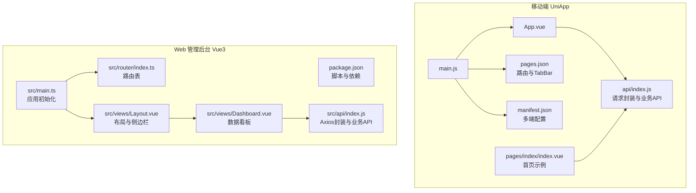
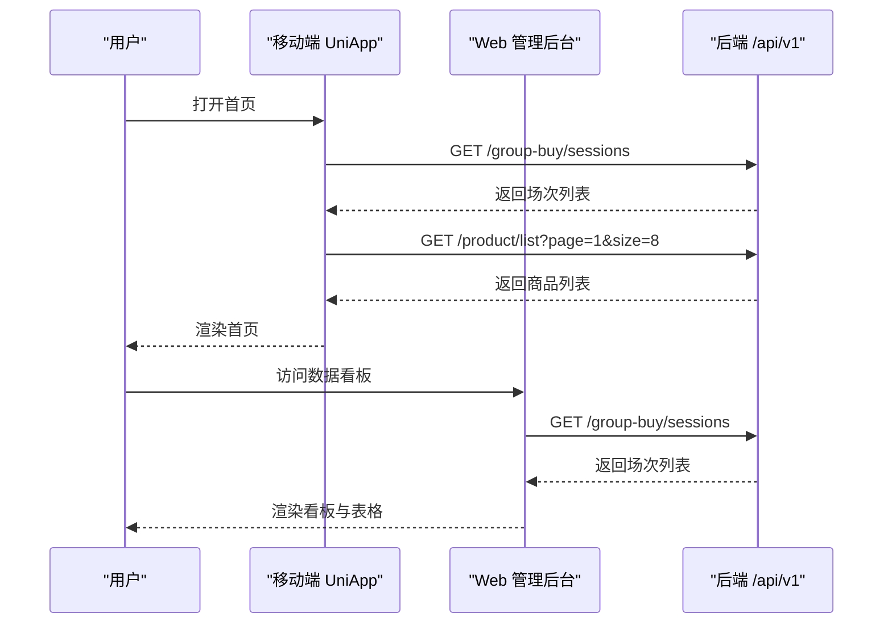
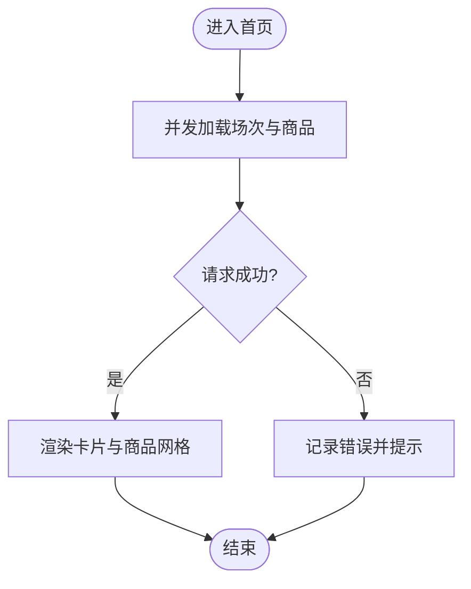
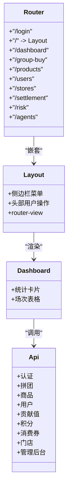
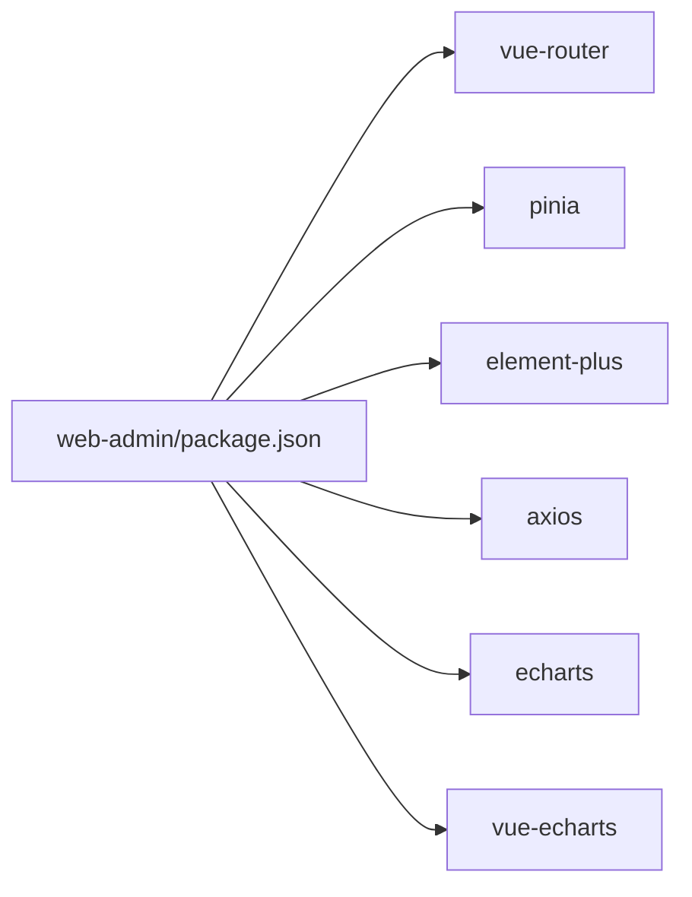

# 前端应用架构

<cite>
**本文引用的文件**   
- [frontend/mobile-app/pages.json](file://frontend/mobile-app/pages.json)
- [frontend/mobile-app/manifest.json](file://frontend/mobile-app/manifest.json)
- [frontend/mobile-app/main.js](file://frontend/mobile-app/main.js)
- [frontend/mobile-app/App.vue](file://frontend/mobile-app/App.vue)
- [frontend/mobile-app/api/index.js](file://frontend/mobile-app/api/index.js)
- [frontend/mobile-app/pages/index/index.vue](file://frontend/mobile-app/pages/index/index.vue)
- [frontend/web-admin/package.json](file://frontend/web-admin/package.json)
- [frontend/web-admin/src/router/index.ts](file://frontend/web-admin/src/router/index.ts)
- [frontend/web-admin/src/main.ts](file://frontend/web-admin/src/main.ts)
- [frontend/web-admin/src/views/Layout.vue](file://frontend/web-admin/src/views/Layout.vue)
- [frontend/web-admin/src/views/Dashboard.vue](file://frontend/web-admin/src/views/Dashboard.vue)
- [frontend/web-admin/src/api/index.js](file://frontend/web-admin/src/api/index.js)
</cite>

## 目录
1. [简介](#简介)
2. [项目结构](#项目结构)
3. [核心组件](#核心组件)
4. [架构总览](#架构总览)
5. [详细组件分析](#详细组件分析)
6. [依赖分析](#依赖分析)
7. [性能考虑](#性能考虑)
8. [故障排查指南](#故障排查指南)
9. [结论](#结论)
10. [附录](#附录)

## 简介
本仓库为AIxingmu的前端工程，包含双前端应用：
- 移动端UniApp应用：面向C端用户，提供拼团、商城、钱包、订单、个人中心等能力。
- Web管理后台Vue3应用：面向运营与管理人员，提供数据看板、拼团管理、商品管理、用户管理、门店管理、分润结算、风控中心、AI Agent管理等能力。

文档将围绕以下方面展开：
- 技术栈选择与页面路由设计
- 组件架构与状态管理方案
- 模块化设计与权限控制思路
- 数据可视化实现
- 构建配置、打包优化与部署策略
- 前后端通信协议、API封装规范与错误处理机制
- 性能优化、用户体验改进与跨平台适配
- 开发规范与团队协作建议

## 项目结构
整体采用“多前端”组织方式，移动端与管理后台各自独立维护，共享后端接口。

图示来源
- [frontend/mobile-app/main.js:1-18](file://frontend/mobile-app/main.js#L1-L18)
- [frontend/mobile-app/App.vue:1-21](file://frontend/mobile-app/App.vue#L1-L21)
- [frontend/mobile-app/pages.json:1-29](file://frontend/mobile-app/pages.json#L1-L29)
- [frontend/mobile-app/manifest.json:1-27](file://frontend/mobile-app/manifest.json#L1-L27)
- [frontend/mobile-app/api/index.js:1-65](file://frontend/mobile-app/api/index.js#L1-L65)
- [frontend/mobile-app/pages/index/index.vue:1-141](file://frontend/mobile-app/pages/index/index.vue#L1-L141)
- [frontend/web-admin/package.json:1-28](file://frontend/web-admin/package.json#L1-L28)
- [frontend/web-admin/src/main.ts:1-13](file://frontend/web-admin/src/main.ts#L1-L13)
- [frontend/web-admin/src/router/index.ts:1-26](file://frontend/web-admin/src/router/index.ts#L1-L26)
- [frontend/web-admin/src/views/Layout.vue:1-85](file://frontend/web-admin/src/views/Layout.vue#L1-L85)
- [frontend/web-admin/src/views/Dashboard.vue:1-109](file://frontend/web-admin/src/views/Dashboard.vue#L1-L109)
- [frontend/web-admin/src/api/index.js:1-56](file://frontend/web-admin/src/api/index.js#L1-L56)

章节来源
- [frontend/mobile-app/pages.json:1-29](file://frontend/mobile-app/pages.json#L1-L29)
- [frontend/mobile-app/manifest.json:1-27](file://frontend/mobile-app/manifest.json#L1-L27)
- [frontend/mobile-app/main.js:1-18](file://frontend/mobile-app/main.js#L1-L18)
- [frontend/mobile-app/App.vue:1-21](file://frontend/mobile-app/App.vue#L1-L21)
- [frontend/mobile-app/api/index.js:1-65](file://frontend/mobile-app/api/index.js#L1-L65)
- [frontend/mobile-app/pages/index/index.vue:1-141](file://frontend/mobile-app/pages/index/index.vue#L1-L141)
- [frontend/web-admin/package.json:1-28](file://frontend/web-admin/package.json#L1-L28)
- [frontend/web-admin/src/main.ts:1-13](file://frontend/web-admin/src/main.ts#L1-L13)
- [frontend/web-admin/src/router/index.ts:1-26](file://frontend/web-admin/src/router/index.ts#L1-L26)
- [frontend/web-admin/src/views/Layout.vue:1-85](file://frontend/web-admin/src/views/Layout.vue#L1-L85)
- [frontend/web-admin/src/views/Dashboard.vue:1-109](file://frontend/web-admin/src/views/Dashboard.vue#L1-L109)
- [frontend/web-admin/src/api/index.js:1-56](file://frontend/web-admin/src/api/index.js#L1-L56)

## 核心组件
- 移动端（UniApp）
  - 入口与生命周期：通过条件编译兼容Vue2/Vue3，统一创建应用实例并挂载。
  - 路由与导航：使用pages.json集中声明页面与全局样式，tabBar定义底部导航。
  - 多端配置：manifest.json中定义H5、小程序、App等平台差异化配置。
  - API封装：统一BASE_URL、自动注入Authorization头、统一错误处理与未登录跳转。
  - 页面示例：首页聚合拼团场次与热门商品，演示并发请求与基础交互。

- Web管理后台（Vue3 + Vite + Element Plus）
  - 应用初始化：引入Pinia、Element Plus、路由，完成插件注册与应用挂载。
  - 路由与布局：基于vue-router的嵌套路由，Layout承载侧边栏与主内容区。
  - 数据看板：展示关键指标与实时场次列表，调用后端接口渲染表格。
  - API封装：基于axios创建实例，拦截器自动附加Token，按模块导出业务方法。

章节来源
- [frontend/mobile-app/main.js:1-18](file://frontend/mobile-app/main.js#L1-L18)
- [frontend/mobile-app/pages.json:1-29](file://frontend/mobile-app/pages.json#L1-L29)
- [frontend/mobile-app/manifest.json:1-27](file://frontend/mobile-app/manifest.json#L1-L27)
- [frontend/mobile-app/api/index.js:1-65](file://frontend/mobile-app/api/index.js#L1-L65)
- [frontend/mobile-app/pages/index/index.vue:1-141](file://frontend/mobile-app/pages/index/index.vue#L1-L141)
- [frontend/web-admin/src/main.ts:1-13](file://frontend/web-admin/src/main.ts#L1-L13)
- [frontend/web-admin/src/router/index.ts:1-26](file://frontend/web-admin/src/router/index.ts#L1-L26)
- [frontend/web-admin/src/views/Layout.vue:1-85](file://frontend/web-admin/src/views/Layout.vue#L1-L85)
- [frontend/web-admin/src/views/Dashboard.vue:1-109](file://frontend/web-admin/src/views/Dashboard.vue#L1-L109)
- [frontend/web-admin/src/api/index.js:1-56](file://frontend/web-admin/src/api/index.js#L1-L56)

## 架构总览
双前端共享同一套后端REST API，路径前缀为/api/v1。移动端通过uni.request发起请求，Web端通过axios发起请求；两者均支持在请求头携带Bearer Token进行鉴权。

图示来源
- [frontend/mobile-app/api/index.js:1-65](file://frontend/mobile-app/api/index.js#L1-L65)
- [frontend/mobile-app/pages/index/index.vue:1-141](file://frontend/mobile-app/pages/index/index.vue#L1-L141)
- [frontend/web-admin/src/api/index.js:1-56](file://frontend/web-admin/src/api/index.js#L1-L56)
- [frontend/web-admin/src/views/Dashboard.vue:1-109](file://frontend/web-admin/src/views/Dashboard.vue#L1-L109)

## 详细组件分析

### 移动端 UniApp 应用
- 技术栈与多端能力
  - 基于Vue3（条件编译兼容Vue2），使用pages.json管理页面与全局样式，manifest.json管理多端发布参数。
  - H5模式使用hash路由，便于静态托管与Nginx转发。

- 页面与路由设计
  - 根级页面包括首页、商城、拼团、订单、钱包、个人中心等，并通过tabBar固定常用入口。
  - 详情类页面通过动态路由参数传递上下文（如拼团详情）。

- 组件架构
  - 以单页组件为主，轻量状态保存在data中，复杂场景可引入store（当前未启用）。
  - 通用逻辑可通过api/index.js中的方法复用，避免重复网络请求封装。

- 状态管理方案
  - 当前采用页面级状态；如需跨页面共享，可引入Vuex/Pinia或uni-simple-store等方案。

- 前后端通信与错误处理
  - 统一BASE_URL与请求头，自动附加Authorization。
  - 对401进行本地清理与重定向到登录页；其他错误透传detail信息。

图示来源
- [frontend/mobile-app/pages/index/index.vue:1-141](file://frontend/mobile-app/pages/index/index.vue#L1-L141)
- [frontend/mobile-app/api/index.js:1-65](file://frontend/mobile-app/api/index.js#L1-L65)

章节来源
- [frontend/mobile-app/pages.json:1-29](file://frontend/mobile-app/pages.json#L1-L29)
- [frontend/mobile-app/manifest.json:1-27](file://frontend/mobile-app/manifest.json#L1-L27)
- [frontend/mobile-app/main.js:1-18](file://frontend/mobile-app/main.js#L1-L18)
- [frontend/mobile-app/App.vue:1-21](file://frontend/mobile-app/App.vue#L1-L21)
- [frontend/mobile-app/api/index.js:1-65](file://frontend/mobile-app/api/index.js#L1-L65)
- [frontend/mobile-app/pages/index/index.vue:1-141](file://frontend/mobile-app/pages/index/index.vue#L1-L141)

### Web 管理后台 Vue3 应用
- 技术栈与构建
  - Vue3 + TypeScript + Vite + Element Plus + Pinia + ECharts（已安装，可在图表页面集成）。
  - 提供dev/build/preview脚本，支持类型检查与预览。

- 模块化与路由
  - 路由采用懒加载，Layout作为壳组件承载侧边栏与router-view。
  - 子路由覆盖数据看板、拼团管理、商品、用户、门店、结算、风控、Agent等模块。

- 权限控制思路
  - 当前路由表为静态配置；建议在路由守卫中结合token与角色/权限表做动态校验与菜单过滤。
  - 可结合后端返回的权限点在前端生成可访问路由集合。

- 数据可视化
  - 看板页面已集成表格与标签展示；ECharts已引入，可在具体视图按需渲染折线、柱状、饼图等。

图示来源
- [frontend/web-admin/src/router/index.ts:1-26](file://frontend/web-admin/src/router/index.ts#L1-L26)
- [frontend/web-admin/src/views/Layout.vue:1-85](file://frontend/web-admin/src/views/Layout.vue#L1-L85)
- [frontend/web-admin/src/views/Dashboard.vue:1-109](file://frontend/web-admin/src/views/Dashboard.vue#L1-L109)
- [frontend/web-admin/src/api/index.js:1-56](file://frontend/web-admin/src/api/index.js#L1-L56)

章节来源
- [frontend/web-admin/package.json:1-28](file://frontend/web-admin/package.json#L1-L28)
- [frontend/web-admin/src/main.ts:1-13](file://frontend/web-admin/src/main.ts#L1-L13)
- [frontend/web-admin/src/router/index.ts:1-26](file://frontend/web-admin/src/router/index.ts#L1-L26)
- [frontend/web-admin/src/views/Layout.vue:1-85](file://frontend/web-admin/src/views/Layout.vue#L1-L85)
- [frontend/web-admin/src/views/Dashboard.vue:1-109](file://frontend/web-admin/src/views/Dashboard.vue#L1-L109)
- [frontend/web-admin/src/api/index.js:1-56](file://frontend/web-admin/src/api/index.js#L1-L56)

## 依赖分析
- 移动端
  - 依赖：uni-app生态（由脚手架与manifest决定）、Vue3（条件编译分支）。
  - 外部库：无显式第三方UI库，使用原生view/text/button等组件。

- Web管理后台
  - 运行时依赖：vue、vue-router、pinia、element-plus、@element-plus/icons-vue、echarts、vue-echarts、axios。
  - 开发依赖：@vitejs/plugin-vue、typescript、vite、vue-tsc。

图示来源
- [frontend/web-admin/package.json:1-28](file://frontend/web-admin/package.json#L1-L28)

章节来源
- [frontend/web-admin/package.json:1-28](file://frontend/web-admin/package.json#L1-L28)

## 性能考虑
- 移动端
  - 首屏优化：减少首屏请求数量，合并必要数据；图片资源压缩与懒加载。
  - 列表渲染：长列表分页加载，避免一次性渲染过多节点。
  - 缓存策略：对不频繁变化的数据使用本地存储或内存缓存。
  - 包体控制：按需引入图标与样式，移除无用资源。

- Web管理后台
  - 路由懒加载：已采用动态import，保持按需加载。
  - 组件拆分：将大组件拆分为子组件，提升可维护性与渲染效率。
  - 图表优化：大数据量时使用虚拟滚动或服务端分页；按需引入ECharts系列。
  - 构建优化：开启Vite生产优化，按需加载Element Plus组件与样式。

[本节为通用指导，无需源码引用]

## 故障排查指南
- 移动端
  - 401未登录：自动清除本地token并跳转登录页，检查登录流程是否正确保存token。
  - 网络异常：fail回调会抛出错误，建议在页面层捕获并提示用户重试。
  - 跨域问题：确保H5开发服务器代理或后端允许跨域。

- Web管理后台
  - axios拦截器：确认localStorage中存在token且格式正确。
  - 超时设置：默认10s，若接口较慢可适当调整。
  - 路由守卫：如需权限控制，请在路由前置守卫中校验token与角色。

章节来源
- [frontend/mobile-app/api/index.js:1-65](file://frontend/mobile-app/api/index.js#L1-L65)
- [frontend/web-admin/src/api/index.js:1-56](file://frontend/web-admin/src/api/index.js#L1-L56)

## 结论
本项目采用双前端架构，移动端聚焦用户体验与多端一致性，Web端聚焦运营管理与数据可视化。通过统一的API前缀与规范的请求封装，前后端协作清晰。后续可在权限控制、状态管理、图表可视化与构建优化等方面持续完善，以提升系统稳定性与可维护性。

[本节为总结性内容，无需源码引用]

## 附录

### 前后端通信协议与API规范
- 基础路径：/api/v1
- 鉴权：Authorization: Bearer <token>
- 响应：统一JSON，错误时包含detail字段
- 分页：常见参数page、size

章节来源
- [frontend/mobile-app/api/index.js:1-65](file://frontend/mobile-app/api/index.js#L1-L65)
- [frontend/web-admin/src/api/index.js:1-56](file://frontend/web-admin/src/api/index.js#L1-L56)

### 构建与部署策略
- 移动端
  - H5：manifest中配置端口与hash路由，适合Nginx静态托管与反向代理至/api/v1。
  - 小程序/App：按manifest对应平台配置appid与权限。

- Web管理后台
  - 开发：vite dev
  - 构建：vue-tsc && vite build
  - 预览：vite preview
  - 部署：将dist目录托管至静态服务器，并配置/api/v1反向代理至后端服务。

章节来源
- [frontend/mobile-app/manifest.json:1-27](file://frontend/mobile-app/manifest.json#L1-L27)
- [frontend/web-admin/package.json:1-28](file://frontend/web-admin/package.json#L1-L28)

### 开发规范与团队协作建议
- 代码风格
  - 统一ESLint/Prettier规则（可在后续引入）
  - 命名规范：变量驼峰、组件PascalCase、常量全大写
- 提交规范
  - 采用Conventional Commits，如feat/fix/docs/chore等
- 分支策略
  - main/release用于发布，feature/*用于功能开发，hotfix/*用于紧急修复
- 评审与测试
  - 重要变更需Code Review
  - 关键流程补充单元测试与端到端测试

[本节为通用指导，无需源码引用]