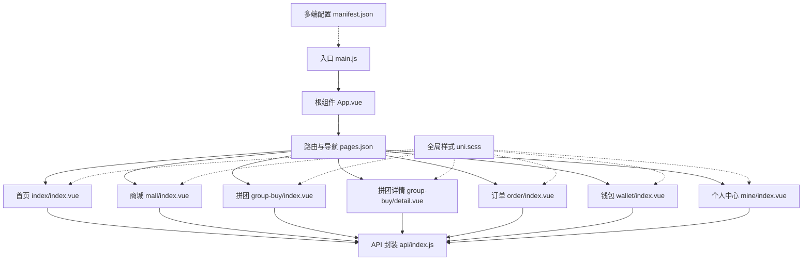
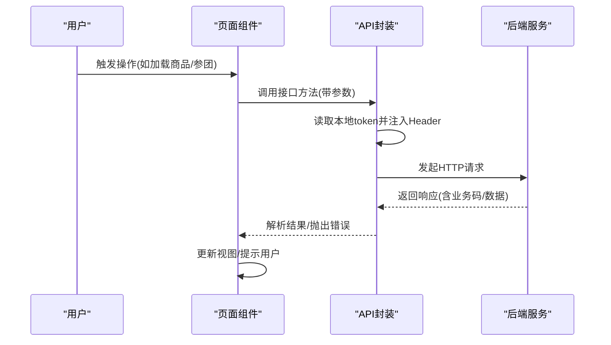
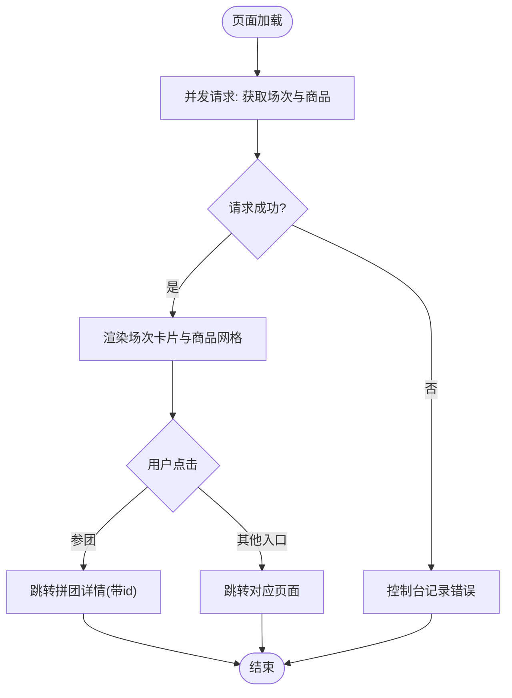
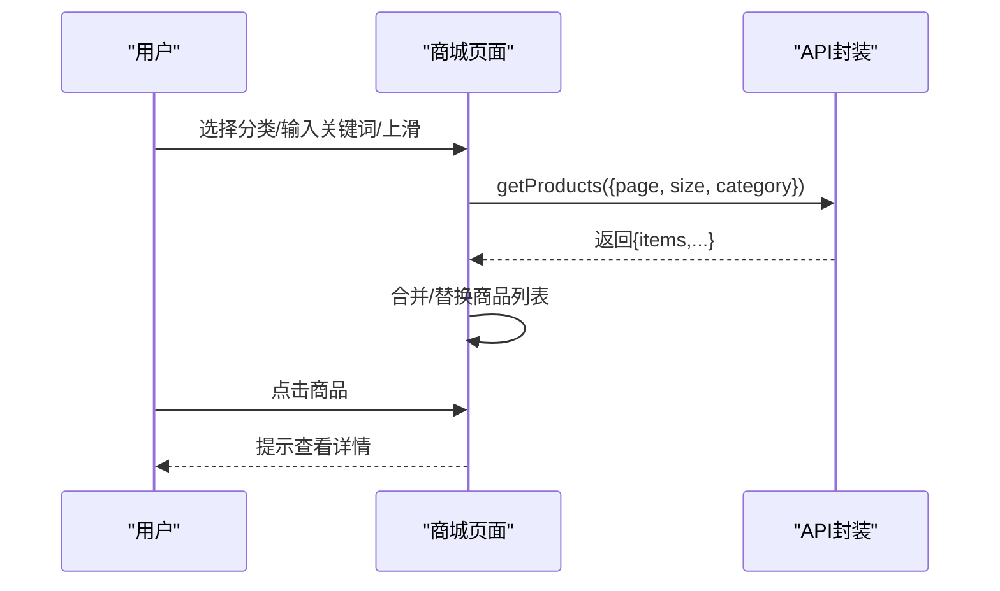
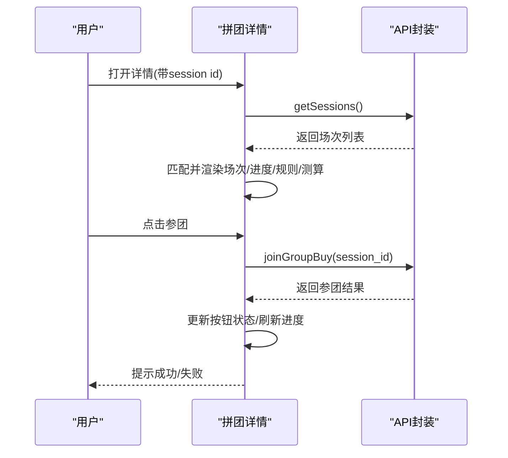
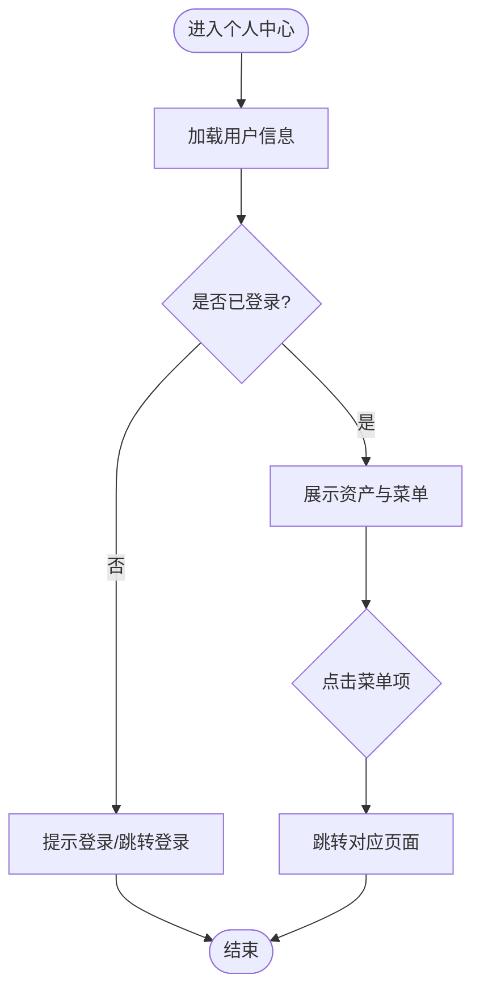
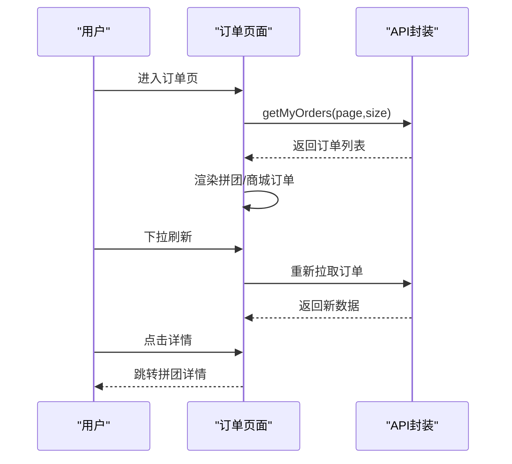
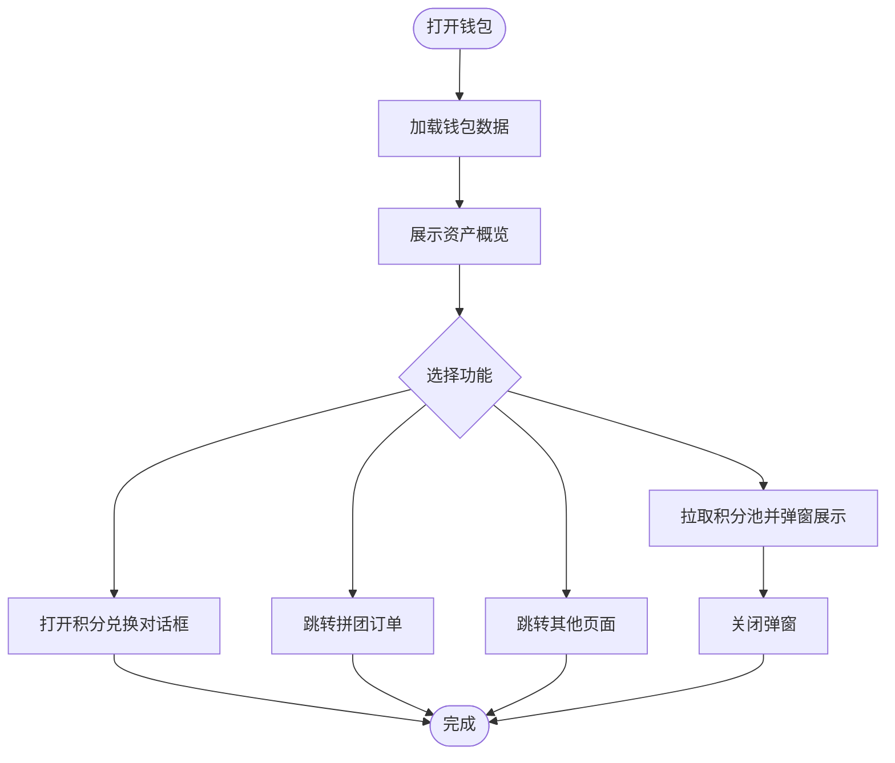
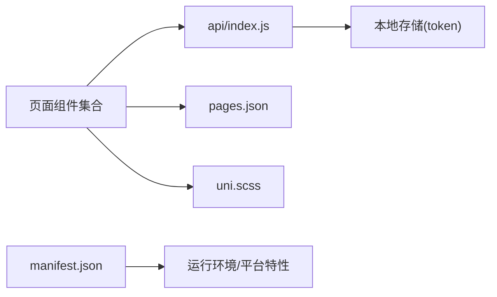

# 移动端UniApp应用

<cite>
**本文引用的文件**   
- [App.vue](file://frontend/mobile-app/App.vue)
- [main.js](file://frontend/mobile-app/main.js)
- [pages.json](file://frontend/mobile-app/pages.json)
- [manifest.json](file://frontend/mobile-app/manifest.json)
- [uni.scss](file://frontend/mobile-app/uni.scss)
- [index.vue（首页）](file://frontend/mobile-app/pages/index/index.vue)
- [index.vue（商城）](file://frontend/mobile-app/pages/mall/index.vue)
- [index.vue（拼团专区）](file://frontend/mobile-app/pages/group-buy/index.vue)
- [detail.vue（拼团详情）](file://frontend/mobile-app/pages/group-buy/detail.vue)
- [index.vue（个人中心）](file://frontend/mobile-app/pages/mine/index.vue)
- [index.vue（订单）](file://frontend/mobile-app/pages/order/index.vue)
- [index.vue（钱包）](file://frontend/mobile-app/pages/wallet/index.vue)
- [api/index.js](file://frontend/mobile-app/api/index.js)
</cite>

## 目录
1. [简介](#简介)
2. [项目结构](#项目结构)
3. [核心组件](#核心组件)
4. [架构总览](#架构总览)
5. [详细组件分析](#详细组件分析)
6. [依赖关系分析](#依赖关系分析)
7. [性能与体验优化](#性能与体验优化)
8. [故障排查指南](#故障排查指南)
9. [结论](#结论)
10. [附录](#附录)

## 简介
本项目为AIxingmu移动端UniApp应用，采用Vue3语法与UniApp跨平台能力，面向iOS、Android与小程序等多端。应用围绕“共享商城+拼团生态”展开，提供首页展示、拼团专区、商城购物、订单管理、钱包与个人中心等核心功能。前端通过统一的API封装进行网络请求、鉴权与错误处理，结合本地存储实现登录态维护与基础状态缓存。

## 项目结构
移动端应用位于 frontend/mobile-app 目录下，主要包含：
- 入口与全局配置：App.vue、main.js、pages.json、manifest.json、uni.scss
- 页面模块：pages 下按业务划分多个子目录与页面
- API封装：api/index.js 统一封装后端接口调用

图表来源
- [main.js:1-18](file://frontend/mobile-app/main.js#L1-L18)
- [App.vue:1-21](file://frontend/mobile-app/App.vue#L1-L21)
- [pages.json:1-29](file://frontend/mobile-app/pages.json#L1-L29)
- [manifest.json:1-27](file://frontend/mobile-app/manifest.json#L1-L27)
- [uni.scss:1-12](file://frontend/mobile-app/uni.scss#L1-L12)
- [index.vue（首页）:1-141](file://frontend/mobile-app/pages/index/index.vue#L1-L141)
- [index.vue（商城）:1-119](file://frontend/mobile-app/pages/mall/index.vue#L1-L119)
- [index.vue（拼团专区）:1-2](file://frontend/mobile-app/pages/group-buy/index.vue#L1-L2)
- [detail.vue（拼团详情）:1-202](file://frontend/mobile-app/pages/group-buy/detail.vue#L1-L202)
- [index.vue（订单）:1-150](file://frontend/mobile-app/pages/order/index.vue#L1-L150)
- [index.vue（钱包）:1-113](file://frontend/mobile-app/pages/wallet/index.vue#L1-L113)
- [api/index.js:1-65](file://frontend/mobile-app/api/index.js#L1-L65)

章节来源
- [main.js:1-18](file://frontend/mobile-app/main.js#L1-L18)
- [App.vue:1-21](file://frontend/mobile-app/App.vue#L1-L21)
- [pages.json:1-29](file://frontend/mobile-app/pages.json#L1-L29)
- [manifest.json:1-27](file://frontend/mobile-app/manifest.json#L1-L27)
- [uni.scss:1-12](file://frontend/mobile-app/uni.scss#L1-L12)

## 核心组件
- 应用生命周期与全局样式
  - 应用启动、显示、隐藏事件在根组件中注册，便于统一埋点或初始化逻辑。
  - 全局字体与背景色在根组件与全局样式文件中定义，确保多端一致性。
- 路由与TabBar
  - 所有页面路径在路由配置中集中声明，并设置导航栏标题。
  - TabBar定义了底部五个主入口：首页、商城、拼团、钱包、我的，支持选中态图标切换。
- 多端配置
  - 应用名称、版本、平台权限、H5开发端口与路由模式、小程序相关设置在清单文件中统一管理。
- 全局样式变量
  - 主题色、成功/警告/危险/信息色、背景与文本颜色等变量集中管理，便于统一换肤与品牌化。

章节来源
- [App.vue:1-21](file://frontend/mobile-app/App.vue#L1-L21)
- [pages.json:1-29](file://frontend/mobile-app/pages.json#L1-L29)
- [manifest.json:1-27](file://frontend/mobile-app/manifest.json#L1-L27)
- [uni.scss:1-12](file://frontend/mobile-app/uni.scss#L1-L12)

## 架构总览
整体采用“页面组件 + 统一API封装 + 本地存储”的轻量架构。页面负责数据渲染与交互，API层负责请求构造、鉴权注入与错误分发，本地存储用于保存token与必要用户态。

图表来源
- [api/index.js:1-65](file://frontend/mobile-app/api/index.js#L1-L65)
- [index.vue（商城）:1-119](file://frontend/mobile-app/pages/mall/index.vue#L1-L119)
- [detail.vue（拼团详情）:1-202](file://frontend/mobile-app/pages/group-buy/detail.vue#L1-L202)

## 详细组件分析

### 首页（index/index.vue）
- 功能要点
  - 顶部横幅与快捷入口，跳转至拼团、商城、钱包、订单等页面。
  - 实时拼团场次卡片列表，展示级别标签、价格、参与进度条与时间，支持立即参团。
  - 热门商品网格展示，图片、名称、现价与原价。
- 数据加载
  - 使用并发请求同时拉取拼团场次与商品列表，失败时控制台输出错误。
- 路由跳转
  - 使用导航API跳转到目标页面；参团按钮携带会话ID进入详情页。
- 样式与布局
  - 使用flex布局与渐变背景，卡片圆角与阴影提升视觉层次。

图表来源
- [index.vue（首页）:1-141](file://frontend/mobile-app/pages/index/index.vue#L1-L141)

章节来源
- [index.vue（首页）:1-141](file://frontend/mobile-app/pages/index/index.vue#L1-L141)

### 商城（mall/index.vue）
- 功能要点
  - 分类导航（全部/吃/喝/用/穿），点击切换当前分类。
  - 搜索输入框，回车触发搜索。
  - 商品列表分页加载，上滑触底自动加载更多。
  - 商品卡片展示封面、名称、标签、价格、销量与贡献值提示。
- 数据与交互
  - 通过API封装获取商品列表，支持分页参数与分类过滤。
  - 空状态提示与加载状态控制。
- 路由与跳转
  - 点击商品卡片可进入详情（示例中为Toast提示）。

图表来源
- [index.vue（商城）:1-119](file://frontend/mobile-app/pages/mall/index.vue#L1-L119)
- [api/index.js:1-65](file://frontend/mobile-app/api/index.js#L1-L65)

章节来源
- [index.vue（商城）:1-119](file://frontend/mobile-app/pages/mall/index.vue#L1-L119)
- [api/index.js:1-65](file://frontend/mobile-app/api/index.js#L1-L65)

### 拼团专区（group-buy/index.vue）
- 现状说明
  - 当前为占位页面，仅展示标题文本。后续可扩展为场次筛选、推荐与活动入口聚合。

章节来源
- [index.vue（拼团专区）:1-2](file://frontend/mobile-app/pages/group-buy/index.vue#L1-L2)

### 拼团详情（group-buy/detail.vue）
- 功能要点
  - 展示场次基本信息（级别、价格、箱数倍数）、实时参团进度条与头像点阵。
  - 规则说明与收益测算（拼中权益、失败补贴、积分与贡献值计算）。
  - 底部固定操作栏，显示参团金额与参团按钮，支持禁用态与防重复提交。
- 数据与交互
  - 根据URL参数加载场次数据，若未找到则回退默认值。
  - 参团成功后更新状态并刷新场次进度。
- 错误处理
  - 加载失败或参团异常时弹出提示。

图表来源
- [detail.vue（拼团详情）:1-202](file://frontend/mobile-app/pages/group-buy/detail.vue#L1-L202)
- [api/index.js:1-65](file://frontend/mobile-app/api/index.js#L1-L65)

章节来源
- [detail.vue（拼团详情）:1-202](file://frontend/mobile-app/pages/group-buy/detail.vue#L1-L202)
- [api/index.js:1-65](file://frontend/mobile-app/api/index.js#L1-L65)

### 个人中心（mine/index.vue）
- 功能要点
  - 用户头部展示头像、昵称、手机号与代理等级徽章。
  - 资产概览：余额、贡献值、积分、消费券。
  - 功能菜单：订单、钱包、贡献值明细、消费券、团队、门店排名、邀请好友、设置与关于。
- 数据与交互
  - 页面显示时加载用户信息，未登录引导跳转登录页。
  - 分享邀请链接到剪贴板并提示复制成功。

图表来源
- [index.vue（个人中心）:1-168](file://frontend/mobile-app/pages/mine/index.vue#L1-L168)
- [api/index.js:1-65](file://frontend/mobile-app/api/index.js#L1-L65)

章节来源
- [index.vue（个人中心）:1-168](file://frontend/mobile-app/pages/mine/index.vue#L1-L168)
- [api/index.js:1-65](file://frontend/mobile-app/api/index.js#L1-L65)

### 订单（order/index.vue）
- 功能要点
  - 顶部Tab切换：拼团订单与商城订单。
  - 拼团订单卡片展示订单号、级别、金额、结果与时间，支持查看详情。
  - 商城订单卡片展示商品名、数量、金额与时间。
- 数据与交互
  - 首次加载拉取拼团订单，支持下拉刷新。
  - 详情跳转至拼团详情并携带会话ID。

图表来源
- [index.vue（订单）:1-150](file://frontend/mobile-app/pages/order/index.vue#L1-L150)
- [api/index.js:1-65](file://frontend/mobile-app/api/index.js#L1-L65)

章节来源
- [index.vue（订单）:1-150](file://frontend/mobile-app/pages/order/index.vue#L1-L150)
- [api/index.js:1-65](file://frontend/mobile-app/api/index.js#L1-L65)

### 钱包（wallet/index.vue）
- 功能要点
  - 资产总览：余额、消费券、贡献值、增值积分。
  - 功能列表：拼团订单、积分池状态、积分兑换消费券、消费券明细、贡献值明细、余额流水。
  - 弹窗展示积分池发行量、发放量、通缩量、单价与剩余可发。
- 数据与交互
  - 页面显示时加载钱包数据；点击积分池状态弹窗拉取池信息。
  - 积分兑换流程预留交互入口。

图表来源
- [index.vue（钱包）:1-113](file://frontend/mobile-app/pages/wallet/index.vue#L1-L113)
- [api/index.js:1-65](file://frontend/mobile-app/api/index.js#L1-L65)

章节来源
- [index.vue（钱包）:1-113](file://frontend/mobile-app/pages/wallet/index.vue#L1-L113)
- [api/index.js:1-65](file://frontend/mobile-app/api/index.js#L1-L65)

## 依赖关系分析
- 页面与API
  - 各业务页面均依赖 api/index.js 提供的接口方法，形成“页面 -> API封装 -> 后端”的单向依赖。
- 路由与导航
  - 页面跳转通过 uni.navigateTo 与 pages.json 的路径映射完成，TabBar由配置驱动。
- 全局样式与主题
  - uni.scss 中的变量被各页面引用，保证色彩体系一致。
- 多端配置
  - manifest.json 控制应用元信息与平台差异（权限、H5端口、小程序开关等）。

图表来源
- [api/index.js:1-65](file://frontend/mobile-app/api/index.js#L1-L65)
- [pages.json:1-29](file://frontend/mobile-app/pages.json#L1-L29)
- [uni.scss:1-12](file://frontend/mobile-app/uni.scss#L1-L12)
- [manifest.json:1-27](file://frontend/mobile-app/manifest.json#L1-L27)

章节来源
- [api/index.js:1-65](file://frontend/mobile-app/api/index.js#L1-L65)
- [pages.json:1-29](file://frontend/mobile-app/pages.json#L1-L29)
- [uni.scss:1-12](file://frontend/mobile-app/uni.scss#L1-L12)
- [manifest.json:1-27](file://frontend/mobile-app/manifest.json#L1-L27)

## 性能与体验优化
- 图片加载优化
  - 使用懒加载与占位图，避免首屏大图阻塞；对长列表图片启用压缩与CDN缓存。
- 列表与滚动
  - 分页加载与虚拟列表结合，减少DOM节点数量；避免频繁重排重绘。
- 网络请求
  - 复用API封装，统一拦截器处理鉴权、重试与错误提示；合理设置超时与降级策略。
- 内存管理
  - 页面销毁时清理定时器与监听器；避免闭包持有大对象引用。
- 用户体验
  - 骨架屏与加载态反馈；关键操作二次确认；弱网提示与离线兜底。
- 多端适配
  - 基于manifest.json与条件编译区分平台差异；注意iOS与Android安全区域、键盘遮挡与手势冲突。
- 小程序兼容
  - 避免使用浏览器特有API；遵循小程序限制（分包大小、网络域名白名单、storage上限）。

[本节为通用指导，不直接分析具体文件]

## 故障排查指南
- 未登录或Token失效
  - 现象：请求返回401后自动跳转登录页。
  - 排查：检查本地token是否存在且有效；确认登录流程是否正确写入token。
- 网络请求失败
  - 现象：统一错误提示或控制台报错。
  - 排查：核对BASE_URL与后端地址；检查域名白名单与HTTPS证书；查看请求头与参数。
- 页面无法跳转
  - 现象：navigateTo无效或白屏。
  - 排查：确认pages.json中路径存在且未被TabBar占用；检查参数传递与接收。
- 样式错乱
  - 现象：不同设备显示不一致。
  - 排查：检查rpx单位与安全区域；对比uni.scss变量与平台差异。

章节来源
- [api/index.js:1-65](file://frontend/mobile-app/api/index.js#L1-L65)
- [pages.json:1-29](file://frontend/mobile-app/pages.json#L1-L29)
- [App.vue:1-21](file://frontend/mobile-app/App.vue#L1-L21)

## 结论
本移动端应用以Vue3与UniApp为基础，构建了清晰的页面分层与统一的API封装，实现了首页、拼团、商城、订单、钱包与个人中心等核心业务。通过集中式路由与TabBar配置、全局样式变量与多端清单管理，保证了多端一致性与可维护性。后续可在状态管理、组件库沉淀、性能监控与自动化测试方面持续完善。

[本节为总结性内容，不直接分析具体文件]

## 附录

### 路由与TabBar配置摘要
- 页面路径与标题
  - 首页、商城、拼团、拼团详情、订单、钱包、个人中心均已注册。
- TabBar
  - 五个主入口：首页、商城、拼团、钱包、我的，分别配置图标与选中图标。

章节来源
- [pages.json:1-29](file://frontend/mobile-app/pages.json#L1-L29)

### 多端配置摘要
- 应用元信息：名称、描述、版本号
- 平台权限：Android网络访问权限
- H5：开发端口与路由模式
- 小程序：appid与urlCheck设置

章节来源
- [manifest.json:1-27](file://frontend/mobile-app/manifest.json#L1-L27)

### API封装能力摘要
- 认证：登录、注册
- 拼团：获取场次、参团、我的订单
- 商品：商品列表
- 用户：个人信息、钱包
- 贡献值：我的贡献
- 积分：积分池、积分兑换
- 消费券：我的消费券
- 门店：排行榜、我的团队

章节来源
- [api/index.js:1-65](file://frontend/mobile-app/api/index.js#L1-L65)