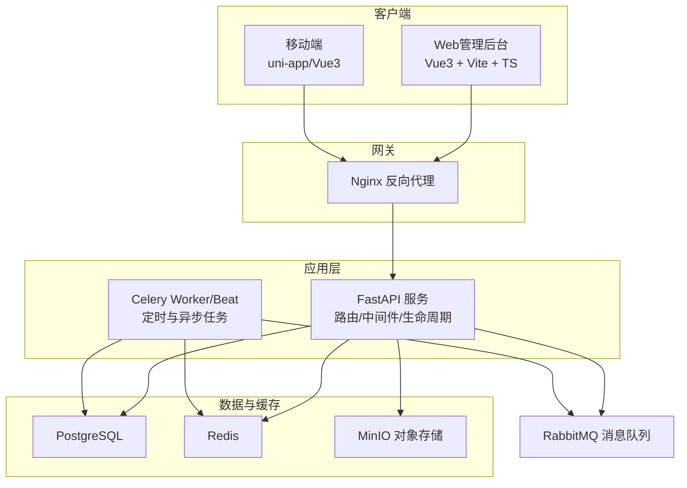
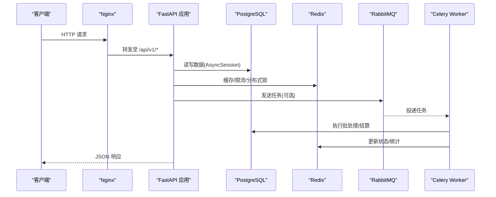
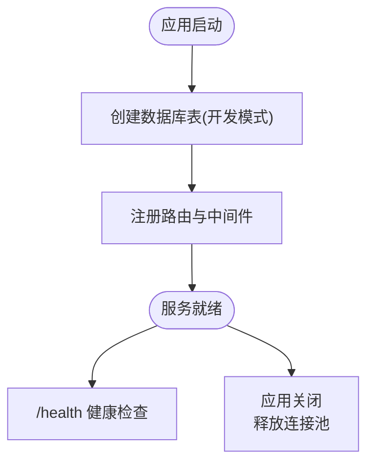
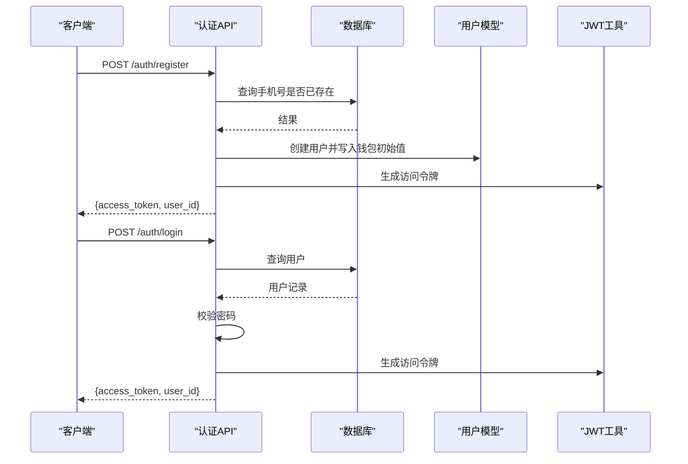
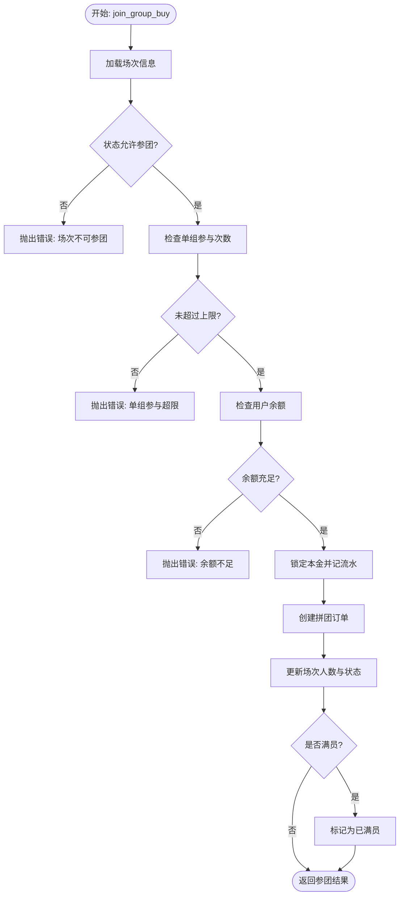
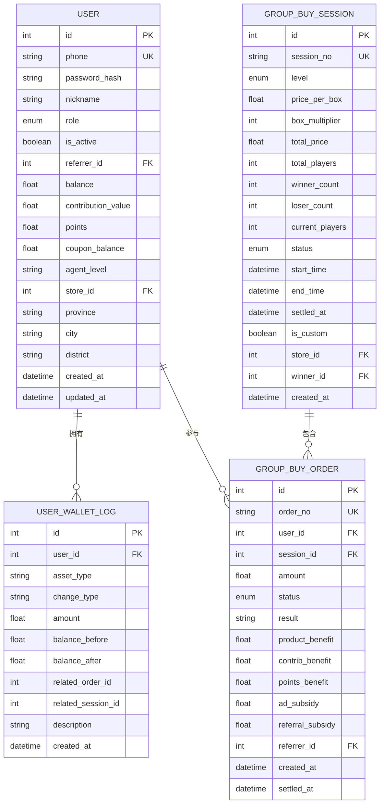
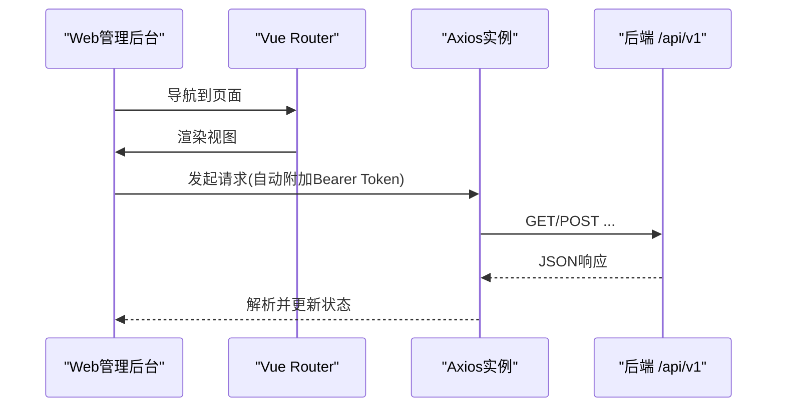
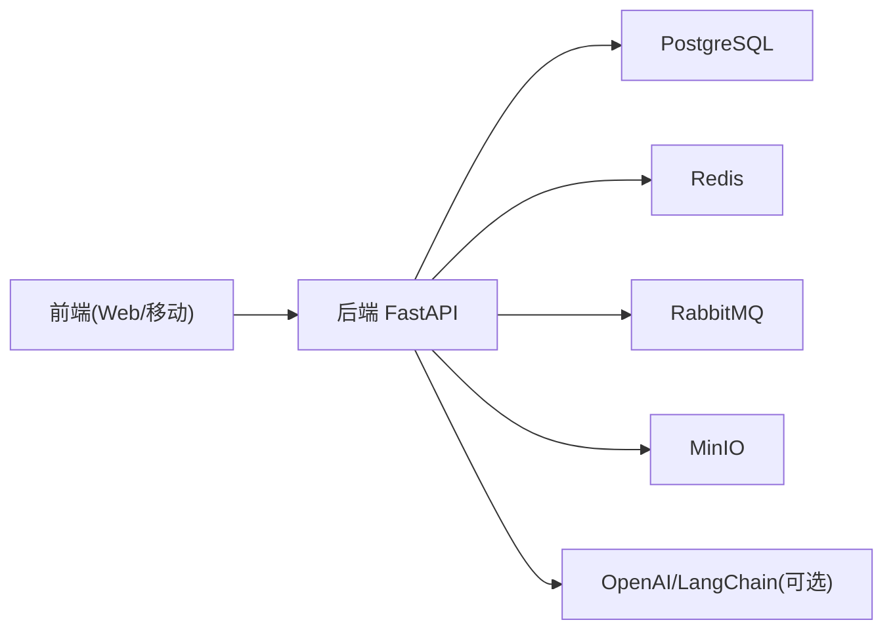

# 开发指南

<cite>
**本文引用的文件**   
- [backend/app/main.py](file://backend/app/main.py)
- [backend/app/config.py](file://backend/app/config.py)
- [backend/app/database.py](file://backend/app/database.py)
- [backend/requirements.txt](file://backend/requirements.txt)
- [docker-compose.yml](file://docker-compose.yml)
- [nginx.conf](file://nginx.conf)
- [frontend/web-admin/package.json](file://frontend/web-admin/package.json)
- [frontend/mobile-app/main.js](file://frontend/mobile-app/main.js)
- [frontend/web-admin/src/main.ts](file://frontend/web-admin/src/main.ts)
- [frontend/web-admin/src/router/index.ts](file://frontend/web-admin/src/router/index.ts)
- [frontend/web-admin/src/api/index.js](file://frontend/web-admin/src/api/index.js)
- [backend/app/models/__init__.py](file://backend/app/models/__init__.py)
- [backend/app/models/user.py](file://backend/app/models/user.py)
- [backend/app/models/group_buy.py](file://backend/app/models/group_buy.py)
- [backend/app/api/v1/auth.py](file://backend/app/api/v1/auth.py)
- [backend/app/services/group_buy_service.py](file://backend/app/services/group_buy_service.py)
- [backend/app/tasks/celery_app.py](file://backend/app/tasks/celery_app.py)
</cite>

## 目录
1. [简介](#简介)
2. [项目结构](#项目结构)
3. [核心组件](#核心组件)
4. [架构总览](#架构总览)
5. [详细组件分析](#详细组件分析)
6. [依赖关系分析](#依赖关系分析)
7. [性能与可扩展性](#性能与可扩展性)
8. [测试指南](#测试指南)
9. [调试与排错](#调试与排错)
10. [新功能开发与代码审查清单](#新功能开发与代码审查清单)
11. [结论](#结论)

## 简介
本指南面向AIxingmu项目的开发者，覆盖从环境搭建、依赖管理、数据库初始化到前后端开发规范、模块化设计、分层架构、依赖注入、测试策略、调试排错以及新功能开发流程与代码审查清单的全链路内容。目标是帮助团队在统一规范下高效协作，保障系统稳定性与可维护性。

## 项目结构
后端采用FastAPI + SQLAlchemy异步ORM + Celery任务调度；前端包含Web管理后台（Vue3 + Vite + TypeScript）与移动端（uni-app/Vue3）。基础设施通过Docker Compose编排PostgreSQL、Redis、RabbitMQ、MinIO与Nginx。

图表来源
- [backend/app/main.py:1-59](file://backend/app/main.py#L1-L59)
- [docker-compose.yml:1-111](file://docker-compose.yml#L1-L111)
- [nginx.conf](file://nginx.conf)

章节来源
- [backend/app/main.py:1-59](file://backend/app/main.py#L1-L59)
- [docker-compose.yml:1-111](file://docker-compose.yml#L1-L111)

## 核心组件
- 应用入口与生命周期：负责CORS、路由注册、健康检查与启动时建表（开发阶段）。
- 配置中心：集中管理数据库、缓存、消息队列、JWT、业务参数等。
- 数据库连接与会话：异步引擎、会话工厂、依赖注入获取会话。
- 认证API：注册/登录、密码哈希校验、JWT签发。
- 拼团服务：场次创建、参团、结算、权益发放与补贴计算。
- 任务调度：Celery应用与定时任务编排（开团、结算、分红、贡献值核算等）。
- 前端工程：Web管理后台与移动端入口、路由与API封装。

章节来源
- [backend/app/main.py:1-59](file://backend/app/main.py#L1-L59)
- [backend/app/config.py:1-136](file://backend/app/config.py#L1-L136)
- [backend/app/database.py:1-40](file://backend/app/database.py#L1-L40)
- [backend/app/api/v1/auth.py:1-43](file://backend/app/api/v1/auth.py#L1-L43)
- [backend/app/services/group_buy_service.py:1-348](file://backend/app/services/group_buy_service.py#L1-L348)
- [backend/app/tasks/celery_app.py:1-56](file://backend/app/tasks/celery_app.py#L1-L56)
- [frontend/web-admin/src/main.ts:1-13](file://frontend/web-admin/src/main.ts#L1-L13)
- [frontend/mobile-app/main.js:1-18](file://frontend/mobile-app/main.js#L1-L18)

## 架构总览
系统采用“网关-应用-数据”的分层架构，结合事件驱动的任务调度实现高内聚低耦合的业务处理。

图表来源
- [backend/app/main.py:1-59](file://backend/app/main.py#L1-L59)
- [backend/app/database.py:1-40](file://backend/app/database.py#L1-L40)
- [backend/app/tasks/celery_app.py:1-56](file://backend/app/tasks/celery_app.py#L1-L56)
- [docker-compose.yml:1-111](file://docker-compose.yml#L1-L111)

## 详细组件分析

### 后端应用入口与生命周期
- 使用lifespan进行启动/关闭资源管理，开发阶段自动建表，生产建议使用迁移工具。
- 注册CORS中间件与所有业务路由，提供健康检查接口。

图表来源
- [backend/app/main.py:1-59](file://backend/app/main.py#L1-L59)

章节来源
- [backend/app/main.py:1-59](file://backend/app/main.py#L1-L59)

### 配置与环境变量
- 集中式配置类，涵盖数据库、Redis、Celery、JWT、CORS、MinIO及大量业务常量（拼团规则、分润比例、贡献值与积分机制等）。
- 支持从.env加载，便于本地与容器化部署隔离。

章节来源
- [backend/app/config.py:1-136](file://backend/app/config.py#L1-L136)

### 数据库连接与会话管理
- 基于SQLAlchemy异步引擎与会话工厂，提供FastAPI依赖注入的get_db。
- 自动提交/回滚与异常安全，确保事务一致性。

章节来源
- [backend/app/database.py:1-40](file://backend/app/database.py#L1-L40)

### 认证模块（注册/登录）
- 手机号唯一性校验、密码哈希与验证、JWT签发。
- 返回访问令牌与用户ID，供后续鉴权使用。

图表来源
- [backend/app/api/v1/auth.py:1-43](file://backend/app/api/v1/auth.py#L1-L43)
- [backend/app/models/user.py:1-93](file://backend/app/models/user.py#L1-L93)

章节来源
- [backend/app/api/v1/auth.py:1-43](file://backend/app/api/v1/auth.py#L1-L43)
- [backend/app/models/user.py:1-93](file://backend/app/models/user.py#L1-L93)

### 拼团核心服务
- 每日固定场次与自定义场次创建。
- 参团校验（人数上限、单组参与次数、余额）、本金锁定、订单创建与场次状态推进。
- 满员后随机抽中1人，按规则发放商品权益、贡献值与积分；失败用户退回本金并发放广告与推荐人补贴。

图表来源
- [backend/app/services/group_buy_service.py:1-348](file://backend/app/services/group_buy_service.py#L1-L348)

章节来源
- [backend/app/services/group_buy_service.py:1-348](file://backend/app/services/group_buy_service.py#L1-L348)

### 任务调度（Celery）
- 定义Broker/Backend与时区、序列化策略。
- 定时任务：每日创建场次、每小时检查结算、过期场次清理、周度分红、日度贡献值核算、月度门店排名与分红。

章节来源
- [backend/app/tasks/celery_app.py:1-56](file://backend/app/tasks/celery_app.py#L1-L56)

### 数据模型概览
- 用户与钱包流水：角色、推荐关系、四大资产（余额/贡献值/积分/消费券）、代理与门店关联。
- 拼团模型：场次、订单、每日统计，含级别枚举、状态机与索引优化。

图表来源
- [backend/app/models/user.py:1-93](file://backend/app/models/user.py#L1-L93)
- [backend/app/models/group_buy.py:1-158](file://backend/app/models/group_buy.py#L1-L158)
- [backend/app/models/__init__.py:1-37](file://backend/app/models/__init__.py#L1-L37)

章节来源
- [backend/app/models/user.py:1-93](file://backend/app/models/user.py#L1-L93)
- [backend/app/models/group_buy.py:1-158](file://backend/app/models/group_buy.py#L1-L158)
- [backend/app/models/__init__.py:1-37](file://backend/app/models/__init__.py#L1-L37)

### 前端工程与API封装
- Web管理后台：Vue3 + Vite + TypeScript + Pinia + Element Plus，路由懒加载，统一API封装与Token拦截。
- 移动端：uni-app/Vue3双端兼容入口。

图表来源
- [frontend/web-admin/src/main.ts:1-13](file://frontend/web-admin/src/main.ts#L1-L13)
- [frontend/web-admin/src/router/index.ts:1-26](file://frontend/web-admin/src/router/index.ts#L1-L26)
- [frontend/web-admin/src/api/index.js:1-56](file://frontend/web-admin/src/api/index.js#L1-L56)

章节来源
- [frontend/web-admin/package.json:1-28](file://frontend/web-admin/package.json#L1-28)
- [frontend/web-admin/src/main.ts:1-13](file://frontend/web-admin/src/main.ts#L1-L13)
- [frontend/web-admin/src/router/index.ts:1-26](file://frontend/web-admin/src/router/index.ts#L1-L26)
- [frontend/web-admin/src/api/index.js:1-56](file://frontend/web-admin/src/api/index.js#L1-56)
- [frontend/mobile-app/main.js:1-18](file://frontend/mobile-app/main.js#L1-18)

## 依赖关系分析
- 后端依赖：FastAPI、SQLAlchemy(async)、asyncpg、Alembic、Pydantic v2、Celery、RabbitMQ、Redis、MinIO、LangChain/OpenAI等。
- 前端依赖：Vue3生态、Element Plus、ECharts、Vite构建工具链。

图表来源
- [backend/requirements.txt:1-34](file://backend/requirements.txt#L1-34)
- [frontend/web-admin/package.json:1-28](file://frontend/web-admin/package.json#L1-28)

章节来源
- [backend/requirements.txt:1-34](file://backend/requirements.txt#L1-34)
- [frontend/web-admin/package.json:1-28](file://frontend/web-admin/package.json#L1-28)

## 性能与可扩展性
- 数据库连接池：根据负载调整pool_size与max_overflow，避免连接耗尽。
- 异步I/O：API与ORM均异步，提升吞吐。
- 任务解耦：将耗时操作（结算、分红、统计）放入Celery Worker，避免阻塞请求。
- 缓存与限流：利用Redis做热点数据缓存、分布式锁与频率限制。
- 水平扩展：多Worker并行消费任务；Nginx负载均衡多个后端实例。
- 存储扩展：MinIO支持横向扩容与多副本。

[本节为通用建议，无需特定文件引用]

## 测试指南
- 单元测试
  - 后端：对Service层方法（如参团、结算）进行断言，模拟数据库会话与外部依赖。
  - 前端：对API封装函数与状态管理进行Mock测试。
- 集成测试
  - 使用Testcontainers或本地Compose拉起PostgreSQL/Redis/RabbitMQ，端到端调用关键路径（注册/登录/参团/结算）。
- 端到端测试
  - 使用Playwright/Cypress对Web管理后台关键流程进行UI自动化验证。
- 覆盖率与质量门禁
  - 设定最低覆盖率阈值，CI中运行测试与静态检查。

[本节为通用建议，无需特定文件引用]

## 调试与排错
- 日志分析
  - 开启SQLAlchemy echo以输出SQL语句（DEBUG模式下），定位慢查询与异常事务。
  - 查看Celery Worker日志，排查任务失败与重试。
- 性能分析
  - 使用cProfile/py-spy对热点函数进行分析；结合数据库EXPLAIN分析慢查询。
- 内存泄漏检测
  - 关注长驻进程（Worker/Beat）的内存增长，定期重启或设置最大任务数回收。
- 常见问题
  - 连接池耗尽：增大pool_size或减少并发；检查未正确关闭会话。
  - JWT无效：确认SECRET_KEY与算法一致，浏览器缓存旧token导致冲突需刷新。
  - 跨域问题：核对CORS_ORIGINS与实际域名。

章节来源
- [backend/app/database.py:1-40](file://backend/app/database.py#L1-L40)
- [backend/app/config.py:1-136](file://backend/app/config.py#L1-L136)
- [backend/app/tasks/celery_app.py:1-56](file://backend/app/tasks/celery_app.py#L1-L56)

## 新功能开发与代码审查清单
- 开发流程
  - 需求评审 → 技术方案设计 → 分支开发 → 自测与单测 → PR提交 → 代码审查 → 合并与发布。
- 代码规范
  - Python：遵循PEP8，类型注解，模块化拆分，避免全局可变状态。
  - Vue3：组合式API，组件职责单一，路由懒加载，API集中管理。
  - Git：语义化提交信息，分支命名约定（feature/fix/hotfix），小步提交。
- 依赖注入与分层
  - 使用FastAPI Depends注入数据库会话与服务；保持API→Service→Repository清晰分层。
- 安全性
  - 敏感配置走环境变量，禁止硬编码；密码哈希与最小权限原则。
- 可观测性
  - 关键路径埋点与结构化日志；指标上报与告警。
- 发布与回滚
  - 灰度发布、蓝绿部署；数据库变更使用迁移脚本，具备回滚能力。

[本节为通用建议，无需特定文件引用]

## 结论
本指南提供了AIxingmu项目的整体架构、核心组件与开发实践说明。通过统一的规范与清晰的模块化设计，配合完善的测试与排错手段，可有效提升交付质量与团队协作效率。建议在持续迭代中完善监控与度量体系，逐步引入更严格的自动化质量门禁。