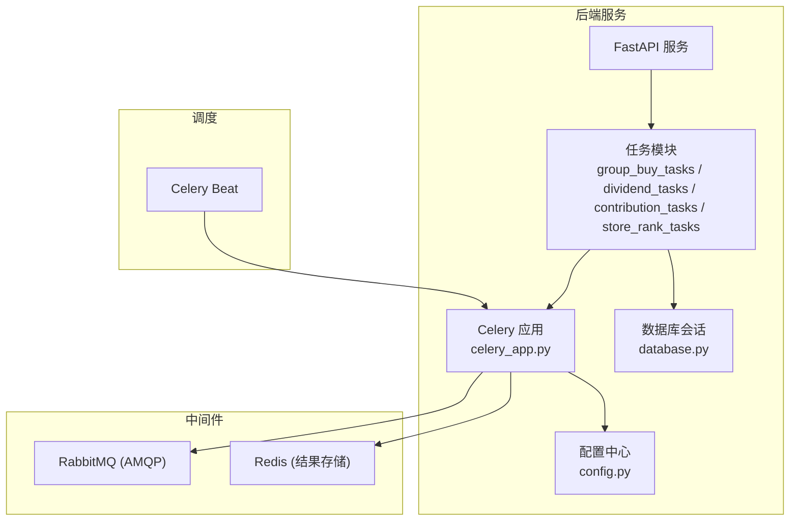
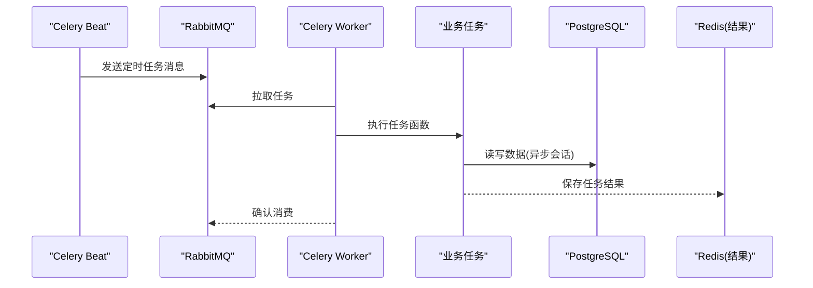
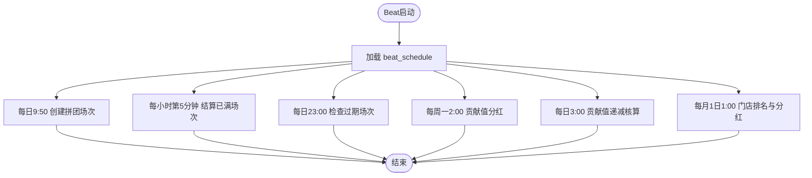
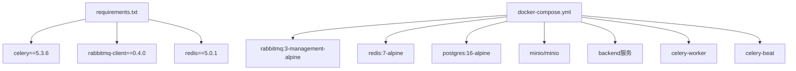

# Celery架构配置

<cite>
**本文引用的文件**   
- [backend/app/tasks/celery_app.py](file://backend/app/tasks/celery_app.py)
- [backend/app/config.py](file://backend/app/config.py)
- [backend/requirements.txt](file://backend/requirements.txt)
- [docker-compose.yml](file://docker-compose.yml)
- [backend/Dockerfile](file://backend/Dockerfile)
- [backend/app/tasks/group_buy_tasks.py](file://backend/app/tasks/group_buy_tasks.py)
- [backend/app/tasks/dividend_tasks.py](file://backend/app/tasks/dividend_tasks.py)
- [backend/app/tasks/contribution_tasks.py](file://backend/app/tasks/contribution_tasks.py)
- [backend/app/tasks/store_rank_tasks.py](file://backend/app/tasks/store_rank_tasks.py)
- [backend/app/database.py](file://backend/app/database.py)
</cite>

## 目录
1. [简介](#简介)
2. [项目结构](#项目结构)
3. [核心组件](#核心组件)
4. [架构总览](#架构总览)
5. [详细组件分析](#详细组件分析)
6. [依赖关系分析](#依赖关系分析)
7. [性能与并发调优](#性能与并发调优)
8. [监控与可观测性](#监控与可观测性)
9. [高可用与生产最佳实践](#高可用与生产最佳实践)
10. [故障排查指南](#故障排查指南)
11. [结论](#结论)

## 简介
本文件面向AIxingmu项目的Celery异步任务与定时调度体系，系统性解析以下方面：
- Celery应用初始化与核心参数（Broker、Backend、序列化、时区等）
- Beat定时调度器配置与crontab策略
- Worker部署与并发控制、重试机制、错误处理策略
- 生产环境高可用架构设计与性能调优建议
- 监控集成方案与常见问题排查

## 项目结构
本项目采用分层组织方式，Celery相关代码集中在后端模块的tasks子包中，并通过统一的配置中心加载外部化配置。关键路径如下：
- Celery应用定义与Beat调度：backend/app/tasks/celery_app.py
- 业务任务实现：backend/app/tasks/*.py
- 全局配置（含Celery连接信息）：backend/app/config.py
- 容器编排与服务依赖：docker-compose.yml
- Python依赖声明（包含celery、rabbitmq-client、redis等）：backend/requirements.txt
- 数据库会话管理（任务内使用）：backend/app/database.py

图表来源
- [backend/app/tasks/celery_app.py:1-56](file://backend/app/tasks/celery_app.py#L1-L56)
- [backend/app/config.py:24-26](file://backend/app/config.py#L24-L26)
- [docker-compose.yml:72-95](file://docker-compose.yml#L72-L95)

章节来源
- [backend/app/tasks/celery_app.py:1-56](file://backend/app/tasks/celery_app.py#L1-L56)
- [backend/app/config.py:1-136](file://backend/app/config.py#L1-136)
- [docker-compose.yml:1-111](file://docker-compose.yml#L1-111)

## 核心组件
- Celery应用实例与全局配置
  - 应用名、Broker URL、结果后端URL、时区、UTC开关、序列化格式等均在应用初始化阶段设置。
- 定时任务调度（Beat）
  - 通过beat_schedule集中声明多个周期性任务，包括每日创建拼团场次、每小时结算已满场次、检查过期场次、每周贡献值分红、每日贡献值递减核算、每月门店排名与分红。
- 任务实现
  - 各业务任务以@task装饰器注册到Celery应用，并在同步任务中运行异步逻辑，结合数据库会话完成持久化操作。
- 配置中心
  - 使用基于Pydantic Settings的外部化配置，提供Celery连接参数与环境变量覆盖能力。
- 容器编排
  - docker-compose定义了PostgreSQL、Redis、RabbitMQ、MinIO、后端API、Celery Worker与Beat等服务及环境变量注入。

章节来源
- [backend/app/tasks/celery_app.py:9-21](file://backend/app/tasks/celery_app.py#L9-L21)
- [backend/app/tasks/celery_app.py:24-55](file://backend/app/tasks/celery_app.py#L24-L55)
- [backend/app/config.py:24-26](file://backend/app/config.py#L24-L26)
- [docker-compose.yml:52-95](file://docker-compose.yml#L52-L95)

## 架构总览
下图展示了Celery在系统中的角色与各组件交互关系：Worker消费来自RabbitMQ的任务消息，执行后写入Redis作为结果；Beat按crontab周期触发任务；任务内部通过数据库会话访问PostgreSQL。

图表来源
- [docker-compose.yml:72-95](file://docker-compose.yml#L72-L95)
- [backend/app/tasks/celery_app.py:24-55](file://backend/app/tasks/celery_app.py#L24-L55)
- [backend/app/database.py:10-21](file://backend/app/database.py#L10-L21)

## 详细组件分析

### Celery应用初始化与核心参数
- 应用名称与实例化
  - 应用名为“aixingmu”，并直接读取配置中的Broker与结果后端URL。
- 全局配置项
  - 时区设置为Asia/Shanghai，启用UTC时间基准，统一使用JSON序列化与反序列化。
- 配置来源
  - 所有连接参数由Settings类提供，支持.env或环境变量覆盖。

章节来源
- [backend/app/tasks/celery_app.py:9-21](file://backend/app/tasks/celery_app.py#L9-L21)
- [backend/app/config.py:24-26](file://backend/app/config.py#L24-L26)

### 定时任务调度器（Beat）与crontab策略
- 任务清单与调度频率
  - 每日9:50创建当日拼团场次
  - 每小时第5分钟检查并结算已满场次（10:00-22:00的业务窗口由业务逻辑控制）
  - 每日23:00检查过期场次
  - 每周一凌晨2:00执行贡献值分红
  - 每日凌晨3:00执行贡献值递减兑换核算（仅累计，周一发放）
  - 每月1日凌晨1:00执行门店月度排名与分红
- crontab表达式说明
  - hour/minute/day_of_week/day_of_month组合表达不同周期策略，便于扩展与维护。

图表来源
- [backend/app/tasks/celery_app.py:24-55](file://backend/app/tasks/celery_app.py#L24-L55)

章节来源
- [backend/app/tasks/celery_app.py:24-55](file://backend/app/tasks/celery_app.py#L24-L55)

### 任务队列与负载均衡
- 当前实现未显式指定队列路由与多队列策略，默认使用默认队列。
- 如需按业务域拆分队列（如group_buy、dividend、contribution、store_rank），可在任务装饰器中指定queue参数，并结合Worker的-q选项进行监听。
- 负载均衡建议
  - 将CPU密集型与I/O密集型任务分离至不同队列，配合不同数量的Worker进程提升吞吐。
  - 针对高峰期任务（如结算、分红）使用独立队列与更高并发度。

章节来源
- [backend/app/tasks/group_buy_tasks.py:17-53](file://backend/app/tasks/group_buy_tasks.py#L17-53)
- [backend/app/tasks/dividend_tasks.py:15-25](file://backend/app/tasks/dividend_tasks.py#L15-25)
- [backend/app/tasks/contribution_tasks.py:15-28](file://backend/app/tasks/contribution_tasks.py#L15-28)
- [backend/app/tasks/store_rank_tasks.py:15-28](file://backend/app/tasks/store_rank_tasks.py#L15-28)

### 并发控制与Worker部署
- 容器编排
  - docker-compose中定义了celery-worker与celery-beat两个服务，分别负责任务执行与定时调度。
- 并发参数
  - 当前未显式设置worker并发数、线程池大小等参数，可使用命令行参数或配置文件进行调优。
- 部署建议
  - 为不同业务域启动多个Worker实例，按队列划分负载。
  - 根据CPU核数与任务类型调整concurrency与prefetch_multiplier。

章节来源
- [docker-compose.yml:72-95](file://docker-compose.yml#L72-L95)

### 重试机制与错误处理策略
- 当前任务实现未显式配置retry_on_exception、max_retries、default_retry_delay等参数。
- 建议策略
  - 对网络调用、外部API失败场景增加指数退避重试。
  - 对幂等性要求高的任务（如结算、分红）结合去重键与状态机避免重复执行。
  - 记录失败日志与告警，结合监控平台进行异常追踪。

章节来源
- [backend/app/tasks/group_buy_tasks.py:17-53](file://backend/app/tasks/group_buy_tasks.py#L17-53)
- [backend/app/tasks/dividend_tasks.py:15-25](file://backend/app/tasks/dividend_tasks.py#L15-25)
- [backend/app/tasks/contribution_tasks.py:15-28](file://backend/app/tasks/contribution_tasks.py#L15-28)
- [backend/app/tasks/store_rank_tasks.py:15-28](file://backend/app/tasks/store_rank_tasks.py#L15-28)

### 任务与数据库交互
- 任务内通过async_session_factory获取异步数据库会话，执行完成后提交事务并关闭会话。
- 注意
  - 在同步Celery任务中运行异步代码需确保事件循环正确创建与销毁。
  - 长事务与大批量更新应分片处理，避免阻塞Worker。

章节来源
- [backend/app/tasks/group_buy_tasks.py:20-27](file://backend/app/tasks/group_buy_tasks.py#L20-27)
- [backend/app/tasks/dividend_tasks.py:18-25](file://backend/app/tasks/dividend_tasks.py#L18-25)
- [backend/app/tasks/contribution_tasks.py:18-28](file://backend/app/tasks/contribution_tasks.py#L18-28)
- [backend/app/tasks/store_rank_tasks.py:18-28](file://backend/app/tasks/store_rank_tasks.py#L18-28)
- [backend/app/database.py:10-21](file://backend/app/database.py#L10-L21)

## 依赖关系分析
- Python依赖
  - celery、rabbitmq-client、redis等版本在requirements.txt中声明，确保环境一致性。
- 容器依赖
  - backend、celery-worker、celery-beat均依赖RabbitMQ与Redis；backend还依赖PostgreSQL与MinIO。
- 运行时依赖图

图表来源
- [backend/requirements.txt:15-21](file://backend/requirements.txt#L15-L21)
- [docker-compose.yml:29-50](file://docker-compose.yml#L29-L50)
- [docker-compose.yml:52-95](file://docker-compose.yml#L52-L95)

章节来源
- [backend/requirements.txt:1-34](file://backend/requirements.txt#L1-34)
- [docker-compose.yml:1-111](file://docker-compose.yml#L1-111)

## 性能与并发调优
- 并发模型选择
  - I/O密集型任务建议使用gevent或eventlet预分支，减少上下文切换开销。
  - CPU密集型任务建议使用多进程模式，合理设置concurrency。
- 关键参数建议
  - concurrency：根据CPU核数与任务类型调整，通常从核数×2起步。
  - prefetch_multiplier：控制预取数量，避免内存占用过高。
  - task_acks_late：在高可靠场景开启，确保任务失败能重新入队。
  - worker_max_tasks_per_child：定期重启Worker，防止内存泄漏。
- 队列隔离
  - 将高频与耗时任务拆分到不同队列，分别启动不同规模的Worker。
- 数据库连接池
  - 根据并发规模调整DATABASE_POOL_SIZE与DATABASE_MAX_OVERFLOW，避免连接耗尽。

章节来源
- [backend/app/config.py:17-19](file://backend/app/config.py#L17-L19)
- [docker-compose.yml:72-95](file://docker-compose.yml#L72-L95)

## 监控与可观测性
- 日志与指标
  - 使用结构化日志输出任务执行轨迹，结合Prometheus抓取指标（如任务成功率、延迟、队列长度）。
- 可视化
  - 使用RabbitMQ Management界面观察队列深度与消费者状态。
  - 使用Redis CLI或监控工具查看结果存储与缓存命中率。
- 告警
  - 对任务失败率、队列积压、Worker宕机等设置阈值告警。

[本节为通用指导，不直接分析具体文件]

## 高可用与生产最佳实践
- 中间件高可用
  - RabbitMQ集群与镜像队列，避免单点故障。
  - Redis主从或哨兵模式，保障结果存储可用性。
- 多实例部署
  - 多Worker与多Beat实例，结合健康检查与自动重启。
- 安全加固
  - 使用强密码与VPC内网通信，限制端口暴露。
  - 敏感配置通过环境变量或密钥管理服务注入。
- 容量规划
  - 根据峰值QPS与任务耗时评估Worker数量与资源配额。
- 灰度与回滚
  - 新版本先小流量验证，逐步放量；保留旧版本快速回滚能力。

[本节为通用指导，不直接分析具体文件]

## 故障排查指南
- 常见连接问题
  - 检查CELERY_BROKER_URL与CELERY_RESULT_BACKEND是否正确指向RabbitMQ与Redis。
  - 确认容器间网络连通性与端口映射。
- 任务未执行
  - 检查Worker是否启动且监听到对应队列。
  - 查看Beat日志确认定时任务是否按时触发。
- 任务失败与重试
  - 检查任务内部异常堆栈与数据库事务状态。
  - 为易失败操作添加重试与降级策略。
- 性能瓶颈
  - 监控队列长度与Worker利用率，必要时扩容或拆分队列。
  - 优化数据库查询与批量操作，减少锁竞争。

章节来源
- [docker-compose.yml:52-95](file://docker-compose.yml#L52-L95)
- [backend/app/tasks/celery_app.py:9-21](file://backend/app/tasks/celery_app.py#L9-L21)

## 结论
本项目的Celery架构以简洁清晰的配置为核心，结合容器化编排实现了稳定的异步任务与定时调度能力。在生产环境中，建议进一步引入队列隔离、重试与错误处理策略、性能调优与监控告警，以提升系统的可靠性与可扩展性。