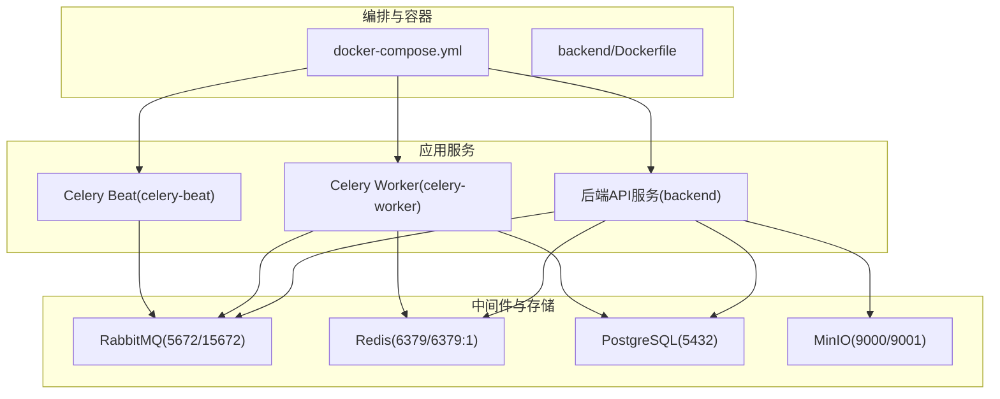
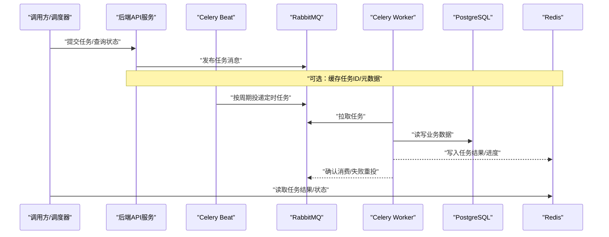
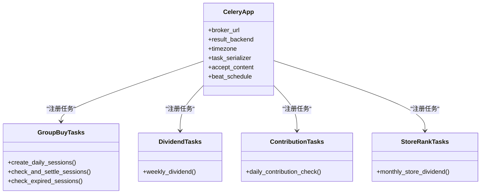
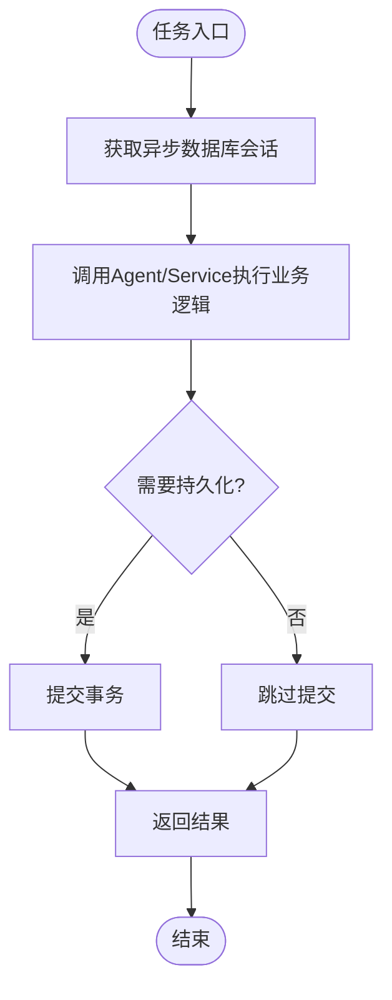
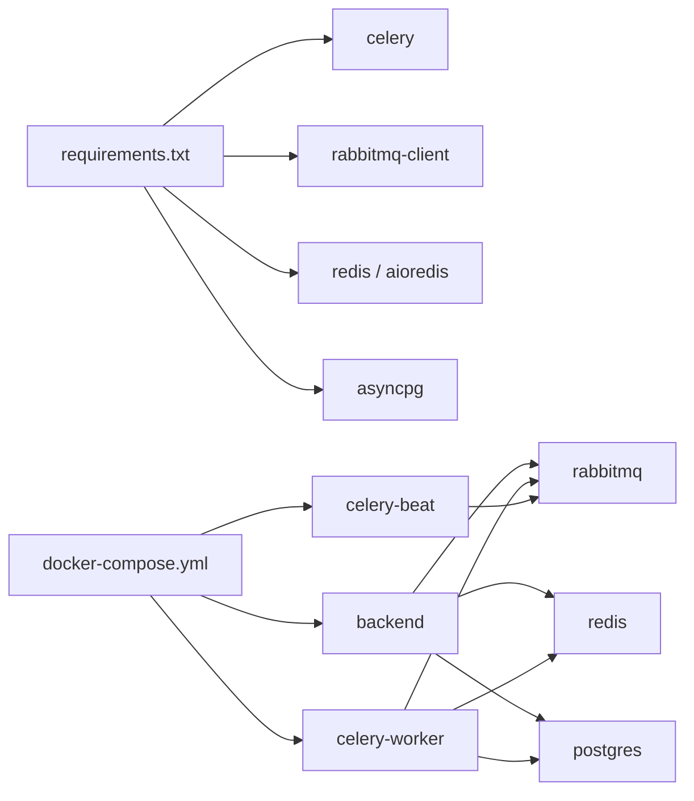

# 任务监控与运维

<cite>
**本文引用的文件**
- [backend/app/tasks/celery_app.py](file://backend/app/tasks/celery_app.py)
- [backend/app/config.py](file://backend/app/config.py)
- [docker-compose.yml](file://docker-compose.yml)
- [backend/Dockerfile](file://backend/Dockerfile)
- [backend/requirements.txt](file://backend/requirements.txt)
- [backend/app/database.py](file://backend/app/database.py)
- [backend/app/tasks/group_buy_tasks.py](file://backend/app/tasks/group_buy_tasks.py)
- [backend/app/tasks/dividend_tasks.py](file://backend/app/tasks/dividend_tasks.py)
- [backend/app/tasks/contribution_tasks.py](file://backend/app/tasks/contribution_tasks.py)
- [backend/app/tasks/store_rank_tasks.py](file://backend/app/tasks/store_rank_tasks.py)
</cite>

## 目录
1. [简介](#简介)
2. [项目结构](#项目结构)
3. [核心组件](#核心组件)
4. [架构总览](#架构总览)
5. [详细组件分析](#详细组件分析)
6. [依赖关系分析](#依赖关系分析)
7. [性能考虑](#性能考虑)
8. [故障排查指南](#故障排查指南)
9. [结论](#结论)
10. [附录](#附录)

## 简介
本运维文档面向AIxingmu平台的Celery异步任务系统，聚焦生产级监控与可观测性建设。内容覆盖：
- 任务执行状态跟踪、执行时长统计、成功率等关键指标
- 失败重试机制、死信队列处理与告警通知配置
- 结构化日志收集、分析与归档策略及轮转配置
- 队列健康检查、性能瓶颈识别与容量规划
- Docker环境下的监控集成、Prometheus指标暴露与Grafana可视化面板
- 生产环境故障排查流程与应急预案

## 项目结构
后端采用FastAPI + Celery + RabbitMQ + Redis的异步任务架构。定时任务通过Celery Beat调度，Worker消费RabbitMQ中的任务消息，结果写入Redis。数据库使用PostgreSQL，对象存储使用MinIO。

图示来源
- [docker-compose.yml:1-111](file://docker-compose.yml#L1-L111)
- [backend/Dockerfile:1-13](file://backend/Dockerfile#L1-L13)

章节来源
- [docker-compose.yml:1-111](file://docker-compose.yml#L1-L111)
- [backend/Dockerfile:1-13](file://backend/Dockerfile#L1-L13)

## 核心组件
- Celery应用与调度
  - 应用初始化、序列化与时区设置
  - 定时任务调度表（Beat）
- 业务任务模块
  - 拼团相关任务：创建场次、结算、过期检查
  - 分红任务：每周贡献值分红
  - 贡献值核算：每日递减核算与周一结算
  - 门店排名与分红：月度任务
- 配置与环境
  - 全局配置类（含Celery Broker/Backend URL）
  - Docker Compose中各服务的连接参数
- 数据访问
  - 异步数据库引擎与会话工厂

章节来源
- [backend/app/tasks/celery_app.py:1-56](file://backend/app/tasks/celery_app.py#L1-L56)
- [backend/app/tasks/group_buy_tasks.py:1-54](file://backend/app/tasks/group_buy_tasks.py#L1-L54)
- [backend/app/tasks/dividend_tasks.py:1-26](file://backend/app/tasks/dividend_tasks.py#L1-L26)
- [backend/app/tasks/contribution_tasks.py:1-29](file://backend/app/tasks/contribution_tasks.py#L1-L29)
- [backend/app/tasks/store_rank_tasks.py:1-29](file://backend/app/tasks/store_rank_tasks.py#L1-L29)
- [backend/app/config.py:1-136](file://backend/app/config.py#L1-L136)
- [backend/app/database.py:1-40](file://backend/app/database.py#L1-L40)

## 架构总览
下图展示了从API触发或Beat调度到Worker执行的端到端流程，以及结果回写与外部依赖交互。

图示来源
- [backend/app/tasks/celery_app.py:1-56](file://backend/app/tasks/celery_app.py#L1-L56)
- [docker-compose.yml:52-96](file://docker-compose.yml#L52-L96)
- [backend/app/database.py:1-40](file://backend/app/database.py#L1-L40)

## 详细组件分析

### Celery应用与调度
- 应用初始化
  - 指定应用名、Broker与Result Backend
  - 统一时区与JSON序列化
- 定时任务调度
  - 定义多个周期性任务（如每日创建场次、每小时结算、每周分红、每月门店分红等）

图示来源
- [backend/app/tasks/celery_app.py:1-56](file://backend/app/tasks/celery_app.py#L1-L56)
- [backend/app/tasks/group_buy_tasks.py:1-54](file://backend/app/tasks/group_buy_tasks.py#L1-L54)
- [backend/app/tasks/dividend_tasks.py:1-26](file://backend/app/tasks/dividend_tasks.py#L1-L26)
- [backend/app/tasks/contribution_tasks.py:1-29](file://backend/app/tasks/contribution_tasks.py#L1-L29)
- [backend/app/tasks/store_rank_tasks.py:1-29](file://backend/app/tasks/store_rank_tasks.py#L1-L29)

章节来源
- [backend/app/tasks/celery_app.py:1-56](file://backend/app/tasks/celery_app.py#L1-L56)

### 任务实现与数据流
- 通用模式
  - 在同步Celery任务中启动事件循环执行异步逻辑
  - 使用异步会话工厂获取数据库会话并执行Agent/Service
  - 提交事务后返回结果
- 典型任务
  - 拼团任务：创建当日场次、检查并结算已满场次、检查过期场次
  - 分红任务：每周贡献值分红
  - 贡献值任务：每日累计，周一结算
  - 门店任务：月度排名与阶梯分红

图示来源
- [backend/app/tasks/group_buy_tasks.py:17-27](file://backend/app/tasks/group_buy_tasks.py#L17-L27)
- [backend/app/tasks/group_buy_tasks.py:30-40](file://backend/app/tasks/group_buy_tasks.py#L30-L40)
- [backend/app/tasks/group_buy_tasks.py:43-53](file://backend/app/tasks/group_buy_tasks.py#L43-L53)
- [backend/app/tasks/dividend_tasks.py:15-25](file://backend/app/tasks/dividend_tasks.py#L15-L25)
- [backend/app/tasks/contribution_tasks.py:15-28](file://backend/app/tasks/contribution_tasks.py#L15-L28)
- [backend/app/tasks/store_rank_tasks.py:15-28](file://backend/app/tasks/store_rank_tasks.py#L15-L28)
- [backend/app/database.py:17-21](file://backend/app/database.py#L17-L21)

章节来源
- [backend/app/tasks/group_buy_tasks.py:1-54](file://backend/app/tasks/group_buy_tasks.py#L1-54)
- [backend/app/tasks/dividend_tasks.py:1-26](file://backend/app/tasks/dividend_tasks.py#L1-26)
- [backend/app/tasks/contribution_tasks.py:1-29](file://backend/app/tasks/contribution_tasks.py#L1-29)
- [backend/app/tasks/store_rank_tasks.py:1-29](file://backend/app/tasks/store_rank_tasks.py#L1-29)
- [backend/app/database.py:1-40](file://backend/app/database.py#L1-40)

### 配置与环境
- 全局配置
  - 包含数据库、Redis、Celery Broker/Backend、CORS、MinIO等
- Docker Compose
  - 为后端、Worker、Beat分别注入环境变量，确保连接至容器内服务
  - 定义健康检查与依赖顺序

章节来源
- [backend/app/config.py:1-136](file://backend/app/config.py#L1-136)
- [docker-compose.yml:52-96](file://docker-compose.yml#L52-L96)

## 依赖关系分析
- 运行时依赖
  - Celery、RabbitMQ客户端、Redis、异步数据库驱动等
- 容器编排依赖
  - backend依赖postgres、redis、rabbitmq
  - celery-worker依赖backend、rabbitmq、redis
  - celery-beat依赖backend、rabbitmq

图示来源
- [backend/requirements.txt:1-34](file://backend/requirements.txt#L1-34)
- [docker-compose.yml:1-111](file://docker-compose.yml#L1-L111)

章节来源
- [backend/requirements.txt:1-34](file://backend/requirements.txt#L1-34)
- [docker-compose.yml:1-111](file://docker-compose.yml#L1-L111)

## 性能考虑
- 并发与资源
  - 根据CPU核数与I/O特征调整Worker并发度；对CPU密集型任务减少并发，对I/O密集型适当提升
  - 合理设置数据库连接池大小与最大溢出，避免连接耗尽
- 队列与背压
  - 观察RabbitMQ队列长度与消费者积压情况，必要时扩容Worker实例
  - 针对长耗时任务拆分或引入优先级队列
- 结果存储
  - Redis作为结果后端需关注内存占用与淘汰策略，避免结果堆积
- 批处理与幂等
  - 对批量任务采用分页/分片处理，保证幂等与可恢复性
- 超时与限流
  - 为关键任务设置合理的软/硬超时，防止长时间阻塞
  - 对外部依赖（如AI接口、对象存储）增加重试与退避策略

[本节为通用指导，不直接分析具体文件]

## 故障排查指南
- 常见问题定位
  - 任务未执行：检查Beat是否运行、RabbitMQ连接是否正常、任务名是否正确注册
  - 任务失败：查看Worker日志、异常堆栈、数据库事务是否提交成功
  - 结果不可用：确认Redis连通性与键空间是否被清理
- 快速诊断命令
  - 查看Worker状态与队列信息
  - 检查RabbitMQ管理界面（端口映射已开放）
  - 验证Redis键是否存在且未被淘汰
- 日志与可观测性
  - 当前代码使用Python标准logging输出，建议结合Docker日志聚合（如ELK/Loki）进行集中采集
  - 为关键路径补充结构化字段（任务名、任务ID、耗时、状态码等），便于检索与分析
- 告警与通知
  - 基于队列积压、失败率、执行时长阈值建立告警规则
  - 将告警接入企业微信/钉钉/邮件等渠道

[本节为通用指导，不直接分析具体文件]

## 结论
当前系统已具备基础的异步任务能力与定时调度，但在生产级监控方面仍需完善：
- 补充任务指标采集（状态、耗时、成功率、重试次数）
- 引入死信队列与标准化重试策略
- 构建Prometheus+Grafana的可观测体系
- 完善日志规范化与归档策略
- 制定完善的排障流程与应急预案

[本节为总结性内容，不直接分析具体文件]

## 附录

### 监控指标清单（建议）
- 任务维度
  - 任务总数、成功数、失败数、重试次数、平均耗时、P95/P99耗时、成功率
- 队列维度
  - 入队速率、出队速率、队列长度、消费者数量、延迟时间
- 资源维度
  - Worker CPU/内存、数据库连接池使用率、Redis内存使用率、RabbitMQ磁盘/内存

[本节为通用指导，不直接分析具体文件]

### Prometheus指标暴露方案（建议）
- 在Worker侧引入指标库，暴露HTTP端点供Prometheus抓取
- 指标分类
  - 计数器：任务成功/失败计数、重试计数
  - 直方图：任务耗时分布
  - 仪表盘：队列长度、消费者数量
- 标签设计
  - task_name、status、worker_id、queue、retry_count

[本节为通用指导，不直接分析具体文件]

### Grafana可视化面板（建议）
- 概览面板
  - 任务成功率趋势、失败TopN任务、队列积压趋势
- 任务详情面板
  - 单任务耗时分布、重试次数分布、最近失败记录
- 资源面板
  - Worker资源使用、数据库连接池、Redis内存、RabbitMQ队列深度

[本节为通用指导，不直接分析具体文件]

### 日志规范与归档（建议）
- 结构化格式
  - 包含：timestamp、level、logger、task_id、task_name、duration_ms、status、error_message
- 日志轮转
  - 按天/大小切分，保留周期与压缩策略
- 集中采集
  - 通过Filebeat/Fluent Bit采集容器stdout/stderr，推送至ES/Loki

[本节为通用指导，不直接分析具体文件]

### 重试与死信队列（建议）
- 重试策略
  - 指数退避、最大重试次数、区分可重试/不可重试异常
- 死信队列
  - 超过重试上限的任务转入死信队列，提供人工干预与补偿流程
- 告警联动
  - 死信队列增长、连续失败触发告警

[本节为通用指导，不直接分析具体文件]

### 健康检查与容量规划（建议）
- 健康检查
  - 定期探测RabbitMQ、Redis、PostgreSQL连通性
  - 自定义/端点返回Celery集群状态与队列健康
- 容量规划
  - 依据峰值QPS与任务SLA估算Worker数量与资源配额
  - 预留弹性扩容能力以应对突发流量

[本节为通用指导，不直接分析具体文件]