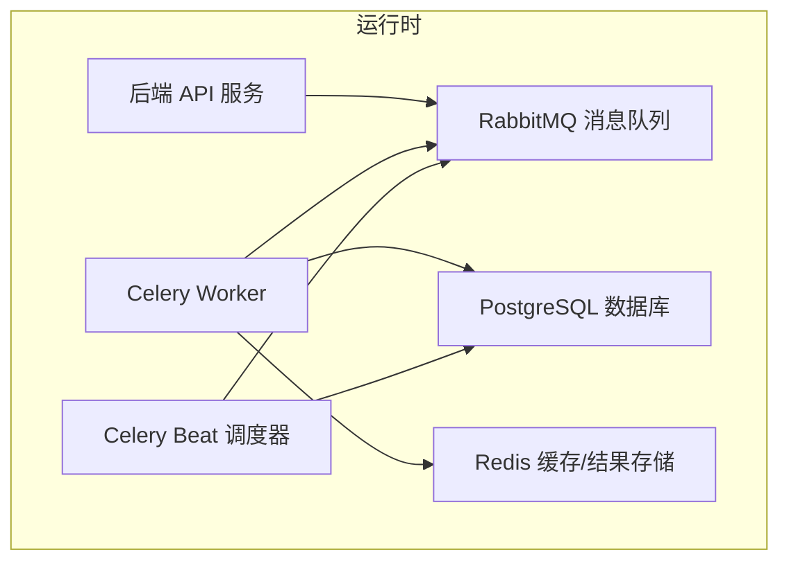
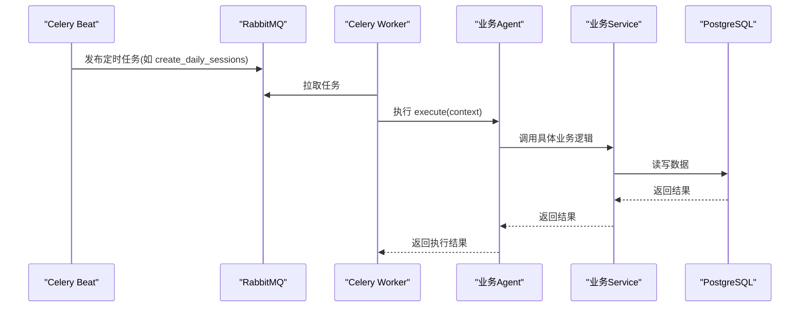
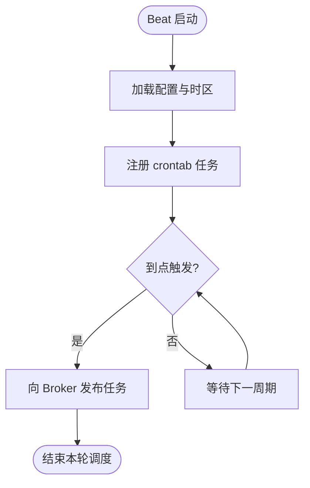
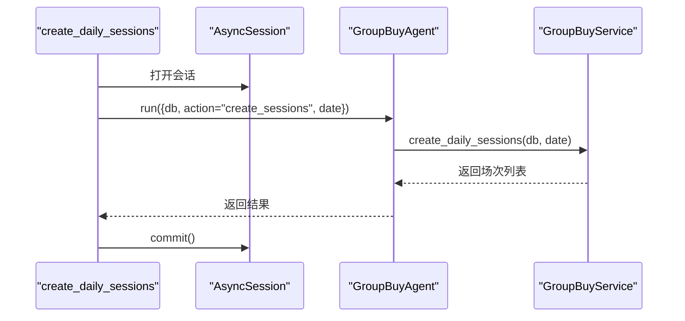
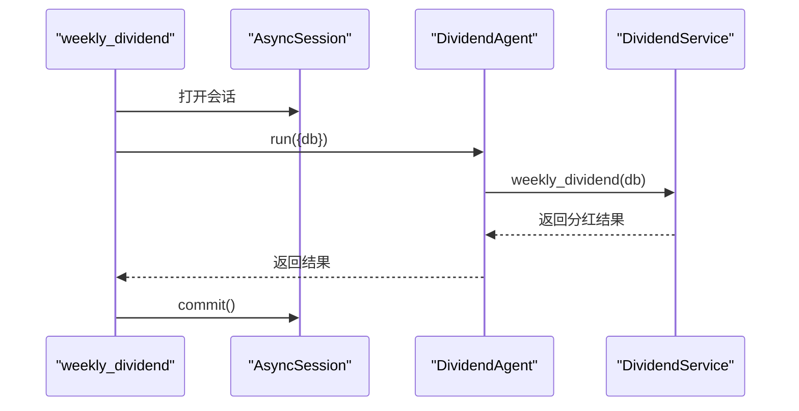
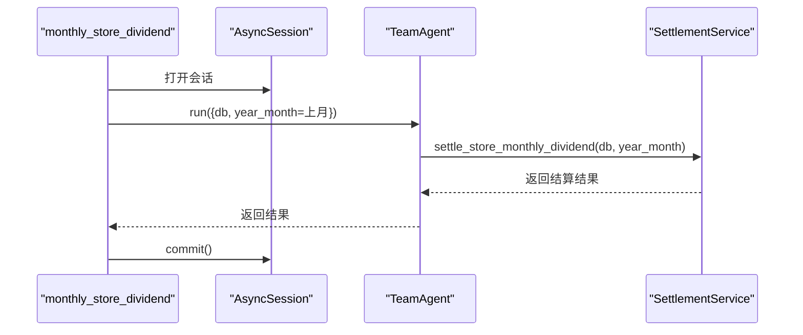
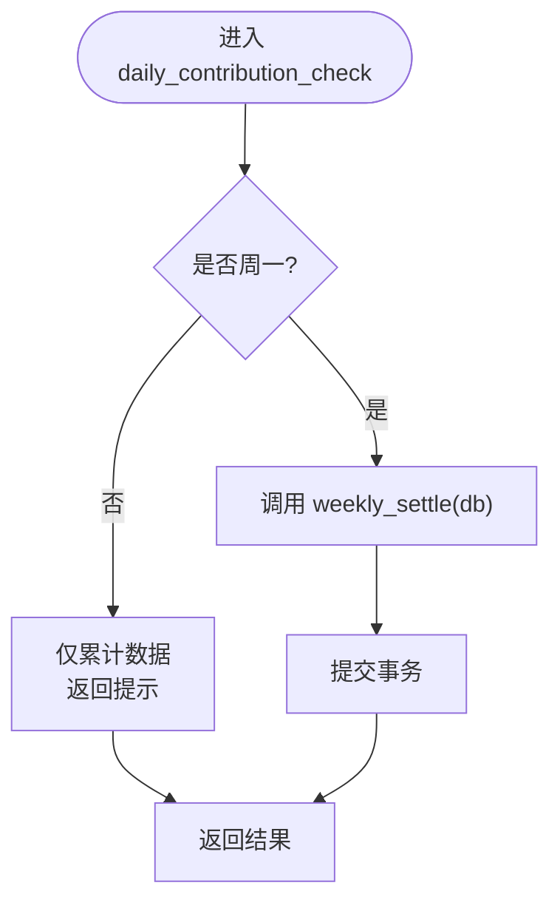
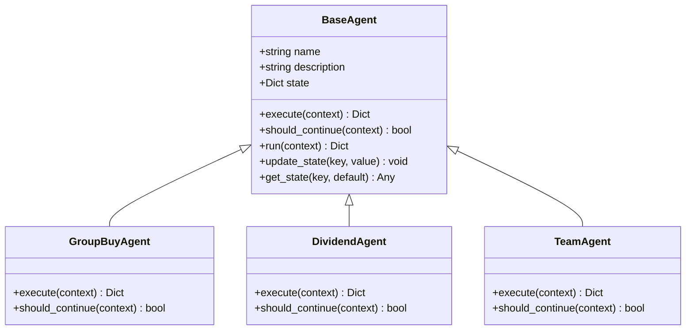
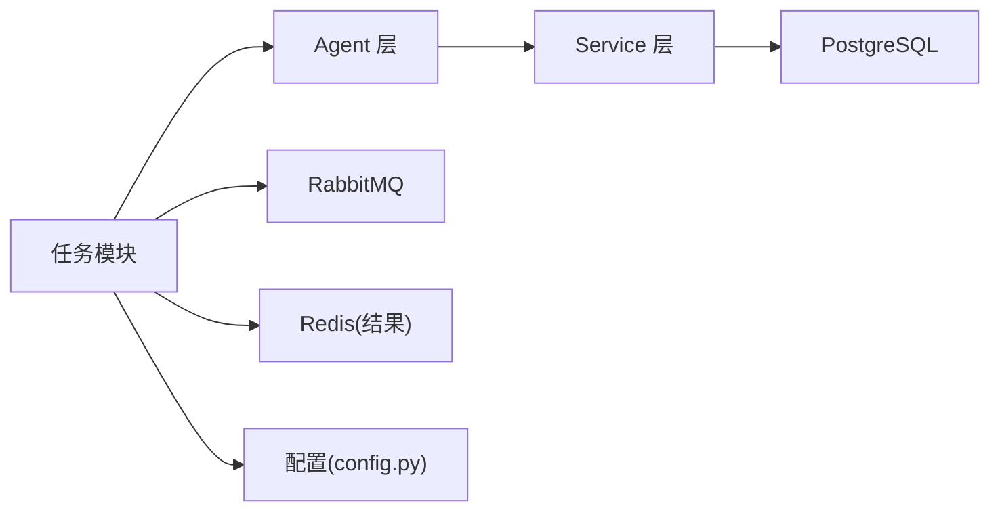

# 异步任务系统

<cite>
**本文引用的文件**   
- [celery_app.py](file://backend/app/tasks/celery_app.py)
- [group_buy_tasks.py](file://backend/app/tasks/group_buy_tasks.py)
- [dividend_tasks.py](file://backend/app/tasks/dividend_tasks.py)
- [store_rank_tasks.py](file://backend/app/tasks/store_rank_tasks.py)
- [contribution_tasks.py](file://backend/app/tasks/contribution_tasks.py)
- [config.py](file://backend/app/config.py)
- [database.py](file://backend/app/database.py)
- [base_agent.py](file://backend/app/agents/base_agent.py)
- [group_buy_agent.py](file://backend/app/agents/group_buy_agent.py)
- [all_agents.py](file://backend/app/agents/all_agents.py)
- [contribution_service.py](file://backend/app/services/contribution_service.py)
- [docker-compose.yml](file://docker-compose.yml)
</cite>

## 目录
1. [简介](#简介)
2. [项目结构](#项目结构)
3. [核心组件](#核心组件)
4. [架构总览](#架构总览)
5. [详细组件分析](#详细组件分析)
6. [依赖关系分析](#依赖关系分析)
7. [性能与扩展性](#性能与扩展性)
8. [故障排查指南](#故障排查指南)
9. [结论](#结论)
10. [附录：开发规范与最佳实践](#附录：开发规范与最佳实践)

## 简介
本技术文档聚焦 AIxingmu 的异步任务系统，围绕基于 Celery 的分布式任务队列进行系统化说明。内容涵盖：
- 生产者（API 服务）、消费者（Celery Worker）、调度器（Celery Beat）与消息中间件 RabbitMQ、结果存储 Redis 的配置与管理
- 定时任务实现：拼团定时任务、贡献值分红任务、门店排名任务等
- 任务调度策略、重试机制、失败处理与监控告警建议
- 任务开发规范、性能调优与故障排查
- 扩展性设计、负载均衡与高可用配置
- 定时任务与实时任务的协调机制与优先级管理

## 项目结构
后端采用分层组织：
- 应用入口与配置：FastAPI 主程序、全局配置、数据库连接
- 任务层：Celery 应用定义、Beat 调度、各业务任务模块
- Agent 层：统一抽象基类与各领域 Agent（拼团、分账、权益、分红、团队、风控）
- 服务层：具体业务逻辑（贡献值核算、结算、风控等）
- 部署编排：Docker Compose 编排 PostgreSQL、Redis、RabbitMQ、MinIO、后端 API、Worker、Beat、Nginx

图表来源
- [docker-compose.yml:52-96](file://docker-compose.yml#L52-L96)
- [celery_app.py:9-21](file://backend/app/tasks/celery_app.py#L9-L21)
- [database.py:10-21](file://backend/app/database.py#L10-L21)

章节来源
- [docker-compose.yml:1-111](file://docker-compose.yml#L1-L111)
- [config.py:24-26](file://backend/app/config.py#L24-L26)
- [database.py:10-21](file://backend/app/database.py#L10-L21)

## 核心组件
- Celery 应用与调度
  - 应用初始化、序列化与时区设置
  - Beat 定时任务清单与 crontab 表达式
- 任务模块
  - 拼团任务：创建场次、检查并结算已满场次、检查过期场次
  - 贡献值任务：每日递减核算与周一发放消费券
  - 分红任务：每周全网贡献值分红
  - 门店排名任务：月度团队业绩统计与阶梯分红
- Agent 抽象与实现
  - BaseAgent 提供统一的执行上下文、日志与异常封装
  - GroupBuyAgent、DividendAgent、TeamAgent 等按职责拆分
- 服务层
  - ContributionService 负责贡献值计算、周度结算与累计
- 基础设施
  - 数据库会话工厂、连接池参数
  - Docker Compose 编排多服务

章节来源
- [celery_app.py:9-55](file://backend/app/tasks/celery_app.py#L9-L55)
- [group_buy_tasks.py:17-53](file://backend/app/tasks/group_buy_tasks.py#L17-L53)
- [dividend_tasks.py:15-25](file://backend/app/tasks/dividend_tasks.py#L15-L25)
- [store_rank_tasks.py:15-28](file://backend/app/tasks/store_rank_tasks.py#L15-L28)
- [contribution_tasks.py:15-28](file://backend/app/tasks/contribution_tasks.py#L15-L28)
- [base_agent.py:12-47](file://backend/app/agents/base_agent.py#L12-L47)
- [group_buy_agent.py:15-67](file://backend/app/agents/group_buy_agent.py#L15-L67)
- [all_agents.py:52-94](file://backend/app/agents/all_agents.py#L52-L94)
- [contribution_service.py:16-261](file://backend/app/services/contribution_service.py#L16-L261)
- [database.py:10-21](file://backend/app/database.py#L10-L21)

## 架构总览
整体为“API 触发 + Beat 调度 → RabbitMQ → Worker 消费 → 调用 Agent/Service → 持久化”的异步流水线。

图表来源
- [celery_app.py:24-55](file://backend/app/tasks/celery_app.py#L24-L55)
- [group_buy_tasks.py:17-53](file://backend/app/tasks/group_buy_tasks.py#L17-L53)
- [group_buy_agent.py:21-63](file://backend/app/agents/group_buy_agent.py#L21-L63)
- [database.py:17-21](file://backend/app/database.py#L17-L21)

## 详细组件分析

### Celery 应用与调度
- 应用初始化
  - 使用配置中的 broker 与 result backend
  - 统一时区、序列化格式
- Beat 调度清单
  - 每日 9:50 创建当日拼团场次
  - 每小时第 5 分钟检查并结算已满场次
  - 每日 23:00 检查过期场次
  - 每周一凌晨 2:00 执行全网贡献值分红
  - 每日凌晨 3:00 执行贡献值递减核算
  - 每月 1 日凌晨 1:00 执行门店月度排名与分红

图表来源
- [celery_app.py:9-21](file://backend/app/tasks/celery_app.py#L9-L21)
- [celery_app.py:24-55](file://backend/app/tasks/celery_app.py#L24-L55)

章节来源
- [celery_app.py:9-55](file://backend/app/tasks/celery_app.py#L9-L55)

### 拼团定时任务（group_buy_tasks）
- 任务列表
  - 创建当日场次：调用 GroupBuyAgent.create_sessions
  - 检查并结算已满场次：遍历 FULL 状态场次，逐个结算
  - 检查过期场次：将 PENDING/ACTIVE 且已逾期的场次置为 EXPIRED
- 异步适配
  - 在同步 Celery 任务中通过事件循环运行协程
- 数据库事务
  - 每个任务以 async_session_factory 获取会话，执行业务后提交

图表来源
- [group_buy_tasks.py:17-27](file://backend/app/tasks/group_buy_tasks.py#L17-L27)
- [group_buy_agent.py:25-29](file://backend/app/agents/group_buy_agent.py#L25-L29)
- [database.py:17-21](file://backend/app/database.py#L17-L21)

章节来源
- [group_buy_tasks.py:1-54](file://backend/app/tasks/group_buy_tasks.py#L1-L54)
- [group_buy_agent.py:15-67](file://backend/app/agents/group_buy_agent.py#L15-L67)

### 贡献值分红任务（dividend_tasks）
- 每周一凌晨 2:00 触发全网贡献值分红
- 通过 DividendAgent 调用 DividendService.weekly_dividend 完成计算与发放

图表来源
- [dividend_tasks.py:15-25](file://backend/app/tasks/dividend_tasks.py#L15-L25)
- [all_agents.py:52-62](file://backend/app/agents/all_agents.py#L52-L62)

章节来源
- [dividend_tasks.py:1-26](file://backend/app/tasks/dividend_tasks.py#L1-L26)
- [all_agents.py:48-62](file://backend/app/agents/all_agents.py#L48-L62)

### 门店排名任务（store_rank_tasks）
- 每月 1 日凌晨 1:00 执行
- 计算上月业绩，调用 TeamAgent.settle_store_monthly_dividend 完成排名与阶梯分红

图表来源
- [store_rank_tasks.py:15-28](file://backend/app/tasks/store_rank_tasks.py#L15-L28)
- [all_agents.py:83-94](file://backend/app/agents/all_agents.py#L83-L94)

章节来源
- [store_rank_tasks.py:1-29](file://backend/app/tasks/store_rank_tasks.py#L1-L29)
- [all_agents.py:79-94](file://backend/app/agents/all_agents.py#L79-L94)

### 贡献值每日递减核算任务（contribution_tasks）
- 每日凌晨 3:00 执行
- 非周一仅累计数据；周一调用 ContributionService.weekly_settle 发放消费券并记录周度结算

图表来源
- [contribution_tasks.py:15-28](file://backend/app/tasks/contribution_tasks.py#L15-L28)
- [contribution_service.py:163-240](file://backend/app/services/contribution_service.py#L163-L240)

章节来源
- [contribution_tasks.py:1-29](file://backend/app/tasks/contribution_tasks.py#L1-L29)
- [contribution_service.py:163-240](file://backend/app/services/contribution_service.py#L163-L240)

### Agent 抽象与实现
- BaseAgent
  - 提供 name、description、state、logger
  - run 方法统一日志与异常包装，返回标准结果结构
- 具体 Agent
  - GroupBuyAgent：开团、结算、过期处理
  - DividendAgent：每周分红
  - TeamAgent：团队业绩与阶梯分红
  - SettlementAgent/RightsAgent/RiskAgent/UserOpsAgent：分账、权益、风控、用户运营

图表来源
- [base_agent.py:12-47](file://backend/app/agents/base_agent.py#L12-L47)
- [group_buy_agent.py:15-67](file://backend/app/agents/group_buy_agent.py#L15-L67)
- [all_agents.py:52-94](file://backend/app/agents/all_agents.py#L52-L94)

章节来源
- [base_agent.py:12-47](file://backend/app/agents/base_agent.py#L12-L47)
- [group_buy_agent.py:15-67](file://backend/app/agents/group_buy_agent.py#L15-L67)
- [all_agents.py:1-114](file://backend/app/agents/all_agents.py#L1-L114)

## 依赖关系分析
- 任务与 Agent/Service 的耦合
  - 任务模块仅作为“桥”，负责会话管理与异步适配，核心逻辑下沉至 Agent/Service
- 外部依赖
  - RabbitMQ：任务分发
  - Redis：结果存储
  - PostgreSQL：持久化
- 配置来源
  - Celery broker/backend 来自全局配置
  - 数据库连接池大小与溢出数由配置控制

图表来源
- [celery_app.py:9-21](file://backend/app/tasks/celery_app.py#L9-L21)
- [config.py:24-26](file://backend/app/config.py#L24-L26)
- [database.py:10-21](file://backend/app/database.py#L10-L21)

章节来源
- [celery_app.py:9-21](file://backend/app/tasks/celery_app.py#L9-L21)
- [config.py:24-26](file://backend/app/config.py#L24-L26)
- [database.py:10-21](file://backend/app/database.py#L10-L21)

## 性能与扩展性
- 并发与水平扩展
  - 通过增加 celery-worker 实例提升吞吐；结合 RabbitMQ 分区与 prefetch_count 调节
- 资源隔离
  - 不同业务任务可分配独立队列与 worker，避免相互影响
- 数据库连接池
  - 根据 QPS 调整 pool_size 与 max_overflow，减少锁竞争
- 批处理与幂等
  - 对批量结算类任务采用分批提交与幂等键，降低重复执行风险
- 结果存储
  - 合理设置 Redis 过期策略，避免结果堆积
- 监控与指标
  - 暴露 Celery 指标（任务耗时、成功率、重试次数），接入 Prometheus/Grafana

[本节为通用指导，不直接分析具体文件]

## 故障排查指南
- 常见问题定位
  - 任务未执行：检查 Beat 是否运行、crontab 是否正确、Broker 连通性
  - 任务失败：查看 Worker 日志，确认 Agent.run 返回的错误信息
  - 数据库超时：检查连接池参数与慢查询
  - 结果不可用：确认 Redis 连通性与 key 过期时间
- 快速自检清单
  - docker-compose 服务健康状态
  - RabbitMQ 控制台队列积压情况
  - Redis 内存与命中率
  - PostgreSQL 锁等待与连接数
- 恢复策略
  - 重放失败任务（谨慎幂等）
  - 临时扩容 Worker 缓解积压
  - 降级非关键任务，优先保障核心链路

章节来源
- [base_agent.py:31-40](file://backend/app/agents/base_agent.py#L31-L40)
- [docker-compose.yml:72-96](file://docker-compose.yml#L72-L96)

## 结论
AIxingmu 的异步任务系统以 Celery 为核心，结合 RabbitMQ 与 Redis 构建稳定可靠的分布式任务管道。通过 Agent 抽象与服务层解耦，实现了清晰的职责边界与良好的可扩展性。配合完善的调度策略与规范的错误处理，能够支撑拼团、分红、门店排名等复杂业务的定时与异步处理需求。后续可在任务优先级、重试策略、监控告警与高可用方面持续优化。

[本节为总结性内容，不直接分析具体文件]

## 附录：开发规范与最佳实践
- 任务开发规范
  - 任务函数保持轻量，仅做会话管理与异步适配，核心逻辑放入 Agent/Service
  - 所有异步代码通过事件循环在同步任务中执行
  - 明确事务边界，确保 commit/rollback 正确
- 命名与注册
  - 使用唯一 task name，便于监控与追踪
  - 在 Beat 中集中维护 crontab 表达式，避免分散配置
- 错误处理与重试
  - 在 Agent.run 中捕获异常并记录结构化日志
  - 针对瞬时错误启用自动重试，幂等写入避免重复副作用
- 监控与告警
  - 记录任务开始/结束时间与异常堆栈
  - 对关键任务设置阈值告警（失败率、延迟、积压）
- 安全与合规
  - 敏感配置通过环境变量注入，禁止硬编码
  - 对涉及资金与权益的任务增加审计日志与校验

[本节为通用指导，不直接分析具体文件]