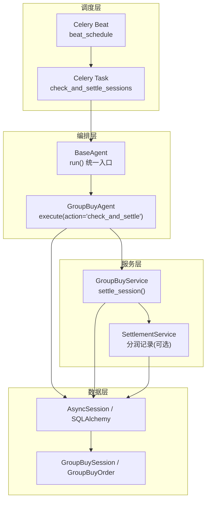
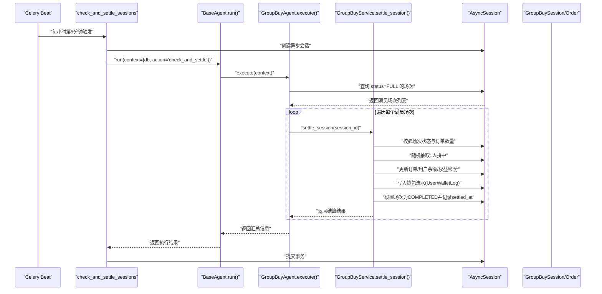
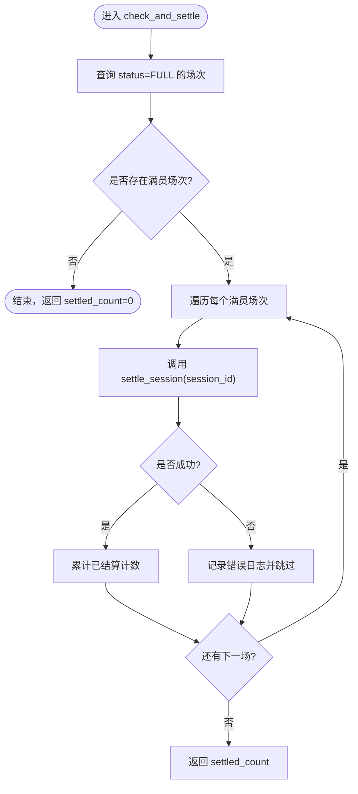
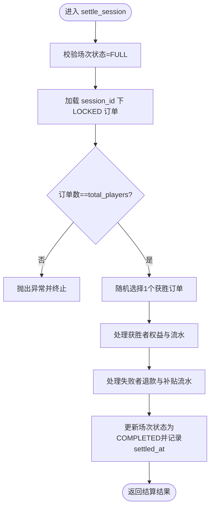
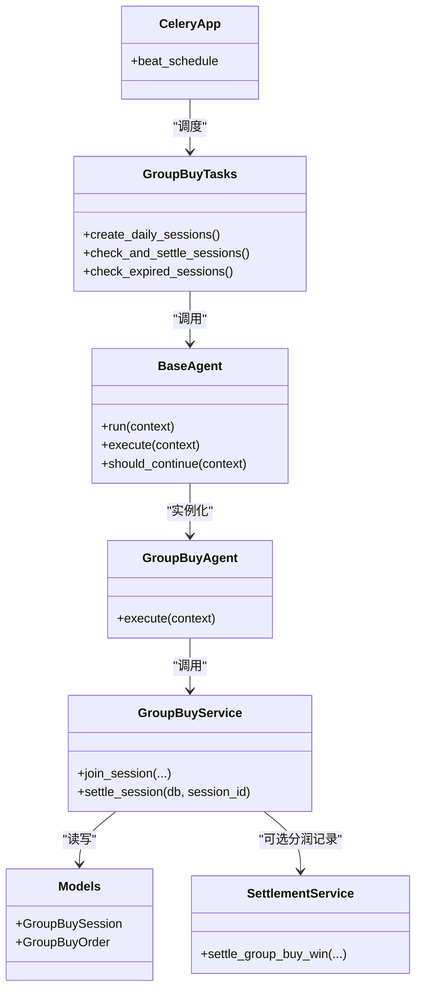

# 场次结算检查任务

<cite>
**本文引用的文件列表**
- [group_buy_tasks.py](file://backend/app/tasks/group_buy_tasks.py)
- [celery_app.py](file://backend/app/tasks/celery_app.py)
- [group_buy_agent.py](file://backend/app/agents/group_buy_agent.py)
- [base_agent.py](file://backend/app/agents/base_agent.py)
- [group_buy_service.py](file://backend/app/services/group_buy_service.py)
- [settlement_service.py](file://backend/app/services/settlement_service.py)
- [group_buy.py](file://backend/app/models/group_buy.py)
- [config.py](file://backend/app/config.py)
- [database.py](file://backend/app/database.py)
</cite>

## 目录
1. [简介](#简介)
2. [项目结构](#项目结构)
3. [核心组件](#核心组件)
4. [架构总览](#架构总览)
5. [详细组件分析](#详细组件分析)
6. [依赖关系分析](#依赖关系分析)
7. [性能与优化](#性能与优化)
8. [日志与监控](#日志与监控)
9. [故障恢复与一致性](#故障恢复与一致性)
10. [排障指南](#排障指南)
11. [结论](#结论)

## 简介
本技术文档聚焦于“check_and_settle_sessions”场次结算检查任务的实现与运维。该任务每小时定时触发，识别已满场次的拼团会话，并调用服务层完成结果判定、权益发放与分润记录，确保数据一致性与业务闭环。文档涵盖调度机制、算法流程、服务协作、异常处理、性能优化、日志规范、监控指标与调试方法。

## 项目结构
围绕本场次结算检查任务的相关代码分布在任务调度、Agent编排、服务层与模型层：
- 任务调度：Celery Beat 配置与 Celery Task 定义
- Agent 编排：GroupBuyAgent 负责动作分发与执行
- 服务层：GroupBuyService 提供参团、结算等核心逻辑；SettlementService 提供分润记录
- 模型层：GroupBuySession、GroupBuyOrder 等实体定义
- 配置与数据库：全局参数与异步会话管理

图表来源
- [celery_app.py:24-39](file://backend/app/tasks/celery_app.py#L24-L39)
- [group_buy_tasks.py:30-40](file://backend/app/tasks/group_buy_tasks.py#L30-L40)
- [group_buy_agent.py:31-46](file://backend/app/agents/group_buy_agent.py#L31-L46)
- [group_buy_service.py:183-321](file://backend/app/services/group_buy_service.py#L183-L321)
- [settlement_service.py:17-85](file://backend/app/services/settlement_service.py#L17-L85)
- [group_buy.py:42-131](file://backend/app/models/group_buy.py#L42-L131)
- [database.py:17-21](file://backend/app/database.py#L17-L21)

章节来源
- [celery_app.py:24-39](file://backend/app/tasks/celery_app.py#L24-L39)
- [group_buy_tasks.py:30-40](file://backend/app/tasks/group_buy_tasks.py#L30-L40)
- [group_buy_agent.py:31-46](file://backend/app/agents/group_buy_agent.py#L31-L46)
- [group_buy_service.py:183-321](file://backend/app/services/group_buy_service.py#L183-L321)
- [settlement_service.py:17-85](file://backend/app/services/settlement_service.py#L17-L85)
- [group_buy.py:42-131](file://backend/app/models/group_buy.py#L42-L131)
- [database.py:17-21](file://backend/app/database.py#L17-L21)

## 核心组件
- Celery Beat 调度器：按 crontab 规则周期性触发任务
- Celery Task：封装异步执行上下文，创建数据库会话并调用 Agent
- GroupBuyAgent：根据 action 路由到具体业务逻辑（创建场次、检查过期、检查并结算）
- GroupBuyService.settle_session：满员场次结算主流程（随机抽中、权益发放、失败补贴、状态更新）
- SettlementService：分润记录（如需要）
- 数据模型：场次、订单、用户钱包流水等

章节来源
- [celery_app.py:24-39](file://backend/app/tasks/celery_app.py#L24-L39)
- [group_buy_tasks.py:30-40](file://backend/app/tasks/group_buy_tasks.py#L30-L40)
- [group_buy_agent.py:31-46](file://backend/app/agents/group_buy_agent.py#L31-L46)
- [group_buy_service.py:183-321](file://backend/app/services/group_buy_service.py#L183-L321)
- [settlement_service.py:17-85](file://backend/app/services/settlement_service.py#L17-L85)
- [group_buy.py:42-131](file://backend/app/models/group_buy.py#L42-L131)

## 架构总览
下图展示了从调度到结算的完整时序，包括数据库事务边界与关键分支。

图表来源
- [celery_app.py:30-34](file://backend/app/tasks/celery_app.py#L30-L34)
- [group_buy_tasks.py:30-40](file://backend/app/tasks/group_buy_tasks.py#L30-L40)
- [group_buy_agent.py:31-46](file://backend/app/agents/group_buy_agent.py#L31-L46)
- [group_buy_service.py:183-321](file://backend/app/services/group_buy_service.py#L183-L321)
- [database.py:17-21](file://backend/app/database.py#L17-L21)

## 详细组件分析

### 调度与任务定义
- Celery Beat 配置了每小时第5分钟执行 check_and_settle_sessions 任务
- 任务函数在同步环境中启动事件循环，运行异步协程，使用 async_session_factory 获取数据库会话，并在完成后提交事务

章节来源
- [celery_app.py:30-34](file://backend/app/tasks/celery_app.py#L30-L34)
- [group_buy_tasks.py:30-40](file://backend/app/tasks/group_buy_tasks.py#L30-L40)
- [database.py:17-21](file://backend/app/database.py#L17-L21)

### Agent 编排与动作路由
- GroupBuyAgent 基于 BaseAgent 的统一 run 入口，记录开始/结束日志与错误信息
- execute 方法根据 action 分发：
  - create_sessions：创建当日场次
  - check_expired：将未完成的过期场次标记为 EXPIRED
  - check_and_settle：查询 FULL 状态的场次并逐个结算

章节来源
- [base_agent.py:31-40](file://backend/app/agents/base_agent.py#L31-L40)
- [group_buy_agent.py:21-46](file://backend/app/agents/group_buy_agent.py#L21-L46)

### 已满场次识别算法
- 通过查询 GroupBuySession.status == FULL 的场次集合
- 对每个满员场次调用服务层进行结算
- 若某场次结算抛出异常，记录错误日志并继续处理其他场次，保证批量处理的容错性

图表来源
- [group_buy_agent.py:31-46](file://backend/app/agents/group_buy_agent.py#L31-L46)

章节来源
- [group_buy_agent.py:31-46](file://backend/app/agents/group_buy_agent.py#L31-L46)

### 结算业务流程（核心）
- 前置校验：
  - 场次存在且状态为 FULL
  - 锁定订单数量等于场次总人数
- 结果判定：
  - 从 LOCKED 订单中随机选择1个作为获胜者
- 权益发放（获胜者）：
  - 商品权益（比例由配置决定）
  - 贡献值权益（比例由配置决定）
  - 增值积分权益（比例由配置决定）
  - 同时写入用户钱包流水（coupon/contribution/points）
- 失败保障（其余30人）：
  - 本金解锁退回
  - 广告补贴（比例由配置决定）
  - 推荐人补贴（比例由配置决定）
  - 写入用户钱包流水（balance/coupon）
- 状态更新：
  - 订单状态更新为 WON/REFUNDED
  - 场次状态更新为 COMPLETED，记录 settled_at

图表来源
- [group_buy_service.py:183-321](file://backend/app/services/group_buy_service.py#L183-L321)

章节来源
- [group_buy_service.py:183-321](file://backend/app/services/group_buy_service.py#L183-L321)
- [config.py:79-88](file://backend/app/config.py#L79-L88)

### 与分润服务的协作
- 当前结算主流程直接对用户资产与订单进行变更，不强制依赖 SettlementService
- 若需记录线下四级分润或平台收支明细，可在结算流程中扩展调用 SettlementService 的分润记录方法，以生成 SettlementRecord 并持久化

章节来源
- [settlement_service.py:17-85](file://backend/app/services/settlement_service.py#L17-L85)

### 数据模型要点
- GroupBuySession：场次编号、级别、价格、人数规则、状态、时间窗口、winner_id 等
- GroupBuyOrder：订单号、用户与会场关联、金额、状态、结果、权益字段、推荐人等
- 索引设计：针对 level/status、start_time/end_time、user_id/session_id、status 等建立索引以提升查询效率

章节来源
- [group_buy.py:42-131](file://backend/app/models/group_buy.py#L42-L131)

## 依赖关系分析
- 任务层依赖 Celery 应用与 Beat 调度
- Agent 层依赖 BaseAgent 统一执行框架
- 服务层依赖数据库会话与配置项
- 模型层定义实体与关系，被服务层读写

图表来源
- [celery_app.py:24-39](file://backend/app/tasks/celery_app.py#L24-L39)
- [group_buy_tasks.py:17-53](file://backend/app/tasks/group_buy_tasks.py#L17-L53)
- [base_agent.py:12-40](file://backend/app/agents/base_agent.py#L12-L40)
- [group_buy_agent.py:15-46](file://backend/app/agents/group_buy_agent.py#L15-L46)
- [group_buy_service.py:183-321](file://backend/app/services/group_buy_service.py#L183-L321)
- [settlement_service.py:17-85](file://backend/app/services/settlement_service.py#L17-L85)
- [group_buy.py:42-131](file://backend/app/models/group_buy.py#L42-L131)

章节来源
- [celery_app.py:24-39](file://backend/app/tasks/celery_app.py#L24-L39)
- [group_buy_tasks.py:17-53](file://backend/app/tasks/group_buy_tasks.py#L17-L53)
- [base_agent.py:12-40](file://backend/app/agents/base_agent.py#L12-L40)
- [group_buy_agent.py:15-46](file://backend/app/agents/group_buy_agent.py#L15-L46)
- [group_buy_service.py:183-321](file://backend/app/services/group_buy_service.py#L183-L321)
- [settlement_service.py:17-85](file://backend/app/services/settlement_service.py#L17-L85)
- [group_buy.py:42-131](file://backend/app/models/group_buy.py#L42-L131)

## 性能与优化
- 查询优化
  - 使用 status=FULL 条件精准筛选待结算场次
  - 利用模型索引 idx_session_level_status、idx_session_time、idx_gb_order_user_session、idx_gb_order_status 提升查询与过滤效率
- 事务与批处理
  - 任务级事务：每次任务执行一个数据库会话，最后统一提交，减少多次提交开销
  - 单场次内 flush 后继续处理，避免大事务过长导致锁竞争
- 并发与限流
  - 当前为单进程串行处理满员场次，适合中小规模；高并发场景可考虑多 worker 并行，但需注意幂等与去重
- 配置调优
  - 调整数据库连接池大小与溢出上限，匹配负载峰值
  - 合理设置 Celery 队列与重试策略，避免重复执行造成二次结算

章节来源
- [group_buy.py:83-86](file://backend/app/models/group_buy.py#L83-L86)
- [database.py:10-21](file://backend/app/database.py#L10-L21)
- [group_buy_tasks.py:30-40](file://backend/app/tasks/group_buy_tasks.py#L30-L40)

## 日志与监控
- 日志规范
  - Agent 基类统一记录执行开始、结束与异常信息，便于追踪
  - 结算失败时记录场次ID与异常详情，便于定位问题
- 监控指标建议
  - 任务执行次数（每小时）
  - 满员场次发现数
  - 成功结算场次数
  - 失败结算场次数及原因分布
  - 平均结算耗时
  - 订单数量校验失败次数
- 前端展示
  - 后台管理页面提供 Agent 状态概览、手动执行与日志查看能力，可用于辅助排查

章节来源
- [base_agent.py:31-40](file://backend/app/agents/base_agent.py#L31-L40)
- [group_buy_agent.py:44-46](file://backend/app/agents/group_buy_agent.py#L44-L46)

## 故障恢复与一致性
- 幂等性
  - 仅对 status=FULL 的场次进行结算，避免重复处理
  - 建议在结算前增加“是否已结算”标志位或唯一约束，防止重复提交
- 异常处理
  - 单个场次结算异常不影响其他场次处理
  - 对于订单数量不匹配、状态异常等强一致性错误，立即中止并记录错误，等待人工介入或补偿任务
- 数据一致性
  - 同一场次内的所有变更在同一事务中提交，保证原子性
  - 用户资产变更均伴随 UserWalletLog 记录，便于审计与对账
- 补偿机制
  - 可新增“补结任务”，扫描 COMPLETED 但缺失必要记录的场次进行修复
  - 结合 Redis 缓存任务执行状态，避免重复执行

章节来源
- [group_buy_agent.py:31-46](file://backend/app/agents/group_buy_agent.py#L31-L46)
- [group_buy_service.py:183-321](file://backend/app/services/group_buy_service.py#L183-L321)
- [database.py:29-39](file://backend/app/database.py#L29-L39)

## 排障指南
- 常见问题
  - 任务未触发：检查 Celery Beat 配置与 crontab 表达式是否正确
  - 无满员场次：确认场次创建时间与参与人数增长是否符合预期
  - 结算失败：核对场次状态是否为 FULL，订单数量是否与 total_players 一致
  - 权限或连接问题：检查数据库连接池与认证配置
- 定位步骤
  - 查看 Agent 执行日志，关注错误信息与堆栈
  - 检查数据库对应场次与订单的状态与数量
  - 验证配置项中的比例参数是否符合业务预期
- 快速验证
  - 手动触发任务（通过管理界面或命令行），观察日志输出与数据库变化

章节来源
- [celery_app.py:30-34](file://backend/app/tasks/celery_app.py#L30-L34)
- [group_buy_agent.py:31-46](file://backend/app/agents/group_buy_agent.py#L31-L46)
- [group_buy_service.py:183-321](file://backend/app/services/group_buy_service.py#L183-L321)

## 结论
check_and_settle_sessions 任务通过 Celery Beat 定时触发，借助 GroupBuyAgent 的动作路由与 GroupBuyService 的结算逻辑，实现了满员场次的自动判定与权益发放。整体采用单事务、逐场次处理的方式，具备较好的可观测性与容错性。后续可在幂等性、补偿任务与监控告警方面进一步完善，以支撑更大规模的并发与更严格的财务对账要求。