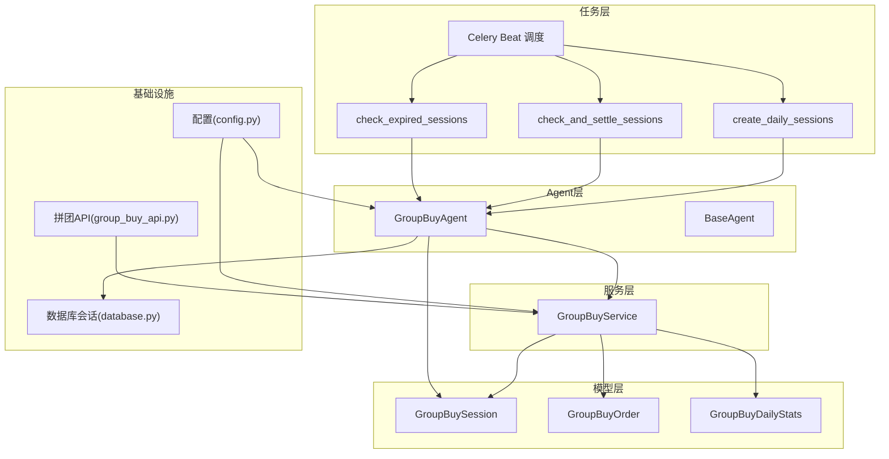
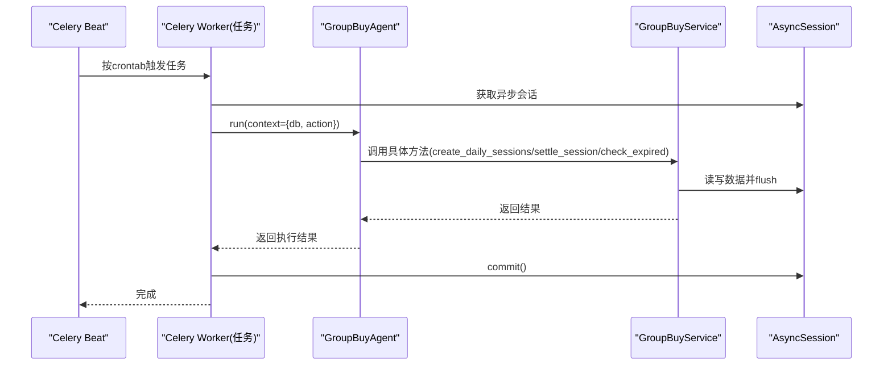
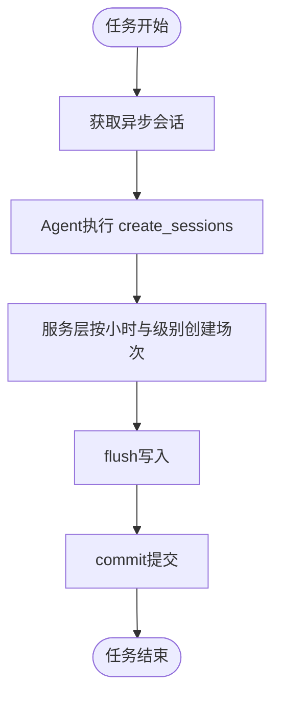
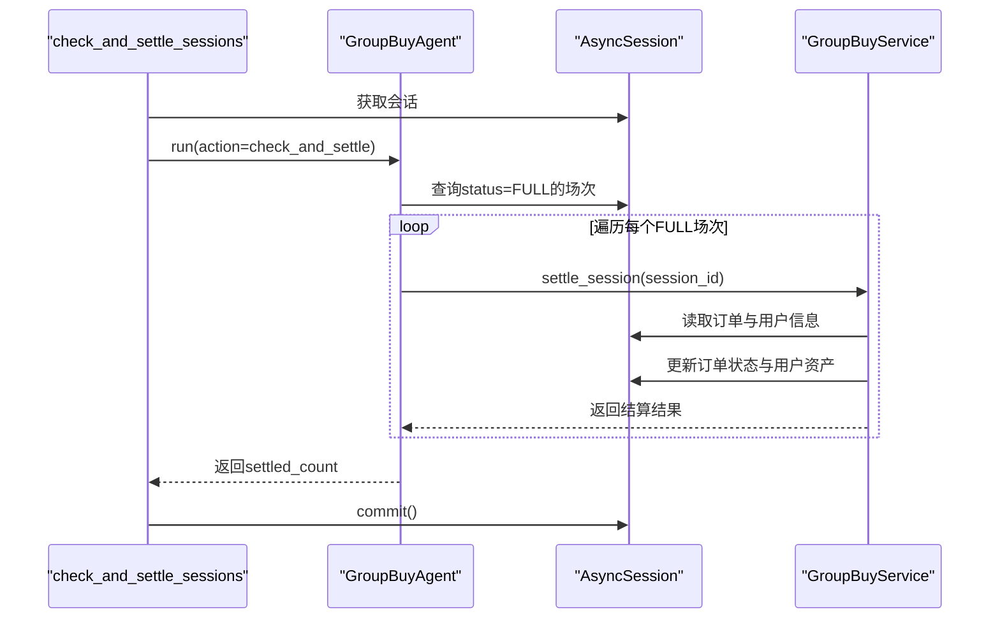
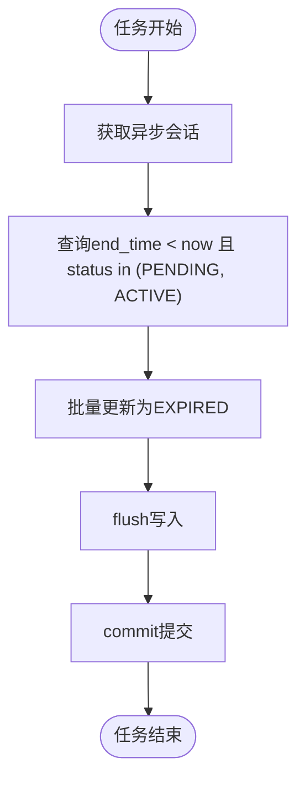
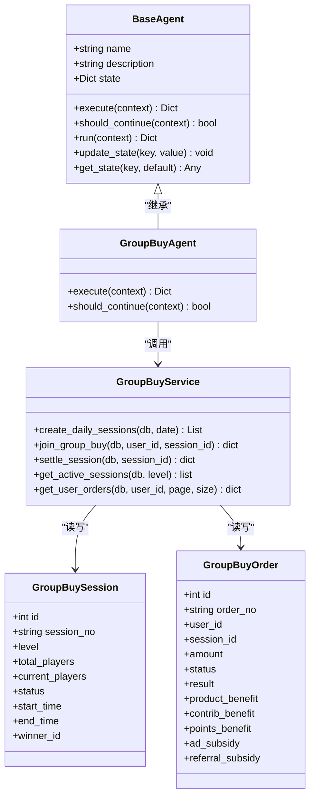
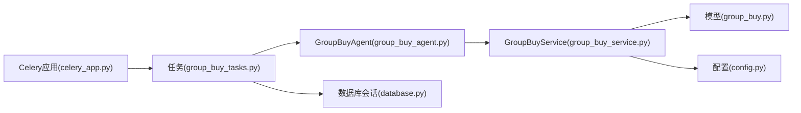

# 拼团业务任务

<cite>
**本文引用的文件**   
- [group_buy_tasks.py](file://backend/app/tasks/group_buy_tasks.py)
- [celery_app.py](file://backend/app/tasks/celery_app.py)
- [group_buy_agent.py](file://backend/app/agents/group_buy_agent.py)
- [base_agent.py](file://backend/app/agents/base_agent.py)
- [group_buy_service.py](file://backend/app/services/group_buy_service.py)
- [group_buy.py](file://backend/app/models/group_buy.py)
- [config.py](file://backend/app/config.py)
- [database.py](file://backend/app/database.py)
- [group_buy_api.py](file://backend/app/api/v1/group_buy.py)
</cite>

## 目录
1. [简介](#简介)
2. [项目结构](#项目结构)
3. [核心组件](#核心组件)
4. [架构总览](#架构总览)
5. [详细组件分析](#详细组件分析)
6. [依赖关系分析](#依赖关系分析)
7. [性能与高并发优化](#性能与高并发优化)
8. [监控、日志与故障恢复](#监控日志与故障恢复)
9. [结论](#结论)
10. [附录](#附录)

## 简介
本技术文档聚焦AIxingmu拼团业务的异步任务系统，围绕以下三个定时任务展开：
- 每日场次创建任务（create_daily_sessions）
- 场次结算检查任务（check_and_settle_sessions）
- 过期场次清理任务（check_expired_sessions）

文档将深入解析每个任务的执行逻辑、触发时机、业务规则，说明任务与拼团服务层的交互方式、数据一致性保证和异常处理机制，并提供任务执行状态监控、日志记录与故障恢复策略，以及在高并发场景下的性能优化与扩展性建议。

## 项目结构
后端采用分层架构：
- 任务层：Celery 定时任务定义与调度
- Agent层：统一Agent编排入口，负责动作分发与上下文传递
- 服务层：拼团核心业务实现（开团、参团、结算等）
- 模型层：拼团相关数据模型与枚举
- 配置层：全局业务参数与外部依赖配置
- 数据库层：异步会话工厂与连接池管理
- API层：对外提供查询与参与接口（与任务无直接耦合）

图表来源
- [celery_app.py:24-39](file://backend/app/tasks/celery_app.py#L24-L39)
- [group_buy_tasks.py:17-53](file://backend/app/tasks/group_buy_tasks.py#L17-L53)
- [group_buy_agent.py:21-63](file://backend/app/agents/group_buy_agent.py#L21-L63)
- [group_buy_service.py:27-347](file://backend/app/services/group_buy_service.py#L27-L347)
- [group_buy.py:42-158](file://backend/app/models/group_buy.py#L42-L158)
- [config.py:42-100](file://backend/app/config.py#L42-L100)
- [database.py:17-21](file://backend/app/database.py#L17-L21)
- [group_buy_api.py:15-49](file://backend/app/api/v1/group_buy.py#L15-L49)

章节来源
- [celery_app.py:1-56](file://backend/app/tasks/celery_app.py#L1-L56)
- [group_buy_tasks.py:1-54](file://backend/app/tasks/group_buy_tasks.py#L1-L54)
- [group_buy_agent.py:1-67](file://backend/app/agents/group_buy_agent.py#L1-L67)
- [group_buy_service.py:1-348](file://backend/app/services/group_buy_service.py#L1-L348)
- [group_buy.py:1-158](file://backend/app/models/group_buy.py#L1-L158)
- [config.py:1-136](file://backend/app/config.py#L1-L136)
- [database.py:1-40](file://backend/app/database.py#L1-L40)
- [group_buy_api.py:1-65](file://backend/app/api/v1/group_buy.py#L1-L65)

## 核心组件
- Celery应用与调度：集中定义任务名、Broker/Backend、时区与crontab调度计划
- 任务封装：将异步业务通过事件循环桥接到同步Celery任务
- Agent编排：根据action分发到不同业务分支（创建场次、结算、过期清理）
- 服务层：实现场次创建、用户参团、满员结算等核心流程
- 数据模型：场次、订单、统计等实体及状态枚举
- 配置：拼团人数、价格、权益比例、时间窗口等关键参数
- 数据库：异步引擎与会话工厂，支持事务提交与回滚

章节来源
- [celery_app.py:9-21](file://backend/app/tasks/celery_app.py#L9-L21)
- [group_buy_tasks.py:8-15](file://backend/app/tasks/group_buy_tasks.py#L8-L15)
- [group_buy_agent.py:15-20](file://backend/app/agents/group_buy_agent.py#L15-L20)
- [group_buy_service.py:17-26](file://backend/app/services/group_buy_service.py#L17-L26)
- [group_buy.py:15-40](file://backend/app/models/group_buy.py#L15-L40)
- [config.py:42-100](file://backend/app/config.py#L42-L100)
- [database.py:10-21](file://backend/app/database.py#L10-L21)

## 架构总览
下图展示从Celery调度到Agent与服务层的数据流与控制流。

图表来源
- [celery_app.py:24-39](file://backend/app/tasks/celery_app.py#L24-L39)
- [group_buy_tasks.py:17-53](file://backend/app/tasks/group_buy_tasks.py#L17-L53)
- [group_buy_agent.py:21-63](file://backend/app/agents/group_buy_agent.py#L21-L63)
- [group_buy_service.py:27-347](file://backend/app/services/group_buy_service.py#L27-L347)
- [database.py:17-21](file://backend/app/database.py#L17-L21)

## 详细组件分析

### 每日场次创建任务（create_daily_sessions）
- 触发时机：每日9:50由Celery Beat触发
- 执行逻辑：
  - 在任务中创建异步会话，实例化GroupBuyAgent，传入action=create_sessions与日期
  - Agent调用服务层create_daily_sessions，按配置的时间窗口与级别批量生成场次
  - 提交事务并返回结果
- 业务规则：
  - 时间窗口：每日10:00至22:00，每小时一场
  - 每场包含三个级别：初级、高级、SVIP
  - 每场人数固定为31人，初始状态为等待开团
- 数据一致性：
  - 使用异步会话的flush与commit确保批次写入原子性
- 异常处理：
  - 若Agent执行失败，会返回错误状态；建议在Worker侧增加重试与告警

图表来源
- [group_buy_tasks.py:17-27](file://backend/app/tasks/group_buy_tasks.py#L17-L27)
- [group_buy_agent.py:25-29](file://backend/app/agents/group_buy_agent.py#L25-L29)
- [group_buy_service.py:27-59](file://backend/app/services/group_buy_service.py#L27-L59)
- [config.py:52-58](file://backend/app/config.py#L52-L58)

章节来源
- [celery_app.py:24-29](file://backend/app/tasks/celery_app.py#L24-L29)
- [group_buy_tasks.py:17-27](file://backend/app/tasks/group_buy_tasks.py#L17-L27)
- [group_buy_agent.py:25-29](file://backend/app/agents/group_buy_agent.py#L25-L29)
- [group_buy_service.py:27-59](file://backend/app/services/group_buy_service.py#L27-L59)
- [config.py:52-58](file://backend/app/config.py#L52-L58)

### 场次结算检查任务（check_and_settle_sessions）
- 触发时机：每小时第5分钟执行（10:00-22:00期间）
- 执行逻辑：
  - 任务获取异步会话，调用Agent的check_and_settle
  - Agent查询所有FULL状态的场次，逐个调用服务层settle_session进行结算
  - 对单个场次结算异常进行捕获并记录日志，继续处理其他场次
  - 提交事务并返回已结算数量
- 业务规则：
  - 仅对已满员（FULL）且未结算的场次进行判定
  - 随机抽取1人拼中，其余30人拼失败
  - 拼中用户获得商品权益、贡献值、积分；拼失败用户退回本金并获得广告补贴与推荐人补贴
- 数据一致性：
  - 单场次结算在一个事务内完成，确保订单、用户资产变更的一致性
- 异常处理：
  - 单场次结算失败不影响其他场次；需结合监控与重试策略保障最终一致

图表来源
- [group_buy_tasks.py:30-40](file://backend/app/tasks/group_buy_tasks.py#L30-L40)
- [group_buy_agent.py:31-46](file://backend/app/agents/group_buy_agent.py#L31-L46)
- [group_buy_service.py:183-321](file://backend/app/services/group_buy_service.py#L183-L321)

章节来源
- [celery_app.py:30-34](file://backend/app/tasks/celery_app.py#L30-L34)
- [group_buy_tasks.py:30-40](file://backend/app/tasks/group_buy_tasks.py#L30-L40)
- [group_buy_agent.py:31-46](file://backend/app/agents/group_buy_agent.py#L31-L46)
- [group_buy_service.py:183-321](file://backend/app/services/group_buy_service.py#L183-L321)

### 过期场次清理任务（check_expired_sessions）
- 触发时机：每日23:00执行
- 执行逻辑：
  - 任务获取异步会话，调用Agent的check_expired
  - Agent查询当前时间之前仍未结束的PENDING或ACTIVE场次，将其状态置为EXPIRED
  - flush并提交事务，返回过期场次数量
- 业务规则：
  - 仅处理尚未达到COMPLETED或CANCELLED的场次
  - 过期场次不再参与后续结算
- 数据一致性：
  - 批量状态更新在同一事务内完成，避免部分更新导致的状态不一致

图表来源
- [group_buy_tasks.py:43-53](file://backend/app/tasks/group_buy_tasks.py#L43-L53)
- [group_buy_agent.py:48-61](file://backend/app/agents/group_buy_agent.py#L48-L61)

章节来源
- [celery_app.py:35-39](file://backend/app/tasks/celery_app.py#L35-L39)
- [group_buy_tasks.py:43-53](file://backend/app/tasks/group_buy_tasks.py#L43-L53)
- [group_buy_agent.py:48-61](file://backend/app/agents/group_buy_agent.py#L48-L61)

### 类与关系图（代码级）

图表来源
- [base_agent.py:12-47](file://backend/app/agents/base_agent.py#L12-L47)
- [group_buy_agent.py:15-67](file://backend/app/agents/group_buy_agent.py#L15-L67)
- [group_buy_service.py:17-347](file://backend/app/services/group_buy_service.py#L17-L347)
- [group_buy.py:42-131](file://backend/app/models/group_buy.py#L42-L131)

## 依赖关系分析
- 任务与调度：
  - Celery应用配置了broker与backend，beat_schedule定义了三个拼团任务与多个其他周期任务
  - 任务通过名称注册，便于分布式Worker发现与执行
- 任务与Agent：
  - 任务仅做异步会话管理与Agent运行包装，核心逻辑集中在Agent
- Agent与服务层：
  - Agent依据action分派到服务层的具体方法，保持职责清晰
- 服务层与模型：
  - 服务层直接操作模型对象，使用SQLAlchemy异步查询与更新
- 配置与业务：
  - 拼团人数、价格、权益比例、时间窗口等全部来自配置，便于动态调整
- 数据库与会话：
  - 使用async_session_factory创建会话，任务内显式commit，保证事务边界

图表来源
- [celery_app.py:9-21](file://backend/app/tasks/celery_app.py#L9-L21)
- [group_buy_tasks.py:17-53](file://backend/app/tasks/group_buy_tasks.py#L17-L53)
- [group_buy_agent.py:21-63](file://backend/app/agents/group_buy_agent.py#L21-L63)
- [group_buy_service.py:27-347](file://backend/app/services/group_buy_service.py#L27-L347)
- [group_buy.py:42-158](file://backend/app/models/group_buy.py#L42-L158)
- [config.py:42-100](file://backend/app/config.py#L42-L100)
- [database.py:17-21](file://backend/app/database.py#L17-L21)

章节来源
- [celery_app.py:24-39](file://backend/app/tasks/celery_app.py#L24-L39)
- [group_buy_tasks.py:17-53](file://backend/app/tasks/group_buy_tasks.py#L17-L53)
- [group_buy_agent.py:21-63](file://backend/app/agents/group_buy_agent.py#L21-L63)
- [group_buy_service.py:27-347](file://backend/app/services/group_buy_service.py#L27-L347)
- [group_buy.py:42-158](file://backend/app/models/group_buy.py#L42-L158)
- [config.py:42-100](file://backend/app/config.py#L42-L100)
- [database.py:17-21](file://backend/app/database.py#L17-L21)

## 性能与高并发优化
- 任务粒度与批处理
  - 场次创建按小时与级别批量插入，减少多次往返；建议结合bulk insert进一步优化
  - 结算任务按FULL场次遍历，单场次事务隔离，避免跨场次锁竞争
- 数据库索引与查询
  - 模型层已定义常用索引（如level+status、start_time+end_time、user_id+session_id），有助于高效筛选
- 连接池与超时
  - 使用async_session_factory与连接池配置，合理设置pool_size与max_overflow，避免连接耗尽
- 幂等与去重
  - 场次编号唯一约束可防止重复创建；建议在任务侧增加幂等键（如日期+级别）以应对重复调度
- 限流与背压
  - 结算任务可按批次大小限制单次处理数量，避免长时间占用数据库资源
- 水平扩展
  - Celery Worker多进程/多线程部署，结合Redis队列横向扩展；注意分布式锁避免同一场次被重复结算

[本节为通用性能建议，不直接分析具体文件]

## 监控、日志与故障恢复
- 日志记录
  - Agent基类在执行前后记录info日志，异常时记录error日志；可在生产环境接入集中日志平台
- 任务状态监控
  - Celery结果存储于Redis，可通过结果后端查询任务状态；建议构建监控面板展示成功率、耗时与失败原因
- 异常处理
  - 结算任务对单场次异常捕获并记录，继续处理其他场次；建议引入重试机制（指数退避）与死信队列
- 数据一致性保障
  - 每个任务在Agent完成后显式commit；若出现中间失败，应回滚并重试
- 故障恢复策略
  - 对于过期场次清理失败，可在次日再次执行；对于结算失败，建议基于FULL状态扫描进行补偿
- 健康检查
  - 暴露健康检查接口，检测数据库、Redis、Celery Worker可用性

章节来源
- [base_agent.py:31-40](file://backend/app/agents/base_agent.py#L31-L40)
- [group_buy_agent.py:44-46](file://backend/app/agents/group_buy_agent.py#L44-L46)
- [celery_app.py:9-21](file://backend/app/tasks/celery_app.py#L9-L21)

## 结论
本任务系统通过Celery调度、Agent编排与服务层解耦，实现了拼团业务的关键生命周期管理：场次创建、满员结算与过期清理。整体设计具备清晰的职责划分与良好的可扩展性。在生产环境中，建议完善监控告警、重试与补偿机制，并结合索引与批处理优化提升吞吐与稳定性。

[本节为总结性内容，不直接分析具体文件]

## 附录

### 任务调度清单
- 每日9:50：创建当日场次
- 每小时第5分钟：检查并结算已满场次
- 每日23:00：检查过期场次

章节来源
- [celery_app.py:24-39](file://backend/app/tasks/celery_app.py#L24-L39)

### 关键业务参数（节选）
- 每场人数：31
- 拼中名额：1
- 拼失败名额：30
- 时间窗口：10:00-22:00
- 单ID单组最多参与：5单
- 拼中权益比例：商品10%、贡献值20%、积分20%
- 拼失败补贴：广告0.7%、推荐人0.1%

章节来源
- [config.py:52-88](file://backend/app/config.py#L52-L88)