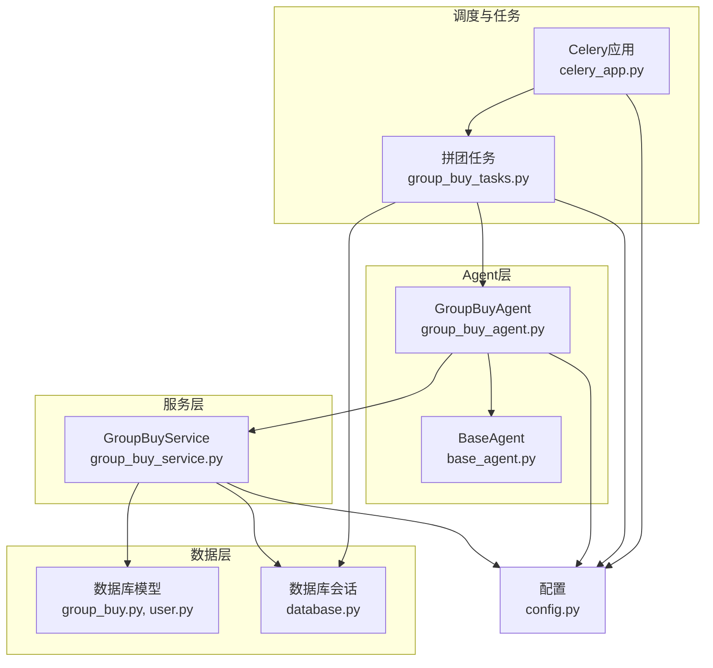
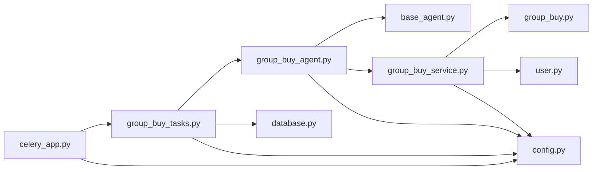
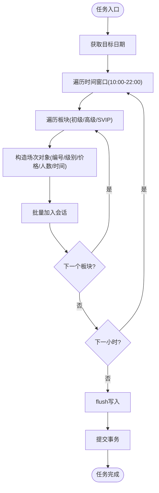

# 每日场次创建任务

<cite>
**本文引用的文件列表**
- [group_buy_tasks.py](file://backend/app/tasks/group_buy_tasks.py)
- [celery_app.py](file://backend/app/tasks/celery_app.py)
- [group_buy_agent.py](file://backend/app/agents/group_buy_agent.py)
- [base_agent.py](file://backend/app/agents/base_agent.py)
- [group_buy_service.py](file://backend/app/services/group_buy_service.py)
- [group_buy.py](file://backend/app/models/group_buy.py)
- [user.py](file://backend/app/models/user.py)
- [database.py](file://backend/app/database.py)
- [config.py](file://backend/app/config.py)
</cite>

## 目录
1. [简介](#简介)
2. [项目结构](#项目结构)
3. [核心组件](#核心组件)
4. [架构总览](#架构总览)
5. [详细组件分析](#详细组件分析)
6. [依赖关系分析](#依赖关系分析)
7. [性能与高并发优化](#性能与高并发优化)
8. [故障排查指南](#故障排查指南)
9. [结论](#结论)
10. [附录](#附录)

## 简介
本技术文档聚焦于AIxingmu的“每日场次创建任务”（create_daily_sessions），深入解析其触发时机、业务逻辑、与GroupBuyAgent的交互方式，以及在Celery同步环境中执行异步代码的机制、数据库会话管理与事务提交策略。同时提供任务配置参数、执行状态监控与错误处理方案，并给出高并发场景下的性能优化建议与扩展性考虑。

## 项目结构
围绕“每日场次创建任务”，关键代码分布在以下模块：
- 定时调度与任务定义：Celery应用与beat计划、拼团相关任务
- Agent编排：GroupBuyAgent负责动作分发与流程控制
- 服务层：GroupBuyService实现具体业务（创建场次、结算等）
- 数据模型：拼团场次、订单、用户钱包流水等
- 数据库与会话：异步引擎与会话工厂
- 配置：全局参数（时间窗口、人数规则、权益比例等）



图表来源
- [celery_app.py:1-56](file://backend/app/tasks/celery_app.py#L1-L56)
- [group_buy_tasks.py:1-54](file://backend/app/tasks/group_buy_tasks.py#L1-L54)
- [group_buy_agent.py:1-67](file://backend/app/agents/group_buy_agent.py#L1-L67)
- [base_agent.py:1-47](file://backend/app/agents/base_agent.py#L1-L47)
- [group_buy_service.py:1-348](file://backend/app/services/group_buy_service.py#L1-L348)
- [group_buy.py:1-158](file://backend/app/models/group_buy.py#L1-L158)
- [user.py:1-93](file://backend/app/models/user.py#L1-L93)
- [database.py:1-40](file://backend/app/database.py#L1-L40)
- [config.py:1-136](file://backend/app/config.py#L1-L136)

章节来源
- [celery_app.py:1-56](file://backend/app/tasks/celery_app.py#L1-L56)
- [group_buy_tasks.py:1-54](file://backend/app/tasks/group_buy_tasks.py#L1-L54)
- [group_buy_agent.py:1-67](file://backend/app/agents/group_buy_agent.py#L1-L67)
- [group_buy_service.py:1-348](file://backend/app/services/group_buy_service.py#L1-L348)
- [group_buy.py:1-158](file://backend/app/models/group_buy.py#L1-L158)
- [user.py:1-93](file://backend/app/models/user.py#L1-L93)
- [database.py:1-40](file://backend/app/database.py#L1-L40)
- [config.py:1-136](file://backend/app/config.py#L1-L136)

## 核心组件
- Celery应用与Beat调度：定义时区、序列化、以及定时任务计划，其中包含“每日9:50创建当日拼团场次”的任务。
- 任务函数：在同步Celery Worker中通过事件循环桥接运行异步代码，管理AsyncSession生命周期与事务提交。
- GroupBuyAgent：基于BaseAgent封装的动作分发器，根据action路由到不同业务分支（创建场次、检查结算、过期处理）。
- GroupBuyService：实现创建每日固定场次、自定义开团、参团、结算等核心业务逻辑。
- 数据模型：GroupBuySession、GroupBuyOrder、User、UserWalletLog等，描述场次、订单、用户资产及流水。
- 数据库会话：异步引擎与会话工厂，提供async_session_factory供任务使用。
- 配置：统一配置项包括时间窗口、每场人数、权益比例等。

章节来源
- [celery_app.py:1-56](file://backend/app/tasks/celery_app.py#L1-L56)
- [group_buy_tasks.py:1-54](file://backend/app/tasks/group_buy_tasks.py#L1-L54)
- [group_buy_agent.py:1-67](file://backend/app/agents/group_buy_agent.py#L1-L67)
- [group_buy_service.py:1-348](file://backend/app/services/group_buy_service.py#L1-L348)
- [group_buy.py:1-158](file://backend/app/models/group_buy.py#L1-L158)
- [user.py:1-93](file://backend/app/models/user.py#L1-L93)
- [database.py:1-40](file://backend/app/database.py#L1-L40)
- [config.py:1-136](file://backend/app/config.py#L1-L136)

## 架构总览
下图展示了从Celery Beat触发到最终落库的完整调用链，涵盖异步桥接、Agent路由、服务层执行与数据库事务提交。

```mermaid
sequenceDiagram
participant Beat as "Celery Beat"
participant Worker as "Celery Worker"
participant Task as "create_daily_sessions"
participant Loop as "run_async(事件循环)"
participant Agent as "GroupBuyAgent"
participant Service as "GroupBuyService"
participant DB as "AsyncSession"
Beat->>Worker : 按crontab调度任务
Worker->>Task : 调用同步任务函数
Task->>Loop : 创建新事件循环并运行协程
Task->>DB : 获取async_session_factory上下文
Task->>Agent : 传入{db, action="create_sessions", date}
Agent->>Service : create_daily_sessions(db, date)
Service->>DB : 批量插入场次记录
Service-->>Agent : 返回已创建场次列表
Agent-->>Task : 返回执行结果
Task->>DB : db.commit()
Task-->>Worker : 返回任务结果
```

图表来源
- [celery_app.py:24-29](file://backend/app/tasks/celery_app.py#L24-L29)
- [group_buy_tasks.py:17-27](file://backend/app/tasks/group_buy_tasks.py#L17-L27)
- [group_buy_agent.py:21-29](file://backend/app/agents/group_buy_agent.py#L21-L29)
- [group_buy_service.py:27-59](file://backend/app/services/group_buy_service.py#L27-L59)
- [database.py:17-21](file://backend/app/database.py#L17-L21)

## 详细组件分析

### 任务触发时机与调度
- 调度入口：Celery Beat在每天9:50触发“app.tasks.group_buy_tasks.create_daily_sessions”。
- 时区设置：Celery应用启用Asia/Shanghai时区，确保定时准确。
- 其他关联任务：每小时第5分钟检查并结算已满场次；每日23:00检查过期场次。

章节来源
- [celery_app.py:15-21](file://backend/app/tasks/celery_app.py#L15-L21)
- [celery_app.py:24-39](file://backend/app/tasks/celery_app.py#L24-L39)

### 异步代码在Celery同步环境中的执行机制
- 同步任务函数内部通过run_async创建独立事件循环，使用loop.run_until_complete运行协程。
- 该模式避免与现有异步框架冲突，保证在Celery Worker线程内安全执行异步代码。
- 注意：每次任务都会新建事件循环并在finally中关闭，避免资源泄漏。

章节来源
- [group_buy_tasks.py:8-14](file://backend/app/tasks/group_buy_tasks.py#L8-L14)
- [group_buy_tasks.py:17-27](file://backend/app/tasks/group_buy_tasks.py#L17-L27)

### 数据库会话管理与事务提交策略
- 会话获取：任务中使用async_session_factory作为上下文管理器，自动管理连接生命周期。
- 事务边界：在Agent执行完成后显式调用db.commit()，确保所有变更一次性落库。
- 异常回滚：若上层或中间抛出异常，需确保回滚路径正确（当前任务未捕获异常，由外层或数据库驱动处理）。

章节来源
- [group_buy_tasks.py:20-27](file://backend/app/tasks/group_buy_tasks.py#L20-L27)
- [database.py:17-21](file://backend/app/database.py#L17-L21)

### GroupBuyAgent与业务逻辑交互
- 动作分发：根据context.action选择分支，create_sessions调用GroupBuyService.create_daily_sessions。
- 日志与状态：继承BaseAgent，统一记录执行开始/结束与异常信息，返回标准化结果结构。
- 单次执行：should_continue返回False，表示任务为一次性执行。

章节来源
- [group_buy_agent.py:15-67](file://backend/app/agents/group_buy_agent.py#L15-L67)
- [base_agent.py:12-47](file://backend/app/agents/base_agent.py#L12-L47)

### 场次创建业务逻辑
- 时间窗口：依据配置GROUP_BUY_START_HOUR至GROUP_BUY_END_HOUR（默认10:00-22:00），每小时生成一个时间段。
- 板块并行：每个小时创建三个场次（初级/高级/SVIP），分别对应不同倍数与总价。
- 字段填充：场次编号、级别、价格、人数规则、状态、起止时间等按配置与模型约束写入。
- 批量写入：使用db.add批量添加后flush，减少往返开销。

章节来源
- [group_buy_service.py:27-59](file://backend/app/services/group_buy_service.py#L27-L59)
- [group_buy.py:42-86](file://backend/app/models/group_buy.py#L42-L86)
- [config.py:42-58](file://backend/app/config.py#L42-L58)

### 数据模型与约束
- GroupBuySession：场次主表，含唯一场次编号、级别、人数、状态、时间、赢家ID等。
- GroupBuyOrder：订单表，记录用户参与、金额、状态、权益与补贴明细。
- User与UserWalletLog：用户资产与变动流水，保障资金与权益可追溯。

章节来源
- [group_buy.py:42-158](file://backend/app/models/group_buy.py#L42-L158)
- [user.py:26-93](file://backend/app/models/user.py#L26-L93)

### 任务配置参数
- 时间窗口：GROUP_BUY_START_HOUR=10，GROUP_BUY_END_HOUR=22
- 人数规则：GROUP_BUY_TOTAL_PLAYERS=31，GROUP_BUY_WINNERS=1，GROUP_BUY_LOSERS=30
- 单组限制：GROUP_BUY_MAX_ORDERS_PER_USER=5
- 定价与倍数：BEER_PRICE_PER_BOX=288，三大板块倍数分别为1/5/40
- 权益比例：WIN_*与LOSE_*系列比例用于结算分配

章节来源
- [config.py:42-88](file://backend/app/config.py#L42-L88)

## 依赖关系分析
- Celery应用依赖配置（broker、backend、时区、序列化）。
- 任务函数依赖数据库会话工厂与GroupBuyAgent。
- GroupBuyAgent依赖BaseAgent与GroupBuyService。
- GroupBuyService依赖数据模型与配置。
- 数据模型依赖数据库基类与外键关系。



图表来源
- [celery_app.py:1-56](file://backend/app/tasks/celery_app.py#L1-L56)
- [group_buy_tasks.py:1-54](file://backend/app/tasks/group_buy_tasks.py#L1-L54)
- [group_buy_agent.py:1-67](file://backend/app/agents/group_buy_agent.py#L1-L67)
- [base_agent.py:1-47](file://backend/app/agents/base_agent.py#L1-L47)
- [group_buy_service.py:1-348](file://backend/app/services/group_buy_service.py#L1-L348)
- [group_buy.py:1-158](file://backend/app/models/group_buy.py#L1-L158)
- [user.py:1-93](file://backend/app/models/user.py#L1-L93)
- [database.py:1-40](file://backend/app/database.py#L1-L40)
- [config.py:1-136](file://backend/app/config.py#L1-L136)

章节来源
- [celery_app.py:1-56](file://backend/app/tasks/celery_app.py#L1-L56)
- [group_buy_tasks.py:1-54](file://backend/app/tasks/group_buy_tasks.py#L1-L54)
- [group_buy_agent.py:1-67](file://backend/app/agents/group_buy_agent.py#L1-L67)
- [group_buy_service.py:1-348](file://backend/app/services/group_buy_service.py#L1-L348)
- [group_buy.py:1-158](file://backend/app/models/group_buy.py#L1-L158)
- [user.py:1-93](file://backend/app/models/user.py#L1-L93)
- [database.py:1-40](file://backend/app/database.py#L1-L40)
- [config.py:1-136](file://backend/app/config.py#L1-L136)

## 性能与高并发优化
- 批量写入与索引优化
  - 使用db.add批量添加场次后再flush，降低IO次数。
  - 对常用查询字段建立索引（如level、status、start_time、end_time），提升筛选效率。
- 数据库连接池
  - 调整DATABASE_POOL_SIZE与DATABASE_MAX_OVERFLOW以匹配并发量，避免连接耗尽。
- 任务粒度拆分
  - 将“创建场次”与“结算”拆分为独立任务，避免长事务与锁竞争。
- 幂等与去重
  - 场次编号唯一约束防止重复创建；可在任务层增加幂等校验（如按日期+小时+级别去重）。
- 超时与重试
  - 为任务设置超时与重试策略，避免长时间阻塞Worker；对瞬时失败进行指数退避重试。
- 读写分离与缓存
  - 热点查询（如活跃场次列表）可引入Redis缓存，减轻数据库压力。
- 批处理与分片
  - 对大规模结算场景采用分片处理，分批提交，降低单事务大小。

[本节为通用性能建议，不直接分析具体文件]

## 故障排查指南
- 任务未触发
  - 检查Celery Beat是否启动且时区配置正确。
  - 确认beat_schedule中任务名与调度表达式无误。
- 异步执行异常
  - 检查run_async是否正确创建并关闭事件循环。
  - 确认协程内部未混用阻塞I/O导致死锁。
- 数据库会话问题
  - 确认async_session_factory上下文正确进入与退出。
  - 检查commit前是否有未flush的数据或异常导致回滚。
- 业务逻辑错误
  - 查看Agent日志输出，定位action分支与异常堆栈。
  - 核对配置项（时间窗口、人数、比例）是否符合预期。
- 监控与告警
  - 利用Celery结果后端记录任务状态与耗时。
  - 对失败任务设置告警通道，便于快速响应。

章节来源
- [celery_app.py:15-21](file://backend/app/tasks/celery_app.py#L15-L21)
- [celery_app.py:24-39](file://backend/app/tasks/celery_app.py#L24-L39)
- [group_buy_tasks.py:8-14](file://backend/app/tasks/group_buy_tasks.py#L8-L14)
- [group_buy_agent.py:31-40](file://backend/app/agents/group_buy_agent.py#L31-L40)
- [database.py:17-21](file://backend/app/database.py#L17-L21)

## 结论
“每日场次创建任务”通过Celery Beat在9:50准时触发，借助事件循环桥接在同步Worker中安全执行异步代码，结合GroupBuyAgent的动作分发与GroupBuyService的业务实现，完成每日多时段、多板块场次的批量创建。数据库会话与事务边界清晰，配合合理的索引与连接池配置，可满足日常并发需求。在高并发场景下，建议引入幂等、重试、缓存与分片等策略进一步提升稳定性与可扩展性。

[本节为总结性内容，不直接分析具体文件]

## 附录

### 关键流程图：场次创建算法


图表来源
- [group_buy_service.py:27-59](file://backend/app/services/group_buy_service.py#L27-L59)
- [group_buy_tasks.py:17-27](file://backend/app/tasks/group_buy_tasks.py#L17-L27)
- [database.py:17-21](file://backend/app/database.py#L17-L21)