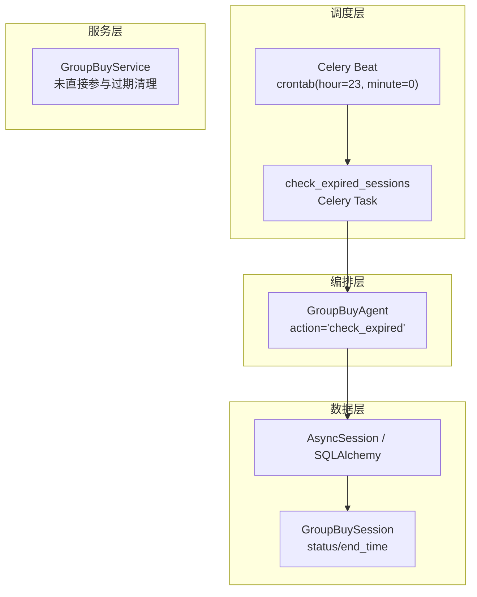
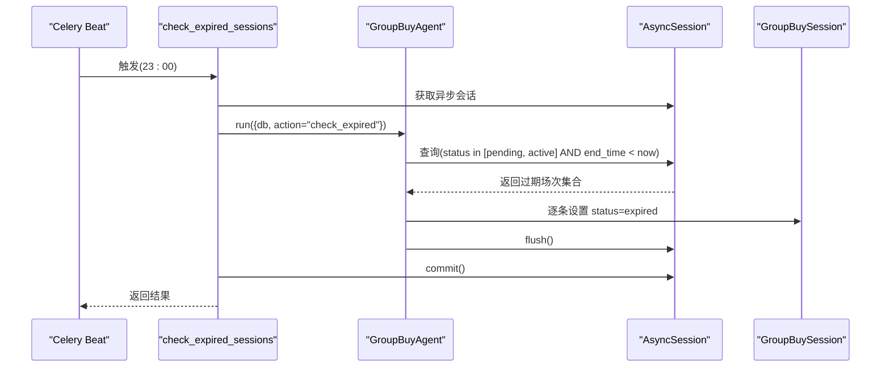
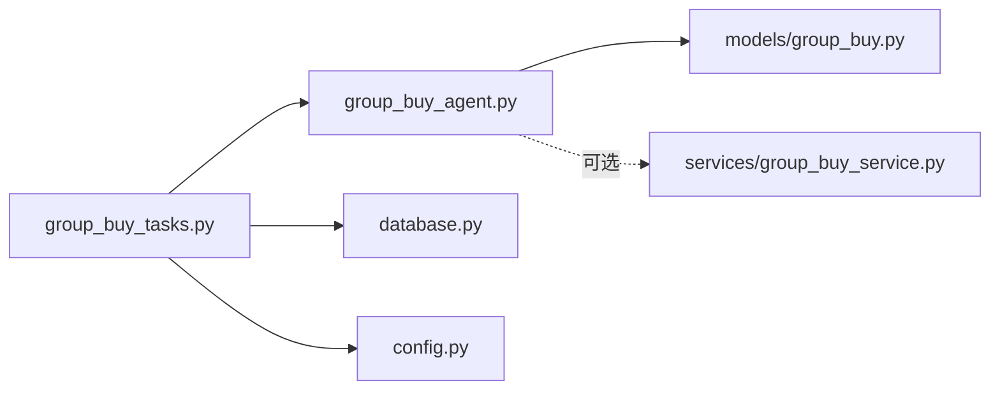

# 过期场次清理任务

<cite>
**本文引用的文件列表**
- [group_buy_tasks.py](file://backend/app/tasks/group_buy_tasks.py)
- [celery_app.py](file://backend/app/tasks/celery_app.py)
- [group_buy_agent.py](file://backend/app/agents/group_buy_agent.py)
- [group_buy_service.py](file://backend/app/services/group_buy_service.py)
- [group_buy.py](file://backend/app/models/group_buy.py)
- [database.py](file://backend/app/database.py)
- [config.py](file://backend/app/config.py)
</cite>

## 目录
1. [简介](#简介)
2. [项目结构](#项目结构)
3. [核心组件](#核心组件)
4. [架构总览](#架构总览)
5. [详细组件分析](#详细组件分析)
6. [依赖关系分析](#依赖关系分析)
7. [性能与批量优化](#性能与批量优化)
8. [事务与一致性](#事务与一致性)
9. [状态跟踪、异常处理与重试](#状态跟踪异常处理与重试)
10. [数据完整性验证与监控](#数据完整性验证与监控)
11. [故障排查指南](#故障排查指南)
12. [结论](#结论)

## 简介
本技术文档围绕“AIxingmu”拼团业务中的“过期场次清理任务”展开，聚焦于 check_expired_sessions 任务的实现原理与工程化落地。内容涵盖：
- 每日 23:00 定时执行机制（Celery Beat）
- 过期场次的判定规则（时间窗口与状态过滤）
- 数据清理策略（状态置为已过期）
- 数据访问模式（异步会话、批量更新）
- 事务管理机制（提交与回滚边界）
- 批量操作优化建议
- 任务执行状态跟踪、异常处理与重试方案
- 数据完整性校验与清理效果监控方法

## 项目结构
该任务位于后端 Celery 任务层，通过调度器触发，调用 Agent 编排逻辑，最终对数据库进行查询与更新。关键文件组织如下：
- 任务定义与调度：tasks/group_buy_tasks.py、tasks/celery_app.py
- 业务编排：agents/group_buy_agent.py
- 服务层：services/group_buy_service.py
- 数据模型：models/group_buy.py
- 数据库与会话：database.py
- 配置项：config.py

图表来源
- [celery_app.py:24-39](file://backend/app/tasks/celery_app.py#L24-L39)
- [group_buy_tasks.py:43-53](file://backend/app/tasks/group_buy_tasks.py#L43-L53)
- [group_buy_agent.py:48-61](file://backend/app/agents/group_buy_agent.py#L48-L61)
- [group_buy.py:42-86](file://backend/app/models/group_buy.py#L42-L86)

章节来源
- [group_buy_tasks.py:1-54](file://backend/app/tasks/group_buy_tasks.py#L1-L54)
- [celery_app.py:1-44](file://backend/app/tasks/celery_app.py#L1-L44)

## 核心组件
- 定时任务入口：check_expired_sessions（Celery 任务）
- 调度配置：Celery Beat crontab 表达式
- 编排器：GroupBuyAgent（根据 action 分发到不同流程）
- 数据模型：GroupBuySession（包含 status、end_time 等关键字段）
- 数据库会话：async_session_factory（异步会话工厂）

章节来源
- [group_buy_tasks.py:43-53](file://backend/app/tasks/group_buy_tasks.py#L43-L53)
- [celery_app.py:34-39](file://backend/app/tasks/celery_app.py#L34-L39)
- [group_buy_agent.py:48-61](file://backend/app/agents/group_buy_agent.py#L48-L61)
- [group_buy.py:42-86](file://backend/app/models/group_buy.py#L42-L86)
- [database.py:17-21](file://backend/app/database.py#L17-L21)

## 架构总览
从调度到落库的完整链路如下：
- Celery Beat 在每天 23:00 触发 check_expired_sessions 任务
- 任务内创建异步会话，构造 GroupBuyAgent 并传入 action="check_expired"
- Agent 查询待过期场次（状态为 pending/active 且 end_time < now），将状态置为 expired
- 使用 flush 写入变更，外层 commit 提交事务

图表来源
- [celery_app.py:34-39](file://backend/app/tasks/celery_app.py#L34-L39)
- [group_buy_tasks.py:43-53](file://backend/app/tasks/group_buy_tasks.py#L43-L53)
- [group_buy_agent.py:48-61](file://backend/app/agents/group_buy_agent.py#L48-L61)
- [group_buy.py:42-86](file://backend/app/models/group_buy.py#L42-L86)

## 详细组件分析

### 定时任务：check_expired_sessions
- 职责：作为 Celery 任务入口，负责会话生命周期管理、调用 Agent 执行具体逻辑、提交事务。
- 关键点：
  - 使用 async_session_factory 提供异步会话上下文
  - 通过 run_async 包装协程，适配同步 Celery 任务
  - 在 Agent 执行完成后显式 commit

章节来源
- [group_buy_tasks.py:43-53](file://backend/app/tasks/group_buy_tasks.py#L43-L53)
- [group_buy_tasks.py:8-14](file://backend/app/tasks/group_buy_tasks.py#L8-L14)
- [database.py:17-21](file://backend/app/database.py#L17-L21)

### 调度配置：Celery Beat
- 表达式：hour=23, minute=0，即每日 23:00 执行一次
- 时区：Asia/Shanghai，enable_utc=True
- 其他相关任务：开团创建、满员结算等（与本任务同属 group_buy 任务集）

章节来源
- [celery_app.py:15-21](file://backend/app/tasks/celery_app.py#L15-L21)
- [celery_app.py:34-39](file://backend/app/tasks/celery_app.py#L34-L39)

### 编排器：GroupBuyAgent
- 当 action="check_expired" 时：
  - 取当前 UTC 时间 now
  - 查询条件：status ∈ {pending, active} 且 end_time < now
  - 遍历结果，将每条记录的 status 设置为 expired
  - 调用 flush 持久化变更
- 注意：此处仅做状态标记，不做物理删除或级联清理

章节来源
- [group_buy_agent.py:48-61](file://backend/app/agents/group_buy_agent.py#L48-L61)
- [group_buy.py:22-30](file://backend/app/models/group_buy.py#L22-L30)

### 数据模型：GroupBuySession
- 关键字段：
  - status：枚举值包含 pending、active、full、completed、cancelled、expired
  - end_time：场次截止时间
  - start_time：场次开始时间
- 索引：
  - idx_session_level_status、idx_session_time（有助于按时间与状态筛选）

章节来源
- [group_buy.py:42-86](file://backend/app/models/group_buy.py#L42-L86)

### 服务层：GroupBuyService
- 本任务不直接调用服务层；但服务层定义了完整的结算流程（用于满员场景）。
- 参考意义：理解 session 状态机与订单流转，便于后续扩展过期清理时的关联处理（如订单状态联动）。

章节来源
- [group_buy_service.py:183-321](file://backend/app/services/group_buy_service.py#L183-L321)

## 依赖关系分析
- 任务层依赖：
  - celery_app（任务装饰器、beat_schedule）
  - database（异步会话工厂）
  - agents.group_buy_agent（业务编排）
- 编排层依赖：
  - models.group_buy（字段与枚举）
  - services.group_buy_service（可选，当前过期清理未使用）
- 数据层依赖：
  - sqlalchemy AsyncSession + select 查询
  - 数据库引擎与连接池由 config 驱动

图表来源
- [group_buy_tasks.py:1-54](file://backend/app/tasks/group_buy_tasks.py#L1-L54)
- [group_buy_agent.py:1-67](file://backend/app/agents/group_buy_agent.py#L1-L67)
- [group_buy.py:1-158](file://backend/app/models/group_buy.py#L1-L158)
- [database.py:1-40](file://backend/app/database.py#L1-L40)
- [config.py:1-145](file://backend/app/config.py#L1-L145)

章节来源
- [group_buy_tasks.py:1-54](file://backend/app/tasks/group_buy_tasks.py#L1-L54)
- [group_buy_agent.py:1-67](file://backend/app/agents/group_buy_agent.py#L1-L67)
- [group_buy.py:1-158](file://backend/app/models/group_buy.py#L1-L158)
- [database.py:1-40](file://backend/app/database.py#L1-L40)
- [config.py:1-145](file://backend/app/config.py#L1-L145)

## 性能与批量优化
现状说明
- 当前实现采用“查询后逐条更新”的方式：先 select 出所有过期场次，再循环设置 status=expired，最后 flush。
- 优点：实现简单、易于调试。
- 风险：当过期场次数量较大时，逐条更新会产生较多往返与锁竞争。

优化建议（面向生产）
- 使用 SQL 批量更新：以一条 UPDATE 语句一次性将满足条件的记录置为 expired，减少应用层循环与多次 flush。
- 分页扫描：若历史数据量极大，可基于 end_time 或 id 分片分批处理，避免单次大事务。
- 索引利用：确保按 status 与 end_time 的复合查询命中现有索引（如 idx_session_time、idx_session_level_status）。
- 事务粒度：尽量缩小事务范围，仅在必要时 commit，降低锁持有时间。

[本节为通用性能指导，不直接分析具体代码行]

## 事务与一致性
- 会话生命周期：
  - 任务内使用 async_session_factory 创建会话，Agent 执行结束后由任务层 commit。
- 一致性保障：
  - 若 Agent 内部抛出异常，外层未捕获则会导致任务失败；建议在任务层增加 try/except 与回滚逻辑，保证会话关闭与资源释放。
  - 当前过期清理仅修改单表状态，无跨表复杂事务，但仍需关注并发写冲突（例如同一场次被其他任务同时修改）。

章节来源
- [group_buy_tasks.py:43-53](file://backend/app/tasks/group_buy_tasks.py#L43-L53)
- [database.py:29-39](file://backend/app/database.py#L29-L39)

## 状态跟踪、异常处理与重试

### 执行状态跟踪
- 任务返回值：Agent 返回 {"action": "check_expired", "expired_count": N}，可用于日志与监控埋点。
- 建议增强：
  - 记录每次执行的开始/结束时间、受影响行数、耗时
  - 将结果写入审计表或指标系统（如 Prometheus/Grafana）

章节来源
- [group_buy_agent.py:48-61](file://backend/app/agents/group_buy_agent.py#L48-L61)

### 异常处理
- 现状：
  - 任务层未显式捕获异常；若 Agent 抛错，Celery 会记录失败并可能重试（取决于全局重试策略）。
- 建议：
  - 在任务层包裹 try/except，捕获异常后记录错误详情、执行回滚（若会话仍有效）、上报告警。
  - 区分可重试异常（如网络抖动、临时锁等待）与不可重试异常（如参数错误、数据不一致）。

章节来源
- [group_buy_tasks.py:43-53](file://backend/app/tasks/group_buy_tasks.py#L43-L53)

### 重试机制
- 现状：
  - 未在任务上声明 retry 相关参数；是否重试取决于 Celery 全局配置。
- 建议：
  - 为 check_expired_sessions 添加 @task(retry_backoff=True, max_retries=3, default_retry_delay=...) 等参数
  - 针对幂等性：由于过期清理是幂等操作（重复执行不会造成副作用），重试是安全的

章节来源
- [group_buy_tasks.py:43-53](file://backend/app/tasks/group_buy_tasks.py#L43-L53)

## 数据完整性验证与监控

### 数据完整性验证
- 目标：确保过期清理后，不存在“已结束但未标记为过期”的数据残留。
- 验证思路：
  - 定时抽样检查：统计 status ∈ {pending, active} 且 end_time < now 的记录数，期望为 0
  - 对比审计：将每次清理的 expired_count 与上述计数差异纳入告警阈值

章节来源
- [group_buy_agent.py:48-61](file://backend/app/agents/group_buy_agent.py#L48-L61)
- [group_buy.py:42-86](file://backend/app/models/group_buy.py#L42-L86)

### 清理效果监控
- 指标建议：
  - 任务成功率、平均耗时、失败次数
  - 每次清理的过期场次数量分布（直方图）
  - 异常类型占比（超时、锁等待、约束冲突等）
- 可视化：
  - 接入统一监控平台，展示趋势与告警阈值

[本节为通用监控建议，不直接分析具体代码行]

## 故障排查指南
- 现象：23:00 任务未执行
  - 核查 Celery Beat 是否运行、时区配置是否正确、crontab 表达式是否生效
- 现象：任务执行成功但仍有过期场次未清理
  - 核查数据库时区与 now 取值（UTC vs 本地时区）
  - 核查是否存在并发任务修改了相同场次状态
- 现象：任务频繁失败
  - 查看 Celery Worker 日志与任务结果后端
  - 确认数据库连接池与锁等待情况
  - 评估是否需要引入重试与退避策略

章节来源
- [celery_app.py:15-21](file://backend/app/tasks/celery_app.py#L15-L21)
- [celery_app.py:34-39](file://backend/app/tasks/celery_app.py#L34-L39)
- [group_buy_agent.py:48-61](file://backend/app/agents/group_buy_agent.py#L48-L61)

## 结论
check_expired_sessions 任务以简洁清晰的方式完成“过期场次状态置为已过期”的核心职责。其优势在于实现直观、维护成本低；在生产环境中，建议结合批量更新、事务边界控制、异常重试与完善监控，进一步提升稳定性与可观测性。对于更复杂的清理需求（如关联订单状态联动、归档或物理删除），可在保持幂等性的前提下逐步扩展。