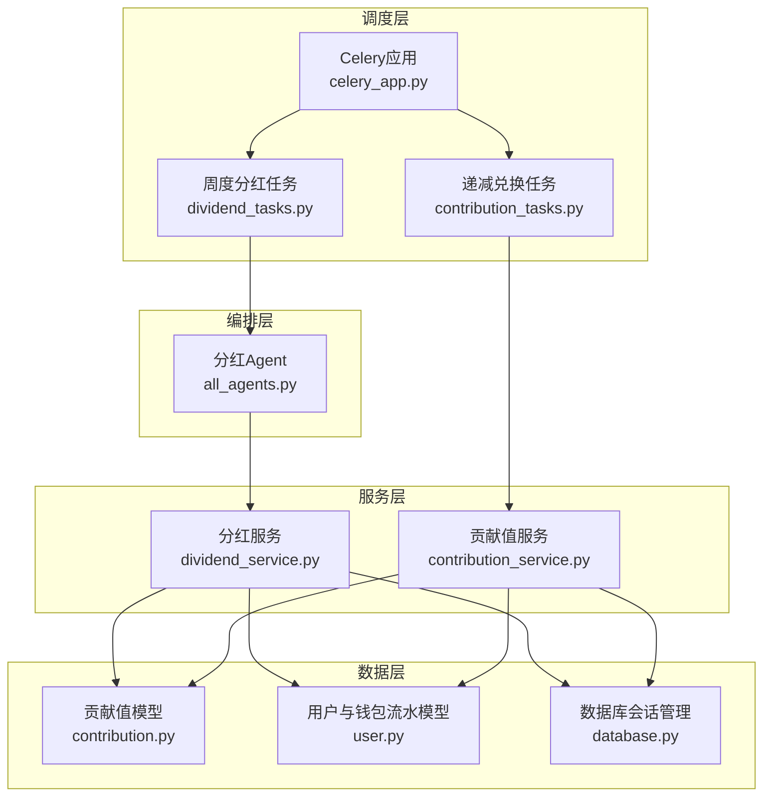
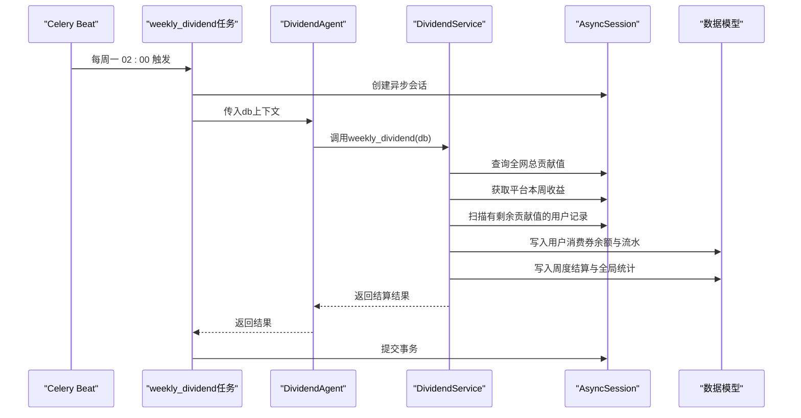
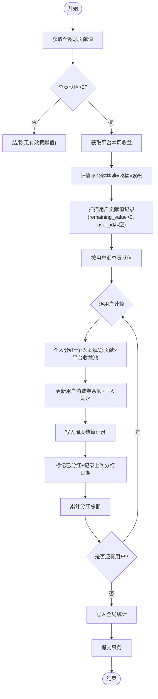
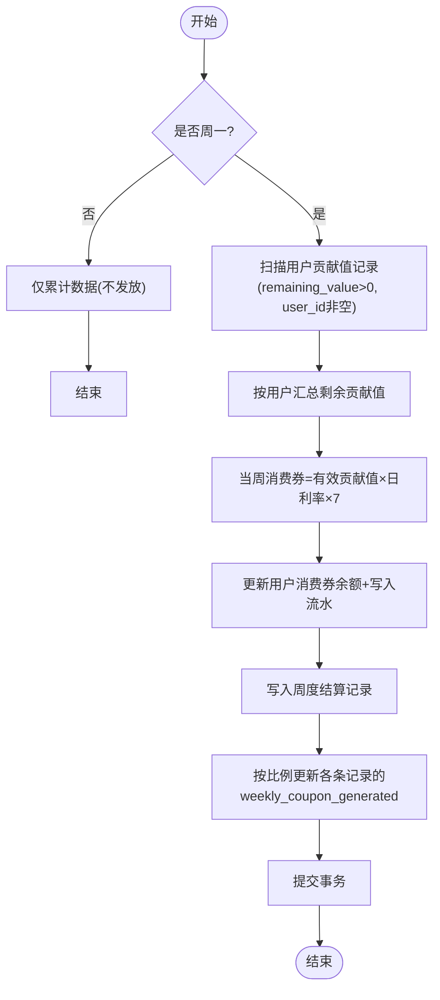
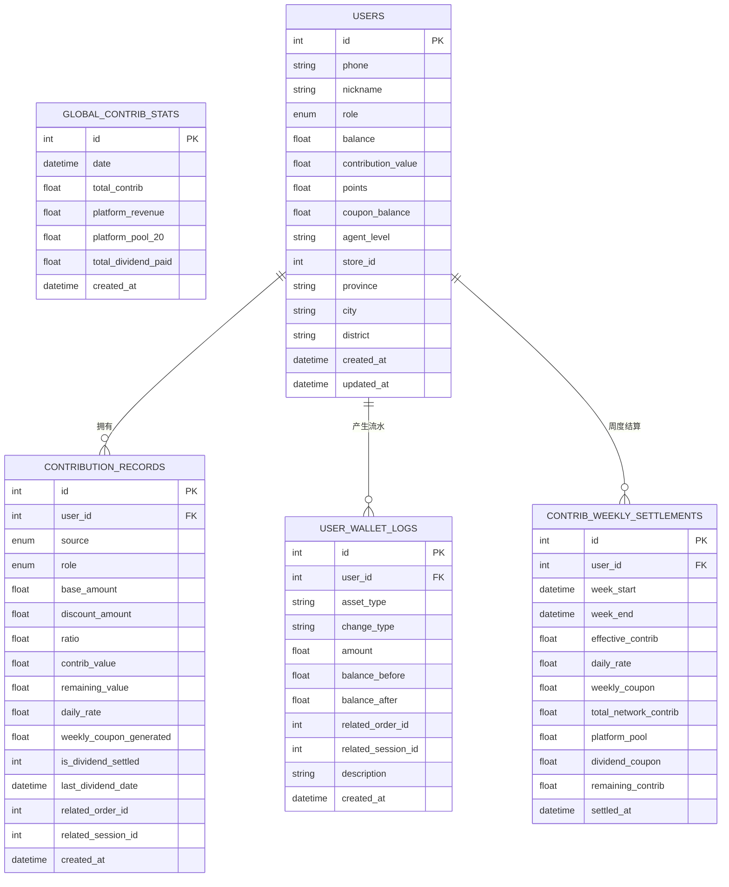
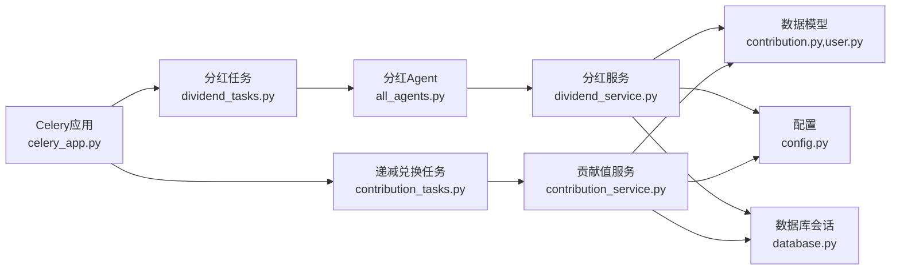

# 贡献值分红任务

<cite>
**本文引用的文件**   
- [dividend_tasks.py](file://backend/app/tasks/dividend_tasks.py)
- [contribution_tasks.py](file://backend/app/tasks/contribution_tasks.py)
- [celery_app.py](file://backend/app/tasks/celery_app.py)
- [all_agents.py](file://backend/app/agents/all_agents.py)
- [dividend_service.py](file://backend/app/services/dividend_service.py)
- [contribution_service.py](file://backend/app/services/contribution_service.py)
- [contribution.py](file://backend/app/models/contribution.py)
- [user.py](file://backend/app/models/user.py)
- [database.py](file://backend/app/database.py)
- [config.py](file://backend/app/config.py)
</cite>

## 目录
1. [简介](#简介)
2. [项目结构](#项目结构)
3. [核心组件](#核心组件)
4. [架构总览](#架构总览)
5. [详细组件分析](#详细组件分析)
6. [依赖关系分析](#依赖关系分析)
7. [性能与可扩展性](#性能与可扩展性)
8. [故障排查指南](#故障排查指南)
9. [结论](#结论)
10. [附录](#附录)

## 简介
本技术文档围绕AIxingmu的贡献值分红异步任务系统，重点解析以下两个定时任务：
- 周度贡献值分红任务（weekly_dividend）：每周一凌晨执行，基于全网有效贡献值与平台收益池进行消费券分红。
- 递减兑换核算任务（daily_contribution_check）：每日凌晨执行，累计用户贡献值并仅在周一发放当周递减兑换的消费券。

文档将深入说明数据来源、计算逻辑、结果存储、事务处理与回滚机制，并提供大规模数据处理时的性能优化建议及分布式一致性保障方案。

## 项目结构
与贡献值分红相关的后端模块主要分布在 tasks、services、models、agents、tasks.celery_app 等目录中，采用“任务调度 → Agent编排 → 服务层实现 → 数据模型”的分层设计。

图表来源
- [celery_app.py:24-55](file://backend/app/tasks/celery_app.py#L24-L55)
- [dividend_tasks.py:15-25](file://backend/app/tasks/dividend_tasks.py#L15-L25)
- [contribution_tasks.py:15-28](file://backend/app/tasks/contribution_tasks.py#L15-L28)
- [all_agents.py:52-62](file://backend/app/agents/all_agents.py#L52-L62)
- [dividend_service.py:16-123](file://backend/app/services/dividend_service.py#L16-L123)
- [contribution_service.py:16-261](file://backend/app/services/contribution_service.py#L16-L261)
- [contribution.py:32-115](file://backend/app/models/contribution.py#L32-L115)
- [user.py:26-93](file://backend/app/models/user.py#L26-L93)
- [database.py:17-21](file://backend/app/database.py#L17-L21)

章节来源
- [celery_app.py:24-55](file://backend/app/tasks/celery_app.py#L24-L55)
- [dividend_tasks.py:15-25](file://backend/app/tasks/dividend_tasks.py#L15-L25)
- [contribution_tasks.py:15-28](file://backend/app/tasks/contribution_tasks.py#L15-L28)
- [all_agents.py:52-62](file://backend/app/agents/all_agents.py#L52-L62)
- [dividend_service.py:16-123](file://backend/app/services/dividend_service.py#L16-L123)
- [contribution_service.py:16-261](file://backend/app/services/contribution_service.py#L16-L261)
- [contribution.py:32-115](file://backend/app/models/contribution.py#L32-L115)
- [user.py:26-93](file://backend/app/models/user.py#L26-L93)
- [database.py:17-21](file://backend/app/database.py#L17-L21)

## 核心组件
- 任务调度器（Celery Beat）：定义每周一次和每日一次的定时任务触发策略。
- 任务入口：
  - weekly_dividend：调用分红Agent，进入异步会话执行分红结算。
  - daily_contribution_check：每日累计贡献值，仅周一进行递减兑换结算并发放消费券。
- 分红Agent：作为统一编排点，调用分红服务完成计算与落库。
- 服务层：
  - DividendService.weekly_dividend：计算平台收益池、汇总用户贡献值、按权重分配消费券、记录结算与统计。
  - ContributionService.weekly_settle：计算当周递减兑换消费券并发放，更新记录与结算表。
- 数据模型：贡献值记录、周度结算、全局统计、用户与钱包流水。
- 配置：贡献值分配比例、日利率、让利比例等关键参数。

章节来源
- [celery_app.py:24-55](file://backend/app/tasks/celery_app.py#L24-L55)
- [dividend_tasks.py:15-25](file://backend/app/tasks/dividend_tasks.py#L15-L25)
- [contribution_tasks.py:15-28](file://backend/app/tasks/contribution_tasks.py#L15-L28)
- [all_agents.py:52-62](file://backend/app/agents/all_agents.py#L52-L62)
- [dividend_service.py:16-123](file://backend/app/services/dividend_service.py#L16-L123)
- [contribution_service.py:163-240](file://backend/app/services/contribution_service.py#L163-L240)
- [contribution.py:32-115](file://backend/app/models/contribution.py#L32-L115)
- [user.py:26-93](file://backend/app/models/user.py#L26-L93)
- [config.py:60-106](file://backend/app/config.py#L60-L106)

## 架构总览
整体流程由 Celery Beat 驱动，任务在 Worker 中执行，通过异步数据库会话访问持久化层。分红与递减兑换两条链路相互独立但共享同一套贡献值数据与用户资产表。

图表来源
- [celery_app.py:40-44](file://backend/app/tasks/celery_app.py#L40-L44)
- [dividend_tasks.py:15-25](file://backend/app/tasks/dividend_tasks.py#L15-L25)
- [all_agents.py:52-62](file://backend/app/agents/all_agents.py#L52-L62)
- [dividend_service.py:16-123](file://backend/app/services/dividend_service.py#L16-L123)
- [contribution.py:72-115](file://backend/app/models/contribution.py#L72-L115)
- [user.py:74-93](file://backend/app/models/user.py#L74-L93)

## 详细组件分析

### 周度贡献值分红任务（weekly_dividend）
- 触发时机：每周一凌晨2:00。
- 执行路径：任务函数 → 异步会话 → 分红Agent → 分红服务 → 数据模型。
- 核心算法：
  - 平台收益池 = 平台本周收益 × 20%。
  - 个人分红 = 个人有效贡献值 / 全网总贡献值 × 平台收益池。
  - 分红后不扣减贡献值，仅标记已参与本期分红并记录上次分红日期。
- 数据来源：
  - 全网总贡献值：从贡献值记录表中聚合 remaining_value > 0 的总和。
  - 平台本周收益：从平台财务统计表按周范围求和。
  - 用户贡献值：扫描 user_id 非空且 remaining_value > 0 的记录并按用户汇总。
- 结果存储：
  - 用户消费券余额增加，并写入钱包流水。
  - 写入 ContribWeeklySettlement 记录（含 effective_contrib、platform_pool、dividend_coupon 等）。
  - 写入 GlobalContribStats 记录（total_contrib、platform_revenue、platform_pool_20、total_dividend_paid）。
- 事务与回滚：
  - 使用 async_session_factory 包裹执行，成功后 commit；异常时由会话管理器负责 rollback。
- 准确性验证要点：
  - 全网总贡献值与平台收益池需与财务对账一致。
  - 各用户分红之和应等于 total_dividend_paid，且与 platform_pool_20 匹配（考虑四舍五入误差）。
  - 每个用户的 is_dividend_settled 与 last_dividend_date 应与结算周期一致。

图表来源
- [dividend_service.py:16-123](file://backend/app/services/dividend_service.py#L16-L123)
- [contribution_service.py:252-261](file://backend/app/services/contribution_service.py#L252-L261)
- [contribution.py:72-115](file://backend/app/models/contribution.py#L72-L115)
- [user.py:74-93](file://backend/app/models/user.py#L74-L93)

章节来源
- [dividend_tasks.py:15-25](file://backend/app/tasks/dividend_tasks.py#L15-L25)
- [all_agents.py:52-62](file://backend/app/agents/all_agents.py#L52-L62)
- [dividend_service.py:16-123](file://backend/app/services/dividend_service.py#L16-L123)
- [contribution_service.py:252-261](file://backend/app/services/contribution_service.py#L252-L261)
- [contribution.py:72-115](file://backend/app/models/contribution.py#L72-L115)
- [user.py:74-93](file://backend/app/models/user.py#L74-L93)
- [database.py:17-21](file://backend/app/database.py#L17-L21)

### 递减兑换核算任务（daily_contribution_check）
- 触发时机：每日凌晨3:00。
- 执行策略：
  - 非周一：仅累计数据（不做发放），返回提示。
  - 周一：执行 weekly_settle，计算当周消费券并发放。
- 计算公式：
  - 当周消费券 = 有效贡献值 × 日利率 × 7。
  - 贡献值不扣减，继续参与下期。
- 数据来源：
  - 所有 user_id 非空且 remaining_value > 0 的贡献值记录。
- 结果存储：
  - 用户消费券余额增加，并写入钱包流水。
  - 写入 ContribWeeklySettlement 记录（effective_contrib、weekly_coupon、remaining_contrib 等）。
  - 更新每条贡献值记录的 weekly_coupon_generated 字段（按比例分摊到各条记录）。
- 事务与回滚：
  - 与分红任务相同，使用异步会话并在成功时提交，异常时回滚。

图表来源
- [contribution_tasks.py:15-28](file://backend/app/tasks/contribution_tasks.py#L15-L28)
- [contribution_service.py:163-240](file://backend/app/services/contribution_service.py#L163-L240)
- [contribution.py:32-115](file://backend/app/models/contribution.py#L32-L115)
- [user.py:74-93](file://backend/app/models/user.py#L74-L93)

章节来源
- [contribution_tasks.py:15-28](file://backend/app/tasks/contribution_tasks.py#L15-L28)
- [contribution_service.py:163-240](file://backend/app/services/contribution_service.py#L163-L240)
- [contribution.py:32-115](file://backend/app/models/contribution.py#L32-L115)
- [user.py:74-93](file://backend/app/models/user.py#L74-L93)
- [database.py:17-21](file://backend/app/database.py#L17-L21)

### 数据模型与关系
- ContributionRecord：贡献值明细，包含 base_amount、discount_amount、ratio、contrib_value、remaining_value、daily_rate、weekly_coupon_generated、is_dividend_settled、last_dividend_date 等字段。
- ContribWeeklySettlement：周度结算记录，记录 effective_contrib、daily_rate、weekly_coupon、total_network_contrib、platform_pool、dividend_coupon、remaining_contrib 等。
- GlobalContribStats：全网贡献值统计，用于分红计算与审计。
- UserWalletLog：用户钱包流水，记录资产变动前后余额与描述。

图表来源
- [contribution.py:32-115](file://backend/app/models/contribution.py#L32-L115)
- [user.py:26-93](file://backend/app/models/user.py#L26-L93)

章节来源
- [contribution.py:32-115](file://backend/app/models/contribution.py#L32-L115)
- [user.py:26-93](file://backend/app/models/user.py#L26-L93)

### 配置与参数
- 贡献值分配比例：消费者50%、合作商家20%、推荐商家8%、推荐消费者5%、代理合计7%、平台10%。
- 整体让利比例：20%。
- 贡献值乘数：10。
- 递减兑换日利率默认：万分之五，最低万分之0.1，最高万分之10。
- 结算周期：每周一。

章节来源
- [config.py:60-106](file://backend/app/config.py#L60-L106)

## 依赖关系分析
- 任务层依赖 Celery 应用与调度配置。
- 任务函数依赖异步数据库会话工厂。
- Agent 层依赖服务层。
- 服务层依赖数据模型与配置。
- 数据层提供连接与会话管理。

图表来源
- [celery_app.py:24-55](file://backend/app/tasks/celery_app.py#L24-L55)
- [dividend_tasks.py:15-25](file://backend/app/tasks/dividend_tasks.py#L15-L25)
- [contribution_tasks.py:15-28](file://backend/app/tasks/contribution_tasks.py#L15-L28)
- [all_agents.py:52-62](file://backend/app/agents/all_agents.py#L52-L62)
- [dividend_service.py:16-123](file://backend/app/services/dividend_service.py#L16-L123)
- [contribution_service.py:16-261](file://backend/app/services/contribution_service.py#L16-L261)
- [contribution.py:32-115](file://backend/app/models/contribution.py#L32-L115)
- [user.py:26-93](file://backend/app/models/user.py#L26-L93)
- [database.py:17-21](file://backend/app/database.py#L17-L21)
- [config.py:60-106](file://backend/app/config.py#L60-L106)

章节来源
- [celery_app.py:24-55](file://backend/app/tasks/celery_app.py#L24-L55)
- [dividend_tasks.py:15-25](file://backend/app/tasks/dividend_tasks.py#L15-L25)
- [contribution_tasks.py:15-28](file://backend/app/tasks/contribution_tasks.py#L15-L28)
- [all_agents.py:52-62](file://backend/app/agents/all_agents.py#L52-L62)
- [dividend_service.py:16-123](file://backend/app/services/dividend_service.py#L16-L123)
- [contribution_service.py:16-261](file://backend/app/services/contribution_service.py#L16-L261)
- [contribution.py:32-115](file://backend/app/models/contribution.py#L32-L115)
- [user.py:26-93](file://backend/app/models/user.py#L26-L93)
- [database.py:17-21](file://backend/app/database.py#L17-L21)
- [config.py:60-106](file://backend/app/config.py#L60-L106)

## 性能与可扩展性
- 批量聚合与索引优化：
  - 对 contribution_records.user_id、source、role 建立复合索引以加速扫描与分组。
  - 对 global_contrib_stats.date 建立索引以便快速按周聚合平台收益。
- 分页与分批处理：
  - 对于海量用户，建议将扫描与更新拆分为批次，避免单次事务过大导致锁竞争与超时。
- 计算复杂度：
  - 全网总贡献值聚合为 O(N)，用户分组与计算为 O(U)，U为用户数。
  - 递减兑换计算为 O(U)，更新记录为 O(R)，R为相关记录数。
- 并发与分布式一致性：
  - 使用单会话事务保证同次任务内的一致性；跨节点部署时需确保任务幂等与去重（例如基于周起始时间戳的唯一约束）。
  - 若引入多Worker并行，需对热点用户或记录加行级锁或使用乐观锁版本号控制。
- 缓存与预计算：
  - 可将全网总贡献值与平台收益池缓存至Redis，减少重复聚合开销，但需注意缓存失效与一致性校验。
- 监控与告警：
  - 记录每次任务的耗时、处理用户数、发放金额、异常次数，设置阈值告警。

[本节为通用性能指导，不直接分析具体文件]

## 故障排查指南
- 任务未触发：
  - 检查 Celery Beat 配置是否正确注册了 weekly-dividend 与 daily-contribution-check 任务。
- 事务失败：
  - 确认数据库连接池大小与溢出配置是否足够，查看会话提交与回滚逻辑。
- 数据不一致：
  - 核对 GlobalContribStats.total_dividend_paid 与各用户分红之和是否一致。
  - 核对 ContribWeeklySettlement 的 weekly_coupon 与用户钱包流水是否匹配。
- 精度问题：
  - 注意浮点数四舍五入导致的微小差异，建议在最终汇总时使用高精度类型或进行容差比对。
- 幂等与重复执行：
  - 确保周度结算记录具备唯一约束（user_id + week_start），防止重复发放。

章节来源
- [celery_app.py:40-49](file://backend/app/tasks/celery_app.py#L40-L49)
- [database.py:29-39](file://backend/app/database.py#L29-L39)
- [contribution.py:98-100](file://backend/app/models/contribution.py#L98-L100)

## 结论
该贡献值分红异步任务系统通过 Celery 调度、Agent编排与服务层实现，形成了清晰的分红与递减兑换两条流水线。周度分红基于全网贡献值与平台收益池进行加权分配，递减兑换则按日利率与周度周期发放消费券。系统在事务与回滚方面具备基础保障，但在大规模场景下仍需加强批处理、幂等性与一致性校验，以提升稳定性与可观测性。

[本节为总结性内容，不直接分析具体文件]

## 附录
- 关键公式参考：
  - 贡献值 = 让利金额 × 分配比例 × 10。
  - 个人分红 = 个人贡献值 / 全网总贡献值 × 平台20%收益池。
  - 当周消费券 = 有效贡献值 × 日利率 × 7。
- 重要配置项：
  - 贡献值分配比例、让利比例、日利率范围、结算周期等均在配置文件中集中管理。

章节来源
- [config.py:60-106](file://backend/app/config.py#L60-L106)
- [dividend_service.py:16-123](file://backend/app/services/dividend_service.py#L16-L123)
- [contribution_service.py:163-240](file://backend/app/services/contribution_service.py#L163-L240)