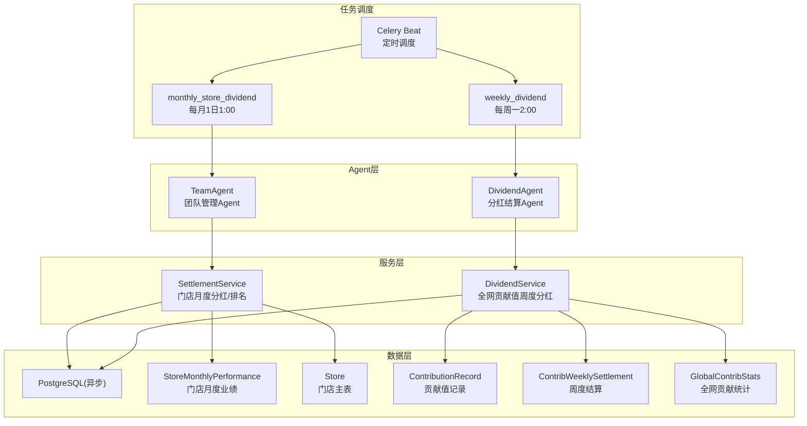
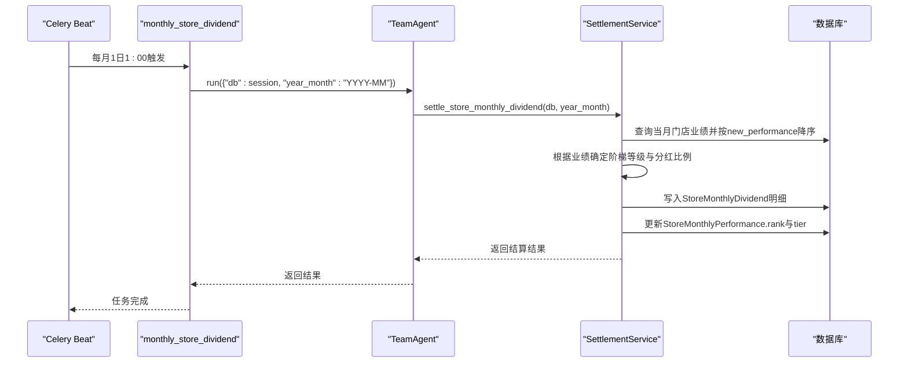
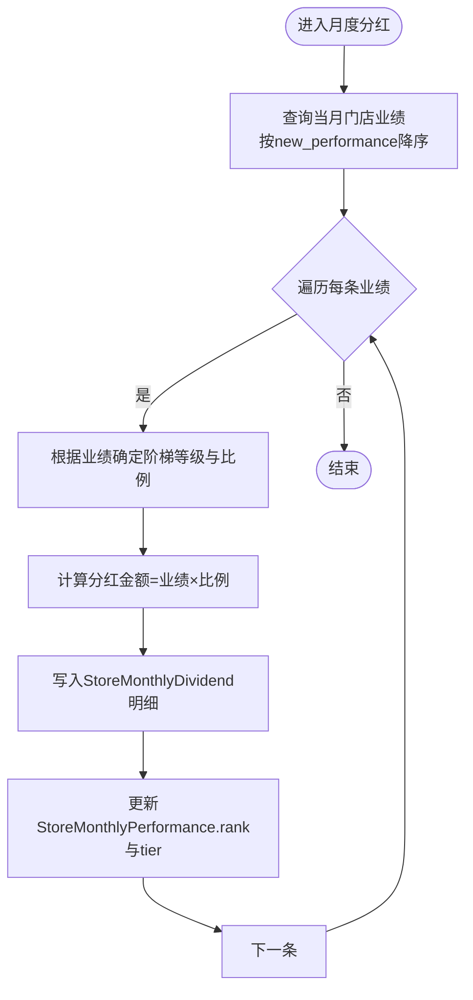
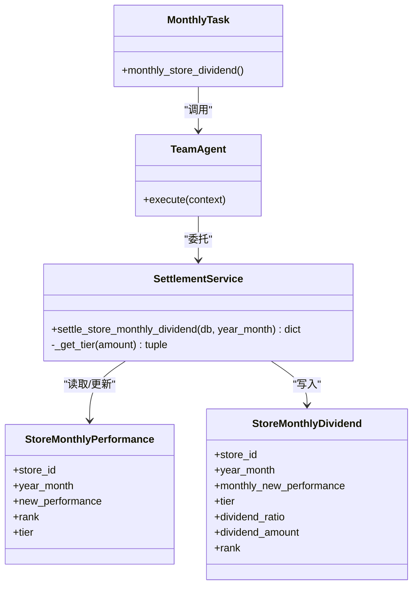
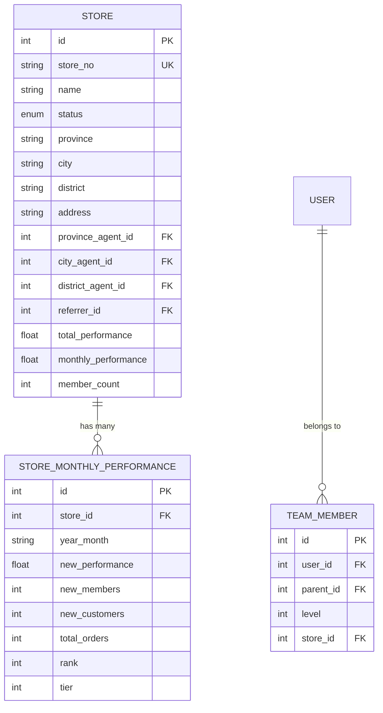
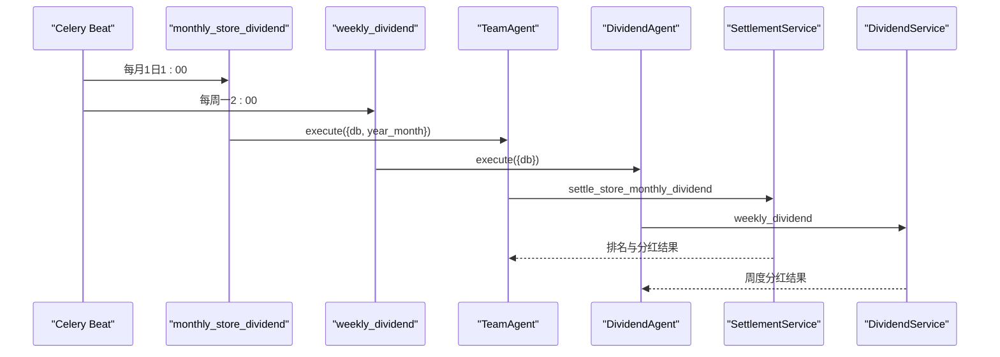

# 门店排名任务

<cite>
**本文引用的文件列表**
- [store_rank_tasks.py](file://backend/app/tasks/store_rank_tasks.py)
- [celery_app.py](file://backend/app/tasks/celery_app.py)
- [all_agents.py](file://backend/app/agents/all_agents.py)
- [settlement_service.py](file://backend/app/services/settlement_service.py)
- [store.py](file://backend/app/models/store.py)
- [contribution.py](file://backend/app/models/contribution.py)
- [dividend_tasks.py](file://backend/app/tasks/dividend_tasks.py)
- [dividend_service.py](file://backend/app/services/dividend_service.py)
- [contribution_service.py](file://backend/app/services/contribution_service.py)
- [config.py](file://backend/app/config.py)
- [database.py](file://backend/app/database.py)
- [store.py](file://backend/app/api/v1/store.py)
- [store_service.py](file://backend/app/services/store_service.py)
</cite>

## 目录
1. [简介](#简介)
2. [项目结构](#项目结构)
3. [核心组件](#核心组件)
4. [架构总览](#架构总览)
5. [详细组件分析](#详细组件分析)
6. [依赖关系分析](#依赖关系分析)
7. [性能与扩展性](#性能与扩展性)
8. [故障排查指南](#故障排查指南)
9. [结论](#结论)
10. [附录](#附录)

## 简介
本技术文档聚焦于AIxingmu的“门店月度排名与分红”异步任务系统，围绕以下目标展开：
- 月度门店排名与阶梯分红的实现机制
- 门店业绩统计、排名计算算法、阶梯分红规则等业务逻辑
- 数据聚合过程、排序规则、分红金额计算
- 门店层级关系的数据查询优化、大数据量处理的分页策略与缓存建议
- 排名结果验证方法、历史数据归档与审计追踪
- 多门店并发处理时的锁机制与数据冲突解决方案

## 项目结构
与门店排名与分红相关的后端代码主要分布在如下模块：
- 定时任务调度：Celery Beat 配置与任务入口
- Agent编排：团队管理Agent负责调用结算服务完成月度排名与分红
- 业务服务：结算服务实现门店月度阶梯分红与排名落库
- 数据模型：门店、团队成员、门店月度业绩表等
- API接口：提供门店排名查询能力
- 数据库与会话：异步会话工厂与连接池配置

图表来源
- [celery_app.py:24-55](file://backend/app/tasks/celery_app.py#L24-L55)
- [store_rank_tasks.py:15-28](file://backend/app/tasks/store_rank_tasks.py#L15-L28)
- [dividend_tasks.py:15-25](file://backend/app/tasks/dividend_tasks.py#L15-L25)
- [all_agents.py:83-94](file://backend/app/agents/all_agents.py#L83-L94)
- [all_agents.py:52-62](file://backend/app/agents/all_agents.py#L52-L62)
- [settlement_service.py:88-133](file://backend/app/services/settlement_service.py#L88-L133)
- [dividend_service.py:20-123](file://backend/app/services/dividend_service.py#L20-L123)
- [store.py:83-104](file://backend/app/models/store.py#L83-L104)
- [contribution.py:32-115](file://backend/app/models/contribution.py#L32-L115)

章节来源
- [celery_app.py:24-55](file://backend/app/tasks/celery_app.py#L24-L55)
- [store_rank_tasks.py:15-28](file://backend/app/tasks/store_rank_tasks.py#L15-L28)
- [dividend_tasks.py:15-25](file://backend/app/tasks/dividend_tasks.py#L15-L25)
- [all_agents.py:83-94](file://backend/app/agents/all_agents.py#L83-L94)
- [all_agents.py:52-62](file://backend/app/agents/all_agents.py#L52-L62)
- [settlement_service.py:88-133](file://backend/app/services/settlement_service.py#L88-L133)
- [dividend_service.py:20-123](file://backend/app/services/dividend_service.py#L20-L123)
- [store.py:83-104](file://backend/app/models/store.py#L83-L104)
- [contribution.py:32-115](file://backend/app/models/contribution.py#L32-L115)

## 核心组件
- 月度任务入口：每月1日凌晨1点触发门店月度排名与分红
- 团队管理Agent：封装月度结算流程，调用结算服务
- 结算服务：按门店当月新增业绩进行排名与阶梯分红计算，写入排名与分红明细
- 数据模型：门店月度业绩表包含排名与阶梯等级字段，支持唯一索引避免重复
- 周度分红任务：每周一凌晨2点执行全网贡献值分红（与门店排名并行但独立）

章节来源
- [store_rank_tasks.py:15-28](file://backend/app/tasks/store_rank_tasks.py#L15-L28)
- [all_agents.py:83-94](file://backend/app/agents/all_agents.py#L83-L94)
- [settlement_service.py:88-133](file://backend/app/services/settlement_service.py#L88-L133)
- [store.py:83-104](file://backend/app/models/store.py#L83-L104)
- [dividend_tasks.py:15-25](file://backend/app/tasks/dividend_tasks.py#L15-L25)
- [dividend_service.py:20-123](file://backend/app/services/dividend_service.py#L20-L123)

## 架构总览
月度门店排名与分红的关键调用链如下：
- Celery Beat 在每月1日1:00触发 monthly_store_dividend
- 任务内创建 TeamAgent，传入当前月的前一月作为统计周期
- TeamAgent.execute 调用 SettlementService.settle_store_monthly_dividend
- 结算服务读取该月的门店月度业绩，按业绩降序排名并计算阶梯分红比例
- 写入 StoreMonthlyDividend 明细，更新 StoreMonthlyPerformance.rank 与 tier

图表来源
- [celery_app.py:50-54](file://backend/app/tasks/celery_app.py#L50-L54)
- [store_rank_tasks.py:15-28](file://backend/app/tasks/store_rank_tasks.py#L15-L28)
- [all_agents.py:83-94](file://backend/app/agents/all_agents.py#L83-L94)
- [settlement_service.py:88-133](file://backend/app/services/settlement_service.py#L88-L133)
- [store.py:83-104](file://backend/app/models/store.py#L83-L104)

## 详细组件分析

### 月度任务入口与Agent编排
- 任务定义：monthly_store_dividend 使用异步会话工厂，计算上月年月，构造 TeamAgent 并执行
- Agent职责：接收上下文中的数据库会话与年月参数，委托给结算服务完成月度分红与排名
- 事务边界：任务中开启会话并在Agent执行后提交，确保一致性

章节来源
- [store_rank_tasks.py:15-28](file://backend/app/tasks/store_rank_tasks.py#L15-L28)
- [all_agents.py:83-94](file://backend/app/agents/all_agents.py#L83-L94)
- [database.py:17-21](file://backend/app/database.py#L17-L21)

### 门店月度排名与阶梯分红（结算服务）
- 数据源：StoreMonthlyPerformance 表中指定年月的门店业绩
- 排序规则：按 new_performance 降序排列，逐条赋予 rank
- 阶梯规则：依据配置阈值判断等级与分红比例，计算分红金额
- 持久化：写入 StoreMonthlyDividend 明细；同时更新 StoreMonthlyPerformance.rank 与 tier
- 幂等性：按月+门店唯一索引保证同月同一门店仅一条业绩记录，避免重复累计

图表来源
- [settlement_service.py:88-133](file://backend/app/services/settlement_service.py#L88-L133)
- [store.py:83-104](file://backend/app/models/store.py#L83-L104)

章节来源
- [settlement_service.py:88-133](file://backend/app/services/settlement_service.py#L88-L133)
- [store.py:83-104](file://backend/app/models/store.py#L83-L104)

### 门店月度业绩聚合与更新
- 聚合入口：StoreService.update_monthly_performance 用于增量累加当月业绩、会员数、订单数等
- 同步更新：同时维护 Store.total_performance 与 Store.monthly_performance
- 去重与幂等：基于 (store_id, year_month) 唯一索引，存在则累加，不存在则新建

章节来源
- [store_service.py:55-99](file://backend/app/services/store_service.py#L55-L99)
- [store.py:83-104](file://backend/app/models/store.py#L83-L104)

### 排名查询API
- 接口：GET /api/v1/stores/ranking?year_month=YYYY-MM
- 行为：默认取当前年月，返回指定月份的门店排名列表（按new_performance降序）
- 分页：当前实现未内置分页，可通过limit控制返回数量

章节来源
- [store.py:26-36](file://backend/app/api/v1/store.py#L26-L36)
- [store_service.py:121-133](file://backend/app/services/store_service.py#L121-L133)

### 周度贡献值分红（并行任务）
- 触发时间：每周一凌晨2:00
- 计算逻辑：个人消费券分红 = 个人贡献值 / 全网总贡献值 × 平台20%收益池
- 记录：写入 ContribWeeklySettlement 与 GlobalContribStats，标记已分红记录
- 与门店排名任务相互独立，互不影响

章节来源
- [dividend_tasks.py:15-25](file://backend/app/tasks/dividend_tasks.py#L15-L25)
- [dividend_service.py:20-123](file://backend/app/services/dividend_service.py#L20-L123)
- [contribution.py:72-115](file://backend/app/models/contribution.py#L72-L115)

### 配置与阈值
- 门店阶梯阈值与分红比例由全局配置集中管理，便于运营调整
- 关键配置项包括各阶梯最小值、最大值及对应分红比例

章节来源
- [config.py:112-123](file://backend/app/config.py#L112-L123)

## 依赖关系分析
- 任务调度依赖 Celery Beat 与 Broker/Backend 配置
- 任务通过 Agent 解耦业务逻辑，Agent 再调用 Service
- Service 直接操作 SQLAlchemy 异步会话，读写模型表
- 模型表之间存在外键与索引约束，保障数据一致性与查询性能

图表来源
- [store_rank_tasks.py:15-28](file://backend/app/tasks/store_rank_tasks.py#L15-L28)
- [all_agents.py:83-94](file://backend/app/agents/all_agents.py#L83-L94)
- [settlement_service.py:88-133](file://backend/app/services/settlement_service.py#L88-L133)
- [store.py:83-104](file://backend/app/models/store.py#L83-L104)

章节来源
- [store_rank_tasks.py:15-28](file://backend/app/tasks/store_rank_tasks.py#L15-L28)
- [all_agents.py:83-94](file://backend/app/agents/all_agents.py#L83-L94)
- [settlement_service.py:88-133](file://backend/app/services/settlement_service.py#L88-L133)
- [store.py:83-104](file://backend/app/models/store.py#L83-L104)

## 性能与扩展性

### 数据聚合与排序优化
- 月度排名查询按 new_performance 降序排序，建议在相关列建立索引以提升性能
- 若门店规模较大，可考虑对 StoreMonthlyPerformance 增加复合索引以加速过滤与排序

章节来源
- [store.py:83-104](file://backend/app/models/store.py#L83-L104)

### 大数据量分页策略
- 当前排名查询未内置分页，可在API层引入 offset/limit 或游标分页
- 对于超大规模数据，建议使用物化视图或预聚合表，定期刷新以减少实时计算压力

章节来源
- [store.py:26-36](file://backend/app/api/v1/store.py#L26-L36)
- [store_service.py:121-133](file://backend/app/services/store_service.py#L121-L133)

### 缓存机制建议
- 将月度排名结果缓存至 Redis，设置合理过期时间（如次月1日重置）
- 缓存键可按 year_month 维度组织，减少数据库压力
- 注意缓存失效策略与一致性校验

[本节为通用建议，不直接分析具体文件]

### 并发与锁机制
- 月度任务由 Celery 单实例调度，天然串行执行，避免同月重复计算
- 如需水平扩展多worker，应引入分布式锁（如Redis SETNX）确保同月同门店仅一次写入
- 针对 StoreMonthlyPerformance 的唯一索引可防止重复插入，但仍需应用层锁保护排名更新阶段

章节来源
- [celery_app.py:50-54](file://backend/app/tasks/celery_app.py#L50-L54)
- [store.py:83-104](file://backend/app/models/store.py#L83-L104)

### 事务与一致性
- 任务中统一使用 async_session_factory 管理会话，Agent执行完成后提交
- 建议将排名与分红写入置于同一事务，失败时整体回滚，保证数据一致性

章节来源
- [store_rank_tasks.py:15-28](file://backend/app/tasks/store_rank_tasks.py#L15-L28)
- [database.py:17-21](file://backend/app/database.py#L17-L21)

## 故障排查指南
- 任务未触发
  - 检查 Celery Beat 是否运行且配置了 monthly-store-dividend 调度
  - 确认 Broker/Backend 连通性与时区设置
- 排名为空或异常
  - 核对当月 StoreMonthlyPerformance 是否有有效业绩记录
  - 检查排序字段 new_performance 是否为空或负数
- 分红金额不正确
  - 核查配置中的阶梯阈值与分红比例
  - 确认业绩聚合是否正确累加
- 并发冲突
  - 若部署多worker，确认是否引入分布式锁
  - 观察是否存在重复写入或覆盖问题

章节来源
- [celery_app.py:50-54](file://backend/app/tasks/celery_app.py#L50-L54)
- [store.py:83-104](file://backend/app/models/store.py#L83-L104)
- [config.py:112-123](file://backend/app/config.py#L112-L123)

## 结论
门店月度排名与分红任务通过 Celery 定时调度、Agent 编排与服务层计算，实现了稳定的月度结算流程。其核心在于：
- 明确的排序与阶梯分红规则
- 幂等的业绩聚合与排名落库
- 可扩展的分页与缓存方案
- 并发场景下的锁与一致性保障

建议在生产环境完善分布式锁、分页查询与缓存策略，并加强监控与审计，以确保高可用与可追溯。

## 附录

### 数据模型概览

图表来源
- [store.py:22-104](file://backend/app/models/store.py#L22-L104)

### 月度任务时序图（含周度分红对比）

图表来源
- [celery_app.py:40-54](file://backend/app/tasks/celery_app.py#L40-L54)
- [store_rank_tasks.py:15-28](file://backend/app/tasks/store_rank_tasks.py#L15-L28)
- [dividend_tasks.py:15-25](file://backend/app/tasks/dividend_tasks.py#L15-L25)
- [all_agents.py:83-94](file://backend/app/agents/all_agents.py#L83-L94)
- [all_agents.py:52-62](file://backend/app/agents/all_agents.py#L52-L62)
- [settlement_service.py:88-133](file://backend/app/services/settlement_service.py#L88-L133)
- [dividend_service.py:20-123](file://backend/app/services/dividend_service.py#L20-L123)