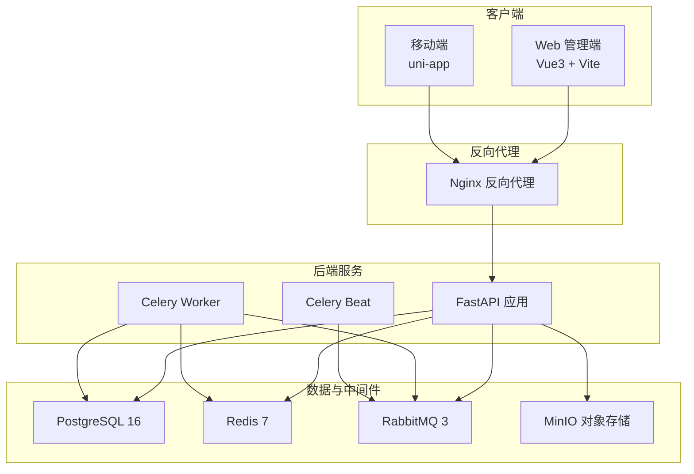
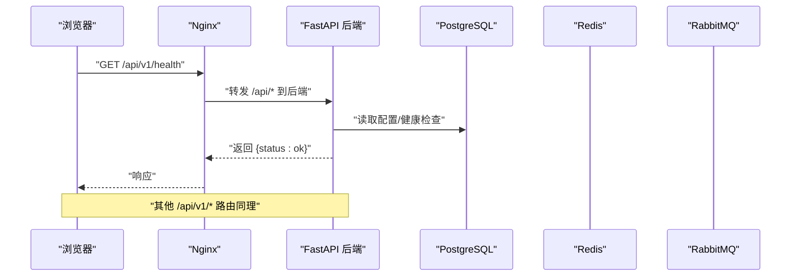
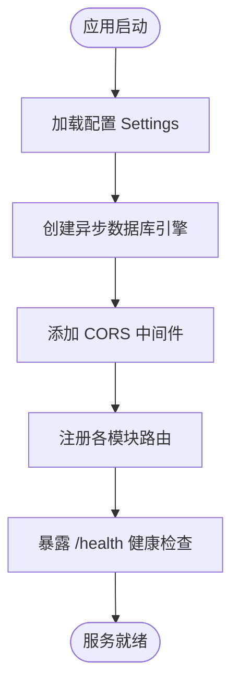
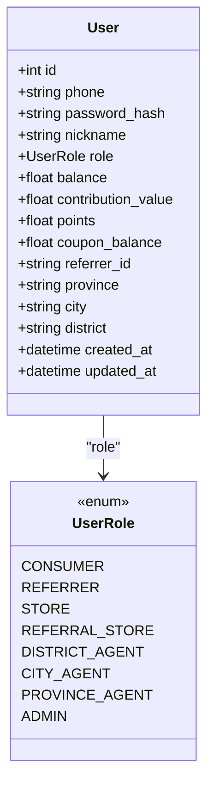
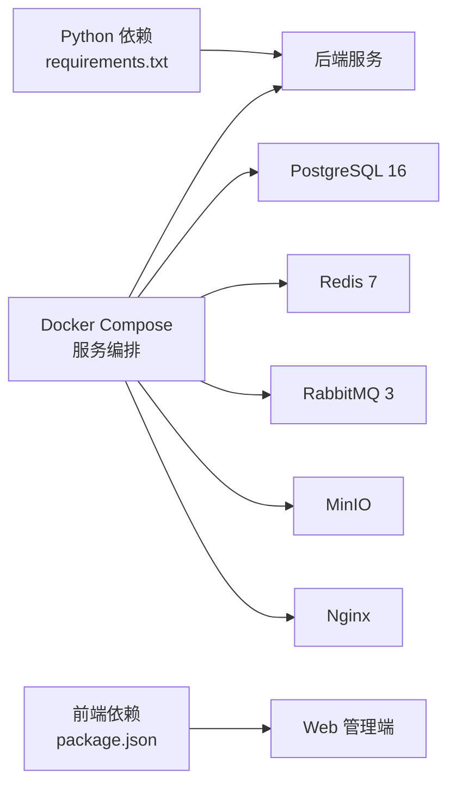

# 快速开始

<cite>
**本文引用的文件**   
- [backend/requirements.txt](file://backend/requirements.txt)
- [docker-compose.yml](file://docker-compose.yml)
- [nginx.conf](file://nginx.conf)
- [backend/Dockerfile](file://backend/Dockerfile)
- [backend/app/config.py](file://backend/app/config.py)
- [backend/app/main.py](file://backend/app/main.py)
- [backend/app/database.py](file://backend/app/database.py)
- [backend/app/api/v1/auth.py](file://backend/app/api/v1/auth.py)
- [backend/app/models/user.py](file://backend/app/models/user.py)
- [frontend/web-admin/package.json](file://frontend/web-admin/package.json)
- [frontend/web-admin/src/main.ts](file://frontend/web-admin/src/main.ts)
</cite>

## 目录
1. [简介](#简介)
2. [项目结构](#项目结构)
3. [核心组件](#核心组件)
4. [架构总览](#架构总览)
5. [详细组件分析](#详细组件分析)
6. [依赖关系分析](#依赖关系分析)
7. [性能与扩展建议](#性能与扩展建议)
8. [故障排查指南](#故障排查指南)
9. [结论](#结论)
10. [附录](#附录)

## 简介
本指南面向首次接触 AIxingmu 项目的开发者，帮助你在最短时间内完成环境准备、本地开发、容器化部署以及第一个 API 调用验证。项目采用 FastAPI + SQLAlchemy(异步) + PostgreSQL + Redis + RabbitMQ + MinIO 的现代化技术栈，并提供 Web 管理端（Vue3 + Vite）和移动端（uni-app）前端工程。

## 项目结构
- 后端：FastAPI 应用，包含路由、模型、服务、任务等模块；提供 Dockerfile 与依赖清单。
- 前端：Web 管理端（Vue3 + Vite），移动端（uni-app）。
- 基础设施：docker-compose 编排 PostgreSQL、Redis、RabbitMQ、MinIO、Nginx 及后端服务。

图表来源
- [docker-compose.yml:1-111](file://docker-compose.yml#L1-L111)
- [nginx.conf:1-39](file://nginx.conf#L1-L39)
- [backend/app/main.py:1-59](file://backend/app/main.py#L1-L59)

章节来源
- [docker-compose.yml:1-111](file://docker-compose.yml#L1-L111)
- [nginx.conf:1-39](file://nginx.conf#L1-L39)
- [backend/app/main.py:1-59](file://backend/app/main.py#L1-L59)

## 核心组件
- 后端入口与生命周期：应用启动时自动创建数据库表（开发模式），注册路由与 CORS 中间件，暴露健康检查接口。
- 配置中心：集中管理数据库、缓存、消息队列、CORS、对象存储、业务参数等环境变量。
- 数据库连接：基于 SQLAlchemy 异步引擎与会话工厂，提供依赖注入获取会话。
- 认证路由：提供注册与登录接口，返回访问令牌。
- 用户模型：定义用户角色、钱包资产、推荐关系、索引等。
- 前端工程：Web 管理端使用 Vue3 + Vite，提供开发与构建脚本。

章节来源
- [backend/app/main.py:1-59](file://backend/app/main.py#L1-L59)
- [backend/app/config.py:1-136](file://backend/app/config.py#L1-136)
- [backend/app/database.py:1-40](file://backend/app/database.py#L1-40)
- [backend/app/api/v1/auth.py:1-43](file://backend/app/api/v1/auth.py#L1-43)
- [backend/app/models/user.py:1-93](file://backend/app/models/user.py#L1-93)
- [frontend/web-admin/package.json:1-28](file://frontend/web-admin/package.json#L1-28)

## 架构总览
下图展示了从浏览器到后端服务的请求链路，以及 Nginx 对 API 与静态资源的转发策略。

图表来源
- [nginx.conf:1-39](file://nginx.conf#L1-L39)
- [backend/app/main.py:1-59](file://backend/app/main.py#L1-L59)

## 详细组件分析

### 后端服务（FastAPI）
- 启动流程：加载配置 -> 创建异步引擎 -> 注册中间件与路由 -> 暴露文档与健康检查。
- 生命周期：启动时执行 Base.metadata.create_all（开发阶段），关闭时释放引擎资源。
- 路由组织：按功能划分 auth、user、product、group-buy、contribution、points、coupon、store、admin 等子路由。

图表来源
- [backend/app/main.py:1-59](file://backend/app/main.py#L1-L59)
- [backend/app/config.py:1-136](file://backend/app/config.py#L1-136)
- [backend/app/database.py:1-40](file://backend/app/database.py#L1-40)

章节来源
- [backend/app/main.py:1-59](file://backend/app/main.py#L1-L59)
- [backend/app/config.py:1-136](file://backend/app/config.py#L1-136)
- [backend/app/database.py:1-40](file://backend/app/database.py#L1-40)

### 认证与用户模型
- 认证接口：提供注册与登录，校验手机号唯一性、密码哈希比对，生成并返回访问令牌。
- 用户模型：包含角色枚举、钱包字段（余额、贡献值、积分、消费券）、推荐关系、区域信息、时间戳与索引。

图表来源
- [backend/app/models/user.py:1-93](file://backend/app/models/user.py#L1-93)

章节来源
- [backend/app/api/v1/auth.py:1-43](file://backend/app/api/v1/auth.py#L1-43)
- [backend/app/models/user.py:1-93](file://backend/app/models/user.py#L1-93)

### 前端工程（Web 管理端）
- 技术栈：Vue3、Pinia、Element Plus、ECharts、Vite。
- 开发命令：通过 package.json 中的 dev/build/preview 脚本运行。
- 入口文件：main.ts 初始化应用、插件与路由。

章节来源
- [frontend/web-admin/package.json:1-28](file://frontend/web-admin/package.json#L1-28)
- [frontend/web-admin/src/main.ts:1-13](file://frontend/web-admin/src/main.ts#L1-13)

## 依赖关系分析
- Python 依赖：FastAPI、Uvicorn、SQLAlchemy(asyncpg)、Alembic、Pydantic v2、JWT、Passlib、Celery、Redis、MinIO、LangChain/LangGraph/OpenAI、HTTPX、python-dotenv 等。
- 容器编排：PostgreSQL 16、Redis 7、RabbitMQ 3、MinIO、Nginx、后端服务、Celery Worker/Beat。
- 前端依赖：Vue3、Router、Pinia、Element Plus、Axios、ECharts 等。

图表来源
- [backend/requirements.txt:1-34](file://backend/requirements.txt#L1-34)
- [docker-compose.yml:1-111](file://docker-compose.yml#L1-L111)
- [frontend/web-admin/package.json:1-28](file://frontend/web-admin/package.json#L1-28)

章节来源
- [backend/requirements.txt:1-34](file://backend/requirements.txt#L1-34)
- [docker-compose.yml:1-111](file://docker-compose.yml#L1-L111)
- [frontend/web-admin/package.json:1-28](file://frontend/web-admin/package.json#L1-28)

## 性能与扩展建议
- 数据库连接池：根据并发量调整 pool_size 与 max_overflow，避免连接耗尽。
- 异步任务：合理拆分 Celery Worker 数量，结合 Redis/RabbitMQ 监控队列积压情况。
- 缓存策略：热点数据优先落 Redis，注意键空间设计与过期策略。
- 对象存储：图片/文件上传走 MinIO，配合 CDN 提升静态资源访问速度。
- 反向代理：Nginx 开启 gzip、静态资源缓存，减少后端压力。

[本节为通用建议，不直接分析具体文件]

## 故障排查指南
- 端口冲突
  - 现象：本机已占用 5432/6379/5672/9000/8000/80 等端口导致服务无法启动。
  - 处理：修改 docker-compose.yml 中映射端口或停止占用进程。
- 数据库连接失败
  - 现象：后端启动报错或健康检查异常。
  - 处理：确认 DATABASE_URL 指向正确的 host/port/dbname；确保 PostgreSQL 容器健康。
- Redis 不可用
  - 现象：缓存读写失败或任务调度异常。
  - 处理：检查 REDIS_URL 与容器状态；确认防火墙放行 6379。
- RabbitMQ 连接错误
  - 现象：Celery Worker/Beat 无法消费任务。
  - 处理：核对 CELERY_BROKER_URL 与默认账号；访问管理界面 15672 验证。
- CORS 跨域问题
  - 现象：前端调用被浏览器拦截。
  - 处理：在配置中设置 CORS_ORIGINS 为允许的前端域名；或通过 Nginx 统一代理。
- 前端无法访问后端 API
  - 现象：浏览器控制台报网络错误或跨域。
  - 处理：确认 Nginx 将 /api/* 正确转发至后端；或在前端开发服务器中配置代理。
- 对象存储不可用
  - 现象：上传/下载失败。
  - 处理：检查 MINIO_* 配置与容器 9000/9001 端口；确认桶存在且权限正确。

章节来源
- [docker-compose.yml:1-111](file://docker-compose.yml#L1-L111)
- [backend/app/config.py:1-136](file://backend/app/config.py#L1-136)
- [backend/app/main.py:1-59](file://backend/app/main.py#L1-L59)
- [nginx.conf:1-39](file://nginx.conf#L1-L39)

## 结论
通过本指南，你可以快速完成 AIxingmu 的环境准备、本地开发与容器化部署，并成功进行首个 API 调用与前端页面访问验证。建议在后续迭代中完善 Alembic 迁移、日志与监控、密钥管理与灰度发布流程。

[本节为总结性内容，不直接分析具体文件]

## 附录

### 环境准备要求
- Python 3.11+（用于本地后端开发）
- Node.js 18+（用于前端开发）
- 可选：Docker 与 Docker Compose（一键拉起所有依赖服务）

章节来源
- [backend/Dockerfile:1-13](file://backend/Dockerfile#L1-13)
- [frontend/web-admin/package.json:1-28](file://frontend/web-admin/package.json#L1-28)

### 本地开发环境搭建（无 Docker）
- 安装依赖
  - 后端：使用 requirements.txt 安装 Python 依赖。
  - 前端：进入 frontend/web-admin，安装 Node 依赖。
- 启动数据库与缓存
  - 本地安装并启动 PostgreSQL 16、Redis 7、RabbitMQ 3、MinIO（或使用 Docker 方式）。
- 配置环境变量
  - 参考 backend/app/config.py 中的默认值，设置 DATABASE_URL、REDIS_URL、CELERY_*、MINIO_*、CORS_ORIGINS 等。
- 启动后端
  - 使用 Uvicorn 启动 app.main:app，监听 8000 端口。
- 启动前端
  - 在 frontend/web-admin 下执行开发脚本，启动 Vite 开发服务器。
- 访问验证
  - 打开浏览器访问后端文档与健康检查地址，确认服务正常。

章节来源
- [backend/requirements.txt:1-34](file://backend/requirements.txt#L1-34)
- [backend/app/config.py:1-136](file://backend/app/config.py#L1-136)
- [backend/app/main.py:1-59](file://backend/app/main.py#L1-L59)
- [frontend/web-admin/package.json:1-28](file://frontend/web-admin/package.json#L1-28)

### Docker 容器化一键部署
- 启动全部服务
  - 在项目根目录执行 docker-compose up -d，将拉起 PostgreSQL、Redis、RabbitMQ、MinIO、Nginx 与后端服务。
- 访问地址
  - 后端 API：http://localhost:8000
  - API 文档：http://localhost:8000/api/docs
  - 健康检查：http://localhost:8000/health
  - Nginx 反向代理：http://localhost（/api/* 转发至后端）
- 停止服务
  - 执行 docker-compose down 清理容器与卷（如需保留数据请移除 -v）。

章节来源
- [docker-compose.yml:1-111](file://docker-compose.yml#L1-L111)
- [nginx.conf:1-39](file://nginx.conf#L1-L39)
- [backend/app/main.py:1-59](file://backend/app/main.py#L1-L59)

### 基础配置说明
- 环境变量与默认值
  - 数据库：DATABASE_URL、DATABASE_POOL_SIZE、DATABASE_MAX_OVERFLOW
  - 缓存：REDIS_URL
  - 任务队列：CELERY_BROKER_URL、CELERY_RESULT_BACKEND
  - 认证：SECRET_KEY、ALGORITHM、ACCESS_TOKEN_EXPIRE_MINUTES
  - 跨域：CORS_ORIGINS
  - 对象存储：MINIO_ENDPOINT、MINIO_ACCESS_KEY、MINIO_SECRET_KEY、MINIO_BUCKET
- 注意事项
  - 生产环境务必更换 SECRET_KEY 与数据库/缓存/对象存储凭据。
  - CORS_ORIGINS 在生产应限制为实际域名列表。

章节来源
- [backend/app/config.py:1-136](file://backend/app/config.py#L1-136)

### 第一个 API 调用示例
- 健康检查
  - GET http://localhost:8000/health
  - 预期返回包含 status 与 service 字段的 JSON。
- 用户注册
  - POST http://localhost:8000/api/v1/auth/register
  - 请求体包含手机号、密码、昵称、推荐人ID等字段。
  - 成功后返回 access_token 与 user_id。
- 用户登录
  - POST http://localhost:8000/api/v1/auth/login
  - 请求体包含手机号与密码。
  - 成功后返回 access_token 与 user_id。
- 携带令牌访问受保护接口
  - 在后续请求头中携带 Authorization: Bearer <access_token>。

章节来源
- [backend/app/main.py:1-59](file://backend/app/main.py#L1-L59)
- [backend/app/api/v1/auth.py:1-43](file://backend/app/api/v1/auth.py#L1-43)

### 前端页面访问验证
- 启动前端开发服务器
  - 进入 frontend/web-admin，执行开发脚本以启动 Vite。
- 访问管理后台
  - 打开浏览器访问本地开发服务器地址（通常为 http://localhost:5173）。
- 登录与导航
  - 使用注册的账号登录，进入 Dashboard、商品、门店、拼团等页面进行基本验证。

章节来源
- [frontend/web-admin/package.json:1-28](file://frontend/web-admin/package.json#L1-28)
- [frontend/web-admin/src/main.ts:1-13](file://frontend/web-admin/src/main.ts#L1-13)

### 常见问题与解决
- 依赖冲突
  - Python 版本不一致：确保使用 3.11+；必要时使用虚拟环境隔离。
  - Node 版本过低：升级至 18+，并使用 npm/yarn/pnpm 锁定版本。
- 数据库迁移
  - 开发阶段自动建表；生产建议使用 Alembic 管理迁移脚本。
- 跨域问题
  - 调整 CORS_ORIGINS 或在 Nginx 层统一代理前后端。
- 任务未执行
  - 检查 Celery Worker/Beat 是否启动，确认 Broker 与 Backend 配置一致。

章节来源
- [backend/app/config.py:1-136](file://backend/app/config.py#L1-136)
- [backend/app/main.py:1-59](file://backend/app/main.py#L1-L59)
- [docker-compose.yml:1-111](file://docker-compose.yml#L1-L111)